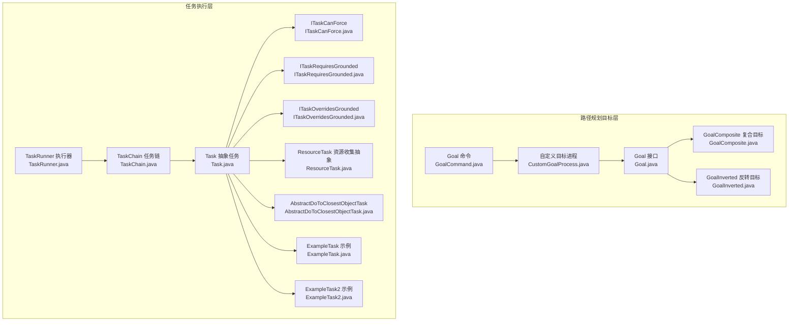
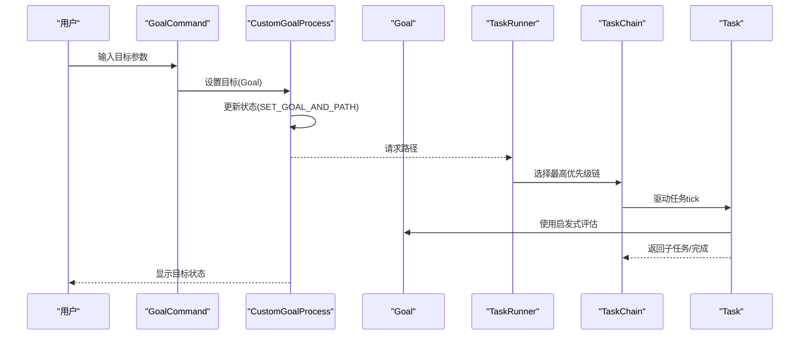
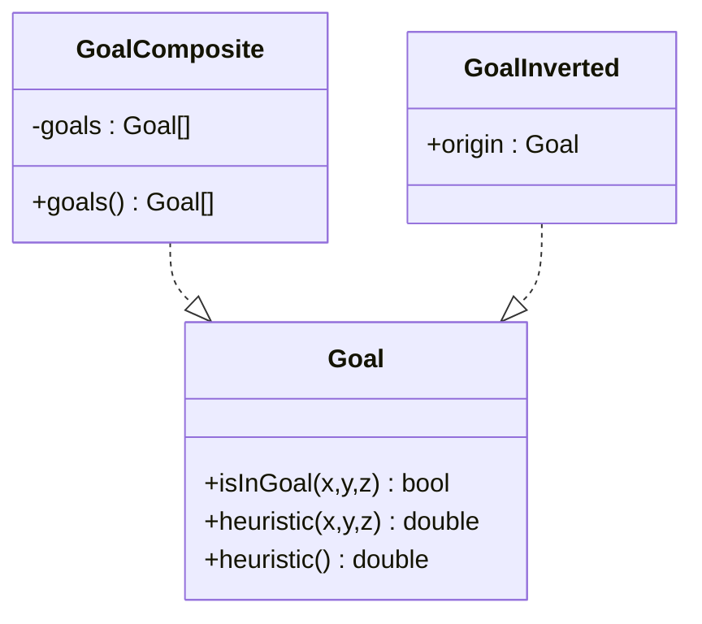
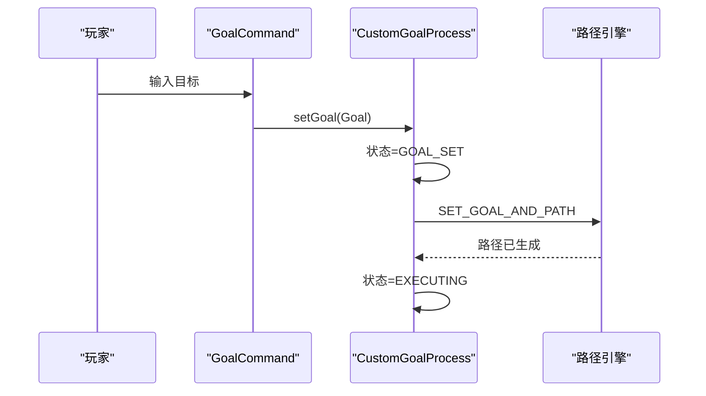
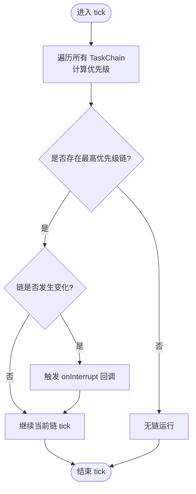
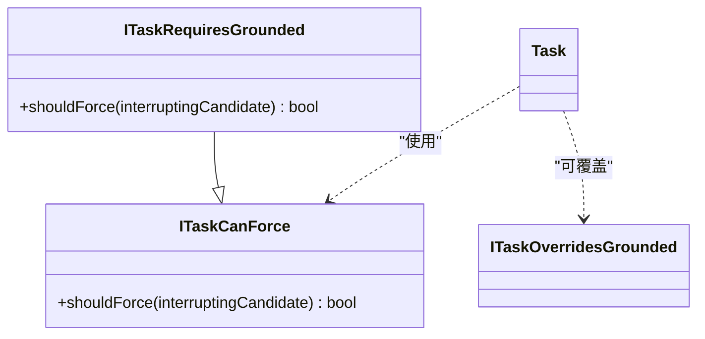
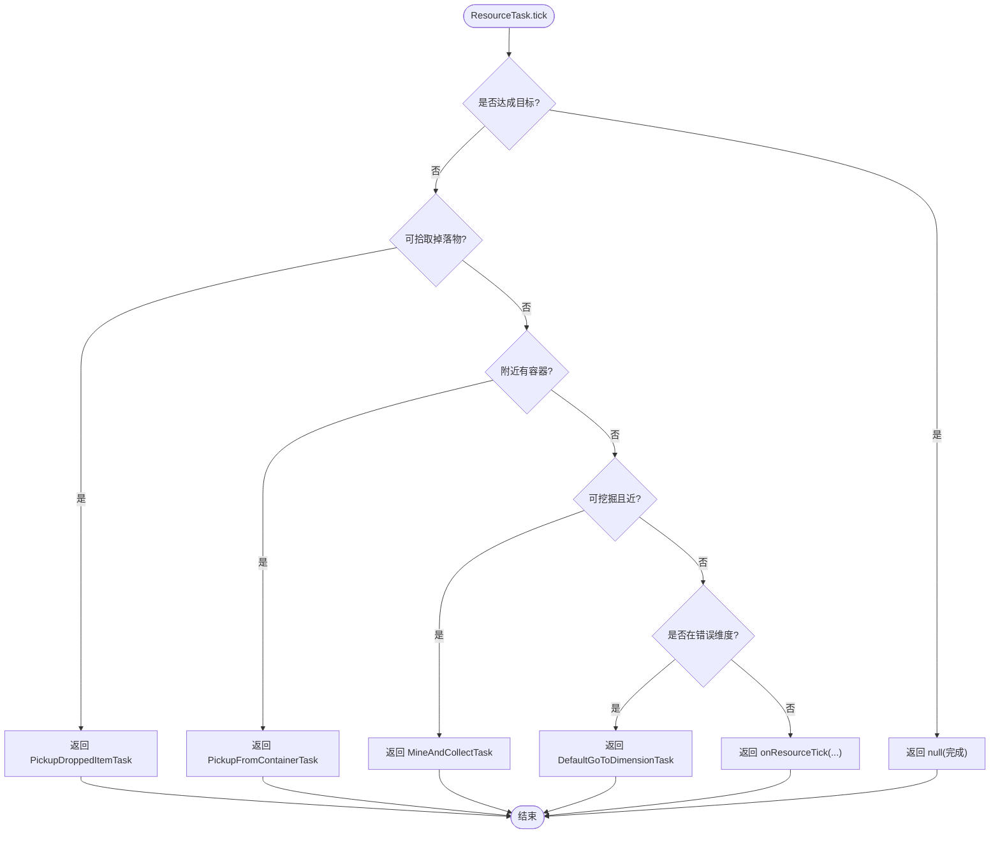
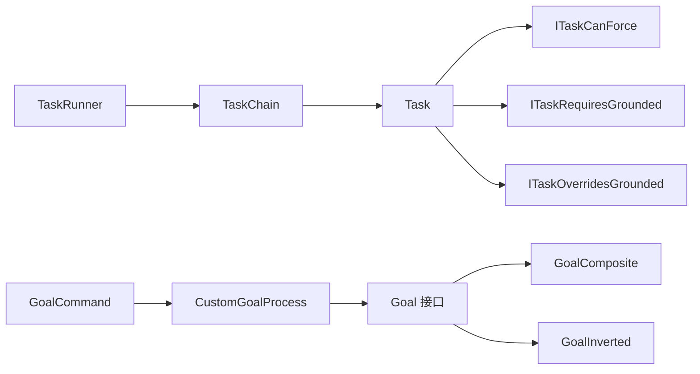

# 目标管理系统

<cite>
**本文引用的文件**
- [Goal.java](file://src/main/java/baritone/api/pathing/goals/Goal.java)
- [GoalComposite.java](file://src/main/java/baritone/api/pathing/goals/GoalComposite.java)
- [GoalInverted.java](file://src/main/java/baritone/api/pathing/goals/GoalInverted.java)
- [GoalCommand.java](file://src/main/java/baritone/command/defaults/GoalCommand.java)
- [CustomGoalProcess.java](file://src/main/java/baritone/process/CustomGoalProcess.java)
- [Task.java](file://src/main/java/adris/altoclef/tasksystem/Task.java)
- [TaskChain.java](file://src/main/java/adris/altoclef/tasksystem/TaskChain.java)
- [TaskRunner.java](file://src/main/java/adris/altoclef/tasksystem/TaskRunner.java)
- [ITaskCanForce.java](file://src/main/java/adris/altoclef/tasksystem/ITaskCanForce.java)
- [ITaskRequiresGrounded.java](file://src/main/java/adris/altoclef/tasksystem/ITaskRequiresGrounded.java)
- [ITaskOverridesGrounded.java](file://src/main/java/adris/altoclef/tasksystem/ITaskOverridesGrounded.java)
- [ResourceTask.java](file://src/main/java/adris/altoclef/tasks/ResourceTask.java)
- [AbstractDoToClosestObjectTask.java](file://src/main/java/adris/altoclef/tasks/AbstractDoToClosestObjectTask.java)
- [ExampleTask.java](file://src/main/java/adris/altoclef/tasks/examples/ExampleTask.java)
- [ExampleTask2.java](file://src/main/java/adris/altoclef/tasks/examples/ExampleTask2.java)
</cite>

## 目录
1. [简介](#简介)
2. [项目结构](#项目结构)
3. [核心组件](#核心组件)
4. [架构总览](#架构总览)
5. [详细组件分析](#详细组件分析)
6. [依赖分析](#依赖分析)
7. [性能考虑](#性能考虑)
8. [故障排查指南](#故障排查指南)
9. [结论](#结论)
10. [附录](#附录)

## 简介
本文件面向“目标管理系统”的技术文档，围绕目标接口设计与多种目标类型的实现进行深入解析，涵盖单一目标、复合目标、动态目标等管理机制；详细说明目标的分解与组合策略（层次化分解、优先级管理、依赖关系处理）；解释动态目标更新机制（失效检测、新目标快速接入、冲突自动解决）；并提供可直接参考的代码示例路径，帮助读者创建自定义目标类型、实现目标组合逻辑、处理执行过程中的状态变化。最后给出扩展方法与性能优化建议。

## 项目结构
目标管理相关的核心代码分布在两个子系统中：
- 路径规划目标层：以 Goal 接口为核心，提供单一目标与复合目标等实现，并通过命令与进程对接到路径引擎。
- 任务执行层：以 Task/TaskChain/TaskRunner 为核心，负责任务优先级调度、中断与状态管理，以及与目标层的衔接。

图表来源
- [Goal.java:1-22](file://src/main/java/baritone/api/pathing/goals/Goal.java#L1-L22)
- [GoalComposite.java:1-54](file://src/main/java/baritone/api/pathing/goals/GoalComposite.java#L1-L54)
- [GoalInverted.java:1-30](file://src/main/java/baritone/api/pathing/goals/GoalInverted.java#L1-L30)
- [GoalCommand.java:1-41](file://src/main/java/baritone/command/defaults/GoalCommand.java#L1-L41)
- [CustomGoalProcess.java:70-97](file://src/main/java/baritone/process/CustomGoalProcess.java#L70-L97)
- [Task.java:1-181](file://src/main/java/adris/altoclef/tasksystem/Task.java#L1-L181)
- [TaskChain.java:1-51](file://src/main/java/adris/altoclef/tasksystem/TaskChain.java#L1-L51)
- [TaskRunner.java:1-98](file://src/main/java/adris/altoclef/tasksystem/TaskRunner.java#L1-L98)
- [ITaskCanForce.java:1-6](file://src/main/java/adris/altoclef/tasksystem/ITaskCanForce.java#L1-L6)
- [ITaskRequiresGrounded.java:1-16](file://src/main/java/adris/altoclef/tasksystem/ITaskRequiresGrounded.java#L1-L16)
- [ITaskOverridesGrounded.java:1-5](file://src/main/java/adris/altoclef/tasksystem/ITaskOverridesGrounded.java#L1-L5)
- [ResourceTask.java:1-242](file://src/main/java/adris/altoclef/tasks/ResourceTask.java#L1-L242)
- [AbstractDoToClosestObjectTask.java:1-143](file://src/main/java/adris/altoclef/tasks/AbstractDoToClosestObjectTask.java#L1-L143)
- [ExampleTask.java:1-68](file://src/main/java/adris/altoclef/tasks/examples/ExampleTask.java#L1-L68)
- [ExampleTask2.java:1-70](file://src/main/java/adris/altoclef/tasks/examples/ExampleTask2.java#L1-L70)

章节来源
- [Goal.java:1-22](file://src/main/java/baritone/api/pathing/goals/Goal.java#L1-L22)
- [Task.java:1-181](file://src/main/java/adris/altoclef/tasksystem/Task.java#L1-L181)
- [TaskChain.java:1-51](file://src/main/java/adris/altoclef/tasksystem/TaskChain.java#L1-L51)
- [TaskRunner.java:1-98](file://src/main/java/adris/altoclef/tasksystem/TaskRunner.java#L1-L98)

## 核心组件
- 目标接口与实现
  - Goal 接口定义了目标判定与启发式评估能力，是所有目标类型的统一抽象。
  - GoalComposite 提供“或”组合，适合多候选目标的择优。
  - GoalInverted 提供目标反转，用于“远离某区域”等场景。
- 任务系统
  - Task 抽象任务：生命周期管理（启动/停止/中断）、子任务嵌套、调试状态、可强制打断策略。
  - TaskChain 任务链：封装一组任务，提供优先级与活跃度判断。
  - TaskRunner 执行器：在每帧选择最高优先级的活动链并驱动其运行。
- 中断与强制
  - ITaskCanForce：定义“是否应强制打断当前子任务”的策略。
  - ITaskRequiresGrounded：基于物理状态（如漂浮/游泳/攀爬）决定是否允许打断。
  - ITaskOverridesGrounded：标记某些任务可覆盖地面要求，避免误打断。

章节来源
- [Goal.java:5-21](file://src/main/java/baritone/api/pathing/goals/Goal.java#L5-L21)
- [GoalComposite.java:5-53](file://src/main/java/baritone/api/pathing/goals/GoalComposite.java#L5-L53)
- [GoalInverted.java:3-29](file://src/main/java/baritone/api/pathing/goals/GoalInverted.java#L3-L29)
- [Task.java:17-164](file://src/main/java/adris/altoclef/tasksystem/Task.java#L17-L164)
- [TaskChain.java:7-36](file://src/main/java/adris/altoclef/tasksystem/TaskChain.java#L7-L36)
- [TaskRunner.java:22-58](file://src/main/java/adris/altoclef/tasksystem/TaskRunner.java#L22-L58)
- [ITaskCanForce.java:3-5](file://src/main/java/adris/altoclef/tasksystem/ITaskCanForce.java#L3-L5)
- [ITaskRequiresGrounded.java:5-14](file://src/main/java/adris/altoclef/tasksystem/ITaskRequiresGrounded.java#L5-L14)
- [ITaskOverridesGrounded.java:3-4](file://src/main/java/adris/altoclef/tasksystem/ITaskOverridesGrounded.java#L3-L4)

## 架构总览
目标管理由“目标层”和“任务层”协同完成：
- 目标层：Goal 接口及其实现（单点/复合/反转）对外暴露“是否到达/启发式距离”，并通过命令与进程接入路径引擎。
- 任务层：Task/TaskChain/TaskRunner 实现任务优先级调度、中断与状态管理，任务内部可返回子任务形成层级化执行树。
- 动态目标更新：通过命令设置/重置目标，进程根据状态机切换路径请求；任务层通过强制策略与中断机制实现动态切换。

图表来源
- [GoalCommand.java:24-40](file://src/main/java/baritone/command/defaults/GoalCommand.java#L24-L40)
- [CustomGoalProcess.java:70-97](file://src/main/java/baritone/process/CustomGoalProcess.java#L70-L97)
- [TaskRunner.java:22-58](file://src/main/java/adris/altoclef/tasksystem/TaskRunner.java#L22-L58)
- [TaskChain.java:16-30](file://src/main/java/adris/altoclef/tasksystem/TaskChain.java#L16-L30)
- [Task.java:17-49](file://src/main/java/adris/altoclef/tasksystem/Task.java#L17-L49)

## 详细组件分析

### 目标接口与复合目标
- Goal 接口
  - 定义 isInGoal 与 heuristic 两个核心方法，支持按坐标与按方块位置调用。
- GoalComposite
  - “或”组合多个目标，启发式取最小值，适合多候选目标的择优。
- GoalInverted
  - 对原目标取反，常用于“远离某区域”的场景。

图表来源
- [Goal.java:5-21](file://src/main/java/baritone/api/pathing/goals/Goal.java#L5-L21)
- [GoalComposite.java:5-53](file://src/main/java/baritone/api/pathing/goals/GoalComposite.java#L5-L53)
- [GoalInverted.java:3-29](file://src/main/java/baritone/api/pathing/goals/GoalInverted.java#L3-L29)

章节来源
- [Goal.java:5-21](file://src/main/java/baritone/api/pathing/goals/Goal.java#L5-L21)
- [GoalComposite.java:5-53](file://src/main/java/baritone/api/pathing/goals/GoalComposite.java#L5-L53)
- [GoalInverted.java:3-29](file://src/main/java/baritone/api/pathing/goals/GoalInverted.java#L3-L29)

### 动态目标更新与命令接入
- GoalCommand
  - 解析相对坐标/绝对坐标目标，设置到 CustomGoalProcess。
  - 支持重置目标（clear/reset/none）。
- CustomGoalProcess
  - 维护状态机：NONE → GOAL_SET → PATH_REQUESTED → EXECUTING。
  - 根据状态返回不同的路径命令，驱动路径引擎执行。

图表来源
- [GoalCommand.java:24-40](file://src/main/java/baritone/command/defaults/GoalCommand.java#L24-L40)
- [CustomGoalProcess.java:70-97](file://src/main/java/baritone/process/CustomGoalProcess.java#L70-L97)

章节来源
- [GoalCommand.java:18-41](file://src/main/java/baritone/command/defaults/GoalCommand.java#L18-L41)
- [CustomGoalProcess.java:70-97](file://src/main/java/baritone/process/CustomGoalProcess.java#L70-L97)

### 任务系统与优先级调度
- Task
  - 生命周期：start → tick → stop/interrupt。
  - 子任务嵌套与打断：onTick 可返回子任务，支持强制打断策略。
  - 调试状态与树形展示：便于定位执行路径。
- TaskChain
  - 封装一组任务，提供优先级与活跃度判断。
- TaskRunner
  - 每帧遍历所有链，选择最高优先级链执行；链切换时触发中断回调。

图表来源
- [TaskRunner.java:22-58](file://src/main/java/adris/altoclef/tasksystem/TaskRunner.java#L22-L58)
- [TaskChain.java:16-30](file://src/main/java/adris/altoclef/tasksystem/TaskChain.java#L16-L30)

章节来源
- [Task.java:17-164](file://src/main/java/adris/altoclef/tasksystem/Task.java#L17-L164)
- [TaskChain.java:7-36](file://src/main/java/adris/altoclef/tasksystem/TaskChain.java#L7-L36)
- [TaskRunner.java:22-58](file://src/main/java/adris/altoclef/tasksystem/TaskRunner.java#L22-L58)

### 强制打断与地面约束
- ITaskCanForce
  - 定义 shouldForce，决定是否允许打断当前子任务。
- ITaskRequiresGrounded
  - 若任务需要“着地/游泳/攀爬”等条件，且当前实体不满足，则阻止打断。
- ITaskOverridesGrounded
  - 标记可覆盖地面约束的任务类型，避免误打断。

图表来源
- [ITaskCanForce.java:3-5](file://src/main/java/adris/altoclef/tasksystem/ITaskCanForce.java#L3-L5)
- [ITaskRequiresGrounded.java:5-14](file://src/main/java/adris/altoclef/tasksystem/ITaskRequiresGrounded.java#L5-L14)
- [ITaskOverridesGrounded.java:3-4](file://src/main/java/adris/altoclef/tasksystem/ITaskOverridesGrounded.java#L3-L4)
- [Task.java:152-164](file://src/main/java/adris/altoclef/tasksystem/Task.java#L152-L164)

章节来源
- [ITaskCanForce.java:3-5](file://src/main/java/adris/altoclef/tasksystem/ITaskCanForce.java#L3-L5)
- [ITaskRequiresGrounded.java:5-14](file://src/main/java/adris/altoclef/tasksystem/ITaskRequiresGrounded.java#L5-L14)
- [ITaskOverridesGrounded.java:3-4](file://src/main/java/adris/altoclef/tasksystem/ITaskOverridesGrounded.java#L3-L4)
- [Task.java:152-164](file://src/main/java/adris/altoclef/tasksystem/Task.java#L152-L164)

### 资源收集与“最近对象”追踪
- ResourceTask
  - 抽象资源收集任务，内置拾取掉落物、打开容器、挖掘资源等流程。
  - 支持维度跳转、容器缓存、强制打断策略。
- AbstractDoToClosestObjectTask
  - 通用“追踪最近对象并接近”的框架，维护启发式缓存与重尝试逻辑，避免无效路径。

图表来源
- [ResourceTask.java:74-168](file://src/main/java/adris/altoclef/tasks/ResourceTask.java#L74-L168)

章节来源
- [ResourceTask.java:31-242](file://src/main/java/adris/altoclef/tasks/ResourceTask.java#L31-L242)
- [AbstractDoToClosestObjectTask.java:46-104](file://src/main/java/adris/altoclef/tasks/AbstractDoToClosestObjectTask.java#L46-L104)

### 示例任务与组合策略
- ExampleTask
  - 展示从“获取工具 → 获取材料 → 移动到目标 → 放置方块”的完整流程。
- ExampleTask2
  - 展示“寻找最近目标 → 超时漫游 → 到达目标”的策略。

章节来源
- [ExampleTask.java:21-47](file://src/main/java/adris/altoclef/tasks/examples/ExampleTask.java#L21-L47)
- [ExampleTask2.java:27-48](file://src/main/java/adris/altoclef/tasks/examples/ExampleTask2.java#L27-L48)

## 依赖分析
- 目标层依赖
  - Goal 接口被 GoalComposite/GoalInverted 实现；命令与进程通过 Goal 进行路径规划。
- 任务层依赖
  - Task 依赖 ITaskCanForce/ITaskRequiresGrounded/ITaskOverridesGrounded 控制打断行为；TaskChain/TaskRunner 提供调度。
- 任务与目标耦合
  - 任务内部可返回子任务形成树形结构；目标层通过进程与命令接入路径引擎。

图表来源
- [Goal.java:5-21](file://src/main/java/baritone/api/pathing/goals/Goal.java#L5-L21)
- [GoalComposite.java:5-53](file://src/main/java/baritone/api/pathing/goals/GoalComposite.java#L5-L53)
- [GoalInverted.java:3-29](file://src/main/java/baritone/api/pathing/goals/GoalInverted.java#L3-L29)
- [TaskRunner.java:22-58](file://src/main/java/adris/altoclef/tasksystem/TaskRunner.java#L22-L58)
- [TaskChain.java:16-30](file://src/main/java/adris/altoclef/tasksystem/TaskChain.java#L16-L30)
- [Task.java:152-164](file://src/main/java/adris/altoclef/tasksystem/Task.java#L152-L164)
- [GoalCommand.java:24-40](file://src/main/java/baritone/command/defaults/GoalCommand.java#L24-L40)
- [CustomGoalProcess.java:70-97](file://src/main/java/baritone/process/CustomGoalProcess.java#L70-L97)

章节来源
- [Goal.java:5-21](file://src/main/java/baritone/api/pathing/goals/Goal.java#L5-L21)
- [Task.java:152-164](file://src/main/java/adris/altoclef/tasksystem/Task.java#L152-L164)
- [GoalCommand.java:24-40](file://src/main/java/baritone/command/defaults/GoalCommand.java#L24-L40)
- [CustomGoalProcess.java:70-97](file://src/main/java/baritone/process/CustomGoalProcess.java#L70-L97)

## 性能考虑
- 启发式评估
  - GoalComposite 的启发式取最小值，建议合理组织目标顺序，优先放置更可能成功的候选，减少无效搜索。
- 任务优先级
  - TaskRunner 每帧遍历链表选择最高优先级，建议链的优先级计算尽量轻量，避免在 tick 内做重型计算。
- 子任务打断
  - 强制打断策略应避免频繁切换导致路径反复重建；对高频打断的任务可实现 ITaskOverridesGrounded 以减少误打断。
- 资源收集路径
  - ResourceTask 的容器缓存与掉落物拾取范围控制可显著降低无效移动；建议结合寻路范围阈值调整，减少重复扫描。

## 故障排查指南
- 目标未生效
  - 检查 GoalCommand 是否正确解析参数并调用 CustomGoalProcess.setGoal；确认进程状态是否推进到 EXECUTING。
- 目标频繁切换
  - 检查任务链优先级是否不稳定；确认 TaskRunner 的链选择逻辑是否被外部因素干扰。
- 任务无法打断
  - 检查当前任务是否实现了 ITaskRequiresGrounded 且实体处于不可打断状态；必要时让任务实现 ITaskOverridesGrounded。
- 路径反复重建
  - 检查 ResourceTask 的容器缓存与掉落物拾取范围；确保 onResourceTick 返回稳定的子任务序列。

章节来源
- [GoalCommand.java:24-40](file://src/main/java/baritone/command/defaults/GoalCommand.java#L24-L40)
- [CustomGoalProcess.java:70-97](file://src/main/java/baritone/process/CustomGoalProcess.java#L70-L97)
- [TaskRunner.java:22-58](file://src/main/java/adris/altoclef/tasksystem/TaskRunner.java#L22-L58)
- [Task.java:152-164](file://src/main/java/adris/altoclef/tasksystem/Task.java#L152-L164)
- [ResourceTask.java:74-168](file://src/main/java/adris/altoclef/tasks/ResourceTask.java#L74-L168)

## 结论
该目标管理系统通过 Goal 接口与复合/反转目标实现灵活的目标表达，配合命令与进程实现动态目标接入；任务层以 Task/TaskChain/TaskRunner 提供优先级调度与中断控制，形成“目标层 → 任务层 → 路径引擎”的清晰分层。通过强制打断策略与“最近对象”追踪等机制，系统能够高效处理目标失效、新目标接入与冲突解决。建议在实际应用中结合启发式排序、优先级稳定性和路径缓存策略，持续优化性能与稳定性。

## 附录
- 创建自定义目标类型
  - 参考路径：[Goal 接口:5-21](file://src/main/java/baritone/api/pathing/goals/Goal.java#L5-L21)
  - 参考实现：[GoalComposite:5-53](file://src/main/java/baritone/api/pathing/goals/GoalComposite.java#L5-L53)、[GoalInverted:3-29](file://src/main/java/baritone/api/pathing/goals/GoalInverted.java#L3-L29)
- 实现目标组合逻辑
  - 参考：[GoalComposite:5-53](file://src/main/java/baritone/api/pathing/goals/GoalComposite.java#L5-L53)
- 处理目标执行过程中的状态变化
  - 参考：[Task 生命周期与子任务嵌套:17-49](file://src/main/java/adris/altoclef/tasksystem/Task.java#L17-L49)
- 动态目标更新与接入
  - 参考：[GoalCommand:24-40](file://src/main/java/baritone/command/defaults/GoalCommand.java#L24-L40)、[CustomGoalProcess:70-97](file://src/main/java/baritone/process/CustomGoalProcess.java#L70-L97)
- 冲突自动解决与强制打断
  - 参考：[ITaskCanForce:3-5](file://src/main/java/adris/altoclef/tasksystem/ITaskCanForce.java#L3-L5)、[ITaskRequiresGrounded:5-14](file://src/main/java/adris/altoclef/tasksystem/ITaskRequiresGrounded.java#L5-L14)、[ITaskOverridesGrounded:3-4](file://src/main/java/adris/altoclef/tasksystem/ITaskOverridesGrounded.java#L3-L4)
- 具体应用示例
  - 参考：[ExampleTask:21-47](file://src/main/java/adris/altoclef/tasks/examples/ExampleTask.java#L21-L47)、[ExampleTask2:27-48](file://src/main/java/adris/altoclef/tasks/examples/ExampleTask2.java#L27-L48)
  - 参考：[ResourceTask:74-168](file://src/main/java/adris/altoclef/tasks/ResourceTask.java#L74-L168)、[AbstractDoToClosestObjectTask:46-104](file://src/main/java/adris/altoclef/tasks/AbstractDoToClosestObjectTask.java#L46-L104)