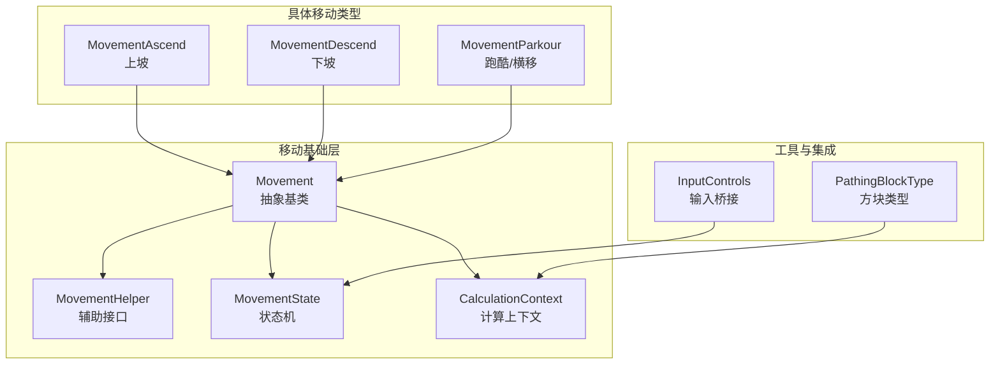
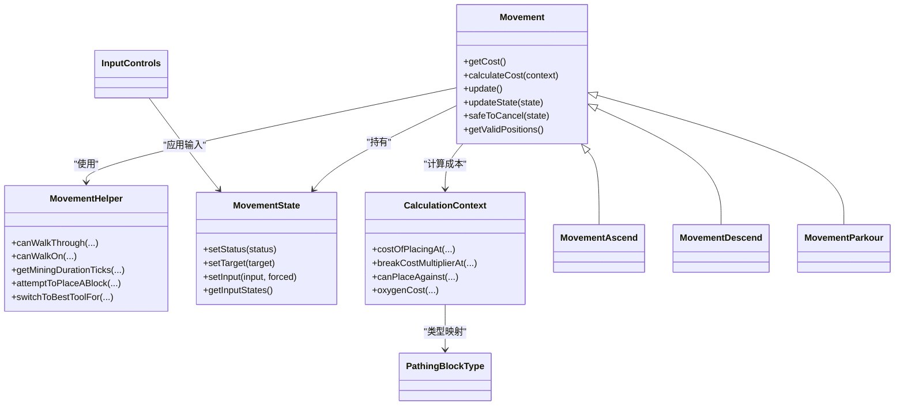
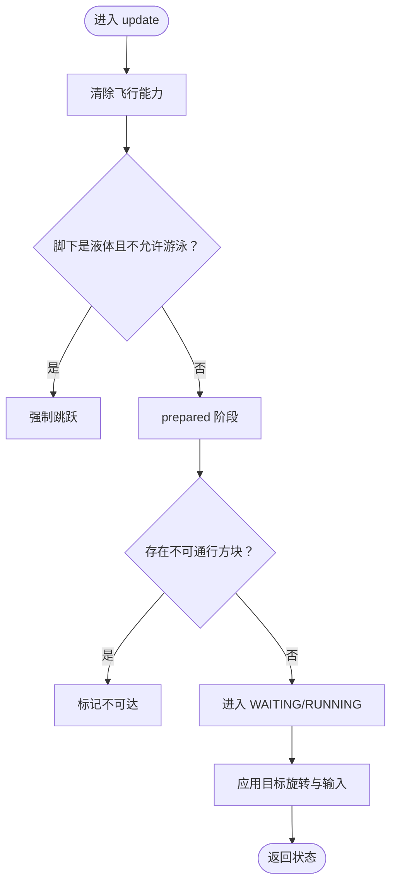
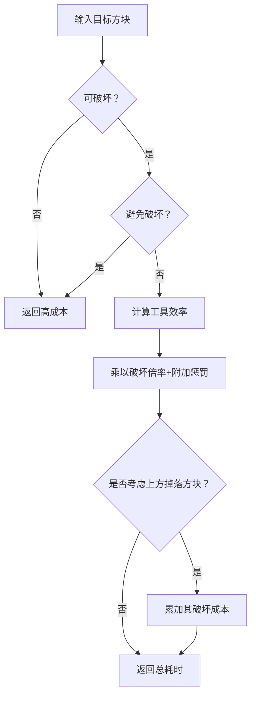
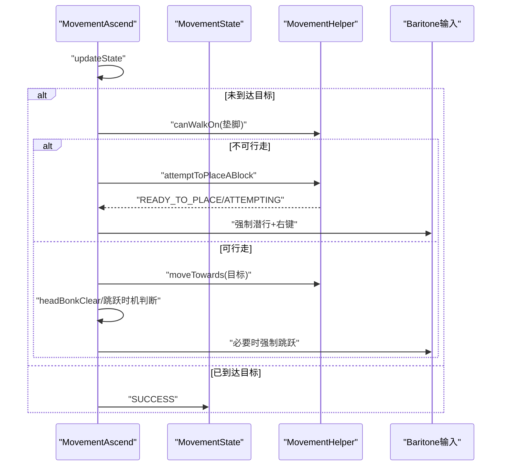
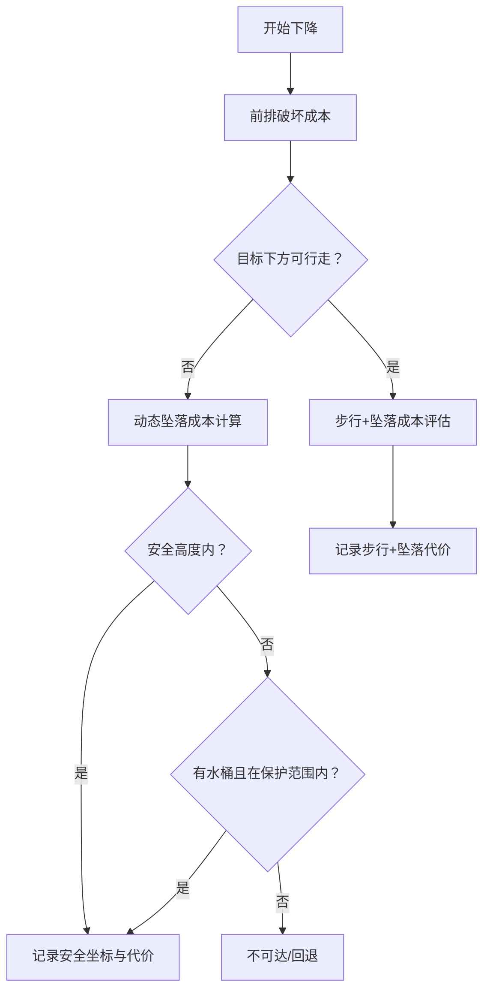
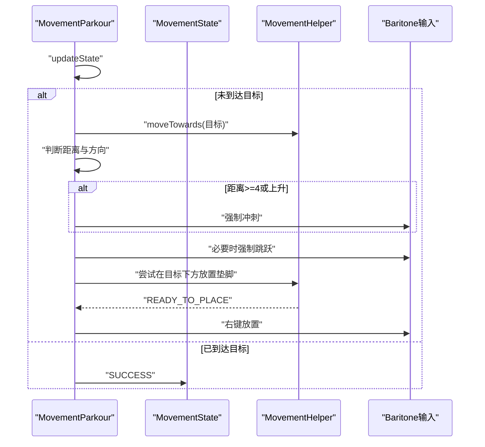
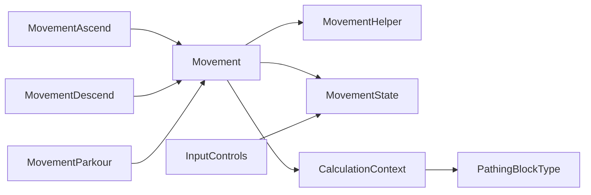

# 移动控制

<cite>
**本文引用的文件**
- [Movement.java](file://src/main/java/baritone/pathing/movement/Movement.java)
- [MovementHelper.java](file://src/main/java/baritone/pathing/movement/MovementHelper.java)
- [MovementState.java](file://src/main/java/baritone/pathing/movement/MovementState.java)
- [CalculationContext.java](file://src/main/java/baritone/pathing/movement/CalculationContext.java)
- [MovementAscend.java](file://src/main/java/baritone/pathing/movement/movements/MovementAscend.java)
- [MovementDescend.java](file://src/main/java/baritone/pathing/movement/movements/MovementDescend.java)
- [MovementParkour.java](file://src/main/java/baritone/pathing/movement/movements/MovementParkour.java)
- [PathingBlockType.java](file://src/main/java/baritone/utils/pathing/PathingBlockType.java)
- [InputControls.java](file://src/main/java/adris/altoclef/control/InputControls.java)
</cite>

## 目录
1. [简介](#简介)
2. [项目结构](#项目结构)
3. [核心组件](#核心组件)
4. [架构总览](#架构总览)
5. [详细组件分析](#详细组件分析)
6. [依赖分析](#依赖分析)
7. [性能考量](#性能考量)
8. [故障排查指南](#故障排查指南)
9. [结论](#结论)
10. [附录](#附录)

## 简介
本技术文档聚焦于移动控制模块，系统性解析 Movement 基类的设计理念、MovementHelper 的辅助能力以及 MovementAscend、MovementDescend、MovementParkour 等具体移动类型的实现细节。文档涵盖移动状态管理、输入控制、物理模拟、路径与安全检查、与游戏机制（如游泳、跳跃、放置）的交互，以及与 AI 决策系统的集成方式，并提供性能优化建议与常见问题的调试技巧。

## 项目结构
移动控制位于 Baritone 路径模块中，核心文件组织如下：
- movement 基础层：Movement 抽象类、MovementHelper 接口、MovementState 状态机、CalculationContext 计算上下文
- 具体移动类型：MovementAscend、MovementDescend、MovementParkour 等
- 路径类型枚举：PathingBlockType
- 输入控制桥接：InputControls（连接 AI 控制器与 Baritone 输入覆盖）

**图表来源**
- [Movement.java:25-276](file://src/main/java/baritone/pathing/movement/Movement.java#L25-L276)
- [MovementHelper.java:64-517](file://src/main/java/baritone/pathing/movement/MovementHelper.java#L64-L517)
- [MovementState.java:10-64](file://src/main/java/baritone/pathing/movement/MovementState.java#L10-L64)
- [CalculationContext.java:29-197](file://src/main/java/baritone/pathing/movement/CalculationContext.java#L29-L197)
- [MovementAscend.java:24-263](file://src/main/java/baritone/pathing/movement/movements/MovementAscend.java#L24-L263)
- [MovementDescend.java:28-272](file://src/main/java/baritone/pathing/movement/movements/MovementDescend.java#L28-L272)
- [MovementParkour.java:24-266](file://src/main/java/baritone/pathing/movement/movements/MovementParkour.java#L24-L266)
- [PathingBlockType.java:3-23](file://src/main/java/baritone/utils/pathing/PathingBlockType.java#L3-L23)
- [InputControls.java:11-54](file://src/main/java/adris/altoclef/control/InputControls.java#L11-L54)

**章节来源**
- [Movement.java:25-276](file://src/main/java/baritone/pathing/movement/Movement.java#L25-L276)
- [MovementHelper.java:64-517](file://src/main/java/baritone/pathing/movement/MovementHelper.java#L64-L517)
- [MovementState.java:10-64](file://src/main/java/baritone/pathing/movement/MovementState.java#L10-L64)
- [CalculationContext.java:29-197](file://src/main/java/baritone/pathing/movement/CalculationContext.java#L29-L197)
- [MovementAscend.java:24-263](file://src/main/java/baritone/pathing/movement/movements/MovementAscend.java#L24-L263)
- [MovementDescend.java:28-272](file://src/main/java/baritone/pathing/movement/movements/MovementDescend.java#L28-L272)
- [MovementParkour.java:24-266](file://src/main/java/baritone/pathing/movement/movements/MovementParkour.java#L24-L266)
- [PathingBlockType.java:3-23](file://src/main/java/baritone/utils/pathing/PathingBlockType.java#L3-L23)
- [InputControls.java:11-54](file://src/main/java/adris/altoclef/control/InputControls.java#L11-L54)

## 核心组件
- Movement 抽象基类：定义移动的生命周期、状态流转、输入应用、缓存策略与有效性位置集合；提供通用的准备阶段、等待阶段、运行阶段的状态机与输入覆盖机制。
- MovementHelper 辅助接口：提供可行走性判断、可放置面判断、流体与方块类型检测、挖掘耗时估算、最佳工具切换、放置尝试等静态工具方法。
- MovementState 状态机：封装当前目标旋转、输入映射与状态，作为 Movement 更新循环中的中间态。
- CalculationContext 计算上下文：聚合实体尺寸、世界边界、设置项、水桶可用性、跳跃/落差限制、氧气消耗等，用于移动成本计算与可行性判定。
- PathingBlockType 枚举：将“空气/水/避让/固体”四态以位向量编码，便于快速路径查询与代价映射。
- InputControls 桥接：在 AI 控制器与 Baritone 输入覆盖之间建立薄层，统一按键按压/长按/释放与视角更新。

**章节来源**
- [Movement.java:25-276](file://src/main/java/baritone/pathing/movement/Movement.java#L25-L276)
- [MovementHelper.java:64-517](file://src/main/java/baritone/pathing/movement/MovementHelper.java#L64-L517)
- [MovementState.java:10-64](file://src/main/java/baritone/pathing/movement/MovementState.java#L10-L64)
- [CalculationContext.java:29-197](file://src/main/java/baritone/pathing/movement/CalculationContext.java#L29-L197)
- [PathingBlockType.java:3-23](file://src/main/java/baritone/utils/pathing/PathingBlockType.java#L3-L23)
- [InputControls.java:11-54](file://src/main/java/adris/altoclef/control/InputControls.java#L11-L54)

## 架构总览
移动控制采用“抽象基类 + 具体移动类型 + 辅助工具 + 上下文”的分层设计。Movement 将状态机与输入覆盖抽象出来，具体移动类型仅需实现成本计算与运行期行为；MovementHelper 提供跨类型复用的物理与路径判断；CalculationContext 将环境与设置注入到成本计算中；InputControls 将 AI 的意图转化为 Baritone 的输入覆盖。

**图表来源**
- [Movement.java:25-276](file://src/main/java/baritone/pathing/movement/Movement.java#L25-L276)
- [MovementHelper.java:64-517](file://src/main/java/baritone/pathing/movement/MovementHelper.java#L64-L517)
- [MovementState.java:10-64](file://src/main/java/baritone/pathing/movement/MovementState.java#L10-L64)
- [CalculationContext.java:29-197](file://src/main/java/baritone/pathing/movement/CalculationContext.java#L29-L197)
- [MovementAscend.java:24-263](file://src/main/java/baritone/pathing/movement/movements/MovementAscend.java#L24-L263)
- [MovementDescend.java:28-272](file://src/main/java/baritone/pathing/movement/movements/MovementDescend.java#L28-L272)
- [MovementParkour.java:24-266](file://src/main/java/baritone/pathing/movement/movements/MovementParkour.java#L24-L266)
- [PathingBlockType.java:3-23](file://src/main/java/baritone/utils/pathing/PathingBlockType.java#L3-L23)
- [InputControls.java:11-54](file://src/main/java/adris/altoclef/control/InputControls.java#L11-L54)

## 详细组件分析

### Movement 基类：设计理念与状态机
- 设计理念
  - 将“准备-等待-运行”三阶段解耦，通过 MovementState 统一输出目标旋转与输入映射，由 Baritone 的 InputOverrideHandler 应用到实体。
  - 使用缓存策略避免重复计算：有效位置集合、挖掘/放置列表、是否在加载区块内等。
  - 通过 CalculationContext 注入环境与设置，使成本计算可线程化且可扩展。
- 状态机
  - PREPPING → WAITING → RUNNING → SUCCESS/UNREACHABLE，依据准备阶段的可达性与障碍物处理决定下一步。
  - 在 update 中处理游泳、墙体卡顿、工具切换与点击破坏等即时行为。
- 输入控制
  - 将 MovementState 的输入映射写入 InputOverrideHandler，确保每 tick 清理未强制释放的键，防止残留输入。
- 安全性
  - safeToCancel 默认返回 true，具体移动类型可覆盖以避免打断危险阶段（如放置/跳跃）。

**图表来源**
- [Movement.java:96-124](file://src/main/java/baritone/pathing/movement/Movement.java#L96-L124)
- [Movement.java:126-209](file://src/main/java/baritone/pathing/movement/Movement.java#L126-L209)

**章节来源**
- [Movement.java:25-276](file://src/main/java/baritone/pathing/movement/Movement.java#L25-L276)

### MovementHelper：物理与路径辅助
- 可行走性与可放置面
  - canWalkThrough/canWalkOn：综合方块类型、流体、台阶/半 slab、玻璃、梯子/藤蔓、assumeWalkOnWater 等设置进行判断。
  - canPlaceAgainst：判断能否在某面放置方块（需为实心或特定透明材料）。
- 成本与工具
  - getMiningDurationTicks：基于工具效率、破坏倍率、附加破坏惩罚、掉落方块连锁等估算破坏耗时。
  - switchToBestToolFor：根据目标方块与设置选择最优工具槽位。
- 放置尝试
  - attemptToPlaceABlock：寻找可放置面、计算朝向、选择投掷物、在就位后触发右键放置。
- 流体与类型
  - isWater/isLava/isLiquid/isFlowing/isBottomSlab 等，支持路径与成本计算中的流体与特殊方块处理。

**图表来源**
- [MovementHelper.java:306-344](file://src/main/java/baritone/pathing/movement/MovementHelper.java#L306-L344)

**章节来源**
- [MovementHelper.java:64-517](file://src/main/java/baritone/pathing/movement/MovementHelper.java#L64-L517)

### MovementAscend：上坡/垫脚石移动
- 目标与构建
  - 构建需要破坏的天花板与墙面、需要放置的垫脚方块位置，保证头部与身体空间充足。
- 成本计算
  - 若垫脚地不可行走，则计算放置成本与可放置面；累加头顶与周围方块的破坏耗时；根据是否为底部 slab、是否在水中、是否允许跳跃等调整步行/跳跃成本与跳跃惩罚。
- 运行逻辑
  - 若脚下尚未到达目标，优先尝试放置垫脚方块；若放置超时则后退；到达目标后根据步进/跳跃条件决定是否继续或结束。
  - 头部碰撞检测 headBonkClear 保障起跳空间；canStopJumping 判断何时停止跳跃。

**图表来源**
- [MovementAscend.java:182-233](file://src/main/java/baritone/pathing/movement/movements/MovementAscend.java#L182-L233)
- [MovementHelper.java:432-505](file://src/main/java/baritone/pathing/movement/MovementHelper.java#L432-L505)

**章节来源**
- [MovementAscend.java:24-263](file://src/main/java/baritone/pathing/movement/movements/MovementAscend.java#L24-L263)

### MovementDescend：下坡/安全下降
- 目标与构建
  - 构建需要破坏的墙体与地板，目标下方可能为安全着陆点或动态计算的安全高度。
- 成本计算
  - 优先考虑前排破坏成本；若目标下方为脚手架且底部为假，需额外破坏；否则评估步行+坠落成本与氧气消耗。
  - 动态坠落成本 dynamicFallCost：从当前位置向下探测，计算不同高度的坠落代价，结合水/水桶保护策略与最大安全坠落高度。
- 运行逻辑
  - 当接近目标且处于安全模式时，采用平滑朝向与前进输入；否则根据距离与方向引导移动；必要时强制潜行以避免意外坠落。

**图表来源**
- [MovementDescend.java:60-189](file://src/main/java/baritone/pathing/movement/movements/MovementDescend.java#L60-L189)

**章节来源**
- [MovementDescend.java:28-272](file://src/main/java/baritone/pathing/movement/movements/MovementDescend.java#L28-L272)

### MovementParkour：跑酷/横移
- 目标与构建
  - 以给定方向与距离尝试跑酷，支持二格/三格/四格跳跃；在允许时可在四格落地点放置垫脚块。
- 成本计算
  - 检查起跳区、跳跃路径与落地区是否完全可通过；根据站立/落地方块类型与速度因子调整成本；允许上升式跑酷时增加高度收益。
- 运行逻辑
  - 在起跳前加速冲刺；在合适时机强制跳跃；若落地点下方为空则尝试放置垫脚块；根据距离与方向控制前进/后退与冲刺开关。

**图表来源**
- [MovementParkour.java:204-264](file://src/main/java/baritone/pathing/movement/movements/MovementParkour.java#L204-L264)
- [MovementHelper.java:432-505](file://src/main/java/baritone/pathing/movement/MovementHelper.java#L432-L505)

**章节来源**
- [MovementParkour.java:24-266](file://src/main/java/baritone/pathing/movement/movements/MovementParkour.java#L24-L266)

### PathingBlockType：方块类型判断与成本映射
- 四态枚举：AIR/WATER/AVOID/SOLID，以两位布尔数组编码，便于快速映射到路径代价表。
- 用途：在路径计算中将复杂方块状态简化为两类位，配合 CalculationContext 的 worldContainsLoadedChunk 等判断，提升查询效率。

**章节来源**
- [PathingBlockType.java:3-23](file://src/main/java/baritone/utils/pathing/PathingBlockType.java#L3-L23)

### 输入控制与 AI 集成：InputControls
- 角色：在 AI 控制器与 Baritone 输入覆盖之间建立桥接，统一按键按压/长按/释放与视角更新。
- 行为：每 tick 前清空待释放队列，tick 后清理等待释放集合，避免输入残留；提供强制视角更新接口。

**章节来源**
- [InputControls.java:11-54](file://src/main/java/adris/altoclef/control/InputControls.java#L11-L54)

## 依赖分析
- Movement 对 MovementHelper、MovementState、CalculationContext 存在强依赖：前者负责状态与输入，后者负责物理与成本，前者在运行期组合使用。
- MovementAscend/Descend/Parkour 依赖 Movement 的状态机与输入应用，同时各自重写 calculateCost 与 updateState，体现多态与职责分离。
- CalculationContext 依赖 Baritone 设置与实体属性，为所有移动类型提供一致的成本与约束。
- PathingBlockType 与 CalculationContext 协作，将复杂方块状态映射为简单代价位，降低路径查询复杂度。
- InputControls 依赖 Baritone 的 InputOverrideHandler 与 LookBehavior，将 AI 的 MovementState 输出转换为底层输入。

**图表来源**
- [Movement.java:25-276](file://src/main/java/baritone/pathing/movement/Movement.java#L25-L276)
- [MovementHelper.java:64-517](file://src/main/java/baritone/pathing/movement/MovementHelper.java#L64-L517)
- [MovementState.java:10-64](file://src/main/java/baritone/pathing/movement/MovementState.java#L10-L64)
- [CalculationContext.java:29-197](file://src/main/java/baritone/pathing/movement/CalculationContext.java#L29-L197)
- [MovementAscend.java:24-263](file://src/main/java/baritone/pathing/movement/movements/MovementAscend.java#L24-L263)
- [MovementDescend.java:28-272](file://src/main/java/baritone/pathing/movement/movements/MovementDescend.java#L28-L272)
- [MovementParkour.java:24-266](file://src/main/java/baritone/pathing/movement/movements/MovementParkour.java#L24-L266)
- [PathingBlockType.java:3-23](file://src/main/java/baritone/utils/pathing/PathingBlockType.java#L3-L23)
- [InputControls.java:11-54](file://src/main/java/adris/altoclef/control/InputControls.java#L11-L54)

## 性能考量
- 缓存策略
  - Movement 对有效位置、挖掘/放置列表、是否在加载区块内进行缓存，减少重复计算。
  - MovementHelper 的 getMiningDurationTicks 与 Movement.canWalkThrough/On 等可复用结果，避免重复查询。
- 线程友好
  - CalculationContext 支持在其他线程使用（构造时传入标志），但需确保访问共享资源的正确性。
- 成本计算剪枝
  - MovementHelper 在遇到极高成本（≥1000000）时提前返回，避免无意义遍历。
- 路径类型映射
  - PathingBlockType 以位向量编码，降低查询与比较开销。
- 输入应用批处理
  - MovementState 每 tick 清空未强制释放的键，避免输入残留导致的性能与行为异常。

**章节来源**
- [Movement.java:216-276](file://src/main/java/baritone/pathing/movement/Movement.java#L216-L276)
- [MovementHelper.java:306-344](file://src/main/java/baritone/pathing/movement/MovementHelper.java#L306-L344)
- [CalculationContext.java:75-125](file://src/main/java/baritone/pathing/movement/CalculationContext.java#L75-L125)
- [PathingBlockType.java:19-21](file://src/main/java/baritone/utils/pathing/PathingBlockType.java#L19-L21)

## 故障排查指南
- 移动被标记为不可达
  - 检查 Movement.prepared 是否因障碍物或掉落方块暂停；确认 pauseMiningForFallingBlocks 设置与实体朝向是否正确。
  - 参考：[Movement.java:126-169](file://src/main/java/baritone/pathing/movement/Movement.java#L126-L169)
- 跳水/游泳异常
  - allowSwimming 与 assumeWalkOnWater 设置影响 canWalkThrough 与 canWalkOn 的返回值；检查液体类型与上方方块。
  - 参考：[MovementHelper.java:88-141](file://src/main/java/baritone/pathing/movement/MovementHelper.java#L88-L141)
- 放置失败
  - attemptToPlaceABlock 需要可放置面、可选投掷物、朝向命中；检查 canPlaceAgainst 与 isReplaceable。
  - 参考：[MovementHelper.java:432-505](file://src/main/java/baritone/pathing/movement/MovementHelper.java#L432-L505)
- 下降安全问题
  - dynamicFallCost 会根据水/水桶保护与最大安全高度决定是否可行；检查 allowWaterBucketFall 与 maxFallHeight* 设置。
  - 参考：[MovementDescend.java:100-189](file://src/main/java/baritone/pathing/movement/movements/MovementDescend.java#L100-L189)
- 跑酷落地/垫脚
  - MovementParkour 在目标下方为空时尝试放置垫脚；若 READY_TO_PLACE 未触发，检查放置面与投掷物选择。
  - 参考：[MovementParkour.java:242-247](file://src/main/java/baritone/pathing/movement/movements/MovementParkour.java#L242-L247)
- 输入残留
  - 检查 InputControls 的 onTickPre/onTickPost 是否正确清空队列；确认 Movement.update 是否每 tick 清理未强制键。
  - 参考：[InputControls.java:44-52](file://src/main/java/adris/altoclef/control/InputControls.java#L44-L52), [Movement.java:116-124](file://src/main/java/baritone/pathing/movement/Movement.java#L116-L124)

**章节来源**
- [Movement.java:126-169](file://src/main/java/baritone/pathing/movement/Movement.java#L126-L169)
- [MovementHelper.java:88-141](file://src/main/java/baritone/pathing/movement/MovementHelper.java#L88-L141)
- [MovementHelper.java:432-505](file://src/main/java/baritone/pathing/movement/MovementHelper.java#L432-L505)
- [MovementDescend.java:100-189](file://src/main/java/baritone/pathing/movement/movements/MovementDescend.java#L100-L189)
- [MovementParkour.java:242-247](file://src/main/java/baritone/pathing/movement/movements/MovementParkour.java#L242-L247)
- [InputControls.java:44-52](file://src/main/java/adris/altoclef/control/InputControls.java#L44-L52)

## 结论
移动控制模块通过 Movement 抽象基类统一状态机与输入应用，借助 MovementHelper 提供的物理与路径辅助，结合 CalculationContext 的环境注入，实现了对上坡、下坡与跑酷等复杂动作的高效、安全与可扩展实现。通过缓存、剪枝与位映射等手段，系统在保证正确性的同时兼顾性能；InputControls 则为 AI 决策与底层输入提供了清晰的集成点。

## 附录
- 关键流程图与序列图已在各节中给出，对应源码路径见“图表来源”。
- 如需进一步了解设置项对移动的影响，可参考 CalculationContext 的构造与字段含义。