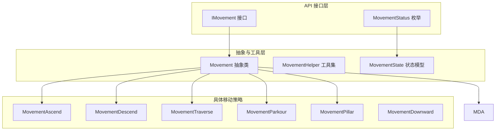
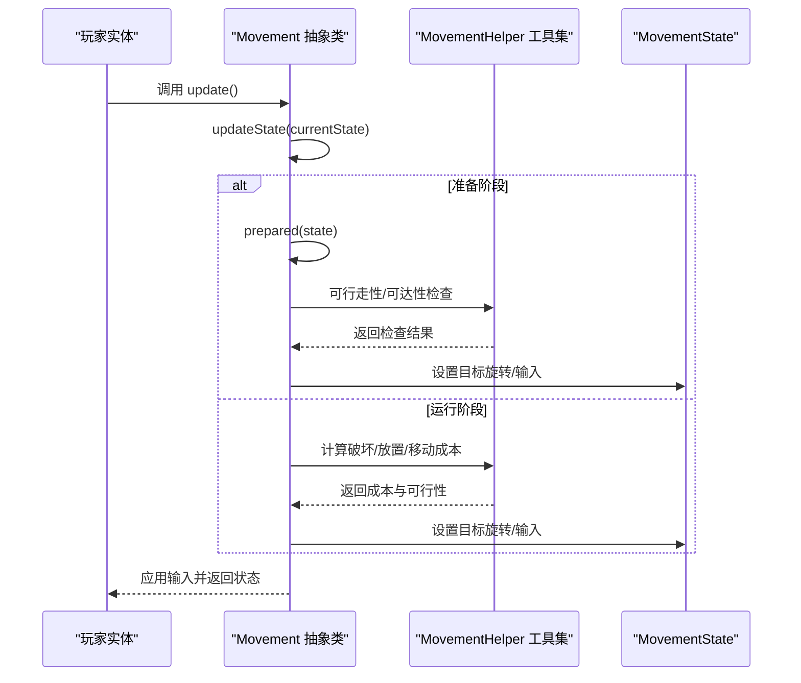
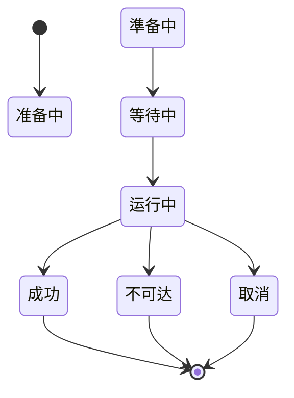
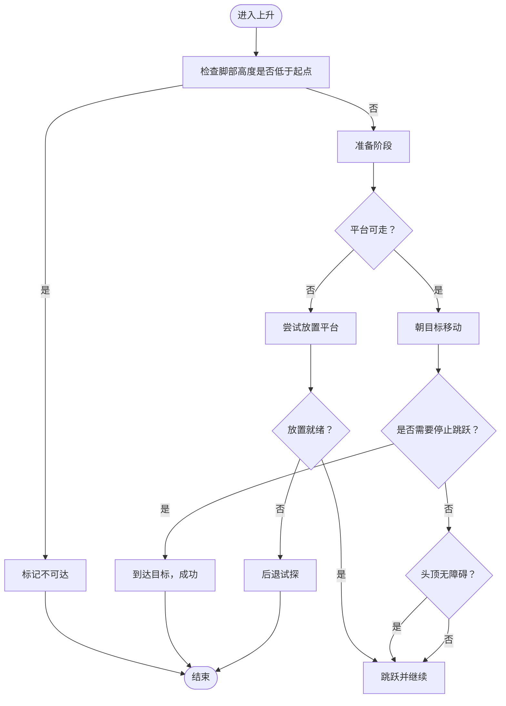
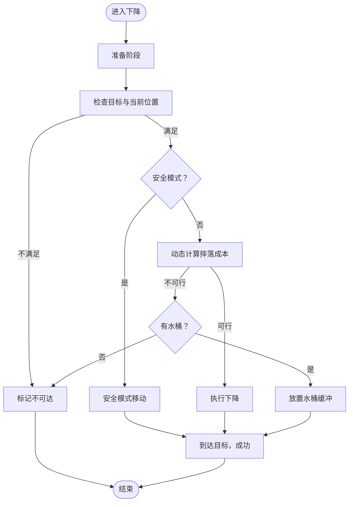
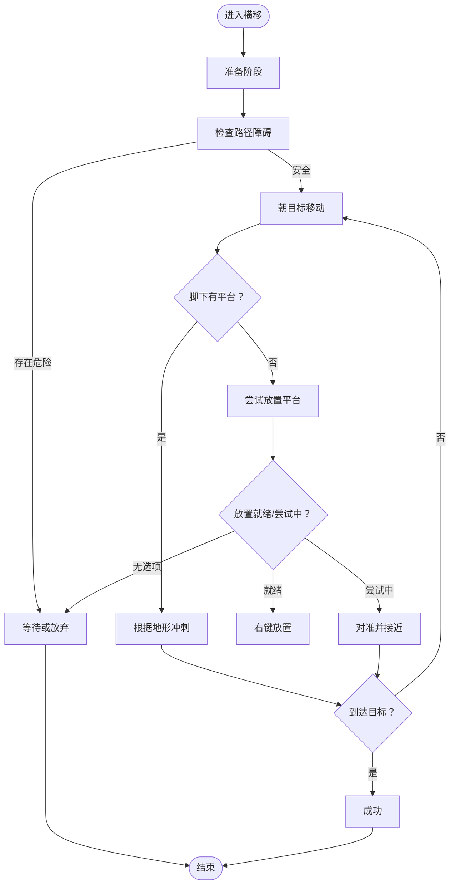
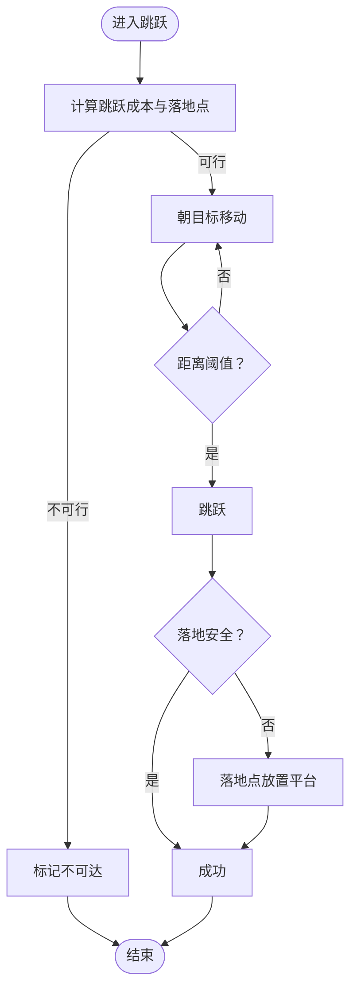
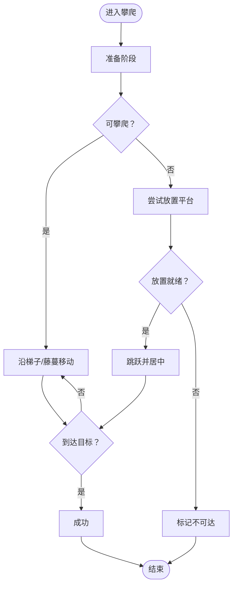
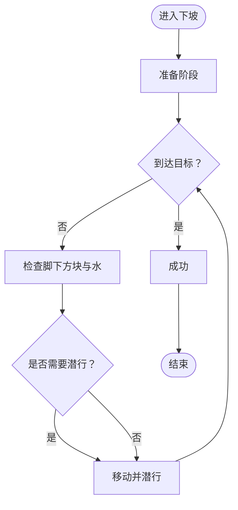
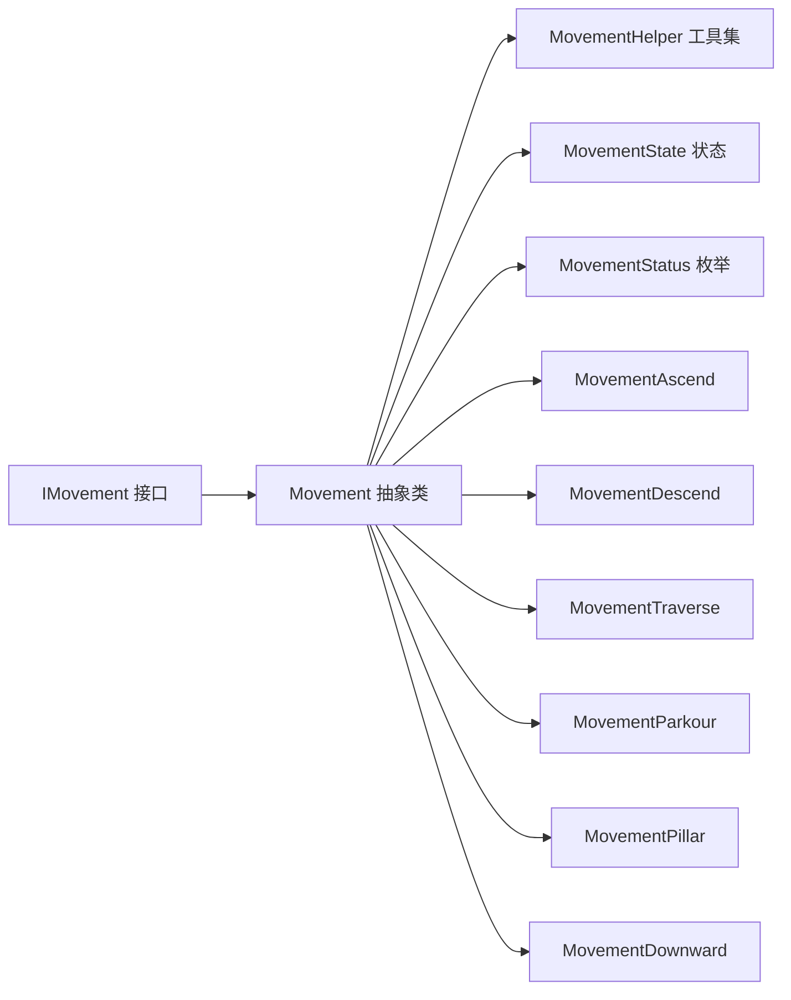

# 移动策略系统

<cite>
**本文引用的文件**
- [Movement.java](file://src/main/java/baritone/pathing/movement/Movement.java)
- [MovementState.java](file://src/main/java/baritone/pathing/movement/MovementState.java)
- [MovementHelper.java](file://src/main/java/baritone/pathing/movement/MovementHelper.java)
- [IMovement.java](file://src/main/java/baritone/api/pathing/movement/IMovement.java)
- [MovementStatus.java](file://src/main/java/baritone/api/pathing/movement/MovementStatus.java)
- [MovementAscend.java](file://src/main/java/baritone/pathing/movement/movements/MovementAscend.java)
- [MovementDescend.java](file://src/main/java/baritone/pathing/movement/movements/MovementDescend.java)
- [MovementTraverse.java](file://src/main/java/baritone/pathing/movement/movements/MovementTraverse.java)
- [MovementParkour.java](file://src/main/java/baritone/pathing/movement/movements/MovementParkour.java)
- [MovementPillar.java](file://src/main/java/baritone/pathing/movement/movements/MovementPillar.java)
- [MovementDownward.java](file://src/main/java/baritone/pathing/movement/movements/MovementDownward.java)
</cite>

## 目录
1. [简介](#简介)
2. [项目结构](#项目结构)
3. [核心组件](#核心组件)
4. [架构总览](#架构总览)
5. [详细组件分析](#详细组件分析)
6. [依赖关系分析](#依赖关系分析)
7. [性能考量](#性能考量)
8. [故障排查指南](#故障排查指南)
9. [结论](#结论)
10. [附录：扩展与实践建议](#附录扩展与实践建议)

## 简介
本文件面向移动策略系统，围绕 Movement 抽象类及其具体子类（上升、下降、横移、跳跃、攀爬、下坡）进行系统化技术说明。内容涵盖：
- Movement 抽象类的设计理念与实现架构：移动状态管理、动作执行控制、失败处理机制
- 各种具体移动策略的实现原理：上升、下降、横移、跳跃、攀爬等
- 移动策略的组合与协调：复杂移动序列、过渡处理、失败回退
- 实用技巧：自定义移动策略、特殊地形处理、移动效率优化、移动动画同步
- 扩展方法与性能优化指导

## 项目结构
移动策略系统位于路径规划模块中，核心接口与抽象类定义在 baritone.api.pathing.movement 包，具体移动策略实现在 baritone.pathing.movement.movements 包。

图表来源
- [IMovement.java:1-25](file://src/main/java/baritone/api/pathing/movement/IMovement.java#L1-L25)
- [MovementStatus.java:1-22](file://src/main/java/baritone/api/pathing/movement/MovementStatus.java#L1-L22)
- [Movement.java:1-276](file://src/main/java/baritone/pathing/movement/Movement.java#L1-L276)
- [MovementHelper.java:1-517](file://src/main/java/baritone/pathing/movement/MovementHelper.java#L1-L517)
- [MovementState.java:1-64](file://src/main/java/baritone/pathing/movement/MovementState.java#L1-L64)
- [MovementAscend.java:1-263](file://src/main/java/baritone/pathing/movement/movements/MovementAscend.java#L1-L263)
- [MovementDescend.java:1-272](file://src/main/java/baritone/pathing/movement/movements/MovementDescend.java#L1-L272)
- [MovementTraverse.java:1-460](file://src/main/java/baritone/pathing/movement/movements/MovementTraverse.java#L1-L460)
- [MovementParkour.java:1-266](file://src/main/java/baritone/pathing/movement/movements/MovementParkour.java#L1-L266)
- [MovementPillar.java:1-301](file://src/main/java/baritone/pathing/movement/movements/MovementPillar.java#L1-L301)
- [MovementDownward.java:1-141](file://src/main/java/baritone/pathing/movement/movements/MovementDownward.java#L1-L141)

章节来源
- [IMovement.java:1-25](file://src/main/java/baritone/api/pathing/movement/IMovement.java#L1-L25)
- [MovementStatus.java:1-22](file://src/main/java/baritone/api/pathing/movement/MovementStatus.java#L1-L22)
- [Movement.java:1-276](file://src/main/java/baritone/pathing/movement/Movement.java#L1-L276)
- [MovementHelper.java:1-517](file://src/main/java/baritone/pathing/movement/MovementHelper.java#L1-L517)
- [MovementState.java:1-64](file://src/main/java/baritone/pathing/movement/MovementState.java#L1-L64)

## 核心组件
- Movement 抽象类：统一管理移动成本计算、有效位置集合、输入状态、旋转目标、缓存与重置逻辑；提供 update 驱动主循环与状态推进。
- MovementState：封装当前移动的状态（PREPPING/WAITING/RUNNING/SUCCESS/UNREACHABLE/FAILED/CANCELED）、目标旋转与强制旋转标志、输入按键状态。
- MovementHelper：静态工具集，负责可行走性判断、破坏/放置成本估算、可达性旋转计算、水/岩浆/楼梯/半砖等特殊地形处理、工具切换等。
- IMovement 接口：定义移动的最小契约（成本、更新、重置、块缓存、安全取消、是否已加载计算、源/目的/方向）。
- MovementStatus：移动生命周期状态枚举，区分运行中与完成态。

章节来源
- [Movement.java:25-276](file://src/main/java/baritone/pathing/movement/Movement.java#L25-L276)
- [MovementState.java:10-64](file://src/main/java/baritone/pathing/movement/MovementState.java#L10-L64)
- [MovementHelper.java:64-517](file://src/main/java/baritone/pathing/movement/MovementHelper.java#L64-L517)
- [IMovement.java:6-24](file://src/main/java/baritone/api/pathing/movement/IMovement.java#L6-L24)
- [MovementStatus.java:3-21](file://src/main/java/baritone/api/pathing/movement/MovementStatus.java#L3-L21)

## 架构总览
Movement 抽象类通过 updateState 将“准备-等待-运行”三阶段推进，并在每帧根据上下文与地形条件设置输入（移动、跳跃、潜行、点击等）。MovementHelper 提供可行走性、破坏成本、放置尝试等底层能力，具体策略类（如 MovementAscend、MovementTraverse 等）覆盖不同动作类型的成本计算与行为控制。

图表来源
- [Movement.java:96-124](file://src/main/java/baritone/pathing/movement/Movement.java#L96-L124)
- [Movement.java:195-209](file://src/main/java/baritone/pathing/movement/Movement.java#L195-L209)
- [MovementHelper.java:364-374](file://src/main/java/baritone/pathing/movement/MovementHelper.java#L364-L374)

## 详细组件分析

### Movement 抽象类与状态机
- 状态推进：PREPPING -> WAITING -> RUNNING，成功或失败后进入完成态。
- 输入驱动：通过 MovementState 的输入映射与 Rotation 目标，交由上层输入覆盖器应用到实体。
- 成本与缓存：支持按 CalculationContext 计算成本、缓存有效位置、破坏/放置列表，以及块缓存重置。
- 失败处理：检测墙体、液体、掉落物等异常情况，必要时标记 UNREACHABLE 或 FAILED。

图表来源
- [MovementStatus.java:3-21](file://src/main/java/baritone/api/pathing/movement/MovementStatus.java#L3-L21)
- [Movement.java:195-209](file://src/main/java/baritone/pathing/movement/Movement.java#L195-L209)

章节来源
- [Movement.java:25-276](file://src/main/java/baritone/pathing/movement/Movement.java#L25-L276)
- [MovementState.java:10-64](file://src/main/java/baritone/pathing/movement/MovementState.java#L10-L64)
- [MovementStatus.java:3-21](file://src/main/java/baritone/api/pathing/movement/MovementStatus.java#L3-L21)

### 上升（MovementAscend）
- 设计要点：在目标上方构建平台以支撑跳跃，处理天花板障碍与侧向空间需求。
- 关键流程：
  - 计算成本：考虑平台放置成本、破坏成本、跳跃/氧气消耗。
  - 行为控制：若平台未就位，尝试放置；否则朝目标移动并适时跳跃。
  - 安全取消：仅在未开始放置或已到达目标时允许取消。
- 特殊地形：底部半砖、水面、可攀爬方块（梯子/藤蔓）影响跳跃时机与步进判定。

图表来源
- [MovementAscend.java:182-233](file://src/main/java/baritone/pathing/movement/movements/MovementAscend.java#L182-L233)
- [MovementAscend.java:258-262](file://src/main/java/baritone/pathing/movement/movements/MovementAscend.java#L258-L262)

章节来源
- [MovementAscend.java:24-263](file://src/main/java/baritone/pathing/movement/movements/MovementAscend.java#L24-L263)

### 下降（MovementDescend）
- 设计要点：处理从高处安全下降，优先使用可攀爬方块或软着陆，避免致命摔落。
- 关键流程：
  - 成本计算：考虑前排破坏、落地方块稳定性、是否使用水桶缓冲。
  - 行为控制：接近目标时根据地形选择潜行、直线下落或安全模式移动。
  - 安全模式：遇到危险地形（如空洞、熔岩、深水）时采用“安全模式”引导移动。
- 特殊地形：脚手架底部、可攀爬方块、水面/熔岩、底部半砖限制。

图表来源
- [MovementDescend.java:191-247](file://src/main/java/baritone/pathing/movement/movements/MovementDescend.java#L191-L247)
- [MovementDescend.java:100-189](file://src/main/java/baritone/pathing/movement/movements/MovementDescend.java#L100-L189)
- [MovementDescend.java:249-271](file://src/main/java/baritone/pathing/movement/movements/MovementDescend.java#L249-L271)

章节来源
- [MovementDescend.java:28-272](file://src/main/java/baritone/pathing/movement/movements/MovementDescend.java#L28-L272)

### 横移（MovementTraverse）
- 设计要点：在水平方向移动，优先利用可行走面，必要时在脚下放置平台。
- 关键流程：
  - 成本计算：考虑步行速度、破坏成本、是否需要放置平台。
  - 行为控制：检测门/栅栏门、自动打开；在缺少支撑时尝试放置平台；根据地形决定冲刺。
  - 安全取消：仅在未开始运行或已能稳定站在目标下方时允许取消。
- 特殊地形：可攀爬方块、水面、半砖、门/栅栏门、可替换方块。

图表来源
- [MovementTraverse.java:211-409](file://src/main/java/baritone/pathing/movement/movements/MovementTraverse.java#L211-L409)
- [MovementTraverse.java:411-441](file://src/main/java/baritone/pathing/movement/movements/MovementTraverse.java#L411-L441)
- [MovementTraverse.java:443-447](file://src/main/java/baritone/pathing/movement/movements/MovementTraverse.java#L443-L447)

章节来源
- [MovementTraverse.java:35-460](file://src/main/java/baritone/pathing/movement/movements/MovementTraverse.java#L35-L460)

### 跳跃（MovementParkour）
- 设计要点：在有限空间内进行短距离跳跃，支持“越阶”与“垫脚”两种落地方式。
- 关键流程：
  - 成本计算：根据跳跃距离与速度因子计算代价，考虑冲刺与“越阶”安全性。
  - 行为控制：在合适时机跳跃，必要时在落地点放置平台以确保安全。
  - 安全取消：仅在非运行态允许取消。
- 特殊地形：可行走面、可攀爬方块、底部半砖、农场土等。

图表来源
- [MovementParkour.java:178-201](file://src/main/java/baritone/pathing/movement/movements/MovementParkour.java#L178-L201)
- [MovementParkour.java:204-264](file://src/main/java/baritone/pathing/movement/movements/MovementParkour.java#L204-L264)

章节来源
- [MovementParkour.java:24-266](file://src/main/java/baritone/pathing/movement/movements/MovementParkour.java#L24-L266)

### 攀爬（MovementPillar）
- 设计要点：沿垂直方向向上攀爬，优先使用梯子/藤蔓，其次通过放置方块或跳跃实现。
- 关键流程：
  - 成本计算：考虑破坏/放置成本、跳跃代价、氧气消耗。
  - 行为控制：检测可攀爬方块与支撑面，定位支撑点并居中移动，必要时跳跃。
  - 安全取消：在非运行态或已到达目标且可稳定站立时允许取消。
- 特殊地形：梯子/藤蔓、半砖、水面、可替换方块。

图表来源
- [MovementPillar.java:184-263](file://src/main/java/baritone/pathing/movement/movements/MovementPillar.java#L184-L263)
- [MovementPillar.java:265-287](file://src/main/java/baritone/pathing/movement/movements/MovementPillar.java#L265-L287)

章节来源
- [MovementPillar.java:39-301](file://src/main/java/baritone/pathing/movement/movements/MovementPillar.java#L39-L301)

### 下坡（MovementDownward）
- 设计要点：在水平方向向下移动，优先利用可攀爬方块或安全着陆。
- 关键流程：
  - 成本计算：考虑破坏成本、摔落代价、是否处于水面。
  - 行为控制：接近目标时根据脚下方块（如脚手架）决定潜行，否则直接移动。
  - 安全取消：在非运行态或已到达目标时允许取消。
- 特殊地形：脚手架、可攀爬方块、水面、底部半砖。

图表来源
- [MovementDownward.java:113-140](file://src/main/java/baritone/pathing/movement/movements/MovementDownward.java#L113-L140)

章节来源
- [MovementDownward.java:23-141](file://src/main/java/baritone/pathing/movement/movements/MovementDownward.java#L23-L141)

## 依赖关系分析
- Movement 抽象类依赖 MovementHelper 提供的可行走性、破坏成本、放置尝试等工具方法。
- 具体策略类（Ascend/Descend/Traverse/Parkour/Pillar/Downward）复用 Movement 的状态推进与输入应用框架，各自实现 calculateCost 与 updateState。
- MovementState 作为状态容器，被所有策略共享；MovementStatus 用于统一状态语义。

图表来源
- [IMovement.java:6-24](file://src/main/java/baritone/api/pathing/movement/IMovement.java#L6-L24)
- [Movement.java:25-276](file://src/main/java/baritone/pathing/movement/Movement.java#L25-L276)
- [MovementHelper.java:64-517](file://src/main/java/baritone/pathing/movement/MovementHelper.java#L64-L517)
- [MovementState.java:10-64](file://src/main/java/baritone/pathing/movement/MovementState.java#L10-L64)
- [MovementStatus.java:3-21](file://src/main/java/baritone/api/pathing/movement/MovementStatus.java#L3-L21)
- [MovementAscend.java:24-263](file://src/main/java/baritone/pathing/movement/movements/MovementAscend.java#L24-L263)
- [MovementDescend.java:28-272](file://src/main/java/baritone/pathing/movement/movements/MovementDescend.java#L28-L272)
- [MovementTraverse.java:35-460](file://src/main/java/baritone/pathing/movement/movements/MovementTraverse.java#L35-L460)
- [MovementParkour.java:24-266](file://src/main/java/baritone/pathing/movement/movements/MovementParkour.java#L24-L266)
- [MovementPillar.java:39-301](file://src/main/java/baritone/pathing/movement/movements/MovementPillar.java#L39-L301)
- [MovementDownward.java:23-141](file://src/main/java/baritone/pathing/movement/movements/MovementDownward.java#L23-L141)

章节来源
- [Movement.java:25-276](file://src/main/java/baritone/pathing/movement/Movement.java#L25-L276)
- [MovementHelper.java:64-517](file://src/main/java/baritone/pathing/movement/MovementHelper.java#L64-L517)

## 性能考量
- 成本缓存：Movement 对 cost、validPositions、toBreak/toPlace/toWalkInto 进行缓存，减少重复计算。
- 块缓存重置：提供 resetBlockCache 以在环境变化后刷新缓存。
- 地形快速判断：MovementHelper 提供大量布尔型可行走性与可破坏性判断，避免深层查询。
- 输入最小化：MovementState 使用 Map 存储输入状态，仅在必要时设置输入，降低输入覆盖开销。
- 特殊地形优化：针对水面、熔岩、半砖、可攀爬方块等场景提供专门分支，减少无效尝试。

## 故障排查指南
- 不可达（UNREACHABLE）常见原因：
  - 目标区域被不可行走或不可替换方块阻隔（如熔岩、深水、不可替换方块）。
  - 无法找到合适的放置面或门/栅栏门未打开。
  - 头顶/周围存在危险方块（如活塞、流动液体）。
- 失败（FAILED）常见原因：
  - 运行中发生不可恢复的环境变化（如方块被破坏/生成）。
  - 安全取消条件触发导致提前终止。
- 回退策略：
  - 在 safeToCancel 返回 true 时允许取消，避免在危险状态下继续运行。
  - 对于放置类动作，若多次尝试失败，可切换到其他路径或等待环境稳定。

章节来源
- [Movement.java:171-178](file://src/main/java/baritone/pathing/movement/Movement.java#L171-L178)
- [MovementTraverse.java:443-447](file://src/main/java/baritone/pathing/movement/movements/MovementTraverse.java#L443-L447)
- [MovementDescend.java:249-271](file://src/main/java/baritone/pathing/movement/movements/MovementDescend.java#L249-L271)

## 结论
该移动策略系统以 Movement 抽象类为核心，结合 MovementHelper 的地形与成本判断能力，实现了对上升、下降、横移、跳跃、攀爬、下坡等动作的统一建模与高效执行。通过明确的状态机、输入驱动与失败回退机制，系统能够在复杂多变的 Minecraft 地形中稳定运行，并为后续扩展与优化提供了清晰的接口与路径。

## 附录：扩展与实践建议
- 自定义移动策略
  - 继承 Movement 并实现 calculateCost 与 updateState，参考 MovementAscend/MovementTraverse 的成本与行为模式。
  - 使用 MovementHelper 的工具方法进行可行走性与破坏/放置成本评估。
  - 在 safeToCancel 中定义安全取消条件，确保运行安全。
- 特殊地形处理
  - 水面/熔岩：使用 MovementHelper.isWater/isLava 判断并调整步行速度与氧气消耗。
  - 半砖：注意 allowWalkOnBottomSlab 与 isBottomSlab 的配置与判断。
  - 可攀爬方块：梯子/藤蔓优先，其次考虑放置平台。
- 移动效率优化
  - 合理使用缓存：复用 Movement.getCost 与 getValidPositions，避免重复计算。
  - 最小化输入：仅在必要时设置输入，减少输入覆盖频率。
  - 门/栅栏门自动处理：在 updateState 中调用 MovementTraverse 的门处理逻辑。
- 移动动画同步
  - 通过 MovementState.MovementTarget 的旋转与强制旋转标志，确保视角与移动方向一致。
  - 在需要精确对准时使用 RotationUtils.reachable 与 Rotation.calcRotationFromVec3d。