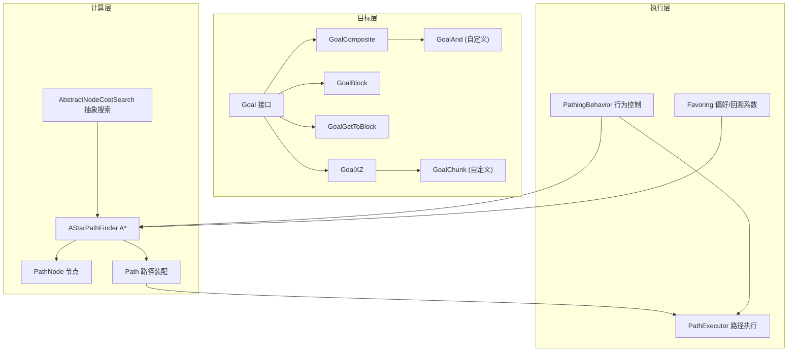
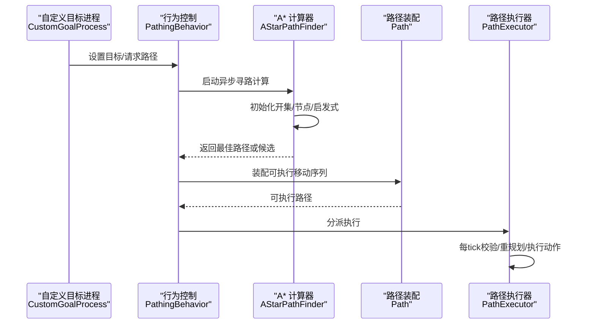
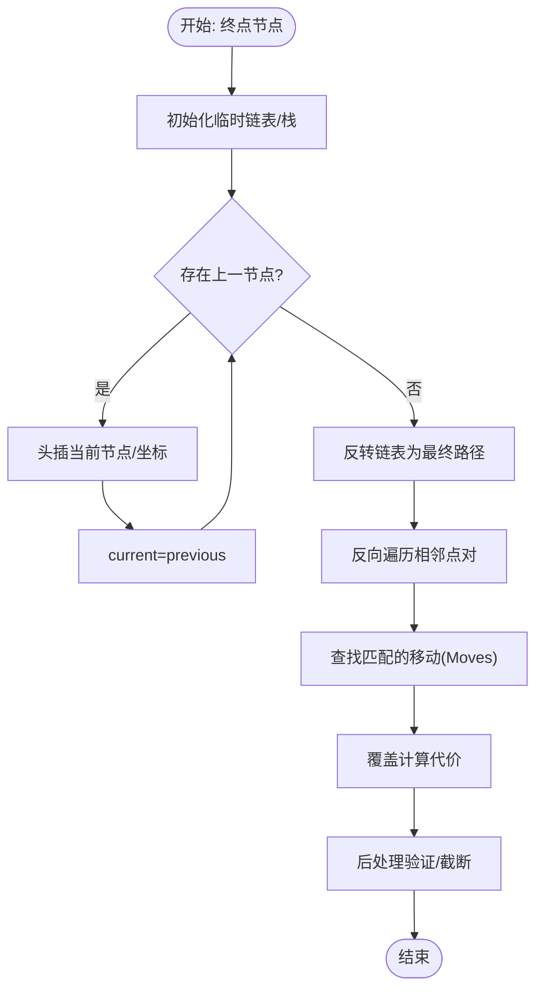
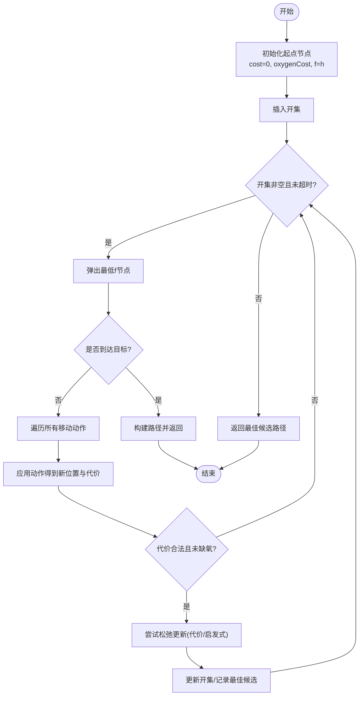
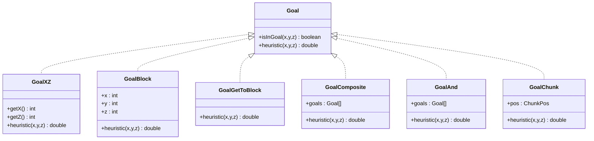
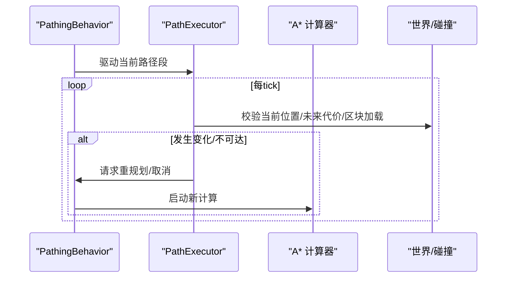
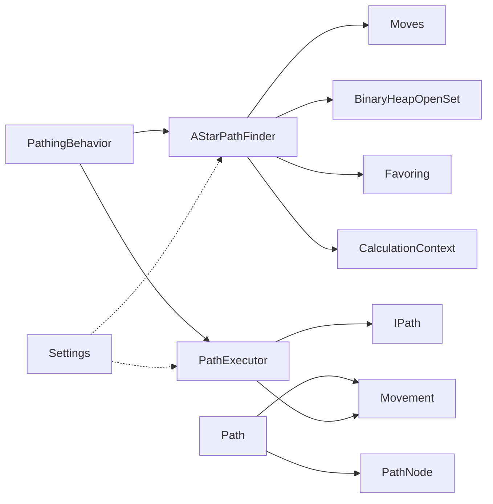

# 自定义寻路

<cite>
**本文引用的文件**
- [AStarPathFinder.java](file://src/main/java/baritone/pathing/calc/AStarPathFinder.java)
- [AbstractNodeCostSearch.java](file://src/main/java/baritone/pathing/calc/AbstractNodeCostSearch.java)
- [PathNode.java](file://src/main/java/baritone/pathing/calc/PathNode.java)
- [Path.java](file://src/main/java/baritone/pathing/calc/Path.java)
- [Goal.java](file://src/main/java/baritone/api/pathing/goals/Goal.java)
- [GoalXZ.java](file://src/main/java/baritone/api/pathing/goals/GoalXZ.java)
- [GoalBlock.java](file://src/main/java/baritone/api/pathing/goals/GoalBlock.java)
- [GoalGetToBlock.java](file://src/main/java/baritone/api/pathing/goals/GoalGetToBlock.java)
- [GoalComposite.java](file://src/main/java/baritone/api/pathing/goals/GoalComposite.java)
- [GoalAnd.java](file://src/main/java/adris/altoclef/util/baritone/GoalAnd.java)
- [GoalChunk.java](file://src/main/java/adris/altoclef/util/baritone/GoalChunk.java)
- [PathingBehavior.java](file://src/main/java/baritone/behavior/PathingBehavior.java)
- [PathExecutor.java](file://src/main/java/baritone/pathing/path/PathExecutor.java)
- [Favoring.java](file://src/main/java/baritone/utils/pathing/Favoring.java)
- [Settings.java](file://src/main/java/baritone/api/Settings.java)
- [CustomGoalProcess.java](file://src/main/java/baritone/process/CustomGoalProcess.java)
</cite>

## 目录
1. [简介](#简介)
2. [项目结构](#项目结构)
3. [核心组件](#核心组件)
4. [架构总览](#架构总览)
5. [详细组件分析](#详细组件分析)
6. [依赖关系分析](#依赖关系分析)
7. [性能考量](#性能考量)
8. [故障排查指南](#故障排查指南)
9. [结论](#结论)
10. [附录](#附录)

## 简介
本技术文档聚焦于自定义寻路模块，系统性解析以下内容：
- Path 类的路径回溯与后处理装配流程
- AStarPathFinder 的 A* 寻路实现细节（启发式、开集管理、代价更新、超时与回退策略）
- Goal 目标系统的扩展机制与多种 Goal 类型的实现原理
- 路径计算参数配置、启发式函数设计与路径优化策略
- 性能考虑、内存管理与动态路径重规划机制
- 与游戏世界的碰撞检测、障碍物避让与路径执行的协同方式
- 常见问题与优化建议

## 项目结构
该模块位于 baritone 子系统中，围绕“目标接口 + A* 计算器 + 路径执行器”三层协作展开；同时提供自定义 Goal 扩展以满足多样化场景。

图示来源
- [AStarPathFinder.java:16-168](file://src/main/java/baritone/pathing/calc/AStarPathFinder.java#L16-L168)
- [AbstractNodeCostSearch.java:16-154](file://src/main/java/baritone/pathing/calc/AbstractNodeCostSearch.java#L16-L154)
- [PathNode.java:7-47](file://src/main/java/baritone/pathing/calc/PathNode.java#L7-L47)
- [Path.java:17-135](file://src/main/java/baritone/pathing/calc/Path.java#L17-L135)
- [Goal.java:5-21](file://src/main/java/baritone/api/pathing/goals/Goal.java#L5-L21)
- [GoalXZ.java:9-73](file://src/main/java/baritone/api/pathing/goals/GoalXZ.java#L9-L73)
- [GoalBlock.java:7-50](file://src/main/java/baritone/api/pathing/goals/GoalBlock.java#L7-L50)
- [GoalGetToBlock.java:7-45](file://src/main/java/baritone/api/pathing/goals/GoalGetToBlock.java#L7-L45)
- [GoalComposite.java:5-53](file://src/main/java/baritone/api/pathing/goals/GoalComposite.java#L5-L53)
- [GoalAnd.java:6-48](file://src/main/java/adris/altoclef/util/baritone/GoalAnd.java#L6-L48)
- [GoalChunk.java:7-26](file://src/main/java/adris/altoclef/util/baritone/GoalChunk.java#L7-L26)
- [PathingBehavior.java:29-200](file://src/main/java/baritone/behavior/PathingBehavior.java#L29-L200)
- [PathExecutor.java:38-200](file://src/main/java/baritone/pathing/path/PathExecutor.java#L38-L200)
- [Favoring.java:10-39](file://src/main/java/baritone/utils/pathing/Favoring.java#L10-L39)

章节来源
- [AStarPathFinder.java:16-168](file://src/main/java/baritone/pathing/calc/AStarPathFinder.java#L16-L168)
- [AbstractNodeCostSearch.java:16-154](file://src/main/java/baritone/pathing/calc/AbstractNodeCostSearch.java#L16-L154)
- [PathNode.java:7-47](file://src/main/java/baritone/pathing/calc/PathNode.java#L7-L47)
- [Path.java:17-135](file://src/main/java/baritone/pathing/calc/Path.java#L17-L135)
- [Goal.java:5-21](file://src/main/java/baritone/api/pathing/goals/Goal.java#L5-L21)
- [GoalXZ.java:9-73](file://src/main/java/baritone/api/pathing/goals/GoalXZ.java#L9-L73)
- [GoalBlock.java:7-50](file://src/main/java/baritone/api/pathing/goals/GoalBlock.java#L7-L50)
- [GoalGetToBlock.java:7-45](file://src/main/java/baritone/api/pathing/goals/GoalGetToBlock.java#L7-L45)
- [GoalComposite.java:5-53](file://src/main/java/baritone/api/pathing/goals/GoalComposite.java#L5-L53)
- [GoalAnd.java:6-48](file://src/main/java/adris/altoclef/util/baritone/GoalAnd.java#L6-L48)
- [GoalChunk.java:7-26](file://src/main/java/adris/altoclef/util/baritone/GoalChunk.java#L7-L26)
- [PathingBehavior.java:29-200](file://src/main/java/baritone/behavior/PathingBehavior.java#L29-L200)
- [PathExecutor.java:38-200](file://src/main/java/baritone/pathing/path/PathExecutor.java#L38-L200)
- [Favoring.java:10-39](file://src/main/java/baritone/utils/pathing/Favoring.java#L10-L39)

## 核心组件
- 目标接口与多种目标类型：Goal 接口定义可达性判断与启发式评估；内置 GoalXZ、GoalBlock、GoalGetToBlock、GoalComposite；自定义 GoalAnd、GoalChunk 扩展组合与区块级目标。
- A* 计算器：AStarPathFinder 继承抽象搜索，使用二叉堆开集、启发式 + 实际代价、代价下界更新与多系数“最佳路径候选”策略。
- 路径装配与执行：Path 在计算完成后回溯节点链并装配具体移动序列；PathExecutor 驱动实体按移动序列执行，并进行动态校验与重规划。
- 行为与偏好：PathingBehavior 协调计算与执行、拼接与回退；Favoring 提供回溯成本偏好与避让区域权重。

章节来源
- [Goal.java:5-21](file://src/main/java/baritone/api/pathing/goals/Goal.java#L5-L21)
- [GoalXZ.java:9-73](file://src/main/java/baritone/api/pathing/goals/GoalXZ.java#L9-L73)
- [GoalBlock.java:7-50](file://src/main/java/baritone/api/pathing/goals/GoalBlock.java#L7-L50)
- [GoalGetToBlock.java:7-45](file://src/main/java/baritone/api/pathing/goals/GoalGetToBlock.java#L7-L45)
- [GoalComposite.java:5-53](file://src/main/java/baritone/api/pathing/goals/GoalComposite.java#L5-L53)
- [GoalAnd.java:6-48](file://src/main/java/adris/altoclef/util/baritone/GoalAnd.java#L6-L48)
- [GoalChunk.java:7-26](file://src/main/java/adris/altoclef/util/baritone/GoalChunk.java#L7-L26)
- [AStarPathFinder.java:16-168](file://src/main/java/baritone/pathing/calc/AStarPathFinder.java#L16-L168)
- [AbstractNodeCostSearch.java:16-154](file://src/main/java/baritone/pathing/calc/AbstractNodeCostSearch.java#L16-L154)
- [PathNode.java:7-47](file://src/main/java/baritone/pathing/calc/PathNode.java#L7-L47)
- [Path.java:17-135](file://src/main/java/baritone/pathing/calc/Path.java#L17-L135)
- [PathingBehavior.java:29-200](file://src/main/java/baritone/behavior/PathingBehavior.java#L29-L200)
- [PathExecutor.java:38-200](file://src/main/java/baritone/pathing/path/PathExecutor.java#L38-L200)
- [Favoring.java:10-39](file://src/main/java/baritone/utils/pathing/Favoring.java#L10-L39)

## 架构总览
下图展示从目标设置到路径执行的关键交互：

图示来源
- [CustomGoalProcess.java:11-97](file://src/main/java/baritone/process/CustomGoalProcess.java#L11-L97)
- [PathingBehavior.java:195-457](file://src/main/java/baritone/behavior/PathingBehavior.java#L195-L457)
- [AStarPathFinder.java:26-166](file://src/main/java/baritone/pathing/calc/AStarPathFinder.java#L26-L166)
- [Path.java:84-104](file://src/main/java/baritone/pathing/calc/Path.java#L84-L104)
- [PathExecutor.java:68-200](file://src/main/java/baritone/pathing/path/PathExecutor.java#L68-L200)

## 详细组件分析

### Path 类：路径回溯与后处理
- 回溯逻辑：从终点节点沿 previous 指针逆向收集节点与坐标序列，形成路径链表。
- 移动装配：通过反向匹配相邻两点，查找对应 Moves 并生成 Movement，覆盖计算代价，确保与实际代价一致。
- 后处理验证：完成装配后进行一致性检查，必要时降级为截断路径（CutoffPath）以保证可执行性。

图示来源
- [Path.java:28-104](file://src/main/java/baritone/pathing/calc/Path.java#L28-L104)

章节来源
- [Path.java:17-135](file://src/main/java/baritone/pathing/calc/Path.java#L17-L135)

### AStarPathFinder：A* 寻路实现
- 开始节点初始化：设置起点代价、氧气代价与 f=g+h。
- 开集管理：使用二叉堆优先队列，按 f 值弹出最小元素。
- 代价更新：对邻居节点尝试松弛更新，维护 previous 指针与 open/close 状态。
- 多系数最佳路径：维护多个“启发式+代价”的阈值，记录不同系数下的最佳节点，加速早期可行路径返回。
- 超时与边界：支持主超时与失败超时，慢速模式与时间片检查，空区块边界限制。
- 偏好与回溯：结合 Favoring 对回溯路径与避让区域施加权重。

图示来源
- [AStarPathFinder.java:26-166](file://src/main/java/baritone/pathing/calc/AStarPathFinder.java#L26-L166)
- [AbstractNodeCostSearch.java:46-154](file://src/main/java/baritone/pathing/calc/AbstractNodeCostSearch.java#L46-L154)
- [PathNode.java:19-31](file://src/main/java/baritone/pathing/calc/PathNode.java#L19-L31)
- [Favoring.java:13-37](file://src/main/java/baritone/utils/pathing/Favoring.java#L13-L37)

章节来源
- [AStarPathFinder.java:16-168](file://src/main/java/baritone/pathing/calc/AStarPathFinder.java#L16-L168)
- [AbstractNodeCostSearch.java:16-154](file://src/main/java/baritone/pathing/calc/AbstractNodeCostSearch.java#L16-L154)
- [PathNode.java:7-47](file://src/main/java/baritone/pathing/calc/PathNode.java#L7-L47)
- [Favoring.java:10-39](file://src/main/java/baritone/utils/pathing/Favoring.java#L10-L39)

### Goal 目标系统与扩展机制
- Goal 接口：定义 isInGoal 与 heuristic，支持按坐标或 BlockPos 调用。
- 内置目标：
  - GoalXZ：仅在 XZ 平面命中，启发式采用直/斜步数加权。
  - GoalBlock：单格命中，启发式拆分为 Y 层与 XZ 平面。
  - GoalGetToBlock：允许进入目标方块周围一格范围，适合“靠近某方块”场景。
  - GoalComposite：复合目标，取子目标启发式的最小值，实现 OR 语义。
- 自定义目标：
  - GoalAnd：AND 语义，要求同时满足多个目标，启发式为各目标启发式之和。
  - GoalChunk：以区块中心为启发式，命中区块内任意 XZ 位置。

图示来源
- [Goal.java:5-21](file://src/main/java/baritone/api/pathing/goals/Goal.java#L5-L21)
- [GoalXZ.java:9-73](file://src/main/java/baritone/api/pathing/goals/GoalXZ.java#L9-L73)
- [GoalBlock.java:7-50](file://src/main/java/baritone/api/pathing/goals/GoalBlock.java#L7-L50)
- [GoalGetToBlock.java:7-45](file://src/main/java/baritone/api/pathing/goals/GoalGetToBlock.java#L7-L45)
- [GoalComposite.java:5-53](file://src/main/java/baritone/api/pathing/goals/GoalComposite.java#L5-L53)
- [GoalAnd.java:6-48](file://src/main/java/adris/altoclef/util/baritone/GoalAnd.java#L6-L48)
- [GoalChunk.java:7-26](file://src/main/java/adris/altoclef/util/baritone/GoalChunk.java#L7-L26)

章节来源
- [Goal.java:5-21](file://src/main/java/baritone/api/pathing/goals/Goal.java#L5-L21)
- [GoalXZ.java:9-73](file://src/main/java/baritone/api/pathing/goals/GoalXZ.java#L9-L73)
- [GoalBlock.java:7-50](file://src/main/java/baritone/api/pathing/goals/GoalBlock.java#L7-L50)
- [GoalGetToBlock.java:7-45](file://src/main/java/baritone/api/pathing/goals/GoalGetToBlock.java#L7-L45)
- [GoalComposite.java:5-53](file://src/main/java/baritone/api/pathing/goals/GoalComposite.java#L5-L53)
- [GoalAnd.java:6-48](file://src/main/java/adris/altoclef/util/baritone/GoalAnd.java#L6-L48)
- [GoalChunk.java:7-26](file://src/main/java/adris/altoclef/util/baritone/GoalChunk.java#L7-L26)

### 动态路径重规划与执行协同
- 行为控制：PathingBehavior 在每 tick 决策是否继续当前段、拼接下一路径、启动新计算或取消。
- 执行器：PathExecutor 每 tick 校验当前位置是否仍在路径上、未来代价是否显著上升、目的地是否卸载、是否需要回退。
- 事件与状态：通过 PathEvent 通知外部（如渲染、日志），并在失败/完成时切换状态机。

图示来源
- [PathingBehavior.java:81-193](file://src/main/java/baritone/behavior/PathingBehavior.java#L81-L193)
- [PathExecutor.java:68-200](file://src/main/java/baritone/pathing/path/PathExecutor.java#L68-L200)

章节来源
- [PathingBehavior.java:29-200](file://src/main/java/baritone/behavior/PathingBehavior.java#L29-L200)
- [PathExecutor.java:38-200](file://src/main/java/baritone/pathing/path/PathExecutor.java#L38-L200)

## 依赖关系分析
- 组件耦合：
  - AStarPathFinder 依赖 CalculationContext、Moves、BinaryHeapOpenSet、Favoring。
  - Path 依赖 PathNode 与 CalculationContext，装配 Movement。
  - PathExecutor 依赖 IPath 与 Movement，与 PathingBehavior 协作。
- 外部依赖：
  - Settings 提供路径超时、回溯系数、启发式权重、地图缓存大小等全局参数。
  - CustomGoalProcess 提供外部设置目标与触发路径的入口。

图示来源
- [AStarPathFinder.java:8-24](file://src/main/java/baritone/pathing/calc/AStarPathFinder.java#L8-L24)
- [Path.java:17-46](file://src/main/java/baritone/pathing/calc/Path.java#L17-L46)
- [PathExecutor.java:38-62](file://src/main/java/baritone/pathing/path/PathExecutor.java#L38-L62)
- [PathingBehavior.java:29-50](file://src/main/java/baritone/behavior/PathingBehavior.java#L29-L50)
- [Settings.java:87-120](file://src/main/java/baritone/api/Settings.java#L87-L120)

章节来源
- [AStarPathFinder.java:16-168](file://src/main/java/baritone/pathing/calc/AStarPathFinder.java#L16-L168)
- [Path.java:17-135](file://src/main/java/baritone/pathing/calc/Path.java#L17-L135)
- [PathExecutor.java:38-200](file://src/main/java/baritone/pathing/path/PathExecutor.java#L38-L200)
- [PathingBehavior.java:29-200](file://src/main/java/baritone/behavior/PathingBehavior.java#L29-L200)
- [Settings.java:87-120](file://src/main/java/baritone/api/Settings.java#L87-L120)

## 性能考量
- 启发式设计
  - GoalXZ 使用直/斜步数与全局权重因子相乘，平衡 XZ 平面移动成本。
  - GoalBlock 将 Y 层与 XZ 平面启发式叠加，避免单一维度偏差。
- A* 优化
  - 多系数最佳候选：在不同系数下记录最佳启发式，快速返回早期可行解。
  - 最小改进再传播：受设置控制，减少无效更新。
  - 开集与哈希映射：使用二叉堆与长键映射，降低重复节点处理成本。
- 参数配置
  - 超时与慢速模式：支持主/失败超时与慢速延迟，适配高延迟环境。
  - 地图缓存：默认大小与负载因子影响内存占用与查询性能。
  - 回溯偏好：回溯成本系数降低回走倾向，提升稳定性。
- 执行阶段
  - 成本验证与前瞻检查：提前发现未来不可行移动，及时取消。
  - 区域卸载暂停：遇到未加载区块时暂停，避免无效尝试。
  - 拼接与回退：在安全点拼接下一路径，减少中断。

章节来源
- [GoalXZ.java:41-56](file://src/main/java/baritone/api/pathing/goals/GoalXZ.java#L41-L56)
- [GoalBlock.java:45-50](file://src/main/java/baritone/api/pathing/goals/GoalBlock.java#L45-L50)
- [AStarPathFinder.java:44-166](file://src/main/java/baritone/pathing/calc/AStarPathFinder.java#L44-L166)
- [AbstractNodeCostSearch.java:28-31](file://src/main/java/baritone/pathing/calc/AbstractNodeCostSearch.java#L28-L31)
- [Settings.java:87-120](file://src/main/java/baritone/api/Settings.java#L87-L120)
- [PathExecutor.java:162-193](file://src/main/java/baritone/pathing/path/PathExecutor.java#L162-L193)

## 故障排查指南
- 寻路失败
  - 现象：返回失败或取消。
  - 排查：检查超时设置、空区块边界数量、代价是否异常、目标是否可达。
  - 参考
    - [AStarPathFinder.java:152-166](file://src/main/java/baritone/pathing/calc/AStarPathFinder.java#L152-L166)
    - [AbstractNodeCostSearch.java:46-62](file://src/main/java/baritone/pathing/calc/AbstractNodeCostSearch.java#L46-L62)
- 路径偏移/偏离
  - 现象：执行器报告远离路径或长时间偏离。
  - 排查：确认当前位置是否仍处于路径有效位置集合；检查未来移动代价是否显著上升。
  - 参考
    - [PathExecutor.java:93-110](file://src/main/java/baritone/pathing/path/PathExecutor.java#L93-L110)
    - [PathExecutor.java:178-193](file://src/main/java/baritone/pathing/path/PathExecutor.java#L178-L193)
- 目标无效/不可达
  - 现象：目标被判定无效或代价过大。
  - 排查：检查目标启发式与 isInGoal 是否合理；确认周围环境是否发生变化。
  - 参考
    - [Goal.java:5-21](file://src/main/java/baritone/api/pathing/goals/Goal.java#L5-L21)
    - [GoalComposite.java:12-32](file://src/main/java/baritone/api/pathing/goals/GoalComposite.java#L12-L32)
- 执行中断
  - 现象：执行器取消当前路径。
  - 排查：是否发生世界变化导致移动不可行；是否到达卸载边界；是否超过最大偏移容忍。
  - 参考
    - [PathExecutor.java:178-193](file://src/main/java/baritone/pathing/path/PathExecutor.java#L178-L193)
    - [PathExecutor.java:153-160](file://src/main/java/baritone/pathing/path/PathExecutor.java#L153-L160)

章节来源
- [AStarPathFinder.java:152-166](file://src/main/java/baritone/pathing/calc/AStarPathFinder.java#L152-L166)
- [AbstractNodeCostSearch.java:46-62](file://src/main/java/baritone/pathing/calc/AbstractNodeCostSearch.java#L46-L62)
- [PathExecutor.java:93-110](file://src/main/java/baritone/pathing/path/PathExecutor.java#L93-L110)
- [PathExecutor.java:178-193](file://src/main/java/baritone/pathing/path/PathExecutor.java#L178-L193)
- [Goal.java:5-21](file://src/main/java/baritone/api/pathing/goals/Goal.java#L5-L21)
- [GoalComposite.java:12-32](file://src/main/java/baritone/api/pathing/goals/GoalComposite.java#L12-L32)

## 结论
本模块通过清晰的目标接口、稳健的 A* 实现与严格的执行校验，提供了可扩展、可配置且高性能的寻路能力。自定义 Goal（GoalAnd、GoalChunk）与偏好机制（Favoring）进一步增强了复杂场景的表达力与鲁棒性。配合合理的参数配置与动态重规划策略，可在变化的游戏中稳定运行。

## 附录
- 关键参数参考
  - 启发式权重：costHeuristic
  - 超时与慢速：primaryTimeoutMS、failureTimeoutMS、slowPath、slowPathTimeoutMS、slowPathTimeDelayMS
  - 地图缓存：pathingMapDefaultSize、pathingMapLoadFactor
  - 回溯偏好：backtrackCostFavoringCoefficient
  - 成本验证：costVerificationLookahead、maxCostIncrease
  - 其他：minimumImprovementRepropagation、pathingMaxChunkBorderFetch、splicePath

章节来源
- [Settings.java:87-120](file://src/main/java/baritone/api/Settings.java#L87-L120)
- [Settings.java:112-118](file://src/main/java/baritone/api/Settings.java#L112-L118)
- [Settings.java:104-105](file://src/main/java/baritone/api/Settings.java#L104-L105)
- [Settings.java:89-89](file://src/main/java/baritone/api/Settings.java#L89-L89)
- [Settings.java:100-101](file://src/main/java/baritone/api/Settings.java#L100-L101)
- [Settings.java:97-97](file://src/main/java/baritone/api/Settings.java#L97-L97)
- [Settings.java:150-150](file://src/main/java/baritone/api/Settings.java#L150-L150)