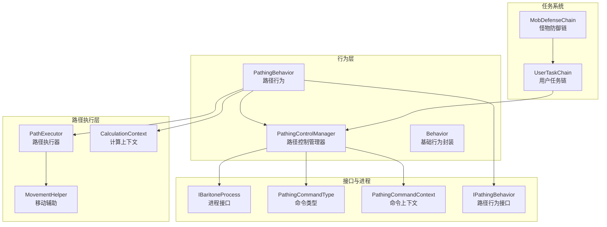
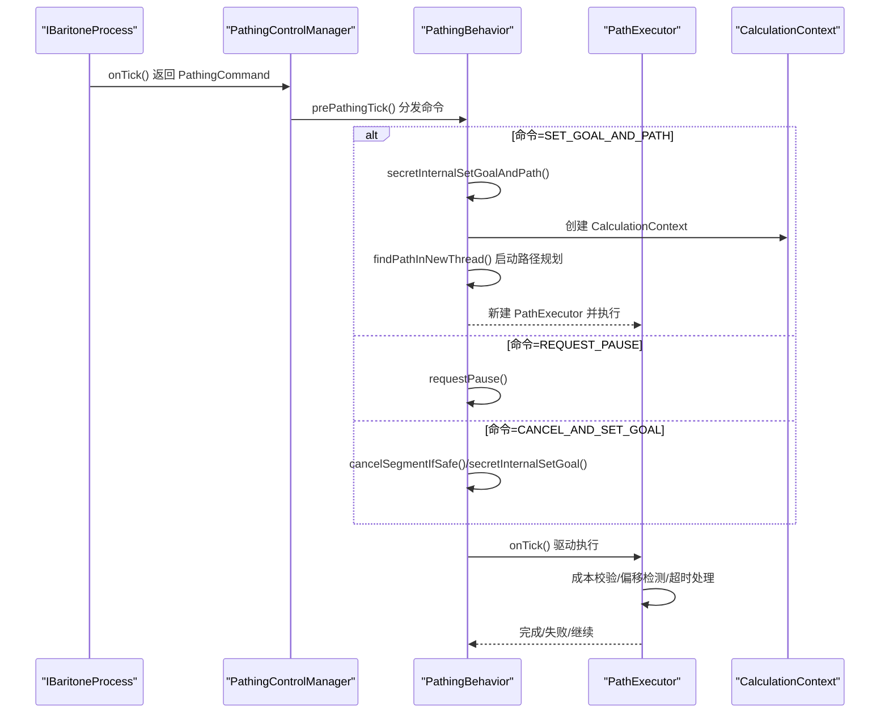
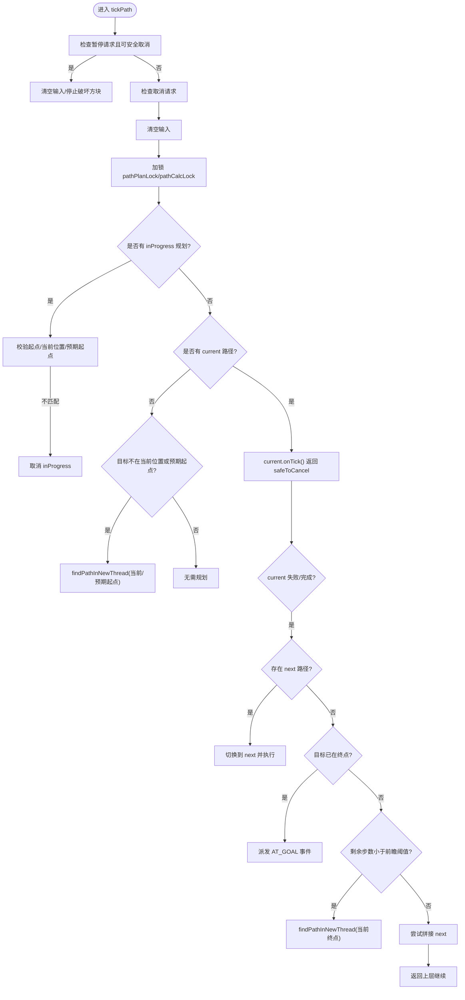
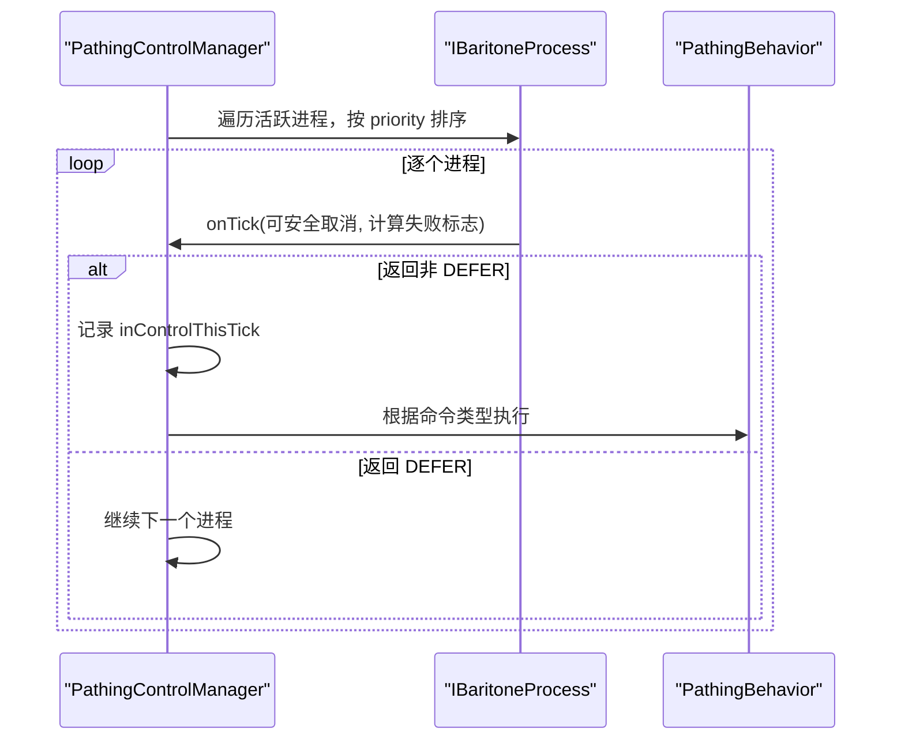
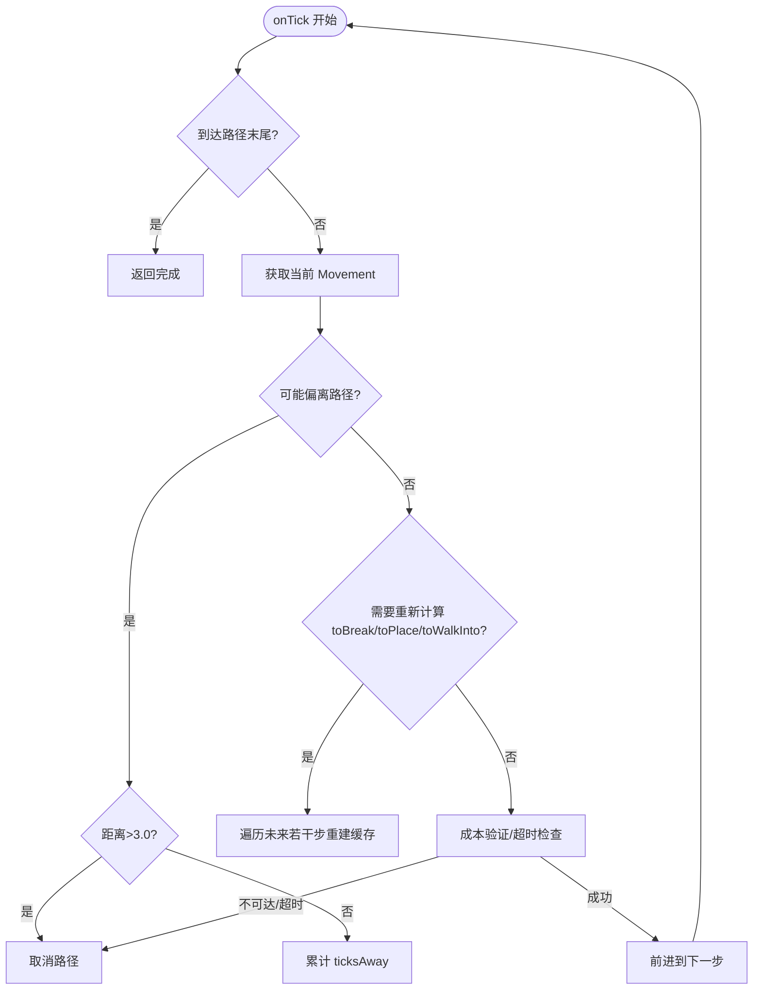
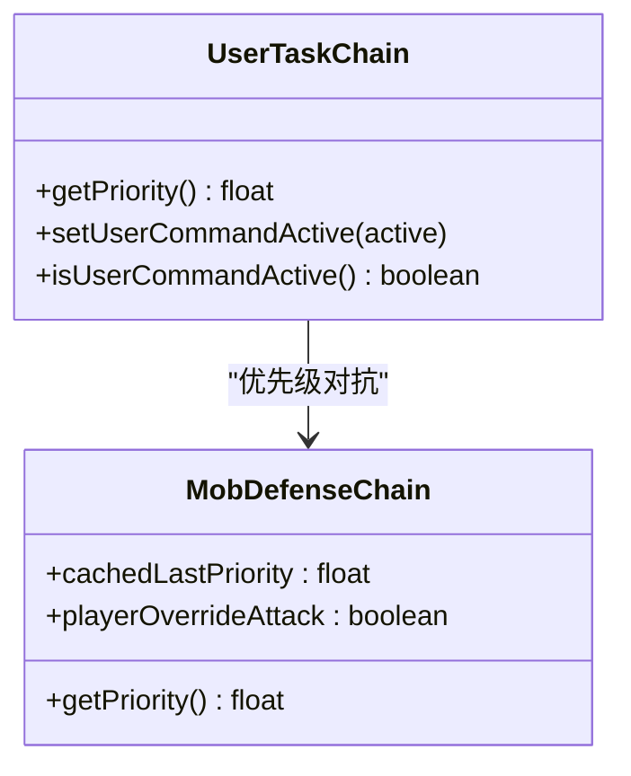
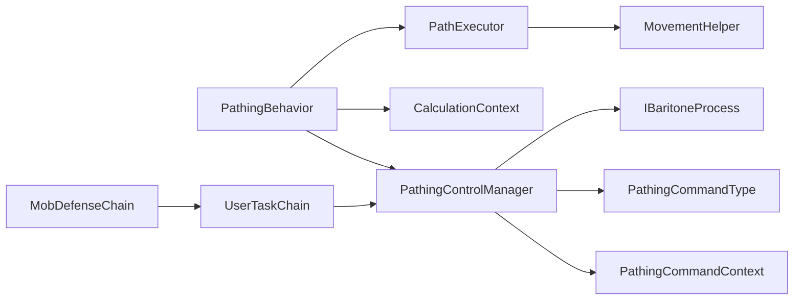

# 路径行为控制

<cite>
**本文引用的文件**
- [PathingBehavior.java](file://src/main/java/baritone/behavior/PathingBehavior.java)
- [PathingControlManager.java](file://src/main/java/baritone/utils/PathingControlManager.java)
- [PathExecutor.java](file://src/main/java/baritone/pathing/path/PathExecutor.java)
- [IPathingBehavior.java](file://src/main/java/baritone/api/behavior/IPathingBehavior.java)
- [Behavior.java](file://src/main/java/baritone/behavior/Behavior.java)
- [CalculationContext.java](file://src/main/java/baritone/pathing/movement/CalculationContext.java)
- [MovementHelper.java](file://src/main/java/baritone/pathing/movement/MovementHelper.java)
- [IBaritoneProcess.java](file://src/main/java/baritone/api/process/IBaritoneProcess.java)
- [PathingCommandType.java](file://src/main/java/baritone/api/process/PathingCommandType.java)
- [PathingCommandContext.java](file://src/main/java/baritone/utils/PathingCommandContext.java)
- [UserTaskChain.java](file://src/main/java/adris/altoclef/chains/UserTaskChain.java)
- [MobDefenseChain.java](file://src/main/java/adris/altoclef/chains/MobDefenseChain.java)
- [AI_NPC游戏指令系统重构.md](file://docs/AI_NPC游戏指令系统重构.md)
</cite>

## 目录
1. [简介](#简介)
2. [项目结构](#项目结构)
3. [核心组件](#核心组件)
4. [架构总览](#架构总览)
5. [详细组件分析](#详细组件分析)
6. [依赖关系分析](#依赖关系分析)
7. [性能考量](#性能考量)
8. [故障排查指南](#故障排查指南)
9. [结论](#结论)
10. [附录](#附录)

## 简介
本文件面向“路径行为控制系统”的设计与实现，围绕 PathingBehavior 的状态机、决策流程、与任务系统的协作机制进行系统化阐述。重点覆盖以下主题：
- 行为状态管理：当前路径段、下一路径段、目标点、计算上下文、暂停/取消/安全检查等。
- 决策算法：路径规划线程化、前瞻规划、拼接与裁剪、事件派发与外部监听。
- 优先级机制：多行为并存时的冲突解决、行为切换条件、执行状态监控。
- 与任务系统的集成：如何根据任务需求调整行为策略、动态目标变化处理、执行效率优化。
- 实用技巧：自定义路径行为、调试行为逻辑、复杂场景冲突处理。
- 扩展与优化：可扩展点、性能优化策略。

## 项目结构
本系统位于 baritone 子模块中，核心类集中在 behavior、utils、pathing、api 等包；同时与任务系统（chains）通过优先级与命令类型进行协作。

图示来源
- [PathingBehavior.java:29-526](file://src/main/java/baritone/behavior/PathingBehavior.java#L29-L526)
- [PathingControlManager.java:21-200](file://src/main/java/baritone/utils/PathingControlManager.java#L21-L200)
- [PathExecutor.java:38-632](file://src/main/java/baritone/pathing/path/PathExecutor.java#L38-L632)
- [IPathingBehavior.java:11-53](file://src/main/java/baritone/api/behavior/IPathingBehavior.java#L11-L53)
- [Behavior.java:7-16](file://src/main/java/baritone/behavior/Behavior.java#L7-L16)
- [CalculationContext.java:29-197](file://src/main/java/baritone/pathing/movement/CalculationContext.java#L29-L197)
- [MovementHelper.java:64-517](file://src/main/java/baritone/pathing/movement/MovementHelper.java#L64-L517)
- [IBaritoneProcess.java:3-23](file://src/main/java/baritone/api/process/IBaritoneProcess.java#L3-L23)
- [PathingCommandType.java:3-10](file://src/main/java/baritone/api/process/PathingCommandType.java#L3-L10)
- [PathingCommandContext.java:8-15](file://src/main/java/baritone/utils/PathingCommandContext.java#L8-L15)
- [UserTaskChain.java:14-236](file://src/main/java/adris/altoclef/chains/UserTaskChain.java#L14-L236)
- [MobDefenseChain.java:161-185](file://src/main/java/adris/altoclef/chains/MobDefenseChain.java#L161-L185)

章节来源
- [PathingBehavior.java:29-526](file://src/main/java/baritone/behavior/PathingBehavior.java#L29-L526)
- [PathingControlManager.java:21-200](file://src/main/java/baritone/utils/PathingControlManager.java#L21-L200)

## 核心组件
- PathingBehavior：路径行为主控，负责目标设定、路径规划、当前/下一路径段调度、事件派发、安全取消、暂停/恢复、前瞻规划与拼接。
- PathingControlManager：统一调度各 IBaritoneProcess，按优先级选择“拥有控制权”的进程，下发 PathingCommand，并在每tick前后执行预/后处理。
- PathExecutor：单条路径的执行器，驱动实体按路径移动，处理偏移、阻断、成本变化、超时、冲刺/跳跃等策略。
- CalculationContext：路径计算所需的上下文，封装世界数据、工具集、设置项、氧气/呼吸等参数，支持线程安全使用。
- MovementHelper：移动辅助工具，提供可行走/可破坏/可放置等判定、工具选择、流体/楼梯/半砖等规则判断。
- IPathingBehavior/Behavior：接口与基类，统一行为注册、上下文访问、事件派发。
- IBaritoneProcess/PathingCommandType/PathingCommandContext：进程接口与命令模型，用于任务系统向路径系统提交目标与策略。
- UserTaskChain/MobDefenseChain：任务系统中的行为链，通过优先级影响路径控制权归属。

章节来源
- [IPathingBehavior.java:11-53](file://src/main/java/baritone/api/behavior/IPathingBehavior.java#L11-L53)
- [Behavior.java:7-16](file://src/main/java/baritone/behavior/Behavior.java#L7-L16)
- [PathingBehavior.java:29-526](file://src/main/java/baritone/behavior/PathingBehavior.java#L29-L526)
- [PathingControlManager.java:21-200](file://src/main/java/baritone/utils/PathingControlManager.java#L21-L200)
- [PathExecutor.java:38-632](file://src/main/java/baritone/pathing/path/PathExecutor.java#L38-L632)
- [CalculationContext.java:29-197](file://src/main/java/baritone/pathing/movement/CalculationContext.java#L29-L197)
- [MovementHelper.java:64-517](file://src/main/java/baritone/pathing/movement/MovementHelper.java#L64-L517)
- [IBaritoneProcess.java:3-23](file://src/main/java/baritone/api/process/IBaritoneProcess.java#L3-L23)
- [PathingCommandType.java:3-10](file://src/main/java/baritone/api/process/PathingCommandType.java#L3-L10)
- [PathingCommandContext.java:8-15](file://src/main/java/baritone/utils/PathingCommandContext.java#L8-L15)
- [UserTaskChain.java:14-236](file://src/main/java/adris/altoclef/chains/UserTaskChain.java#L14-L236)
- [MobDefenseChain.java:161-185](file://src/main/java/adris/altoclef/chains/MobDefenseChain.java#L161-L185)

## 架构总览
路径行为控制采用“行为层 + 控制层 + 执行层 + 上下文层”的分层设计：
- 行为层：PathingBehavior 统一管理目标、路径段、事件与安全策略。
- 控制层：PathingControlManager 聚合多个 IBaritoneProcess，按优先级选择控制者，下发命令。
- 执行层：PathExecutor 驱动实体移动，处理偏移、阻断、成本变化、超时等。
- 上下文层：CalculationContext 提供路径计算所需全部信息，MovementHelper 提供规则判定。

图示来源
- [PathingControlManager.java:71-114](file://src/main/java/baritone/utils/PathingControlManager.java#L71-L114)
- [PathingBehavior.java:199-231](file://src/main/java/baritone/behavior/PathingBehavior.java#L199-L231)
- [PathExecutor.java:68-224](file://src/main/java/baritone/pathing/path/PathExecutor.java#L68-L224)

章节来源
- [PathingControlManager.java:71-135](file://src/main/java/baritone/utils/PathingControlManager.java#L71-L135)
- [PathingBehavior.java:199-231](file://src/main/java/baritone/behavior/PathingBehavior.java#L199-L231)
- [PathExecutor.java:68-224](file://src/main/java/baritone/pathing/path/PathExecutor.java#L68-L224)

## 详细组件分析

### PathingBehavior：路径行为主控
- 状态字段：当前/下一路径段、目标、计算上下文、计数器、期望段起点、事件队列、是否可安全取消、暂停/取消请求标记等。
- 关键流程：
  - 每tick触发 dispatchEvents → 预处理 → tickPath → 计数器递增 → 再次派发事件。
  - tickPath 中处理暂停/取消、当前路径执行、失败/完成后的后续动作（继续下一路径/重新规划/前瞻规划）。
  - 通过 findPathInNewThread 异步执行路径规划，避免主线程阻塞；根据目标与当前路径段决定是“整段”还是“前瞻”。
  - 支持拼接（trySplice）、裁剪（cutIfTooLong）、估计剩余时间（estimatedTicksToGoal）。
- 事件机制：内部队列 toDispatch，集中派发 CALC_STARTED/CALC_FINISHED、NEXT_SEGMENT_CALC_STARTED 等事件给 GameEventHandler。

图示来源
- [PathingBehavior.java:81-193](file://src/main/java/baritone/behavior/PathingBehavior.java#L81-L193)
- [PathingBehavior.java:404-502](file://src/main/java/baritone/behavior/PathingBehavior.java#L404-L502)

章节来源
- [PathingBehavior.java:29-526](file://src/main/java/baritone/behavior/PathingBehavior.java#L29-L526)

### PathingControlManager：多行为优先级与控制权
- 注册与排序：维护活跃进程集合，按 priority 降序排序，遇到非临时进程时，其余进程失去控制权。
- 命令分发：prePathingTick 根据 PathingCommandType 执行不同动作（请求暂停、取消并设目标、强制/重验证目标与路径、设置目标与路径）。
- 后处理：postPathingTick 在某些命令类型下进行强制/重验证并重新设置路径。
- 目标有效性：提供 forceRevalidate/revalidateGoal 判定目标是否需要软取消并重建。

图示来源
- [PathingControlManager.java:159-194](file://src/main/java/baritone/utils/PathingControlManager.java#L159-L194)
- [PathingControlManager.java:71-114](file://src/main/java/baritone/utils/PathingControlManager.java#L71-L114)

章节来源
- [PathingControlManager.java:21-200](file://src/main/java/baritone/utils/PathingControlManager.java#L21-L200)
- [IBaritoneProcess.java:3-23](file://src/main/java/baritone/api/process/IBaritoneProcess.java#L3-L23)
- [PathingCommandType.java:3-10](file://src/main/java/baritone/api/process/PathingCommandType.java#L3-L10)

### PathExecutor：路径执行与安全策略
- 偏移检测：若偏离路径超过阈值（2.0/3.0）则累计 ticksAway 或直接取消；对“掉落”特殊处理。
- 成本与阻断：对未来若干步进行成本验证，若不可达或成本大幅上升则取消；对“可安全取消”的移动进行保护。
- 输入与冲刺：根据移动类型与设置决定是否冲刺、跳跃、跳过某些移动（如直上直下）。
- 拼接与裁剪：支持与下一路径拼接，或历史过长时裁剪前段，保持执行连续性。
- 事件与日志：记录调试信息，便于定位执行异常。

图示来源
- [PathExecutor.java:68-224](file://src/main/java/baritone/pathing/path/PathExecutor.java#L68-L224)
- [PathExecutor.java:271-283](file://src/main/java/baritone/pathing/path/PathExecutor.java#L271-L283)

章节来源
- [PathExecutor.java:38-632](file://src/main/java/baritone/pathing/path/PathExecutor.java#L38-L632)

### CalculationContext 与 MovementHelper：路径计算与规则
- CalculationContext：封装实体、世界、工具集、设置项（如允许游泳、最大跌落高度、跳跃惩罚、水步行速度等），提供成本计算与保护判定。
- MovementHelper：提供可行走/可放置/可破坏等规则，涵盖门/栅栏门/雪层/楼梯/半砖/流体/火/蜘蛛网等复杂情况，支持基于工具的挖掘耗时估算。

章节来源
- [CalculationContext.java:29-197](file://src/main/java/baritone/pathing/movement/CalculationContext.java#L29-L197)
- [MovementHelper.java:64-517](file://src/main/java/baritone/pathing/movement/MovementHelper.java#L64-L517)

### 与任务系统的集成：优先级与冲突解决
- 用户任务链（UserTaskChain）：当用户命令激活时，优先级提升至较高水平，抵抗其他链路（如 MobDefenseChain）的抢占。
- 怪物防御链（MobDefenseChain）：在特定条件下（如玩家主动攻击、生命值较低）调整自身优先级，避免在用户处于危险时打断用户命令。
- 文档说明：重构后，用户命令在 HIGH_PRIORITY 模式下优先级为 100，仅在生命值极低时才允许被防御链抢占。

图示来源
- [UserTaskChain.java:126-137](file://src/main/java/adris/altoclef/chains/UserTaskChain.java#L126-L137)
- [MobDefenseChain.java:161-185](file://src/main/java/adris/altoclef/chains/MobDefenseChain.java#L161-L185)
- [AI_NPC游戏指令系统重构.md:1475-1512](file://docs/AI_NPC游戏指令系统重构.md#L1475-L1512)

章节来源
- [UserTaskChain.java:14-236](file://src/main/java/adris/altoclef/chains/UserTaskChain.java#L14-L236)
- [MobDefenseChain.java:161-185](file://src/main/java/adris/altoclef/chains/MobDefenseChain.java#L161-L185)
- [AI_NPC游戏指令系统重构.md:1475-1512](file://docs/AI_NPC游戏指令系统重构.md#L1475-L1512)

## 依赖关系分析
- PathingBehavior 依赖 PathExecutor、CalculationContext、IBaritoneProcess、PathingCommandContext、PathingControlManager。
- PathExecutor 依赖 MovementHelper、CalculationContext、PathingBehavior。
- PathingControlManager 依赖 IBaritoneProcess、PathingCommandType、PathingCommandContext。
- UserTaskChain 与 MobDefenseChain 通过优先级影响 PathingControlManager 的控制权归属。

图示来源
- [PathingBehavior.java:29-526](file://src/main/java/baritone/behavior/PathingBehavior.java#L29-L526)
- [PathExecutor.java:38-632](file://src/main/java/baritone/pathing/path/PathExecutor.java#L38-L632)
- [PathingControlManager.java:21-200](file://src/main/java/baritone/utils/PathingControlManager.java#L21-L200)
- [UserTaskChain.java:14-236](file://src/main/java/adris/altoclef/chains/UserTaskChain.java#L14-L236)
- [MobDefenseChain.java:161-185](file://src/main/java/adris/altoclef/chains/MobDefenseChain.java#L161-L185)

章节来源
- [PathingBehavior.java:29-526](file://src/main/java/baritone/behavior/PathingBehavior.java#L29-L526)
- [PathingControlManager.java:21-200](file://src/main/java/baritone/utils/PathingControlManager.java#L21-L200)

## 性能考量
- 异步路径规划：通过 PlayerEngine 线程池异步执行路径规划，避免主线程阻塞；合理设置主/前瞻超时，减少长时间占用。
- 成本验证与缓存：PathExecutor 对未来若干步进行成本验证，及时发现不可达或成本大幅上升的情况，尽早取消以节省资源。
- 偏移与超时：对偏离路径与单步超时进行严格控制，防止无效执行；对“掉落”等特殊移动进行特殊处理，降低误判。
- 历史裁剪：当路径历史过长时进行裁剪，减少内存与计算负担。
- 设置项优化：通过 CalculationContext 与 MovementHelper 的规则，结合设置项（如允许游泳、最大跌落高度、跳跃惩罚等）平衡安全性与效率。

[本节为通用指导，无需列出具体文件来源]

## 故障排查指南
- 路径频繁取消
  - 检查是否频繁偏离路径（ticksAway 超过阈值）或成本大幅上升；确认 MovementHelper 规则与 CalculationContext 设置是否合理。
  - 参考路径执行器的偏移检测与成本验证逻辑。
- 目标无法到达
  - 检查 PathingBehavior 的事件派发与 PathingControlManager 的命令类型是否正确；确认目标是否被判定为无效或需要重验证。
  - 关注“丢弃孤儿路径段”“前瞻失败”等日志。
- 行为冲突
  - 若用户命令被防御链抢占，检查 UserTaskChain 的优先级与 MobDefenseChain 的 cap 逻辑；确保在生命危险时防御链优先级不受限制。
- 调试建议
  - 使用 PathExecutor 的调试日志定位执行阶段；在 PathingBehavior 中查看事件队列与派发时机。
  - 在 CalculationContext 中核对关键设置项（如允许游泳、最大跌落高度、跳跃惩罚等）。

章节来源
- [PathExecutor.java:94-110](file://src/main/java/baritone/pathing/path/PathExecutor.java#L94-L110)
- [PathExecutor.java:178-189](file://src/main/java/baritone/pathing/path/PathExecutor.java#L178-L189)
- [PathingBehavior.java:448-454](file://src/main/java/baritone/behavior/PathingBehavior.java#L448-L454)
- [UserTaskChain.java:126-137](file://src/main/java/adris/altoclef/chains/UserTaskChain.java#L126-L137)
- [MobDefenseChain.java:161-185](file://src/main/java/adris/altoclef/chains/MobDefenseChain.java#L161-L185)

## 结论
路径行为控制系统通过“行为层-控制层-执行层-上下文层”的清晰分层，实现了目标驱动、异步规划、安全执行与高效拼接的综合能力。其优先级机制与任务系统紧密耦合，在保证用户体验的同时兼顾生存与安全。通过合理的设置项与规则判定，系统能够在复杂环境中稳定运行并持续优化执行效率。

[本节为总结性内容，无需列出具体文件来源]

## 附录

### 自定义路径行为实践要点
- 目标与上下文
  - 使用 PathingCommandContext 指定 CalculationContext，确保路径规划考虑当前环境与工具状态。
  - 参考路径行为接口 IPathingBehavior 的方法，合理使用 estimatedTicksToGoal、isPathing、isSafeToCancel 等能力。
- 规划与执行
  - 在 PathingBehavior 中通过 secretInternalSetGoalAndPath 设置目标并启动规划；关注事件派发与失败处理。
  - 在 PathExecutor 中利用 MovementHelper 的规则与 CalculationContext 的成本，确保执行安全与高效。
- 优先级与冲突
  - 在任务系统中通过优先级提升（如 UserTaskChain）抵抗其他链路抢占；在防御链中合理 cap 优先级，避免误伤用户命令。
- 调试与优化
  - 使用日志定位执行阶段与失败原因；通过设置项与规则微调，平衡安全性与效率。

章节来源
- [PathingCommandContext.java:8-15](file://src/main/java/baritone/utils/PathingCommandContext.java#L8-L15)
- [IPathingBehavior.java:11-53](file://src/main/java/baritone/api/behavior/IPathingBehavior.java#L11-L53)
- [PathingBehavior.java:199-231](file://src/main/java/baritone/behavior/PathingBehavior.java#L199-L231)
- [PathExecutor.java:68-224](file://src/main/java/baritone/pathing/path/PathExecutor.java#L68-L224)
- [MovementHelper.java:64-517](file://src/main/java/baritone/pathing/movement/MovementHelper.java#L64-L517)
- [UserTaskChain.java:126-137](file://src/main/java/adris/altoclef/chains/UserTaskChain.java#L126-L137)
- [MobDefenseChain.java:161-185](file://src/main/java/adris/altoclef/chains/MobDefenseChain.java#L161-L185)