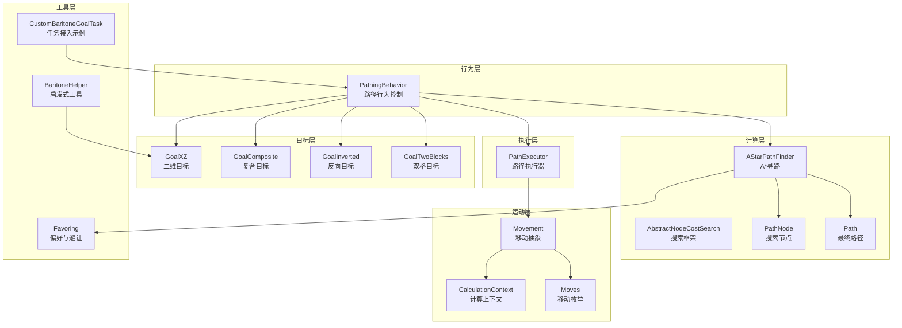
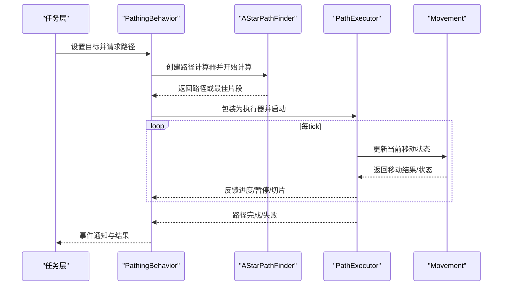
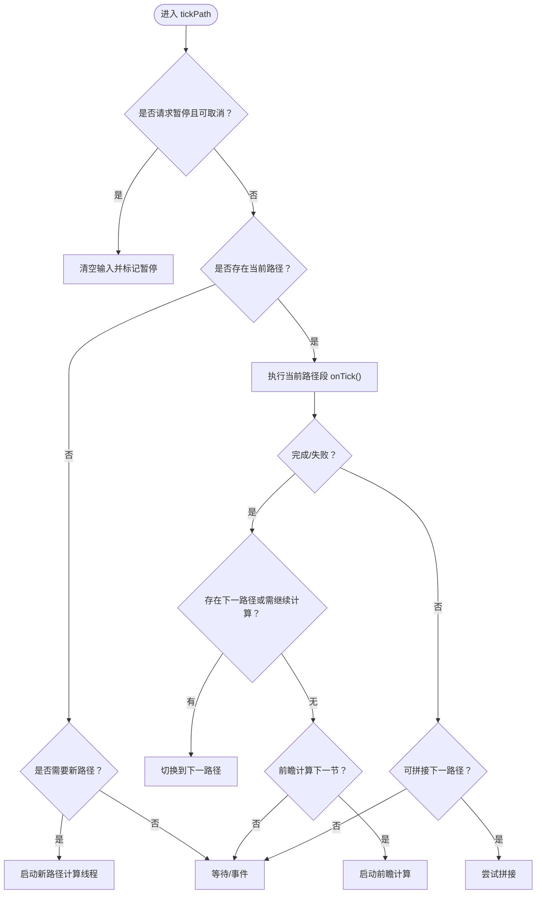
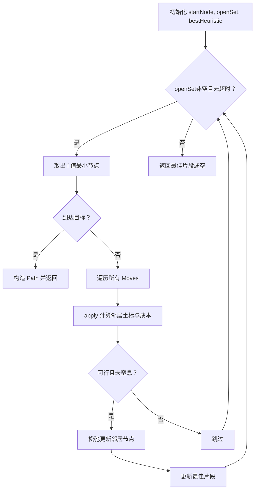
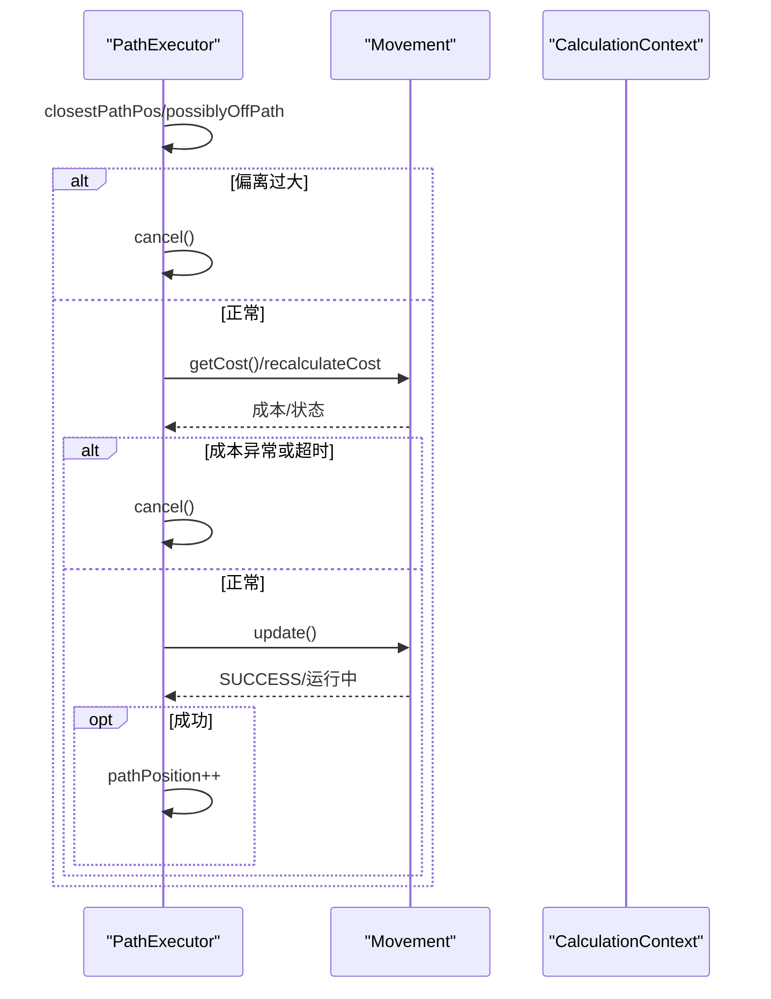
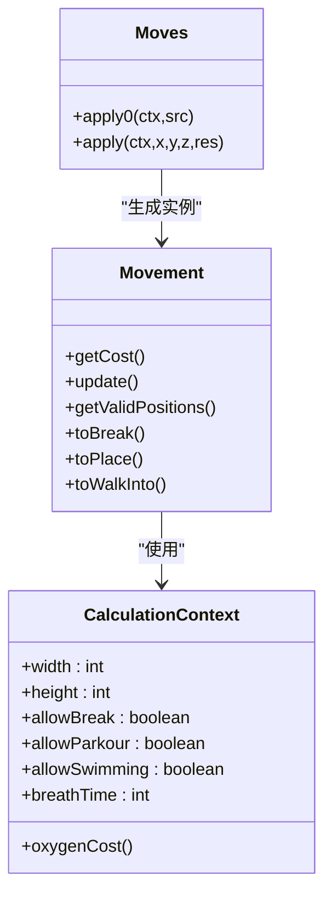
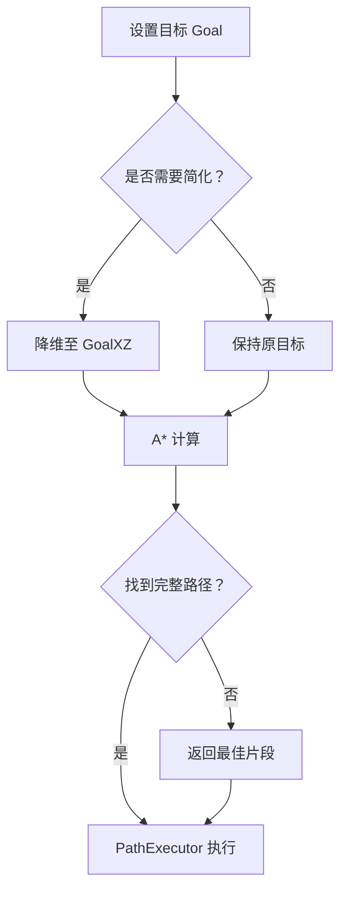
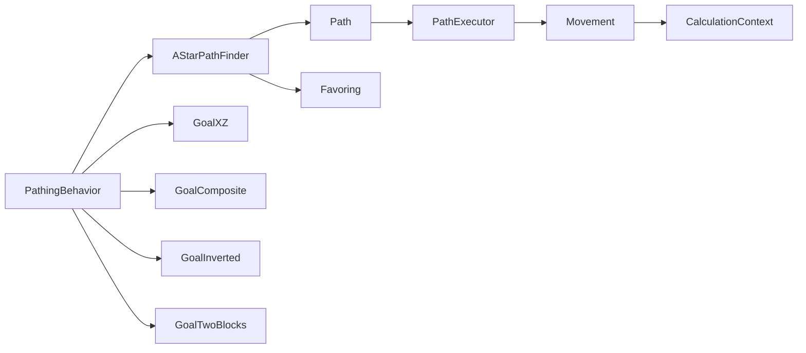

# 路径规划系统

<cite>
**本文档引用的文件**
- [PathingBehavior.java](file://src/main/java/baritone/behavior/PathingBehavior.java)
- [AStarPathFinder.java](file://src/main/java/baritone/pathing/calc/AStarPathFinder.java)
- [AbstractNodeCostSearch.java](file://src/main/java/baritone/pathing/calc/AbstractNodeCostSearch.java)
- [Path.java](file://src/main/java/baritone/pathing/calc/Path.java)
- [PathNode.java](file://src/main/java/baritone/pathing/calc/PathNode.java)
- [PathExecutor.java](file://src/main/java/baritone/pathing/path/PathExecutor.java)
- [Movement.java](file://src/main/java/baritone/pathing/movement/Movement.java)
- [CalculationContext.java](file://src/main/java/baritone/pathing/movement/CalculationContext.java)
- [Moves.java](file://src/main/java/baritone/pathing/movement/Moves.java)
- [Favoring.java](file://src/main/java/baritone/utils/pathing/Favoring.java)
- [GoalXZ.java](file://src/main/java/baritone/api/pathing/goals/GoalXZ.java)
- [GoalComposite.java](file://src/main/java/baritone/api/pathing/goals/GoalComposite.java)
- [GoalInverted.java](file://src/main/java/baritone/api/pathing/goals/GoalInverted.java)
- [GoalTwoBlocks.java](file://src/main/java/baritone/api/pathing/goals/GoalTwoBlocks.java)
- [BaritoneHelper.java](file://src/main/java/adris/altoclef/util/helpers/BaritoneHelper.java)
- [CustomBaritoneGoalTask.java](file://src/main/java/adris/altoclef/tasks/movement/CustomBaritoneGoalTask.java)
</cite>

## 目录
1. [引言](#引言)
2. [项目结构](#项目结构)
3. [核心组件](#核心组件)
4. [架构总览](#架构总览)
5. [详细组件分析](#详细组件分析)
6. [依赖关系分析](#依赖关系分析)
7. [性能考量](#性能考量)
8. [故障排查指南](#故障排查指南)
9. [结论](#结论)
10. [附录](#附录)

## 引言
本文件面向路径规划系统的使用者与开发者，系统性阐述基于 Baritone 引擎的路径规划模块：从 PathingBehavior 的行为控制、A* 寻路算法实现、Movement 移动策略，到目标管理（Goal）机制、路径优化与性能调优。文档同时提供可操作的实践建议，帮助你在不同任务场景下配置合适的路径策略、处理复杂地形与障碍物，并扩展自定义移动策略。

## 项目结构
路径规划系统主要由以下层次构成：
- 行为层：PathingBehavior 协调路径计算与执行，维护当前/下一路径段、目标状态与事件分发。
- 计算层：AStarPathFinder 基于 A* 算法进行节点成本搜索；AbstractNodeCostSearch 提供通用搜索框架；PathNode/Path 封装搜索节点与最终路径。
- 执行层：PathExecutor 驱动 Movement 执行，负责路径跟踪、回溯检测、切片拼接与性能裁剪。
- 运动层：Movement 抽象各类移动动作；CalculationContext 提供环境上下文与成本参数；Moves 枚举所有可能的移动类型。
- 目标层：GoalXZ、GoalComposite、GoalInverted、GoalTwoBlocks 等目标类型支持二维投影、复合目标、反向目标与双格目标等场景。
- 工具层：Favoring 提供回溯偏好与避让区域权重；BaritoneHelper 提供启发式距离计算；CustomBaritoneGoalTask 展示任务层如何接入目标管理。

**图表来源**
- [PathingBehavior.java:29-526](file://src/main/java/baritone/behavior/PathingBehavior.java#L29-L526)
- [AStarPathFinder.java:16-168](file://src/main/java/baritone/pathing/calc/AStarPathFinder.java#L16-L168)
- [AbstractNodeCostSearch.java:16-154](file://src/main/java/baritone/pathing/calc/AbstractNodeCostSearch.java#L16-L154)
- [Path.java:17-134](file://src/main/java/baritone/pathing/calc/Path.java#L17-L134)
- [PathNode.java:7-47](file://src/main/java/baritone/pathing/calc/PathNode.java#L7-L47)
- [PathExecutor.java:38-632](file://src/main/java/baritone/pathing/path/PathExecutor.java#L38-L632)
- [Movement.java:25-276](file://src/main/java/baritone/pathing/movement/Movement.java#L25-L276)
- [CalculationContext.java:29-197](file://src/main/java/baritone/pathing/movement/CalculationContext.java#L29-L197)
- [Moves.java:15-325](file://src/main/java/baritone/pathing/movement/Moves.java#L15-L325)
- [Favoring.java:10-39](file://src/main/java/baritone/utils/pathing/Favoring.java#L10-L39)
- [GoalXZ.java:9-73](file://src/main/java/baritone/api/pathing/goals/GoalXZ.java#L9-L73)
- [GoalComposite.java:5-53](file://src/main/java/baritone/api/pathing/goals/GoalComposite.java#L5-L53)
- [GoalInverted.java:3-29](file://src/main/java/baritone/api/pathing/goals/GoalInverted.java#L3-L29)
- [GoalTwoBlocks.java:7-46](file://src/main/java/baritone/api/pathing/goals/GoalTwoBlocks.java#L7-L46)
- [BaritoneHelper.java:6-19](file://src/main/java/adris/altoclef/util/helpers/BaritoneHelper.java#L6-L19)
- [CustomBaritoneGoalTask.java:20-215](file://src/main/java/adris/altoclef/tasks/movement/CustomBaritoneGoalTask.java#L20-L215)

**章节来源**
- [PathingBehavior.java:29-526](file://src/main/java/baritone/behavior/PathingBehavior.java#L29-L526)
- [AStarPathFinder.java:16-168](file://src/main/java/baritone/pathing/calc/AStarPathFinder.java#L16-L168)
- [PathExecutor.java:38-632](file://src/main/java/baritone/pathing/path/PathExecutor.java#L38-L632)

## 核心组件
- PathingBehavior：路径行为控制器，负责目标设置、路径计算调度、当前/下一路径段切换、事件派发与暂停/取消逻辑。
- AStarPathFinder：A* 寻路实现，维护开集、节点成本与启发式评估，支持超时、最小改进重传播与回溯偏好。
- PathExecutor：路径执行器，驱动 Movement 序列，处理偏移检测、回溯暂停、切片拼接与历史裁剪。
- Movement/CalculationContext/Moves：移动抽象与成本计算上下文，统一描述起点/终点、有效位置集合、破坏/放置/行走目标与成本缓存。
- 目标系统（GoalXZ/GoalComposite/GoalInverted/GoalTwoBlocks）：提供二维投影、复合/反向/双格等目标类型，配合启发式函数参与路径优化。
- Favoring：回溯偏好与避让区域权重，通过哈希映射对已走路径点施加成本系数，避免反复横跳。

**章节来源**
- [PathingBehavior.java:29-526](file://src/main/java/baritone/behavior/PathingBehavior.java#L29-L526)
- [AStarPathFinder.java:16-168](file://src/main/java/baritone/pathing/calc/AStarPathFinder.java#L16-L168)
- [PathExecutor.java:38-632](file://src/main/java/baritone/pathing/path/PathExecutor.java#L38-L632)
- [Movement.java:25-276](file://src/main/java/baritone/pathing/movement/Movement.java#L25-L276)
- [CalculationContext.java:29-197](file://src/main/java/baritone/pathing/movement/CalculationContext.java#L29-L197)
- [Moves.java:15-325](file://src/main/java/baritone/pathing/movement/Moves.java#L15-L325)
- [GoalXZ.java:9-73](file://src/main/java/baritone/api/pathing/goals/GoalXZ.java#L9-L73)
- [GoalComposite.java:5-53](file://src/main/java/baritone/api/pathing/goals/GoalComposite.java#L5-L53)
- [GoalInverted.java:3-29](file://src/main/java/baritone/api/pathing/goals/GoalInverted.java#L3-L29)
- [GoalTwoBlocks.java:7-46](file://src/main/java/baritone/api/pathing/goals/GoalTwoBlocks.java#L7-L46)
- [Favoring.java:10-39](file://src/main/java/baritone/utils/pathing/Favoring.java#L10-L39)

## 架构总览
路径规划从“行为层”发起，经“计算层”生成路径，再由“执行层”驱动“运动层”完成移动。目标系统贯穿始终，影响启发式与路径选择。

**图表来源**
- [PathingBehavior.java:404-502](file://src/main/java/baritone/behavior/PathingBehavior.java#L404-L502)
- [AStarPathFinder.java:26-166](file://src/main/java/baritone/pathing/calc/AStarPathFinder.java#L26-L166)
- [PathExecutor.java:68-224](file://src/main/java/baritone/pathing/path/PathExecutor.java#L68-L224)
- [Movement.java:96-124](file://src/main/java/baritone/pathing/movement/Movement.java#L96-L124)

## 详细组件分析

### PathingBehavior：行为控制与生命周期
- 目标与上下文：持有 Goal、CalculationContext，提供 pathStart() 安全起始点推断。
- 路径计算：findPathInNewThread() 在独立线程中执行，支持主/前瞻超时、事件队列与孤儿路径丢弃。
- 执行与切换：tickPath() 维护 current/next 路径段，支持拼接、切片、回退与安全取消。
- 事件系统：通过 toDispatch 队列分发 CALC_STARTED/CALC_FINISHED 等事件，便于上层感知。

**图表来源**
- [PathingBehavior.java:81-193](file://src/main/java/baritone/behavior/PathingBehavior.java#L81-L193)

**章节来源**
- [PathingBehavior.java:29-526](file://src/main/java/baritone/behavior/PathingBehavior.java#L29-L526)

### AStarPathFinder：A* 寻路算法实现
- 启发式与开集：以 Goal.heuristic 作为启发式，BinaryHeapOpenSet 维护待探索节点。
- 成本与偏好：节点成本 cost 与 combinedCost = cost + heuristic；Favoring 对回溯路径施加系数。
- 动作枚举：遍历 Moves.values()，应用 CalculationContext 限制（高度、边界、加载区块）与氧气消耗。
- 超时与回退：支持 slowPath 模式与最小改进重传播，优先返回“已考虑足够远”的最佳片段。

**图表来源**
- [AStarPathFinder.java:26-166](file://src/main/java/baritone/pathing/calc/AStarPathFinder.java#L26-L166)
- [AbstractNodeCostSearch.java:121-154](file://src/main/java/baritone/pathing/calc/AbstractNodeCostSearch.java#L121-L154)
- [PathNode.java:7-47](file://src/main/java/baritone/pathing/calc/PathNode.java#L7-L47)
- [Favoring.java:10-39](file://src/main/java/baritone/utils/pathing/Favoring.java#L10-L39)

**章节来源**
- [AStarPathFinder.java:16-168](file://src/main/java/baritone/pathing/calc/AStarPathFinder.java#L16-L168)
- [AbstractNodeCostSearch.java:16-154](file://src/main/java/baritone/pathing/calc/AbstractNodeCostSearch.java#L16-L154)
- [PathNode.java:7-47](file://src/main/java/baritone/pathing/calc/PathNode.java#L7-L47)

### PathExecutor：路径执行与动态调整
- 偏离检测：closestPathPos 与阈值判定，超过阈值则暂停或取消。
- 成本验证：对当前及未来若干步进行成本验证，若显著上升或不可行则取消。
- 回溯暂停：当存在更优回溯路径且安全时暂停，等待行为层重新规划。
- 切片拼接与历史裁剪：trySplice 与 cutIfTooLong，减少内存占用并提升响应性。

**图表来源**
- [PathExecutor.java:68-224](file://src/main/java/baritone/pathing/path/PathExecutor.java#L68-L224)

**章节来源**
- [PathExecutor.java:38-632](file://src/main/java/baritone/pathing/path/PathExecutor.java#L38-L632)

### Movement/CalculationContext/Moves：移动策略与成本模型
- Movement：抽象移动状态机，包含 PREPPING/WAITING/RUNNING/SUCCESS/FAILED/UNREACHABLE 状态；提供 getValidPositions、toBreak/toPlace/toWalkInto 缓存。
- CalculationContext：封装实体尺寸、跳跃/游泳/放置/挖掘权限、世界边界、氧气消耗、水下速度等参数，作为成本计算依据。
- Moves：枚举所有可能移动（上下/横移/斜坡/下坡/对角/跳跃/长距离穿越），每种移动定义 apply0 与 apply，分别用于生成 Movement 实例与计算成本。

**图表来源**
- [Movement.java:25-276](file://src/main/java/baritone/pathing/movement/Movement.java#L25-L276)
- [CalculationContext.java:29-197](file://src/main/java/baritone/pathing/movement/CalculationContext.java#L29-L197)
- [Moves.java:15-325](file://src/main/java/baritone/pathing/movement/Moves.java#L15-L325)

**章节来源**
- [Movement.java:25-276](file://src/main/java/baritone/pathing/movement/Movement.java#L25-L276)
- [CalculationContext.java:29-197](file://src/main/java/baritone/pathing/movement/CalculationContext.java#L29-L197)
- [Moves.java:15-325](file://src/main/java/baritone/pathing/movement/Moves.java#L15-L325)

### 目标管理机制：分解、动态更新与恢复
- GoalXZ：二维投影目标，适合大范围平移任务，启发式按直/斜组合计算。
- GoalComposite：复合目标取各子目标启发式的最小值，适合多候选目标择优。
- GoalInverted：反向目标，启发式取负值，可用于“远离某区域”的策略。
- GoalTwoBlocks：目标位于单格或双格高区域，适合精确停靠。
- 动态更新：PathingBehavior 在目标变更或世界变化时触发重新计算；任务层可通过 CustomBaritoneGoalTask 缓存并复用目标，必要时触发“闲逛”恢复。

**图表来源**
- [PathingBehavior.java:504-515](file://src/main/java/baritone/behavior/PathingBehavior.java#L504-L515)
- [GoalXZ.java:9-73](file://src/main/java/baritone/api/pathing/goals/GoalXZ.java#L9-L73)
- [GoalComposite.java:5-53](file://src/main/java/baritone/api/pathing/goals/GoalComposite.java#L5-L53)
- [GoalInverted.java:3-29](file://src/main/java/baritone/api/pathing/goals/GoalInverted.java#L3-L29)
- [GoalTwoBlocks.java:7-46](file://src/main/java/baritone/api/pathing/goals/GoalTwoBlocks.java#L7-L46)

**章节来源**
- [GoalXZ.java:9-73](file://src/main/java/baritone/api/pathing/goals/GoalXZ.java#L9-L73)
- [GoalComposite.java:5-53](file://src/main/java/baritone/api/pathing/goals/GoalComposite.java#L5-L53)
- [GoalInverted.java:3-29](file://src/main/java/baritone/api/pathing/goals/GoalInverted.java#L3-L29)
- [GoalTwoBlocks.java:7-46](file://src/main/java/baritone/api/pathing/goals/GoalTwoBlocks.java#L7-L46)
- [PathingBehavior.java:504-515](file://src/main/java/baritone/behavior/PathingBehavior.java#L504-L515)

### 启发函数与路径优化策略
- 启发式设计：GoalXZ 使用直/斜组合的平方根近似，平衡曼哈顿与对角线代价；GoalTwoBlocks 考虑双格高度差异。
- 回溯偏好：Favoring 对已走过位置施加系数，降低重复路径概率，提高稳定性。
- 最小改进重传播：AbstractNodeCostSearch 维护多组系数下的最佳节点，加速收敛。
- 成本验证与超时：PathExecutor 对未来成本进行验证，防止被动态变化的环境误导。

**章节来源**
- [GoalXZ.java:41-56](file://src/main/java/baritone/api/pathing/goals/GoalXZ.java#L41-L56)
- [GoalTwoBlocks.java:28-33](file://src/main/java/baritone/api/pathing/goals/GoalTwoBlocks.java#L28-L33)
- [Favoring.java:23-29](file://src/main/java/baritone/utils/pathing/Favoring.java#L23-L29)
- [AbstractNodeCostSearch.java:121-154](file://src/main/java/baritone/pathing/calc/AbstractNodeCostSearch.java#L121-L154)
- [PathExecutor.java:163-176](file://src/main/java/baritone/pathing/path/PathExecutor.java#L163-L176)

## 依赖关系分析
- 耦合与内聚：PathingBehavior 与 AStarPathFinder/PathExecutor 高内聚，通过 CalculationContext 解耦环境信息。
- 外部依赖：CalculationContext 依赖实体维度、权限设置与世界边界；Movement 依赖 BlockStateInterface 与旋转/输入系统。
- 循环依赖：未发现循环导入；Goal 接口与其实现类之间为单向依赖。

**图表来源**
- [PathingBehavior.java:29-526](file://src/main/java/baritone/behavior/PathingBehavior.java#L29-L526)
- [AStarPathFinder.java:16-168](file://src/main/java/baritone/pathing/calc/AStarPathFinder.java#L16-L168)
- [Path.java:17-134](file://src/main/java/baritone/pathing/calc/Path.java#L17-L134)
- [PathExecutor.java:38-632](file://src/main/java/baritone/pathing/path/PathExecutor.java#L38-L632)
- [Movement.java:25-276](file://src/main/java/baritone/pathing/movement/Movement.java#L25-L276)
- [CalculationContext.java:29-197](file://src/main/java/baritone/pathing/movement/CalculationContext.java#L29-L197)
- [Favoring.java:10-39](file://src/main/java/baritone/utils/pathing/Favoring.java#L10-L39)
- [GoalXZ.java:9-73](file://src/main/java/baritone/api/pathing/goals/GoalXZ.java#L9-L73)
- [GoalComposite.java:5-53](file://src/main/java/baritone/api/pathing/goals/GoalComposite.java#L5-L53)
- [GoalInverted.java:3-29](file://src/main/java/baritone/api/pathing/goals/GoalInverted.java#L3-L29)
- [GoalTwoBlocks.java:7-46](file://src/main/java/baritone/api/pathing/goals/GoalTwoBlocks.java#L7-L46)

**章节来源**
- [PathingBehavior.java:29-526](file://src/main/java/baritone/behavior/PathingBehavior.java#L29-L526)
- [AStarPathFinder.java:16-168](file://src/main/java/baritone/pathing/calc/AStarPathFinder.java#L16-L168)
- [PathExecutor.java:38-632](file://src/main/java/baritone/pathing/path/PathExecutor.java#L38-L632)

## 性能考量
- 超时与慢速模式：A* 支持 slowPath 与不同阶段的超时（主/前瞻），避免长时间阻塞。
- 最小改进重传播：通过多系数比较，快速收敛到“足够好”的路径片段，减少无效探索。
- 历史裁剪与切片：PathExecutor 的 cutIfTooLong 与 trySplice 降低内存与CPU压力，提升实时性。
- 成本验证：对后续步骤进行成本检查，提前放弃不可行路径，节省计算资源。

[本节为通用指导，无需特定文件来源]

## 故障排查指南
- 路径中断与恢复
  - 症状：执行器频繁取消或停滞。
  - 排查：检查 PathExecutor 的偏离阈值、成本验证失败与超时条件；确认 CalculationContext 权限设置（如允许游泳/放置）。
- 目标不匹配
  - 症状：出现“孤儿路径段”日志。
  - 排查：确认 PathingBehavior 在新线程中计算时的起始点与期望起始点一致；检查 Goal 是否被简化为 GoalXZ。
- 回溯与震荡
  - 症状：反复横跳或路径抖动。
  - 排查：启用 Favoring 的回溯偏好系数；适当提高 backtrackCostFavoringCoefficient；检查 Movement 的 safeToCancel 逻辑。
- 任务层集成问题
  - 症状：任务无法推进或频繁“闲逛”。
  - 排查：参考 CustomBaritoneGoalTask 的目标缓存与复用策略；确保在合适时机调用 setGoalAndPath。

**章节来源**
- [PathExecutor.java:94-110](file://src/main/java/baritone/pathing/path/PathExecutor.java#L94-L110)
- [PathingBehavior.java:440-468](file://src/main/java/baritone/behavior/PathingBehavior.java#L440-L468)
- [Favoring.java:23-29](file://src/main/java/baritone/utils/pathing/Favoring.java#L23-L29)
- [CustomBaritoneGoalTask.java:165-189](file://src/main/java/adris/altoclef/tasks/movement/CustomBaritoneGoalTask.java#L165-L189)

## 结论
该路径规划系统以 Baritone 为核心，通过 PathingBehavior 的行为控制、A* 寻路的高效搜索、PathExecutor 的稳健执行与 Movement 的细粒度策略，实现了在复杂 Minecraft 地形中的稳定导航。目标系统提供了灵活的表达能力，结合回溯偏好与成本验证，兼顾了性能与鲁棒性。任务层可通过 CustomBaritoneGoalTask 等组件无缝接入，实现从简单移动到复杂目标的渐进式扩展。

[本节为总结性内容，无需特定文件来源]

## 附录

### 代码示例路径（不展示具体代码）
- 设置二维目标并启动路径计算
  - [PathingBehavior.java:199-231](file://src/main/java/baritone/behavior/PathingBehavior.java#L199-L231)
  - [GoalXZ.java:9-73](file://src/main/java/baritone/api/pathing/goals/GoalXZ.java#L9-L73)
- 自定义移动策略扩展
  - [Movement.java:25-276](file://src/main/java/baritone/pathing/movement/Movement.java#L25-L276)
  - [CalculationContext.java:29-197](file://src/main/java/baritone/pathing/movement/CalculationContext.java#L29-L197)
  - [Moves.java:15-325](file://src/main/java/baritone/pathing/movement/Moves.java#L15-L325)
- 复杂目标分解与动态更新
  - [GoalComposite.java:5-53](file://src/main/java/baritone/api/pathing/goals/GoalComposite.java#L5-L53)
  - [GoalInverted.java:3-29](file://src/main/java/baritone/api/pathing/goals/GoalInverted.java#L3-L29)
  - [GoalTwoBlocks.java:7-46](file://src/main/java/baritone/api/pathing/goals/GoalTwoBlocks.java#L7-L46)
- 启发式与回溯偏好
  - [GoalXZ.java:41-56](file://src/main/java/baritone/api/pathing/goals/GoalXZ.java#L41-L56)
  - [Favoring.java:23-29](file://src/main/java/baritone/utils/pathing/Favoring.java#L23-L29)
  - [BaritoneHelper.java:9-18](file://src/main/java/adris/altoclef/util/helpers/BaritoneHelper.java#L9-L18)