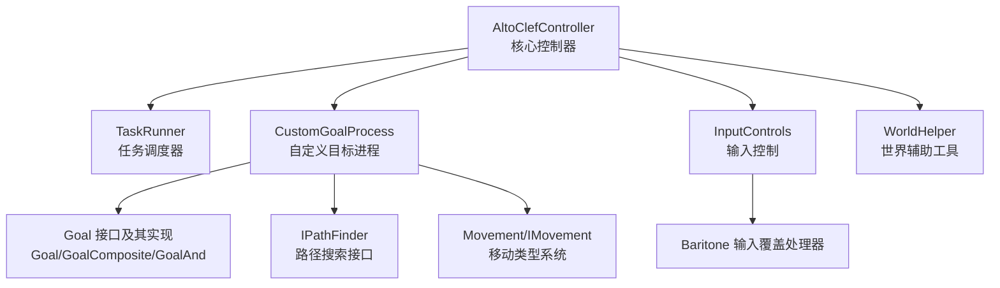
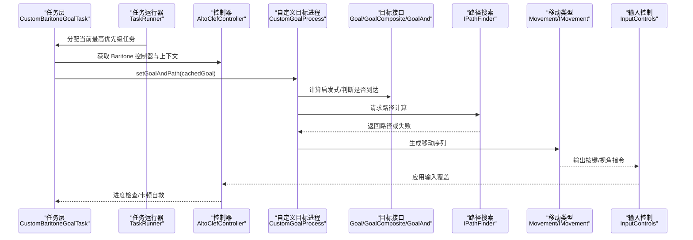
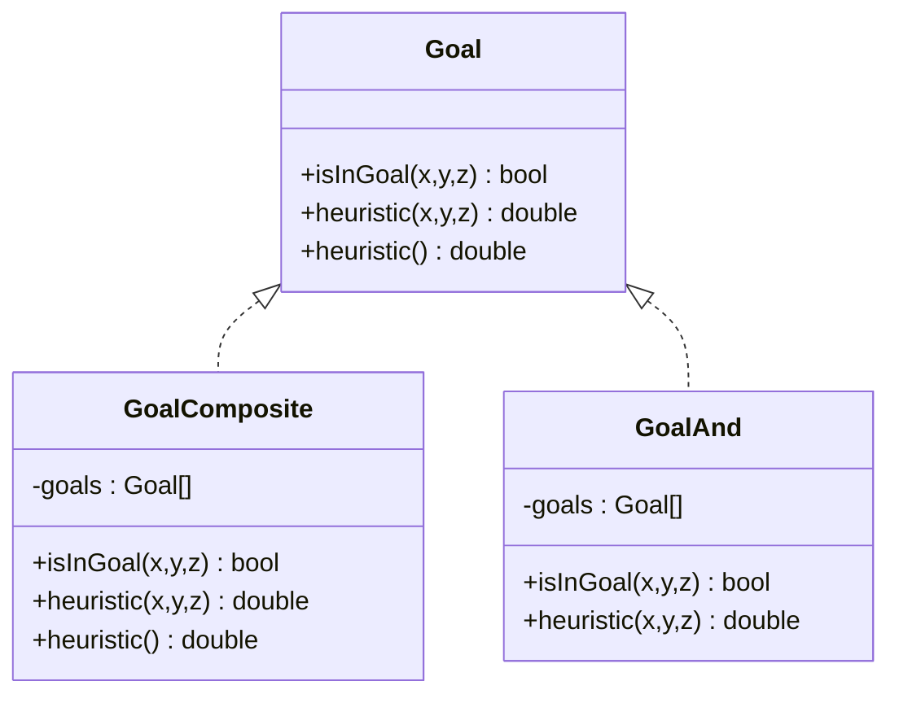
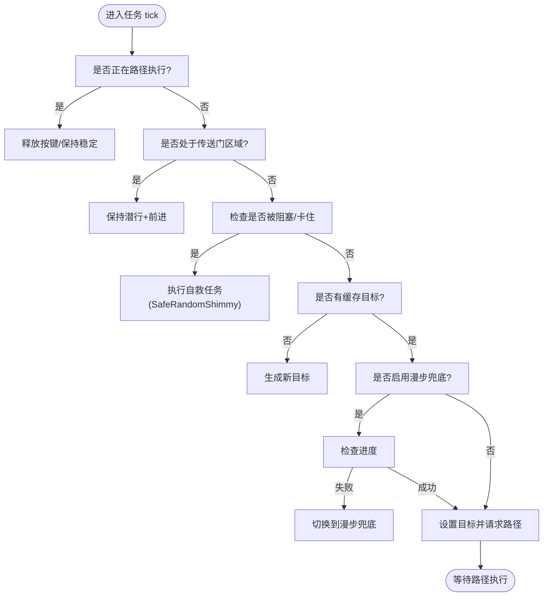
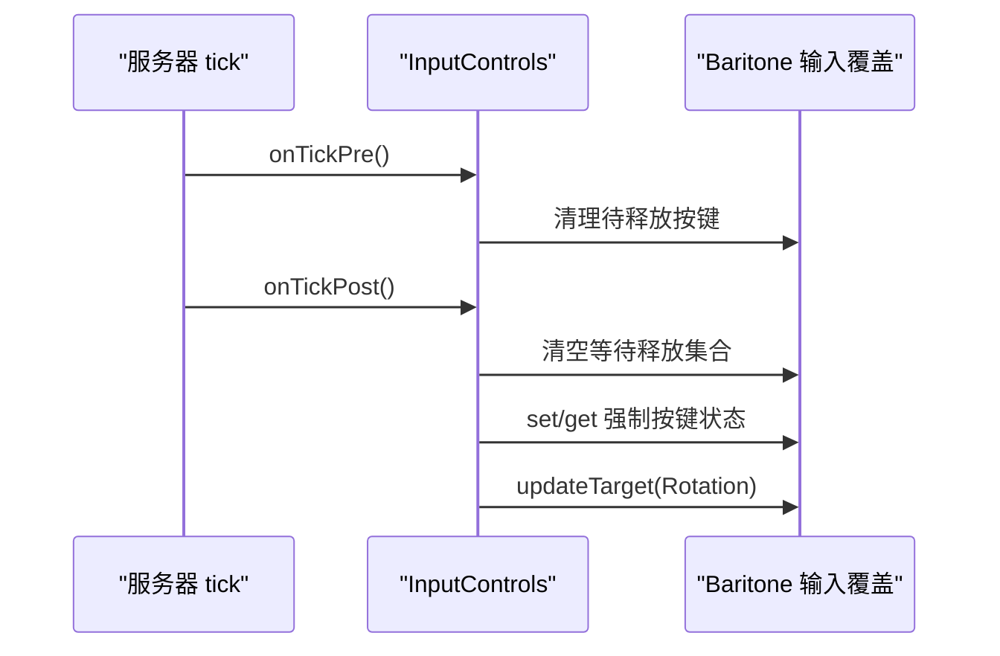
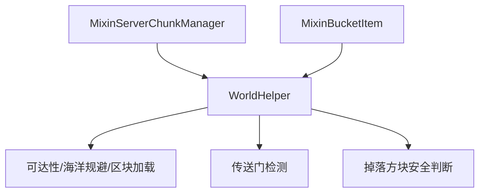
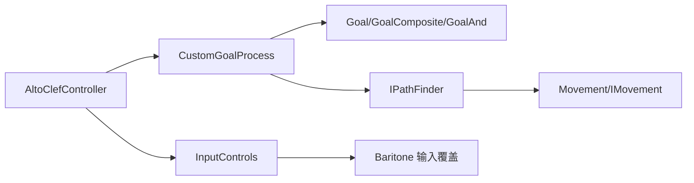

# 路径规划系统

<cite>
**本文引用的文件**
- [AltoClefController.java](file://src/main/java/adris/altoclef/AltoClefController.java)
- [CustomBaritoneGoalTask.java](file://src/main/java/adris/altoclef/tasks/movement/CustomBaritoneGoalTask.java)
- [WorldHelper.java](file://src/main/java/adris/altoclef/util/helpers/WorldHelper.java)
- [InputControls.java](file://src/main/java/adris/altoclef/control/InputControls.java)
- [Goal.java](file://src/main/java/baritone/api/pathing/goals/Goal.java)
- [IMovement.java](file://src/main/java/baritone/api/pathing/movement/IMovement.java)
- [Movement.java](file://src/main/java/baritone/pathing/movement/Movement.java)
- [MovementState.java](file://src/main/java/baritone/pathing/movement/MovementState.java)
- [CustomGoalProcess.java](file://src/main/java/baritone/process/CustomGoalProcess.java)
- [IPathFinder.java](file://src/main/java/baritone/api/pathing/calc/IPathFinder.java)
- [GoalComposite.java](file://src/main/java/baritone/api/pathing/goals/GoalComposite.java)
- [GoalAnd.java](file://src/main/java/adris/altoclef/util/baritone/GoalAnd.java)
- [MixinBucketItem.java](file://src/main/java/adris/altoclef/mixins/baritone/MixinBucketItem.java)
- [MixinServerChunkManager.java](file://src/main/java/adris/altoclef/mixins/baritone/MixinServerChunkManager.java)
- [TaskRunner.java](file://src/main/java/adris/altoclef/tasksystem/TaskRunner.java)
</cite>

## 目录
1. [简介](#简介)
2. [项目结构](#项目结构)
3. [核心组件](#核心组件)
4. [架构总览](#架构总览)
5. [详细组件分析](#详细组件分析)
6. [依赖分析](#依赖分析)
7. [性能考虑](#性能考虑)
8. [故障排查指南](#故障排查指南)
9. [结论](#结论)
10. [附录](#附录)

## 简介
本技术文档围绕路径规划系统展开，重点阐述以下方面：
- Baritone 寻路引擎在项目中的集成方式与控制流
- 自定义寻路目标（Goal）体系与复合目标组合
- 移动类型系统（Movement）与输入控制（InputControls）
- 动态路径重规划、障碍物避让与路径优化策略
- 与游戏世界交互、区块加载与路径执行的协调机制
- 常见寻路问题的调试方法与性能优化建议

## 项目结构
该路径规划系统以 AltoClefController 为核心控制器，围绕其构建任务链（TaskChain）、任务运行器（TaskRunner）与 Baritone 的路径行为（PathingBehavior）进行协作。系统通过自定义 Goal 实现目标表达，并通过 CustomGoalProcess 驱动路径计算与执行；同时利用 InputControls 将计算出的动作映射到实际输入。

图表来源
- [AltoClefController.java:136-150](file://src/main/java/adris/altoclef/AltoClefController.java#L136-L150)
- [TaskRunner.java:22-58](file://src/main/java/adris/altoclef/tasksystem/TaskRunner.java#L22-L58)
- [CustomGoalProcess.java:11-71](file://src/main/java/baritone/process/CustomGoalProcess.java#L11-L71)
- [Goal.java:5-21](file://src/main/java/baritone/api/pathing/goals/Goal.java#L5-L21)
- [GoalComposite.java:5-53](file://src/main/java/baritone/api/pathing/goals/GoalComposite.java#L5-L53)
- [GoalAnd.java:6-47](file://src/main/java/adris/altoclef/util/baritone/GoalAnd.java#L6-L47)
- [IPathFinder.java:7-17](file://src/main/java/baritone/api/pathing/calc/IPathFinder.java#L7-L17)
- [Movement.java:25-54](file://src/main/java/baritone/pathing/movement/Movement.java#L25-L54)
- [IMovement.java:6-24](file://src/main/java/baritone/api/pathing/movement/IMovement.java#L6-L24)
- [InputControls.java:20-38](file://src/main/java/adris/altoclef/control/InputControls.java#L20-L38)

章节来源
- [AltoClefController.java:53-134](file://src/main/java/adris/altoclef/AltoClefController.java#L53-L134)
- [TaskRunner.java:9-98](file://src/main/java/adris/altoclef/tasksystem/TaskRunner.java#L9-L98)

## 核心组件
- AltoClefController：系统入口与中枢，负责初始化 Baritone 设置、注册命令、管理任务链与追踪器、协调 AI 服务等。
- CustomBaritoneGoalTask：抽象任务基类，封装基于 Goal 的路径目标、进度检查、卡顿自救与路径重规划逻辑。
- CustomGoalProcess：驱动自定义目标的路径计算与执行，处理目标变更、路径失效与完成回调。
- Goal/GoalComposite/GoalAnd：目标接口与复合目标，支持 AND/OR 组合与启发式聚合。
- Movement/IMovement：移动类型接口与抽象实现，描述一次移动的成本、方向与可取消性。
- InputControls：对 Baritone 输入覆盖处理器的薄封装，统一按键状态与视角更新。
- WorldHelper：与世界交互的工具集，包括可达性判断、区块加载检查、海洋规避等。
- Mixin 扩展：对 BucketItem 与 ServerChunkManager 的访问器扩展，增强液体检测与区块即时加载能力。

章节来源
- [AltoClefController.java:171-193](file://src/main/java/adris/altoclef/AltoClefController.java#L171-L193)
- [CustomBaritoneGoalTask.java:20-214](file://src/main/java/adris/altoclef/tasks/movement/CustomBaritoneGoalTask.java#L20-L214)
- [CustomGoalProcess.java:11-71](file://src/main/java/baritone/process/CustomGoalProcess.java#L11-L71)
- [Goal.java:5-21](file://src/main/java/baritone/api/pathing/goals/Goal.java#L5-L21)
- [GoalComposite.java:5-53](file://src/main/java/baritone/api/pathing/goals/GoalComposite.java#L5-L53)
- [GoalAnd.java:6-47](file://src/main/java/adris/altoclef/util/baritone/GoalAnd.java#L6-L47)
- [Movement.java:25-54](file://src/main/java/baritone/pathing/movement/Movement.java#L25-L54)
- [IMovement.java:6-24](file://src/main/java/baritone/api/pathing/movement/IMovement.java#L6-L24)
- [InputControls.java:11-54](file://src/main/java/adris/altoclef/control/InputControls.java#L11-L54)
- [WorldHelper.java:197-226](file://src/main/java/adris/altoclef/util/helpers/WorldHelper.java#L197-L226)
- [MixinBucketItem.java:11-20](file://src/main/java/adris/altoclef/mixins/baritone/MixinBucketItem.java#L11-L20)
- [MixinServerChunkManager.java:13-24](file://src/main/java/adris/altoclef/mixins/baritone/MixinServerChunkManager.java#L13-L24)

## 架构总览
下图展示从任务到路径计算再到输入执行的整体流程，以及与世界交互的关键点。

图表来源
- [TaskRunner.java:22-58](file://src/main/java/adris/altoclef/tasksystem/TaskRunner.java#L22-L58)
- [CustomBaritoneGoalTask.java:113-194](file://src/main/java/adris/altoclef/tasks/movement/CustomBaritoneGoalTask.java#L113-L194)
- [CustomGoalProcess.java:47-71](file://src/main/java/baritone/process/CustomGoalProcess.java#L47-L71)
- [IPathFinder.java:7-17](file://src/main/java/baritone/api/pathing/calc/IPathFinder.java#L7-L17)
- [Movement.java:25-54](file://src/main/java/baritone/pathing/movement/Movement.java#L25-L54)
- [InputControls.java:20-38](file://src/main/java/adris/altoclef/control/InputControls.java#L20-L38)

## 详细组件分析

### 组件一：路径目标系统（Goal）
- Goal 接口定义了目标判定与启发式评估的基本约定。
- GoalComposite 支持 OR 组合，取各子目标启发式最小值；GoalAnd 支持 AND 组合，累加启发式。
- 项目中提供 GoalAnd 的本地实现，便于按需组合多个条件。

图表来源
- [Goal.java:5-21](file://src/main/java/baritone/api/pathing/goals/Goal.java#L5-L21)
- [GoalComposite.java:5-53](file://src/main/java/baritone/api/pathing/goals/GoalComposite.java#L5-L53)
- [GoalAnd.java:6-47](file://src/main/java/adris/altoclef/util/baritone/GoalAnd.java#L6-L47)

章节来源
- [Goal.java:5-21](file://src/main/java/baritone/api/pathing/goals/Goal.java#L5-L21)
- [GoalComposite.java:5-53](file://src/main/java/baritone/api/pathing/goals/GoalComposite.java#L5-L53)
- [GoalAnd.java:6-47](file://src/main/java/adris/altoclef/util/baritone/GoalAnd.java#L6-L47)

### 组件二：移动类型系统（Movement）
- IMovement 定义移动成本、更新、重置与安全取消等接口。
- Movement 抽象类承载源/目的位置、待破坏/放置方块列表、缓存与状态机。
- MovementState 描述当前移动的状态、目标旋转与强制旋转标志，以及输入映射。

```mermaid
classDiagram
class IMovement {
+getCost() double
+update() MovementStatus
+reset() void
+resetBlockCache() void
+safeToCancel() bool
+calculatedWhileLoaded() bool
+getSrc() BetterBlockPos
+getDest() BetterBlockPos
+getDirection() BlockPos
}
class Movement {
-baritone : IBaritone
-ctx : IEntityContext
-currentState : MovementState
-src : BetterBlockPos
-dest : BetterBlockPos
-positionsToBreak : BetterBlockPos[]
-positionToPlace : BetterBlockPos
+getCost() double
+update() MovementStatus
+reset() void
+resetBlockCache() void
+safeToCancel() bool
+calculatedWhileLoaded() bool
+getSrc() BetterBlockPos
+getDest() BetterBlockPos
+getDirection() BlockPos
}
class MovementState {
-status : MovementStatus
-target : MovementTarget
-inputState : Map<Input,bool>
}
IMovement <|.. Movement
Movement --> MovementState : "使用"
```

图表来源
- [IMovement.java:6-24](file://src/main/java/baritone/api/pathing/movement/IMovement.java#L6-L24)
- [Movement.java:25-54](file://src/main/java/baritone/pathing/movement/Movement.java#L25-L54)
- [MovementState.java:10-63](file://src/main/java/baritone/pathing/movement/MovementState.java#L10-L63)

章节来源
- [IMovement.java:6-24](file://src/main/java/baritone/api/pathing/movement/IMovement.java#L6-L24)
- [Movement.java:25-54](file://src/main/java/baritone/pathing/movement/Movement.java#L25-L54)
- [MovementState.java:10-63](file://src/main/java/baritone/pathing/movement/MovementState.java#L10-L63)

### 组件三：自定义目标任务（CustomBaritoneGoalTask）
- 负责缓存 Goal、在路径执行期间释放/持有按键、处理传送门与卡顿自救。
- 提供“漫步”兜底策略：当进度停滞时切换到 Wander 任务，提升鲁棒性。
- 与 CustomGoalProcess 协作，在安全取消条件下重新设置目标并请求路径。

图表来源
- [CustomBaritoneGoalTask.java:113-194](file://src/main/java/adris/altoclef/tasks/movement/CustomBaritoneGoalTask.java#L113-L194)

章节来源
- [CustomBaritoneGoalTask.java:20-214](file://src/main/java/adris/altoclef/tasks/movement/CustomBaritoneGoalTask.java#L20-L214)

### 组件四：输入控制与路径执行（InputControls）
- 对 Baritone 的 InputOverrideHandler 进行统一封装，提供按键按下/保持/释放与强制视角更新。
- 在每 tick 的 pre/post 阶段清理临时按键状态，避免长期误触。

图表来源
- [InputControls.java:44-52](file://src/main/java/adris/altoclef/control/InputControls.java#L44-L52)
- [InputControls.java:20-38](file://src/main/java/adris/altoclef/control/InputControls.java#L20-L38)

章节来源
- [InputControls.java:11-54](file://src/main/java/adris/altoclef/control/InputControls.java#L11-L54)

### 组件五：与游戏世界的交互与区块加载
- WorldHelper 提供可达性、海洋规避、区块加载检查、床头/床尾定位、掉落方块安全判断等。
- MixinServerChunkManager 提供即时获取区块的能力，辅助路径规划在未完全加载区域的决策。
- MixinBucketItem 提供对 BucketItem 内容流体的访问，用于“桶装液体行走”等策略。

图表来源
- [WorldHelper.java:197-226](file://src/main/java/adris/altoclef/util/helpers/WorldHelper.java#L197-L226)
- [MixinServerChunkManager.java:13-24](file://src/main/java/adris/altoclef/mixins/baritone/MixinServerChunkManager.java#L13-L24)
- [MixinBucketItem.java:11-20](file://src/main/java/adris/altoclef/mixins/baritone/MixinBucketItem.java#L11-L20)

章节来源
- [WorldHelper.java:197-226](file://src/main/java/adris/altoclef/util/helpers/WorldHelper.java#L197-L226)
- [MixinServerChunkManager.java:13-24](file://src/main/java/adris/altoclef/mixins/baritone/MixinServerChunkManager.java#L13-L24)
- [MixinBucketItem.java:11-20](file://src/main/java/adris/altoclef/mixins/baritone/MixinBucketItem.java#L11-L20)

## 依赖分析
- AltoClefController 作为中枢，依赖 Baritone 的 IBaritone、PathingBehavior、CustomGoalProcess、InputOverrideHandler 等组件。
- CustomBaritoneGoalTask 依赖 Goal 接口与 CustomGoalProcess 的 setGoalAndPath 能力。
- Movement/IMovement 依赖 Baritone 的 CalculationContext 与 MovementHelper，用于成本计算与安全判断。
- InputControls 依赖 Baritone 的输入覆盖与 LookBehavior。

图表来源
- [AltoClefController.java:232-242](file://src/main/java/adris/altoclef/AltoClefController.java#L232-L242)
- [CustomGoalProcess.java:11-71](file://src/main/java/baritone/process/CustomGoalProcess.java#L11-L71)
- [IPathFinder.java:7-17](file://src/main/java/baritone/api/pathing/calc/IPathFinder.java#L7-L17)
- [Movement.java:25-54](file://src/main/java/baritone/pathing/movement/Movement.java#L25-L54)
- [InputControls.java:20-38](file://src/main/java/adris/altoclef/control/InputControls.java#L20-L38)

章节来源
- [AltoClefController.java:232-242](file://src/main/java/adris/altoclef/AltoClefController.java#L232-L242)
- [CustomGoalProcess.java:11-71](file://src/main/java/baritone/process/CustomGoalProcess.java#L11-L71)
- [IPathFinder.java:7-17](file://src/main/java/baritone/api/pathing/calc/IPathFinder.java#L7-L17)
- [Movement.java:25-54](file://src/main/java/baritone/pathing/movement/Movement.java#L25-L54)
- [InputControls.java:20-38](file://src/main/java/adris/altoclef/control/InputControls.java#L20-L38)

## 性能考虑
- 启发式与目标组合
  - 使用 GoalComposite 取最小启发式，有助于快速收敛；GoalAnd 累加启发式，适合多条件严格满足场景。
  - 避免在复杂复合目标上过度嵌套，减少启发式计算开销。
- 路径搜索与缓存
  - 利用 IPathFinder 的 bestPathSoFar 与 pathToMostRecentNodeConsidered，尽可能复用中间结果，降低重复计算。
  - 在频繁目标切换时，确保在安全取消条件下再发起新的路径请求，避免无效计算。
- 输入与移动
  - Movement.safeToCancel 与 Movement.calculatedWhileLoaded 用于判断是否可以中断或复用路径，减少不必要的重算。
  - MovementState 的输入映射与强制旋转可减少多余按键抖动，提高执行稳定性。
- 区块加载与可达性
  - 使用 WorldHelper.canReach 与 MixinServerChunkManager.getChunkNow，仅在区块已加载或可安全推断时发起路径，避免无效搜索。
  - 海洋规避与掉落方块安全判断可显著减少后续失败与回溯。
- 设置调优
  - 关闭随机视角与 Parkour/对角下降等高风险选项，提升稳定性。
  - 合理设置 failureTimeoutMS、planAheadFailureTimeoutMS 与 movementTimeoutTicks，平衡响应速度与鲁棒性。

## 故障排查指南
- 路径长时间不推进
  - 检查 CustomBaritoneGoalTask 的进度检查器与漫步兜底逻辑是否触发。
  - 确认 CustomGoalProcess 是否处于 EXECUTING 状态且未因计算失败而丢失控制。
- 卡在栅栏/藤蔓/高草等方块中
  - 使用 CustomBaritoneGoalTask 的自救任务（如 SafeRandomShimmy），并确认 WorldHelper 的可达性判断未误判。
- 传送门卡住
  - 确保 CustomBaritoneGoalTask 在传送门区域内强制潜行+前进，避免被卡入传送门方块。
- 海洋/深水区域误入
  - 检查 WorldHelper.canReach 中的海洋规避逻辑与区块加载判断。
- 桶装液体行走异常
  - 确认 MixinBucketItem 正常工作，且 ExtraBaritoneSettings.configurePlaceBucketButDontFall 已启用。
- 区块未加载导致路径失败
  - 使用 MixinServerChunkManager.getChunkNow 检查目标区域是否可即时加载，必要时先加载区块再请求路径。
- 输入误触或按键滞留
  - 检查 InputControls 的 onTickPre/onTickPost 是否正确清理临时按键状态。

章节来源
- [CustomBaritoneGoalTask.java:113-194](file://src/main/java/adris/altoclef/tasks/movement/CustomBaritoneGoalTask.java#L113-L194)
- [CustomGoalProcess.java:47-71](file://src/main/java/baritone/process/CustomGoalProcess.java#L47-L71)
- [WorldHelper.java:197-226](file://src/main/java/adris/altoclef/util/helpers/WorldHelper.java#L197-L226)
- [MixinBucketItem.java:11-20](file://src/main/java/adris/altoclef/mixins/baritone/MixinBucketItem.java#L11-L20)
- [MixinServerChunkManager.java:13-24](file://src/main/java/adris/altoclef/mixins/baritone/MixinServerChunkManager.java#L13-L24)
- [InputControls.java:44-52](file://src/main/java/adris/altoclef/control/InputControls.java#L44-L52)

## 结论
本路径规划系统通过明确的任务-目标-移动三层解耦设计，结合 Baritone 的强大路径计算能力与项目自定义扩展（Goal 组合、输入控制、世界交互），实现了稳定、可扩展且易于调试的寻路框架。通过合理的目标组合、移动类型选择与设置调优，可在不同复杂度的游戏环境中取得良好性能与鲁棒性。

## 附录
- 常用设置建议（来源于控制器初始化）
  - 关闭自由视角与随机视角，开启路径淡出与超步穿越，关闭 Parkour 与对角下降，允许库存操作，配置“桶装行走但不坠落”。
  - 失败/计划提前失败/移动超时计时器重置，确保在异常情况下及时止损并重试。
- 与 AI/对话系统的集成
  - 控制器在 tick 中同步心跳与情绪衰减，保证寻路与 AI 行为的协同一致性。

章节来源
- [AltoClefController.java:171-193](file://src/main/java/adris/altoclef/AltoClefController.java#L171-L193)
- [AltoClefController.java:136-150](file://src/main/java/adris/altoclef/AltoClefController.java#L136-L150)