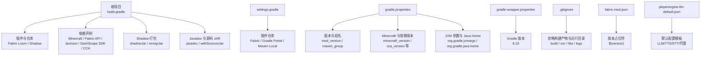
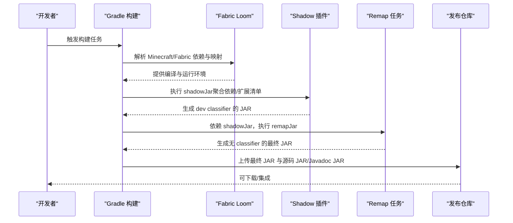
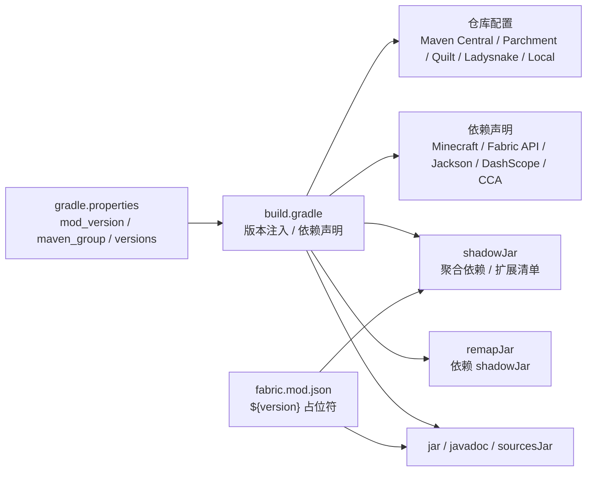

# 部署与发布

<cite>
**本文引用的文件**
- [build.gradle](file://build.gradle)
- [settings.gradle](file://settings.gradle)
- [gradle.properties](file://gradle.properties)
- [gradle-wrapper.properties](file://gradle/wrapper/gradle-wrapper.properties)
- [.gitignore](file://.gitignore)
- [README.md](file://README.md)
- [fabric.mod.json](file://src/main/resources/fabric.mod.json)
- [playerengine-llm-default.json](file://src/main/resources/playerengine-llm-default.json)
</cite>

## 目录
1. [简介](#简介)
2. [项目结构](#项目结构)
3. [核心组件](#核心组件)
4. [架构总览](#架构总览)
5. [详细组件分析](#详细组件分析)
6. [依赖关系分析](#依赖关系分析)
7. [性能考量](#性能考量)
8. [故障排查指南](#故障排查指南)
9. [结论](#结论)
10. [附录](#附录)

## 简介
本指南面向部署与发布流程，围绕 Gradle 构建脚本、Shadow Jar 打包、版本管理、依赖与资源处理、发布准备、多平台发布注意事项、依赖冲突解决、兼容性测试、自动化部署与 CI、发布后监控维护以及常见问题处理进行系统化说明。目标是帮助团队在不同环境下稳定产出可分发的 Fabric Mod 构件，并建立可持续的发布与运维流程。

## 项目结构
本项目采用 Fabric 生态的典型布局，核心构建与发布相关的关键文件如下：
- 构建脚本：根目录 build.gradle（定义插件、仓库、依赖、Shadow 打包、Remap、Javadoc、源码 JAR 等）
- 项目设置：settings.gradle（插件仓库与根项目名）
- 属性配置：gradle.properties（版本、组名、Minecraft 与依赖版本、JVM 参数、Java Home）
- Gradle Wrapper：gradle/wrapper/gradle-wrapper.properties（Gradle 版本）
- 忽略规则：.gitignore（构建产物、运行目录、日志、分发目录等）
- 模组元数据：src/main/resources/fabric.mod.json（版本占位符、入口点、Mixin、依赖）
- 默认配置模板：src/main/resources/playerengine-llm-default.json（LLM/TTS/STT 默认配置）

**图示来源**
- [build.gradle:1-135](file://build.gradle#L1-L135)
- [settings.gradle:17-28](file://settings.gradle#L17-L28)
- [gradle.properties:18-35](file://gradle.properties#L18-L35)
- [gradle-wrapper.properties:1-6](file://gradle/wrapper/gradle-wrapper.properties#L1-L6)
- [.gitignore:20-41](file://.gitignore#L20-L41)
- [fabric.mod.json:1-48](file://src/main/resources/fabric.mod.json#L1-L48)
- [playerengine-llm-default.json:1-89](file://src/main/resources/playerengine-llm-default.json#L1-L89)

**章节来源**
- [build.gradle:1-135](file://build.gradle#L1-L135)
- [settings.gradle:17-28](file://settings.gradle#L17-L28)
- [gradle.properties:18-35](file://gradle.properties#L18-L35)
- [gradle-wrapper.properties:1-6](file://gradle/wrapper/gradle-wrapper.properties#L1-L6)
- [.gitignore:20-41](file://.gitignore#L20-L41)
- [fabric.mod.json:1-48](file://src/main/resources/fabric.mod.json#L1-L48)
- [playerengine-llm-default.json:1-89](file://src/main/resources/playerengine-llm-default.json#L1-L89)

## 核心组件
- 构建插件与工具链
  - Fabric Loom：提供 Minecraft 依赖解析、Mojang 映射、开发运行与再映射能力
  - Shadow：聚合依赖为可执行/可分发的 Fat JAR
- 依赖管理
  - Minecraft、Fabric Loader、Fabric API、Parchment 映射
  - Jackson 核心库与 DashScope SDK（均为实现依赖）
  - Cardinal Components API（CCA）模块（modImplementation，非传递）
- 打包与再映射
  - shadowJar：聚合实现依赖，扩展 fabric.mod.json 版本占位符，注入 Mixin 配置到清单
  - remapJar：对 shadowJar 产物进行 Fabric 再映射，生成最终发布构件
- 资源与清单
  - jar 任务：保留可复现的文件顺序与时间戳，注入 Mixin 配置与 Implementation 信息
  - javadoc：统一编码与链接源码
  - withSourcesJar：生成源码 JAR
- 版本与属性
  - gradle.properties 统一管理 mod_version、maven_group、minecraft_version 等
  - fabric.mod.json 使用 ${version} 占位符，由 Gradle 构建时替换

**章节来源**
- [build.gradle:1-135](file://build.gradle#L1-L135)
- [gradle.properties:22-31](file://gradle.properties#L22-L31)
- [fabric.mod.json:4-4](file://src/main/resources/fabric.mod.json#L4-L4)

## 架构总览
下图展示从构建到发布的核心流程：Gradle 读取属性与仓库，解析依赖，编译与打包，生成 Shadow JAR 并再映射，最终产出可分发构件。

**图示来源**
- [build.gradle:71-94](file://build.gradle#L71-L94)
- [build.gradle:89-94](file://build.gradle#L89-L94)
- [build.gradle:108-122](file://build.gradle#L108-L122)

## 详细组件分析

### Gradle 构建脚本与版本管理
- 版本来源与占位符
  - 版本号来自 gradle.properties 的 mod_version，构建时注入到 fabric.mod.json 的 ${version} 占位符
  - Implementation-Version 也随版本号注入到 JAR 清单
- Java 工具链与编译
  - 指定 Java 17 工具链，统一编码与编译器参数
- 仓库与依赖
  - Maven Central、Parchment、Quilt Snapshots/Release、Ladysnake、Maven Local、本地 libs 目录
  - 依赖声明包括 Minecraft、Fabric API、Jackson、DashScope SDK、CCA（modImplementation，非传递）
- Shadow 打包
  - 聚合 shadow 配置中的依赖，扩展 fabric.mod.json 版本占位符，注入 Mixin 清单
- 再映射
  - remapJar 依赖 shadowJar，输入为 shadowJar 输出，生成最终发布 JAR
- 源码与文档
  - withSourcesJar 生成源码 JAR
  - javadoc 统一编码、链接源码、可复现输出

**章节来源**
- [build.gradle:6-9](file://build.gradle#L6-L9)
- [build.gradle:11-13](file://build.gradle#L11-L13)
- [build.gradle:15-41](file://build.gradle#L15-L41)
- [build.gradle:43-69](file://build.gradle#L43-L69)
- [build.gradle:71-87](file://build.gradle#L71-L87)
- [build.gradle:89-94](file://build.gradle#L89-L94)
- [build.gradle:96-106](file://build.gradle#L96-L106)
- [build.gradle:108-122](file://build.gradle#L108-L122)
- [gradle.properties:22-24](file://gradle.properties#L22-L24)
- [fabric.mod.json](file://src/main/resources/fabric.mod.json#L4)

### 依赖管理与冲突解决
- 依赖分类
  - implementation：运行期所需，参与编译与打包
  - modImplementation：Fabric 模组依赖，不传递
  - shadow：参与聚合打包，避免运行时缺失
- 冲突与传递性
  - CCA 使用 modImplementation 并关闭传递依赖，避免与模组生态产生环或重复
  - Jackson 与 DashScope SDK 同时声明为 implementation 与 shadow，确保运行时包含
- 仓库优先级
  - 通过多仓库配置与本地 libs 目录，保证依赖解析稳定性与可重复性

**章节来源**
- [build.gradle:43-69](file://build.gradle#L43-L69)

### 资源打包与清单注入
- fabric.mod.json 版本占位符
  - shadowJar 与 jar 任务均对 fabric.mod.json 进行 expand，确保版本正确写入
- Mixin 配置注入
  - 清单中注入 MixinConfigs，确保运行时装配 Mixin
- 可复现构建
  - jar 任务设置 preserveFileTimestamps 与 reproducibleFileOrder，提升可复现性

**章节来源**
- [build.gradle:79-86](file://build.gradle#L79-L86)
- [build.gradle:114-121](file://build.gradle#L114-L121)
- [build.gradle:111-112](file://build.gradle#L111-L112)
- [fabric.mod.json:30-32](file://src/main/resources/fabric.mod.json#L30-L32)

### 发布准备与产物
- 产物类型
  - shadowJar（dev 分类器）：包含所有依赖，便于测试与集成
  - remapJar（无分类器）：最终发布 JAR
  - sourcesJar：源码 JAR
  - javadocJar：API 文档 JAR
- 忽略规则
  - .gitignore 忽略 build、run、libs、logs 等目录，避免污染版本库

**章节来源**
- [build.gradle:89-94](file://build.gradle#L89-L94)
- [build.gradle:96-98](file://build.gradle#L96-L98)
- [build.gradle:100-106](file://build.gradle#L100-L106)
- [.gitignore:20-41](file://.gitignore#L20-L41)

### 多平台发布注意事项
- Java 版本一致性
  - 固定 Java 17 工具链，确保 macOS/Linux/Windows 一致
- Gradle 版本
  - 使用 Gradle Wrapper 指定 8.10，避免本地环境差异
- 仓库镜像
  - README 提供阿里云 Maven 镜像配置建议，加速依赖下载
- 运行时配置
  - playerengine-llm-default.json 提供默认配置模板，发布前可按需调整

**章节来源**
- [build.gradle](file://build.gradle#L9)
- [gradle-wrapper.properties](file://gradle/wrapper/gradle-wrapper.properties#L3)
- [README.md:145-156](file://README.md#L145-L156)
- [playerengine-llm-default.json:1-89](file://src/main/resources/playerengine-llm-default.json#L1-L89)

### 兼容性测试与验证清单
- 构建兼容性
  - 使用 Java 17 与 Gradle 8.10，确保与 Minecraft 1.20.1 生态兼容
- 运行兼容性
  - 通过 README 的首次运行与构建说明，验证依赖下载、运行与日志输出
- 配置兼容性
  - playerengine-llm-default.json 作为默认模板，发布前建议在不同网络与代理环境下测试

**章节来源**
- [README.md:46-100](file://README.md#L46-L100)
- [README.md:119-135](file://README.md#L119-L135)
- [playerengine-llm-default.json:1-89](file://src/main/resources/playerengine-llm-default.json#L1-L89)

### 自动化部署与持续集成
- CI/CD 建议
  - 使用 GitHub Actions/Azure Pipelines/Jenkins 等流水线，步骤建议包含：
    - 设置 Java 17 与 Gradle 8.10
    - 执行 ./gradlew build（包含 compile、test、check）
    - 产出 shadowJar 与 remapJar
    - 上传 artifacts（JAR、源码 JAR、Javadoc JAR）
    - 可选：发布到制品库（Maven/Nexus/Artifactory）
- 产物命名与版本
  - 使用 gradle.properties 中的 mod_version 作为版本号，确保与 fabric.mod.json 保持一致
- 安全与密钥
  - README 提示不要将 API Key 提交至公共仓库，CI 中使用受控密文存储

**章节来源**
- [gradle.properties:22-24](file://gradle.properties#L22-L24)
- [build.gradle:6-9](file://build.gradle#L6-L9)
- [README.md:1-10](file://README.md#L1-L10)

### 发布后的监控与维护
- 日志与诊断
  - README 提供日志关键词与常见问题排查，便于发布后快速定位 LLM/TTS/STT 相关问题
- 配置热更新
  - playerengine-llm-default.json 作为模板，发布后可根据用户反馈调整默认值并重新构建

**章节来源**
- [README.md:456-491](file://README.md#L456-L491)
- [playerengine-llm-default.json:1-89](file://src/main/resources/playerengine-llm-default.json#L1-L89)

## 依赖关系分析
下图展示构建脚本与关键配置之间的依赖关系，体现版本来源、仓库解析与打包流程。

**图示来源**
- [gradle.properties:22-31](file://gradle.properties#L22-L31)
- [build.gradle:6-9](file://build.gradle#L6-L9)
- [build.gradle:15-41](file://build.gradle#L15-L41)
- [build.gradle:43-69](file://build.gradle#L43-L69)
- [build.gradle:71-94](file://build.gradle#L71-L94)
- [build.gradle:108-122](file://build.gradle#L108-L122)
- [fabric.mod.json](file://src/main/resources/fabric.mod.json#L4)

**章节来源**
- [gradle.properties:22-31](file://gradle.properties#L22-L31)
- [build.gradle:15-94](file://build.gradle#L15-L94)
- [fabric.mod.json](file://src/main/resources/fabric.mod.json#L4)

## 性能考量
- 构建性能
  - 使用 Gradle Wrapper 与固定 Gradle 版本，减少环境差异导致的性能波动
  - JVM 内存参数在 gradle.properties 中设置，确保大型依赖解析与反混淆过程稳定
- 打包体积
  - Shadow 聚合依赖会增大 JAR 体积，建议仅在需要分发可运行构件时使用；发布到仓库时可同时提供源码 JAR 与轻量 Javadoc JAR
- 可复现性
  - jar 任务开启 reproducibleFileOrder 与 preserveFileTimestamps，有助于审计与回溯

**章节来源**
- [gradle.properties:18-20](file://gradle.properties#L18-L20)
- [build.gradle:111-112](file://build.gradle#L111-L112)
- [build.gradle:108-122](file://build.gradle#L108-L122)

## 故障排查指南
- 构建失败
  - Java 版本不匹配：确认 JAVA_HOME 指向 Java 17，或在 gradle.properties 中设置 org.gradle.java.home
  - 依赖解析失败：检查网络与代理，必要时配置阿里云 Maven 镜像
  - 编译错误：清理后重试，检查是否修改过源码
- 运行时问题
  - LLM/TTS/STT 401/403：检查 API Key 有效性与权限
  - STT 识别为空：确认录音时长与麦克风权限
  - TTS 无声：检查 tts.enabled 与日志中 AliyunTTS 相关输出
- 发布产物问题
  - 版本不一致：确认 gradle.properties 与 fabric.mod.json 的版本同步
  - 依赖缺失：检查 shadow 配置是否包含所需依赖

**章节来源**
- [README.md:136-156](file://README.md#L136-L156)
- [README.md:456-491](file://README.md#L456-L491)
- [build.gradle:6-9](file://build.gradle#L6-L9)
- [build.gradle:71-87](file://build.gradle#L71-L87)
- [fabric.mod.json](file://src/main/resources/fabric.mod.json#L4)

## 结论
本指南基于现有构建脚本与配置，给出了从版本管理、依赖与资源处理、Shadow 打包与再映射到发布准备与运维监控的全流程建议。遵循 Java 17 与 Gradle 8.10 的统一工具链、合理配置仓库与依赖、严格管理版本占位符与清单注入，可显著提升构建稳定性与发布质量。结合 CI/CD 与日志诊断，可进一步完善自动化与可观测性。

## 附录
- 常用构建命令（示例）
  - 清理并构建：./gradlew clean build
  - 仅构建并跳过测试：./gradlew build -x test
  - 生成源码与 Javadoc JAR：./gradlew sourcesJar javadocJar
  - 生成 Shadow JAR：./gradlew shadowJar
  - 生成最终发布 JAR：./gradlew remapJar
- 版本管理最佳实践
  - 使用 gradle.properties 统一维护版本号，避免硬编码
  - 发布前核对 fabric.mod.json 的 ${version} 替换是否生效
- 多平台发布清单
  - 确认 Java 17、Gradle 8.10、网络与代理配置
  - 在不同操作系统上分别执行构建与基本功能验证
  - 将最终 JAR、源码 JAR、Javadoc JAR 一并归档与发布