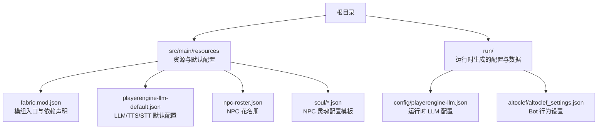
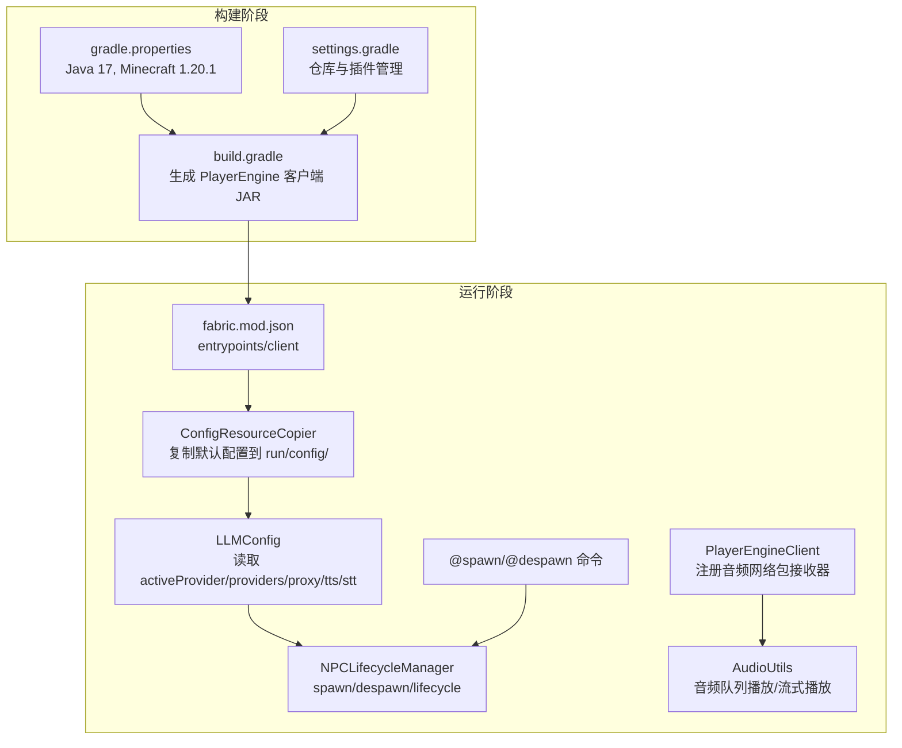
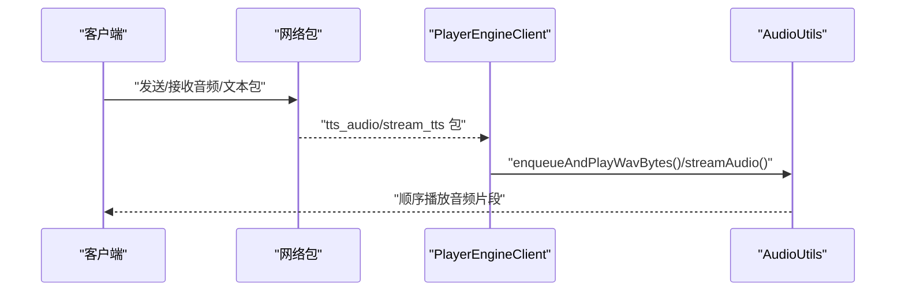
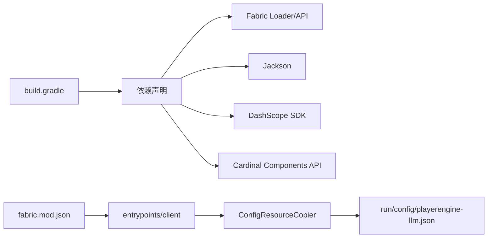

# 客户端安装

<cite>
**本文引用的文件**   
- [README.md](file://README.md)
- [build.gradle](file://build.gradle)
- [gradle.properties](file://gradle.properties)
- [settings.gradle](file://settings.gradle)
- [src/main/resources/fabric.mod.json](file://src/main/resources/fabric.mod.json)
- [src/main/resources/playerengine-llm-default.json](file://src/main/resources/playerengine-llm-default.json)
- [src/main/resources/npc-roster.json](file://src/main/resources/npc-roster.json)
- [src/main/resources/soul/soul_QiQi.json](file://src/main/resources/soul/soul_QiQi.json)
- [run/altoclef/altoclef_settings.json](file://run/altoclef/altoclef_settings.json)
- [src/main/java/adris/altoclef/player2api/llm/LLMConfig.java](file://src/main/java/adris/altoclef/player2api/llm/LLMConfig.java)
- [src/main/java/adris/altoclef/player2api/utils/ConfigResourceCopier.java](file://src/main/java/adris/altoclef/player2api/utils/ConfigResourceCopier.java)
- [src/main/java/adris/altoclef/commands/SpawnAINPCCommand.java](file://src/main/java/adris/altoclef/commands/SpawnAINPCCommand.java)
- [src/main/java/adris/altoclef/player2api/NPCLifecycleManager.java](file://src/main/java/adris/altoclef/player2api/NPCLifecycleManager.java)
- [src/main/java/adris/altoclef/PlayerEngineClient.java](file://src/main/java/adris/altoclef/PlayerEngineClient.java)
- [src/main/java/adris/altoclef/player2api/stt/AliyunSTTProvider.java](file://src/main/java/adris/altoclef/player2api/stt/AliyunSTTProvider.java)
- [src/main/java/adris/altoclef/player2api/utils/AudioUtils.java](file://src/main/java/adris/altoclef/player2api/utils/AudioUtils.java)
</cite>

## 目录
1. [简介](#简介)
2. [项目结构](#项目结构)
3. [核心组件](#核心组件)
4. [架构总览](#架构总览)
5. [详细组件分析](#详细组件分析)
6. [依赖分析](#依赖分析)
7. [性能考虑](#性能考虑)
8. [故障排查指南](#故障排查指南)
9. [结论](#结论)
10. [附录](#附录)

## 简介
本指南面向希望在 Minecraft 1.20.1（Fabric）环境中安装并使用 PlayerEngine Mod 的用户。内容涵盖：
- 客户端环境准备（Java 17、Minecraft 1.20.1、Fabric Loader）
- PlayerEngine Mod 的构建与安装（通过 Gradle 构建产物加载）
- 客户端配置文件的设置（playerengine-llm.json 的关键项说明与 API Key 配置）
- 功能测试（基本命令验证、NPC 生成、语音功能测试）
- 常见问题排查（Mod 冲突、配置错误、性能优化）

## 项目结构
该仓库采用 Fabric 模组标准结构，核心资源与配置位于 resources 目录，运行时配置由运行脚本在首次启动时生成于 run/config/。

图表来源
- [src/main/resources/fabric.mod.json:1-48](file://src/main/resources/fabric.mod.json#L1-L48)
- [src/main/resources/playerengine-llm-default.json:1-89](file://src/main/resources/playerengine-llm-default.json#L1-L89)
- [src/main/resources/npc-roster.json:1-54](file://src/main/resources/npc-roster.json#L1-L54)
- [src/main/resources/soul/soul_QiQi.json:1-61](file://src/main/resources/soul/soul_QiQi.json#L1-L61)
- [run/altoclef/altoclef_settings.json:1-48](file://run/altoclef/altoclef_settings.json#L1-L48)

章节来源
- [README.md:9-661](file://README.md#L9-L661)
- [build.gradle:1-135](file://build.gradle#L1-L135)
- [gradle.properties:1-35](file://gradle.properties#L1-L35)
- [settings.gradle:1-28](file://settings.gradle#L1-L28)

## 核心组件
- 环境与构建
  - Java 17、Minecraft 1.20.1、Fabric Loader 0.15.6、Fabric API
  - Gradle 8.x（自带 Wrapper）
- 模组入口与依赖
  - fabric.mod.json 声明 entrypoints（client/main）、mixins、depends
- 配置系统
  - 默认配置模板位于 resources，运行时复制到 run/config/
  - LLMConfig 负责读取 activeProvider、providers、proxy、tts、stt 等
- NPC 生命周期与命令
  - SpawnAINPCCommand 提供 @spawn/@despawn 等命令
  - NPCLifecycleManager 管理 NPC 的生成、销毁与持久化
- 客户端音频
  - PlayerEngineClient 注册 TTS/STT 网络包接收器
  - AudioUtils 负责音频队列播放与流式播放

章节来源
- [build.gradle:43-69](file://build.gradle#L43-L69)
- [src/main/resources/fabric.mod.json:17-46](file://src/main/resources/fabric.mod.json#L17-L46)
- [src/main/java/adris/altoclef/player2api/llm/LLMConfig.java:19-115](file://src/main/java/adris/altoclef/player2api/llm/LLMConfig.java#L19-L115)
- [src/main/java/adris/altoclef/commands/SpawnAINPCCommand.java:18-65](file://src/main/java/adris/altoclef/commands/SpawnAINPCCommand.java#L18-L65)
- [src/main/java/adris/altoclef/player2api/NPCLifecycleManager.java:65-121](file://src/main/java/adris/altoclef/player2api/NPCLifecycleManager.java#L65-L121)
- [src/main/java/adris/altoclef/PlayerEngineClient.java:36-64](file://src/main/java/adris/altoclef/PlayerEngineClient.java#L36-L64)
- [src/main/java/adris/altoclef/player2api/utils/AudioUtils.java:37-138](file://src/main/java/adris/altoclef/player2api/utils/AudioUtils.java#L37-L138)

## 架构总览
PlayerEngine 的客户端安装与运行涉及“构建产物加载”和“运行时配置生成”两大路径。构建阶段生成包含 PlayerEngine 的最终 JAR；首次运行时，配置系统将默认模板复制到 run/config/，随后游戏读取配置并初始化 LLM/TTS/STT 与 NPC 系统。

图表来源
- [build.gradle:1-135](file://build.gradle#L1-L135)
- [gradle.properties:1-35](file://gradle.properties#L1-L35)
- [settings.gradle:1-28](file://settings.gradle#L1-L28)
- [src/main/resources/fabric.mod.json:17-46](file://src/main/resources/fabric.mod.json#L17-L46)
- [src/main/java/adris/altoclef/player2api/utils/ConfigResourceCopier.java:29-57](file://src/main/java/adris/altoclef/player2api/utils/ConfigResourceCopier.java#L29-L57)
- [src/main/java/adris/altoclef/player2api/llm/LLMConfig.java:54-89](file://src/main/java/adris/altoclef/player2api/llm/LLMConfig.java#L54-L89)
- [src/main/java/adris/altoclef/player2api/NPCLifecycleManager.java:72-84](file://src/main/java/adris/altoclef/player2api/NPCLifecycleManager.java#L72-L84)
- [src/main/java/adris/altoclef/commands/SpawnAINPCCommand.java:27-47](file://src/main/java/adris/altoclef/commands/SpawnAINPCCommand.java#L27-L47)
- [src/main/java/adris/altoclef/PlayerEngineClient.java:36-64](file://src/main/java/adris/altoclef/PlayerEngineClient.java#L36-L64)
- [src/main/java/adris/altoclef/player2api/utils/AudioUtils.java:49-68](file://src/main/java/adris/altoclef/player2api/utils/AudioUtils.java#L49-L68)

## 详细组件分析

### 客户端环境准备
- 系统要求
  - Java 17（必须）
  - Minecraft 1.20.1
  - Fabric Loader 0.15.6 及 Fabric API
  - Gradle 8.x（项目自带 Wrapper）
- 安装步骤
  - 确认 Java 版本
  - 使用 Gradle Wrapper 构建并运行客户端
  - 首次运行后，运行时配置会自动生成于 run/config/

章节来源
- [README.md:9-44](file://README.md#L9-L44)
- [build.gradle:9-9](file://build.gradle#L9-L9)
- [gradle.properties:26-26](file://gradle.properties#L26-L26)
- [build.gradle:131-135](file://build.gradle#L131-L135)

### PlayerEngine Mod 安装与构建
- 构建产物
  - 使用 Gradle 生成包含 PlayerEngine 的客户端 JAR（含 Shadow/Remap）
- 安装方式
  - 通过 Gradle runClient 自动加载构建产物，无需手动放置 mod 文件
- 依赖与版本
  - Fabric Loader 0.15.6、Fabric API、Jackson、DashScope SDK、Cardinal Components API

章节来源
- [build.gradle:43-69](file://build.gradle#L43-L69)
- [build.gradle:71-94](file://build.gradle#L71-L94)
- [README.md:25-40](file://README.md#L25-L40)

### 客户端配置文件设置（playerengine-llm.json）
- 生成与位置
  - 首次运行后生成于 run/config/playerengine-llm.json
  - 默认模板位于 src/main/resources/playerengine-llm-default.json
- 关键配置项说明
  - activeProvider：当前生效的 LLM 提供商（qwen_local/qwen/openai/player2-remote）
  - providers.*：各提供商的 enabled、apiUrl、apiKey、model、maxTokens、temperature
  - proxy：HTTP 代理开关与 host/port
  - tts：enabled、apiKey、model、voice、volume、speechRate、pitchRate
  - stt：enabled、model、language
  - progressVoice：enabled、intervalMin、intervalMax
- API Key 设置
  - qwen_local：本地 Ollama，无需 API Key
  - qwen/openai：需填写对应平台的 API Key
  - tts.apiKey 留空则复用 providers.qwen 的 apiKey
- 重要提示
  - 修改后需重启游戏生效
  - 不要将包含真实 API Key 的文件上传至公共仓库

章节来源
- [README.md:66-171](file://README.md#L66-L171)
- [src/main/resources/playerengine-llm-default.json:6-88](file://src/main/resources/playerengine-llm-default.json#L6-L88)
- [src/main/java/adris/altoclef/player2api/llm/LLMConfig.java:54-89](file://src/main/java/adris/altoclef/player2api/llm/LLMConfig.java#L54-L89)

### NPC 与角色配置
- NPC 花名册（npc-roster.json）
  - 定义角色模板：id、name、persona（OCEAN）、initialEmotions、description
- 灵魂配置（soul/*.json）
  - 定义角色的完整人格矩阵、初始情绪、行为签名、记忆锚点与关系图谱
- Bot 行为设置（run/altoclef/altoclef_settings.json）
  - commandPrefix、mobDefense、autoEat、dodgeProjectiles、throwawayItems、importantItems、homeBasePosition、replantCrops、avoidDrowning 等

章节来源
- [README.md:172-331](file://README.md#L172-L331)
- [src/main/resources/npc-roster.json:1-54](file://src/main/resources/npc-roster.json#L1-L54)
- [src/main/resources/soul/soul_QiQi.json:1-61](file://src/main/resources/soul/soul_QiQi.json#L1-L61)
- [run/altoclef/altoclef_settings.json:1-48](file://run/altoclef/altoclef_settings.json#L1-L48)

### 功能测试方法
- 基本命令验证
  - 打开聊天框输入 @help 查看可用命令
  - 使用 @spawn 生成 NPC，@despawn 移除 NPC
  - 使用 @npcls 查看当前世界中的 NPC 列表
- NPC 实体生成
  - @spawn <显示名> [persona_id] 生成指定角色
  - 未指定 persona_id 时自动生成默认性格
- 语音功能测试
  - 确认 playerengine-llm.json 中 stt.enabled=true
  - 按住 V 键进行语音输入，松开后 NPC 应能收到文字消息
  - 若使用阿里云 TTS，确认 tts.enabled 与 model/voice 设置

章节来源
- [README.md:334-409](file://README.md#L334-L409)
- [src/main/java/adris/altoclef/commands/SpawnAINPCCommand.java:20-47](file://src/main/java/adris/altoclef/commands/SpawnAINPCCommand.java#L20-L47)
- [src/main/java/adris/altoclef/PlayerEngineClient.java:36-64](file://src/main/java/adris/altoclef/PlayerEngineClient.java#L36-L64)
- [src/main/java/adris/altoclef/player2api/stt/AliyunSTTProvider.java:168-171](file://src/main/java/adris/altoclef/player2api/stt/AliyunSTTProvider.java#L168-L171)

### 客户端音频与网络包
- 客户端注册
  - 注册 TTS 音频包接收器（sentence-level 队列播放）
  - 注册 STT 停止包接收器
- 音频播放
  - AudioUtils 提供 WAV 音频队列播放与流式播放（player2-remote 模式）
- STT 可用性
  - AliyunSTTProvider 校验 apiKey 是否有效

图表来源
- [src/main/java/adris/altoclef/PlayerEngineClient.java:36-64](file://src/main/java/adris/altoclef/PlayerEngineClient.java#L36-L64)
- [src/main/java/adris/altoclef/player2api/utils/AudioUtils.java:49-68](file://src/main/java/adris/altoclef/player2api/utils/AudioUtils.java#L49-L68)
- [src/main/java/adris/altoclef/player2api/stt/AliyunSTTProvider.java:168-171](file://src/main/java/adris/altoclef/player2api/stt/AliyunSTTProvider.java#L168-L171)

## 依赖分析
- 构建期依赖
  - Fabric Loom、Shadow、Jackson、DashScope SDK、Cardinal Components API
- 运行期依赖
  - Fabric Loader/Fabric API、Mixins、Cardinal Components
- 配置复制链路
  - ConfigResourceCopier 确保 run/config/ 下存在配置文件，不存在则从 classpath 复制默认模板

图表来源
- [build.gradle:43-69](file://build.gradle#L43-L69)
- [src/main/resources/fabric.mod.json:17-46](file://src/main/resources/fabric.mod.json#L17-L46)
- [src/main/java/adris/altoclef/player2api/utils/ConfigResourceCopier.java:29-57](file://src/main/java/adris/altoclef/player2api/utils/ConfigResourceCopier.java#L29-L57)

章节来源
- [build.gradle:43-69](file://build.gradle#L43-L69)
- [src/main/resources/fabric.mod.json:17-46](file://src/main/resources/fabric.mod.json#L17-L46)
- [src/main/java/adris/altoclef/player2api/utils/ConfigResourceCopier.java:29-57](file://src/main/java/adris/altoclef/player2api/utils/ConfigResourceCopier.java#L29-L57)

## 性能考虑
- 同时活跃 NPC 数量建议不超过 3~5 个，避免过多并发任务导致性能下降
- Bot 行为设置中可调整自动行为（如自动进食、躲避弹射物、自动补种等），合理配置可减少不必要的计算与交互
- 语音功能开启后会增加网络与音频处理开销，可根据需要调整 tts/stt 的启用状态与模型

章节来源
- [README.md:625-635](file://README.md#L625-L635)
- [run/altoclef/altoclef_settings.json:21-47](file://run/altoclef/altoclef_settings.json#L21-L47)

## 故障排查指南
- 构建问题
  - “Unsupported class file major version”：确保 JAVA_HOME 指向 Java 17
  - 构建卡住或内存不足：项目已配置 -Xmx3G，必要时可手动增大
  - 下载资源缓慢：首次构建需下载大量资源，确保网络稳定或使用加速器
  - 权限问题（Linux/Mac）：先赋予 gradlew 执行权限
- 配置问题
  - 修改 playerengine-llm.json 后未生效：需重启游戏
  - API Key 无效：确认 providers.qwen/openai 的 apiKey 已正确填写；阿里云 STT 需校验可用性
- 功能问题
  - 语音无法输入：确认 stt.enabled=true，且麦克风可用
  - 语音无法播放：确认 tts.enabled 与 model/voice 设置，检查音频队列是否正常
- NPC 问题
  - 无法生成 NPC：检查 @spawn 语法与 persona_id 是否存在于 npc-roster.json
  - NPC 不响应：检查 altoclef_settings.json 的 commandPrefix 与相关行为开关

章节来源
- [README.md:55-63](file://README.md#L55-L63)
- [README.md:66-171](file://README.md#L66-L171)
- [src/main/java/adris/altoclef/player2api/stt/AliyunSTTProvider.java:168-171](file://src/main/java/adris/altoclef/player2api/stt/AliyunSTTProvider.java#L168-L171)
- [src/main/java/adris/altoclef/commands/SpawnAINPCCommand.java:32-47](file://src/main/java/adris/altoclef/commands/SpawnAINPCCommand.java#L32-L47)

## 结论
通过本指南，您可以在 Minecraft 1.20.1（Fabric）环境下完成 PlayerEngine Mod 的环境准备、构建与安装，并正确配置 LLM/TTS/STT 与 NPC 相关文件。按照功能测试步骤，您可以验证命令、NPC 生成与语音功能。若遇到问题，可依据故障排查指南逐项定位与修复。

## 附录
- 常用命令速查
  - @spawn <显示名> [persona_id]：生成 NPC
  - @despawn <显示名>：移除 NPC
  - @npcls：列出当前世界中的 NPC
  - @help：查看所有命令
- 配置文件路径
  - playerengine-llm.json：run/config/playerengine-llm.json（首次运行后生成）
  - Bot 行为设置：run/altoclef/altoclef_settings.json

章节来源
- [README.md:334-409](file://README.md#L334-L409)
- [README.md:66-171](file://README.md#L66-L171)