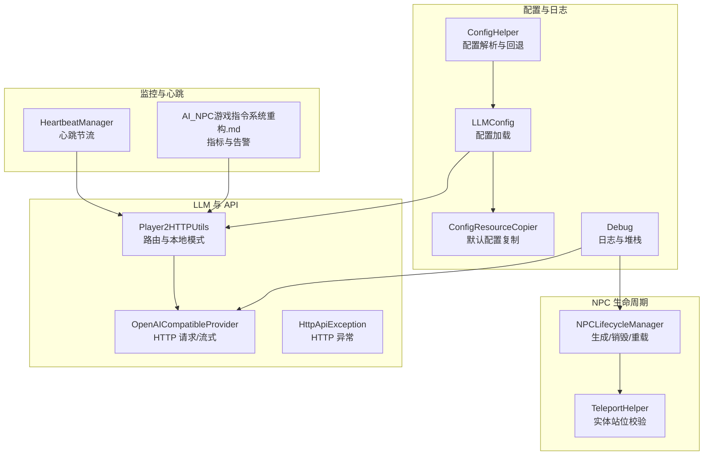
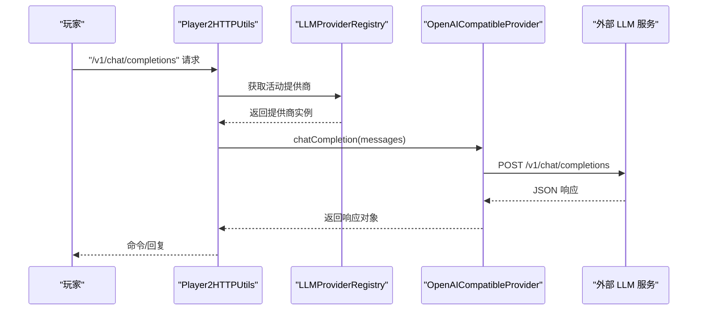
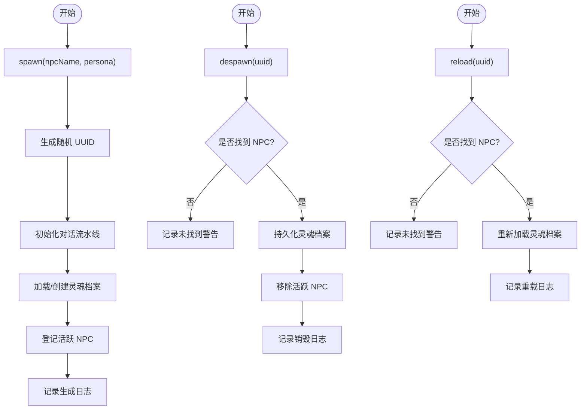
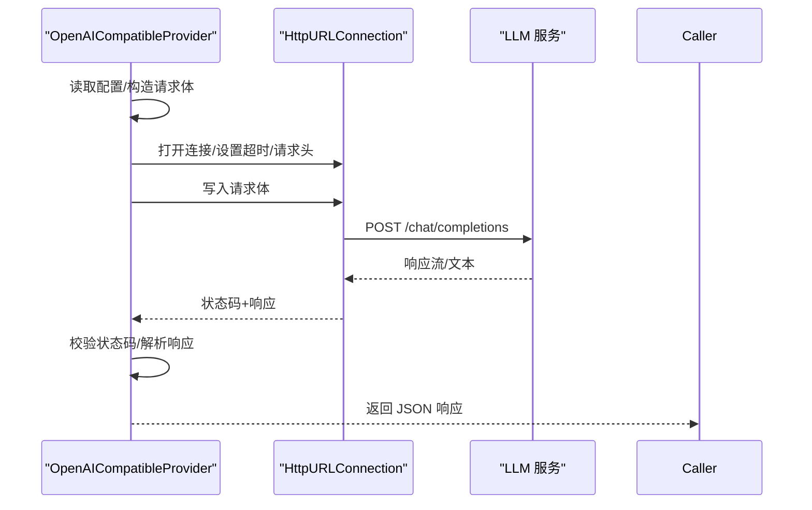
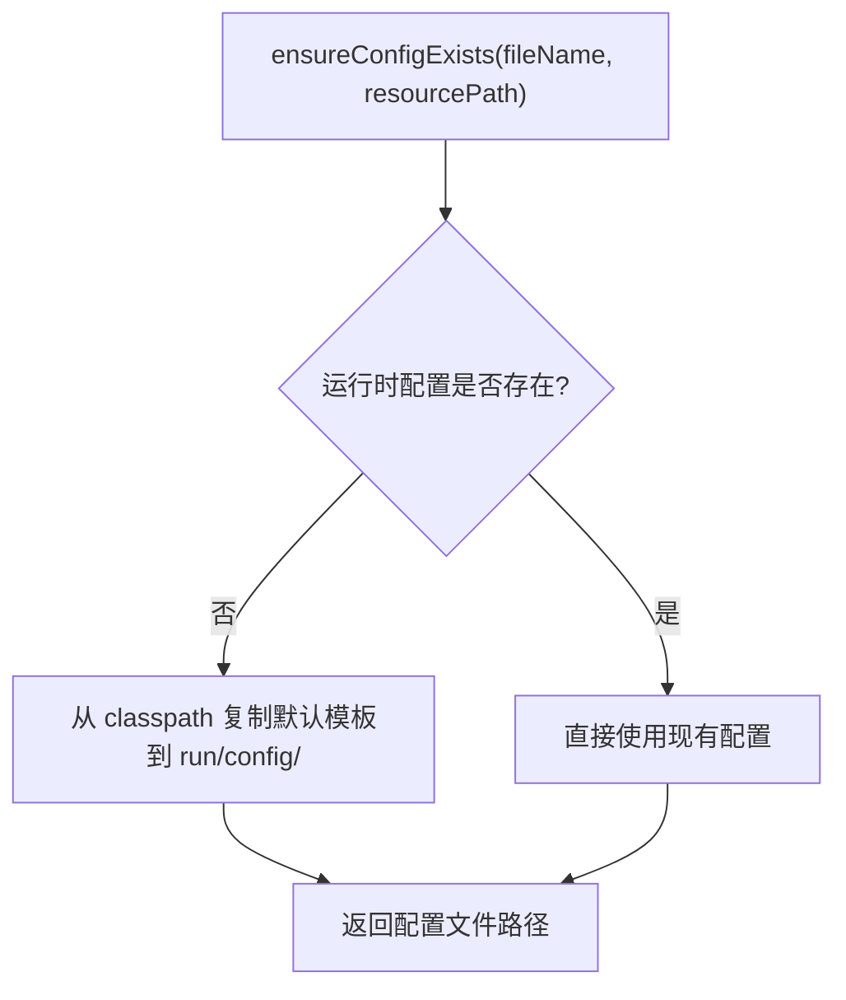
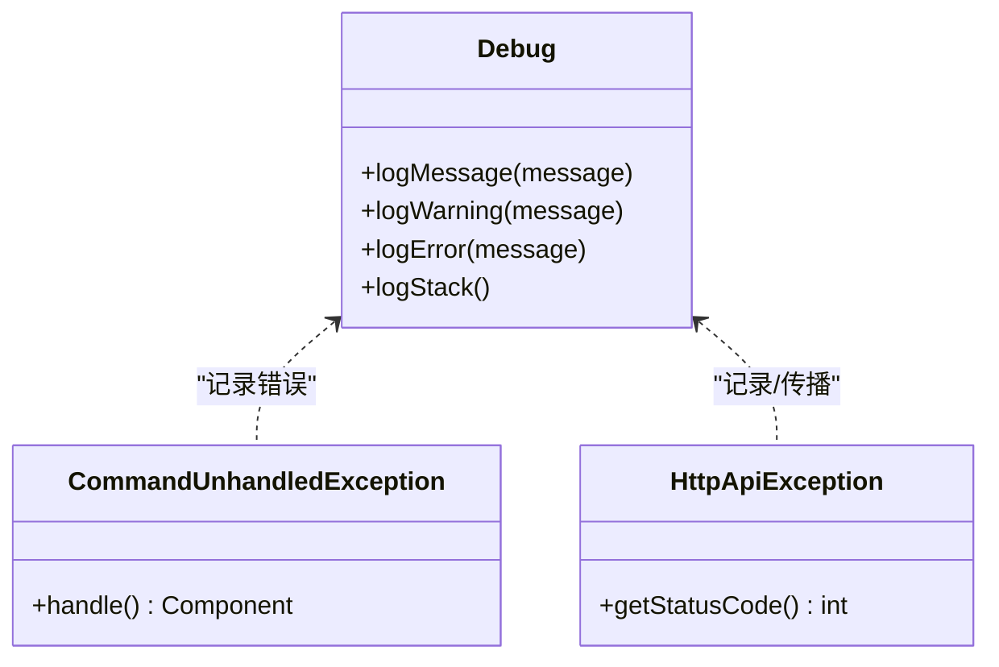
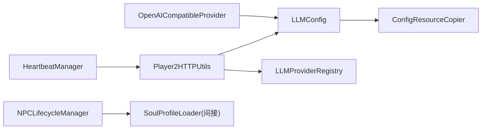

# 常见问题诊断

<cite>
**本文引用的文件**   
- [README.md](file://README.md)
- [Debug.java](file://src/main/java/adris/altoclef/Debug.java)
- [NPCLifecycleManager.java](file://src/main/java/adris/altoclef/player2api/NPCLifecycleManager.java)
- [OpenAICompatibleProvider.java](file://src/main/java/adris/altoclef/player2api/llm/impl/OpenAICompatibleProvider.java)
- [LLMConfig.java](file://src/main/java/adris/altoclef/player2api/llm/LLMConfig.java)
- [Player2HTTPUtils.java](file://src/main/java/adris/altoclef/player2api/utils/Player2HTTPUtils.java)
- [HttpApiException.java](file://src/main/java/adris/altoclef/player2api/utils/HttpApiException.java)
- [HeartbeatManager.java](file://src/main/java/adris/altoclef/player2api/manager/HeartbeatManager.java)
- [AI_NPC游戏指令系统重构.md](file://docs/AI_NPC游戏指令系统重构.md)
- [ConfigHelper.java](file://src/main/java/adris/altoclef/util/helpers/ConfigHelper.java)
- [ConfigResourceCopier.java](file://src/main/java/adris/altoclef/player2api/utils/ConfigResourceCopier.java)
- [TeleportHelper.java](file://src/main/java/adris/altoclef/util/TeleportHelper.java)
- [CommandUnhandledException.java](file://src/main/java/baritone/command/CommandUnhandledException.java)
- [CommandErrorMessageException.java](file://src/main/java/baritone/api/command/exception/CommandErrorMessageException.java)
- [TypeUtils.java](file://src/main/java/baritone/api/utils/TypeUtils.java)
</cite>

## 目录
1. [简介](#简介)
2. [项目结构](#项目结构)
3. [核心组件](#核心组件)
4. [架构总览](#架构总览)
5. [详细组件分析](#详细组件分析)
6. [依赖分析](#依赖分析)
7. [性能考量](#性能考量)
8. [故障排查指南](#故障排查指南)
9. [结论](#结论)
10. [附录](#附录)

## 简介
本指南面向使用 PlayerEngine（Minecraft Fabric 模组）的玩家与运维人员，聚焦于“常见问题诊断”。内容涵盖：
- Mod 加载失败的典型错误与特征
- NPC 实体生成异常的识别与定位
- LLM 调用超时与 API 调用失败的常见原因与诊断
- 错误日志的分析方法（日志级别、关键错误信息、异常堆栈）
- 性能问题的早期预警信号与识别方法

## 项目结构
该项目围绕“NPC 生命周期管理”“LLM 与远端 API 路由”“配置加载与复制”“日志与错误处理”等模块组织。核心路径如下：
- NPC 生命周期与实体相关：player2api/NPCLifecycleManager、util/TeleportHelper
- LLM 与 API 调用：player2api/llm/*、player2api/utils/Player2HTTPUtils
- 配置与复制：player2api/llm/LLMConfig、player2api/utils/ConfigResourceCopier、util/helpers/ConfigHelper
- 日志与错误：adris/altoclef/Debug、baritone/command/CommandUnhandledException、baritone/api/command/exception/CommandErrorMessageException
- 指标与监控：docs/AI_NPC游戏指令系统重构.md

**图表来源**
- [LLMConfig.java:1-89](file://src/main/java/adris/altoclef/player2api/llm/LLMConfig.java#L1-L89)
- [ConfigResourceCopier.java:1-37](file://src/main/java/adris/altoclef/player2api/utils/ConfigResourceCopier.java#L1-L37)
- [Player2HTTPUtils.java:1-152](file://src/main/java/adris/altoclef/player2api/utils/Player2HTTPUtils.java#L1-L152)
- [OpenAICompatibleProvider.java:1-167](file://src/main/java/adris/altoclef/player2api/llm/impl/OpenAICompatibleProvider.java#L1-L167)
- [NPCLifecycleManager.java:1-166](file://src/main/java/adris/altoclef/player2api/NPCLifecycleManager.java#L1-L166)
- [TeleportHelper.java:192-238](file://src/main/java/adris/altoclef/util/TeleportHelper.java#L192-L238)
- [HeartbeatManager.java:1-46](file://src/main/java/adris/altoclef/player2api/manager/HeartbeatManager.java#L1-L46)
- [AI_NPC游戏指令系统重构.md:1385-1415](file://docs/AI_NPC游戏指令系统重构.md#L1385-L1415)

**章节来源**
- [README.md:1-661](file://README.md#L1-L661)

## 核心组件
- 配置系统：负责加载/复制 LLM/TTS/STT/代理等配置，支持运行时重载与默认模板复制。
- NPC 生命周期管理：负责 NPC 的生成、销毁与重载，维护活跃 NPC 集合。
- LLM 提供商与 API 路由：统一将 LLM 请求路由至配置的提供商（含本地 Ollama、云端等），并处理流式与非流式响应。
- 日志与错误处理：提供统一的日志接口与异常处理，便于定位问题。
- 监控与心跳：提供指标监控点与心跳节流，辅助性能与可用性观测。

**章节来源**
- [LLMConfig.java:1-89](file://src/main/java/adris/altoclef/player2api/llm/LLMConfig.java#L1-L89)
- [NPCLifecycleManager.java:1-166](file://src/main/java/adris/altoclef/player2api/NPCLifecycleManager.java#L1-L166)
- [OpenAICompatibleProvider.java:1-167](file://src/main/java/adris/altoclef/player2api/llm/impl/OpenAICompatibleProvider.java#L1-L167)
- [Player2HTTPUtils.java:1-152](file://src/main/java/adris/altoclef/player2api/utils/Player2HTTPUtils.java#L1-L152)
- [Debug.java:1-103](file://src/main/java/adris/altoclef/Debug.java#L1-L103)
- [HeartbeatManager.java:1-46](file://src/main/java/adris/altoclef/player2api/manager/HeartbeatManager.java#L1-L46)

## 架构总览
下图展示从“聊天/语音输入”到“NPC 行为执行”的关键路径，以及 LLM 调用与 API 路由：

**图表来源**
- [Player2HTTPUtils.java:90-112](file://src/main/java/adris/altoclef/player2api/utils/Player2HTTPUtils.java#L90-L112)
- [OpenAICompatibleProvider.java:112-141](file://src/main/java/adris/altoclef/player2api/llm/impl/OpenAICompatibleProvider.java#L112-L141)

## 详细组件分析

### NPC 生命周期管理（生成/销毁/重载）
- 生成：分配 UUID、初始化对话流水线、加载/创建灵魂档案、登记活跃 NPC。
- 销毁：移除活跃 NPC、持久化灵魂档案、记录日志。
- 重载：按 UUID 重新加载灵魂档案。
- 查询：按 UUID/名称查询活跃 NPC，统计活跃数量。

**图表来源**
- [NPCLifecycleManager.java:72-121](file://src/main/java/adris/altoclef/player2api/NPCLifecycleManager.java#L72-L121)

**章节来源**
- [NPCLifecycleManager.java:1-166](file://src/main/java/adris/altoclef/player2api/NPCLifecycleManager.java#L1-L166)

### LLM 提供商与 API 调用（OpenAI 兼容）
- 请求准备：读取配置（apiUrl、apiKey、model、maxTokens、temperature），构造请求体，设置代理（可选），建立连接。
- 非流式：发送请求，读取响应，校验状态码，解析 JSON。
- 流式：同上，但处理分片与首 token 标记。
- 错误处理：状态码不在 2xx 抛出异常，记录错误日志。

**图表来源**
- [OpenAICompatibleProvider.java:51-141](file://src/main/java/adris/altoclef/player2api/llm/impl/OpenAICompatibleProvider.java#L51-L141)

**章节来源**
- [OpenAICompatibleProvider.java:1-167](file://src/main/java/adris/altoclef/player2api/llm/impl/OpenAICompatibleProvider.java#L1-L167)

### 配置加载与复制（LLM/TTS/STT/代理）
- 默认模板复制：首次运行时将默认配置从资源复制到运行时配置目录。
- 配置加载：解析 JSON，设置活动提供商、代理、TTS/STT 参数。
- 重载：支持运行时重新加载配置。

**图表来源**
- [ConfigResourceCopier.java:29-37](file://src/main/java/adris/altoclef/player2api/utils/ConfigResourceCopier.java#L29-L37)

**章节来源**
- [LLMConfig.java:1-89](file://src/main/java/adris/altoclef/player2api/llm/LLMConfig.java#L1-L89)
- [ConfigResourceCopier.java:1-37](file://src/main/java/adris/altoclef/player2api/utils/ConfigResourceCopier.java#L1-L37)

### 日志与错误处理
- Debug：统一日志入口，支持普通/警告/错误级别，错误级别输出堆栈。
- 命令异常：未处理命令异常记录错误日志并向上抛出。
- HTTP 异常：封装 HTTP 状态码，便于上层判断。

**图表来源**
- [Debug.java:45-102](file://src/main/java/adris/altoclef/Debug.java#L45-L102)
- [CommandUnhandledException.java:1-21](file://src/main/java/baritone/command/CommandUnhandledException.java#L1-L21)
- [HttpApiException.java:1-33](file://src/main/java/adris/altoclef/player2api/utils/HttpApiException.java#L1-L33)

**章节来源**
- [Debug.java:1-103](file://src/main/java/adris/altoclef/Debug.java#L1-L103)
- [CommandUnhandledException.java:1-21](file://src/main/java/baritone/command/CommandUnhandledException.java#L1-L21)
- [HttpApiException.java:1-33](file://src/main/java/adris/altoclef/player2api/utils/HttpApiException.java#L1-L33)

## 依赖分析
- LLMConfig 依赖 ConfigResourceCopier 保证默认配置存在。
- Player2HTTPUtils 依赖 LLMConfig 与 LLMProviderRegistry，将 /v1/chat/completions 路由到具体提供商。
- OpenAICompatibleProvider 依赖 LLMConfig 读取提供商配置，支持代理与超时设置。
- NPCLifecycleManager 依赖 SoulProfileLoader（通过内部调用）进行灵魂档案加载/保存。
- HeartbeatManager 为令牌/心跳节流提供全局状态存储。

**图表来源**
- [LLMConfig.java:1-89](file://src/main/java/adris/altoclef/player2api/llm/LLMConfig.java#L1-L89)
- [ConfigResourceCopier.java:1-37](file://src/main/java/adris/altoclef/player2api/utils/ConfigResourceCopier.java#L1-L37)
- [Player2HTTPUtils.java:1-152](file://src/main/java/adris/altoclef/player2api/utils/Player2HTTPUtils.java#L1-L152)
- [OpenAICompatibleProvider.java:1-167](file://src/main/java/adris/altoclef/player2api/llm/impl/OpenAICompatibleProvider.java#L1-L167)
- [NPCLifecycleManager.java:1-166](file://src/main/java/adris/altoclef/player2api/NPCLifecycleManager.java#L1-L166)
- [HeartbeatManager.java:1-46](file://src/main/java/adris/altoclef/player2api/manager/HeartbeatManager.java#L1-L46)

**章节来源**
- [Player2HTTPUtils.java:1-152](file://src/main/java/adris/altoclef/player2api/utils/Player2HTTPUtils.java#L1-L152)
- [OpenAICompatibleProvider.java:1-167](file://src/main/java/adris/altoclef/player2api/llm/impl/OpenAICompatibleProvider.java#L1-L167)

## 性能考量
- 指标监控：文档定义了“指令识别准确率、命令映射准确率、JSON解析成功率、命令执行成功率、端到端成功率、平均响应延迟、中断率、锁等待时间”等关键指标与告警阈值。
- 日志监控点：在 STT、命令映射、JSON解析、命令执行、任务中断等环节输出 INFO 级别日志，便于追踪端到端耗时与成功率。
- 心跳节流：心跳最小间隔为 60 秒，避免频繁心跳带来的额外负载。

**章节来源**
- [AI_NPC游戏指令系统重构.md:1385-1415](file://docs/AI_NPC游戏指令系统重构.md#L1385-L1415)
- [HeartbeatManager.java:30-41](file://src/main/java/adris/altoclef/player2api/manager/HeartbeatManager.java#L30-L41)

## 故障排查指南

### 一、Mod 加载失败的典型错误与诊断
- 依赖缺失
  - 现象：构建阶段报“类文件版本不支持”或“找不到符号”，运行时报 NoClassDefFoundError/ClassNotFoundException。
  - 诊断要点：
    - 检查 Java 版本是否为 17（构建与运行均需一致）。
    - 确认 Fabric API、Baritone、Minecraft 版本与项目声明一致。
  - 参考来源：
    - [README.md:55-63](file://README.md#L55-L63)

- 版本不兼容
  - 现象：运行时报 NoSuchMethodError/NoSuchFieldError，或 Mixin 应用失败。
  - 诊断要点：
    - 对照 README 的系统要求，确保 Minecraft/Fabric/Java 版本匹配。
    - 若使用自定义 Mixin，检查目标类/方法签名是否与目标版本一致。
  - 参考来源：
    - [README.md:11-23](file://README.md#L11-L23)

- 类加载冲突
  - 现象：运行时报 DuplicateMods、类重复定义或 Mixin 错误。
  - 诊断要点：
    - 排查重复的 mod/jar 包，尤其是不同版本的同一 mod。
    - 检查是否有自定义 Mixin 与已有实现冲突。
  - 参考来源：
    - [README.md:1-20](file://README.md#L1-L20)

### 二、NPC 实体生成异常的识别与定位
- 生成失败
  - 现象：@spawn 指令无反应，日志中无生成记录。
  - 诊断要点：
    - 检查日志中是否存在 NPCLifecycle 的生成日志。
    - 确认灵魂档案加载是否成功（首次生成会创建/加载）。
  - 参考来源：
    - [NPCLifecycleManager.java:72-84](file://src/main/java/adris/altoclef/player2api/NPCLifecycleManager.java#L72-L84)

- UUID 冲突
  - 现象：同一 UUID 多次出现，导致状态混乱。
  - 诊断要点：
    - 代码使用 UUID.randomUUID()，理论上冲突概率极低；若出现异常，检查 JVM 的 SecureRandom 实现与系统熵源。
  - 参考来源：
    - [NPCLifecycleManager.java:73-73](file://src/main/java/adris/altoclef/player2api/NPCLifecycleManager.java#L73-L73)

- 位置坐标异常
  - 现象：NPC 无法站立、朝向异常或卡在方块中。
  - 诊断要点：
    - 使用 TeleportHelper 的站位校验逻辑：脚下必须实心、脚/头空间非阻挡。
    - 检查目标坐标所在维度与区块加载状态。
  - 参考来源：
    - [TeleportHelper.java:192-207](file://src/main/java/adris/altoclef/util/TeleportHelper.java#L192-L207)

- 销毁/重载失败
  - 现象：@despawn 无效果；@reload 未生效。
  - 诊断要点：
    - 查看 NPCLifecycle 的警告日志，确认 UUID 是否存在于活跃集合。
    - 确认灵魂档案保存/加载流程是否成功。
  - 参考来源：
    - [NPCLifecycleManager.java:92-121](file://src/main/java/adris/altoclef/player2api/NPCLifecycleManager.java#L92-L121)

### 三、LLM 调用超时与 API 调用失败
- 网络连接问题
  - 现象：HTTP 5xx、连接超时、读取超时。
  - 诊断要点：
    - 检查提供商配置的 apiUrl 与网络可达性。
    - 若使用代理，确认代理 host/port 正确且可用。
  - 参考来源：
    - [OpenAICompatibleProvider.java:87-93](file://src/main/java/adris/altoclef/player2api/llm/impl/OpenAICompatibleProvider.java#L87-L93)
    - [Player2HTTPUtils.java:72-88](file://src/main/java/adris/altoclef/player2api/utils/Player2HTTPUtils.java#L72-L88)

- API Key 配置错误
  - 现象：401/403，或提供商返回鉴权失败。
  - 诊断要点：
    - 确认 activeProvider 对应的 apiKey 已正确填写。
    - 若使用本地 Ollama，apiKey 可为空（取决于提供商实现）。
  - 参考来源：
    - [OpenAICompatibleProvider.java:97-99](file://src/main/java/adris/altoclef/player2api/llm/impl/OpenAICompatibleProvider.java#L97-L99)
    - [LLMConfig.java:54-58](file://src/main/java/adris/altoclef/player2api/llm/LLMConfig.java#L54-L58)

- 请求格式不正确
  - 现象：400，或响应体为空/非 JSON。
  - 诊断要点：
    - 确认 messages 数组存在且格式正确。
    - 检查 max_tokens/temperature 等参数范围。
  - 参考来源：
    - [OpenAICompatibleProvider.java:64-71](file://src/main/java/adris/altoclef/player2api/llm/impl/OpenAICompatibleProvider.java#L64-L71)
    - [Player2HTTPUtils.java:94-99](file://src/main/java/adris/altoclef/player2api/utils/Player2HTTPUtils.java#L94-L99)

- 超时与流式处理
  - 现象：长时间无响应或流式中断。
  - 诊断要点：
    - 检查连接/读取超时设置（默认 30s）。
    - 流式场景下关注状态码与首 token 标记。
  - 参考来源：
    - [OpenAICompatibleProvider.java:101-103](file://src/main/java/adris/altoclef/player2api/llm/impl/OpenAICompatibleProvider.java#L101-L103)
    - [OpenAICompatibleProvider.java:144-167](file://src/main/java/adris/altoclef/player2api/llm/impl/OpenAICompatibleProvider.java#L144-L167)

### 四、错误日志的分析方法
- 日志级别解读
  - Debug 提供普通/警告/错误三级日志；错误日志包含堆栈。
- 关键错误信息提取
  - LLM：关注“API 返回状态码”“请求体/响应体”“提供商 ID”等上下文。
  - NPC：关注“生成/销毁/重载 UUID”“未找到 NPC”等提示。
- 异常堆栈跟踪
  - 使用 Debug.logStack 输出堆栈，结合异常类（如 HttpApiException、CommandUnhandledException）定位根因。

**章节来源**
- [Debug.java:45-102](file://src/main/java/adris/altoclef/Debug.java#L45-L102)
- [OpenAICompatibleProvider.java:129-132](file://src/main/java/adris/altoclef/player2api/llm/impl/OpenAICompatibleProvider.java#L129-L132)
- [NPCLifecycleManager.java:95-96](file://src/main/java/adris/altoclef/player2api/NPCLifecycleManager.java#L95-L96)
- [HttpApiException.java:22-33](file://src/main/java/adris/altoclef/player2api/utils/HttpApiException.java#L22-L33)
- [CommandUnhandledException.java:16-20](file://src/main/java/baritone/command/CommandUnhandledException.java#L16-L20)

### 五、性能问题的早期预警
- 响应延迟增加
  - 指标：平均响应延迟 > 5s。
  - 诊断要点：检查 LLM 提供商延迟、网络状况、代理配置。
- 内存使用异常
  - 指标：JSON 解析成功率下降、命令执行成功率下降。
  - 诊断要点：检查配置文件解析与序列化流程，确认 JSON 结构合法。
- CPU 占用过高
  - 指标：中断率 > 10%，锁等待时间 > 15s。
  - 诊断要点：排查任务被打断频率、NPC 并发数、对话流水线阻塞点。

**章节来源**
- [AI_NPC游戏指令系统重构.md:1385-1415](file://docs/AI_NPC游戏指令系统重构.md#L1385-L1415)

## 结论
通过统一的日志与错误处理、清晰的 NPC 生命周期管理、可配置的 LLM 路由与完善的监控指标，本项目提供了系统化的“常见问题诊断”能力。建议在日常运维中：
- 严格遵循系统要求（Java 17、Minecraft 1.20.1、Fabric）
- 优先核对配置文件与提供商参数
- 借助日志与指标快速定位瓶颈与异常
- 控制 NPC 并发数量，避免过度占用资源

## 附录
- 常见构建问题速查（来自 README）
  - “类文件版本不支持”：确保 JAVA_HOME 指向 Java 17
  - “内存不足”：项目已配置 -Xmx3G，必要时手动增大
  - “下载资源超时”：首次构建需下载大量资源，确保网络畅通
  - “命令找不到”：Linux/Mac 需赋予执行权限

**章节来源**
- [README.md:55-63](file://README.md#L55-L63)