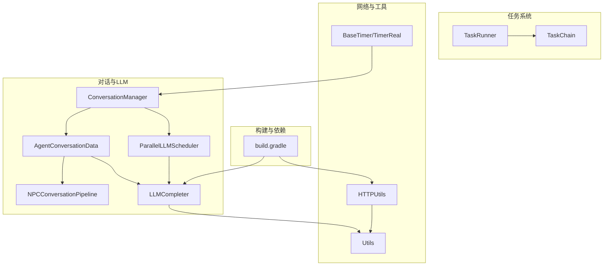
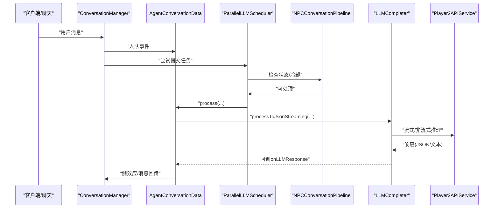
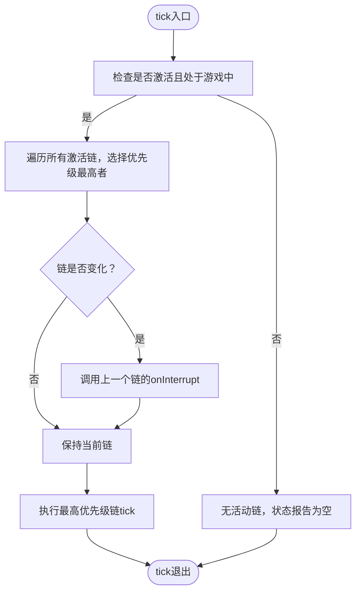
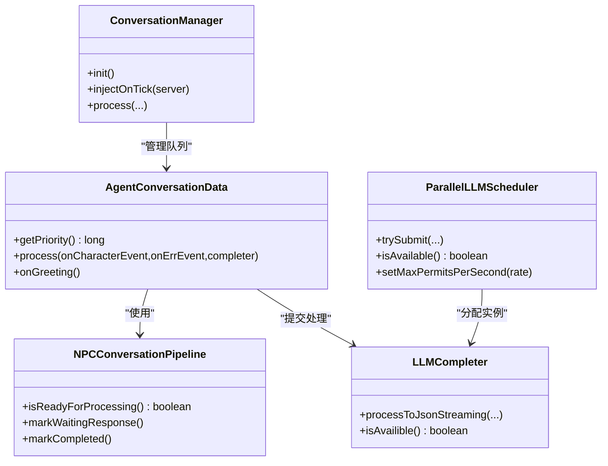
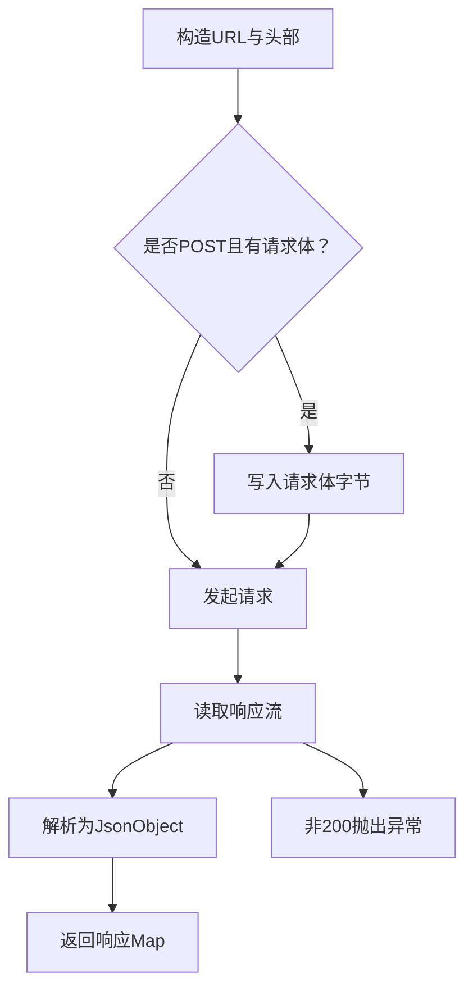
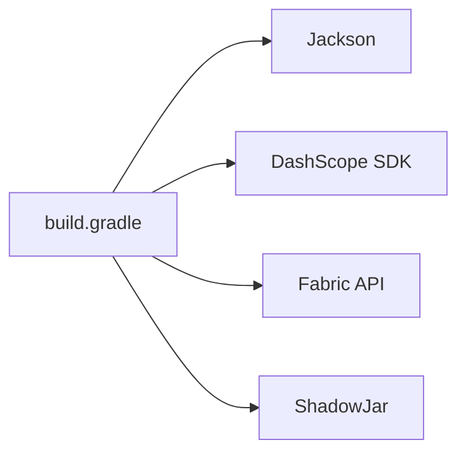

# 性能问题优化

<cite>
**本文引用的文件**
- [build.gradle](file://build.gradle)
- [Debug.java](file://src/main/java/adris/altoclef/Debug.java)
- [TaskRunner.java](file://src/main/java/adris/altoclef/tasksystem/TaskRunner.java)
- [TaskChain.java](file://src/main/java/adris/altoclef/tasksystem/TaskChain.java)
- [HTTPUtils.java](file://src/main/java/adris/altoclef/player2api/utils/HTTPUtils.java)
- [Utils.java](file://src/main/java/adris/altoclef/player2api/utils/Utils.java)
- [ConversationManager.java](file://src/main/java/adris/altoclef/player2api/manager/ConversationManager.java)
- [ParallelLLMScheduler.java](file://src/main/java/adris/altoclef/player2api/ParallelLLMScheduler.java)
- [NPCConversationPipeline.java](file://src/main/java/adris/altoclef/player2api/NPCConversationPipeline.java)
- [AgentConversationData.java](file://src/main/java/adris/altoclef/player2api/AgentConversationData.java)
- [LLMCompleter.java](file://src/main/java/adris/altoclef/player2api/LLMCompleter.java)
- [BaseTimer.java](file://src/main/java/adris/altoclef/util/time/BaseTimer.java)
- [TimerReal.java](file://src/main/java/adris/altoclef/util/time/TimerReal.java)
- [AI_NPC游戏指令系统重构.md](file://docs/AI_NPC游戏指令系统重构.md)
</cite>

## 目录
1. [简介](#简介)
2. [项目结构](#项目结构)
3. [核心组件](#核心组件)
4. [架构总览](#架构总览)
5. [详细组件分析](#详细组件分析)
6. [依赖分析](#依赖分析)
7. [性能考量](#性能考量)
8. [故障排查指南](#故障排查指南)
9. [结论](#结论)
10. [附录](#附录)

## 简介
本指南聚焦于本项目在运行时的性能问题优化，围绕以下方面展开：
- 内存泄漏检测与诊断：内存使用趋势分析、垃圾回收日志解读、对象生命周期跟踪
- CPU 占用异常分析：线程分析、热点函数识别、并发问题检测
- 网络延迟测量与优化：请求响应时间分析、连接池配置、缓存策略
- 任务执行效率优化：任务调度算法改进、并行处理优化、资源利用率提升
- 系统资源监控与调优：JVM 参数调优、操作系统资源分配、硬件性能优化

本指南结合代码中的调度器、对话流水线、任务执行器、网络请求与工具类，给出可操作的优化建议与排障路径。

## 项目结构
项目采用模块化分层组织，核心性能相关模块包括：
- 任务系统：任务链与执行器，负责主循环内的任务优先级与切换
- 对话与 LLM：对话管理、并行调度、流式/非流式 LLM 调用
- 网络与工具：HTTP 请求封装、JSON 解析与清理、计时器工具
- 构建与依赖：Gradle 配置，Jackson、DashScope 等第三方库

**图表来源**
- [TaskRunner.java:1-98](file://src/main/java/adris/altoclef/tasksystem/TaskRunner.java#L1-L98)
- [TaskChain.java:1-51](file://src/main/java/adris/altoclef/tasksystem/TaskChain.java#L1-L51)
- [ConversationManager.java:1-201](file://src/main/java/adris/altoclef/player2api/manager/ConversationManager.java#L1-L201)
- [ParallelLLMScheduler.java:1-188](file://src/main/java/adris/altoclef/player2api/ParallelLLMScheduler.java#L1-L188)
- [NPCConversationPipeline.java:1-194](file://src/main/java/adris/altoclef/player2api/NPCConversationPipeline.java#L1-L194)
- [AgentConversationData.java:1-657](file://src/main/java/adris/altoclef/player2api/AgentConversationData.java#L1-L657)
- [LLMCompleter.java:1-318](file://src/main/java/adris/altoclef/player2api/LLMCompleter.java#L1-L318)
- [HTTPUtils.java:1-88](file://src/main/java/adris/altoclef/player2api/utils/HTTPUtils.java#L1-L88)
- [Utils.java:1-104](file://src/main/java/adris/altoclef/player2api/utils/Utils.java#L1-L104)
- [BaseTimer.java:1-40](file://src/main/java/adris/altoclef/util/time/BaseTimer.java#L1-L40)
- [TimerReal.java:1-13](file://src/main/java/adris/altoclef/util/time/TimerReal.java#L1-L13)
- [build.gradle:1-135](file://build.gradle#L1-L135)

**章节来源**
- [build.gradle:1-135](file://build.gradle#L1-L135)
- [TaskRunner.java:1-98](file://src/main/java/adris/altoclef/tasksystem/TaskRunner.java#L1-L98)
- [TaskChain.java:1-51](file://src/main/java/adris/altoclef/tasksystem/TaskChain.java#L1-L51)
- [ConversationManager.java:1-201](file://src/main/java/adris/altoclef/player2api/manager/ConversationManager.java#L1-L201)
- [ParallelLLMScheduler.java:1-188](file://src/main/java/adris/altoclef/player2api/ParallelLLMScheduler.java#L1-L188)
- [NPCConversationPipeline.java:1-194](file://src/main/java/adris/altoclef/player2api/NPCConversationPipeline.java#L1-L194)
- [AgentConversationData.java:1-657](file://src/main/java/adris/altoclef/player2api/AgentConversationData.java#L1-L657)
- [LLMCompleter.java:1-318](file://src/main/java/adris/altoclef/player2api/LLMCompleter.java#L1-L318)
- [HTTPUtils.java:1-88](file://src/main/java/adris/altoclef/player2api/utils/HTTPUtils.java#L1-L88)
- [Utils.java:1-104](file://src/main/java/adris/altoclef/player2api/utils/Utils.java#L1-L104)
- [BaseTimer.java:1-40](file://src/main/java/adris/altoclef/util/time/BaseTimer.java#L1-L40)
- [TimerReal.java:1-13](file://src/main/java/adris/altoclef/util/time/TimerReal.java#L1-L13)

## 核心组件
- 任务执行器与调度：TaskRunner 负责在主循环中选择最高优先级任务链并驱动其 tick；TaskChain 提供优先级与生命周期管理
- 对话与 LLM：ConversationManager 统一调度，AgentConversationData 负责事件队列与优先级计算，NPCConversationPipeline 提供 Per-NPC 状态机与冷却控制，ParallelLLMScheduler 提供令牌桶限流与多实例并行，LLMCompleter 负责线程内执行与重试
- 网络与工具：HTTPUtils 封装 HTTP 请求与错误处理；Utils 提供 JSON 清洗与解析；BaseTimer/TimerReal 提供时间度量

**章节来源**
- [TaskRunner.java:1-98](file://src/main/java/adris/altoclef/tasksystem/TaskRunner.java#L1-L98)
- [TaskChain.java:1-51](file://src/main/java/adris/altoclef/tasksystem/TaskChain.java#L1-L51)
- [ConversationManager.java:1-201](file://src/main/java/adris/altoclef/player2api/manager/ConversationManager.java#L1-L201)
- [AgentConversationData.java:1-657](file://src/main/java/adris/altoclef/player2api/AgentConversationData.java#L1-L657)
- [NPCConversationPipeline.java:1-194](file://src/main/java/adris/altoclef/player2api/NPCConversationPipeline.java#L1-L194)
- [ParallelLLMScheduler.java:1-188](file://src/main/java/adris/altoclef/player2api/ParallelLLMScheduler.java#L1-L188)
- [LLMCompleter.java:1-318](file://src/main/java/adris/altoclef/player2api/LLMCompleter.java#L1-L318)
- [HTTPUtils.java:1-88](file://src/main/java/adris/altoclef/player2api/utils/HTTPUtils.java#L1-L88)
- [Utils.java:1-104](file://src/main/java/adris/altoclef/player2api/utils/Utils.java#L1-L104)

## 架构总览
下图展示了从用户输入到 LLM 推理再到命令执行的关键路径，以及并行调度与冷却控制如何影响整体吞吐与延迟。

**图表来源**
- [ConversationManager.java:115-190](file://src/main/java/adris/altoclef/player2api/manager/ConversationManager.java#L115-L190)
- [AgentConversationData.java:112-297](file://src/main/java/adris/altoclef/player2api/AgentConversationData.java#L112-L297)
- [ParallelLLMScheduler.java:104-132](file://src/main/java/adris/altoclef/player2api/ParallelLLMScheduler.java#L104-L132)
- [NPCConversationPipeline.java:127-151](file://src/main/java/adris/altoclef/player2api/NPCConversationPipeline.java#L127-L151)
- [LLMCompleter.java:193-303](file://src/main/java/adris/altoclef/player2api/LLMCompleter.java#L193-L303)

## 详细组件分析

### 任务执行器与调度（TaskRunner/TaskChain）
- 任务链优先级：TaskRunner 在每次 tick 中扫描所有激活的任务链，选择优先级最高的链执行；优先级由各任务链内部定义
- 切换与中断：当最高优先级链发生变化时，会触发 onInterrupt，避免长时间占用 CPU
- 主循环节流：仅在游戏状态下活跃，减少不必要的开销

**图表来源**
- [TaskRunner.java:22-58](file://src/main/java/adris/altoclef/tasksystem/TaskRunner.java#L22-L58)
- [TaskChain.java:16-30](file://src/main/java/adris/altoclef/tasksystem/TaskChain.java#L16-L30)

**章节来源**
- [TaskRunner.java:1-98](file://src/main/java/adris/altoclef/tasksystem/TaskRunner.java#L1-L98)
- [TaskChain.java:1-51](file://src/main/java/adris/altoclef/tasksystem/TaskChain.java#L1-L51)

### 对话与 LLM 流水线（ConversationManager/AgentConversationData/NPCConversationPipeline/ParallelLLMScheduler/LLMCompleter）
- 事件队列与优先级：AgentConversationData 使用 nano 时间戳与事件优先级组合生成队列优先级，避免饥饿
- 强制响应与问候：对紧急关键词（救援/攻击/召唤）进行拦截，绕过 LLM 直接响应；问候消息可直接返回角色配置内容
- Per-NPC 管道：NPCConversationPipeline 提供独立的状态机与冷却期，避免全局锁阻塞
- 并行调度与限流：ParallelLLMScheduler 使用令牌桶限流与多实例 LLMCompleter 并发处理，同时保留冷却与超时保护
- 流式与非流式：LLMCompleter 支持流式回调首 token 通知与非流式重试策略，增强用户体验与鲁棒性

**图表来源**
- [ConversationManager.java:59-190](file://src/main/java/adris/altoclef/player2api/manager/ConversationManager.java#L59-L190)
- [AgentConversationData.java:88-297](file://src/main/java/adris/altoclef/player2api/AgentConversationData.java#L88-L297)
- [NPCConversationPipeline.java:127-186](file://src/main/java/adris/altoclef/player2api/NPCConversationPipeline.java#L127-L186)
- [ParallelLLMScheduler.java:104-151](file://src/main/java/adris/altoclef/player2api/ParallelLLMScheduler.java#L104-L151)
- [LLMCompleter.java:193-318](file://src/main/java/adris/altoclef/player2api/LLMCompleter.java#L193-L318)

**章节来源**
- [ConversationManager.java:1-201](file://src/main/java/adris/altoclef/player2api/manager/ConversationManager.java#L1-L201)
- [AgentConversationData.java:1-657](file://src/main/java/adris/altoclef/player2api/AgentConversationData.java#L1-L657)
- [NPCConversationPipeline.java:1-194](file://src/main/java/adris/altoclef/player2api/NPCConversationPipeline.java#L1-L194)
- [ParallelLLMScheduler.java:1-188](file://src/main/java/adris/altoclef/player2api/ParallelLLMScheduler.java#L1-L188)
- [LLMCompleter.java:1-318](file://src/main/java/adris/altoclef/player2api/LLMCompleter.java#L1-L318)

### 网络与工具（HTTPUtils/Utils）
- HTTP 请求：统一设置 Content-Type/ Accept，支持额外头部，POST 时写入请求体，读取响应并解析为 JSON
- 错误处理：对非 200 响应抛出带状态码的异常；错误流读取并包含在异常信息中
- JSON 清洗：从模型返回的非标准 JSON 文本中提取 JSON 对象或降级为纯文本消息

**图表来源**
- [HTTPUtils.java:23-87](file://src/main/java/adris/altoclef/player2api/utils/HTTPUtils.java#L23-L87)
- [Utils.java:61-88](file://src/main/java/adris/altoclef/player2api/utils/Utils.java#L61-L88)

**章节来源**
- [HTTPUtils.java:1-88](file://src/main/java/adris/altoclef/player2api/utils/HTTPUtils.java#L1-L88)
- [Utils.java:1-104](file://src/main/java/adris/altoclef/player2api/utils/Utils.java#L1-L104)

### 计时与监控（BaseTimer/TimerReal）
- 时间度量：BaseTimer 提供基于当前时间的计时器抽象，TimerReal 使用系统毫秒时间；可用于测量关键路径耗时与节拍控制

**章节来源**
- [BaseTimer.java:1-40](file://src/main/java/adris/altoclef/util/time/BaseTimer.java#L1-L40)
- [TimerReal.java:1-13](file://src/main/java/adris/altoclef/util/time/TimerReal.java#L1-L13)

## 依赖分析
- 第三方库：Jackson 用于序列化/反序列化；DashScope SDK 用于语音服务；Fabric API 用于服务端事件集成
- 运行时依赖：Jackson 与 DashScope 通过 shadowJar 打包，避免运行时冲突
- 构建脚本：Gradle 配置 Java 17 工具链与编码，确保跨平台一致性

**图表来源**
- [build.gradle:43-69](file://build.gradle#L43-L69)

**章节来源**
- [build.gradle:1-135](file://build.gradle#L1-L135)

## 性能考量
- 内存与 GC
  - 建议启用 GC 日志，观察 Full GC 频率与停顿时间；关注大对象区（如老年代）增长趋势
  - 对对话历史与事件队列进行容量控制（当前事件队列上限与 Deque 使用有助于降低内存峰值）
  - 避免在高频路径中创建临时字符串与数组，复用对象或使用轻量结构
- CPU 占用
  - 任务链切换与中断需避免在 tick 中执行重型同步操作；将 I/O 与网络调用放入线程池
  - LLM 调用采用单线程执行器，配合令牌桶限流，避免过度并发导致 CPU 抖动
  - 使用计时器测量关键路径耗时，定位热点函数（如 JSON 清洗、命令映射）
- 网络延迟
  - 通过流式首 token 回调提供“正在思考”反馈，改善感知延迟
  - 对 LLM 调用增加指数退避与重试，提高稳定性
  - 评估外部服务（如 DashScope）的可用性与延迟，必要时引入本地缓存或预热
- 任务执行效率
  - 优化任务链优先级计算，减少无效切换
  - 合理设置冷却期与最小响应间隔，避免频繁重复处理
  - 对高优先级任务短时抢占后尽快让渡，保证系统整体吞吐

[本节为通用性能指导，不直接分析具体文件]

## 故障排查指南
- 对话卡死/锁等待
  - 检查 ConversationManager.Lock 与 NPCConversationPipeline 的超时与冷却逻辑，确认锁是否被及时释放
  - 观察 LLMCompleter 是否出现超时（默认 60 秒），必要时调整或增加日志
- LLM 响应异常
  - 查看 LLMCompleter 的重试次数与延迟策略，确认是否达到最大重试
  - 检查 Utils.parseCleanedJson 的解析降级路径是否被触发
- 网络错误
  - HTTPUtils 对非 200 响应抛出异常，包含状态码与错误体；检查外部服务状态与鉴权
- 性能指标
  - 参考文档中的指标表与监控点，定位 STT/命令映射/JSON 解析/命令执行等关键环节的失败率与延迟

**章节来源**
- [ConversationManager.java:30-53](file://src/main/java/adris/altoclef/player2api/manager/ConversationManager.java#L30-L53)
- [NPCConversationPipeline.java:89-105](file://src/main/java/adris/altoclef/player2api/NPCConversationPipeline.java#L89-L105)
- [LLMCompleter.java:20-26](file://src/main/java/adris/altoclef/player2api/LLMCompleter.java#L20-L26)
- [LLMCompleter.java:305-318](file://src/main/java/adris/altoclef/player2api/LLMCompleter.java#L305-L318)
- [Utils.java:61-88](file://src/main/java/adris/altoclef/player2api/utils/Utils.java#L61-L88)
- [HTTPUtils.java:57-87](file://src/main/java/adris/altoclef/player2api/utils/HTTPUtils.java#L57-L87)
- [AI_NPC游戏指令系统重构.md:1388-1415](file://docs/AI_NPC游戏指令系统重构.md#L1388-L1415)

## 结论
本项目在任务调度、对话流水线与网络调用方面已具备良好的并发与容错设计。为进一步提升性能，建议：
- 引入更细粒度的指标埋点与可视化面板，持续监控关键路径延迟与失败率
- 优化事件队列与对话历史的内存占用，结合 GC 日志进行容量与回收策略调优
- 在高负载场景下动态调整并行度与限流参数，平衡吞吐与延迟
- 对热点函数进行剖析与优化，减少不必要的对象分配与同步

[本节为总结性内容，不直接分析具体文件]

## 附录
- 关键类与职责速览
  - TaskRunner/TaskChain：任务优先级与切换
  - ConversationManager/AgentConversationData：事件队列与优先级计算
  - NPCConversationPipeline：Per-NPC 状态机与冷却
  - ParallelLLMScheduler/LLMCompleter：并行与限流、流式/非流式调用
  - HTTPUtils/Utils：网络请求与 JSON 清洗
  - BaseTimer/TimerReal：时间度量

[本节为概览性内容，不直接分析具体文件]