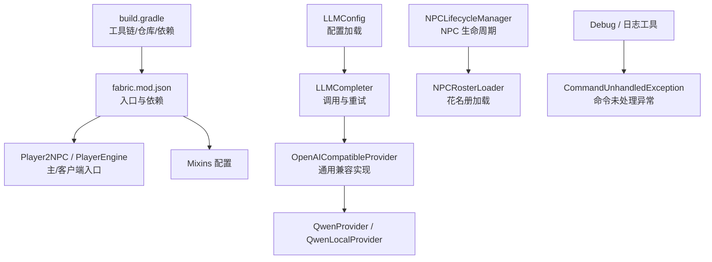
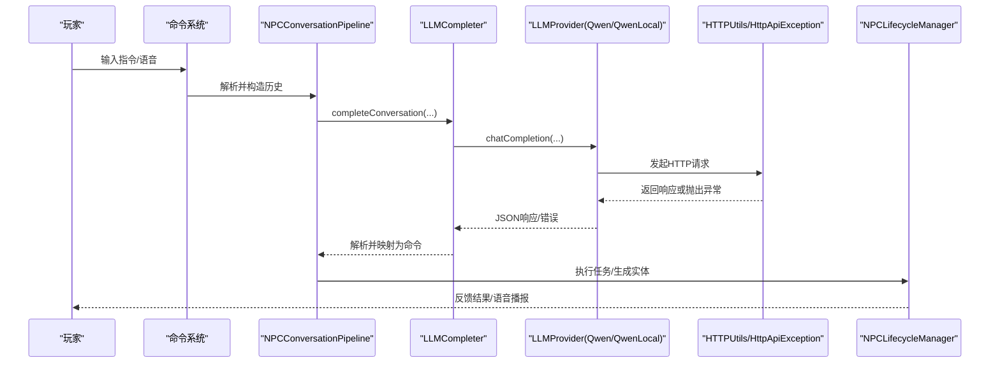
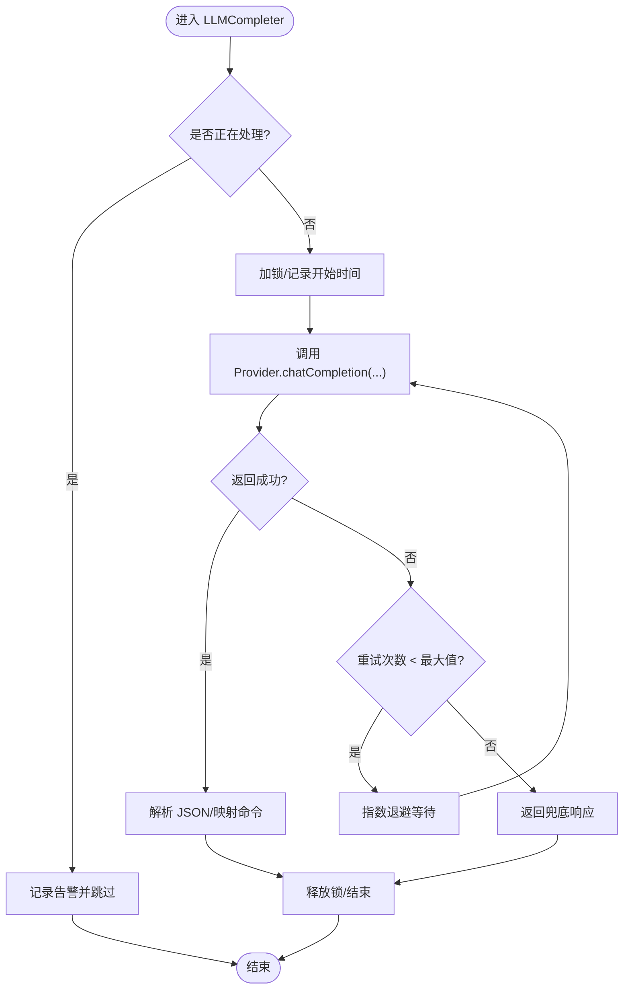
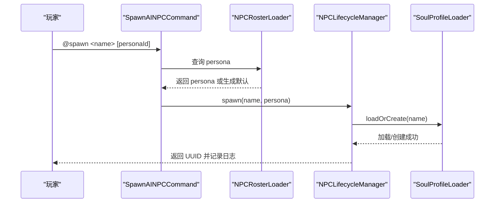
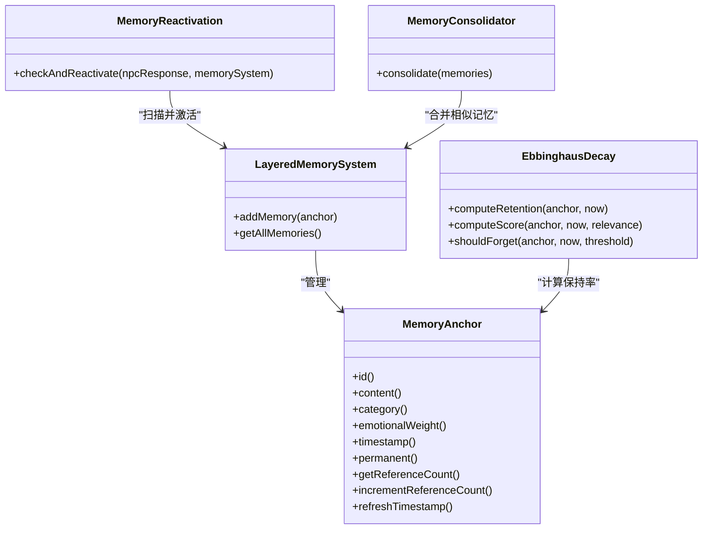
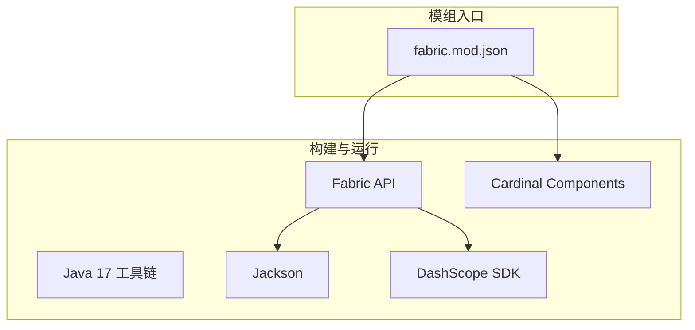

# 故障排查指南

<cite>
**本文引用的文件**   
- [README.md](file://README.md)
- [build.gradle](file://build.gradle)
- [fabric.mod.json](file://src/main/resources/fabric.mod.json)
- [Debug.java](file://src/main/java/adris/altoclef/Debug.java)
- [CommandUnhandledException.java](file://src/main/java/baritone/command/CommandUnhandledException.java)
- [ICommandException.java](file://src/main/java/baritone/api/command/exception/ICommandException.java)
- [CommandException.java](file://src/main/java/adris/altoclef/commandsystem/CommandException.java)
- [SettingsUtil.java](file://src/main/java/baritone/api/utils/SettingsUtil.java)
- [Settings.java](file://src/main/java/baritone/api/Settings.java)
- [HTTPUtils.java](file://src/main/java/adris/altoclef/player2api/utils/HTTPUtils.java)
- [HttpApiException.java](file://src/main/java/adris/altoclef/player2api/utils/HttpApiException.java)
- [LLMCompleter.java](file://src/main/java/adris/altoclef/player2api/LLMCompleter.java)
- [LLMConfig.java](file://src/main/java/adris/altoclef/player2api/llm/LLMConfig.java)
- [OpenAICompatibleProvider.java](file://src/main/java/adris/altoclef/player2api/llm/impl/OpenAICompatibleProvider.java)
- [QwenProvider.java](file://src/main/java/adris/altoclef/player2api/llm/impl/QwenProvider.java)
- [QwenLocalProvider.java](file://src/main/java/adris/altoclef/player2api/llm/impl/QwenLocalProvider.java)
- [STTConfig.java](file://src/main/java/adris/altoclef/player2api/stt/STTConfig.java)
- [NPCLifecycleManager.java](file://src/main/java/adris/altoclef/player2api/NPCLifecycleManager.java)
- [NPCRosterLoader.java](file://src/main/java/adris/altoclef/player2api/NPCRosterLoader.java)
- [SpawnAINPCCommand.java](file://src/main/java/adris/altoclef/commands/SpawnAINPCCommand.java)
- [StructureFromCode.java](file://src/main/java/adris/altoclef/tasks/construction/build_structure/StructureFromCode.java)
- [ProgressCheckerRetry.java](file://src/main/java/adris/altoclef/util/progresscheck/ProgressCheckerRetry.java)
- [EbbinghausDecay.java](file://src/main/java/adris/altoclef/player2api/memory/EbbinghausDecay.java)
- [MemoryReactivation.java](file://src/main/java/adris/altoclef/player2api/memory/MemoryReactivation.java)
- [LayeredMemorySystem.java](file://src/main/java/adris/altoclef/player2api/memory/LayeredMemorySystem.java)
- [MemoryConsolidator.java](file://src/main/java/adris/altoclef/player2api/memory/MemoryConsolidator.java)
- [SoulProfileLoader.java](file://src/main/java/adris/altoclef/player2api/soul/SoulProfileLoader.java)
- [AI_NPC游戏指令系统重构.md](file://docs/AI_NPC游戏指令系统重构.md)
</cite>

## 目录
1. [简介](#简介)
2. [项目结构](#项目结构)
3. [核心组件](#核心组件)
4. [架构总览](#架构总览)
5. [详细组件分析](#详细组件分析)
6. [依赖分析](#依赖分析)
7. [性能考量](#性能考量)
8. [故障排查指南](#故障排查指南)
9. [结论](#结论)
10. [附录](#附录)

## 简介
本指南面向运维与开发人员，聚焦于 PlayerEngine（Minecraft Fabric 模组）在实际运行中可能出现的各类故障，涵盖 Mod 加载失败、NPC 实体生成异常、LLM 调用超时与失败、日志与错误堆栈分析、性能瓶颈识别、配置问题修复、系统集成与兼容性处理，以及预防性维护建议。文档基于仓库源码与配置文件进行归纳总结，提供可操作的诊断步骤与可视化图示。

## 项目结构
- 模组入口与环境声明位于 fabric.mod.json，定义了主/客户端入口点、Mixin 配置与依赖。
- 构建脚本 build.gradle 指定 Java 17 工具链、Maven 仓库与依赖，包含 Jackson、DashScope SDK、Fabric API、Cardinal Components 等。
- 核心业务位于 src/main/java/adris/altoclef 与 src/main/java/baritone，涉及 NPC 生命周期、对话与任务执行、LLM/TTS/STT、配置与日志等模块。
- 配置文件 playerengine-llm.json 通过 LLMConfig 加载，支持多提供商切换与代理设置；NPC 花名册与灵魂配置分别在资源目录中定义。

**图表来源**
- [fabric.mod.json:17-32](file://src/main/resources/fabric.mod.json#L17-L32)
- [build.gradle:9-69](file://build.gradle#L9-L69)
- [LLMConfig.java:19-52](file://src/main/java/adris/altoclef/player2api/llm/LLMConfig.java#L19-L52)
- [LLMCompleter.java:17-97](file://src/main/java/adris/altoclef/player2api/LLMCompleter.java#L17-L97)
- [OpenAICompatibleProvider.java:24-71](file://src/main/java/adris/altoclef/player2api/llm/impl/OpenAICompatibleProvider.java#L24-L71)
- [QwenProvider.java:11-21](file://src/main/java/adris/altoclef/player2api/llm/impl/QwenProvider.java#L11-L21)
- [QwenLocalProvider.java:12-22](file://src/main/java/adris/altoclef/player2api/llm/impl/QwenLocalProvider.java#L12-L22)
- [NPCLifecycleManager.java:65-121](file://src/main/java/adris/altoclef/player2api/NPCLifecycleManager.java#L65-L121)
- [NPCRosterLoader.java:60-85](file://src/main/java/adris/altoclef/player2api/NPCRosterLoader.java#L60-L85)
- [Debug.java:7-102](file://src/main/java/adris/altoclef/Debug.java#L7-L102)
- [CommandUnhandledException.java:7-21](file://src/main/java/baritone/command/CommandUnhandledException.java#L7-L21)

**章节来源**
- [fabric.mod.json:1-48](file://src/main/resources/fabric.mod.json#L1-L48)
- [build.gradle:1-135](file://build.gradle#L1-L135)

## 核心组件
- 日志与错误处理
  - Debug：统一的日志接口，支持内部、警告、错误与堆栈输出，便于快速定位问题。
  - CommandUnhandledException：命令执行未处理异常的统一处理，记录错误堆栈并返回标准错误消息。
  - ICommandException/CommandException：命令异常接口与基础异常封装，便于上层捕获与展示。
- 配置与设置
  - LLMConfig：负责加载 playerengine-llm.json，支持默认模板复制与热重载。
  - SettingsUtil/Settings：Baritone 设置解析与应用，用于调试与参数校验。
- LLM 与网络
  - LLMCompleter：LLM 调用的统一入口，内置超时、重试与流式回调，失败时返回兜底响应。
  - OpenAICompatibleProvider/QwenProvider/QwenLocalProvider：统一 OpenAI 兼容接口，适配多提供商与本地 Ollama。
  - HTTPUtils/HttpApiException：HTTP 请求封装与异常包装，便于区分网络错误与业务错误。
- NPC 生命周期与生成
  - NPCLifecycleManager：NPC 创建、销毁与持久化，记录日志并保存灵魂档案。
  - NPCRosterLoader/SpawnAINPCCommand：花名册加载与 spawn/despawn 指令实现。
- 记忆与情感
  - LayeredMemorySystem/EbbinghausDecay/MemoryReactivation/MemoryConsolidator：记忆分层、遗忘曲线、间接激活与去重合并。
  - SoulProfileLoader：灵魂档案的序列化与持久化。

**章节来源**
- [Debug.java:7-102](file://src/main/java/adris/altoclef/Debug.java#L7-L102)
- [CommandUnhandledException.java:7-21](file://src/main/java/baritone/command/CommandUnhandledException.java#L7-L21)
- [ICommandException.java:6-12](file://src/main/java/baritone/api/command/exception/ICommandException.java#L6-L12)
- [CommandException.java:3-11](file://src/main/java/adris/altoclef/commandsystem/CommandException.java#L3-L11)
- [LLMConfig.java:19-52](file://src/main/java/adris/altoclef/player2api/llm/LLMConfig.java#L19-L52)
- [SettingsUtil.java:70-213](file://src/main/java/baritone/api/utils/SettingsUtil.java#L70-L213)
- [Settings.java:261-326](file://src/main/java/baritone/api/Settings.java#L261-L326)
- [LLMCompleter.java:17-318](file://src/main/java/adris/altoclef/player2api/LLMCompleter.java#L17-L318)
- [OpenAICompatibleProvider.java:24-71](file://src/main/java/adris/altoclef/player2api/llm/impl/OpenAICompatibleProvider.java#L24-L71)
- [QwenProvider.java:11-21](file://src/main/java/adris/altoclef/player2api/llm/impl/QwenProvider.java#L11-L21)
- [QwenLocalProvider.java:12-22](file://src/main/java/adris/altoclef/player2api/llm/impl/QwenLocalProvider.java#L12-L22)
- [HTTPUtils.java:37-69](file://src/main/java/adris/altoclef/player2api/utils/HTTPUtils.java#L37-L69)
- [HttpApiException.java:22-33](file://src/main/java/adris/altoclef/player2api/utils/HttpApiException.java#L22-L33)
- [NPCLifecycleManager.java:65-121](file://src/main/java/adris/altoclef/player2api/NPCLifecycleManager.java#L65-L121)
- [NPCRosterLoader.java:60-85](file://src/main/java/adris/altoclef/player2api/NPCRosterLoader.java#L60-L85)
- [SpawnAINPCCommand.java:32-65](file://src/main/java/adris/altoclef/commands/SpawnAINPCCommand.java#L32-L65)
- [LayeredMemorySystem.java:10-38](file://src/main/java/adris/altoclef/player2api/memory/LayeredMemorySystem.java#L10-L38)
- [EbbinghausDecay.java:9-65](file://src/main/java/adris/altoclef/player2api/memory/EbbinghausDecay.java#L9-L65)
- [MemoryReactivation.java:11-36](file://src/main/java/adris/altoclef/player2api/memory/MemoryReactivation.java#L11-L36)
- [MemoryConsolidator.java:12-40](file://src/main/java/adris/altoclef/player2api/memory/MemoryConsolidator.java#L12-L40)
- [SoulProfileLoader.java:92-107](file://src/main/java/adris/altoclef/player2api/soul/SoulProfileLoader.java#L92-L107)

## 架构总览
下图展示了从用户输入到 NPC 行为执行的关键链路，以及 LLM/TTS/STT 的集成点与错误兜底策略。

**图表来源**
- [LLMCompleter.java:107-176](file://src/main/java/adris/altoclef/player2api/LLMCompleter.java#L107-L176)
- [OpenAICompatibleProvider.java:51-71](file://src/main/java/adris/altoclef/player2api/llm/impl/OpenAICompatibleProvider.java#L51-L71)
- [HTTPUtils.java:37-69](file://src/main/java/adris/altoclef/player2api/utils/HTTPUtils.java#L37-L69)
- [NPCLifecycleManager.java:72-105](file://src/main/java/adris/altoclef/player2api/NPCLifecycleManager.java#L72-L105)

## 详细组件分析

### LLM 调用与超时处理
- 超时与重试：LLMCompleter 设定单次处理最大时长与最大重试次数，流式与非流式均具备重试与兜底响应。
- 流式解析：对首 token 到达进行早期反馈，解析阶段进行 JSON 清洗，失败时返回兜底 JSON。
- 异常传播：网络错误通过 HttpApiException 包装，便于上层区分与降级。

**图表来源**
- [LLMCompleter.java:151-176](file://src/main/java/adris/altoclef/player2api/LLMCompleter.java#L151-L176)
- [LLMCompleter.java:240-303](file://src/main/java/adris/altoclef/player2api/LLMCompleter.java#L240-L303)
- [HTTPUtils.java:57-69](file://src/main/java/adris/altoclef/player2api/utils/HTTPUtils.java#L57-L69)
- [HttpApiException.java:22-33](file://src/main/java/adris/altoclef/player2api/utils/HttpApiException.java#L22-L33)

**章节来源**
- [LLMCompleter.java:17-318](file://src/main/java/adris/altoclef/player2api/LLMCompleter.java#L17-L318)
- [OpenAICompatibleProvider.java:24-71](file://src/main/java/adris/altoclef/player2api/llm/impl/OpenAICompatibleProvider.java#L24-L71)
- [HTTPUtils.java:37-69](file://src/main/java/adris/altoclef/player2api/utils/HTTPUtils.java#L37-L69)
- [HttpApiException.java:22-33](file://src/main/java/adris/altoclef/player2api/utils/HttpApiException.java#L22-L33)

### NPC 实体生成与生命周期
- 生成：SpawnAINPCCommand 通过 NPCRosterLoader 获取 persona，交由 NPCLifecycleManager 创建并初始化对话管线。
- 销毁：despawn 时持久化灵魂档案，记录日志，避免资源泄露。
- 异常：若 persona 不存在或 NPC 未找到，记录警告并返回用户提示。

**图表来源**
- [SpawnAINPCCommand.java:32-47](file://src/main/java/adris/altoclef/commands/SpawnAINPCCommand.java#L32-L47)
- [NPCRosterLoader.java:66-79](file://src/main/java/adris/altoclef/player2api/NPCRosterLoader.java#L66-L79)
- [NPCLifecycleManager.java:72-84](file://src/main/java/adris/altoclef/player2api/NPCLifecycleManager.java#L72-L84)
- [SoulProfileLoader.java:92-107](file://src/main/java/adris/altoclef/player2api/soul/SoulProfileLoader.java#L92-L107)

**章节来源**
- [SpawnAINPCCommand.java:32-65](file://src/main/java/adris/altoclef/commands/SpawnAINPCCommand.java#L32-L65)
- [NPCRosterLoader.java:60-85](file://src/main/java/adris/altoclef/player2api/NPCRosterLoader.java#L60-L85)
- [NPCLifecycleManager.java:65-121](file://src/main/java/adris/altoclef/player2api/NPCLifecycleManager.java#L65-L121)

### 记忆与情感系统
- 分层存储：核心/长期/短期三层，永久记忆直入核心，高情感记忆进入长期，其余进入短期。
- 遗忘曲线：基于艾宾浩斯模型计算保持率，低于阈值视为遗忘。
- 间接激活：LLM 回复中关键词匹配达到阈值时，增强记忆并刷新时间戳。
- 聚类合并：相似记忆按类别聚类，合并冗余，减少碎片化。

**图表来源**
- [LayeredMemorySystem.java:10-38](file://src/main/java/adris/altoclef/player2api/memory/LayeredMemorySystem.java#L10-L38)
- [EbbinghausDecay.java:9-65](file://src/main/java/adris/altoclef/player2api/memory/EbbinghausDecay.java#L9-L65)
- [MemoryReactivation.java:11-36](file://src/main/java/adris/altoclef/player2api/memory/MemoryReactivation.java#L11-L36)
- [MemoryConsolidator.java:12-40](file://src/main/java/adris/altoclef/player2api/memory/MemoryConsolidator.java#L12-L40)

**章节来源**
- [LayeredMemorySystem.java:10-38](file://src/main/java/adris/altoclef/player2api/memory/LayeredMemorySystem.java#L10-L38)
- [EbbinghausDecay.java:9-65](file://src/main/java/adris/altoclef/player2api/memory/EbbinghausDecay.java#L9-L65)
- [MemoryReactivation.java:11-36](file://src/main/java/adris/altoclef/player2api/memory/MemoryReactivation.java#L11-L36)
- [MemoryConsolidator.java:12-40](file://src/main/java/adris/altoclef/player2api/memory/MemoryConsolidator.java#L12-L40)

## 依赖分析
- 构建与运行
  - Java 17 工具链、Fabric Loader/Fabric API、Jackson、DashScope SDK、Cardinal Components。
- 运行时入口
  - fabric.mod.json 声明主/客户端入口与 Mixins，确保模组正确加载。
- 依赖关系示意

**图表来源**
- [build.gradle:43-69](file://build.gradle#L43-L69)
- [fabric.mod.json:33-46](file://src/main/resources/fabric.mod.json#L33-L46)

**章节来源**
- [build.gradle:43-69](file://build.gradle#L43-L69)
- [fabric.mod.json:33-46](file://src/main/resources/fabric.mod.json#L33-L46)

## 性能考量
- CPU 占用
  - 大量 NPC 同时运行会显著增加 CPU 压力，建议控制活跃 NPC 数量在合理区间。
  - 记忆系统涉及并发集合与周期性整理，注意避免高频写入导致锁竞争。
- 内存与 GC
  - 记忆锚点与情感状态对象较多，建议定期检查内存占用，必要时清理不重要记忆。
  - LLM 流式解析与 JSON 清洗会产生中间字符串，注意避免频繁 Full GC。
- 网络延迟
  - LLM 与 TTS/STT 依赖外部服务，建议启用代理（如国内访问 OpenAI）并监控响应时间。
  - 可通过指标监控（见附录）观察端到端延迟与中断率，及时调整模型与参数。

[本节为通用性能指导，不直接分析特定文件]

## 故障排查指南

### 一、Mod 加载失败
- 症状特征
  - 启动时报错“Unsupported class file major version”或“无效的类文件版本”。
  - 无法找到 ./gradlew 或权限不足。
- 根因分析
  - Java 版本不匹配（必须使用 Java 17）。
  - 权限问题导致脚本不可执行。
- 诊断步骤
  - 确认 JAVA_HOME 指向 Java 17。
  - Linux/Mac 用户执行 chmod +x gradlew。
  - 清理缓存并重新构建：./gradlew clean build。
- 预防措施
  - 固定 CI/本地开发环境为 Java 17。
  - 在 README 的构建步骤中补充权限说明。

**章节来源**
- [README.md:55-63](file://README.md#L55-L63)
- [build.gradle:9-9](file://build.gradle#L9-L9)

### 二、NPC 实体生成异常
- 症状特征
  - @spawn 无响应或报错“Persona ID 未找到”。
  - @despawn 无法找到指定 NPC。
- 根因分析
  - 花名册加载失败或 personaId 不匹配。
  - NPC 已销毁或 UUID 不一致。
- 诊断步骤
  - 检查 npc-roster.json 中是否存在目标 personaId。
  - 使用 @npcls 查看当前活跃 NPC 列表。
  - 查看日志中 NPCLifecycleManager 的 spawn/despawn 记录。
- 修复方法
  - 修正 personaId 或留空以自动生成默认 persona。
  - 确保使用正确的 NPC 名称进行 despawn。
  - 若持久化异常，检查 SoulProfileLoader 的保存流程。

**章节来源**
- [SpawnAINPCCommand.java:32-47](file://src/main/java/adris/altoclef/commands/SpawnAINPCCommand.java#L32-L47)
- [NPCRosterLoader.java:66-79](file://src/main/java/adris/altoclef/player2api/NPCRosterLoader.java#L66-L79)
- [NPCLifecycleManager.java:92-105](file://src/main/java/adris/altoclef/player2api/NPCLifecycleManager.java#L92-L105)

### 三、LLM 调用超时与失败
- 症状特征
  - LLMCompleter 报告超时或重试耗尽，最终返回兜底响应。
  - 流式解析失败，日志出现 JSON 清洗错误。
- 根因分析
  - 网络不稳定或上游服务不可用。
  - 请求参数超出限制或代理配置错误。
- 诊断步骤
  - 查看 LLMCompleter 的日志，确认是否触发重试与兜底。
  - 检查 LLMConfig 中 activeProvider 与 apiUrl、apiKey、model、maxTokens、temperature。
  - 使用 HTTPUtils 的异常包装，区分网络错误与业务错误。
- 修复方法
  - 调整超时与重试策略（谨慎修改源码）。
  - 校正 provider 配置，必要时启用代理。
  - 降低 maxTokens 或调整 temperature 以提高稳定性。

**章节来源**
- [LLMCompleter.java:151-176](file://src/main/java/adris/altoclef/player2api/LLMCompleter.java#L151-L176)
- [LLMCompleter.java:240-303](file://src/main/java/adris/altoclef/player2api/LLMCompleter.java#L240-L303)
- [LLMConfig.java:19-52](file://src/main/java/adris/altoclef/player2api/llm/LLMConfig.java#L19-L52)
- [OpenAICompatibleProvider.java:51-71](file://src/main/java/adris/altoclef/player2api/llm/impl/OpenAICompatibleProvider.java#L51-L71)
- [HTTPUtils.java:57-69](file://src/main/java/adris/altoclef/player2api/utils/HTTPUtils.java#L57-L69)

### 四、日志与错误堆栈分析
- 日志级别
  - Debug 提供内部、警告、错误与堆栈输出，便于快速定位。
  - 命令未处理异常通过 CommandUnhandledException 记录堆栈并返回错误消息。
- 堆栈解读技巧
  - 优先查看 LLMCompleter/processToJson/processToJsonStreaming 的调用链。
  - 关注 HTTPUtils 的错误响应与 HttpApiException 的状态码。
  - 在 NPCLifecycleManager 的 spawn/despawn 日志中核对 UUID 与名称一致性。
- 关键异常处理流程
  - 命令异常：ICommandException.handle 输出红色文本；CommandUnhandledException 记录堆栈。
  - 配置异常：SettingsUtil 解析失败抛出类型不匹配异常，需检查配置项类型。

**章节来源**
- [Debug.java:7-102](file://src/main/java/adris/altoclef/Debug.java#L7-L102)
- [CommandUnhandledException.java:7-21](file://src/main/java/baritone/command/CommandUnhandledException.java#L7-L21)
- [ICommandException.java:6-12](file://src/main/java/baritone/api/command/exception/ICommandException.java#L6-L12)
- [SettingsUtil.java:70-90](file://src/main/java/baritone/api/utils/SettingsUtil.java#L70-L90)

### 五、性能问题排查
- 内存泄漏检测
  - 检查 LayeredMemorySystem 的并发集合使用情况，避免长时间持有大量 MemoryAnchor。
  - 关注 MemoryConsolidator 的合并频率，防止碎片化导致内存增长。
- CPU 占用异常
  - 控制活跃 NPC 数量，避免过多并发任务。
  - 降低 LLM 的 maxTokens 与 temperature，减少解析与生成开销。
- 网络延迟测量
  - 结合指标监控（见附录）统计平均响应延迟与中断率，定位瓶颈。
  - 为 OpenAI 等服务配置代理，改善网络质量。

**章节来源**
- [LayeredMemorySystem.java:10-38](file://src/main/java/adris/altoclef/player2api/memory/LayeredMemorySystem.java#L10-L38)
- [MemoryConsolidator.java:12-40](file://src/main/java/adris/altoclef/player2api/memory/MemoryConsolidator.java#L12-L40)
- [AI_NPC游戏指令系统重构.md:1388-1415](file://docs/AI_NPC游戏指令系统重构.md#L1388-L1415)

### 六、配置问题修复
- API Key 配置错误
  - 确认 playerengine-llm.json 中 activeProvider 对应的 apiKey 已正确填写。
  - 若使用阿里云 Qwen，确保 dashscope-sdk-java 依赖可用。
- 网络连接问题
  - 检查 apiUrl 与代理设置；国内访问 OpenAI 需启用代理。
  - 使用 HTTPUtils 的异常状态码判断网络错误类型。
- 权限设置不当
  - 确认 Fabric API 与 Cardinal Components 的依赖版本与环境满足。
  - 检查 fabric.mod.json 的 entrypoints 与 Mixins 配置是否正确。

**章节来源**
- [LLMConfig.java:19-52](file://src/main/java/adris/altoclef/player2api/llm/LLMConfig.java#L19-L52)
- [STTConfig.java:61-77](file://src/main/java/adris/altoclef/player2api/stt/STTConfig.java#L61-L77)
- [OpenAICompatibleProvider.java:51-71](file://src/main/java/adris/altoclef/player2api/llm/impl/OpenAICompatibleProvider.java#L51-L71)
- [build.gradle:43-69](file://build.gradle#L43-L69)
- [fabric.mod.json:17-32](file://src/main/resources/fabric.mod.json#L17-L32)

### 七、系统集成与兼容性
- 与其他 Mod 的冲突
  - 检查 fabric.mod.json 的 depends 与 custom cardinal-components 注册，避免重复或缺失。
  - 若出现实体/组件冲突，优先核对 Cardinal Components 的版本与注册顺序。
- 版本兼容性
  - 确保 Minecraft 1.20.1、Fabric Loader 与 Fabric API 版本与构建脚本一致。
  - LLM 提供商的 API 变更需同步更新 Provider 实现与默认模型。
- 依赖库版本不匹配
  - 使用 Gradle 的依赖解析与 shadowJar 配置，避免运行时类冲突。
  - 定期更新 Jackson 与 DashScope SDK 至稳定版本。

**章节来源**
- [fabric.mod.json:33-46](file://src/main/resources/fabric.mod.json#L33-L46)
- [build.gradle:43-69](file://build.gradle#L43-L69)

### 八、预防性维护
- 定期检查要点
  - 检查 playerengine-llm.json 的热重载与 provider 切换。
  - 审视记忆系统容量与去重策略，避免长期运行后性能下降。
- 潜在风险识别
  - LLM 超时与重试上限、流式解析失败、HTTP 状态码异常。
  - NPC 生命周期持久化失败导致的数据丢失。
- 系统健康度评估
  - 基于指标监控（指令识别准确率、命令映射准确率、端到端成功率、平均响应延迟、中断率、锁等待时间）进行量化评估。

**章节来源**
- [AI_NPC游戏指令系统重构.md:1388-1415](file://docs/AI_NPC游戏指令系统重构.md#L1388-L1415)
- [SoulProfileLoader.java:92-107](file://src/main/java/adris/altoclef/player2api/soul/SoulProfileLoader.java#L92-L107)

## 结论
通过日志与异常体系、配置加载与 Provider 抽象、NPC 生命周期管理与记忆系统，以及指标监控与重试兜底策略，本项目形成了较为完善的故障诊断与恢复能力。建议在生产环境中结合指标监控与定期巡检，持续优化 LLM 参数与 NPC 数量，确保系统稳定运行。

## 附录
- 指标监控与日志采样点（摘自文档）
  - 指标：指令识别准确率、命令映射准确率、JSON解析成功率、命令执行成功率、端到端成功率、平均响应延迟、中断率、锁等待时间。
  - 日志：STT 结果、LLM 命令映射、JSON 解析、命令执行、任务中断等。

**章节来源**
- [AI_NPC游戏指令系统重构.md:1388-1415](file://docs/AI_NPC游戏指令系统重构.md#L1388-L1415)