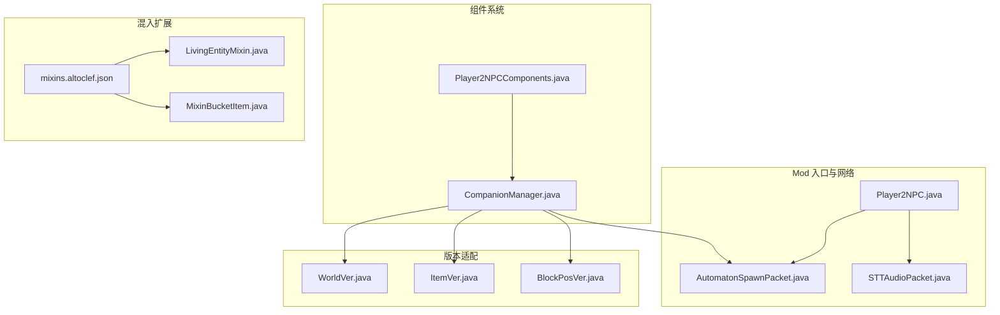
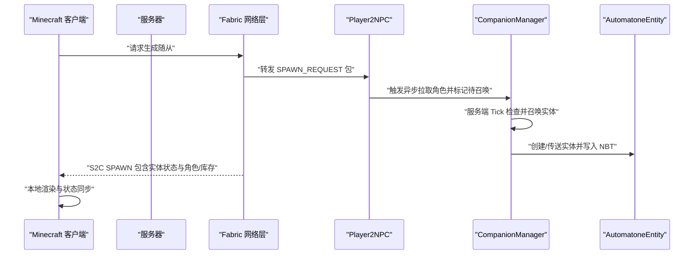
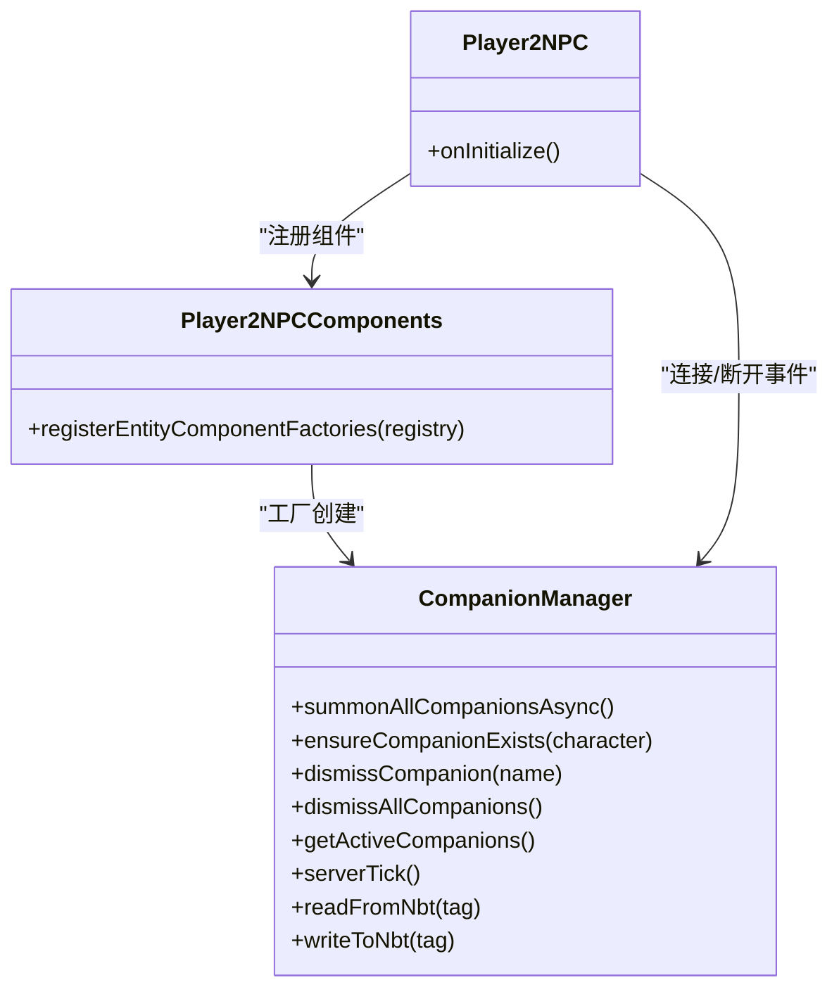
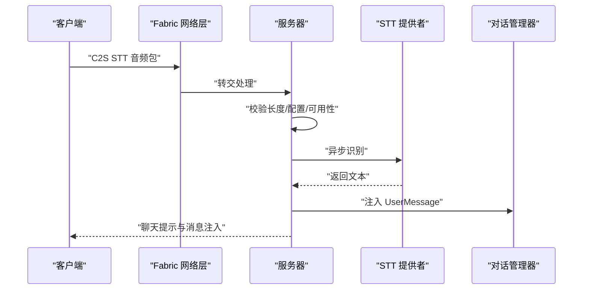
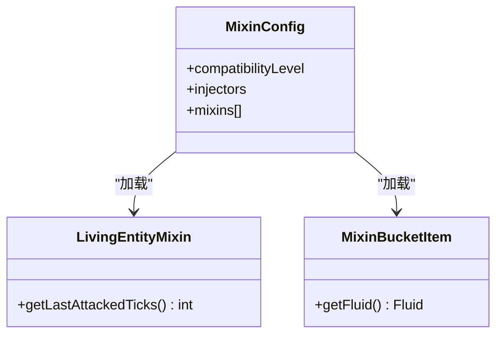
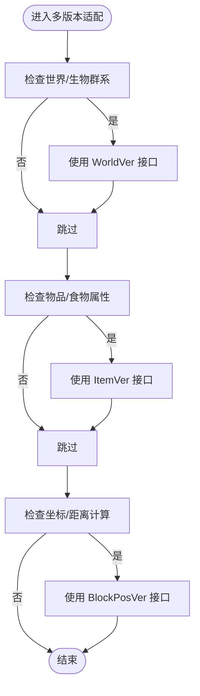
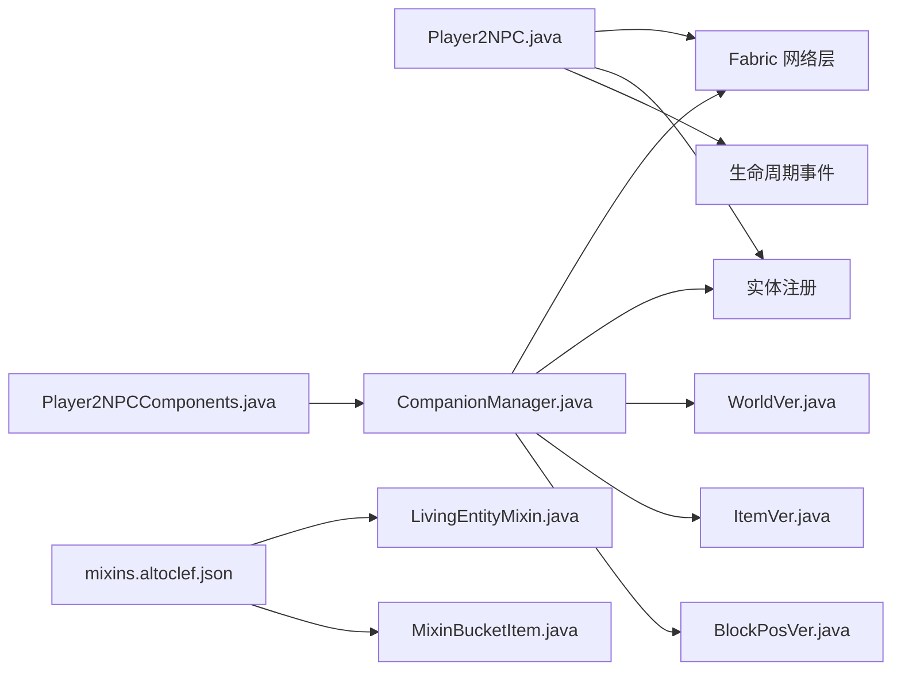

# 系统集成问题

<cite>
**本文引用的文件**
- [fabric.mod.json](file://src/main/resources/fabric.mod.json)
- [mixins.altoclef.json](file://src/main/resources/mixins.altoclef.json)
- [build.gradle](file://build.gradle)
- [gradle.properties](file://gradle.properties)
- [Player2NPC.java](file://src/main/java/com/goodbird/player2npc/Player2NPC.java)
- [Player2NPCComponents.java](file://src/main/java/com/goodbird/player2npc/Player2NPCComponents.java)
- [AutomatonSpawnPacket.java](file://src/main/java/com/goodbird/player2npc/network/AutomatonSpawnPacket.java)
- [STTAudioPacket.java](file://src/main/java/com/goodbird/player2npc/network/STTAudioPacket.java)
- [CompanionManager.java](file://src/main/java/com/goodbird/player2npc/companion/CompanionManager.java)
- [LivingEntityMixin.java](file://src/main/java/adris/altoclef/mixins/LivingEntityMixin.java)
- [MixinBucketItem.java](file://src/main/java/adris/altoclef/mixins/baritone/MixinBucketItem.java)
- [WorldVer.java](file://src/main/java/adris/altoclef/multiversion/world/WorldVer.java)
- [ItemVer.java](file://src/main/java/adris/altoclef/multiversion/item/ItemVer.java)
- [BlockPosVer.java](file://src/main/java/adris/altoclef/multiversion/blockpos/BlockPosVer.java)
</cite>

## 目录
1. [引言](#引言)
2. [项目结构](#项目结构)
3. [核心组件](#核心组件)
4. [架构总览](#架构总览)
5. [详细组件分析](#详细组件分析)
6. [依赖关系分析](#依赖关系分析)
7. [性能考量](#性能考量)
8. [故障排除指南](#故障排除指南)
9. [结论](#结论)
10. [附录](#附录)

## 引言
本指南聚焦于系统集成中的冲突与兼容性问题，围绕以下主题提供可操作的诊断与修复策略：
- 与其他 Mod 的冲突：依赖冲突检测、版本兼容性验证、功能重叠处理
- 版本兼容性：Minecraft 版本适配、Fabric API 版本匹配、依赖库版本冲突
- 网络通信：协议版本不匹配、数据格式不兼容、连接状态异常
- 实体组件系统：组件注册冲突、生命周期管理、状态同步
- 混入（Mixin）系统：应用失败、目标类缺失、方法签名不匹配

文档以仓库现有实现为依据，结合配置与源码进行系统化梳理，并给出可视化图示帮助定位问题。

## 项目结构
该项目采用 Fabric 生态的模块化组织方式，核心由三部分构成：
- Mod 入口与网络层：负责实体类型注册、全局网络包接收、生命周期事件绑定
- 组件系统：基于 Cardinal Components API（CCA）在实体上挂载“随从管理器”组件
- 混入扩展：通过 Mixin 对底层类进行访问器与行为增强，覆盖路径规划、世界/物品多版本适配

图表来源
- [Player2NPC.java:48-66](file://src/main/java/com/goodbird/player2npc/Player2NPC.java#L48-L66)
- [Player2NPCComponents.java:10-16](file://src/main/java/com/goodbird/player2npc/Player2NPCComponents.java#L10-L16)
- [CompanionManager.java:28-191](file://src/main/java/com/goodbird/player2npc/companion/CompanionManager.java#L28-L191)
- [AutomatonSpawnPacket.java:26-120](file://src/main/java/com/goodbird/player2npc/network/AutomatonSpawnPacket.java#L26-L120)
- [STTAudioPacket.java:28-134](file://src/main/java/com/goodbird/player2npc/network/STTAudioPacket.java#L28-L134)
- [LivingEntityMixin.java:1-12](file://src/main/java/adris/altoclef/mixins/LivingEntityMixin.java#L1-L12)
- [MixinBucketItem.java:1-21](file://src/main/java/adris/altoclef/mixins/baritone/MixinBucketItem.java#L1-L21)
- [mixins.altoclef.json:1-33](file://src/main/resources/mixins.altoclef.json#L1-L33)
- [WorldVer.java:1-31](file://src/main/java/adris/altoclef/multiversion/world/WorldVer.java#L1-L31)
- [ItemVer.java:1-38](file://src/main/java/adris/altoclef/multiversion/item/ItemVer.java#L1-L38)
- [BlockPosVer.java:1-16](file://src/main/java/adris/altoclef/multiversion/blockpos/BlockPosVer.java#L1-L16)

章节来源
- [fabric.mod.json:17-46](file://src/main/resources/fabric.mod.json#L17-L46)
- [mixins.altoclef.json:1-33](file://src/main/resources/mixins.altoclef.json#L1-L33)
- [build.gradle:43-69](file://build.gradle#L43-L69)
- [gradle.properties:26-31](file://gradle.properties#L26-L31)

## 核心组件
- Mod 初始化与网络注册
  - 注册实体类型、全局网络包接收器、服务器连接/断开事件、服务端 tick 回调
  - 参考路径：[Player2NPC.java:48-66](file://src/main/java/com/goodbird/player2npc/Player2NPC.java#L48-L66)
- 组件系统（随从管理）
  - 使用 CCA 在玩家实体上注册“随从管理器”组件，支持异步拉取角色、召唤/解散实体、跨世界查找与状态持久化
  - 参考路径：[Player2NPCComponents.java:10-16](file://src/main/java/com/goodbird/player2npc/Player2NPCComponents.java#L10-L16)、[CompanionManager.java:28-191](file://src/main/java/com/goodbird/player2npc/companion/CompanionManager.java#L28-L191)
- 网络包
  - S2C 实体生成包：包含实体位置、速度、朝向、角色与库存信息
  - C2S 语音识别包：客户端发送音频，服务端异步识别并注入对话系统
  - 参考路径：[AutomatonSpawnPacket.java:26-120](file://src/main/java/com/goodbird/player2npc/network/AutomatonSpawnPacket.java#L26-L120)、[STTAudioPacket.java:28-134](file://src/main/java/com/goodbird/player2npc/network/STTAudioPacket.java#L28-L134)
- 混入扩展
  - 访问器接口与行为增强，覆盖路径规划、实体属性访问、世界/物品多版本差异
  - 参考路径：[LivingEntityMixin.java:1-12](file://src/main/java/adris/altoclef/mixins/LivingEntityMixin.java#L1-L12)、[MixinBucketItem.java:1-21](file://src/main/java/adris/altoclef/mixins/baritone/MixinBucketItem.java#L1-L21)、[mixins.altoclef.json:10-33](file://src/main/resources/mixins.altoclef.json#L10-L33)

章节来源
- [Player2NPC.java:48-66](file://src/main/java/com/goodbird/player2npc/Player2NPC.java#L48-L66)
- [Player2NPCComponents.java:10-16](file://src/main/java/com/goodbird/player2npc/Player2NPCComponents.java#L10-L16)
- [CompanionManager.java:28-191](file://src/main/java/com/goodbird/player2npc/companion/CompanionManager.java#L28-L191)
- [AutomatonSpawnPacket.java:26-120](file://src/main/java/com/goodbird/player2npc/network/AutomatonSpawnPacket.java#L26-L120)
- [STTAudioPacket.java:28-134](file://src/main/java/com/goodbird/player2npc/network/STTAudioPacket.java#L28-L134)
- [LivingEntityMixin.java:1-12](file://src/main/java/adris/altoclef/mixins/LivingEntityMixin.java#L1-L12)
- [MixinBucketItem.java:1-21](file://src/main/java/adris/altoclef/mixins/baritone/MixinBucketItem.java#L1-L21)
- [mixins.altoclef.json:10-33](file://src/main/resources/mixins.altoclef.json#L10-L33)

## 架构总览
下图展示 Mod 初始化、网络通信、组件系统与混入扩展之间的交互关系。

图表来源
- [Player2NPC.java:48-66](file://src/main/java/com/goodbird/player2npc/Player2NPC.java#L48-L66)
- [CompanionManager.java:45-98](file://src/main/java/com/goodbird/player2npc/companion/CompanionManager.java#L45-L98)
- [AutomatonSpawnPacket.java:70-120](file://src/main/java/com/goodbird/player2npc/network/AutomatonSpawnPacket.java#L70-L120)

## 详细组件分析

### 组件注册与生命周期（组件系统）
- 组件注册
  - 通过 CCA 在实体上注册组件键值，绑定玩家实体与随从管理器工厂
  - 参考路径：[Player2NPCComponents.java:12-15](file://src/main/java/com/goodbird/player2npc/Player2NPCComponents.java#L12-L15)
- 生命周期管理
  - 连接建立时异步拉取角色并标记待召唤；断开时解散所有随从
  - 服务端每 tick 检查并执行召唤流程
  - 参考路径：[Player2NPC.java:56-64](file://src/main/java/com/goodbird/player2npc/Player2NPC.java#L56-L64)、[CompanionManager.java:169-175](file://src/main/java/com/goodbird/player2npc/companion/CompanionManager.java#L169-L175)
- 状态同步与持久化
  - 将随从映射写入/读取 NBT，确保重启后状态恢复
  - 参考路径：[CompanionManager.java:177-190](file://src/main/java/com/goodbird/player2npc/companion/CompanionManager.java#L177-L190)

图表来源
- [Player2NPCComponents.java:10-16](file://src/main/java/com/goodbird/player2npc/Player2NPCComponents.java#L10-L16)
- [CompanionManager.java:28-191](file://src/main/java/com/goodbird/player2npc/companion/CompanionManager.java#L28-L191)
- [Player2NPC.java:48-66](file://src/main/java/com/goodbird/player2npc/Player2NPC.java#L48-L66)

章节来源
- [Player2NPCComponents.java:10-16](file://src/main/java/com/goodbird/player2npc/Player2NPCComponents.java#L10-L16)
- [CompanionManager.java:28-191](file://src/main/java/com/goodbird/player2npc/companion/CompanionManager.java#L28-L191)
- [Player2NPC.java:48-66](file://src/main/java/com/goodbird/player2npc/Player2NPC.java#L48-L66)

### 网络通信（协议与数据格式）
- 协议与包 ID
  - 定义 SPAWN、SPAWN_REQUEST、DESPAWN_REQUEST、STT_AUDIO 的资源定位符
  - 参考路径：[Player2NPC.java:29-36](file://src/main/java/com/goodbird/player2npc/Player2NPC.java#L29-L36)
- S2C 实体生成包
  - 字段包含实体 ID/UUID、位置/速度、朝向、角色与库存
  - 参考路径：[AutomatonSpawnPacket.java:33-68](file://src/main/java/com/goodbird/player2npc/network/AutomatonSpawnPacket.java#L33-L68)
- C2S 语音识别包
  - 格式：语言字符串 + 音频长度 + 音频字节流
  - 服务端异步识别，成功后注入对话系统
  - 参考路径：[STTAudioPacket.java:19-27](file://src/main/java/com/goodbird/player2npc/network/STTAudioPacket.java#L19-L27)、[STTAudioPacket.java:39-121](file://src/main/java/com/goodbird/player2npc/network/STTAudioPacket.java#L39-L121)

图表来源
- [STTAudioPacket.java:39-121](file://src/main/java/com/goodbird/player2npc/network/STTAudioPacket.java#L39-L121)

章节来源
- [Player2NPC.java:29-36](file://src/main/java/com/goodbird/player2npc/Player2NPC.java#L29-L36)
- [AutomatonSpawnPacket.java:33-98](file://src/main/java/com/goodbird/player2npc/network/AutomatonSpawnPacket.java#L33-L98)
- [STTAudioPacket.java:19-27](file://src/main/java/com/goodbird/player2npc/network/STTAudioPacket.java#L19-L27)

### 混入系统（Mixin）调试要点
- 目标类与签名
  - 访问器接口用于安全访问内部字段（如攻击计时器），避免直接反射
  - 行为增强通过 Mixin 接口实现（如桶装流体访问器）
  - 参考路径：[LivingEntityMixin.java:8-11](file://src/main/java/adris/altoclef/mixins/LivingEntityMixin.java#L8-L11)、[MixinBucketItem.java:10-20](file://src/main/java/adris/altoclef/mixins/baritone/MixinBucketItem.java#L10-L20)
- 配置与加载
  - Mixin 配置声明了兼容级别、注入器参数、混入列表与 refmap
  - 参考路径：[mixins.altoclef.json:2-9](file://src/main/resources/mixins.altoclef.json#L2-L9)、[mixins.altoclef.json:12-32](file://src/main/resources/mixins.altoclef.json#L12-L32)

图表来源
- [LivingEntityMixin.java:8-11](file://src/main/java/adris/altoclef/mixins/LivingEntityMixin.java#L8-L11)
- [MixinBucketItem.java:10-20](file://src/main/java/adris/altoclef/mixins/baritone/MixinBucketItem.java#L10-L20)
- [mixins.altoclef.json:2-9](file://src/main/resources/mixins.altoclef.json#L2-L9)

章节来源
- [LivingEntityMixin.java:1-12](file://src/main/java/adris/altoclef/mixins/LivingEntityMixin.java#L1-L12)
- [MixinBucketItem.java:1-21](file://src/main/java/adris/altoclef/mixins/baritone/MixinBucketItem.java#L1-L21)
- [mixins.altoclef.json:1-33](file://src/main/resources/mixins.altoclef.json#L1-L33)

### 多版本适配（版本兼容性）
- 世界/区块坐标
  - 提供生物群系判断、高度限制与坐标截断等多版本差异封装
  - 参考路径：[WorldVer.java:10-29](file://src/main/java/adris/altoclef/multiversion/world/WorldVer.java#L10-L29)
- 物品/食物
  - 统一食物属性访问与名称判断，屏蔽版本差异
  - 参考路径：[ItemVer.java:10-24](file://src/main/java/adris/altoclef/multiversion/item/ItemVer.java#L10-L24)
- 坐标工具
  - 提供浮点到整数转换与距离计算的统一入口
  - 参考路径：[BlockPosVer.java:8-14](file://src/main/java/adris/altoclef/multiversion/blockpos/BlockPosVer.java#L8-L14)

图表来源
- [WorldVer.java:10-29](file://src/main/java/adris/altoclef/multiversion/world/WorldVer.java#L10-L29)
- [ItemVer.java:10-24](file://src/main/java/adris/altoclef/multiversion/item/ItemVer.java#L10-L24)
- [BlockPosVer.java:8-14](file://src/main/java/adris/altoclef/multiversion/blockpos/BlockPosVer.java#L8-L14)

章节来源
- [WorldVer.java:1-31](file://src/main/java/adris/altoclef/multiversion/world/WorldVer.java#L1-L31)
- [ItemVer.java:1-38](file://src/main/java/adris/altoclef/multiversion/item/ItemVer.java#L1-L38)
- [BlockPosVer.java:1-16](file://src/main/java/adris/altoclef/multiversion/blockpos/BlockPosVer.java#L1-L16)

## 依赖关系分析
- Mod 入口与网络
  - 通过 Fabric API 注册实体类型、网络包与生命周期事件
  - 参考路径：[Player2NPC.java:48-66](file://src/main/java/com/goodbird/player2npc/Player2NPC.java#L48-L66)
- 组件系统
  - 通过 CCA 注册实体组件，实现随从管理器的生命周期与状态持久化
  - 参考路径：[Player2NPCComponents.java:12-15](file://src/main/java/com/goodbird/player2npc/Player2NPCComponents.java#L12-L15)、[CompanionManager.java:169-190](file://src/main/java/com/goodbird/player2npc/companion/CompanionManager.java#L169-L190)
- 混入与版本适配
  - Mixin 配置与访问器接口保证对底层类的安全访问；多版本适配类隔离差异
  - 参考路径：[mixins.altoclef.json:10-33](file://src/main/resources/mixins.altoclef.json#L10-L33)、[LivingEntityMixin.java:8-11](file://src/main/java/adris/altoclef/mixins/LivingEntityMixin.java#L8-L11)

图表来源
- [Player2NPC.java:48-66](file://src/main/java/com/goodbird/player2npc/Player2NPC.java#L48-L66)
- [Player2NPCComponents.java:12-15](file://src/main/java/com/goodbird/player2npc/Player2NPCComponents.java#L12-L15)
- [CompanionManager.java:28-191](file://src/main/java/com/goodbird/player2npc/companion/CompanionManager.java#L28-L191)
- [mixins.altoclef.json:10-33](file://src/main/resources/mixins.altoclef.json#L10-L33)
- [LivingEntityMixin.java:8-11](file://src/main/java/adris/altoclef/mixins/LivingEntityMixin.java#L8-L11)
- [MixinBucketItem.java:10-20](file://src/main/java/adris/altoclef/mixins/baritone/MixinBucketItem.java#L10-L20)
- [WorldVer.java:10-29](file://src/main/java/adris/altoclef/multiversion/world/WorldVer.java#L10-L29)
- [ItemVer.java:10-24](file://src/main/java/adris/altoclef/multiversion/item/ItemVer.java#L10-L24)
- [BlockPosVer.java:8-14](file://src/main/java/adris/altoclef/multiversion/blockpos/BlockPosVer.java#L8-L14)

章节来源
- [Player2NPC.java:48-66](file://src/main/java/com/goodbird/player2npc/Player2NPC.java#L48-L66)
- [Player2NPCComponents.java:12-15](file://src/main/java/com/goodbird/player2npc/Player2NPCComponents.java#L12-L15)
- [CompanionManager.java:28-191](file://src/main/java/com/goodbird/player2npc/companion/CompanionManager.java#L28-L191)
- [mixins.altoclef.json:10-33](file://src/main/resources/mixins.altoclef.json#L10-L33)

## 性能考量
- 网络与线程
  - STT 识别在后台线程执行，避免阻塞服务器主线程；完成后通过 server.execute 切回主线程注入消息
  - 参考路径：[STTAudioPacket.java:66-121](file://src/main/java/com/goodbird/player2npc/network/STTAudioPacket.java#L66-L121)
- 组件异步化
  - 角色拉取与随从召唤使用 CompletableFuture 异步执行，减少主线程压力
  - 参考路径：[CompanionManager.java:53-74](file://src/main/java/com/goodbird/player2npc/companion/CompanionManager.java#L53-L74)
- 数据压缩与精度
  - 速度分量按固定比例量化并裁剪，降低带宽占用
  - 参考路径：[AutomatonSpawnPacket.java:83-87](file://src/main/java/com/goodbird/player2npc/network/AutomatonSpawnPacket.java#L83-L87)

## 故障排除指南

### 与其他 Mod 的冲突
- 依赖冲突检测
  - 检查 fabric.mod.json 中的 entrypoints 与 depends，确认是否与目标 Mod 存在重复入口或版本约束冲突
  - 参考路径：[fabric.mod.json:17-36](file://src/main/resources/fabric.mod.json#L17-L36)
- 功能重叠处理
  - 若多个 Mod 同时注册实体或网络包，优先通过命名空间隔离（自定义 ResourceLocation）与事件优先级控制
  - 参考路径：[Player2NPC.java:29-36](file://src/main/java/com/goodbird/player2npc/Player2NPC.java#L29-L36)

章节来源
- [fabric.mod.json:17-36](file://src/main/resources/fabric.mod.json#L17-L36)
- [Player2NPC.java:29-36](file://src/main/java/com/goodbird/player2npc/Player2NPC.java#L29-L36)

### 版本兼容性问题
- Minecraft 版本适配
  - 通过 gradle.properties 指定 Minecraft 版本与映射版本，确保编译期与运行期一致
  - 参考路径：[gradle.properties:26-28](file://gradle.properties#L26-L28)
- Fabric API 版本匹配
  - build.gradle 中声明 fabric-api 版本，需与目标环境一致
  - 参考路径：[build.gradle:49-50](file://build.gradle#L49-L50)
- 依赖库版本冲突
  - 使用 shadowJar 合并 Jackson 与 DashScope SDK，避免运行时类冲突
  - 参考路径：[build.gradle:53-63](file://build.gradle#L53-L63)

章节来源
- [gradle.properties:26-28](file://gradle.properties#L26-L28)
- [build.gradle:49-50](file://build.gradle#L49-L50)
- [build.gradle:53-63](file://build.gradle#L53-L63)

### 网络通信问题
- 协议版本不匹配
  - 确认双方使用的包 ID 一致（例如 SPAWN、STT_AUDIO），并在初始化中正确注册接收器
  - 参考路径：[Player2NPC.java:52-54](file://src/main/java/com/goodbird/player2npc/Player2NPC.java#L52-L54)
- 数据格式不兼容
  - S2C 包字段顺序与编码需与客户端解析一致；C2S 包需满足最小长度要求
  - 参考路径：[AutomatonSpawnPacket.java:54-68](file://src/main/java/com/goodbird/player2npc/network/AutomatonSpawnPacket.java#L54-L68)、[STTAudioPacket.java:39-45](file://src/main/java/com/goodbird/player2npc/network/STTAudioPacket.java#L39-L45)
- 连接状态异常
  - 断开时自动清理随从；连接时异步拉取角色并延迟召唤
  - 参考路径：[Player2NPC.java:59-61](file://src/main/java/com/goodbird/player2npc/Player2NPC.java#L59-L61)

章节来源
- [Player2NPC.java:52-54](file://src/main/java/com/goodbird/player2npc/Player2NPC.java#L52-L54)
- [AutomatonSpawnPacket.java:54-68](file://src/main/java/com/goodbird/player2npc/network/AutomatonSpawnPacket.java#L54-L68)
- [STTAudioPacket.java:39-45](file://src/main/java/com/goodbird/player2npc/network/STTAudioPacket.java#L39-L45)
- [Player2NPC.java:59-61](file://src/main/java/com/goodbird/player2npc/Player2NPC.java#L59-L61)

### 实体组件系统集成问题
- 组件注册冲突
  - 确保组件键值唯一且与 Mod 命名空间一致，避免与其他 Mod 冲突
  - 参考路径：[Player2NPCComponents.java:31-32](file://src/main/java/com/goodbird/player2npc/Player2NPCComponents.java#L31-L32)
- 生命周期管理
  - 在连接/断开事件中调用组件方法；服务端 tick 中执行批量操作
  - 参考路径：[Player2NPC.java:56-64](file://src/main/java/com/goodbird/player2npc/Player2NPC.java#L56-L64)
- 状态同步
  - 使用 NBT 持久化随从映射，重启后恢复；注意并发安全
  - 参考路径：[CompanionManager.java:177-190](file://src/main/java/com/goodbird/player2npc/companion/CompanionManager.java#L177-L190)

章节来源
- [Player2NPCComponents.java:31-32](file://src/main/java/com/goodbird/player2npc/Player2NPCComponents.java#L31-L32)
- [Player2NPC.java:56-64](file://src/main/java/com/goodbird/player2npc/Player2NPC.java#L56-L64)
- [CompanionManager.java:177-190](file://src/main/java/com/goodbird/player2npc/companion/CompanionManager.java#L177-L190)

### 混入（Mixin）系统调试
- Mixin 应用失败
  - 检查 compatibilityLevel 与 injectors 参数是否与运行环境匹配
  - 参考路径：[mixins.altoclef.json:4](file://src/main/resources/mixins.altoclef.json#L4)、[mixins.altoclef.json:6-9](file://src/main/resources/mixins.altoclef.json#L6-L9)
- 目标类找不到
  - 确认 Mixin 目标类存在于当前 Minecraft 版本映射中；必要时通过多版本适配类间接访问
  - 参考路径：[LivingEntityMixin.java:7](file://src/main/java/adris/altoclef/mixins/LivingEntityMixin.java#L7)
- 方法签名不匹配
  - 通过 Accessor 或接口 Mixin 明确定义访问器，避免直接依赖内部实现细节
  - 参考路径：[LivingEntityMixin.java:9-11](file://src/main/java/adris/altoclef/mixins/LivingEntityMixin.java#L9-L11)

章节来源
- [mixins.altoclef.json:4](file://src/main/resources/mixins.altoclef.json#L4)
- [mixins.altoclef.json:6-9](file://src/main/resources/mixins.altoclef.json#L6-L9)
- [LivingEntityMixin.java:7-11](file://src/main/java/adris/altoclef/mixins/LivingEntityMixin.java#L7-L11)

## 结论
本指南基于仓库现有实现，系统梳理了 Mod 集成中的冲突与兼容性问题，并提供了针对网络通信、实体组件系统与混入系统的可操作排错步骤。建议在引入新 Mod 时：
- 明确命名空间与包 ID，避免冲突
- 严格匹配 Minecraft/Fabric 版本与依赖库版本
- 使用异步与线程切换策略保障网络与组件性能
- 通过 Mixin 访问器与多版本适配类降低耦合与升级成本

## 附录
- 关键实现路径索引
  - Mod 初始化与网络：[Player2NPC.java:48-66](file://src/main/java/com/goodbird/player2npc/Player2NPC.java#L48-L66)
  - 组件注册与生命周期：[Player2NPCComponents.java:12-15](file://src/main/java/com/goodbird/player2npc/Player2NPCComponents.java#L12-L15)、[CompanionManager.java:169-190](file://src/main/java/com/goodbird/player2npc/companion/CompanionManager.java#L169-L190)
  - 网络包与协议：[AutomatonSpawnPacket.java:26-120](file://src/main/java/com/goodbird/player2npc/network/AutomatonSpawnPacket.java#L26-L120)、[STTAudioPacket.java:28-134](file://src/main/java/com/goodbird/player2npc/network/STTAudioPacket.java#L28-L134)
  - 混入配置与访问器：[mixins.altoclef.json:10-33](file://src/main/resources/mixins.altoclef.json#L10-L33)、[LivingEntityMixin.java:8-11](file://src/main/java/adris/altoclef/mixins/LivingEntityMixin.java#L8-L11)
  - 多版本适配：[WorldVer.java:10-29](file://src/main/java/adris/altoclef/multiversion/world/WorldVer.java#L10-L29)、[ItemVer.java:10-24](file://src/main/java/adris/altoclef/multiversion/item/ItemVer.java#L10-L24)、[BlockPosVer.java:8-14](file://src/main/java/adris/altoclef/multiversion/blockpos/BlockPosVer.java#L8-L14)