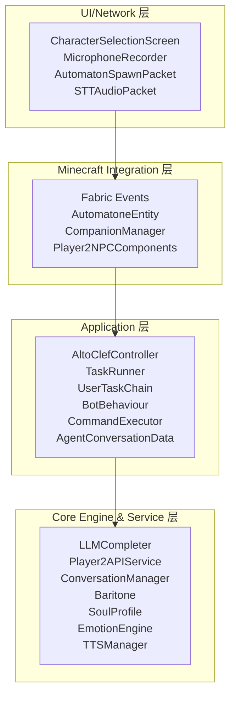
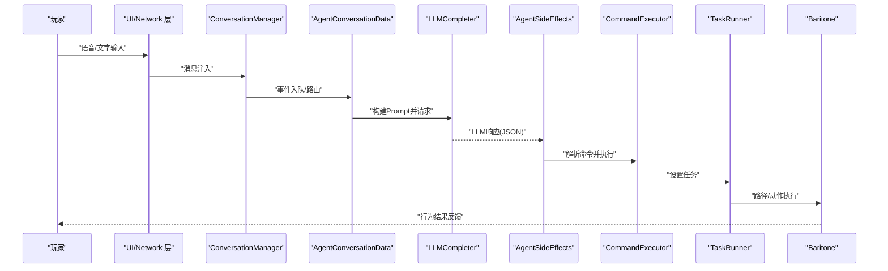
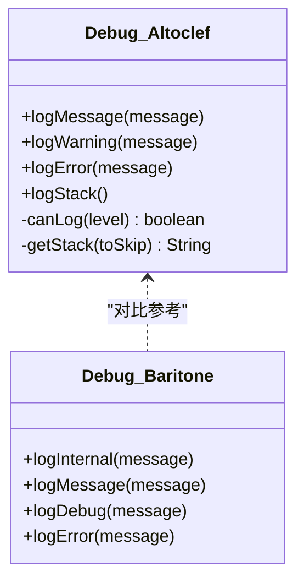
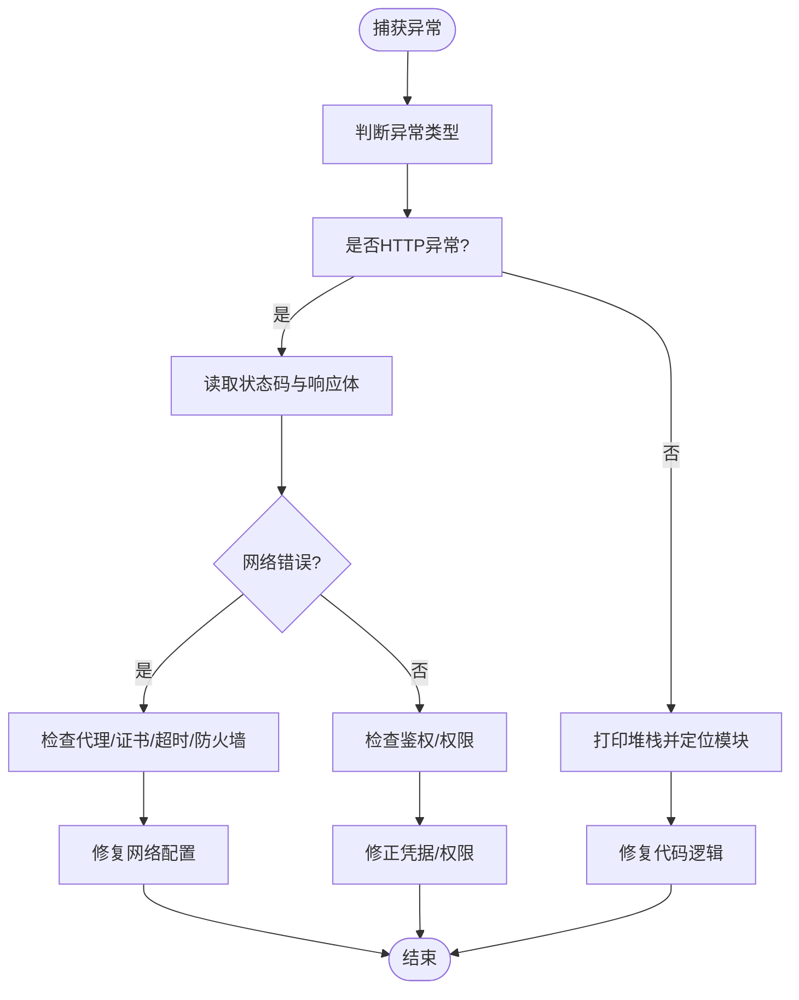
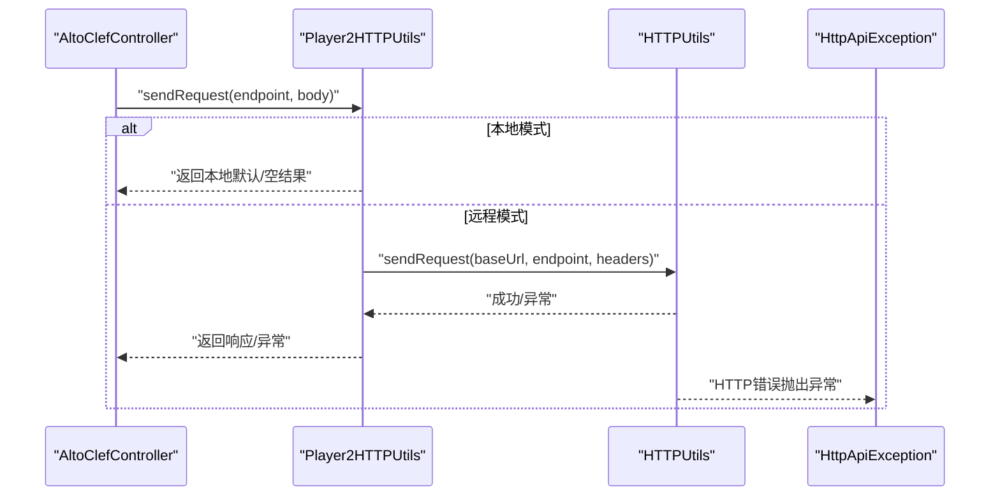
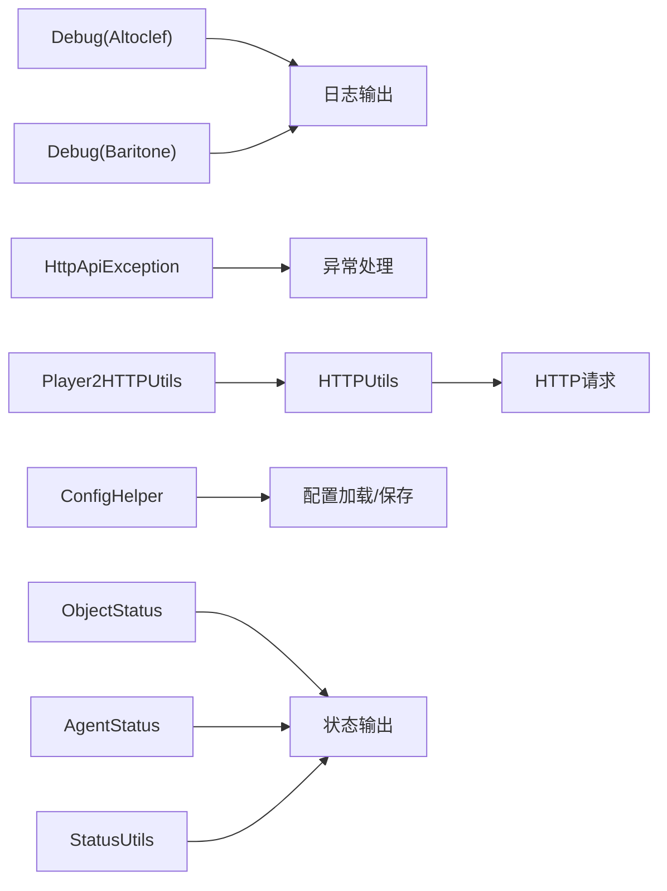

# 诊断工具与方法

<cite>
**本文引用的文件**
- [Debug.java](file://src/main/java/adris/altoclef/Debug.java)
- [Debug.java](file://src/main/java/baritone/utils/Debug.java)
- [HTTPUtils.java](file://src/main/java/adris/altoclef/player2api/utils/HTTPUtils.java)
- [HttpApiException.java](file://src/main/java/adris/altoclef/player2api/utils/HttpApiException.java)
- [Player2HTTPUtils.java](file://src/main/java/adris/altoclef/player2api/utils/Player2HTTPUtils.java)
- [GcCommand.java](file://src/main/java/baritone/command/defaults/GcCommand.java)
- [Settings.java](file://src/main/java/adris/altoclef/Settings.java)
- [ConfigHelper.java](file://src/main/java/adris/altoclef/util/helpers/ConfigHelper.java)
- [ObjectStatus.java](file://src/main/java/adris/altoclef/player2api/status/ObjectStatus.java)
- [AgentStatus.java](file://src/main/java/adris/altoclef/player2api/status/AgentStatus.java)
- [StatusUtils.java](file://src/main/java/adris/altoclef/player2api/status/StatusUtils.java)
- [StatusCommand.java](file://src/main/java/adris/altoclef/commands/StatusCommand.java)
- [README.md](file://README.md)
- [AI_NPC项目整体架构概览.md](file://docs/AI_NPC项目整体架构概览.md)
- [AI_NPC游戏指令系统重构.md](file://docs/AI_NPC游戏指令系统重构.md)
</cite>

## 目录
1. [简介](#简介)
2. [项目结构](#项目结构)
3. [核心组件](#核心组件)
4. [架构总览](#架构总览)
5. [详细组件分析](#详细组件分析)
6. [依赖关系分析](#依赖关系分析)
7. [性能考量](#性能考量)
8. [故障排查指南](#故障排查指南)
9. [结论](#结论)
10. [附录](#附录)

## 简介
本指南面向使用 PlayerEngine（Minecraft 1.20.1 Fabric）的开发者与运维人员，提供一套系统化的诊断工具与方法，覆盖日志分析、错误堆栈解读、网络连通性检测、性能监控与系统资源观测。文档以代码库为依据，结合实际文件路径与片段路径，帮助快速定位问题、制定修复策略。

## 项目结构
项目采用四层分层架构：UI/Network 层、Minecraft Integration 层、Application 层、Core Engine & Service 层。应用层包含 AI 控制器、任务系统、命令系统；服务层包含 LLM、TTS/STT、路径规划、状态采集等核心能力。

图表来源
- [AI_NPC项目整体架构概览.md:61-91](file://docs/AI_NPC项目整体架构概览.md#L61-L91)

章节来源
- [AI_NPC项目整体架构概览.md:61-91](file://docs/AI_NPC项目整体架构概览.md#L61-L91)

## 核心组件
- 调试与日志：统一日志门面与内部日志封装，支持级别过滤与堆栈打印。
- 网络工具：HTTP 请求封装与异常类型化，便于统一处理错误。
- 配置系统：配置文件加载、序列化/反序列化、失败回退与重载。
- 状态采集：NPC/世界状态采集与格式化输出，辅助诊断行为链与任务状态。
- 性能与GC：提供显式 GC 触发命令，便于观察内存回收影响。
- 命令与状态查询：通过命令查看当前任务与状态，辅助定位执行链问题。

章节来源
- [Debug.java:14-101](file://src/main/java/adris/altoclef/Debug.java#L14-L101)
- [HTTPUtils.java:23-87](file://src/main/java/adris/altoclef/player2api/utils/HTTPUtils.java#L23-L87)
- [HttpApiException.java:22-32](file://src/main/java/adris/altoclef/player2api/utils/HttpApiException.java#L22-L32)
- [ConfigHelper.java:48-93](file://src/main/java/adris/altoclef/util/helpers/ConfigHelper.java#L48-L93)
- [ObjectStatus.java:7-25](file://src/main/java/adris/altoclef/player2api/status/ObjectStatus.java#L7-L25)
- [AgentStatus.java:6-22](file://src/main/java/adris/altoclef/player2api/status/AgentStatus.java#L6-L22)
- [StatusUtils.java:99-130](file://src/main/java/adris/altoclef/player2api/status/StatusUtils.java#L99-L130)
- [GcCommand.java:12-22](file://src/main/java/baritone/command/defaults/GcCommand.java#L12-L22)
- [StatusCommand.java:9-24](file://src/main/java/adris/altoclef/commands/StatusCommand.java#L9-L24)

## 架构总览
下图展示从玩家输入到 NPC 执行的端到端链路，以及与网络、状态、日志的交互点。

图表来源
- [AI_NPC项目整体架构概览.md:701-774](file://docs/AI_NPC项目整体架构概览.md#L701-L774)

章节来源
- [AI_NPC项目整体架构概览.md:701-774](file://docs/AI_NPC项目整体架构概览.md#L701-L774)

## 详细组件分析

### 日志与调试工具
- 统一日志门面：通过内部 Debug 类封装，支持内部日志、警告、错误与堆栈打印，具备日志级别过滤。
- 输出目标：Minecraft 控制台与外部日志系统，便于集中检索。
- 建议用法：
  - 使用警告/错误接口定位异常分支与边界条件。
  - 使用堆栈打印接口在关键路径捕获调用链，辅助回溯。
  - 结合配置项控制日志级别，平衡诊断粒度与性能。

图表来源
- [Debug.java:14-101](file://src/main/java/adris/altoclef/Debug.java#L14-L101)
- [Debug.java:4-18](file://src/main/java/baritone/utils/Debug.java#L4-L18)

章节来源
- [Debug.java:14-101](file://src/main/java/adris/altoclef/Debug.java#L14-L101)
- [Debug.java:4-18](file://src/main/java/baritone/utils/Debug.java#L4-L18)

### 错误堆栈与异常类型解读
- 异常类型化：HTTP 工具抛出带状态码的异常类型，便于区分网络错误与业务错误。
- 建议解读流程：
  - 捕获异常，读取状态码与响应体，结合日志上下文定位请求参数与目标端点。
  - 若为网络错误（如 4xx/5xx），优先检查代理、证书、超时与防火墙。
  - 若为业务错误（如鉴权失败），核对凭据与权限。
  - 使用堆栈打印接口抓取调用链，定位异常发生的具体模块与方法。

图表来源
- [HttpApiException.java:22-32](file://src/main/java/adris/altoclef/player2api/utils/HttpApiException.java#L22-L32)
- [HTTPUtils.java:57-87](file://src/main/java/adris/altoclef/player2api/utils/HTTPUtils.java#L57-L87)
- [Debug.java:70-84](file://src/main/java/adris/altoclef/Debug.java#L70-L84)

章节来源
- [HttpApiException.java:22-32](file://src/main/java/adris/altoclef/player2api/utils/HttpApiException.java#L22-L32)
- [HTTPUtils.java:57-87](file://src/main/java/adris/altoclef/player2api/utils/HTTPUtils.java#L57-L87)
- [Debug.java:70-84](file://src/main/java/adris/altoclef/Debug.java#L70-L84)

### 网络连接问题检测
- 远端 API：通过统一 HTTP 工具发起请求，支持 GET/POST、自定义头与错误处理。
- 本地模式：当启用本地 LLM/语音时，部分端点会跳过远程调用，日志中会记录“本地模式”提示。
- 检测步骤：
  - 确认当前提供商与模式（本地/远程）。
  - 使用错误码与响应体定位失败原因。
  - 若为远程模式，检查代理、域名解析、证书与防火墙规则。
  - 使用命令查看当前任务与状态，辅助判断网络请求是否被触发。

图表来源
- [Player2HTTPUtils.java:45-88](file://src/main/java/adris/altoclef/player2api/utils/Player2HTTPUtils.java#L45-L88)
- [HTTPUtils.java:23-55](file://src/main/java/adris/altoclef/player2api/utils/HTTPUtils.java#L23-L55)
- [HttpApiException.java:22-32](file://src/main/java/adris/altoclef/player2api/utils/HttpApiException.java#L22-L32)

章节来源
- [Player2HTTPUtils.java:45-88](file://src/main/java/adris/altoclef/player2api/utils/Player2HTTPUtils.java#L45-L88)
- [HTTPUtils.java:23-55](file://src/main/java/adris/altoclef/player2api/utils/HTTPUtils.java#L23-L55)
- [HttpApiException.java:22-32](file://src/main/java/adris/altoclef/player2api/utils/HttpApiException.java#L22-L32)

### 性能监控与内存回收
- 显式 GC：提供命令触发 JVM 垃圾回收，便于观察内存回收对行为的影响。
- 建议实践：
  - 在长时间运行后执行 GC 命令，观察内存占用下降与后续行为稳定性。
  - 结合任务状态与日志，定位是否存在内存泄漏或对象堆积。

章节来源
- [GcCommand.java:12-22](file://src/main/java/baritone/command/defaults/GcCommand.java#L12-L22)

### 系统资源监控
- 配置与日志：通过配置文件与日志级别控制，辅助定位资源瓶颈。
- 状态采集：提供 NPC/世界状态采集工具，用于观察任务执行前后状态变化。
- 建议实践：
  - 使用状态命令查看当前任务，结合日志定位执行链问题。
  - 结合系统监控工具（如操作系统自带的资源监控）观察 CPU、内存、磁盘与网络。

章节来源
- [Settings.java:36-40](file://src/main/java/adris/altoclef/Settings.java#L36-L40)
- [StatusCommand.java:9-24](file://src/main/java/adris/altoclef/commands/StatusCommand.java#L9-L24)
- [ObjectStatus.java:7-25](file://src/main/java/adris/altoclef/player2api/status/ObjectStatus.java#L7-L25)
- [AgentStatus.java:6-22](file://src/main/java/adris/altoclef/player2api/status/AgentStatus.java#L6-L22)
- [StatusUtils.java:99-130](file://src/main/java/adris/altoclef/player2api/status/StatusUtils.java#L99-L130)

## 依赖关系分析
- 日志与异常：Debug 类与 HttpApiException 为诊断提供基础能力。
- 网络：Player2HTTPUtils 与 HTTPUtils 构成网络访问层，前者负责模式与端点路由，后者负责通用 HTTP 请求。
- 配置：ConfigHelper 负责配置文件的加载、保存与失败回退，保障系统在异常情况下仍可运行。
- 状态：状态采集类提供结构化输出，便于诊断任务与行为链。

图表来源
- [Debug.java:14-101](file://src/main/java/adris/altoclef/Debug.java#L14-L101)
- [Debug.java:4-18](file://src/main/java/baritone/utils/Debug.java#L4-L18)
- [HttpApiException.java:22-32](file://src/main/java/adris/altoclef/player2api/utils/HttpApiException.java#L22-L32)
- [HTTPUtils.java:23-55](file://src/main/java/adris/altoclef/player2api/utils/HTTPUtils.java#L23-L55)
- [Player2HTTPUtils.java:45-88](file://src/main/java/adris/altoclef/player2api/utils/Player2HTTPUtils.java#L45-L88)
- [ConfigHelper.java:48-93](file://src/main/java/adris/altoclef/util/helpers/ConfigHelper.java#L48-L93)
- [ObjectStatus.java:7-25](file://src/main/java/adris/altoclef/player2api/status/ObjectStatus.java#L7-L25)
- [AgentStatus.java:6-22](file://src/main/java/adris/altoclef/player2api/status/AgentStatus.java#L6-L22)
- [StatusUtils.java:99-130](file://src/main/java/adris/altoclef/player2api/status/StatusUtils.java#L99-L130)

章节来源
- [Debug.java:14-101](file://src/main/java/adris/altoclef/Debug.java#L14-L101)
- [Debug.java:4-18](file://src/main/java/baritone/utils/Debug.java#L4-L18)
- [HttpApiException.java:22-32](file://src/main/java/adris/altoclef/player2api/utils/HttpApiException.java#L22-L32)
- [HTTPUtils.java:23-55](file://src/main/java/adris/altoclef/player2api/utils/HTTPUtils.java#L23-L55)
- [Player2HTTPUtils.java:45-88](file://src/main/java/adris/altoclef/player2api/utils/Player2HTTPUtils.java#L45-L88)
- [ConfigHelper.java:48-93](file://src/main/java/adris/altoclef/util/helpers/ConfigHelper.java#L48-L93)
- [ObjectStatus.java:7-25](file://src/main/java/adris/altoclef/player2api/status/ObjectStatus.java#L7-L25)
- [AgentStatus.java:6-22](file://src/main/java/adris/altoclef/player2api/status/AgentStatus.java#L6-L22)
- [StatusUtils.java:99-130](file://src/main/java/adris/altoclef/player2api/status/StatusUtils.java#L99-L130)

## 性能考量
- 异步处理：LLM 与 TTS 采用独立线程池，避免阻塞主线程。
- 路径规划：异步寻路与区块缓存减少主线程压力。
- 资源管理：显式 GC 命令可用于观察内存回收对行为的影响；建议在长时间运行后执行。
- 配置与日志：通过配置项控制日志级别与调试开关，平衡诊断粒度与性能。

章节来源
- [AI_NPC项目整体架构概览.md:371-401](file://docs/AI_NPC项目整体架构概览.md#L371-L401)
- [GcCommand.java:12-22](file://src/main/java/baritone/command/defaults/GcCommand.java#L12-L22)
- [Settings.java:36-40](file://src/main/java/adris/altoclef/Settings.java#L36-L40)

## 故障排查指南
- 日志分析
  - 使用警告/错误接口定位异常分支与边界条件。
  - 使用堆栈打印接口在关键路径捕获调用链，辅助回溯。
  - 结合配置项控制日志级别，平衡诊断粒度与性能。
- 网络诊断
  - 确认当前提供商与模式（本地/远程）。
  - 使用错误码与响应体定位失败原因。
  - 若为远程模式，检查代理、域名解析、证书与防火墙规则。
- 配置与持久化
  - 使用配置加载工具观察加载/保存过程中的异常与回退。
  - 在配置损坏时，系统可回退到默认状态，避免崩溃。
- 状态与任务
  - 使用状态命令查看当前任务，结合日志定位执行链问题。
  - 结合状态采集工具观察任务前后状态变化，辅助定位行为链异常。

章节来源
- [Debug.java:14-101](file://src/main/java/adris/altoclef/Debug.java#L14-L101)
- [HttpApiException.java:22-32](file://src/main/java/adris/altoclef/player2api/utils/HttpApiException.java#L22-L32)
- [HTTPUtils.java:57-87](file://src/main/java/adris/altoclef/player2api/utils/HTTPUtils.java#L57-L87)
- [Player2HTTPUtils.java:45-88](file://src/main/java/adris/altoclef/player2api/utils/Player2HTTPUtils.java#L45-L88)
- [ConfigHelper.java:48-93](file://src/main/java/adris/altoclef/util/helpers/ConfigHelper.java#L48-L93)
- [StatusCommand.java:9-24](file://src/main/java/adris/altoclef/commands/StatusCommand.java#L9-L24)
- [ObjectStatus.java:7-25](file://src/main/java/adris/altoclef/player2api/status/ObjectStatus.java#L7-L25)
- [AgentStatus.java:6-22](file://src/main/java/adris/altoclef/player2api/status/AgentStatus.java#L6-L22)
- [StatusUtils.java:99-130](file://src/main/java/adris/altoclef/player2api/status/StatusUtils.java#L99-L130)

## 结论
本指南基于代码库提供了系统化的诊断工具与方法，涵盖日志分析、错误堆栈解读、网络连通性检测、性能监控与系统资源观测。通过统一的日志门面、异常类型化、网络工具与状态采集，能够有效定位与修复问题。建议在日常维护中结合配置与日志级别控制，持续观察系统行为，及时发现并解决问题。

## 附录
- 常用命令与配置参考
  - 状态命令：查看当前任务与状态。
  - 日志级别：通过配置项控制日志输出。
  - 网络模式：本地/远程模式切换与端点路由。
- 参考文档
  - 项目整体架构与端到端流程。
  - 指令系统重构与问题诊断。

章节来源
- [StatusCommand.java:9-24](file://src/main/java/adris/altoclef/commands/StatusCommand.java#L9-L24)
- [Settings.java:36-40](file://src/main/java/adris/altoclef/Settings.java#L36-L40)
- [README.md:66-171](file://README.md#L66-L171)
- [AI_NPC项目整体架构概览.md:1-80](file://docs/AI_NPC项目整体架构概览.md#L1-L80)
- [AI_NPC游戏指令系统重构.md:1-80](file://docs/AI_NPC游戏指令系统重构.md#L1-L80)