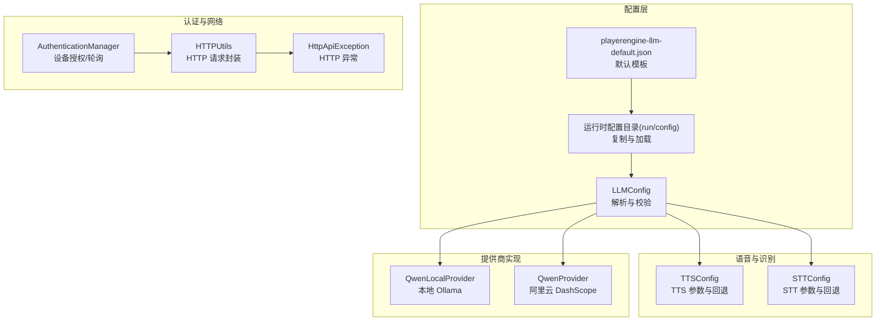
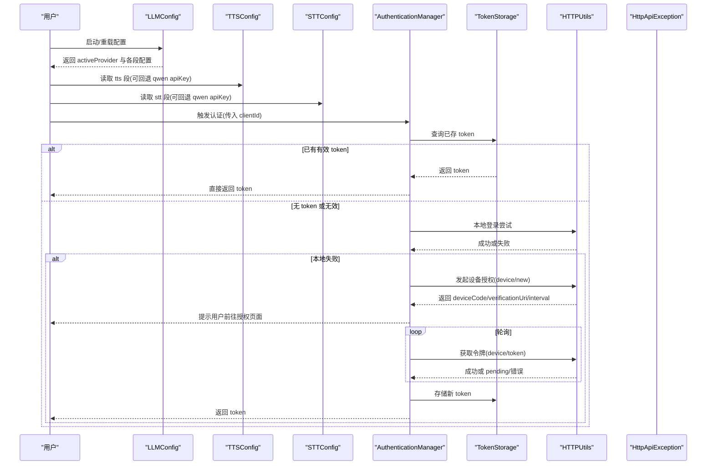
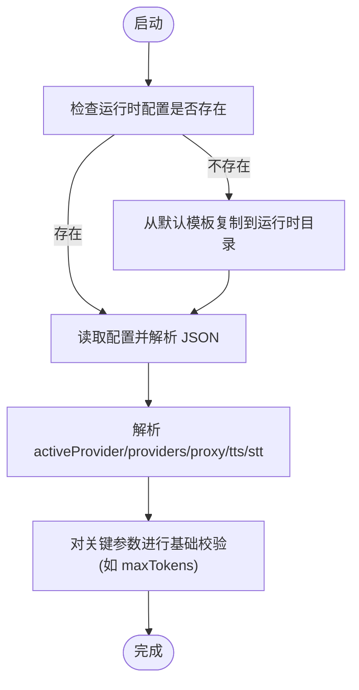
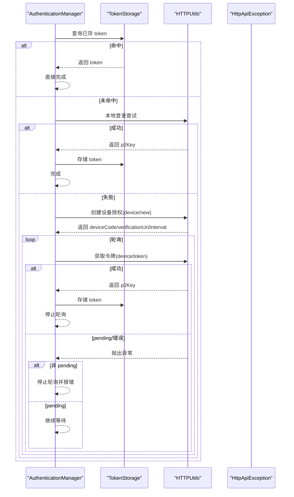
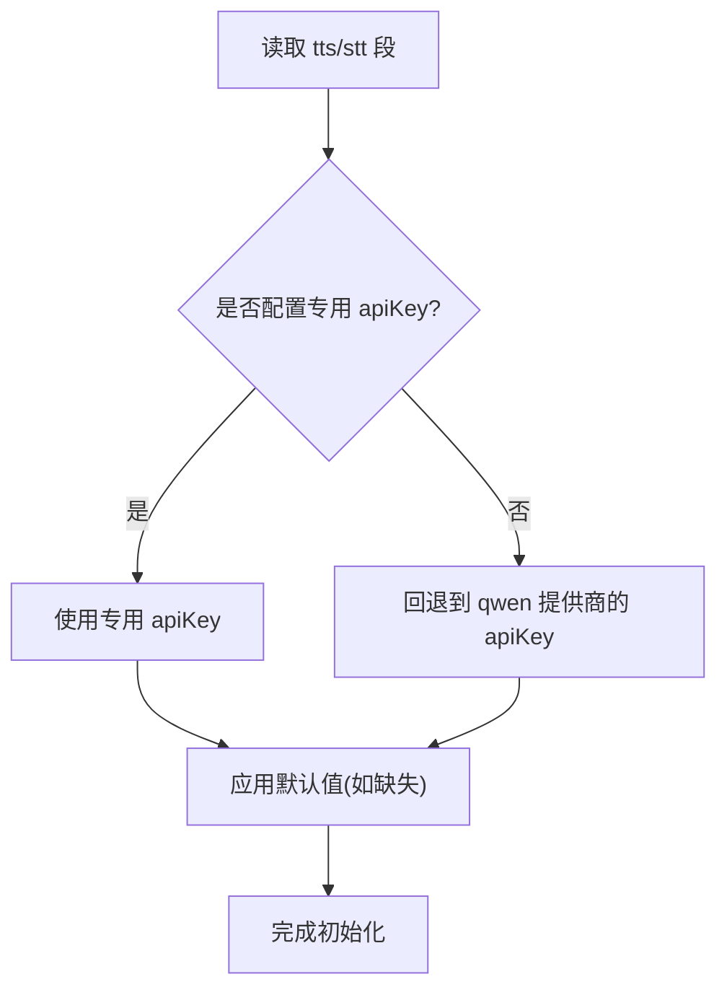
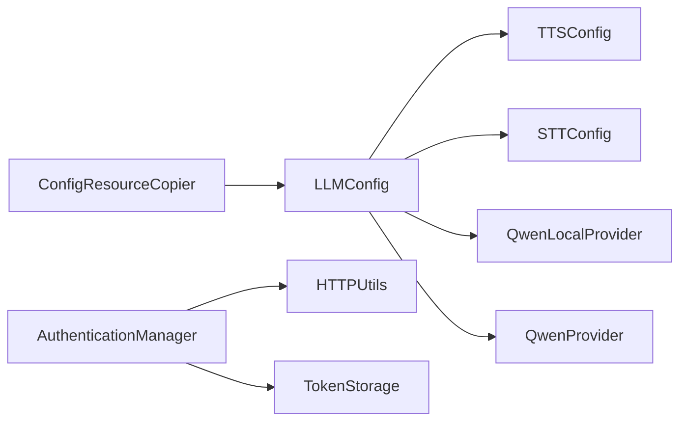
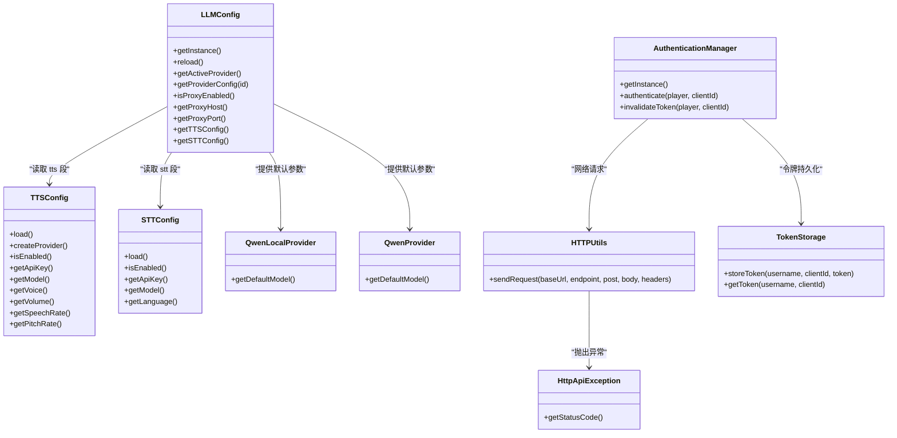

# 配置问题排查

<cite>
**本文引用的文件**
- [src/main/java/adris/altoclef/player2api/auth/AuthKey.java](file://src/main/java/adris/altoclef/player2api/auth/AuthKey.java)
- [src/main/java/adris/altoclef/player2api/auth/AuthenticationManager.java](file://src/main/java/adris/altoclef/player2api/auth/AuthenticationManager.java)
- [src/main/java/adris/altoclef/player2api/auth/TokenStorage.java](file://src/main/java/adris/altoclef/player2api/auth/TokenStorage.java)
- [src/main/java/adris/altoclef/player2api/utils/HTTPUtils.java](file://src/main/java/adris/altoclef/player2api/utils/HTTPUtils.java)
- [src/main/java/adris/altoclef/player2api/utils/HttpApiException.java](file://src/main/java/adris/altoclef/player2api/utils/HttpApiException.java)
- [src/main/java/adris/altoclef/player2api/llm/LLMConfig.java](file://src/main/java/adris/altoclef/player2api/llm/LLMConfig.java)
- [src/main/resources/playerengine-llm-default.json](file://src/main/resources/playerengine-llm-default.json)
- [src/main/java/adris/altoclef/player2api/utils/ConfigResourceCopier.java](file://src/main/java/adris/altoclef/player2api/utils/ConfigResourceCopier.java)
- [src/main/java/adris/altoclef/player2api/llm/impl/QwenLocalProvider.java](file://src/main/java/adris/altoclef/player2api/llm/impl/QwenLocalProvider.java)
- [src/main/java/adris/altoclef/player2api/llm/impl/QwenProvider.java](file://src/main/java/adris/altoclef/player2api/llm/impl/QwenProvider.java)
- [src/main/java/adris/altoclef/player2api/tts/TTSConfig.java](file://src/main/java/adris/altoclef/player2api/tts/TTSConfig.java)
- [src/main/java/adris/altoclef/player2api/stt/STTConfig.java](file://src/main/java/adris/altoclef/player2api/stt/STTConfig.java)
</cite>

## 目录
1. [简介](#简介)
2. [项目结构](#项目结构)
3. [核心组件](#核心组件)
4. [架构总览](#架构总览)
5. [详细组件分析](#详细组件分析)
6. [依赖分析](#依赖分析)
7. [性能考虑](#性能考虑)
8. [故障排查指南](#故障排查指南)
9. [结论](#结论)
10. [附录](#附录)

## 简介
本指南聚焦于配置问题的系统化排查与修复，涵盖以下方面：
- API Key 配置错误的识别与修复：密钥格式验证、权限范围检查、配额限制确认等。
- 网络连接问题的诊断：代理设置、防火墙规则、DNS 解析、SSL 证书验证等。
- 权限设置不当的识别与修复：文件权限、网络权限、系统权限等。
- 版本兼容性问题处理：Minecraft 版本要求、Fabric API 版本匹配、依赖库版本冲突等。
- 配置文件验证方法：JSON 格式检查、必填字段验证、默认值回退等。

## 项目结构
本项目围绕“AI NPC”功能模块组织，其中与配置相关的关键位置如下：
- 配置文件：resources 中的默认配置模板与运行时配置目录（由工具类复制到运行时目录）。
- 配置加载器：LLMConfig 读取运行时配置，并对关键参数进行基础校验。
- 认证与网络：AuthenticationManager 负责设备授权流程；HTTPUtils 封装网络请求与异常处理。
- 语音与识别：TTSConfig、STTConfig 从 LLMConfig 中提取语音相关配置并支持回退策略。
- 本地推理：QwenLocalProvider、QwenProvider 提供不同提供商的默认参数与兼容逻辑。

图表来源
- [src/main/resources/playerengine-llm-default.json:1-89](file://src/main/resources/playerengine-llm-default.json#L1-L89)
- [src/main/java/adris/altoclef/player2api/llm/LLMConfig.java:37-89](file://src/main/java/adris/altoclef/player2api/llm/LLMConfig.java#L37-L89)
- [src/main/java/adris/altoclef/player2api/utils/ConfigResourceCopier.java:29-57](file://src/main/java/adris/altoclef/player2api/utils/ConfigResourceCopier.java#L29-L57)
- [src/main/java/adris/altoclef/player2api/auth/AuthenticationManager.java:43-98](file://src/main/java/adris/altoclef/player2api/auth/AuthenticationManager.java#L43-L98)
- [src/main/java/adris/altoclef/player2api/utils/HTTPUtils.java:23-55](file://src/main/java/adris/altoclef/player2api/utils/HTTPUtils.java#L23-L55)
- [src/main/java/adris/altoclef/player2api/tts/TTSConfig.java:38-72](file://src/main/java/adris/altoclef/player2api/tts/TTSConfig.java#L38-L72)
- [src/main/java/adris/altoclef/player2api/stt/STTConfig.java:31-59](file://src/main/java/adris/altoclef/player2api/stt/STTConfig.java#L31-L59)
- [src/main/java/adris/altoclef/player2api/llm/impl/QwenLocalProvider.java:12-22](file://src/main/java/adris/altoclef/player2api/llm/impl/QwenLocalProvider.java#L12-L22)
- [src/main/java/adris/altoclef/player2api/llm/impl/QwenProvider.java:11-22](file://src/main/java/adris/altoclef/player2api/llm/impl/QwenProvider.java#L11-L22)

章节来源
- [src/main/java/adris/altoclef/player2api/llm/LLMConfig.java:37-89](file://src/main/java/adris/altoclef/player2api/llm/LLMConfig.java#L37-L89)
- [src/main/java/adris/altoclef/player2api/utils/ConfigResourceCopier.java:29-57](file://src/main/java/adris/altoclef/player2api/utils/ConfigResourceCopier.java#L29-L57)
- [src/main/resources/playerengine-llm-default.json:1-89](file://src/main/resources/playerengine-llm-default.json#L1-L89)

## 核心组件
- 配置复制与加载：通过 ConfigResourceCopier 确保运行时配置存在，若缺失则从默认模板复制；LLMConfig 负责解析 activeProvider、providers、proxy、tts、stt 等段落，并对部分参数进行基础校验（如 maxTokens 下限）。
- 认证与令牌存储：AuthenticationManager 实现本地登录尝试与 Web 设备授权流程，支持轮询获取令牌；TokenStorage 使用 NBT 文件持久化存储令牌。
- 网络请求与异常：HTTPUtils 统一封装 HTTP(S) 请求，根据响应码抛出 HttpApiException；HttpApiException 携带状态码便于上层区分错误类型。
- 语音与识别配置：TTSConfig、STTConfig 从 LLMConfig 的 tts/stt 段读取参数，若未单独配置 API Key，则回退到 qwen 提供商的 API Key。
- 提供商实现：QwenLocalProvider、QwenProvider 提供默认模型与 API URL，便于快速启用本地或云端推理。

章节来源
- [src/main/java/adris/altoclef/player2api/utils/ConfigResourceCopier.java:29-57](file://src/main/java/adris/altoclef/player2api/utils/ConfigResourceCopier.java#L29-L57)
- [src/main/java/adris/altoclef/player2api/llm/LLMConfig.java:54-89](file://src/main/java/adris/altoclef/player2api/llm/LLMConfig.java#L54-L89)
- [src/main/java/adris/altoclef/player2api/auth/AuthenticationManager.java:43-98](file://src/main/java/adris/altoclef/player2api/auth/AuthenticationManager.java#L43-L98)
- [src/main/java/adris/altoclef/player2api/auth/TokenStorage.java:24-32](file://src/main/java/adris/altoclef/player2api/auth/TokenStorage.java#L24-L32)
- [src/main/java/adris/altoclef/player2api/utils/HTTPUtils.java:23-55](file://src/main/java/adris/altoclef/player2api/utils/HTTPUtils.java#L23-L55)
- [src/main/java/adris/altoclef/player2api/utils/HttpApiException.java:25-32](file://src/main/java/adris/altoclef/player2api/utils/HttpApiException.java#L25-L32)
- [src/main/java/adris/altoclef/player2api/tts/TTSConfig.java:38-72](file://src/main/java/adris/altoclef/player2api/tts/TTSConfig.java#L38-L72)
- [src/main/java/adris/altoclef/player2api/stt/STTConfig.java:31-59](file://src/main/java/adris/altoclef/player2api/stt/STTConfig.java#L31-L59)
- [src/main/java/adris/altoclef/player2api/llm/impl/QwenLocalProvider.java:12-22](file://src/main/java/adris/altoclef/player2api/llm/impl/QwenLocalProvider.java#L12-L22)
- [src/main/java/adris/altoclef/player2api/llm/impl/QwenProvider.java:11-22](file://src/main/java/adris/altoclef/player2api/llm/impl/QwenProvider.java#L11-L22)

## 架构总览
下图展示从配置到认证再到网络请求的整体链路，以及与提供商实现的关系。

图表来源
- [src/main/java/adris/altoclef/player2api/llm/LLMConfig.java:54-89](file://src/main/java/adris/altoclef/player2api/llm/LLMConfig.java#L54-L89)
- [src/main/java/adris/altoclef/player2api/tts/TTSConfig.java:38-72](file://src/main/java/adris/altoclef/player2api/tts/TTSConfig.java#L38-L72)
- [src/main/java/adris/altoclef/player2api/stt/STTConfig.java:31-59](file://src/main/java/adris/altoclef/player2api/stt/STTConfig.java#L31-L59)
- [src/main/java/adris/altoclef/player2api/auth/AuthenticationManager.java:43-98](file://src/main/java/adris/altoclef/player2api/auth/AuthenticationManager.java#L43-L98)
- [src/main/java/adris/altoclef/player2api/auth/TokenStorage.java:24-32](file://src/main/java/adris/altoclef/player2api/auth/TokenStorage.java#L24-L32)
- [src/main/java/adris/altoclef/player2api/utils/HTTPUtils.java:23-55](file://src/main/java/adris/altoclef/player2api/utils/HTTPUtils.java#L23-L55)

## 详细组件分析

### 配置文件与加载流程
- 默认模板：resources 中的 playerengine-llm-default.json 提供了 providers、proxy、tts、stt 等完整配置项注释与默认值。
- 运行时复制：ConfigResourceCopier 确保 run/config/ 下存在用户配置；若不存在则从 classpath 复制默认模板。
- 加载与校验：LLMConfig 读取 activeProvider、providers、proxy、tts、stt；并对 providers 中的 maxTokens 进行下限告警（过小可能导致 JSON 响应截断）。

图表来源
- [src/main/java/adris/altoclef/player2api/utils/ConfigResourceCopier.java:29-57](file://src/main/java/adris/altoclef/player2api/utils/ConfigResourceCopier.java#L29-L57)
- [src/main/java/adris/altoclef/player2api/llm/LLMConfig.java:54-89](file://src/main/java/adris/altoclef/player2api/llm/LLMConfig.java#L54-L89)
- [src/main/resources/playerengine-llm-default.json:1-89](file://src/main/resources/playerengine-llm-default.json#L1-L89)

章节来源
- [src/main/java/adris/altoclef/player2api/utils/ConfigResourceCopier.java:29-57](file://src/main/java/adris/altoclef/player2api/utils/ConfigResourceCopier.java#L29-L57)
- [src/main/java/adris/altoclef/player2api/llm/LLMConfig.java:54-89](file://src/main/java/adris/altoclef/player2api/llm/LLMConfig.java#L54-L89)
- [src/main/resources/playerengine-llm-default.json:1-89](file://src/main/resources/playerengine-llm-default.json#L1-L89)

### 认证与令牌管理
- 设备授权流程：优先尝试本地登录；失败则发起设备授权，提示用户打开授权链接并在轮询间隔内完成授权。
- 轮询机制：基于固定间隔向服务器查询令牌，捕获“authorization_pending”类异常以维持轮询；其他异常导致轮询终止并上报错误。
- 令牌存储：使用 NBT 文件持久化存储，键为“用户名:clientId”，便于多用户/多客户端场景。

图表来源
- [src/main/java/adris/altoclef/player2api/auth/AuthenticationManager.java:43-131](file://src/main/java/adris/altoclef/player2api/auth/AuthenticationManager.java#L43-L131)
- [src/main/java/adris/altoclef/player2api/auth/TokenStorage.java:24-32](file://src/main/java/adris/altoclef/player2api/auth/TokenStorage.java#L24-L32)
- [src/main/java/adris/altoclef/player2api/utils/HTTPUtils.java:23-55](file://src/main/java/adris/altoclef/player2api/utils/HTTPUtils.java#L23-L55)
- [src/main/java/adris/altoclef/player2api/utils/HttpApiException.java:25-32](file://src/main/java/adris/altoclef/player2api/utils/HttpApiException.java#L25-L32)

章节来源
- [src/main/java/adris/altoclef/player2api/auth/AuthenticationManager.java:43-131](file://src/main/java/adris/altoclef/player2api/auth/AuthenticationManager.java#L43-L131)
- [src/main/java/adris/altoclef/player2api/auth/TokenStorage.java:24-32](file://src/main/java/adris/altoclef/player2api/auth/TokenStorage.java#L24-L32)
- [src/main/java/adris/altoclef/player2api/utils/HTTPUtils.java:23-55](file://src/main/java/adris/altoclef/player2api/utils/HTTPUtils.java#L23-L55)
- [src/main/java/adris/altoclef/player2api/utils/HttpApiException.java:25-32](file://src/main/java/adris/altoclef/player2api/utils/HttpApiException.java#L25-L32)

### 语音与识别配置回退策略
- TTSConfig：从 tts 段读取 enabled/model/voice/volume/speechRate/pitchRate；若未单独配置 apiKey，则回退到 qwen 提供商的 apiKey。
- STTConfig：从 stt 段读取 enabled/model/language；若未单独配置 apiKey，则回退到 qwen 提供商的 apiKey。
- 默认值：当配置段缺失时，采用合理默认值并回退至 qwen apiKey，确保最小可用性。

图表来源
- [src/main/java/adris/altoclef/player2api/tts/TTSConfig.java:38-72](file://src/main/java/adris/altoclef/player2api/tts/TTSConfig.java#L38-L72)
- [src/main/java/adris/altoclef/player2api/stt/STTConfig.java:31-59](file://src/main/java/adris/altoclef/player2api/stt/STTConfig.java#L31-L59)
- [src/main/java/adris/altoclef/player2api/llm/LLMConfig.java:93-98](file://src/main/java/adris/altoclef/player2api/llm/LLMConfig.java#L93-L98)

章节来源
- [src/main/java/adris/altoclef/player2api/tts/TTSConfig.java:38-72](file://src/main/java/adris/altoclef/player2api/tts/TTSConfig.java#L38-L72)
- [src/main/java/adris/altoclef/player2api/stt/STTConfig.java:31-59](file://src/main/java/adris/altoclef/player2api/stt/STTConfig.java#L31-L59)
- [src/main/java/adris/altoclef/player2api/llm/LLMConfig.java:93-98](file://src/main/java/adris/altoclef/player2api/llm/LLMConfig.java#L93-L98)

### 提供商实现与兼容性
- QwenLocalProvider：面向本地 Ollama/OpenAI 兼容服务，默认 apiUrl 与模型；适合离线推理与隐私场景。
- QwenProvider：面向阿里云 DashScope OpenAI 兼容接口，默认模型与 apiUrl；适合国内网络环境。
- 兼容性要点：确保 activeProvider 对应的 providers 段存在且包含必要字段（如 apiUrl、apiKey、model），避免空指针或默认值不匹配。

章节来源
- [src/main/java/adris/altoclef/player2api/llm/impl/QwenLocalProvider.java:12-22](file://src/main/java/adris/altoclef/player2api/llm/impl/QwenLocalProvider.java#L12-L22)
- [src/main/java/adris/altoclef/player2api/llm/impl/QwenProvider.java:11-22](file://src/main/java/adris/altoclef/player2api/llm/impl/QwenProvider.java#L11-L22)
- [src/main/java/adris/altoclef/player2api/llm/LLMConfig.java:93-98](file://src/main/java/adris/altoclef/player2api/llm/LLMConfig.java#L93-L98)

## 依赖分析
- 组件耦合
  - LLMConfig 依赖 ConfigResourceCopier 保证配置文件存在；同时被 TTSConfig、STTConfig 间接依赖。
  - AuthenticationManager 依赖 HTTPUtils 进行网络请求，依赖 TokenStorage 进行持久化。
  - QwenLocalProvider、QwenProvider 依赖 LLMConfig 提供的配置键与默认值。
- 外部依赖
  - 网络：Java HttpURLConnection；异常通过 HttpApiException 暴露状态码。
  - 存储：NBT 文件用于令牌持久化。
- 潜在循环依赖
  - 当前设计为单向依赖（配置 → 语音/识别/提供商；认证 → 网络），未见循环。

图表来源
- [src/main/java/adris/altoclef/player2api/llm/LLMConfig.java:37-89](file://src/main/java/adris/altoclef/player2api/llm/LLMConfig.java#L37-L89)
- [src/main/java/adris/altoclef/player2api/tts/TTSConfig.java:38-72](file://src/main/java/adris/altoclef/player2api/tts/TTSConfig.java#L38-L72)
- [src/main/java/adris/altoclef/player2api/stt/STTConfig.java:31-59](file://src/main/java/adris/altoclef/player2api/stt/STTConfig.java#L31-L59)
- [src/main/java/adris/altoclef/player2api/llm/impl/QwenLocalProvider.java:12-22](file://src/main/java/adris/altoclef/player2api/llm/impl/QwenLocalProvider.java#L12-L22)
- [src/main/java/adris/altoclef/player2api/llm/impl/QwenProvider.java:11-22](file://src/main/java/adris/altoclef/player2api/llm/impl/QwenProvider.java#L11-L22)
- [src/main/java/adris/altoclef/player2api/auth/AuthenticationManager.java:43-98](file://src/main/java/adris/altoclef/player2api/auth/AuthenticationManager.java#L43-L98)
- [src/main/java/adris/altoclef/player2api/utils/HTTPUtils.java:23-55](file://src/main/java/adris/altoclef/player2api/utils/HTTPUtils.java#L23-L55)
- [src/main/java/adris/altoclef/player2api/auth/TokenStorage.java:24-32](file://src/main/java/adris/altoclef/player2api/auth/TokenStorage.java#L24-L32)
- [src/main/java/adris/altoclef/player2api/utils/ConfigResourceCopier.java:29-57](file://src/main/java/adris/altoclef/player2api/utils/ConfigResourceCopier.java#L29-L57)

章节来源
- [src/main/java/adris/altoclef/player2api/llm/LLMConfig.java:37-89](file://src/main/java/adris/altoclef/player2api/llm/LLMConfig.java#L37-L89)
- [src/main/java/adris/altoclef/player2api/auth/AuthenticationManager.java:43-98](file://src/main/java/adris/altoclef/player2api/auth/AuthenticationManager.java#L43-L98)
- [src/main/java/adris/altoclef/player2api/utils/HTTPUtils.java:23-55](file://src/main/java/adris/altoclef/player2api/utils/HTTPUtils.java#L23-L55)
- [src/main/java/adris/altoclef/player2api/auth/TokenStorage.java:24-32](file://src/main/java/adris/altoclef/player2api/auth/TokenStorage.java#L24-L32)
- [src/main/java/adris/altoclef/player2api/utils/ConfigResourceCopier.java:29-57](file://src/main/java/adris/altoclef/player2api/utils/ConfigResourceCopier.java#L29-L57)

## 性能考虑
- 配置加载：LLMConfig 在启动时一次性解析配置，后续通过 getter 访问，避免重复 IO。
- 并发与轮询：认证轮询使用单线程定时任务，避免过度占用；本地登录与 Web 流程异步执行，减少阻塞。
- 网络请求：HTTPUtils 统一设置 Content-Type 与 Accept，减少不必要的头部开销；对错误响应直接抛出异常，避免无效重试。
- 令牌持久化：TokenStorage 使用 NBT 压缩写入，降低磁盘 IO 影响。

## 故障排查指南

### API Key 配置错误
- 识别方法
  - 检查 activeProvider 对应的 providers 段是否存在且包含 apiKey 字段。
  - 若启用 TTS/STT，确认 tts/stt 段的 apiKey 是否填写；若未单独配置，确认 qwen 提供商的 apiKey 是否正确。
  - LLMConfig 在加载时会对 providers 的 maxTokens 进行下限告警，过小可能导致响应截断。
- 修复步骤
  - 在 run/config/playerengine-llm.json 中补全或修正 apiKey。
  - 如需回退策略，确保 qwen 提供商的 apiKey 正确，以便 TTS/STT 自动回退。
  - 调整 maxTokens 至合理范围（建议不低于 256，具体视模型而定）。
- 相关参考
  - 配置复制与加载：[src/main/java/adris/altoclef/player2api/utils/ConfigResourceCopier.java:29-57](file://src/main/java/adris/altoclef/player2api/utils/ConfigResourceCopier.java#L29-L57)，[src/main/java/adris/altoclef/player2api/llm/LLMConfig.java:54-89](file://src/main/java/adris/altoclef/player2api/llm/LLMConfig.java#L54-L89)
  - 语音/识别回退：[src/main/java/adris/altoclef/player2api/tts/TTSConfig.java:38-72](file://src/main/java/adris/altoclef/player2api/tts/TTSConfig.java#L38-L72)，[src/main/java/adris/altoclef/player2api/stt/STTConfig.java:31-59](file://src/main/java/adris/altoclef/player2api/stt/STTConfig.java#L31-L59)

章节来源
- [src/main/java/adris/altoclef/player2api/llm/LLMConfig.java:54-89](file://src/main/java/adris/altoclef/player2api/llm/LLMConfig.java#L54-L89)
- [src/main/java/adris/altoclef/player2api/tts/TTSConfig.java:38-72](file://src/main/java/adris/altoclef/player2api/tts/TTSConfig.java#L38-L72)
- [src/main/java/adris/altoclef/player2api/stt/STTConfig.java:31-59](file://src/main/java/adris/altoclef/player2api/stt/STTConfig.java#L31-L59)

### 网络连接问题
- 识别方法
  - HTTPUtils 对响应码 &ge; 400 直接抛出 HttpApiException，并携带状态码；可用于区分鉴权失败、服务端错误等。
  - 若访问海外服务（如 OpenAI），检查 proxy 段是否启用并正确配置 host/port。
  - 认证轮询期间若收到“authorization_pending”类异常，通常属正常等待；其他异常需关注。
- 诊断步骤
  - 检查本地登录 URL（127.0.0.1:4315）是否可达；若不可达，确认本地服务是否运行。
  - 若使用代理，确认代理端口与协议正确；测试代理连通性。
  - 查看 HttpApiException 的状态码，结合服务端文档定位问题（如 401 未授权、403 禁止、429 速率限制、5xx 服务端错误）。
- 相关参考
  - 网络封装与异常：[src/main/java/adris/altoclef/player2api/utils/HTTPUtils.java:23-55](file://src/main/java/adris/altoclef/player2api/utils/HTTPUtils.java#L23-L55)，[src/main/java/adris/altoclef/player2api/utils/HttpApiException.java:25-32](file://src/main/java/adris/altoclef/player2api/utils/HttpApiException.java#L25-L32)
  - 代理配置：[src/main/resources/playerengine-llm-default.json:45-50](file://src/main/resources/playerengine-llm-default.json#L45-L50)，[src/main/java/adris/altoclef/player2api/llm/LLMConfig.java:100-110](file://src/main/java/adris/altoclef/player2api/llm/LLMConfig.java#L100-L110)
  - 认证轮询：[src/main/java/adris/altoclef/player2api/auth/AuthenticationManager.java:100-131](file://src/main/java/adris/altoclef/player2api/auth/AuthenticationManager.java#L100-L131)

章节来源
- [src/main/java/adris/altoclef/player2api/utils/HTTPUtils.java:23-55](file://src/main/java/adris/altoclef/player2api/utils/HTTPUtils.java#L23-L55)
- [src/main/java/adris/altoclef/player2api/utils/HttpApiException.java:25-32](file://src/main/java/adris/altoclef/player2api/utils/HttpApiException.java#L25-L32)
- [src/main/resources/playerengine-llm-default.json:45-50](file://src/main/resources/playerengine-llm-default.json#L45-L50)
- [src/main/java/adris/altoclef/player2api/llm/LLMConfig.java:100-110](file://src/main/java/adris/altoclef/player2api/llm/LLMConfig.java#L100-L110)
- [src/main/java/adris/altoclef/player2api/auth/AuthenticationManager.java:100-131](file://src/main/java/adris/altoclef/player2api/auth/AuthenticationManager.java#L100-L131)

### 权限设置不当
- 文件权限
  - TokenStorage 使用 NBT 文件存储令牌，需确保游戏运行目录具有读写权限；若写入失败，检查文件系统权限与磁盘空间。
- 网络权限
  - 确认游戏进程允许访问外部网络；若使用代理，确保代理端口开放。
- 系统权限
  - 本地推理（Ollama）需确保本地服务可访问（默认 127.0.0.1:11434）；若被防火墙拦截，需放行相应端口。
- 相关参考
  - 令牌存储与保存：[src/main/java/adris/altoclef/player2api/auth/TokenStorage.java:44-53](file://src/main/java/adris/altoclef/player2api/auth/TokenStorage.java#L44-L53)
  - 本地推理默认地址：[src/main/java/adris/altoclef/player2api/llm/impl/QwenLocalProvider.java:9-11](file://src/main/java/adris/altoclef/player2api/llm/impl/QwenLocalProvider.java#L9-L11)

章节来源
- [src/main/java/adris/altoclef/player2api/auth/TokenStorage.java:44-53](file://src/main/java/adris/altoclef/player2api/auth/TokenStorage.java#L44-L53)
- [src/main/java/adris/altoclef/player2api/llm/impl/QwenLocalProvider.java:9-11](file://src/main/java/adris/altoclef/player2api/llm/impl/QwenLocalProvider.java#L9-L11)

### 版本兼容性问题
- Minecraft 与 Fabric
  - 确认运行的 Minecraft 版本与 Fabric API 版本满足 mod 要求；若出现类找不到或方法签名不匹配，优先检查版本一致性。
- 依赖库版本冲突
  - 若出现 JSON 解析异常或网络库冲突，优先核对 Gson、Log4j 等依赖版本；保持与构建脚本一致。
- 提供商兼容性
  - 不同提供商的默认 apiUrl 与模型不同，切换 activeProvider 时需同步更新对应 providers 段的字段（如 apiUrl、apiKey、model）。
- 相关参考
  - 提供商默认参数：[src/main/java/adris/altoclef/player2api/llm/impl/QwenLocalProvider.java:9-22](file://src/main/java/adris/altoclef/player2api/llm/impl/QwenLocalProvider.java#L9-L22)，[src/main/java/adris/altoclef/player2api/llm/impl/QwenProvider.java:9-22](file://src/main/java/adris/altoclef/player2api/llm/impl/QwenProvider.java#L9-L22)
  - 配置键与默认值：[src/main/resources/playerengine-llm-default.json:6-43](file://src/main/resources/playerengine-llm-default.json#L6-L43)

章节来源
- [src/main/java/adris/altoclef/player2api/llm/impl/QwenLocalProvider.java:9-22](file://src/main/java/adris/altoclef/player2api/llm/impl/QwenLocalProvider.java#L9-L22)
- [src/main/java/adris/altoclef/player2api/llm/impl/QwenProvider.java:9-22](file://src/main/java/adris/altoclef/player2api/llm/impl/QwenProvider.java#L9-L22)
- [src/main/resources/playerengine-llm-default.json:6-43](file://src/main/resources/playerengine-llm-default.json#L6-L43)

### 配置文件验证方法
- JSON 格式检查
  - 使用任意 JSON 校验工具检查 run/config/playerengine-llm.json；确保语法正确、无尾随逗号、引号闭合。
- 必填字段验证
  - activeProvider 必须指向 providers 中存在的键；providers 段下的每个启用提供商需包含 apiUrl、apiKey、model 等关键字段。
- 默认值回退
  - 若 tts/stt 段缺少 apiKey，将自动回退到 qwen 提供商的 apiKey；若 qwen 也未配置，需手动补齐以避免运行时错误。
- 相关参考
  - 默认模板与注释：[src/main/resources/playerengine-llm-default.json:1-89](file://src/main/resources/playerengine-llm-default.json#L1-L89)
  - 加载与回退逻辑：[src/main/java/adris/altoclef/player2api/tts/TTSConfig.java:38-72](file://src/main/java/adris/altoclef/player2api/tts/TTSConfig.java#L38-L72)，[src/main/java/adris/altoclef/player2api/stt/STTConfig.java:31-59](file://src/main/java/adris/altoclef/player2api/stt/STTConfig.java#L31-L59)

章节来源
- [src/main/resources/playerengine-llm-default.json:1-89](file://src/main/resources/playerengine-llm-default.json#L1-L89)
- [src/main/java/adris/altoclef/player2api/tts/TTSConfig.java:38-72](file://src/main/java/adris/altoclef/player2api/tts/TTSConfig.java#L38-L72)
- [src/main/java/adris/altoclef/player2api/stt/STTConfig.java:31-59](file://src/main/java/adris/altoclef/player2api/stt/STTConfig.java#L31-L59)

## 结论
通过规范的配置复制与加载、完善的认证与网络封装、合理的回退策略与兼容性设计，本项目在配置层面提供了较强的鲁棒性。排查时建议遵循“配置文件 → 认证令牌 → 网络连通 → 权限与版本”的顺序，结合 HttpApiException 的状态码与日志输出快速定位问题根因。

## 附录
- 关键类关系概览

图表来源
- [src/main/java/adris/altoclef/player2api/llm/LLMConfig.java:41-115](file://src/main/java/adris/altoclef/player2api/llm/LLMConfig.java#L41-L115)
- [src/main/java/adris/altoclef/player2api/tts/TTSConfig.java:38-101](file://src/main/java/adris/altoclef/player2api/tts/TTSConfig.java#L38-L101)
- [src/main/java/adris/altoclef/player2api/stt/STTConfig.java:31-77](file://src/main/java/adris/altoclef/player2api/stt/STTConfig.java#L31-L77)
- [src/main/java/adris/altoclef/player2api/auth/AuthenticationManager.java:31-149](file://src/main/java/adris/altoclef/player2api/auth/AuthenticationManager.java#L31-L149)
- [src/main/java/adris/altoclef/player2api/auth/TokenStorage.java:12-58](file://src/main/java/adris/altoclef/player2api/auth/TokenStorage.java#L12-L58)
- [src/main/java/adris/altoclef/player2api/utils/HTTPUtils.java:23-87](file://src/main/java/adris/altoclef/player2api/utils/HTTPUtils.java#L23-L87)
- [src/main/java/adris/altoclef/player2api/utils/HttpApiException.java:25-32](file://src/main/java/adris/altoclef/player2api/utils/HttpApiException.java#L25-L32)
- [src/main/java/adris/altoclef/player2api/llm/impl/QwenLocalProvider.java:12-22](file://src/main/java/adris/altoclef/player2api/llm/impl/QwenLocalProvider.java#L12-L22)
- [src/main/java/adris/altoclef/player2api/llm/impl/QwenProvider.java:11-22](file://src/main/java/adris/altoclef/player2api/llm/impl/QwenProvider.java#L11-L22)