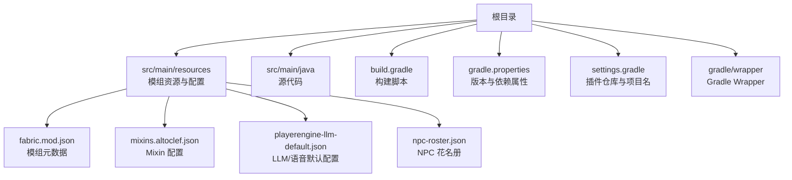
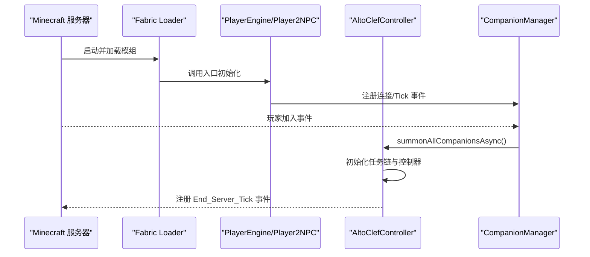
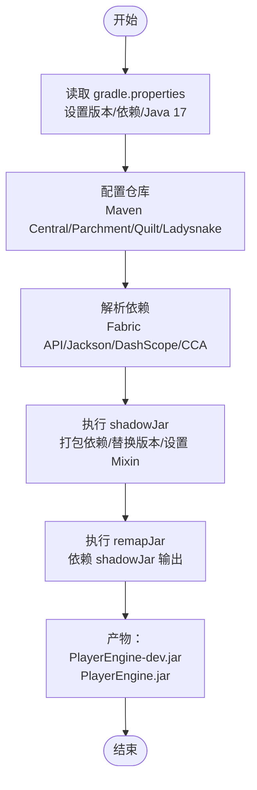
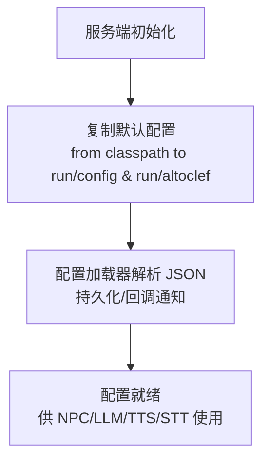
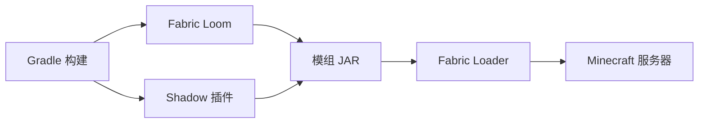

# 服务器部署

<cite>
**本文引用的文件**   
- [build.gradle](file://build.gradle)
- [gradle.properties](file://gradle.properties)
- [settings.gradle](file://settings.gradle)
- [gradle-wrapper.properties](file://gradle/wrapper/gradle-wrapper.properties)
- [fabric.mod.json](file://src/main/resources/fabric.mod.json)
- [mixins.altoclef.json](file://src/main/resources/mixins.altoclef.json)
- [playerengine-llm-default.json](file://src/main/resources/playerengine-llm-default.json)
- [npc-roster.json](file://src/main/resources/npc-roster.json)
- [README.md](file://README.md)
- [ConfigResourceCopier.java](file://src/main/java/adris/altoclef/player2api/utils/ConfigResourceCopier.java)
- [ConfigHelper.java](file://src/main/java/adris/altoclef/util/helpers/ConfigHelper.java)
- [AltoClefController.java](file://src/main/java/adris/altoclef/AltoClefController.java)
- [AI_NPC项目整体架构概览.md](file://docs/AI_NPC项目整体架构概览.md)
</cite>

## 目录
1. [简介](#简介)
2. [项目结构](#项目结构)
3. [核心组件](#核心组件)
4. [架构总览](#架构总览)
5. [详细组件分析](#详细组件分析)
6. [依赖分析](#依赖分析)
7. [性能考量](#性能考量)
8. [故障排查指南](#故障排查指南)
9. [结论](#结论)
10. [附录](#附录)

## 简介
本指南面向希望在 Minecraft 服务器上部署 PlayerEngine（含 AI NPC）模组的管理员与运维人员。文档围绕以下目标展开：
- 服务器环境准备：Java 17、Fabric API、必要依赖库与网络环境
- 项目构建流程：Gradle 构建脚本、shadowJar 与 remapJar 任务、构建产物获取
- fabric.mod.json 配置要点：版本号、依赖声明、Mixin 配置
- 服务器启动步骤：配置文件放置、启动参数、日志检查
- 性能优化建议：JVM 参数、内存分配、并发处理
- 服务器监控方法：日志分析、性能指标、玩家活动跟踪

## 项目结构
该仓库为基于 Fabric 的 Minecraft 模组工程，采用 Gradle + Fabric Loom 构建，核心资源集中在 src/main/resources，包含模组元数据、Mixin 配置、默认配置模板与 NPC 花名册等。

**图表来源**
- [build.gradle](file://build.gradle)
- [gradle.properties](file://gradle.properties)
- [settings.gradle](file://settings.gradle)
- [fabric.mod.json](file://src/main/resources/fabric.mod.json)
- [mixins.altoclef.json](file://src/main/resources/mixins.altoclef.json)
- [playerengine-llm-default.json](file://src/main/resources/playerengine-llm-default.json)
- [npc-roster.json](file://src/main/resources/npc-roster.json)

**章节来源**
- [build.gradle](file://build.gradle)
- [gradle.properties](file://gradle.properties)
- [settings.gradle](file://settings.gradle)

## 核心组件
- 构建与打包
  - Fabric Loom 插件用于 Fabric 环境适配与 remap
  - Shadow 插件用于依赖打包进最终 JAR
  - shadowJar 任务生成 dev 分类器的可运行 JAR
  - remapJar 任务将 shadowJar 结果 remap 为 Fabric 服务器可用的 JAR
- 模组元数据
  - fabric.mod.json 定义模组 ID、版本、入口点、Mixin、依赖与自定义扩展
- 配置系统
  - 默认配置模板位于 src/main/resources，运行时复制到 run/config 与 run/altoclef
  - 配置加载与持久化由配置工具类负责

**章节来源**
- [build.gradle](file://build.gradle)
- [fabric.mod.json](file://src/main/resources/fabric.mod.json)
- [ConfigResourceCopier.java](file://src/main/java/adris/altoclef/player2api/utils/ConfigResourceCopier.java)
- [ConfigHelper.java](file://src/main/java/adris/altoclef/util/helpers/ConfigHelper.java)

## 架构总览
下图展示模组在服务器生命周期中的关键节点与事件：

**图表来源**
- [AltoClefController.java](file://src/main/java/adris/altoclef/AltoClefController.java)
- [AI_NPC项目整体架构概览.md](file://docs/AI_NPC项目整体架构概览.md)

## 详细组件分析

### 构建与打包流程
- Gradle 版本与 Wrapper
  - 使用 Gradle 8.x（通过 wrapper）
- Java 工具链与编码
  - 指定 Java 17 工具链，编译期与 Javadoc 使用 UTF-8
- 依赖与仓库
  - 使用 Maven Central、Parchment、Quilt、Ladysnake 等仓库
  - 引入 Fabric API、Jackson、DashScope SDK、Cardinal Components API 等
- shadowJar 任务
  - 打包依赖（Jackson、DashScope SDK）
  - 替换 fabric.mod.json 版本占位符
  - 设置 MixinConfigs 清单与实现版本信息
- remapJar 任务
  - 依赖 shadowJar，生成服务器可用的 JAR（无 classifier）

**图表来源**
- [build.gradle](file://build.gradle)
- [gradle.properties](file://gradle.properties)

**章节来源**
- [build.gradle](file://build.gradle)
- [gradle.properties](file://gradle.properties)
- [gradle-wrapper.properties](file://gradle/wrapper/gradle-wrapper.properties)

### fabric.mod.json 配置要点
- 基本信息
  - schemaVersion、id、version、name、description、license、icon
- 作者与联系
  - authors、contact.sources/issues
- 环境与入口
  - environment: "*"（允许服务端/客户端）
  - entrypoints:
    - main: 服务端入口（PlayerEngine、Player2NPC）
    - client: 客户端入口（PlayerEngineClient、Player2NPCClient）
    - cardinal-components: CCA 组件注册入口
- Mixin 与依赖
  - mixins: 引用 mixins.altoclef.json
  - depends: fabricloader >= 0.14.0、fabric *
- 自定义扩展
  - custom.cardinal-components: 注册多个 CCA 组件命名空间

**章节来源**
- [fabric.mod.json](file://src/main/resources/fabric.mod.json)
- [mixins.altoclef.json](file://src/main/resources/mixins.altoclef.json)

### 配置系统与默认模板
- 默认配置模板
  - playerengine-llm-default.json：LLM 提供商、TTS、STT、代理、进度语音等
  - npc-roster.json：NPC 角色花名册（大五人格、初始情绪、描述）
- 运行时复制与加载
  - 启动时从 classpath 复制默认配置至 run/config 与 run/altoclef
  - 配置加载器负责解析、持久化与热重载回调

**图表来源**
- [ConfigResourceCopier.java](file://src/main/java/adris/altoclef/player2api/utils/ConfigResourceCopier.java)
- [ConfigHelper.java](file://src/main/java/adris/altoclef/util/helpers/ConfigHelper.java)
- [playerengine-llm-default.json](file://src/main/resources/playerengine-llm-default.json)
- [npc-roster.json](file://src/main/resources/npc-roster.json)

**章节来源**
- [ConfigResourceCopier.java](file://src/main/java/adris/altoclef/player2api/utils/ConfigResourceCopier.java)
- [ConfigHelper.java](file://src/main/java/adris/altoclef/util/helpers/ConfigHelper.java)
- [playerengine-llm-default.json](file://src/main/resources/playerengine-llm-default.json)
- [npc-roster.json](file://src/main/resources/npc-roster.json)

### 服务器启动步骤
- 环境准备
  - Java 17（必须）
  - Fabric Loader 与 Fabric API 版本与 Minecraft 版本匹配
- 构建产物
  - 使用 Gradle Wrapper 执行构建，生成 PlayerEngine.jar（remapJar 产物）
- 服务器目录
  - 将 PlayerEngine.jar 放置于服务器 mods 目录
  - 确认 run/config 与 run/altoclef 目录存在且可写
- 启动参数
  - 建议 JVM 参数：堆大小、GC、字符集等（见“性能考量”）
- 日志检查
  - 关注模组初始化、网络包注册、Tick 事件、配置加载与错误日志

**章节来源**
- [README.md](file://README.md)
- [build.gradle](file://build.gradle)
- [AltoClefController.java](file://src/main/java/adris/altoclef/AltoClefController.java)

## 依赖分析
- 构建期依赖
  - Fabric Loom、Shadow、Maven 仓库、Parchment 映射
- 运行期依赖
  - Fabric API、Jackson、DashScope SDK、Cardinal Components API
- 服务器兼容性
  - fabric.mod.json 声明 fabricloader 与 fabric 依赖版本范围

**图表来源**
- [build.gradle](file://build.gradle)
- [fabric.mod.json](file://src/main/resources/fabric.mod.json)

**章节来源**
- [build.gradle](file://build.gradle)
- [fabric.mod.json](file://src/main/resources/fabric.mod.json)

## 性能考量
- JVM 参数建议
  - 堆大小：根据服务器规模与 NPC 数量调整初始/最大堆
  - GC：选择合适的 GC 策略（如 G1GC），关注停顿时间
  - 字符集与编解码：确保 UTF-8，避免编码问题导致的额外开销
- 内存分配策略
  - 为 LLM 推理、TTS/STT 与 NPC 控制器预留充足堆内存
  - 合理设置 Metaspace，避免类加载压力
- 并发处理配置
  - 控制同时活跃 NPC 数量（建议 3~5 个以内）
  - 限制长耗时任务并发度，避免阻塞 Tick
- I/O 与网络
  - LLM/语音服务尽量本地化（如 Ollama），减少网络抖动
  - 若使用云端服务，配置代理与超时重试

[本节为通用性能建议，不直接分析特定文件]

## 故障排查指南
- 构建阶段
  - Java 版本不符：确保 JAVA_HOME 指向 Java 17
  - 内存不足：增大 org.gradle.jvmargs 或机器内存
  - 网络超时：更换镜像源或使用代理
- 运行阶段
  - 配置文件未生成：确认 classpath 默认模板复制逻辑与权限
  - NPC 不响应：检查配置文件是否正确、LLM 提供商是否可用
  - 语音异常：核对 TTS/STT 配置、API Key 与网络连通性
- 日志分析
  - 关注模组初始化日志、网络包处理、Tick 事件与错误堆栈
  - 配置解析异常会打印详细错误信息与堆栈

**章节来源**
- [README.md](file://README.md)
- [ConfigHelper.java](file://src/main/java/adris/altoclef/util/helpers/ConfigHelper.java)

## 结论
通过遵循本指南的环境准备、构建流程、配置与启动步骤，可在 Minecraft 服务器上稳定部署 PlayerEngine 模组。结合性能优化与监控实践，可获得流畅的 AI NPC 体验与可靠的运维保障。

[本节为总结性内容，不直接分析特定文件]

## 附录
- 快速对照
  - Java 17、Fabric Loader 0.15.6、Fabric API 0.92.1、Minecraft 1.20.1
  - 构建产物：PlayerEngine.jar（remapJar 生成）
  - 配置模板：run/config/playerengine-llm.json、run/altoclef/altoclef_settings.json
  - NPC 模板：src/main/resources/npc-roster.json、soul/*.json

[本节为补充信息，不直接分析特定文件]