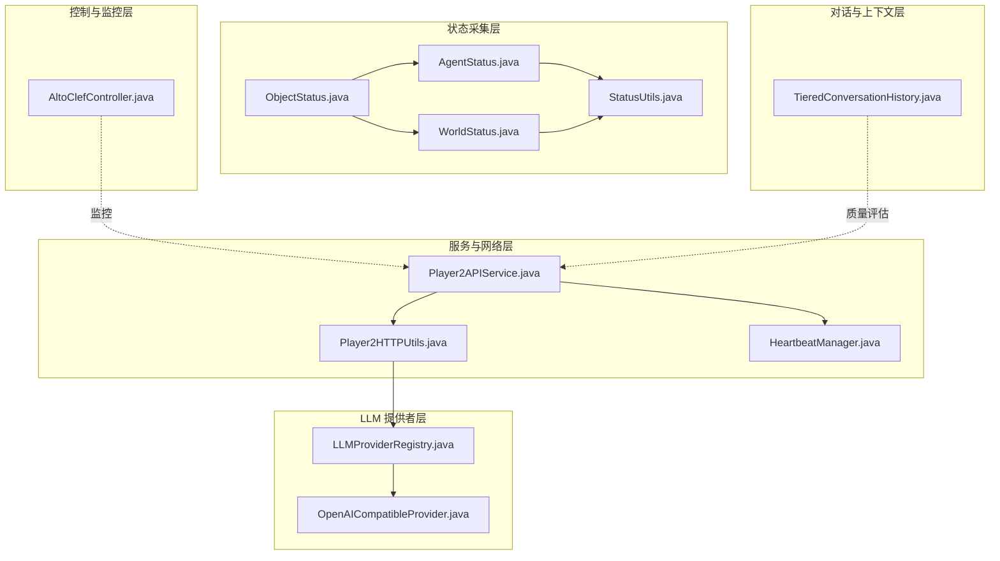
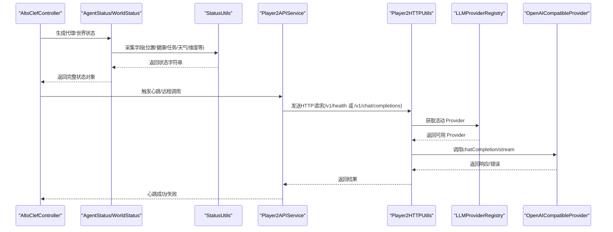
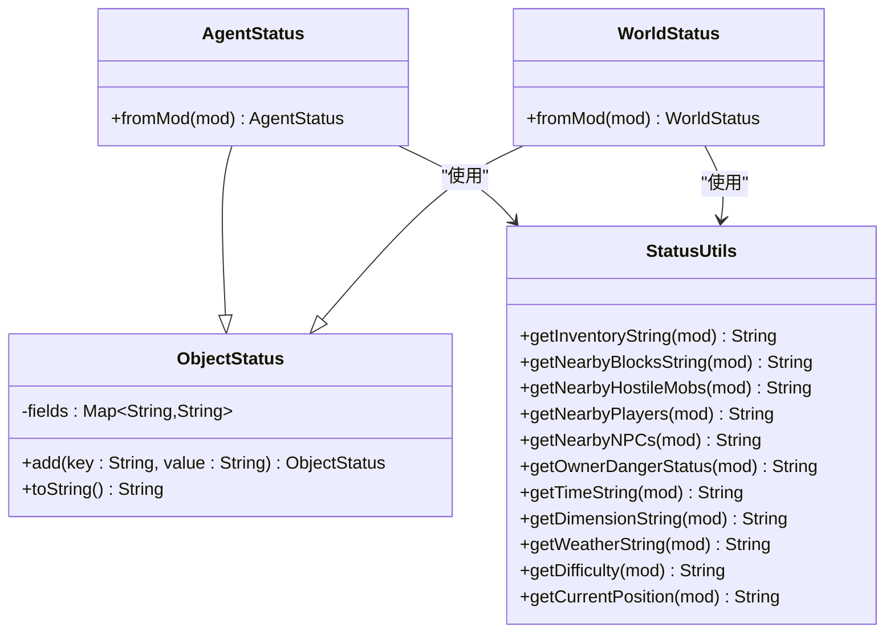
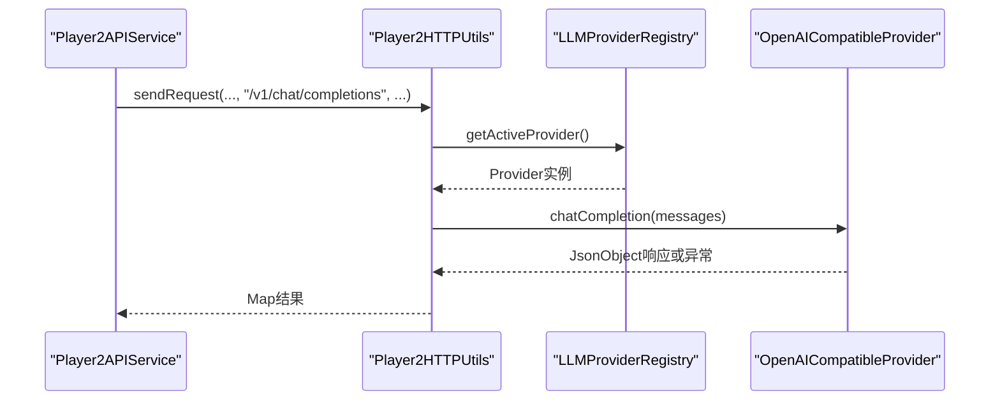
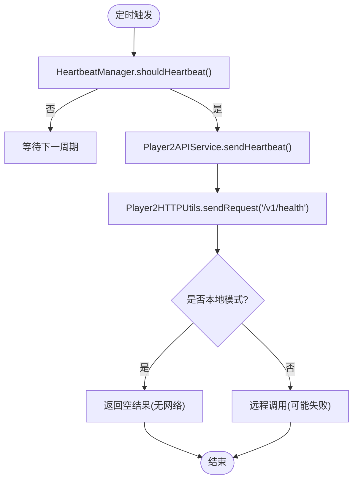
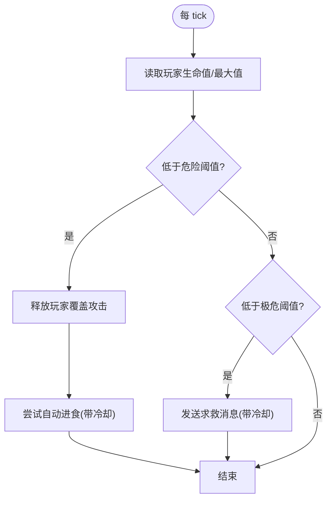
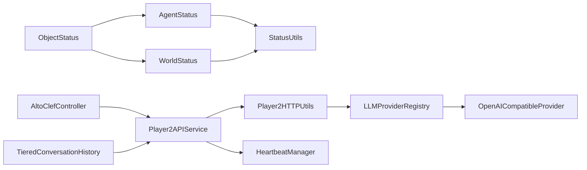

# 健康检查

<cite>
**本文档引用的文件**
- [AgentStatus.java](file://src/main/java/adris/altoclef/player2api/status/AgentStatus.java)
- [ObjectStatus.java](file://src/main/java/adris/altoclef/player2api/status/ObjectStatus.java)
- [WorldStatus.java](file://src/main/java/adris/altoclef/player2api/status/WorldStatus.java)
- [StatusUtils.java](file://src/main/java/adris/altoclef/player2api/status/StatusUtils.java)
- [Player2APIService.java](file://src/main/java/adris/altoclef/player2api/Player2APIService.java)
- [Player2HTTPUtils.java](file://src/main/java/adris/altoclef/player2api/utils/Player2HTTPUtils.java)
- [HeartbeatManager.java](file://src/main/java/adris/altoclef/player2api/manager/HeartbeatManager.java)
- [LLMProviderRegistry.java](file://src/main/java/adris/altoclef/player2api/llm/LLMProviderRegistry.java)
- [OpenAICompatibleProvider.java](file://src/main/java/adris/altoclef/player2api/llm/impl/OpenAICompatibleProvider.java)
- [AltoClefController.java](file://src/main/java/adris/altoclef/AltoClefController.java)
- [TieredConversationHistory.java](file://src/main/java/adris/altoclef/player2api/context/TieredConversationHistory.java)
- [AI_NPC项目整体架构概览.md](file://docs/AI_NPC项目整体架构概览.md)
- [AI_NPC游戏指令系统重构.md](file://docs/AI_NPC游戏指令系统重构.md)
</cite>

## 目录
1. [简介](#简介)
2. [项目结构](#项目结构)
3. [核心组件](#核心组件)
4. [架构总览](#架构总览)
5. [详细组件分析](#详细组件分析)
6. [依赖分析](#依赖分析)
7. [性能考虑](#性能考虑)
8. [故障排查指南](#故障排查指南)
9. [结论](#结论)
10. [附录](#附录)

## 简介
本运维文档聚焦系统健康检查机制，围绕状态管理系统进行深入说明。内容涵盖：
- 状态模型：AgentStatus 代理状态、ObjectStatus 对象状态、WorldStatus 世界状态的层级设计与职责边界
- 健康检查实施：NPC 实体状态监控指标、任务执行成功率统计、LLM 调用状态检查、网络连接状态验证
- 数据采集与分析：实时状态更新、历史状态记录、状态变化告警
- 自动化配置：定期检查任务、阈值参数、异常处理策略
- 健康报告：生成与分析方法，辅助快速定位与解决问题

## 项目结构
健康检查相关代码主要分布在以下模块：
- 状态采集层：status 包下的状态模型与工具
- 服务与网络层：Player2APIService 与 Player2HTTPUtils，负责心跳与远程调用
- LLM 提供者层：LLMProviderRegistry 与具体 Provider，负责推理链健康
- 控制与监控层：AltoClefController 中的生存监控逻辑
- 对话与上下文层：TieredConversationHistory 等用于评估对话质量与稳定性

**图表来源**
- [ObjectStatus.java:1-27](file://src/main/java/adris/altoclef/player2api/status/ObjectStatus.java#L1-L27)
- [AgentStatus.java:1-24](file://src/main/java/adris/altoclef/player2api/status/AgentStatus.java#L1-L24)
- [WorldStatus.java:1-20](file://src/main/java/adris/altoclef/player2api/status/WorldStatus.java#L1-L20)
- [StatusUtils.java:1-322](file://src/main/java/adris/altoclef/player2api/status/StatusUtils.java#L1-L322)
- [Player2APIService.java:240-274](file://src/main/java/adris/altoclef/player2api/Player2APIService.java#L240-L274)
- [Player2HTTPUtils.java:1-152](file://src/main/java/adris/altoclef/player2api/utils/Player2HTTPUtils.java#L1-L152)
- [HeartbeatManager.java:1-46](file://src/main/java/adris/altoclef/player2api/manager/HeartbeatManager.java#L1-L46)
- [LLMProviderRegistry.java:1-79](file://src/main/java/adris/altoclef/player2api/llm/LLMProviderRegistry.java#L1-L79)
- [OpenAICompatibleProvider.java:42-167](file://src/main/java/adris/altoclef/player2api/llm/impl/OpenAICompatibleProvider.java#L42-L167)
- [AltoClefController.java:172-202](file://src/main/java/adris/altoclef/AltoClefController.java#L172-L202)
- [TieredConversationHistory.java:32-146](file://src/main/java/adris/altoclef/player2api/context/TieredConversationHistory.java#L32-L146)

**章节来源**
- [AI_NPC项目整体架构概览.md:61-91](file://docs/AI_NPC项目整体架构概览.md#L61-L91)

## 核心组件
- ObjectStatus：状态对象的基础容器，提供键值对字段添加与 JSON 字符串序列化
- AgentStatus：继承自 ObjectStatus，聚焦 NPC 代理的实时状态（位置、生命值、饥饿/饱和、物品栏、任务状态、氧气、护甲、游戏模式）
- WorldStatus：继承自 ObjectStatus，聚焦世界环境状态（天气、维度、出生点、附近方块、敌对生物、附近玩家/NPC、主人危险等级、难度、时间信息）
- StatusUtils：状态采集工具集，封装从控制器读取各类状态的函数，包含近邻实体统计、距离计算、难度与时间信息等
- Player2APIService：统一 API 服务入口，提供心跳发送与 STT 控制
- Player2HTTPUtils：HTTP 工具，负责路由 LLM 请求到可配置 Provider，以及在本地模式下对健康/心跳等端点的处理
- HeartbeatManager：心跳节流与存储，避免过于频繁的心跳
- LLMProviderRegistry：LLM 提供者注册表，支持动态选择可用 Provider
- OpenAICompatibleProvider：通用 OpenAI 兼容实现，负责 HTTP 请求构建、响应解析与错误处理
- AltoClefController：核心控制器，包含生存监控逻辑（低血量自动进食、求救提示）
- TieredConversationHistory：对话历史压缩与重要性评估，辅助健康指标中的“对话质量”观测

**章节来源**
- [ObjectStatus.java:1-27](file://src/main/java/adris/altoclef/player2api/status/ObjectStatus.java#L1-L27)
- [AgentStatus.java:1-24](file://src/main/java/adris/altoclef/player2api/status/AgentStatus.java#L1-L24)
- [WorldStatus.java:1-20](file://src/main/java/adris/altoclef/player2api/status/WorldStatus.java#L1-L20)
- [StatusUtils.java:1-322](file://src/main/java/adris/altoclef/player2api/status/StatusUtils.java#L1-L322)
- [Player2APIService.java:240-274](file://src/main/java/adris/altoclef/player2api/Player2APIService.java#L240-L274)
- [Player2HTTPUtils.java:1-152](file://src/main/java/adris/altoclef/player2api/utils/Player2HTTPUtils.java#L1-L152)
- [HeartbeatManager.java:1-46](file://src/main/java/adris/altoclef/player2api/manager/HeartbeatManager.java#L1-L46)
- [LLMProviderRegistry.java:1-79](file://src/main/java/adris/altoclef/player2api/llm/LLMProviderRegistry.java#L1-L79)
- [OpenAICompatibleProvider.java:42-167](file://src/main/java/adris/altoclef/player2api/llm/impl/OpenAICompatibleProvider.java#L42-L167)
- [AltoClefController.java:172-202](file://src/main/java/adris/altoclef/AltoClefController.java#L172-L202)
- [TieredConversationHistory.java:32-146](file://src/main/java/adris/altoclef/player2api/context/TieredConversationHistory.java#L32-L146)

## 架构总览
健康检查体系由“状态采集-服务路由-提供者执行-控制监控-质量评估”构成闭环。

**图表来源**
- [AgentStatus.java:1-24](file://src/main/java/adris/altoclef/player2api/status/AgentStatus.java#L1-L24)
- [WorldStatus.java:1-20](file://src/main/java/adris/altoclef/player2api/status/WorldStatus.java#L1-L20)
- [StatusUtils.java:1-322](file://src/main/java/adris/altoclef/player2api/status/StatusUtils.java#L1-L322)
- [Player2APIService.java:240-274](file://src/main/java/adris/altoclef/player2api/Player2APIService.java#L240-L274)
- [Player2HTTPUtils.java:1-152](file://src/main/java/adris/altoclef/player2api/utils/Player2HTTPUtils.java#L1-L152)
- [LLMProviderRegistry.java:1-79](file://src/main/java/adris/altoclef/player2api/llm/LLMProviderRegistry.java#L1-L79)
- [OpenAICompatibleProvider.java:42-167](file://src/main/java/adris/altoclef/player2api/llm/impl/OpenAICompatibleProvider.java#L42-L167)

## 详细组件分析

### 状态模型与采集
- ObjectStatus：提供 add(key, value) 与 toString() 序列化，作为 AgentStatus/WorldStatus 的父类
- AgentStatus：从控制器读取玩家位置、生命值、饥饿/饱和、物品栏、任务状态、氧气、护甲、游戏模式等字段
- WorldStatus：从控制器读取天气、维度、出生点、附近方块、敌对生物、附近玩家/NPC、主人危险等级、难度、时间信息等字段
- StatusUtils：提供大量采集函数，包括近邻方块统计（限制类型数量）、敌对生物排序（按距离）、附近玩家/NPC过滤、难度与时间信息、位置与距离计算等

**图表来源**
- [ObjectStatus.java:1-27](file://src/main/java/adris/altoclef/player2api/status/ObjectStatus.java#L1-L27)
- [AgentStatus.java:1-24](file://src/main/java/adris/altoclef/player2api/status/AgentStatus.java#L1-L24)
- [WorldStatus.java:1-20](file://src/main/java/adris/altoclef/player2api/status/WorldStatus.java#L1-L20)
- [StatusUtils.java:1-322](file://src/main/java/adris/altoclef/player2api/status/StatusUtils.java#L1-L322)

**章节来源**
- [ObjectStatus.java:1-27](file://src/main/java/adris/altoclef/player2api/status/ObjectStatus.java#L1-L27)
- [AgentStatus.java:1-24](file://src/main/java/adris/altoclef/player2api/status/AgentStatus.java#L1-L24)
- [WorldStatus.java:1-20](file://src/main/java/adris/altoclef/player2api/status/WorldStatus.java#L1-L20)
- [StatusUtils.java:28-322](file://src/main/java/adris/altoclef/player2api/status/StatusUtils.java#L28-L322)

### LLM 调用健康检查
- Provider 选择：LLMProviderRegistry 根据配置选择活动 Provider，若配置不可用则回退到首个可用 Provider
- 请求构建：OpenAICompatibleProvider 统一构建请求体（模型、消息、max_tokens、temperature、stream），并处理响应与错误
- 错误处理：HTTP 状态码不在 2xx 时抛出异常并记录错误日志；成功时记录请求/响应日志
- 本地模式：Player2HTTPUtils 在本地模式下对 /v1/health 等端点返回空结果，避免外部依赖

**图表来源**
- [Player2APIService.java:240-274](file://src/main/java/adris/altoclef/player2api/Player2APIService.java#L240-L274)
- [Player2HTTPUtils.java:45-112](file://src/main/java/adris/altoclef/player2api/utils/Player2HTTPUtils.java#L45-L112)
- [LLMProviderRegistry.java:49-79](file://src/main/java/adris/altoclef/player2api/llm/LLMProviderRegistry.java#L49-L79)
- [OpenAICompatibleProvider.java:112-141](file://src/main/java/adris/altoclef/player2api/llm/impl/OpenAICompatibleProvider.java#L112-L141)

**章节来源**
- [LLMProviderRegistry.java:1-79](file://src/main/java/adris/altoclef/player2api/llm/LLMProviderRegistry.java#L1-L79)
- [OpenAICompatibleProvider.java:42-167](file://src/main/java/adris/altoclef/player2api/llm/impl/OpenAICompatibleProvider.java#L42-L167)
- [Player2HTTPUtils.java:45-112](file://src/main/java/adris/altoclef/player2api/utils/Player2HTTPUtils.java#L45-L112)

### 网络连接与心跳健康
- 心跳节流：HeartbeatManager 以纳秒为单位记录上次心跳时间，超过 60 秒才允许再次心跳
- 心跳发送：Player2APIService.trySendHeartbeat() 在满足节流条件时调用 sendHeartbeat()，后者通过 Player2HTTPUtils 发送 /v1/health 请求
- 本地模式处理：在非 player2-remote 模式下，/v1/health 返回空结果，避免外部网络依赖

**图表来源**
- [HeartbeatManager.java:30-41](file://src/main/java/adris/altoclef/player2api/manager/HeartbeatManager.java#L30-L41)
- [Player2APIService.java:258-273](file://src/main/java/adris/altoclef/player2api/Player2APIService.java#L258-L273)
- [Player2HTTPUtils.java:72-87](file://src/main/java/adris/altoclef/player2api/utils/Player2HTTPUtils.java#L72-L87)

**章节来源**
- [HeartbeatManager.java:1-46](file://src/main/java/adris/altoclef/player2api/manager/HeartbeatManager.java#L1-L46)
- [Player2APIService.java:258-273](file://src/main/java/adris/altoclef/player2api/Player2APIService.java#L258-L273)
- [Player2HTTPUtils.java:72-87](file://src/main/java/adris/altoclef/player2api/utils/Player2HTTPUtils.java#L72-L87)

### NPC 实体状态监控
- 生存监控：AltoClefController.tickSurvivalMonitor() 在低血量时释放玩家覆盖攻击权限、触发自动进食；在极低血量时发送求救消息
- 状态字段：AgentStatus 聚合位置、生命值、饥饿/饱和、物品栏、任务状态、氧气、护甲、游戏模式等
- 世界状态：WorldStatus 聚合天气、维度、出生点、附近方块、敌对生物、附近玩家/NPC、主人危险等级、难度、时间信息等

**图表来源**
- [AltoClefController.java:172-202](file://src/main/java/adris/altoclef/AltoClefController.java#L172-L202)
- [AgentStatus.java:7-22](file://src/main/java/adris/altoclef/player2api/status/AgentStatus.java#L7-L22)
- [WorldStatus.java:6-18](file://src/main/java/adris/altoclef/player2api/status/WorldStatus.java#L6-L18)

**章节来源**
- [AltoClefController.java:172-202](file://src/main/java/adris/altoclef/AltoClefController.java#L172-L202)
- [AgentStatus.java:1-24](file://src/main/java/adris/altoclef/player2api/status/AgentStatus.java#L1-L24)
- [WorldStatus.java:1-20](file://src/main/java/adris/altoclef/player2api/status/WorldStatus.java#L1-L20)

### 任务执行成功率统计
- 统计维度：执行开始/执行完成（参考重构文档中的“命令执行成功率”）
- 采集点：UserTaskChain.onTaskFinish 等任务完成回调
- 建议指标：成功率 = 完成数 / 开始数，中断率 = 被 MobDefenseChain 打断数 / 总任务数

**章节来源**
- [AI_NPC游戏指令系统重构.md:1394-1401](file://docs/AI_NPC游戏指令系统重构.md#L1394-L1401)

### 对话质量与健康指标
- 对话历史压缩：TieredConversationHistory 将 NORMAL 消息压缩为 mini 摘要，保留 CRITICAL/HIGH，丢弃 LOW，有助于控制上下文长度与成本
- 重要性评估：根据角色、内容长度、是否包含命令结果等规则评估消息重要性，辅助健康指标中的“端到端成功率”与“平均响应延迟”

**章节来源**
- [TieredConversationHistory.java:32-146](file://src/main/java/adris/altoclef/player2api/context/TieredConversationHistory.java#L32-L146)
- [AI_NPC游戏指令系统重构.md:1394-1401](file://docs/AI_NPC游戏指令系统重构.md#L1394-L1401)

## 依赖分析
- 状态模型依赖关系简单清晰：AgentStatus/WorldStatus 继承 ObjectStatus，均依赖 StatusUtils 进行字段采集
- 服务层依赖：Player2APIService 依赖 Player2HTTPUtils 进行网络请求；在 LLM 调用场景下，Player2HTTPUtils 依赖 LLMProviderRegistry 与具体 Provider
- 心跳依赖：Player2APIService 依赖 HeartbeatManager 进行节流控制
- 控制层依赖：AltoClefController 依赖多个子系统，其中生存监控逻辑直接作用于 NPC 行为链

**图表来源**
- [ObjectStatus.java:1-27](file://src/main/java/adris/altoclef/player2api/status/ObjectStatus.java#L1-L27)
- [AgentStatus.java:1-24](file://src/main/java/adris/altoclef/player2api/status/AgentStatus.java#L1-L24)
- [WorldStatus.java:1-20](file://src/main/java/adris/altoclef/player2api/status/WorldStatus.java#L1-L20)
- [StatusUtils.java:1-322](file://src/main/java/adris/altoclef/player2api/status/StatusUtils.java#L1-L322)
- [Player2APIService.java:240-274](file://src/main/java/adris/altoclef/player2api/Player2APIService.java#L240-L274)
- [Player2HTTPUtils.java:1-152](file://src/main/java/adris/altoclef/player2api/utils/Player2HTTPUtils.java#L1-L152)
- [LLMProviderRegistry.java:1-79](file://src/main/java/adris/altoclef/player2api/llm/LLMProviderRegistry.java#L1-L79)
- [OpenAICompatibleProvider.java:42-167](file://src/main/java/adris/altoclef/player2api/llm/impl/OpenAICompatibleProvider.java#L42-L167)
- [HeartbeatManager.java:1-46](file://src/main/java/adris/altoclef/player2api/manager/HeartbeatManager.java#L1-L46)
- [AltoClefController.java:172-202](file://src/main/java/adris/altoclef/AltoClefController.java#L172-L202)
- [TieredConversationHistory.java:32-146](file://src/main/java/adris/altoclef/player2api/context/TieredConversationHistory.java#L32-L146)

**章节来源**
- [AI_NPC项目整体架构概览.md:284-318](file://docs/AI_NPC项目整体架构概览.md#L284-L318)

## 性能考虑
- 异步处理：LLM 与 TTS 采用独立线程池，避免阻塞主线程（见架构概览）
- 上下文压缩：TieredConversationHistory 对 NORMAL 消息进行压缩，降低 token 消耗与延迟
- 采样与限制：StatusUtils 对近邻方块类型与敌对生物数量进行上限控制，避免提示过大导致成本与延迟上升
- 心跳节流：HeartbeatManager 限制心跳频率，减少网络压力

[本节为通用性能讨论，不直接分析具体文件]

## 故障排查指南
- LLM 调用失败
  - 现象：Provider 抛出异常或 HTTP 非 2xx
  - 排查：检查 Provider 配置、API Key、代理设置；查看日志中的请求/响应
  - 参考
    - [OpenAICompatibleProvider.java:112-141](file://src/main/java/adris/altoclef/player2api/llm/impl/OpenAICompatibleProvider.java#L112-L141)
    - [LLMProviderRegistry.java:49-79](file://src/main/java/adris/altoclef/player2api/llm/LLMProviderRegistry.java#L49-L79)
- 心跳失败
  - 现象：sendHeartbeat 抛出异常
  - 排查：确认网络连通性；检查本地模式配置；查看节流是否生效
  - 参考
    - [Player2APIService.java:258-273](file://src/main/java/adris/altoclef/player2api/Player2APIService.java#L258-L273)
    - [Player2HTTPUtils.java:72-87](file://src/main/java/adris/altoclef/player2api/utils/Player2HTTPUtils.java#L72-L87)
    - [HeartbeatManager.java:30-41](file://src/main/java/adris/altoclef/player2api/manager/HeartbeatManager.java#L30-L41)
- NPC 低血量异常
  - 现象：自动进食未触发或求救消息过于频繁
  - 排查：检查阈值与冷却时间；确认 MobDefenseChain 是否释放了玩家覆盖
  - 参考
    - [AltoClefController.java:172-202](file://src/main/java/adris/altoclef/AltoClefController.java#L172-L202)
- 对话质量下降
  - 现象：端到端成功率低、平均响应延迟高
  - 排查：检查 STT 准确率、命令映射准确率、JSON 解析成功率；评估对话历史压缩效果
  - 参考
    - [AI_NPC游戏指令系统重构.md:1394-1401](file://docs/AI_NPC游戏指令系统重构.md#L1394-L1401)
    - [TieredConversationHistory.java:114-139](file://src/main/java/adris/altoclef/player2api/context/TieredConversationHistory.java#L114-L139)

**章节来源**
- [OpenAICompatibleProvider.java:112-141](file://src/main/java/adris/altoclef/player2api/llm/impl/OpenAICompatibleProvider.java#L112-L141)
- [LLMProviderRegistry.java:49-79](file://src/main/java/adris/altoclef/player2api/llm/LLMProviderRegistry.java#L49-L79)
- [Player2APIService.java:258-273](file://src/main/java/adris/altoclef/player2api/Player2APIService.java#L258-L273)
- [Player2HTTPUtils.java:72-87](file://src/main/java/adris/altoclef/player2api/utils/Player2HTTPUtils.java#L72-L87)
- [HeartbeatManager.java:30-41](file://src/main/java/adris/altoclef/player2api/manager/HeartbeatManager.java#L30-L41)
- [AltoClefController.java:172-202](file://src/main/java/adris/altoclef/AltoClefController.java#L172-L202)
- [AI_NPC游戏指令系统重构.md:1394-1401](file://docs/AI_NPC游戏指令系统重构.md#L1394-L1401)
- [TieredConversationHistory.java:114-139](file://src/main/java/adris/altoclef/player2api/context/TieredConversationHistory.java#L114-L139)

## 结论
本健康检查体系通过“状态模型采集 + 服务路由 + 提供者执行 + 控制监控 + 质量评估”的闭环，实现了对 NPC 实体状态、世界环境、LLM 调用与网络连接的全面监控。建议在生产环境中：
- 设置定期心跳与状态上报任务
- 配置合理的阈值与冷却时间
- 建立基于日志与指标的告警机制
- 持续优化对话历史压缩与采样策略

[本节为总结性内容，不直接分析具体文件]

## 附录
- 自动化配置建议
  - 定时任务：每分钟心跳一次，状态采集每 5 秒一次
  - 阈值参数：低血量阈值、极危阈值、自动进食冷却、求救冷却、心跳节流窗口
  - 异常处理：Provider 不可用时自动回退；心跳失败时记录并通知
- 健康报告生成
  - 指标汇总：成功率、中断率、平均延迟、锁等待时间、STT/JSON/命令准确率
  - 告警策略：超过阈值即告警，支持分级（警告/严重）

[本节为通用运维建议，不直接分析具体文件]