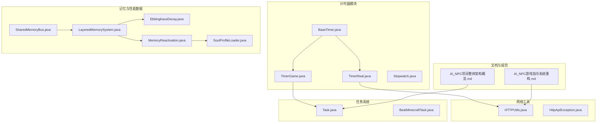
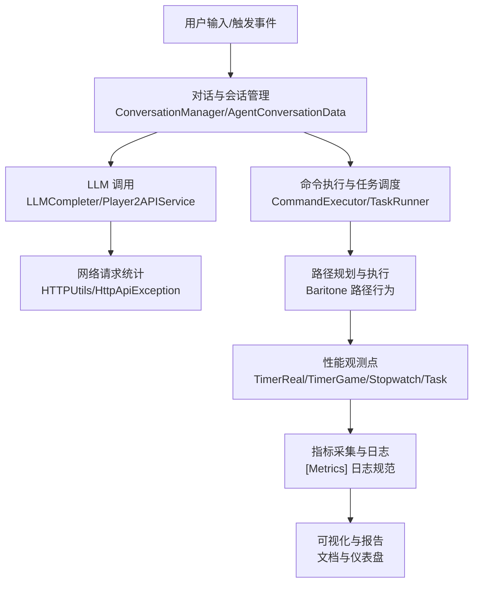
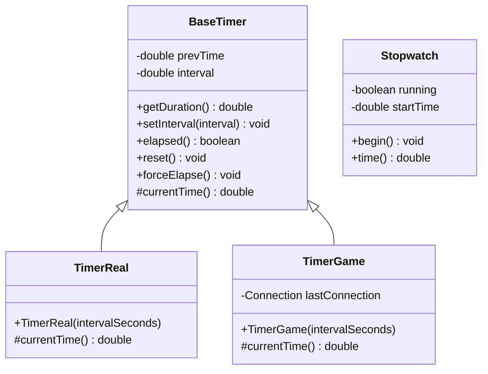
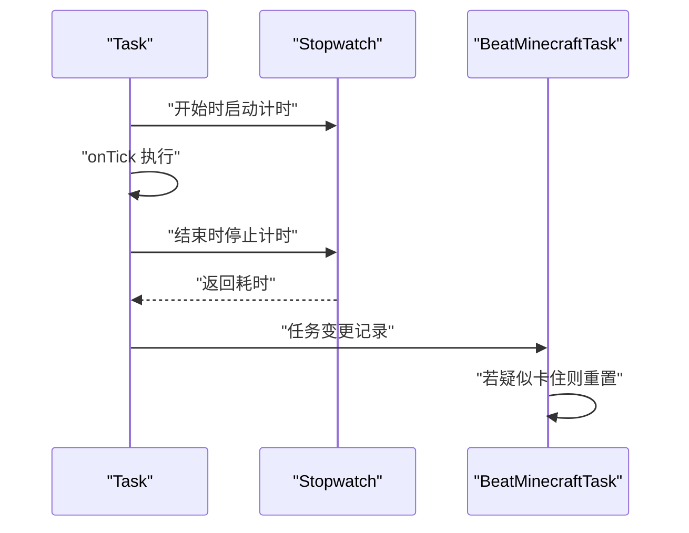
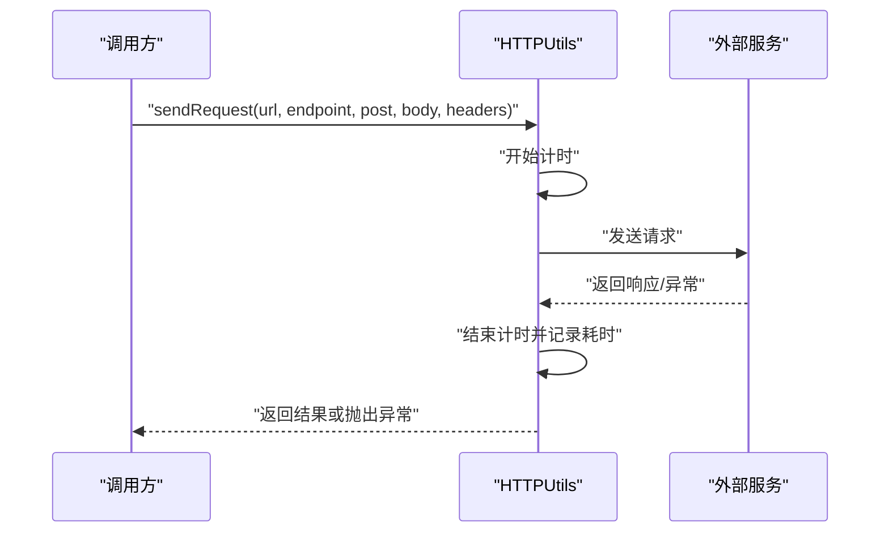
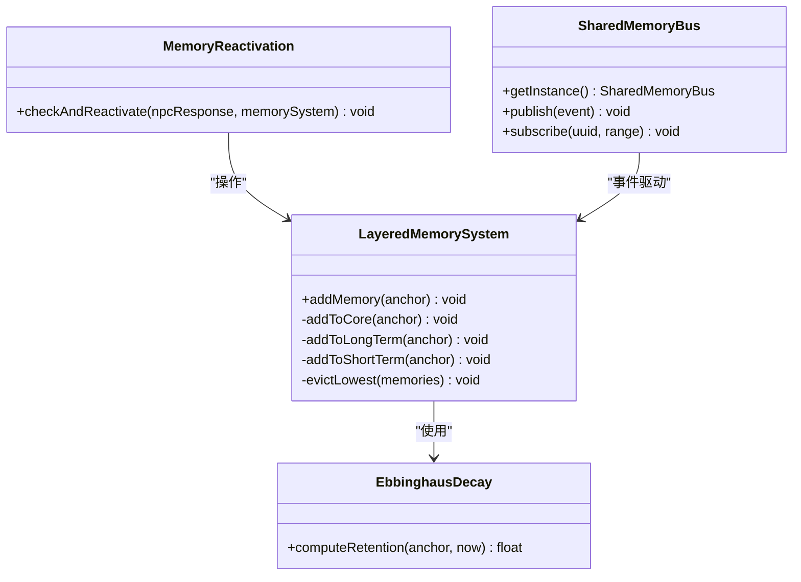
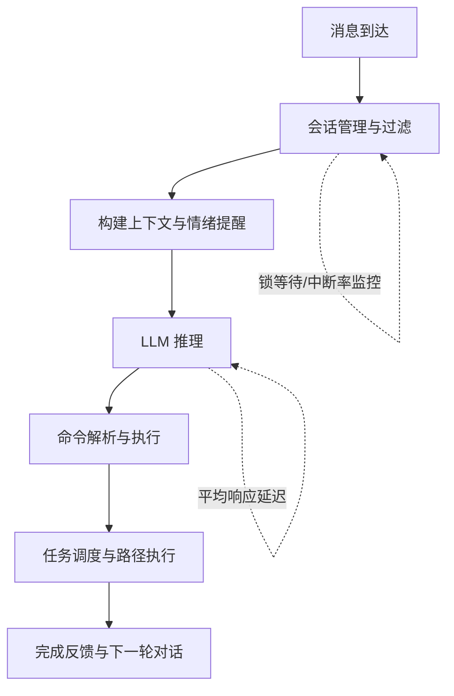
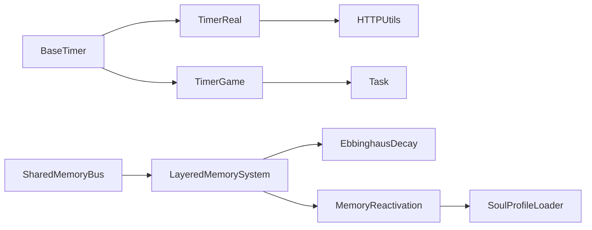

# 性能监控

<cite>
**本文档引用的文件**
- [BaseTimer.java](file://src/main/java/adris/altoclef/util/time/BaseTimer.java)
- [TimerReal.java](file://src/main/java/adris/altoclef/util/time/TimerReal.java)
- [TimerGame.java](file://src/main/java/adris/altoclef/util/time/TimerGame.java)
- [Stopwatch.java](file://src/main/java/adris/altoclef/util/time/Stopwatch.java)
- [Debug.java](file://src/main/java/adris/altoclef/Debug.java)
- [AI_NPC游戏指令系统重构.md](file://docs/AI_NPC游戏指令系统重构.md)
- [AI_NPC项目整体架构概览.md](file://docs/AI_NPC项目整体架构概览.md)
- [HTTPUtils.java](file://src/main/java/adris/altoclef/player2api/utils/HTTPUtils.java)
- [HttpApiException.java](file://src/main/java/adris/altoclef/player2api/utils/HttpApiException.java)
- [LayeredMemorySystem.java](file://src/main/java/adris/altoclef/player2api/memory/LayeredMemorySystem.java)
- [EbbinghausDecay.java](file://src/main/java/adris/altoclef/player2api/memory/EbbinghausDecay.java)
- [MemoryReactivation.java](file://src/main/java/adris/altoclef/player2api/memory/MemoryReactivation.java)
- [SharedMemoryBus.java](file://src/main/java/adris/altoclef/player2api/memory/SharedMemoryBus.java)
- [SoulProfileLoader.java](file://src/main/java/adris/altoclef/player2api/soul/SoulProfileLoader.java)
- [Task.java](file://src/main/java/adris/altoclef/tasksystem/Task.java)
- [BeatMinecraftTask.java](file://src/main/java/adris/altoclef/tasks/speedrun/beatgame/BeatMinecraftTask.java)
</cite>

## 目录
1. [简介](#简介)
2. [项目结构](#项目结构)
3. [核心组件](#核心组件)
4. [架构总览](#架构总览)
5. [详细组件分析](#详细组件分析)
6. [依赖分析](#依赖分析)
7. [性能考量](#性能考量)
8. [故障排查指南](#故障排查指南)
9. [结论](#结论)
10. [附录](#附录)

## 简介
本技术文档围绕性能监控系统展开，重点覆盖以下方面：
- 时间计时器实现架构：BaseTimer 基类设计理念、Stopwatch 游戏时间计时器、TimerGame 游戏内计时器、TimerReal 真实时间计时器的功能差异与适用场景。
- 性能指标采集：任务执行时间测量、内存使用跟踪、CPU 占用监测、网络请求延迟统计等关键性能数据的获取与分析方法。
- AI NPC 系统中的性能评估：任务执行效率、LLM 调用性能、路径规划计算耗时等核心功能的监控与优化。
- 性能优化指导：瓶颈识别、调优策略、资源使用优化与可视化展示、报告生成方法。

## 项目结构
本项目采用模块化组织，与性能监控直接相关的模块主要集中在 util/time（计时器）、player2api/utils（网络工具）、player2api/memory（记忆与性能相关数据结构）、tasksystem（任务执行）、以及 docs（指标与监控规范）。

图表来源
- [BaseTimer.java:1-40](file://src/main/java/adris/altoclef/util/time/BaseTimer.java#L1-L40)
- [TimerReal.java:1-12](file://src/main/java/adris/altoclef/util/time/TimerReal.java#L1-L12)
- [TimerGame.java:1-44](file://src/main/java/adris/altoclef/util/time/TimerGame.java#L1-L44)
- [Stopwatch.java:1-19](file://src/main/java/adris/altoclef/util/time/Stopwatch.java#L1-L19)
- [HTTPUtils.java:1-38](file://src/main/java/adris/altoclef/player2api/utils/HTTPUtils.java#L1-L38)
- [HttpApiException.java:1-33](file://src/main/java/adris/altoclef/player2api/utils/HttpApiException.java#L1-L33)
- [LayeredMemorySystem.java:1-70](file://src/main/java/adris/altoclef/player2api/memory/LayeredMemorySystem.java#L1-L70)
- [EbbinghausDecay.java:1-32](file://src/main/java/adris/altoclef/player2api/memory/EbbinghausDecay.java#L1-L32)
- [MemoryReactivation.java:1-36](file://src/main/java/adris/altoclef/player2api/memory/MemoryReactivation.java#L1-L36)
- [SharedMemoryBus.java:1-43](file://src/main/java/adris/altoclef/player2api/memory/SharedMemoryBus.java#L1-L43)
- [SoulProfileLoader.java:92-106](file://src/main/java/adris/altoclef/player2api/soul/SoulProfileLoader.java#L92-L106)
- [Task.java:41-180](file://src/main/java/adris/altoclef/tasksystem/Task.java#L41-L180)
- [BeatMinecraftTask.java:1860-1874](file://src/main/java/adris/altoclef/tasks/speedrun/beatgame/BeatMinecraftTask.java#L1860-L1874)
- [AI_NPC游戏指令系统重构.md:1385-1415](file://docs/AI_NPC游戏指令系统重构.md#L1385-L1415)
- [AI_NPC项目整体架构概览.md:443-474](file://docs/AI_NPC项目整体架构概览.md#L443-L474)

章节来源
- [BaseTimer.java:1-40](file://src/main/java/adris/altoclef/util/time/BaseTimer.java#L1-L40)
- [TimerReal.java:1-12](file://src/main/java/adris/altoclef/util/time/TimerReal.java#L1-L12)
- [TimerGame.java:1-44](file://src/main/java/adris/altoclef/util/time/TimerGame.java#L1-L44)
- [Stopwatch.java:1-19](file://src/main/java/adris/altoclef/util/time/Stopwatch.java#L1-L19)
- [HTTPUtils.java:1-38](file://src/main/java/adris/altoclef/player2api/utils/HTTPUtils.java#L1-L38)
- [HttpApiException.java:1-33](file://src/main/java/adris/altoclef/player2api/utils/HttpApiException.java#L1-L33)
- [LayeredMemorySystem.java:1-70](file://src/main/java/adris/altoclef/player2api/memory/LayeredMemorySystem.java#L1-L70)
- [EbbinghausDecay.java:1-32](file://src/main/java/adris/altoclef/player2api/memory/EbbinghausDecay.java#L1-L32)
- [MemoryReactivation.java:1-36](file://src/main/java/adris/altoclef/player2api/memory/MemoryReactivation.java#L1-L36)
- [SharedMemoryBus.java:1-43](file://src/main/java/adris/altoclef/player2api/memory/SharedMemoryBus.java#L1-L43)
- [SoulProfileLoader.java:92-106](file://src/main/java/adris/altoclef/player2api/soul/SoulProfileLoader.java#L92-L106)
- [Task.java:41-180](file://src/main/java/adris/altoclef/tasksystem/Task.java#L41-L180)
- [BeatMinecraftTask.java:1860-1874](file://src/main/java/adris/altoclef/tasks/speedrun/beatgame/BeatMinecraftTask.java#L1860-L1874)
- [AI_NPC游戏指令系统重构.md:1385-1415](file://docs/AI_NPC游戏指令系统重构.md#L1385-L1415)
- [AI_NPC项目整体架构概览.md:443-474](file://docs/AI_NPC项目整体架构概览.md#L443-L474)

## 核心组件
- 计时器基类与派生类：BaseTimer 提供统一的时间轮询与间隔判断能力；TimerReal 基于系统真实时间；TimerGame 基于游戏刻（tick）换算的“游戏内时间”；Stopwatch 提供简单易用的运行时长统计。
- 网络工具：HTTPUtils 封装 HTTP 请求，便于对 LLM 或外部服务进行延迟统计与错误处理。
- 记忆与性能数据：LayeredMemorySystem、EbbinghausDecay、MemoryReactivation、SharedMemoryBus 与 SoulProfileLoader 提供记忆生命周期与性能相关数据结构，支撑性能分析与优化。
- 任务系统：Task 与 BeatMinecraftTask 提供任务执行状态、超时与卡顿检测，是性能评估的重要观测点。
- 文档与规范：AI_NPC游戏指令系统重构.md 明确了核心指标与采集点；AI_NPC项目整体架构概览.md 展示了异步路径计算等性能优化措施。

章节来源
- [BaseTimer.java:1-40](file://src/main/java/adris/altoclef/util/time/BaseTimer.java#L1-L40)
- [TimerReal.java:1-12](file://src/main/java/adris/altoclef/util/time/TimerReal.java#L1-L12)
- [TimerGame.java:1-44](file://src/main/java/adris/altoclef/util/time/TimerGame.java#L1-L44)
- [Stopwatch.java:1-19](file://src/main/java/adris/altoclef/util/time/Stopwatch.java#L1-L19)
- [HTTPUtils.java:1-38](file://src/main/java/adris/altoclef/player2api/utils/HTTPUtils.java#L1-L38)
- [HttpApiException.java:1-33](file://src/main/java/adris/altoclef/player2api/utils/HttpApiException.java#L1-L33)
- [LayeredMemorySystem.java:1-70](file://src/main/java/adris/altoclef/player2api/memory/LayeredMemorySystem.java#L1-L70)
- [EbbinghausDecay.java:1-32](file://src/main/java/adris/altoclef/player2api/memory/EbbinghausDecay.java#L1-L32)
- [MemoryReactivation.java:1-36](file://src/main/java/adris/altoclef/player2api/memory/MemoryReactivation.java#L1-L36)
- [SharedMemoryBus.java:1-43](file://src/main/java/adris/altoclef/player2api/memory/SharedMemoryBus.java#L1-L43)
- [SoulProfileLoader.java:92-106](file://src/main/java/adris/altoclef/player2api/soul/SoulProfileLoader.java#L92-L106)
- [Task.java:41-180](file://src/main/java/adris/altoclef/tasksystem/Task.java#L41-L180)
- [BeatMinecraftTask.java:1860-1874](file://src/main/java/adris/altoclef/tasks/speedrun/beatgame/BeatMinecraftTask.java#L1860-L1874)
- [AI_NPC游戏指令系统重构.md:1385-1415](file://docs/AI_NPC游戏指令系统重构.md#L1385-L1415)
- [AI_NPC项目整体架构概览.md:443-474](file://docs/AI_NPC项目整体架构概览.md#L443-L474)

## 架构总览
性能监控贯穿从用户输入到任务执行的全链路，计时器用于度量各阶段耗时，网络工具用于统计 LLM/外部接口延迟，任务系统提供卡顿与超时观测点，记忆系统承载性能相关数据结构。

图表来源
- [AI_NPC项目整体架构概览.md:701-773](file://docs/AI_NPC项目整体架构概览.md#L701-L773)
- [HTTPUtils.java:1-38](file://src/main/java/adris/altoclef/player2api/utils/HTTPUtils.java#L1-L38)
- [HttpApiException.java:1-33](file://src/main/java/adris/altoclef/player2api/utils/HttpApiException.java#L1-L33)
- [Task.java:41-180](file://src/main/java/adris/altoclef/tasksystem/Task.java#L41-L180)
- [AI_NPC游戏指令系统重构.md:1385-1415](file://docs/AI_NPC游戏指令系统重构.md#L1385-L1415)

## 详细组件分析

### 计时器体系：BaseTimer、TimerReal、TimerGame、Stopwatch
- 设计理念
  - BaseTimer 抽象出“当前时刻”与“上一时刻”的差值计算、间隔设置、是否到期、重置与强制过期等通用逻辑，通过抽象方法 currentTime() 将时间源解耦。
  - TimerReal 基于系统毫秒时间，适合跨会话、跨游戏状态的绝对时间度量。
  - TimerGame 基于游戏连接的 tick 数换算为秒，适合在游戏内以“游戏时间”为单位的度量，并在连接切换时进行偏移补偿，保证连续性。
  - Stopwatch 提供轻量级运行时长统计，适合短时、局部的耗时测量。
- 使用场景
  - 任务执行时间测量：在任务 onStart/onTick/onStop 区间使用 Stopwatch 或 TimerReal 记录单次任务耗时。
  - LLM 调用延迟：在 HTTP 请求前后使用 TimerReal 记录端到端延迟。
  - 路径规划耗时：在路径计算开始与结束处使用 TimerReal/Stopwatch 记录 A* 搜索与路径执行阶段耗时。
  - 游戏内节奏控制：使用 TimerGame 控制基于游戏刻的周期性行为，避免受帧率影响。

图表来源
- [BaseTimer.java:1-40](file://src/main/java/adris/altoclef/util/time/BaseTimer.java#L1-L40)
- [TimerReal.java:1-12](file://src/main/java/adris/altoclef/util/time/TimerReal.java#L1-L12)
- [TimerGame.java:1-44](file://src/main/java/adris/altoclef/util/time/TimerGame.java#L1-L44)
- [Stopwatch.java:1-19](file://src/main/java/adris/altoclef/util/time/Stopwatch.java#L1-L19)

章节来源
- [BaseTimer.java:1-40](file://src/main/java/adris/altoclef/util/time/BaseTimer.java#L1-L40)
- [TimerReal.java:1-12](file://src/main/java/adris/altoclef/util/time/TimerReal.java#L1-L12)
- [TimerGame.java:1-44](file://src/main/java/adris/altoclef/util/time/TimerGame.java#L1-L44)
- [Stopwatch.java:1-19](file://src/main/java/adris/altoclef/util/time/Stopwatch.java#L1-L19)

### 任务执行时间测量与卡顿检测
- 任务生命周期：Task 提供 onStart/onTick/onStop 等钩子，可在这些节点插入 Stopwatch/TimerReal 进行耗时统计。
- 卡顿与超时：BeatMinecraftTask 中使用计时器与任务变更历史进行“可能卡住”的判定，结合 forcedTaskTimer.reset() 进行强制重置，有助于定位路径规划或任务切换异常。

图表来源
- [Task.java:41-180](file://src/main/java/adris/altoclef/tasksystem/Task.java#L41-L180)
- [BeatMinecraftTask.java:1860-1874](file://src/main/java/adris/altoclef/tasks/speedrun/beatgame/BeatMinecraftTask.java#L1860-L1874)

章节来源
- [Task.java:41-180](file://src/main/java/adris/altoclef/tasksystem/Task.java#L41-L180)
- [BeatMinecraftTask.java:1860-1874](file://src/main/java/adris/altoclef/tasks/speedrun/beatgame/BeatMinecraftTask.java#L1860-L1874)

### 网络请求延迟统计与错误处理
- HTTP 请求封装：HTTPUtils 统一封装 GET/POST 请求，便于在请求前后插入计时器，统计端到端延迟。
- 错误处理：HttpApiException 提供状态码访问，便于在监控中区分网络错误与业务错误。

图表来源
- [HTTPUtils.java:1-38](file://src/main/java/adris/altoclef/player2api/utils/HTTPUtils.java#L1-L38)
- [HttpApiException.java:1-33](file://src/main/java/adris/altoclef/player2api/utils/HttpApiException.java#L1-L33)

章节来源
- [HTTPUtils.java:1-38](file://src/main/java/adris/altoclef/player2api/utils/HTTPUtils.java#L1-L38)
- [HttpApiException.java:1-33](file://src/main/java/adris/altoclef/player2api/utils/HttpApiException.java#L1-L33)

### 记忆系统与性能数据结构
- 分层记忆：LayeredMemorySystem 将记忆按核心/短期/长期分层，容量上限与淘汰策略直接影响 LLM 上下文大小与推理开销。
- 遗忘曲线：EbbinghausDecay 提供更真实的记忆保持率计算，影响 LLM 输入质量与响应稳定性。
- 记忆激活：MemoryReactivation 在 NPC 回复中检测关键词匹配，提升相关记忆的活跃度，减少重复检索成本。
- 共享总线：SharedMemoryBus 提供 NPC 间事件共享与订阅，事件日志与过期策略影响跨实体协作的性能与一致性。

图表来源
- [LayeredMemorySystem.java:1-70](file://src/main/java/adris/altoclef/player2api/memory/LayeredMemorySystem.java#L1-L70)
- [EbbinghausDecay.java:1-32](file://src/main/java/adris/altoclef/player2api/memory/EbbinghausDecay.java#L1-L32)
- [MemoryReactivation.java:1-36](file://src/main/java/adris/altoclef/player2api/memory/MemoryReactivation.java#L1-L36)
- [SharedMemoryBus.java:1-43](file://src/main/java/adris/altoclef/player2api/memory/SharedMemoryBus.java#L1-L43)

章节来源
- [LayeredMemorySystem.java:1-70](file://src/main/java/adris/altoclef/player2api/memory/LayeredMemorySystem.java#L1-L70)
- [EbbinghausDecay.java:1-32](file://src/main/java/adris/altoclef/player2api/memory/EbbinghausDecay.java#L1-L32)
- [MemoryReactivation.java:1-36](file://src/main/java/adris/altoclef/player2api/memory/MemoryReactivation.java#L1-L36)
- [SharedMemoryBus.java:1-43](file://src/main/java/adris/altoclef/player2api/memory/SharedMemoryBus.java#L1-L43)
- [SoulProfileLoader.java:92-106](file://src/main/java/adris/altoclef/player2api/soul/SoulProfileLoader.java#L92-L106)

### AI NPC 系统中的性能评估
- 指标定义与采集点：参考 AI_NPC游戏指令系统重构.md，明确 STT 准确率、命令映射准确率、JSON 解析成功率、命令执行成功率、端到端成功率、平均响应延迟、中断率、锁等待时间等核心指标及采集点。
- 流程监控：AI_NPC项目整体架构概览.md 描述了从消息接收、会话处理、LLM 推理、命令执行到路径执行的完整链路，为性能埋点提供清晰位置。

图表来源
- [AI_NPC项目整体架构概览.md:701-773](file://docs/AI_NPC项目整体架构概览.md#L701-L773)
- [AI_NPC游戏指令系统重构.md:1385-1415](file://docs/AI_NPC游戏指令系统重构.md#L1385-L1415)

章节来源
- [AI_NPC项目整体架构概览.md:701-773](file://docs/AI_NPC项目整体架构概览.md#L701-L773)
- [AI_NPC游戏指令系统重构.md:1385-1415](file://docs/AI_NPC游戏指令系统重构.md#L1385-L1415)

## 依赖分析
- 计时器模块内部依赖稳定，TimerGame 依赖游戏连接状态，其他计时器相对独立。
- 网络工具与任务系统之间存在弱耦合：任务执行可能触发网络请求，需在任务生命周期中嵌入计时与异常处理。
- 记忆系统与会话管理存在事件耦合：SharedMemoryBus 的事件会影响会话处理与 LLM 输入，进而影响整体性能。

图表来源
- [BaseTimer.java:1-40](file://src/main/java/adris/altoclef/util/time/BaseTimer.java#L1-L40)
- [TimerReal.java:1-12](file://src/main/java/adris/altoclef/util/time/TimerReal.java#L1-L12)
- [TimerGame.java:1-44](file://src/main/java/adris/altoclef/util/time/TimerGame.java#L1-L44)
- [HTTPUtils.java:1-38](file://src/main/java/adris/altoclef/player2api/utils/HTTPUtils.java#L1-L38)
- [Task.java:41-180](file://src/main/java/adris/altoclef/tasksystem/Task.java#L41-L180)
- [LayeredMemorySystem.java:1-70](file://src/main/java/adris/altoclef/player2api/memory/LayeredMemorySystem.java#L1-L70)
- [EbbinghausDecay.java:1-32](file://src/main/java/adris/altoclef/player2api/memory/EbbinghausDecay.java#L1-L32)
- [MemoryReactivation.java:1-36](file://src/main/java/adris/altoclef/player2api/memory/MemoryReactivation.java#L1-L36)
- [SoulProfileLoader.java:92-106](file://src/main/java/adris/altoclef/player2api/soul/SoulProfileLoader.java#L92-L106)
- [SharedMemoryBus.java:1-43](file://src/main/java/adris/altoclef/player2api/memory/SharedMemoryBus.java#L1-L43)

章节来源
- [BaseTimer.java:1-40](file://src/main/java/adris/altoclef/util/time/BaseTimer.java#L1-L40)
- [TimerReal.java:1-12](file://src/main/java/adris/altoclef/util/time/TimerReal.java#L1-L12)
- [TimerGame.java:1-44](file://src/main/java/adris/altoclef/util/time/TimerGame.java#L1-L44)
- [HTTPUtils.java:1-38](file://src/main/java/adris/altoclef/player2api/utils/HTTPUtils.java#L1-L38)
- [Task.java:41-180](file://src/main/java/adris/altoclef/tasksystem/Task.java#L41-L180)
- [LayeredMemorySystem.java:1-70](file://src/main/java/adris/altoclef/player2api/memory/LayeredMemorySystem.java#L1-L70)
- [EbbinghausDecay.java:1-32](file://src/main/java/adris/altoclef/player2api/memory/EbbinghausDecay.java#L1-L32)
- [MemoryReactivation.java:1-36](file://src/main/java/adris/altoclef/player2api/memory/MemoryReactivation.java#L1-L36)
- [SoulProfileLoader.java:92-106](file://src/main/java/adris/altoclef/player2api/soul/SoulProfileLoader.java#L92-L106)
- [SharedMemoryBus.java:1-43](file://src/main/java/adris/altoclef/player2api/memory/SharedMemoryBus.java#L1-L43)

## 性能考量
- 异步与非阻塞：参考 AI_NPC项目整体架构概览.md，异步路径计算与线程池使用可避免主线程阻塞，提高响应性。
- 缓存与预计算：区块缓存与路径预计算减少重复计算，降低 CPU 占用。
- 计时器选择：真实时间与游戏时间的选择取决于观测目标；跨会话统计用 TimerReal，游戏内节奏用 TimerGame。
- 指标采集：遵循 AI_NPC游戏指令系统重构.md 的指标定义，在关键节点输出 [Metrics] 日志，便于后续可视化与报警。

## 故障排查指南
- 计时器异常
  - TimerGame 在未处于游戏状态时会记录错误日志，需确保在合适时机初始化与使用。
  - 连接切换导致的时间偏移补偿需关注 setPrevTimeForce 的使用，避免累计误差。
- 网络请求
  - 使用 HttpApiException 获取状态码，区分网络错误与业务错误，便于针对性优化。
  - 在 HTTPUtils 中增加请求前后计时，定位慢请求与超时原因。
- 任务卡顿
  - 结合 Task 生命周期与 BeatMinecraftTask 的卡顿检测逻辑，定位路径规划或任务切换异常。
- 日志与调试
  - 使用 Debug.logError 输出堆栈信息，辅助定位异常与性能瓶颈。

章节来源
- [TimerGame.java:22-25](file://src/main/java/adris/altoclef/util/time/TimerGame.java#L22-L25)
- [TimerGame.java:33-35](file://src/main/java/adris/altoclef/util/time/TimerGame.java#L33-L35)
- [HttpApiException.java:1-33](file://src/main/java/adris/altoclef/player2api/utils/HttpApiException.java#L1-L33)
- [HTTPUtils.java:1-38](file://src/main/java/adris/altoclef/player2api/utils/HTTPUtils.java#L1-L38)
- [Task.java:41-180](file://src/main/java/adris/altoclef/tasksystem/Task.java#L41-L180)
- [BeatMinecraftTask.java:1860-1874](file://src/main/java/adris/altoclef/tasks/speedrun/beatgame/BeatMinecraftTask.java#L1860-L1874)
- [Debug.java:59-68](file://src/main/java/adris/altoclef/Debug.java#L59-L68)

## 结论
通过计时器体系、网络工具、任务系统与记忆系统的协同，本项目形成了覆盖端到端的性能监控能力。建议在关键路径持续输出 [Metrics] 日志，结合可视化与报警机制，持续迭代优化异步计算、缓存与预计算策略，以获得更稳定的 AI NPC 表现。

## 附录
- 指标与采集点参考：AI_NPC游戏指令系统重构.md
- 架构与优化措施参考：AI_NPC项目整体架构概览.md
- 计时器与任务生命周期参考：BaseTimer、TimerReal、TimerGame、Stopwatch、Task
- 网络与异常处理参考：HTTPUtils、HttpApiException
- 记忆与性能数据结构参考：LayeredMemorySystem、EbbinghausDecay、MemoryReactivation、SharedMemoryBus、SoulProfileLoader