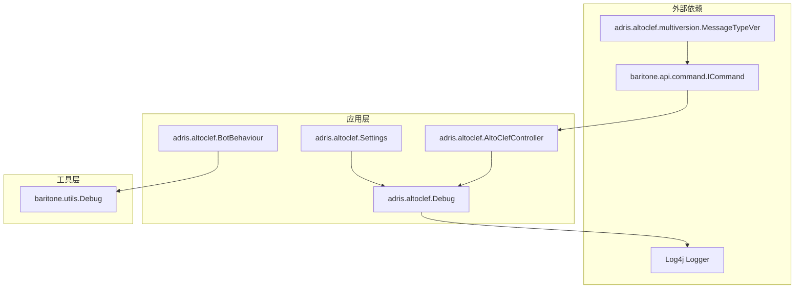
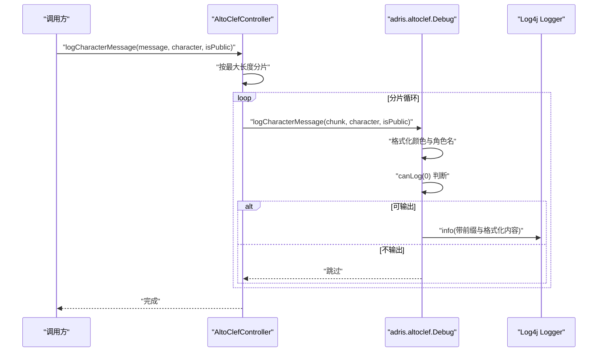
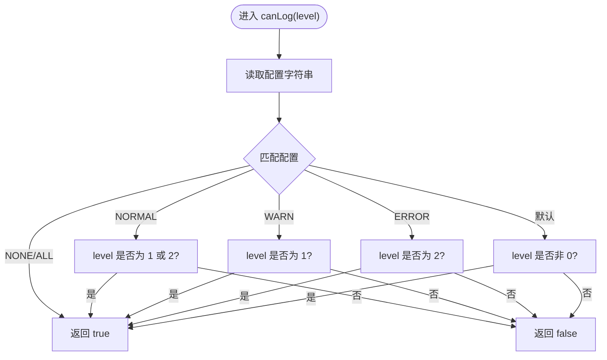
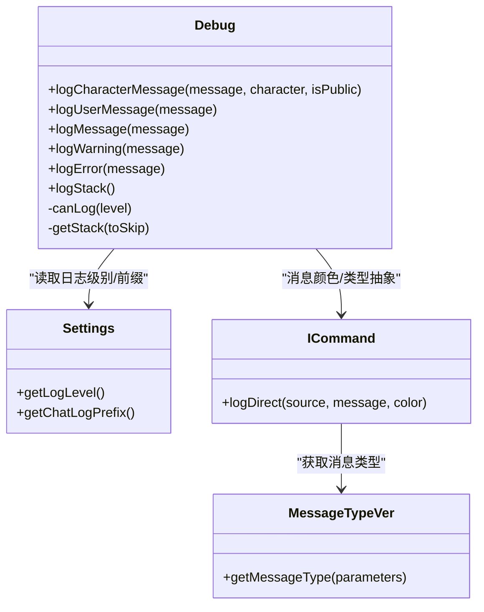
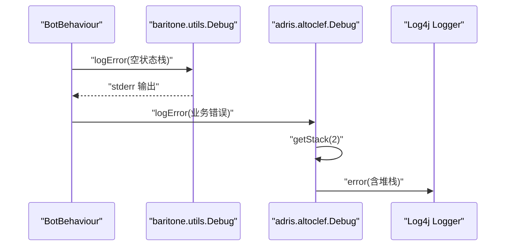
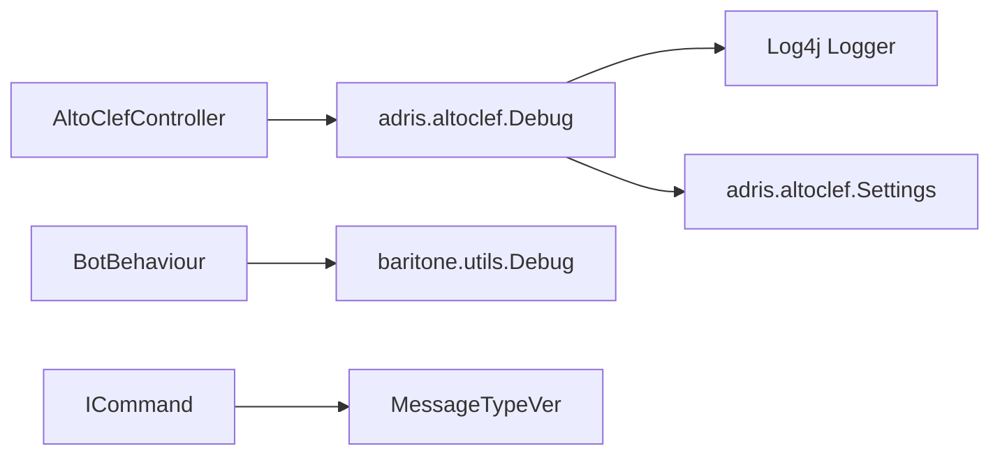

# 日志管理

<cite>
**本文引用的文件**
- [Debug.java](file://src/main/java/adris/altoclef/Debug.java)
- [Settings.java](file://src/main/java/adris/altoclef/Settings.java)
- [AltoClefController.java](file://src/main/java/adris/altoclef/AltoClefController.java)
- [BotBehaviour.java](file://src/main/java/adris/altoclef/BotBehaviour.java)
- [baritone/utils/Debug.java](file://src/main/java/baritone/utils/Debug.java)
- [ICommand.java](file://src/main/java/baritone/api/command/ICommand.java)
- [MessageTypeVer.java](file://src/main/java/adris/altoclef/multiversion/MessageTypeVer.java)
</cite>

## 目录
1. [简介](#简介)
2. [项目结构](#项目结构)
3. [核心组件](#核心组件)
4. [架构总览](#架构总览)
5. [详细组件分析](#详细组件分析)
6. [依赖分析](#依赖分析)
7. [性能考虑](#性能考虑)
8. [故障排查指南](#故障排查指南)
9. [结论](#结论)
10. [附录](#附录)

## 简介
本文件面向日志管理系统，围绕 Debug 类的设计与实现进行深入解析，涵盖日志级别（INTERNAL、WARNING、ERROR）、日志前缀格式化规则、颜色编码的聊天消息处理、日志输出控制机制（canLog 的级别判断逻辑）、配置参数设置方式、堆栈跟踪生成与显示等关键点。同时给出不同场景下的日志应用建议（内部调试、用户可见消息、错误报告）、最佳实践（日志级别选择、性能影响评估、日志文件管理）以及常见问题的诊断与解决步骤。

## 项目结构
日志管理涉及以下关键模块：
- 应用层日志入口：adris.altoclef.Debug 提供统一的日志接口，封装了 INTERNAL、WARNING、ERROR 三类日志输出，并对聊天消息进行格式化处理。
- 配置层：adris.altoclef.Settings 提供日志级别、聊天前缀等配置项，用于控制日志行为。
- 控制器与业务层：AltoClefController 使用 Debug 输出用户可读消息与角色对话；BotBehaviour 在状态机异常时使用 baritone.utils.Debug 输出错误。
- 聊天与消息类型：ICommand 与 MessageTypeVer 提供聊天消息的颜色与类型抽象，便于在不同版本中适配消息格式。

**图表来源**
- [Debug.java:1-103](file://src/main/java/adris/altoclef/Debug.java#L1-L103)
- [Settings.java:1-357](file://src/main/java/adris/altoclef/Settings.java#L1-L357)
- [AltoClefController.java:360-456](file://src/main/java/adris/altoclef/AltoClefController.java#L360-L456)
- [BotBehaviour.java:195-343](file://src/main/java/adris/altoclef/BotBehaviour.java#L195-L343)
- [baritone/utils/Debug.java:1-20](file://src/main/java/baritone/utils/Debug.java#L1-L20)
- [ICommand.java:35-54](file://src/main/java/baritone/api/command/ICommand.java#L35-L54)
- [MessageTypeVer.java:1-10](file://src/main/java/adris/altoclef/multiversion/MessageTypeVer.java#L1-L10)

**章节来源**
- [Debug.java:1-103](file://src/main/java/adris/altoclef/Debug.java#L1-L103)
- [Settings.java:165-175](file://src/main/java/adris/altoclef/Settings.java#L165-L175)

## 核心组件
- Debug（应用层日志入口）
  - 提供 INTERNAL、WARNING、ERROR 三类日志输出方法。
  - 支持聊天消息格式化（颜色编码、角色名包裹），并统一走 INTERNAL 输出路径。
  - 内部通过 canLog 进行级别过滤，结合 Log4j 输出到指定 Logger。
  - 提供堆栈跟踪输出能力，便于定位问题。
- Settings（配置中心）
  - 暴露日志级别字符串（如 NORMAL、WARN、ERROR、NONE、ALL）与聊天前缀等配置项。
  - 由控制器读取配置以决定日志行为。
- AltoClefController（业务控制器）
  - 将用户可见消息与角色对话消息委托给 Debug 输出。
  - 对长消息进行分片处理，确保消息长度限制内的安全输出。
- BotBehaviour（状态机）
  - 在状态异常时使用 baritone.utils.Debug 输出错误，避免阻塞主流程。
- baritone.utils.Debug（工具层日志）
  - 提供基础的控制台输出（标准输出/错误输出），用于 Baritone 子系统调试。
- ICommand 与 MessageTypeVer（聊天消息抽象）
  - 为聊天消息的颜色与类型提供跨版本兼容支持，便于在 GUI 或聊天中呈现。

**章节来源**
- [Debug.java:14-101](file://src/main/java/adris/altoclef/Debug.java#L14-L101)
- [Settings.java:36-41](file://src/main/java/adris/altoclef/Settings.java#L36-L41)
- [AltoClefController.java:405-418](file://src/main/java/adris/altoclef/AltoClefController.java#L405-L418)
- [baritone/utils/Debug.java:4-18](file://src/main/java/baritone/utils/Debug.java#L4-L18)
- [ICommand.java:35-54](file://src/main/java/baritone/api/command/ICommand.java#L35-L54)
- [MessageTypeVer.java:7-9](file://src/main/java/adris/altoclef/multiversion/MessageTypeVer.java#L7-L9)

## 架构总览
Debug 类作为统一入口，向上游控制器暴露简洁 API，向下对接 Log4j 并通过 Settings 控制输出级别。聊天消息通过格式化规则增强可读性，并在需要时携带堆栈信息辅助排障。

**图表来源**
- [AltoClefController.java:405-418](file://src/main/java/adris/altoclef/AltoClefController.java#L405-L418)
- [Debug.java:32-35](file://src/main/java/adris/altoclef/Debug.java#L32-L35)
- [Debug.java:14-18](file://src/main/java/adris/altoclef/Debug.java#L14-L18)

## 详细组件分析

### Debug 类设计与实现
- 日志级别与常量
  - 定义 INTERNAL、WARNING、ERROR 对应的内部级别值，便于 canLog 做快速判断。
- 日志输出方法
  - INTERNAL：统一走 info 输出，附加 "[Internal]" 前缀。
  - WARNING：走 warn 输出，附加 "[Warn]" 前缀。
  - ERROR：走 error 输出，附加 "[Error]" 前缀，并在启用时追加堆栈信息。
- 聊天消息格式化
  - 角色私聊消息：将角色短名与消息拼接为带颜色编码的格式，再交由 INTERNAL 输出。
  - 用户消息：直接走 INTERNAL 输出。
- 堆栈跟踪
  - 通过 Thread.currentThread().getStackTrace() 生成堆栈文本，支持跳过若干帧以去除框架噪声。
- 输出控制
  - canLog 根据配置字符串（来自 Settings）决定是否允许某级别日志输出：
    - NONE：全部禁止
    - ALL：全部允许
    - NORMAL：仅 WARNING 与 ERROR 允许
    - WARN：仅 WARNING 允许
    - ERROR：仅 ERROR 允许
    - 默认：除 INTERNAL 外均允许

**图表来源**
- [Debug.java:86-101](file://src/main/java/adris/altoclef/Debug.java#L86-L101)

**章节来源**
- [Debug.java:10-12](file://src/main/java/adris/altoclef/Debug.java#L10-L12)
- [Debug.java:14-18](file://src/main/java/adris/altoclef/Debug.java#L14-L18)
- [Debug.java:28-39](file://src/main/java/adris/altoclef/Debug.java#L28-L39)
- [Debug.java:32-35](file://src/main/java/adris/altoclef/Debug.java#L32-L35)
- [Debug.java:49-68](file://src/main/java/adris/altoclef/Debug.java#L49-L68)
- [Debug.java:70-84](file://src/main/java/adris/altoclef/Debug.java#L70-L84)
- [Debug.java:86-101](file://src/main/java/adris/altoclef/Debug.java#L86-L101)

### Settings 配置参数与使用
- 关键配置项
  - logLevel：控制日志输出级别（NORMAL/WARN/ERROR/NONE/ALL）。
  - chatLogPrefix：聊天日志前缀（例如 "[Alto Clef] "）。
- 读取与应用
  - Debug 中当前硬编码使用 "ALL" 作为 enabledLogLevel，实际应从 Settings 获取该值。
  - 控制器可通过 Settings.getLogLevel() 与 Settings.getChatLogPrefix() 获取配置，用于决定日志策略与消息前缀。

**章节来源**
- [Settings.java:40](file://src/main/java/adris/altoclef/Settings.java#L40)
- [Settings.java:165-175](file://src/main/java/adris/altoclef/Settings.java#L165-L175)
- [Debug.java:87](file://src/main/java/adris/altoclef/Debug.java#L87)

### 聊天消息与颜色编码
- 角色私聊消息格式
  - 将角色短名与消息拼接为带颜色编码的字符串，再交由 Debug.INTERNAL 输出。
- 聊天消息类型与颜色
  - 通过 ICommand 与 MessageTypeVer 抽象聊天消息的颜色与类型，便于在不同版本中保持一致的消息呈现。

**图表来源**
- [Debug.java:32-35](file://src/main/java/adris/altoclef/Debug.java#L32-L35)
- [Settings.java:165-175](file://src/main/java/adris/altoclef/Settings.java#L165-L175)
- [ICommand.java:35-54](file://src/main/java/baritone/api/command/ICommand.java#L35-L54)
- [MessageTypeVer.java:7-9](file://src/main/java/adris/altoclef/multiversion/MessageTypeVer.java#L7-L9)

**章节来源**
- [Debug.java:32-35](file://src/main/java/adris/altoclef/Debug.java#L32-L35)
- [ICommand.java:35-54](file://src/main/java/baritone/api/command/ICommand.java#L35-L54)
- [MessageTypeVer.java:7-9](file://src/main/java/adris/altoclef/multiversion/MessageTypeVer.java#L7-L9)

### 错误处理与堆栈跟踪
- 错误日志
  - Debug.logError 自动捕获堆栈并追加到错误消息后输出。
- 工具层错误
  - baritone.utils.Debug.logError 直接输出到标准错误流，适合快速定位状态机异常。

**图表来源**
- [BotBehaviour.java:200-217](file://src/main/java/adris/altoclef/BotBehaviour.java#L200-L217)
- [baritone/utils/Debug.java:16-18](file://src/main/java/baritone/utils/Debug.java#L16-L18)
- [Debug.java:59-84](file://src/main/java/adris/altoclef/Debug.java#L59-L84)

**章节来源**
- [BotBehaviour.java:200-217](file://src/main/java/adris/altoclef/BotBehaviour.java#L200-L217)
- [baritone/utils/Debug.java:16-18](file://src/main/java/baritone/utils/Debug.java#L16-L18)
- [Debug.java:59-84](file://src/main/java/adris/altoclef/Debug.java#L59-L84)

## 依赖分析
- Debug 依赖
  - Log4j Logger：统一输出渠道。
  - Settings：读取日志级别与聊天前缀（当前实现中级别为硬编码，建议改为从 Settings 获取）。
- 控制器依赖
  - Debug：对外提供日志接口。
  - Settings：读取配置以决定日志策略。
- 工具层依赖
  - baritone.utils.Debug：独立于应用层的调试输出，避免污染主流程日志。
- 聊天消息依赖
  - ICommand 与 MessageTypeVer：跨版本兼容的消息类型与颜色处理。

**图表来源**
- [Debug.java:8](file://src/main/java/adris/altoclef/Debug.java#L8)
- [Settings.java:40](file://src/main/java/adris/altoclef/Settings.java#L40)
- [AltoClefController.java:405-418](file://src/main/java/adris/altoclef/AltoClefController.java#L405-L418)
- [baritone/utils/Debug.java:4-18](file://src/main/java/baritone/utils/Debug.java#L4-L18)
- [ICommand.java:35-54](file://src/main/java/baritone/api/command/ICommand.java#L35-L54)
- [MessageTypeVer.java:7-9](file://src/main/java/adris/altoclef/multiversion/MessageTypeVer.java#L7-L9)

**章节来源**
- [Debug.java:8](file://src/main/java/adris/altoclef/Debug.java#L8)
- [Settings.java:40](file://src/main/java/adris/altoclef/Settings.java#L40)
- [AltoClefController.java:405-418](file://src/main/java/adris/altoclef/AltoClefController.java#L405-L418)
- [baritone/utils/Debug.java:4-18](file://src/main/java/baritone/utils/Debug.java#L4-L18)
- [ICommand.java:35-54](file://src/main/java/baritone/api/command/ICommand.java#L35-L54)
- [MessageTypeVer.java:7-9](file://src/main/java/adris/altoclef/multiversion/MessageTypeVer.java#L7-L9)

## 性能考虑
- 日志级别过滤
  - canLog 在 Debug 内部进行快速分支判断，避免不必要的字符串格式化与堆栈生成。
- 堆栈生成成本
  - getStack 会遍历整个调用栈，建议仅在 ERROR 级别或显式调用 logStack 时使用。
- 聊天消息分片
  - 长消息按最大长度切片输出，减少单条消息的渲染压力与网络传输开销。
- 配置读取
  - 建议在初始化阶段读取 Settings 并缓存关键配置，避免频繁 IO 与解析。

[本节为通用指导，无需具体文件引用]

## 故障排查指南
- 日志缺失
  - 检查 Settings.logLevel 是否被设置为 NONE 或过高的级别导致被过滤。
  - 确认 Debug.canLog 的配置字符串是否与预期一致（当前实现为硬编码，建议改为从 Settings 获取）。
- 级别不正确
  - 确认调用的是 logWarning 还是 logError，对应级别分别为 1 与 2。
  - 检查 canLog 的匹配分支是否符合预期。
- 格式异常
  - 角色私聊消息需确保角色短名与消息拼接格式正确。
  - 聊天消息颜色编码由格式化字符串控制，若显示异常，检查上游消息构建逻辑。
- 堆栈未显示
  - 确认是否调用了 logError 或显式调用了 logStack。
  - 检查 getStack 的 toSkip 参数是否合适，避免过滤掉关键帧。
- 状态机异常
  - 若出现“状态栈为空”等异常，优先查看 baritone.utils.Debug 的 stderr 输出，确认异常触发点。

**章节来源**
- [Debug.java:86-101](file://src/main/java/adris/altoclef/Debug.java#L86-L101)
- [Debug.java:70-84](file://src/main/java/adris/altoclef/Debug.java#L70-L84)
- [BotBehaviour.java:200-217](file://src/main/java/adris/altoclef/BotBehaviour.java#L200-L217)
- [baritone/utils/Debug.java:16-18](file://src/main/java/baritone/utils/Debug.java#L16-L18)

## 结论
Debug 类通过清晰的日志级别划分、统一的前缀与格式化规则、以及可控的输出过滤，为项目提供了稳定且可扩展的日志能力。结合 Settings 的配置与控制器的使用，可在不同场景下灵活输出内部调试信息、用户可见消息与错误报告。建议后续将 Debug 的级别配置从硬编码迁移到 Settings，以获得更灵活的运行时控制。

[本节为总结性内容，无需具体文件引用]

## 附录
- 最佳实践清单
  - 日志级别选择：开发期使用 ALL，生产环境根据需求选择 NORMAL/WARN/ERROR/NONE。
  - 性能影响评估：避免在高频路径中生成堆栈；仅在必要时开启详细日志。
  - 日志文件管理：配合 Log4j 的滚动策略与归档策略，定期清理与轮转。
  - 配置热更新：在初始化阶段读取 Settings 并缓存关键配置，避免频繁 IO。
  - 跨版本兼容：通过 ICommand 与 MessageTypeVer 统一消息类型与颜色，降低版本差异带来的风险。

[本节为通用指导，无需具体文件引用]