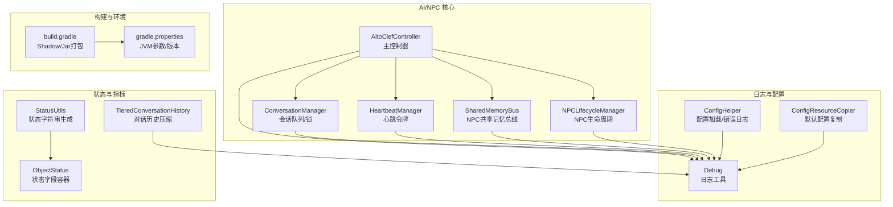
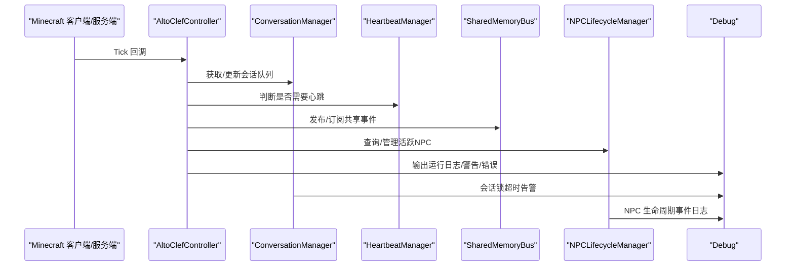
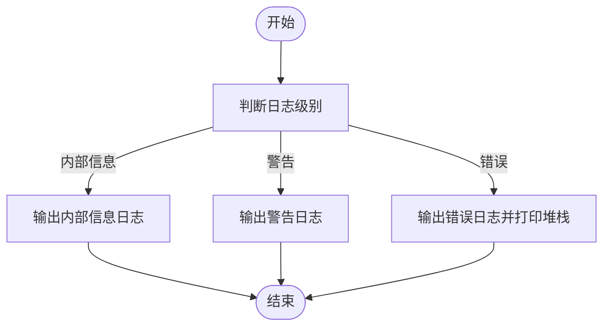
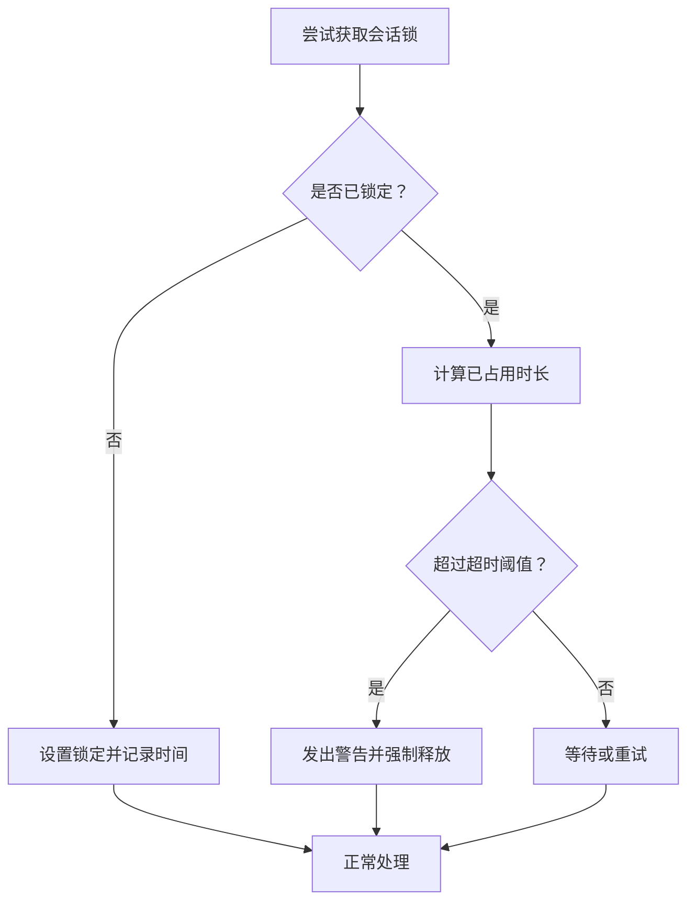
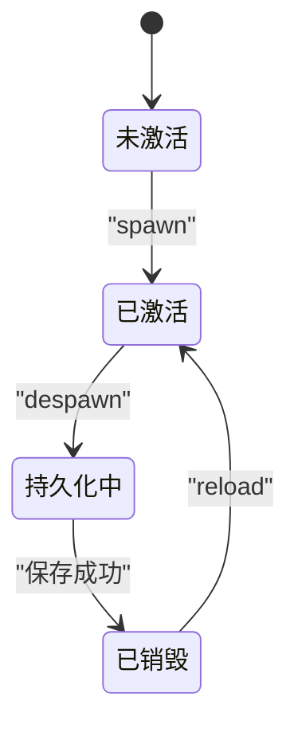
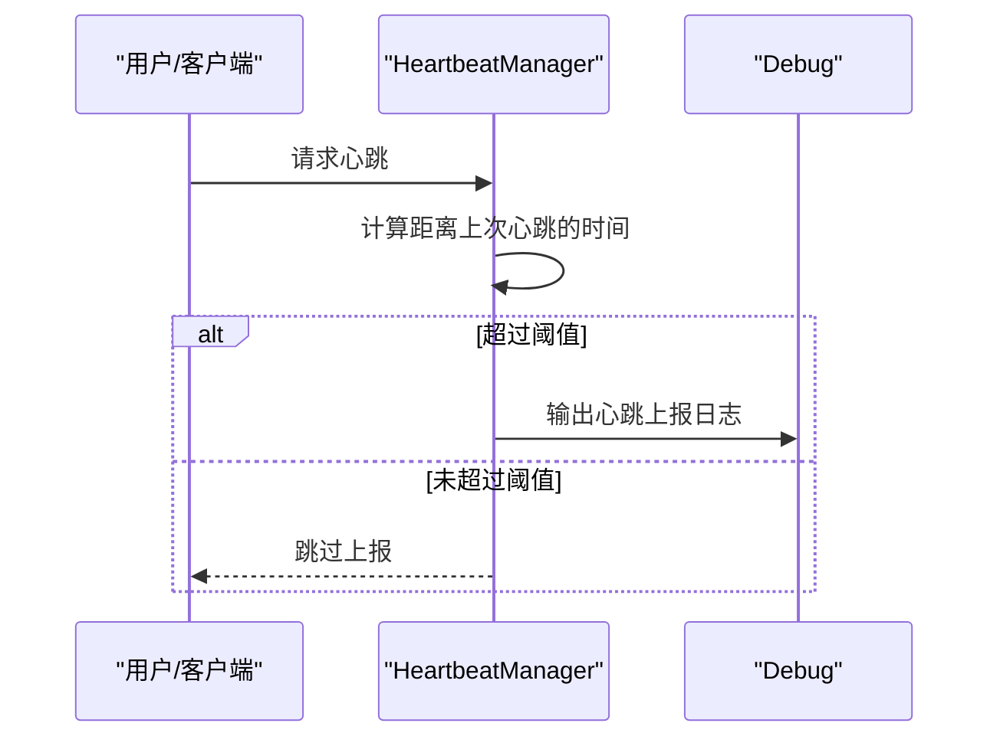
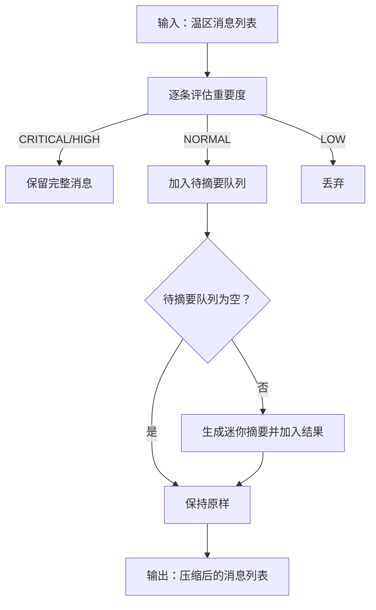
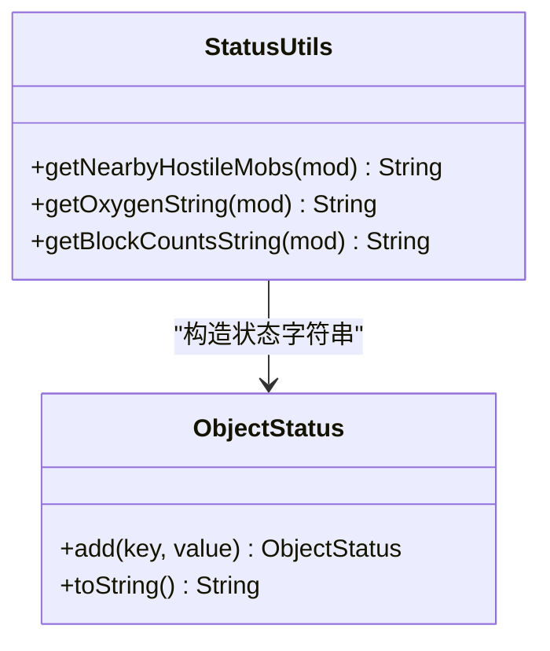
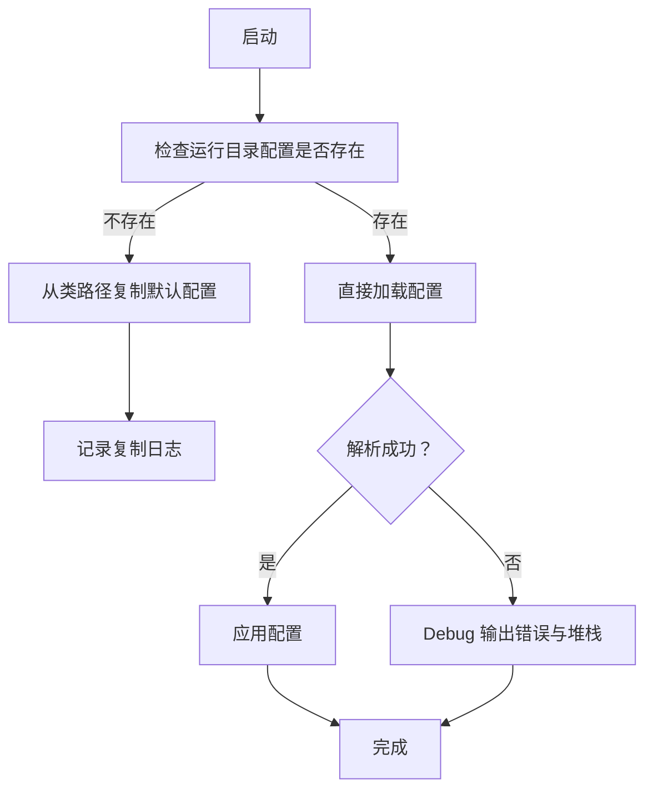
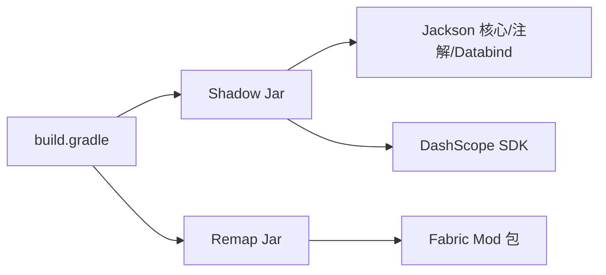

# 监控运维

<cite>
**本文引用的文件**   
- [Debug.java](file://src/main/java/adris/altoclef/Debug.java)
- [AltoClefController.java](file://src/main/java/adris/altoclef/AltoClefController.java)
- [TieredConversationHistory.java](file://src/main/java/adris/altoclef/player2api/context/TieredConversationHistory.java)
- [ConversationManager.java](file://src/main/java/adris/altoclef/player2api/manager/ConversationManager.java)
- [HeartbeatManager.java](file://src/main/java/adris/altoclef/player2api/manager/HeartbeatManager.java)
- [SharedMemoryBus.java](file://src/main/java/adris/altoclef/player2api/memory/SharedMemoryBus.java)
- [NPCLifecycleManager.java](file://src/main/java/adris/altoclef/player2api/NPCLifecycleManager.java)
- [ObjectStatus.java](file://src/main/java/adris/altoclef/player2api/status/ObjectStatus.java)
- [StatusUtils.java](file://src/main/java/adris/altoclef/player2api/status/StatusUtils.java)
- [ConfigHelper.java](file://src/main/java/adris/altoclef/util/helpers/ConfigHelper.java)
- [ConfigResourceCopier.java](file://src/main/java/adris/altoclef/player2api/utils/ConfigResourceCopier.java)
- [build.gradle](file://build.gradle)
- [gradle.properties](file://gradle.properties)
- [AI_NPC游戏指令系统重构.md](file://docs/AI_NPC游戏指令系统重构.md)
</cite>

## 目录
1. [简介](#简介)
2. [项目结构](#项目结构)
3. [核心组件](#核心组件)
4. [架构总览](#架构总览)
5. [详细组件分析](#详细组件分析)
6. [依赖分析](#依赖分析)
7. [性能考虑](#性能考虑)
8. [故障排查指南](#故障排查指南)
9. [结论](#结论)
10. [附录](#附录)

## 简介
本指导文档面向“AI NPC”项目的监控与运维，围绕以下目标展开：
- 日志系统：Debug 类日志输出格式、日志级别、日志位置与轮转策略建议
- 性能监控：内存与 CPU 使用、网络通信统计、关键指标采集与分析
- 健康检查：NPC 实体状态、任务执行成功率、LLM 调用延迟等运维指标
- 运维自动化：定时任务、批量操作、数据备份与配置管理
- 告警体系：异常检测、阈值告警、通知机制
- 数据分析：趋势分析、容量规划、性能瓶颈定位

## 项目结构
该项目为 Fabric 模组，核心运行于 Minecraft 客户端/服务端环境中，AI 与 NPC 的行为由模块化任务系统驱动，同时通过 LLM、STT、TTS 等能力实现语音交互与智能决策。

图表来源
- [AltoClefController.java:142-170](file://src/main/java/adris/altoclef/AltoClefController.java#L142-L170)
- [ConversationManager.java:36-57](file://src/main/java/adris/altoclef/player2api/manager/ConversationManager.java#L36-L57)
- [HeartbeatManager.java:22-46](file://src/main/java/adris/altoclef/player2api/manager/HeartbeatManager.java#L22-L46)
- [SharedMemoryBus.java:17-33](file://src/main/java/adris/altoclef/player2api/memory/SharedMemoryBus.java#L17-L33)
- [NPCLifecycleManager.java:82-165](file://src/main/java/adris/altoclef/player2api/NPCLifecycleManager.java#L82-L165)
- [Debug.java:7-103](file://src/main/java/adris/altoclef/Debug.java#L7-L103)
- [ConfigHelper.java:62-93](file://src/main/java/adris/altoclef/util/helpers/ConfigHelper.java#L62-L93)
- [ConfigResourceCopier.java:39-58](file://src/main/java/adris/altoclef/player2api/utils/ConfigResourceCopier.java#L39-L58)
- [ObjectStatus.java:7-26](file://src/main/java/adris/altoclef/player2api/status/ObjectStatus.java#L7-L26)
- [StatusUtils.java:99-130](file://src/main/java/adris/altoclef/player2api/status/StatusUtils.java#L99-L130)
- [TieredConversationHistory.java:32-146](file://src/main/java/adris/altoclef/player2api/context/TieredConversationHistory.java#L32-L146)
- [build.gradle:71-94](file://build.gradle#L71-L94)
- [gradle.properties:18-20](file://gradle.properties#L18-L20)

章节来源
- [build.gradle:1-135](file://build.gradle#L1-L135)
- [gradle.properties:18-20](file://gradle.properties#L18-L20)

## 核心组件
- 日志与调试
  - Debug：统一日志入口，支持内部信息、警告、错误级别输出；可通过开关控制日志级别。
  - 配置加载：ConfigHelper 在解析配置失败时调用 Debug 输出错误堆栈，便于快速定位配置问题。
  - 默认配置复制：ConfigResourceCopier 将类路径默认配置写入运行目录，确保首次启动可用。
- 会话与锁
  - ConversationManager：维护会话队列与全局锁，超时自动释放，避免阻塞。
  - HeartbeatManager：按用户名+客户端ID记录心跳时间，周期性触发心跳上报。
- NPC 生命周期
  - NPCLifecycleManager：负责 NPC 的创建、销毁、重载与持久化，记录关键日志。
- 记忆与状态
  - SharedMemoryBus：NPC 间共享事件总线，带事件日志上限与过期时间。
  - ObjectStatus/StatusUtils：将复杂状态结构化输出，便于监控与告警。
- 对话历史压缩
  - TieredConversationHistory：按重要度压缩对话，降低 LLM 上下文压力，提升吞吐。

章节来源
- [Debug.java:7-103](file://src/main/java/adris/altoclef/Debug.java#L7-L103)
- [ConfigHelper.java:62-93](file://src/main/java/adris/altoclef/util/helpers/ConfigHelper.java#L62-L93)
- [ConfigResourceCopier.java:39-58](file://src/main/java/adris/altoclef/player2api/utils/ConfigResourceCopier.java#L39-L58)
- [ConversationManager.java:36-57](file://src/main/java/adris/altoclef/player2api/manager/ConversationManager.java#L36-L57)
- [HeartbeatManager.java:22-46](file://src/main/java/adris/altoclef/player2api/manager/HeartbeatManager.java#L22-L46)
- [SharedMemoryBus.java:17-33](file://src/main/java/adris/altoclef/player2api/memory/SharedMemoryBus.java#L17-L33)
- [NPCLifecycleManager.java:82-165](file://src/main/java/adris/altoclef/player2api/NPCLifecycleManager.java#L82-L165)
- [ObjectStatus.java:7-26](file://src/main/java/adris/altoclef/player2api/status/ObjectStatus.java#L7-L26)
- [StatusUtils.java:99-130](file://src/main/java/adris/altoclef/player2api/status/StatusUtils.java#L99-L130)
- [TieredConversationHistory.java:32-146](file://src/main/java/adris/altoclef/player2api/context/TieredConversationHistory.java#L32-L146)

## 架构总览
下图展示运行时关键组件之间的交互，以及日志与配置在运维中的作用。

图表来源
- [AltoClefController.java:142-170](file://src/main/java/adris/altoclef/AltoClefController.java#L142-L170)
- [ConversationManager.java:36-57](file://src/main/java/adris/altoclef/player2api/manager/ConversationManager.java#L36-L57)
- [HeartbeatManager.java:30-41](file://src/main/java/adris/altoclef/player2api/manager/HeartbeatManager.java#L30-L41)
- [SharedMemoryBus.java:17-33](file://src/main/java/adris/altoclef/player2api/memory/SharedMemoryBus.java#L17-L33)
- [NPCLifecycleManager.java:82-165](file://src/main/java/adris/altoclef/player2api/NPCLifecycleManager.java#L82-L165)
- [Debug.java:7-103](file://src/main/java/adris/altoclef/Debug.java#L7-L103)

## 详细组件分析

### 日志系统与输出规范
- 日志级别与格式
  - 内部信息：用于非公开调试信息，统一前缀与格式。
  - 警告：用于潜在风险或异常状态，便于快速发现。
  - 错误：包含堆栈追踪，用于定位异常根因。
  - 日志级别开关：通过内部开关控制是否输出不同级别日志。
- 日志位置与轮转
  - 当前仓库未内置日志轮转配置；建议结合外部日志系统（如 Logback/Log4j2）进行文件轮转与归档。
- 配置加载与错误日志
  - 配置解析失败时，使用 Debug 输出错误消息与堆栈，便于运维快速定位问题。

图表来源
- [Debug.java:14-101](file://src/main/java/adris/altoclef/Debug.java#L14-L101)

章节来源
- [Debug.java:7-103](file://src/main/java/adris/altoclef/Debug.java#L7-L103)
- [ConfigHelper.java:62-93](file://src/main/java/adris/altoclef/util/helpers/ConfigHelper.java#L62-L93)

### 会话锁与超时监控
- 会话锁
  - ConversationManager 维护全局会话锁与获取时间，超过阈值自动释放，防止死锁。
- 监控点
  - 超时释放时输出警告日志，便于发现长时间占用锁的任务或链路。

图表来源
- [ConversationManager.java:36-57](file://src/main/java/adris/altoclef/player2api/manager/ConversationManager.java#L36-L57)

章节来源
- [ConversationManager.java:36-57](file://src/main/java/adris/altoclef/player2api/manager/ConversationManager.java#L36-L57)

### NPC 生命周期与健康检查
- 生命周期管理
  - 创建：记录 UUID 与名称。
  - 销毁：持久化灵魂档案后记录销毁日志。
  - 重载：按名称加载/重载灵魂档案。
- 健康检查建议
  - 活跃 NPC 数量、最近一次销毁/重载时间、持久化是否成功。
  - 结合 Debug 输出关键事件，便于集中监控。

图表来源
- [NPCLifecycleManager.java:82-165](file://src/main/java/adris/altoclef/player2api/NPCLifecycleManager.java#L82-L165)

章节来源
- [NPCLifecycleManager.java:82-165](file://src/main/java/adris/altoclef/player2api/NPCLifecycleManager.java#L82-L165)

### 心跳与网络通信监控
- 心跳机制
  - HeartbeatManager 按用户名+客户端ID记录上次心跳时间，超过阈值触发心跳上报。
- 网络通信建议
  - 将心跳间隔与上报频率纳入监控，结合 Debug 输出心跳事件，便于发现连接抖动或断连。

图表来源
- [HeartbeatManager.java:30-41](file://src/main/java/adris/altoclef/player2api/manager/HeartbeatManager.java#L30-L41)
- [Debug.java:7-103](file://src/main/java/adris/altoclef/Debug.java#L7-L103)

章节来源
- [HeartbeatManager.java:22-46](file://src/main/java/adris/altoclef/player2api/manager/HeartbeatManager.java#L22-L46)

### 对话历史压缩与上下文控制
- 压缩策略
  - 保留关键/高重要度消息，对普通消息进行“迷你摘要”，丢弃低重要度消息，降低 LLM 上下文开销。
- 监控点
  - 记录压缩前后消息数量与摘要内容，评估压缩效果与信息损失。

图表来源
- [TieredConversationHistory.java:114-146](file://src/main/java/adris/altoclef/player2api/context/TieredConversationHistory.java#L114-L146)

章节来源
- [TieredConversationHistory.java:32-146](file://src/main/java/adris/altoclef/player2api/context/TieredConversationHistory.java#L32-L146)

### 状态结构化与可视化
- ObjectStatus：以键值对形式组织状态字段，便于统一输出。
- StatusUtils：将复杂状态（如附近敌对生物、氧气值、方块统计）转换为字符串，利于日志与告警。

图表来源
- [ObjectStatus.java:7-26](file://src/main/java/adris/altoclef/player2api/status/ObjectStatus.java#L7-L26)
- [StatusUtils.java:99-130](file://src/main/java/adris/altoclef/player2api/status/StatusUtils.java#L99-L130)

章节来源
- [ObjectStatus.java:7-26](file://src/main/java/adris/altoclef/player2api/status/ObjectStatus.java#L7-L26)
- [StatusUtils.java:99-130](file://src/main/java/adris/altoclef/player2api/status/StatusUtils.java#L99-L130)

### 配置管理与运维自动化
- 默认配置复制
  - 启动时将类路径默认配置复制到运行目录，确保首次运行可用。
- 配置加载与错误处理
  - 解析失败时输出错误日志与堆栈，便于快速修复。
- 运维自动化建议
  - 将配置复制与加载封装为启动脚本步骤，结合定时任务定期校验配置一致性与完整性。

图表来源
- [ConfigResourceCopier.java:39-58](file://src/main/java/adris/altoclef/player2api/utils/ConfigResourceCopier.java#L39-L58)
- [ConfigHelper.java:62-93](file://src/main/java/adris/altoclef/util/helpers/ConfigHelper.java#L62-L93)

章节来源
- [ConfigResourceCopier.java:39-58](file://src/main/java/adris/altoclef/player2api/utils/ConfigResourceCopier.java#L39-L58)
- [ConfigHelper.java:62-93](file://src/main/java/adris/altoclef/util/helpers/ConfigHelper.java#L62-L93)

## 依赖分析
- 构建与打包
  - 使用 Shadow Jar 将 Jackson、DashScope 等依赖打入最终包，便于独立运行。
  - 清理任务会删除旧版默认 LLM 配置文件，确保每次运行使用最新默认配置。
- 运行时依赖
  - Fabric API、Quilt API、Cardinal Components API 等为运行环境提供基础能力。

图表来源
- [build.gradle:53-69](file://build.gradle#L53-L69)
- [build.gradle:71-94](file://build.gradle#L71-L94)

章节来源
- [build.gradle:1-135](file://build.gradle#L1-L135)
- [gradle.properties:18-20](file://gradle.properties#L18-L20)

## 性能考虑
- 内存与 CPU
  - 通过 JVM 参数调整 Gradle/运行内存上限，满足 Minecraft 反编译与运行需求。
  - 对大型对话历史进行压缩，减少 LLM 上下文大小，间接降低内存峰值与推理耗时。
- 网络通信
  - 心跳周期与阈值需平衡实时性与网络负载；结合 Debug 日志观察心跳频率波动。
- 任务执行
  - 会话锁超时与任务中断率应纳入监控，避免长时间阻塞导致的性能退化。

章节来源
- [gradle.properties:18-20](file://gradle.properties#L18-L20)
- [TieredConversationHistory.java:114-146](file://src/main/java/adris/altoclef/player2api/context/TieredConversationHistory.java#L114-L146)
- [ConversationManager.java:36-57](file://src/main/java/adris/altoclef/player2api/manager/ConversationManager.java#L36-L57)
- [HeartbeatManager.java:30-41](file://src/main/java/adris/altoclef/player2api/manager/HeartbeatManager.java#L30-L41)

## 故障排查指南
- 配置加载失败
  - 现象：配置解析异常，Debug 输出错误与堆栈。
  - 处理：核对配置文件格式，必要时删除旧配置让系统重新复制默认配置。
- 会话锁超时
  - 现象：长时间无法获取会话锁，系统自动释放并告警。
  - 处理：检查阻塞任务或链路，缩短任务执行时间或优化优先级。
- NPC 生命周期异常
  - 现象：销毁/重载失败或持久化未生效。
  - 处理：查看对应日志，确认文件写入权限与磁盘空间。
- 心跳异常
  - 现象：心跳上报频繁或长时间不触发。
  - 处理：检查心跳阈值与网络稳定性，结合日志定位异常节点。

章节来源
- [ConfigHelper.java:62-93](file://src/main/java/adris/altoclef/util/helpers/ConfigHelper.java#L62-L93)
- [ConversationManager.java:36-57](file://src/main/java/adris/altoclef/player2api/manager/ConversationManager.java#L36-L57)
- [NPCLifecycleManager.java:82-165](file://src/main/java/adris/altoclef/player2api/NPCLifecycleManager.java#L82-L165)
- [HeartbeatManager.java:30-41](file://src/main/java/adris/altoclef/player2api/manager/HeartbeatManager.java#L30-L41)

## 结论
本项目已具备完善的日志、会话锁、心跳、生命周期与状态结构化等运维基础。建议在此基础上补充：
- 日志轮转与集中化采集
- 关键指标的埋点与可视化看板
- 自动化巡检与批量运维脚本
- 基于阈值的告警与通知机制
- 基于历史数据的趋势分析与容量规划

## 附录
- 运维指标参考（来自文档）
  - 指令识别准确率、命令映射准确率、JSON解析成功率、命令执行成功率、端到端成功率、平均响应延迟、中断率、锁等待时间等。
  - 建议在 Debug 中增加统一的“[Metrics]”日志格式，便于采集与分析。

章节来源
- [AI_NPC游戏指令系统重构.md:1388-1415](file://docs/AI_NPC游戏指令系统重构.md#L1388-L1415)