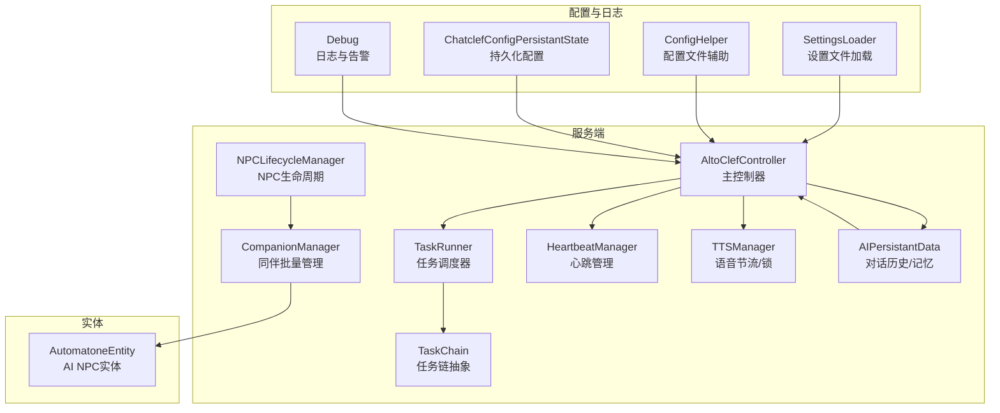
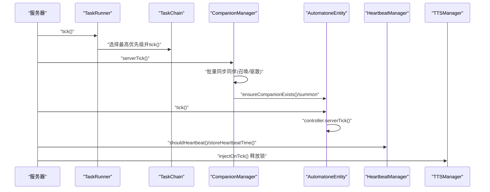
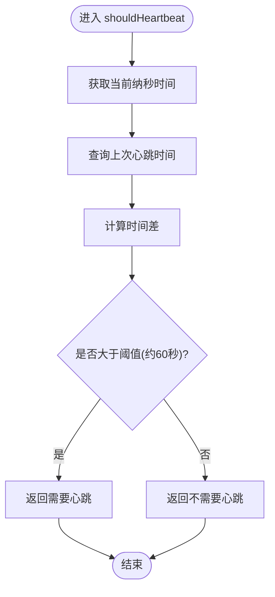
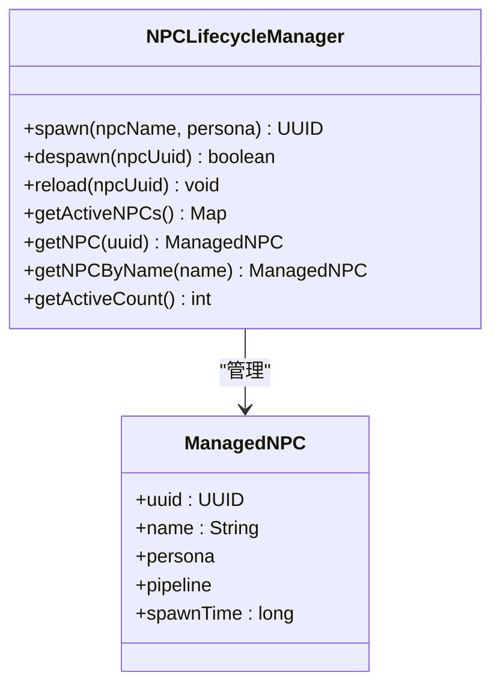
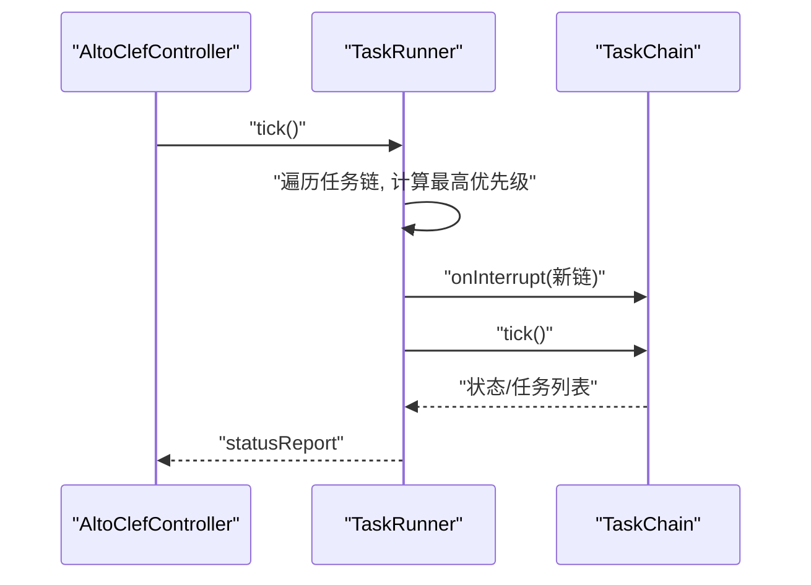
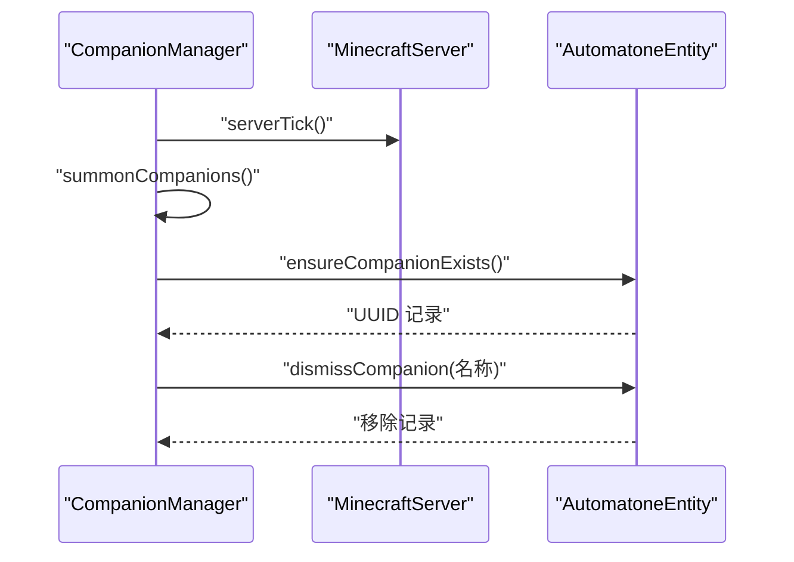
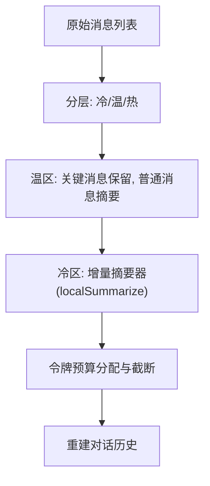
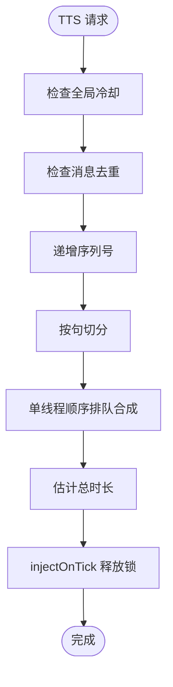
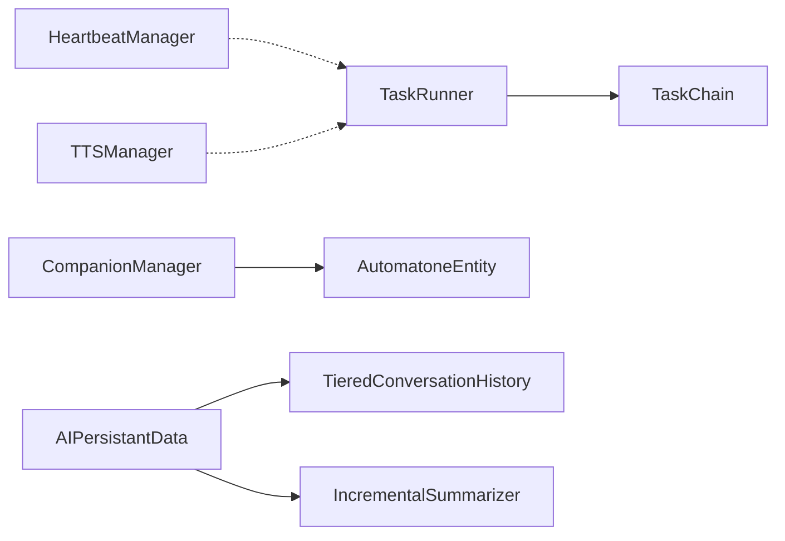

# 自动化运维

<cite>
**本文引用的文件**
- [HeartbeatManager.java](file://src/main/java/adris/altoclef/player2api/manager/HeartbeatManager.java)
- [NPCLifecycleManager.java](file://src/main/java/adris/altoclef/player2api/NPCLifecycleManager.java)
- [TaskRunner.java](file://src/main/java/adris/altoclef/tasksystem/TaskRunner.java)
- [TaskChain.java](file://src/main/java/adris/altoclef/tasksystem/TaskChain.java)
- [CompanionManager.java](file://src/main/java/com/goodbird/player2npc/companion/CompanionManager.java)
- [AutomatoneEntity.java](file://src/main/java/com/goodbird/player2npc/companion/AutomatoneEntity.java)
- [AIPersistantData.java](file://src/main/java/adris/altoclef/player2api/AIPersistantData.java)
- [TTSManager.java](file://src/main/java/adris/altoclef/player2api/manager/TTSManager.java)
- [AgentStatus.java](file://src/main/java/adris/altoclef/player2api/status/AgentStatus.java)
- [SettingsLoader.java](file://src/main/java/baritone/utils/SettingsLoader.java)
- [ConfigHelper.java](file://src/main/java/adris/altoclef/util/helpers/ConfigHelper.java)
- [ChatclefConfigPersistantState.java](file://src/main/java/adris/altoclef/player2api/ChatclefConfigPersistantState.java)
- [Utils.java](file://src/main/java/adris/altoclef/player2api/utils/Utils.java)
- [IncrementalSummarizer.java](file://src/main/java/adris/altoclef/player2api/context/IncrementalSummarizer.java)
- [TieredConversationHistory.java](file://src/main/java/adris/altoclef/player2api/context/TieredConversationHistory.java)
- [fabric.mod.json](file://src/main/resources/fabric.mod.json)
- [Debug.java](file://src/main/java/adris/altoclef/Debug.java)
- [HttpApiException.java](file://src/main/java/adris/altoclef/player2api/utils/HttpApiException.java)
- [AltoClefController.java](file://src/main/java/adris/altoclef/AltoClefController.java)
</cite>

## 目录
1. [简介](#简介)
2. [项目结构](#项目结构)
3. [核心组件](#核心组件)
4. [架构总览](#架构总览)
5. [详细组件分析](#详细组件分析)
6. [依赖分析](#依赖分析)
7. [性能考量](#性能考量)
8. [故障排查指南](#故障排查指南)
9. [结论](#结论)
10. [附录](#附录)

## 简介
本指南面向自动化运维场景，围绕心跳管理、NPC 生命周期管理、任务执行自动化监控三大主题，结合代码级实现细节，提供可落地的运维配置与最佳实践。内容覆盖心跳间隔配置、异常检测与自动恢复策略、NPC 的自动创建/状态维护/生命周期结束处理与批量管理、任务调度与失败重试、长时间任务监控与资源调节、定时任务与批量操作、数据备份与系统维护自动化等。

## 项目结构
该模块以 Fabric/Cardinal Components 为基础，通过服务端组件与客户端渲染协同工作，形成“AI NPC + 自动化运维”的闭环。核心路径如下：
- 心跳与会话管理：player2api/manager（HeartbeatManager、TTSManager、ConversationManager）
- NPC 生命周期：player2api/NPCLifecycleManager
- 任务系统：tasksystem/TaskRunner、TaskChain
- NPC 实体与同伴管理：companion/CompanionManager、AutomatoneEntity
- 对话与记忆：AIPersistantData、IncrementalSummarizer、TieredConversationHistory
- 配置与日志：SettingsLoader、ConfigHelper、ChatclefConfigPersistantState、Debug
- 运行入口与模组元信息：fabric.mod.json

图表来源
- [TaskRunner.java:1-98](file://src/main/java/adris/altoclef/tasksystem/TaskRunner.java#L1-L98)
- [TaskChain.java:1-51](file://src/main/java/adris/altoclef/tasksystem/TaskChain.java#L1-L51)
- [NPCLifecycleManager.java:1-166](file://src/main/java/adris/altoclef/player2api/NPCLifecycleManager.java#L1-L166)
- [CompanionManager.java:1-191](file://src/main/java/com/goodbird/player2npc/companion/CompanionManager.java#L1-L191)
- [AutomatoneEntity.java:1-313](file://src/main/java/com/goodbird/player2npc/companion/AutomatoneEntity.java#L1-L313)
- [AIPersistantData.java:1-149](file://src/main/java/adris/altoclef/player2api/AIPersistantData.java#L1-L149)
- [HeartbeatManager.java:1-46](file://src/main/java/adris/altoclef/player2api/manager/HeartbeatManager.java#L1-L46)
- [TTSManager.java:1-168](file://src/main/java/adris/altoclef/player2api/manager/TTSManager.java#L1-L168)
- [SettingsLoader.java:1-26](file://src/main/java/baritone/utils/SettingsLoader.java#L1-L26)
- [ConfigHelper.java:137-223](file://src/main/java/adris/altoclef/util/helpers/ConfigHelper.java#L137-L223)
- [ChatclefConfigPersistantState.java:41-56](file://src/main/java/adris/altoclef/player2api/ChatclefConfigPersistantState.java#L41-L56)
- [Debug.java:1-103](file://src/main/java/adris/altoclef/Debug.java#L1-L103)

章节来源
- [fabric.mod.json:1-48](file://src/main/resources/fabric/mod.json#L1-L48)

## 核心组件
- 心跳管理（HeartbeatManager）：基于用户名与客户端标识生成键值，记录上次心跳时间，提供“是否需要心跳”的判断阈值（默认约 60 秒）。用于跨会话/跨实例的心跳一致性校验与异常检测。
- NPC 生命周期管理（NPCLifecycleManager）：集中管理活跃 NPC 的生成、销毁与重载，维护 UUID 到受管 NPC 的映射，支持按 UUID/名称查询与统计。
- 任务执行自动化（TaskRunner/TaskChain）：在每 tick 中选择最高优先级的任务链执行，支持中断切换、状态报告、启用/禁用与停止。
- NPC 同伴批量管理（CompanionManager）：异步拉取角色列表，按分配差异进行召唤/驱散，服务端 tick 触发批量同步，支持持久化同伴映射。
- 任务执行监控（AutomatoneEntity）：实体侧 tick 驱动控制器更新，包含交互、库存、饥饿管理等子系统更新，支持拾取物品、攻击逻辑与渲染相关行为。
- 会话与记忆（AIPersistantData/TieredConversationHistory/IncrementalSummarizer）：分层压缩与令牌预算控制，保障长对话的稳定性与性能。
- 语音节流（TTSManager）：全局冷却、去重、序列号去陈旧、单线程句子级合成与锁释放，避免语音风暴与过期播报。
- 配置与日志（SettingsLoader/ConfigHelper/ChatclefConfigPersistantState/Debug）：设置文件解析、配置文件读写、持久化配置与统一日志输出。

章节来源
- [HeartbeatManager.java:22-46](file://src/main/java/adris/altoclef/player2api/manager/HeartbeatManager.java#L22-L46)
- [NPCLifecycleManager.java:20-166](file://src/main/java/adris/altoclef/player2api/NPCLifecycleManager.java#L20-L166)
- [TaskRunner.java:9-98](file://src/main/java/adris/altoclef/tasksystem/TaskRunner.java#L9-L98)
- [TaskChain.java:7-51](file://src/main/java/adris/altoclef/tasksystem/TaskChain.java#L7-L51)
- [CompanionManager.java:28-191](file://src/main/java/com/goodbird/player2npc/companion/CompanionManager.java#L28-L191)
- [AutomatoneEntity.java:50-313](file://src/main/java/com/goodbird/player2npc/companion/AutomatoneEntity.java#L50-L313)
- [AIPersistantData.java:24-149](file://src/main/java/adris/altoclef/player2api/AIPersistantData.java#L24-L149)
- [TieredConversationHistory.java:108-146](file://src/main/java/adris/altoclef/player2api/context/TieredConversationHistory.java#L108-L146)
- [IncrementalSummarizer.java:12-159](file://src/main/java/adris/altoclef/player2api/context/IncrementalSummarizer.java#L12-L159)
- [TTSManager.java:35-168](file://src/main/java/adris/altoclef/player2api/manager/TTSManager.java#L35-L168)
- [SettingsLoader.java:14-26](file://src/main/java/baritone/utils/SettingsLoader.java#L14-L26)
- [ConfigHelper.java:137-223](file://src/main/java/adris/altoclef/util/helpers/ConfigHelper.java#L137-L223)
- [ChatclefConfigPersistantState.java:41-56](file://src/main/java/adris/altoclef/player2api/ChatclefConfigPersistantState.java#L41-L56)
- [Debug.java:7-103](file://src/main/java/adris/altoclef/Debug.java#L7-L103)

## 架构总览
下图展示心跳、任务、NPC 与实体之间的交互关系，以及配置与日志对运维的影响。

图表来源
- [TaskRunner.java:22-58](file://src/main/java/adris/altoclef/tasksystem/TaskRunner.java#L22-L58)
- [TaskChain.java:16-30](file://src/main/java/adris/altoclef/tasksystem/TaskChain.java#L16-L30)
- [CompanionManager.java:169-175](file://src/main/java/com/goodbird/player2npc/companion/CompanionManager.java#L169-L175)
- [AutomatoneEntity.java:166-177](file://src/main/java/com/goodbird/player2npc/companion/AutomatoneEntity.java#L166-L177)
- [HeartbeatManager.java:30-41](file://src/main/java/adris/altoclef/player2api/manager/HeartbeatManager.java#L30-L41)
- [TTSManager.java:159-168](file://src/main/java/adris/altoclef/player2api/manager/TTSManager.java#L159-L168)

## 详细组件分析

### 心跳管理机制（HeartbeatManager）
- 设计原理
  - 使用“用户名:客户端ID”作为键，存储每个会话的最后心跳时间戳（纳秒）。
  - 提供静态方法判断是否需要发送心跳，阈值默认约 60 秒。
- 异常检测
  - 通过比较当前时间与上次心跳时间差，超过阈值即触发异常检测（心跳缺失）。
- 自动恢复
  - 在检测到心跳缺失后，调用存储方法更新心跳时间，实现“自动恢复”。
- 配置建议
  - 心跳阈值可在 shouldHeartbeat 的比较处调整；若需跨实例共享，确保键空间唯一性（用户名+客户端ID）。

图表来源
- [HeartbeatManager.java:30-33](file://src/main/java/adris/altoclef/player2api/manager/HeartbeatManager.java#L30-L33)

章节来源
- [HeartbeatManager.java:22-46](file://src/main/java/adris/altoclef/player2api/manager/HeartbeatManager.java#L22-L46)

### NPC 生命周期管理（NPCLifecycleManager）
- 自动创建
  - 通过 spawn 分配 UUID 并初始化对话流水线，同时加载/创建灵魂档案。
- 状态维护
  - 维护活跃 NPC 映射，提供按 UUID/名称查询与只读视图。
- 生命周期结束处理
  - despanw 时持久化灵魂档案，确保数据不丢失。
- 批量管理
  - 结合 CompanionManager 的批量同步，实现角色分配变更后的自动增删。

图表来源
- [NPCLifecycleManager.java:20-166](file://src/main/java/adris/altoclef/player2api/NPCLifecycleManager.java#L20-L166)

章节来源
- [NPCLifecycleManager.java:20-166](file://src/main/java/adris/altoclef/player2api/NPCLifecycleManager.java#L20-L166)

### 任务执行自动化监控（TaskRunner/TaskChain）
- 调度机制
  - 每 tick 遍历所有任务链，选择激活且优先级最高的链执行；当优先级变化时触发中断回调。
- 失败自动重试
  - 通过任务链内部的异常捕获与状态回滚（由具体任务实现）实现重试；TaskRunner 本身不直接重试，但可配合外部策略。
- 长时间运行任务监控
  - 通过状态报告与日志输出，结合 Debug 组件进行告警与追踪。
- 资源调节
  - 通过任务链的优先级与激活条件，动态调整资源占用。

图表来源
- [TaskRunner.java:22-58](file://src/main/java/adris/altoclef/tasksystem/TaskRunner.java#L22-L58)
- [TaskChain.java:16-30](file://src/main/java/adris/altoclef/tasksystem/TaskChain.java#L16-L30)

章节来源
- [TaskRunner.java:9-98](file://src/main/java/adris/altoclef/tasksystem/TaskRunner.java#L9-L98)
- [TaskChain.java:7-51](file://src/main/java/adris/altoclef/tasksystem/TaskChain.java#L7-L51)

### NPC 同伴批量管理（CompanionManager/AutomatoneEntity）
- 自动创建
  - 异步请求角色列表，根据分配差异决定召唤或驱散；对已存在实体进行传送复位。
- 状态维护
  - 服务端 tick 触发批量同步，维护同伴映射与存活状态。
- 生命周期结束处理
  - dismiss 接口按名称移除并销毁实体。
- 批量管理
  - 支持批量召唤/驱散与查询活动同伴。

图表来源
- [CompanionManager.java:169-175](file://src/main/java/com/goodbird/player2npc/companion/CompanionManager.java#L169-L175)
- [CompanionManager.java:100-129](file://src/main/java/com/goodbird/player2npc/companion/CompanionManager.java#L100-L129)
- [CompanionManager.java:131-144](file://src/main/java/com/goodbird/player2npc/companion/CompanionManager.java#L131-L144)
- [AutomatoneEntity.java:94-99](file://src/main/java/com/goodbird/player2npc/companion/AutomatoneEntity.java#L94-L99)

章节来源
- [CompanionManager.java:28-191](file://src/main/java/com/goodbird/player2npc/companion/CompanionManager.java#L28-L191)
- [AutomatoneEntity.java:50-313](file://src/main/java/com/goodbird/player2npc/companion/AutomatoneEntity.java#L50-L313)

### 会话与记忆（AIPersistantData/TieredConversationHistory/IncrementalSummarizer）
- 分层压缩与令牌预算
  - 温区消息按重要性压缩，冷区消息增量摘要，最终按预算截断，保证长对话稳定。
- 增量摘要
  - 仅处理新增冷区消息，避免全量摘要带来的性能与失败风险。
- 与任务系统联动
  - 通过状态报告与日志输出，便于运维观测对话与任务执行的关系。

图表来源
- [AIPersistantData.java:68-128](file://src/main/java/adris/altoclef/player2api/AIPersistantData.java#L68-L128)
- [TieredConversationHistory.java:114-139](file://src/main/java/adris/altoclef/player2api/context/TieredConversationHistory.java#L114-L139)
- [IncrementalSummarizer.java:25-42](file://src/main/java/adris/altoclef/player2api/context/IncrementalSummarizer.java#L25-L42)

章节来源
- [AIPersistantData.java:24-149](file://src/main/java/adris/altoclef/player2api/AIPersistantData.java#L24-L149)
- [TieredConversationHistory.java:108-146](file://src/main/java/adris/altoclef/player2api/context/TieredConversationHistory.java#L108-L146)
- [IncrementalSummarizer.java:12-159](file://src/main/java/adris/altoclef/player2api/context/IncrementalSummarizer.java#L12-L159)

### 语音节流与锁释放（TTSManager）
- 节流策略
  - 全局冷却、消息去重、序列号去陈旧，确保新消息优先播放。
- 锁释放
  - 基于估计播放时长在 server.execute 回调中释放锁，避免阻塞后续语音。

图表来源
- [TTSManager.java:98-153](file://src/main/java/adris/altoclef/player2api/manager/TTSManager.java#L98-L153)
- [TTSManager.java:159-168](file://src/main/java/adris/altoclef/player2api/manager/TTSManager.java#L159-L168)

章节来源
- [TTSManager.java:35-168](file://src/main/java/adris/altoclef/player2api/manager/TTSManager.java#L35-L168)

### 配置与运维自动化
- 设置文件加载
  - 通过正则解析 settings.txt，逐行应用设置项，支持注释与空行过滤。
- 配置文件辅助
  - 提供列表型配置的加载/保存、注释模板生成与错误处理。
- 持久化配置
  - JSON 文件写入，异常捕获与日志提示。
- 日志与告警
  - 统一日志级别控制与堆栈输出，便于问题定位。

章节来源
- [SettingsLoader.java:14-26](file://src/main/java/baritone/utils/SettingsLoader.java#L14-L26)
- [ConfigHelper.java:137-223](file://src/main/java/adris/altoclef/util/helpers/ConfigHelper.java#L137-L223)
- [ChatclefConfigPersistantState.java:41-56](file://src/main/java/adris/altoclef/player2api/ChatclefConfigPersistantState.java#L41-L56)
- [Debug.java:7-103](file://src/main/java/adris/altoclef/Debug.java#L7-L103)

## 依赖分析
- 组件耦合
  - TaskRunner 依赖 TaskChain 抽象，具体任务实现决定调度行为。
  - CompanionManager 依赖 AutomatoneEntity 与 Character/CharacterUtils，实现实体生命周期与外观。
  - AIPersistantData 依赖 ConversationHistory、IncrementalSummarizer、TieredConversationHistory，形成对话压缩与预算控制闭环。
  - HeartbeatManager/TTSManager 为横切关注点，被上层模块间接使用。
- 外部依赖
  - Fabric/Cardinal Components 提供服务端组件注册与生命周期。
  - Log4j/SLF4J 提供日志输出与级别控制。

图表来源
- [TaskRunner.java:9-98](file://src/main/java/adris/altoclef/tasksystem/TaskRunner.java#L9-L98)
- [TaskChain.java:7-51](file://src/main/java/adris/altoclef/tasksystem/TaskChain.java#L7-L51)
- [CompanionManager.java:28-191](file://src/main/java/com/goodbird/player2npc/companion/CompanionManager.java#L28-L191)
- [AutomatoneEntity.java:50-313](file://src/main/java/com/goodbird/player2npc/companion/AutomatoneEntity.java#L50-L313)
- [AIPersistantData.java:24-149](file://src/main/java/adris/altoclef/player2api/AIPersistantData.java#L24-L149)
- [TieredConversationHistory.java:108-146](file://src/main/java/adris/altoclef/player2api/context/TieredConversationHistory.java#L108-L146)
- [IncrementalSummarizer.java:12-159](file://src/main/java/adris/altoclef/player2api/context/IncrementalSummarizer.java#L12-L159)
- [HeartbeatManager.java:22-46](file://src/main/java/adris/altoclef/player2api/manager/HeartbeatManager.java#L22-L46)
- [TTSManager.java:35-168](file://src/main/java/adris/altoclef/player2api/manager/TTSManager.java#L35-L168)

## 性能考量
- 心跳与会话
  - 心跳阈值过大导致误报，过小增加网络压力；建议结合实例数量与网络状况调优。
- 任务调度
  - 优先级设计直接影响资源占用；建议将高危/紧急任务提升优先级，低频任务降权。
- 对话压缩
  - 增量摘要与分层压缩显著降低长对话成本；令牌预算应与模型上下文窗口匹配。
- 语音合成
  - 单线程顺序合成降低延迟；全局冷却与去重避免语音风暴。

## 故障排查指南
- 心跳异常
  - 现象：心跳缺失频繁触发。
  - 排查：确认 shouldHeartbeat 阈值设置、网络连通性、客户端心跳上报。
- 任务卡顿
  - 现象：任务长时间无进展。
  - 排查：查看 TaskRunner 状态报告与日志，确认最高优先级链是否正确切换。
- NPC 不出现/消失
  - 现象：同伴未被召唤或被意外驱散。
  - 排查：检查角色分配差异、CompanionManager 的批量同步逻辑、实体存活状态。
- 语音异常
  - 现象：语音卡顿或重复播报。
  - 排查：检查 TTSManager 的序列号去陈旧、全局冷却与锁释放时机。
- 配置加载失败
  - 现象：设置未生效或抛出异常。
  - 排查：核对 settings.txt 语法、注释与空行、文件权限；查看 ConfigHelper 与 ChatclefConfigPersistantState 的异常日志。

章节来源
- [Debug.java:49-102](file://src/main/java/adris/altoclef/Debug.java#L49-L102)
- [HttpApiException.java:22-33](file://src/main/java/adris/altoclef/player2api/utils/HttpApiException.java#L22-L33)
- [AltoClefController.java:172-202](file://src/main/java/adris/altoclef/AltoClefController.java#L172-L202)

## 结论
本指南基于现有代码实现了心跳管理、NPC 生命周期与同伴批量管理、任务执行自动化监控的运维闭环，并提供了配置与日志层面的自动化能力。通过合理设置心跳阈值、任务优先级与对话压缩策略，可有效提升系统稳定性与性能；结合日志与异常处理机制，能够快速定位并恢复故障。

## 附录
- 最佳实践建议
  - 故障自愈：心跳缺失与语音锁超时自动释放，任务失败时回退到安全状态。
  - 资源自动扩缩容：依据任务优先级与 CPU/内存指标动态调整并发度（建议在上层控制器实现）。
  - 性能自动调优：根据对话长度与令牌预算动态调整摘要策略与压缩比例。
- 常用运维流程
  - 定时任务：通过设置文件与任务链组合实现周期性维护。
  - 批量操作：利用 CompanionManager 的批量同步接口进行角色与实体的批量管理。
  - 数据备份：定期导出 AIPersistantData 的对话历史与 NPCLifecycleManager 的同伴映射。
  - 系统维护：通过 Debug 日志级别与 HttpApiException 的状态码进行健康检查与告警。