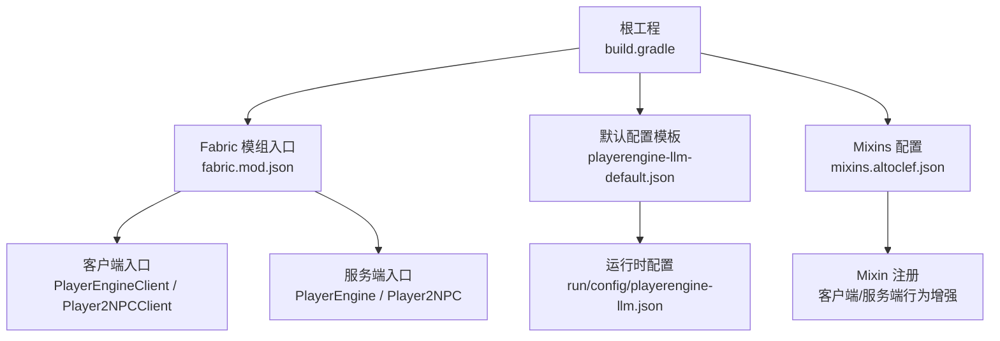
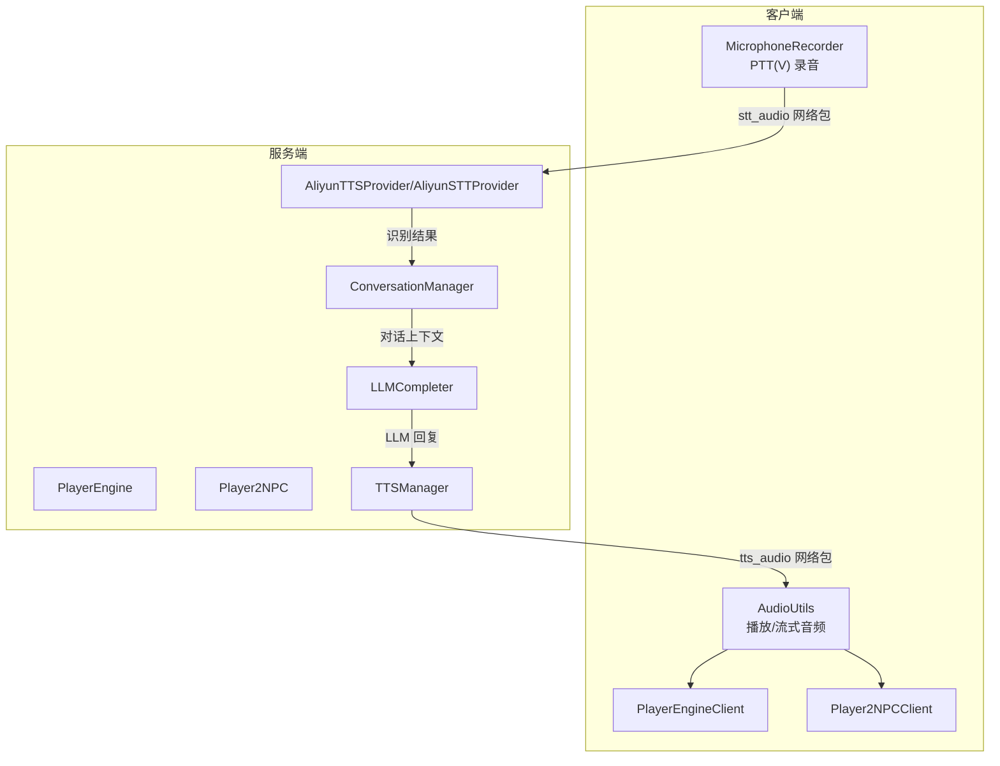
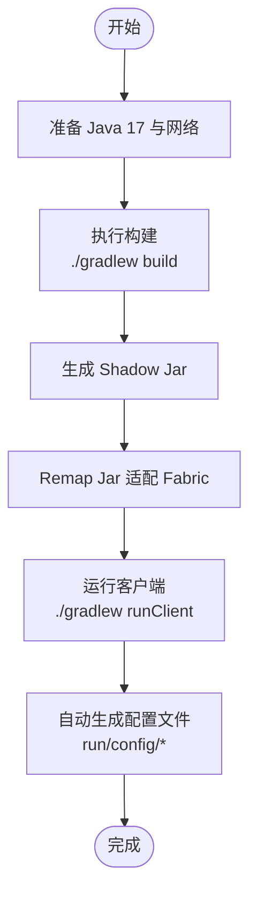
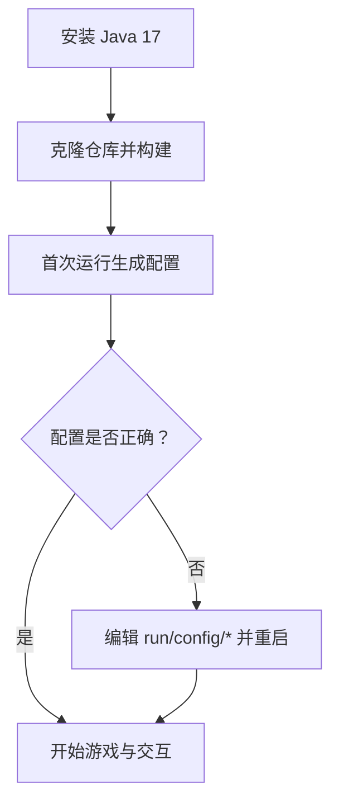
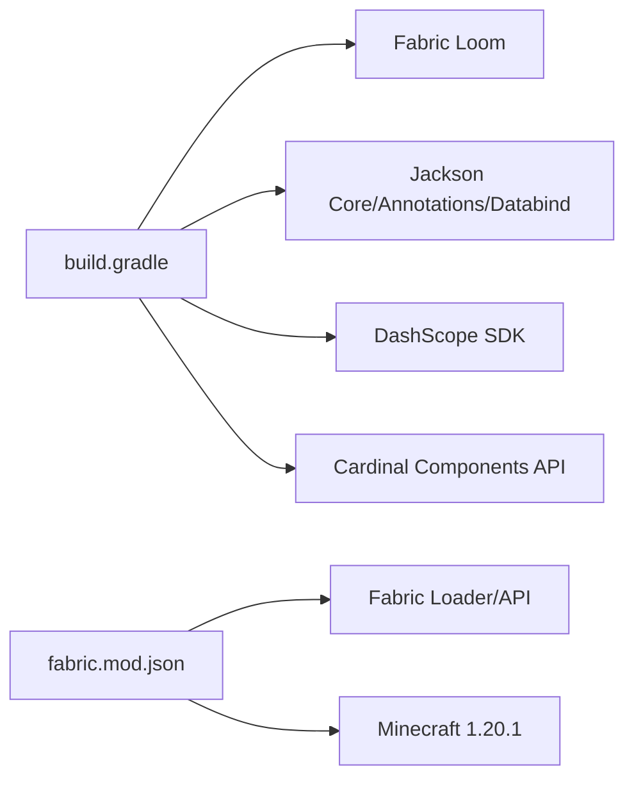

# 部署与运维

<cite>
**本文引用的文件**
- [README.md](file://README.md)
- [build.gradle](file://build.gradle)
- [settings.gradle](file://settings.gradle)
- [gradle.properties](file://gradle.properties)
- [gradle-wrapper.properties](file://gradle/wrapper/gradle-wrapper.properties)
- [fabric.mod.json](file://src/main/resources/fabric.mod.json)
- [playerengine-llm-default.json](file://src/main/resources/playerengine-llm-default.json)
- [playerengine-llm.json](file://run/config/playerengine-llm.json)
- [altoclef_settings.json](file://run/altoclef/altoclef_settings.json)
- [mixins.altoclef.json](file://src/main/resources/mixins.altoclef.json)
- [npc-roster.json](file://src/main/resources/npc-roster.json)
- [AuthenticationManager.java](file://src/main/java/adris/altoclef/player2api/auth/AuthenticationManager.java)
- [TieredConversationHistory.java](file://src/main/java/adris/altoclef/player2api/context/TieredConversationHistory.java)
- [Debug.java](file://src/main/java/adris/altoclef/Debug.java)
</cite>

## 目录
1. [简介](#简介)
2. [项目结构](#项目结构)
3. [核心组件](#核心组件)
4. [架构总览](#架构总览)
5. [详细组件分析](#详细组件分析)
6. [依赖关系分析](#依赖关系分析)
7. [性能考量](#性能考量)
8. [故障排查指南](#故障排查指南)
9. [结论](#结论)
10. [附录](#附录)

## 简介
本指南面向项目部署与运维，覆盖服务器端与客户端的部署流程、配置管理、服务启动与监控、打包与分发、安全配置、故障排查与性能优化等。文档同时提供面向用户的客户端安装与配置说明，帮助快速完成 Mod 安装、配置文件导入与常见问题排查。

## 项目结构
该项目为基于 Fabric 的 Minecraft Mod，核心模块包括：
- 客户端与服务端入口：通过 fabric.mod.json 声明入口点，分别在 main 与 client 环境加载。
- 配置体系：默认配置模板位于 resources，运行时生成实际配置文件于 run 目录。
- 构建与打包：使用 Gradle + Fabric Loom，产物为 Fabric Mod Jar，并进行 Shadow 打包以嵌入依赖。

图表来源
- [build.gradle:1-135](file://build.gradle#L1-L135)
- [fabric.mod.json:1-48](file://src/main/resources/fabric.mod.json#L1-L48)
- [playerengine-llm-default.json:1-89](file://src/main/resources/playerengine-llm-default.json#L1-L89)
- [mixins.altoclef.json:1-33](file://src/main/resources/mixins.altoclef.json#L1-L33)

章节来源
- [build.gradle:1-135](file://build.gradle#L1-L135)
- [settings.gradle:1-28](file://settings.gradle#L1-L28)
- [gradle.properties:1-35](file://gradle.properties#L1-L35)
- [gradle-wrapper.properties:1-6](file://gradle/wrapper/gradle-wrapper.properties#L1-L6)
- [fabric.mod.json:1-48](file://src/main/resources/fabric.mod.json#L1-L48)

## 核心组件
- 配置文件体系
  - LLM/TTS/STT 主配置：playerengine-llm.json（运行时生成于 run/config/），默认模板位于 resources。
  - Bot 行为配置：altoclef_settings.json（运行时生成于 run/altoclef/）。
  - Mixins 配置：mixins.altoclef.json（声明 Mixin 列表）。
- 构建与打包
  - Gradle 插件：Fabric Loom、Shadow Jar。
  - 产物：PlayerEngine-{classifier}.jar，包含 Jackson 与 DashScope SDK。
- 安全与鉴权
  - AuthenticationManager 支持本地与 Web 设备登录流程，令牌存储于 TokenStorage。
- 日志与调试
  - Debug 提供日志等级控制与堆栈输出能力。
  - TieredConversationHistory 支持对话历史压缩与摘要，降低 LLM 上下文成本。

章节来源
- [playerengine-llm-default.json:1-89](file://src/main/resources/playerengine-llm-default.json#L1-L89)
- [playerengine-llm.json:1-79](file://run/config/playerengine-llm.json#L1-L79)
- [altoclef_settings.json:1-48](file://run/altoclef/altoclef_settings.json#L1-L48)
- [mixins.altoclef.json:1-33](file://src/main/resources/mixins.altoclef.json#L1-L33)
- [build.gradle:71-94](file://build.gradle#L71-L94)
- [AuthenticationManager.java:1-79](file://src/main/java/adris/altoclef/player2api/auth/AuthenticationManager.java#L1-L79)
- [Debug.java:45-102](file://src/main/java/adris/altoclef/Debug.java#L45-L102)
- [TieredConversationHistory.java:108-146](file://src/main/java/adris/altoclef/player2api/context/TieredConversationHistory.java#L108-L146)

## 架构总览
系统分为客户端与服务端两部分，通过 Fabric 网络包进行交互：
- 客户端负责麦克风录音与音频播放，服务端负责对话管理、LLM 调用与 TTS/STT 处理。
- 配置文件在首次运行时自动生成，运行时状态文件（如对话历史）由系统维护。

图表来源
- [fabric.mod.json:17-28](file://src/main/resources/fabric.mod.json#L17-L28)
- [playerengine-llm-default.json:69-77](file://src/main/resources/playerengine-llm-default.json#L69-L77)
- [README.md:496-529](file://README.md#L496-L529)

章节来源
- [README.md:496-529](file://README.md#L496-L529)
- [fabric.mod.json:17-28](file://src/main/resources/fabric.mod.json#L17-L28)

## 详细组件分析

### 服务器端部署与启动
- 环境准备
  - Java 17（Minecraft 1.20.1 强制要求），Gradle 8.x（使用 wrapper）。
  - 首次构建会自动下载 Minecraft、Fabric 与依赖，耗时约 5-15 分钟。
- 构建与打包
  - 使用 Gradle Wrapper 执行构建，产物包含 Jackson 与 DashScope SDK。
  - Shadow Jar 与 Remap Jar 生成最终可加载的 Fabric Mod 包。
- 运行与配置
  - 首次运行后在 run 目录生成配置文件（playerengine-llm.json、altoclef_settings.json 等）。
  - 如需重置配置，删除对应文件后重启即可重建。

图表来源
- [build.gradle:71-94](file://build.gradle#L71-L94)
- [gradle-wrapper.properties:1-6](file://gradle/wrapper/gradle-wrapper.properties#L1-L6)
- [README.md:119-134](file://README.md#L119-L134)

章节来源
- [build.gradle:1-135](file://build.gradle#L1-L135)
- [gradle.properties:18-35](file://gradle.properties#L18-L35)
- [README.md:119-134](file://README.md#L119-L134)

### 客户端安装与配置
- 安装 Java 17 并确保 JAVA_HOME 指向正确版本。
- 克隆仓库后执行构建与启动，首次运行会生成配置文件。
- 配置文件导入与覆盖
  - LLM/TTS/STT 主配置：run/config/playerengine-llm.json（首次运行自动生成）。
  - Bot 行为配置：run/altoclef/altoclef_settings.json。
  - Mixins 配置：src/main/resources/mixins.altoclef.json（由 Fabric Loom 注入）。
- 常见问题排查
  - API Key 无效导致 401/403：前往 DashScope 控制台重新获取。
  - TTS 无声：检查 tts.enabled 与日志中 AliyunTTS 相关输出。
  - STT 识别为空：检查录音时长与麦克风权限。

图表来源
- [README.md:112-134](file://README.md#L112-L134)
- [playerengine-llm.json:1-79](file://run/config/playerengine-llm.json#L1-L79)
- [altoclef_settings.json:1-48](file://run/altoclef/altoclef_settings.json#L1-L48)

章节来源
- [README.md:112-134](file://README.md#L112-L134)
- [README.md:162-222](file://README.md#L162-L222)
- [README.md:224-243](file://README.md#L224-L243)
- [README.md:245-277](file://README.md#L245-L277)

### 配置文件详解
- LLM/TTS/STT 主配置（playerengine-llm.json）
  - activeProvider：当前 LLM 提供商（qwen_local/qwen/openai/player2-remote）。
  - providers：各提供商的启用状态、API 地址、API Key、模型、maxTokens、temperature。
  - tts/stt/proxy：TTS/STT 启用状态、模型、语言、音量、语速、音调等。
- Bot 行为配置（altoclef_settings.json）
  - commandPrefix、logLevel、autoEat、mobDefense、autoMLGBucket、throwAwayUnusedItems、importantItems、homeBasePosition、idleCommand 等。
- Mixins 配置（mixins.altoclef.json）
  - 声明 Mixin 列表，用于客户端/服务端行为增强。

章节来源
- [playerengine-llm-default.json:6-43](file://src/main/resources/playerengine-llm-default.json#L6-L43)
- [playerengine-llm-default.json:52-77](file://src/main/resources/playerengine-llm-default.json#L52-L77)
- [altoclef_settings.json:1-48](file://run/altoclef/altoclef_settings.json#L1-L48)
- [mixins.altoclef.json:10-32](file://src/main/resources/mixins.altoclef.json#L10-L32)

### 安全配置建议
- API Key 管理
  - 将 API Key 写入 playerengine-llm.json，避免提交至公共仓库。
  - 若使用 player2-remote 模式，AuthenticationManager 支持本地与 Web 设备登录流程，令牌存储于 TokenStorage。
- 网络通信
  - 通过 proxy.enabled 与 proxy.host/port 配置 HTTP 代理（适用于受限网络环境）。
- 访问控制
  - 通过 Fabric 模组入口与 Mixin 注册控制行为增强范围，避免过度暴露。

章节来源
- [playerengine-llm-default.json:4,45-50](file://src/main/resources/playerengine-llm-default.json#L4,L45-L50)
- [AuthenticationManager.java:18-79](file://src/main/java/adris/altoclef/player2api/auth/AuthenticationManager.java#L18-L79)

### 运维监控与日志
- 日志位置
  - 运行时日志位于 run/logs/latest.log。
- 关键日志关键词
  - LLM 配置加载、路由到提供商、调用完成、TTS 合成、STT 识别、PTT 录音状态等。
- 日志级别与调试
  - Debug 提供日志等级控制与堆栈输出，便于定位问题。

章节来源
- [README.md:456-491](file://README.md#L456-L491)
- [Debug.java:45-102](file://src/main/java/adris/altoclef/Debug.java#L45-L102)

### 打包与分发机制
- 构建脚本
  - 使用 Gradle Wrapper 与 Fabric Loom，执行 build 生成可加载的 Fabric Mod。
- 产物与分类器
  - Shadow Jar 与 Remap Jar 产物命名包含 classifier，便于区分开发与发布版本。
- 版本管理
  - 版本号与 Maven Group 在 gradle.properties 中定义，便于统一管理。

章节来源
- [build.gradle:71-94](file://build.gradle#L71-L94)
- [gradle.properties:22-24](file://gradle.properties#L22-L24)

### 故障排查完整指南
- 常见问题与解决
  - 构建失败（Unsupported class file major version）：确认 JAVA_HOME 指向 Java 17。
  - 依赖下载缓慢：配置阿里云 Maven 镜像或使用代理。
  - API Key 无效：前往 DashScope 控制台重新获取。
  - TTS 无声：检查 tts.enabled 与 AliyunTTS 相关日志。
  - STT 识别为空：检查录音时长与麦克风权限。
- 性能优化建议
  - 使用 TieredConversationHistory 对对话历史进行压缩与摘要，降低上下文长度。
  - 合理设置 LLM 的 maxTokens 与 temperature，平衡质量与成本。
- 备份与恢复
  - 备份 run/config 与 run/altoclef 目录，必要时删除后重启以重建默认配置。

章节来源
- [README.md:136-156](file://README.md#L136-L156)
- [README.md:480-491](file://README.md#L480-L491)
- [TieredConversationHistory.java:108-146](file://src/main/java/adris/altoclef/player2api/context/TieredConversationHistory.java#L108-L146)

## 依赖关系分析
- 构建期依赖
  - Fabric Loom、Jackson、DashScope SDK、Cardinal Components API。
- 运行期依赖
  - Fabric Loader 与 Fabric API、Minecraft 1.20.1、Cardinal Components。
- 产物依赖
  - Shadow Jar 将 Jackson 与 DashScope SDK 打包进最终产物，减少外部依赖。

图表来源
- [build.gradle:43-69](file://build.gradle#L43-L69)
- [fabric.mod.json:33-36](file://src/main/resources/fabric.mod.json#L33-L36)

章节来源
- [build.gradle:43-69](file://build.gradle#L43-L69)
- [fabric.mod.json:33-36](file://src/main/resources/fabric.mod.json#L33-L36)

## 性能考量
- 对话历史压缩
  - 通过 TieredConversationHistory 对普通消息进行摘要，降低 LLM 上下文开销。
- 日志级别控制
  - 使用 Debug 的日志等级控制，避免在生产环境输出过多日志。
- 网络与代理
  - 在受限网络环境下启用 proxy，提升 API 调用稳定性。

章节来源
- [TieredConversationHistory.java:108-146](file://src/main/java/adris/altoclef/player2api/context/TieredConversationHistory.java#L108-L146)
- [Debug.java:86-101](file://src/main/java/adris/altoclef/Debug.java#L86-L101)
- [playerengine-llm-default.json:45-50](file://src/main/resources/playerengine-llm-default.json#L45-L50)

## 故障排查指南
- 构建阶段
  - Unsupported class file major version：检查 JAVA_HOME 指向 Java 17。
  - Could not resolve dependencies：检查网络或配置阿里云镜像。
- 运行阶段
  - 401/403：重新获取 DashScope API Key。
  - TTS 无声：检查 tts.enabled 与 AliyunTTS 日志。
  - STT 识别为空：检查录音时长与麦克风权限。
- 日志定位
  - 使用 run/logs/latest.log 关键词辅助定位问题。

章节来源
- [README.md:136-156](file://README.md#L136-L156)
- [README.md:480-491](file://README.md#L480-L491)

## 结论
本指南提供了从环境准备、构建打包、配置导入到运维监控与故障排查的全流程实践。通过规范的配置管理、安全的 API Key 管理与合理的性能优化策略，可稳定运行该 Minecraft AI NPC Mod，并为后续扩展提供良好基础。

## 附录
- 快速检查清单
  - 确认 Java 17 与网络可用。
  - 首次运行后检查 run/config 与 run/altoclef 是否生成。
  - 配置 API Key 与模型参数，确保日志中无 401/403。
  - 如遇性能问题，调整 maxTokens/temperature 与对话历史压缩策略。
  - 在受限网络环境启用 proxy。