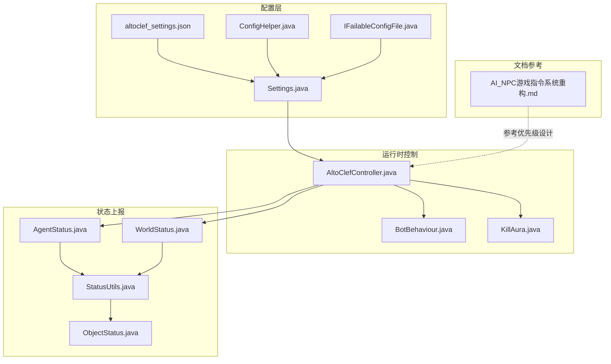
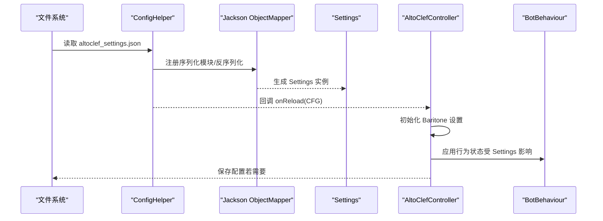
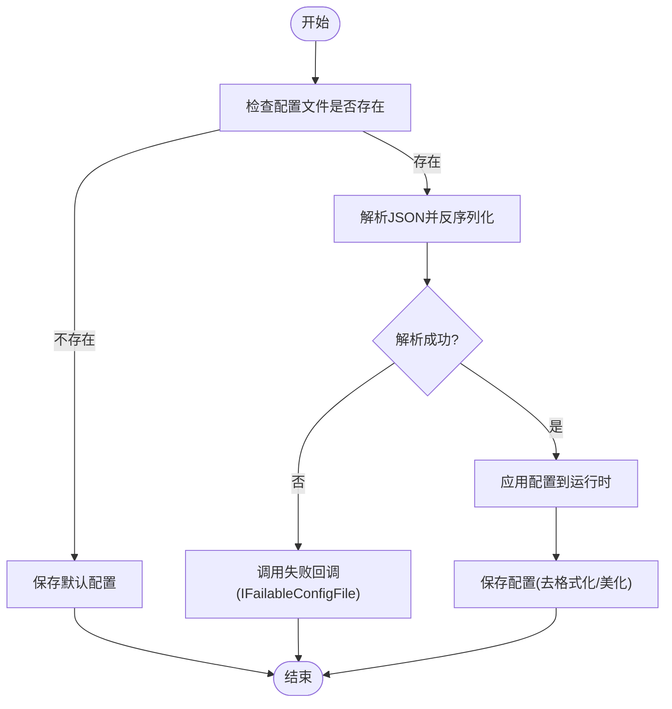
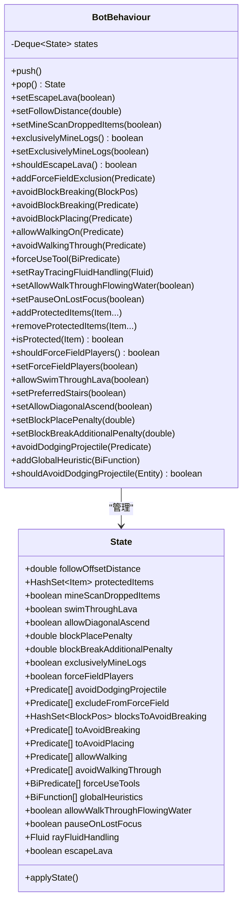
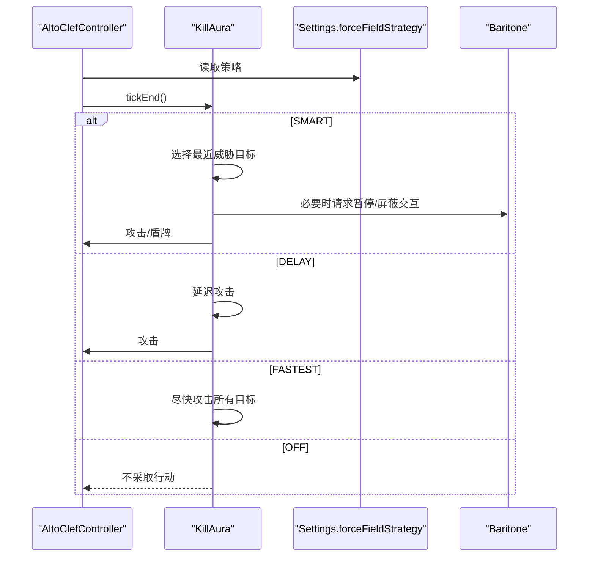
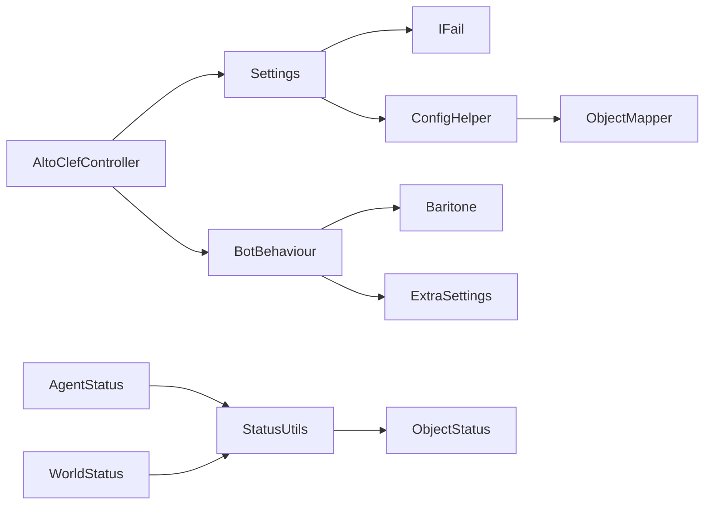

# Bot行为配置

<cite>
**本文引用的文件**
- [Settings.java](file://src/main/java/adris/altoclef/Settings.java)
- [altoclef_settings.json](file://run/altoclef/altoclef_settings.json)
- [ConfigHelper.java](file://src/main/java/adris/altoclef/util/helpers/ConfigHelper.java)
- [IFailableConfigFile.java](file://src/main/java/adris/altoclef/util/serialization/IFailableConfigFile.java)
- [ReloadSettingsCommand.java](file://src/main/java/adris/altoclef/commands/ReloadSettingsCommand.java)
- [AltoClefController.java](file://src/main/java/adris/altoclef/AltoClefController.java)
- [BotBehaviour.java](file://src/main/java/adris/altoclef/BotBehaviour.java)
- [AgentStatus.java](file://src/main/java/adris/altoclef/player2api/status/AgentStatus.java)
- [WorldStatus.java](file://src/main/java/adris/altoclef/player2api/status/WorldStatus.java)
- [StatusUtils.java](file://src/main/java/adris/altoclef/player2api/status/StatusUtils.java)
- [ObjectStatus.java](file://src/main/java/adris/altoclef/player2api/status/ObjectStatus.java)
- [KillAura.java](file://src/main/java/adris/altoclef/control/KillAura.java)
- [AI_NPC游戏指令系统重构.md](file://docs/AI_NPC游戏指令系统重构.md)
</cite>

## 目录
1. [简介](#简介)
2. [项目结构](#项目结构)
3. [核心组件](#核心组件)
4. [架构总览](#架构总览)
5. [详细组件分析](#详细组件分析)
6. [依赖关系分析](#依赖关系分析)
7. [性能考量](#性能考量)
8. [故障排除指南](#故障排除指南)
9. [结论](#结论)
10. [附录](#附录)

## 简介
本技术文档围绕 Bot 行为配置系统展开，重点解释 altoclef_settings.json 配置文件的行为参数、Settings 类的配置项管理机制、行为状态控制与参数验证逻辑，以及配置加载、动态更新与优先级管理。同时阐述 AgentStatus 与 WorldStatus 中的状态参数如何影响 Bot 的行为决策，并提供调优建议、性能优化与常见问题排查方法。

## 项目结构
本项目采用模块化分层组织，Bot 行为配置相关的核心文件集中在以下位置：
- 配置定义与加载：Settings.java、altoclef_settings.json、ConfigHelper.java
- 运行时行为控制：BotBehaviour.java、AltoClefController.java
- 状态上报与可视化：AgentStatus.java、WorldStatus.java、StatusUtils.java、ObjectStatus.java
- 行为策略与优先级：KillAura.java、AI_NPC游戏指令系统重构.md

**图表来源**
- [Settings.java:1-357](file://src/main/java/adris/altoclef/Settings.java#L1-L357)
- [altoclef_settings.json:1-48](file://run/altoclef/altoclef_settings.json#L1-L48)
- [ConfigHelper.java:1-243](file://src/main/java/adris/altoclef/util/helpers/ConfigHelper.java#L1-L243)
- [IFailableConfigFile.java:1-8](file://src/main/java/adris/altoclef/util/serialization/IFailableConfigFile.java#L1-L8)
- [AltoClefController.java:1-200](file://src/main/java/adris/altoclef/AltoClefController.java#L1-L200)
- [BotBehaviour.java:1-343](file://src/main/java/adris/altoclef/BotBehaviour.java#L1-L343)
- [KillAura.java:1-253](file://src/main/java/adris/altoclef/control/KillAura.java#L1-L253)
- [AgentStatus.java:1-24](file://src/main/java/adris/altoclef/player2api/status/AgentStatus.java#L1-L24)
- [WorldStatus.java:1-20](file://src/main/java/adris/altoclef/player2api/status/WorldStatus.java#L1-L20)
- [StatusUtils.java:1-322](file://src/main/java/adris/altoclef/player2api/status/StatusUtils.java#L1-L322)
- [ObjectStatus.java:1-27](file://src/main/java/adris/altoclef/player2api/status/ObjectStatus.java#L1-L27)
- [AI_NPC游戏指令系统重构.md:1472-1517](file://docs/AI_NPC游戏指令系统重构.md#L1472-L1517)

**章节来源**
- [Settings.java:1-357](file://src/main/java/adris/altoclef/Settings.java#L1-L357)
- [altoclef_settings.json:1-48](file://run/altoclef/altoclef_settings.json#L1-L48)
- [ConfigHelper.java:1-243](file://src/main/java/adris/altoclef/util/helpers/ConfigHelper.java#L1-L243)
- [AltoClefController.java:1-200](file://src/main/java/adris/altoclef/AltoClefController.java#L1-L200)

## 核心组件
- 配置模型 Settings：定义所有行为参数，提供读取器方法与失败标记；通过静态方法加载配置并回调应用。
- 配置加载器 ConfigHelper：统一处理 JSON 文件读写、序列化/反序列化、默认值生成与保存、重载机制。
- 运行时控制器 AltoClefController：初始化 Baritone 设置、注册行为链、应用 Settings 并驱动 Tick。
- 行为状态机 BotBehaviour：以栈形式管理可变行为状态，支持入栈/出栈、条件避让、工具强制使用、全局启发式等。
- 状态上报 AgentStatus/WorldStatus：将 Agent 与世界状态转换为字符串结构，供外部服务消费。
- 行为策略 KillAura：基于配置选择攻击策略（SMART/DELAY/FASTEST/OFF），并结合状态进行盾牌/近战控制。
- 文档参考 AI_NPC游戏指令系统重构：明确行为链优先级与抢占规则，指导配置调优。

**章节来源**
- [Settings.java:32-357](file://src/main/java/adris/altoclef/Settings.java#L32-L357)
- [ConfigHelper.java:33-243](file://src/main/java/adris/altoclef/util/helpers/ConfigHelper.java#L33-L243)
- [AltoClefController.java:53-134](file://src/main/java/adris/altoclef/AltoClefController.java#L53-L134)
- [BotBehaviour.java:22-343](file://src/main/java/adris/altoclef/BotBehaviour.java#L22-L343)
- [AgentStatus.java:6-23](file://src/main/java/adris/altoclef/player2api/status/AgentStatus.java#L6-L23)
- [WorldStatus.java:5-18](file://src/main/java/adris/altoclef/player2api/status/WorldStatus.java#L5-L18)
- [KillAura.java:35-253](file://src/main/java/adris/altoclef/control/KillAura.java#L35-L253)
- [AI_NPC游戏指令系统重构.md:1472-1517](file://docs/AI_NPC游戏指令系统重构.md#L1472-L1517)

## 架构总览
Bot 行为配置系统由“配置定义—配置加载—运行时应用—状态上报”四层构成。配置文件通过 Jackson 序列化，加载器负责容错与持久化；控制器在启动时读取配置并将其映射到 Baritone 与自定义行为；状态模块将当前 Agent 与世界状态打包输出。

**图表来源**
- [ConfigHelper.java:48-99](file://src/main/java/adris/altoclef/util/helpers/ConfigHelper.java#L48-L99)
- [Settings.java:149-151](file://src/main/java/adris/altoclef/Settings.java#L149-L151)
- [AltoClefController.java:113-126](file://src/main/java/adris/altoclef/AltoClefController.java#L113-L126)
- [BotBehaviour.java:187-213](file://src/main/java/adris/altoclef/BotBehaviour.java#L187-L213)

## 详细组件分析

### 配置文件 altoclef_settings.json 参数说明与调优
- 基础日志与界面
  - showDebugTickMs：是否显示调试耗时
  - showTaskChains：是否展示任务链
  - hideAllWarningLogs：隐藏警告日志
  - commandPrefix：命令前缀
  - logLevel：日志级别
  - chatLogPrefix：聊天日志前缀
  - showTimer：是否显示计时
- 资源与采集
  - resourcePickupDropRange：资源拾取/掉落范围
  - resourceChestLocateRange：容器定位范围
  - resourceMineRange：挖矿范围
  - prioritizeContainerResources：优先容器内资源
  - avoidSearchingDungeonChests：避免搜寻地牢箱子
  - avoidOceanBlocks：避免海洋方块
- 饥饿与食物
  - minimumFoodAllowed：最低允许食物量
  - foodUnitsToCollect：收集食物单位数
  - autoEat：自动进食
- 移动与路径
  - entityReachRange：实体交互距离
  - collectPickaxeFirst：优先收集镐
  - replantCrops：重新种植作物
  - autoCloseScreenWhenLookingOrMining：观察或挖掘时关闭界面
  - extinguishSelfWithWater：着火时用水灭火
- 安全与战斗
  - mobDefense：启用怪物防御
  - forceFieldStrategy：力场/攻击策略（SMART/DELAY/FASTEST/OFF）
  - dodgeProjectiles：闪避抛射物
  - killOrAvoidAnnoyingHostiles：驱逐或避开烦人敌对生物
  - avoidDrowning：避免溺水
  - autoMLGBucket：MLG（桶跳）相关自动行为
- 维度与闲置
  - overworldToNetherBehaviour：主世界进入下界行为
  - netherFastTravelWalkingRange：下路快速旅行步行范围
  - idleCommand：非活动时执行的命令
  - deathCommand：死亡时执行的命令
- 物品处理
  - throwawayItems：丢弃物品清单
  - reservedBuildingBlockCount：保留建筑方块数量
  - dontThrowAwayCustomNameItems：不丢弃带名物品
  - dontThrowAwayEnchantedItems：不丢弃附魔物品
  - throwAwayUnusedItems：丢弃未用物品
  - importantItems：重要物品清单
  - limitFuelsToSupportedFuels：限制燃料为受支持类型
  - supportedFuels：受支持燃料列表
- 基地与保护
  - homeBasePosition：基地坐标
  - areasToProtect：保护区域列表
- 兼容性与历史字段
  - resourcePickupRange：兼容字段（与 resourcePickupDropRange 含义一致）

调优建议
- 在 PVP 或高威胁环境提高 forceFieldStrategy 至 SMART/DELAY，确保及时反击。
- 高负载服务器下调大 resourceChestLocateRange 与 resourceMineRange，减少频繁扫描。
- 长时间挂机场景开启 autoMLGBucket 与 autoReconnect/autoRespawn 提升鲁棒性。
- 对新手玩家建议开启 mobDefense 与 dodgeProjectiles，降低死亡风险。

**章节来源**
- [altoclef_settings.json:1-48](file://run/altoclef/altoclef_settings.json#L1-L48)
- [Settings.java:36-345](file://src/main/java/adris/altoclef/Settings.java#L36-L345)

### Settings 类：配置项管理与参数验证
- 配置项管理
  - 使用 Jackson 注解控制序列化可见性与忽略未知字段。
  - 提供大量 getter 方法用于运行时读取。
  - 支持物品列表（throwawayItems、importantItems、supportedFuels）的序列化/反序列化。
- 加载与失败处理
  - 通过 Settings.load 触发 ConfigHelper 加载流程。
  - 实现 IFailableConfigFile 接口，失败时标记 failedToLoad。
- 关键行为开关
  - autoEat、avoidDrowning、autoMLGBucket、autoReconnect、autoRespawn 等。
  - forceFieldStrategy 控制 KillAura 的攻击节奏。
  - resource* 系列参数控制资源搜索范围与策略。

参数验证
- JSON 解析异常时记录错误并调用 onFailLoad，避免崩溃。
- 未知字段被忽略（@JsonIgnoreProperties(ignoreUnknown = true)）。

**章节来源**
- [Settings.java:26-32](file://src/main/java/adris/altoclef/Settings.java#L26-L32)
- [Settings.java:149-151](file://src/main/java/adris/altoclef/Settings.java#L149-L151)
- [Settings.java:347-355](file://src/main/java/adris/altoclef/Settings.java#L347-L355)
- [IFailableConfigFile.java:3-7](file://src/main/java/adris/altoclef/util/serialization/IFailableConfigFile.java#L3-L7)

### 配置加载机制与动态更新
- 加载流程
  - ConfigHelper.getConfig 读取文件，注册 Vec3/BlockPos/ChunkPos 的序列化模块。
  - 若解析失败，记录错误并调用 IFailableConfigFile 的失败回调。
  - 保存配置以生成默认文件与美化输出。
- 动态更新
  - ConfigHelper.reloadAllConfigs 遍历已注册配置并触发 onReload 回调。
  - ReloadSettingsCommand 执行重载并提示成功。
- 配置优先级
  - 本地配置文件优先于默认生成。
  - 运行时通过 Settings.load 的回调即时生效，无需重启。

**图表来源**
- [ConfigHelper.java:48-99](file://src/main/java/adris/altoclef/util/helpers/ConfigHelper.java#L48-L99)
- [IFailableConfigFile.java:3-7](file://src/main/java/adris/altoclef/util/serialization/IFailableConfigFile.java#L3-L7)

**章节来源**
- [ConfigHelper.java:48-99](file://src/main/java/adris/altoclef/util/helpers/ConfigHelper.java#L48-L99)
- [ReloadSettingsCommand.java:8-19](file://src/main/java/adris/altoclef/commands/ReloadSettingsCommand.java#L8-L19)

### 行为状态控制与参数验证（BotBehaviour）
- 状态栈管理
  - push/pop 维护状态栈，current 返回当前状态并应用到 Baritone 与自定义设置。
- 可变行为参数
  - followOffsetDistance、mineScanDroppedItems、allowDiagonalAscend、blockPlacePenalty、blockBreakAdditionalPenalty、allowWalkThroughFlowingWater、rayFluidHandling、escapeLava 等。
- 条件避让与保护
  - avoidBlockBreaking/avoidBlockPlacing/allowWalkingThrough/forceUseTool 等谓词集合。
  - protectedItems 保护清单，isProtected 判定。
- 全局启发式
  - globalHeuristics 支持注入自定义启发式函数。

**图表来源**
- [BotBehaviour.java:224-341](file://src/main/java/adris/altoclef/BotBehaviour.java#L224-L341)

**章节来源**
- [BotBehaviour.java:187-213](file://src/main/java/adris/altoclef/BotBehaviour.java#L187-L213)
- [BotBehaviour.java:224-341](file://src/main/java/adris/altoclef/BotBehaviour.java#L224-L341)

### 行为策略与优先级（KillAura 与行为链）
- KillAura 策略
  - SMART：智能延迟攻击，优先处理火球等威胁目标。
  - DELAY：延迟攻击，适合稳定输出。
  - FASTEST：尽快攻击，适合高威胁或 PVP。
  - OFF：关闭自动攻击。
- 行为链优先级
  - 参考文档中行为链优先级从高到低排列，MobDefenseChain 在危险时可抢占 UserTaskChain。
  - 重构后用户命令在 HIGH_PRIORITY 模式下优先级为 100，仅在极低血量时才允许被 MobDefenseChain 抢占。

**图表来源**
- [KillAura.java:101-118](file://src/main/java/adris/altoclef/control/KillAura.java#L101-L118)
- [Settings.java:57-57](file://src/main/java/adris/altoclef/Settings.java#L57-L57)
- [AI_NPC游戏指令系统重构.md:1472-1517](file://docs/AI_NPC游戏指令系统重构.md#L1472-L1517)

**章节来源**
- [KillAura.java:101-118](file://src/main/java/adris/altoclef/control/KillAura.java#L101-L118)
- [AI_NPC游戏指令系统重构.md:1472-1517](file://docs/AI_NPC游戏指令系统重构.md#L1472-L1517)

### AgentStatus 与 WorldStatus：状态参数与行为影响
- AgentStatus：包含位置、生命值、饥饿与饱和度、背包内容、任务状态、氧气、护甲、游戏模式等。
- WorldStatus：包含天气、维度、出生点、附近方块、敌对怪物、附近玩家/NPC、主人危险等级、难度与时长等。
- StatusUtils：提供字符串化工具，限制报告数量（如附近方块类型最多 15 种，敌对怪物取最近 3 个），避免消息过大。

这些状态参数直接影响 LLM/外部服务对 Bot 当前状况的理解，从而决定对话与任务调度策略。

**章节来源**
- [AgentStatus.java:6-23](file://src/main/java/adris/altoclef/player2api/status/AgentStatus.java#L6-L23)
- [WorldStatus.java:5-18](file://src/main/java/adris/altoclef/player2api/status/WorldStatus.java#L5-L18)
- [StatusUtils.java:78-119](file://src/main/java/adris/altoclef/player2api/status/StatusUtils.java#L78-L119)
- [StatusUtils.java:125-154](file://src/main/java/adris/altoclef/player2api/status/StatusUtils.java#L125-L154)
- [ObjectStatus.java:10-25](file://src/main/java/adris/altoclef/player2api/status/ObjectStatus.java#L10-L25)

## 依赖关系分析
- Settings 依赖 Jackson 注解与序列化器，依赖 IFailableConfigFile 处理失败。
- ConfigHelper 依赖 ObjectMapper 与自定义序列化模块，负责文件 IO 与重载。
- AltoClefController 依赖 Settings 与 BotBehaviour，初始化 Baritone 设置并在加载后应用配置。
- BotBehaviour 依赖 Baritone 与自定义 AltoClefSettings，维护状态栈并应用到底层设置。
- 状态模块相互独立，但共同服务于外部服务消费。

**图表来源**
- [Settings.java:26-32](file://src/main/java/adris/altoclef/Settings.java#L26-L32)
- [ConfigHelper.java:55-60](file://src/main/java/adris/altoclef/util/helpers/ConfigHelper.java#L55-L60)
- [AltoClefController.java:113-126](file://src/main/java/adris/altoclef/AltoClefController.java#L113-L126)
- [BotBehaviour.java:269-340](file://src/main/java/adris/altoclef/BotBehaviour.java#L269-L340)
- [AgentStatus.java:6-23](file://src/main/java/adris/altoclef/player2api/status/AgentStatus.java#L6-L23)
- [WorldStatus.java:5-18](file://src/main/java/adris/altoclef/player2api/status/WorldStatus.java#L5-L18)
- [StatusUtils.java:28-51](file://src/main/java/adris/altoclef/player2api/status/StatusUtils.java#L28-L51)

**章节来源**
- [AltoClefController.java:113-126](file://src/main/java/adris/altoclef/AltoClefController.java#L113-L126)
- [BotBehaviour.java:269-340](file://src/main/java/adris/altoclef/BotBehaviour.java#L269-L340)

## 性能考量
- 配置读写
  - 使用 Jackson 模块化序列化，避免重复解析；保存时启用美化输出，便于人工维护。
- 状态上报
  - StatusUtils 对“附近方块类型”和“敌对怪物”进行上限裁剪，防止消息过大导致 LLM 调用失败。
- 行为链优先级
  - 通过文档中的优先级设计，避免低优先级任务长期占用 CPU；在危险时提升 MobDefenseChain 优先级，保障生存。
- 运行时设置
  - BotBehaviour 的状态栈只在必要时 applyState，减少对底层设置的频繁写入。

[本节为通用性能建议，不直接分析具体文件，故无章节来源]

## 故障排除指南
- 配置解析失败
  - 现象：日志出现 JSON 解析错误，配置未生效。
  - 处理：检查 altoclef_settings.json 语法与字段拼写；系统会调用 IFailableConfigFile 标记失败并回退到默认行为。
- 配置未生效
  - 现象：修改配置后行为不变。
  - 处理：执行 reload_settings 命令触发 ConfigHelper.reloadAllConfigs，或重启服务。
- 行为冲突
  - 现象：MobDefenseChain 抢占 UserTaskChain 导致命令中断。
  - 处理：参考行为链优先级文档，将用户命令置于 HIGH_PRIORITY；或在安全环境下降低 forceFieldStrategy 至 DELAY。
- 性能瓶颈
  - 现象：服务器卡顿、CPU 占用高。
  - 处理：降低 resourceChestLocateRange/resourceMineRange；关闭不必要的日志与任务链；合理设置 autoEat 与 autoMLGBucket。

**章节来源**
- [ConfigHelper.java:62-89](file://src/main/java/adris/altoclef/util/helpers/ConfigHelper.java#L62-L89)
- [IFailableConfigFile.java:3-7](file://src/main/java/adris/altoclef/util/serialization/IFailableConfigFile.java#L3-L7)
- [ReloadSettingsCommand.java:14-18](file://src/main/java/adris/altoclef/commands/ReloadSettingsCommand.java#L14-L18)
- [AI_NPC游戏指令系统重构.md:1472-1517](file://docs/AI_NPC游戏指令系统重构.md#L1472-L1517)

## 结论
Bot 行为配置系统通过清晰的配置文件、健壮的加载与失败处理、灵活的行为状态栈与策略选择，实现了可调优、可扩展且稳定的 AI 行为。配合状态上报模块与行为链优先级设计，能够在复杂环境中保持高效与安全。建议在生产环境中定期校验配置文件、按场景调整策略与范围参数，并利用动态重载能力实现平滑更新。

[本节为总结性内容，不直接分析具体文件，故无章节来源]

## 附录

### 配置示例与字段对照
- 示例文件：run/altoclef/altoclef_settings.json
- 字段对照：见“配置文件 altoclef_settings.json 参数说明与调优”

**章节来源**
- [altoclef_settings.json:1-48](file://run/altoclef/altoclef_settings.json#L1-L48)