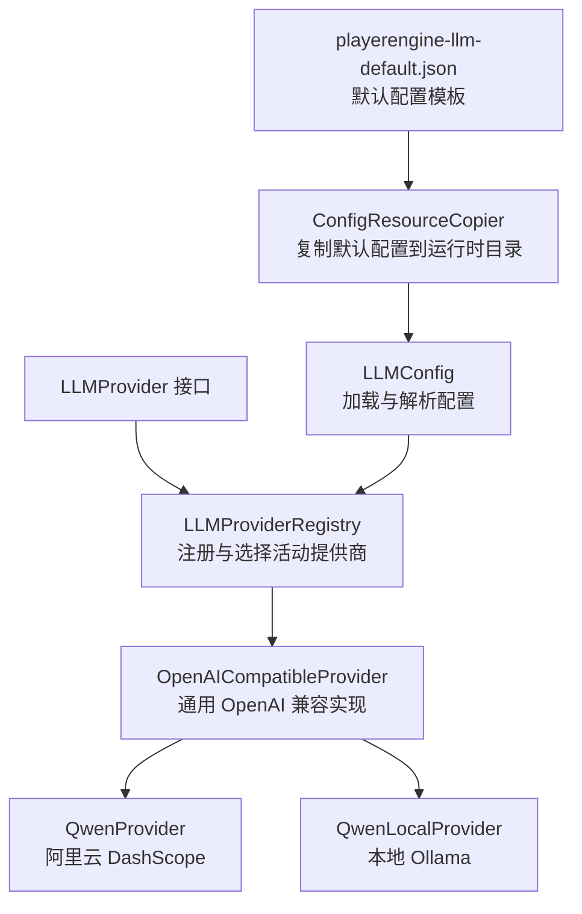
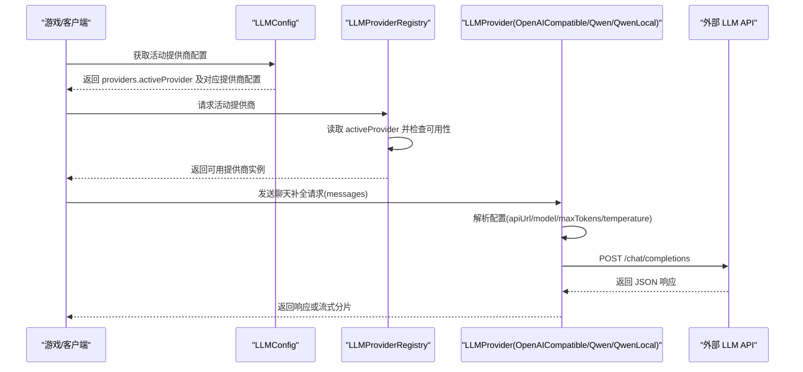
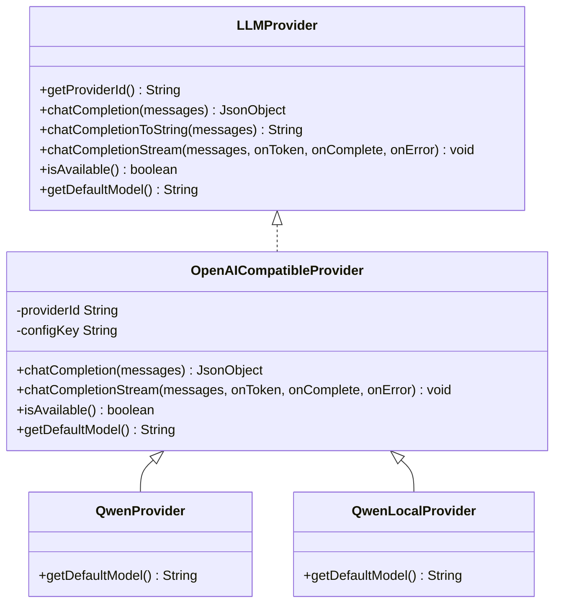
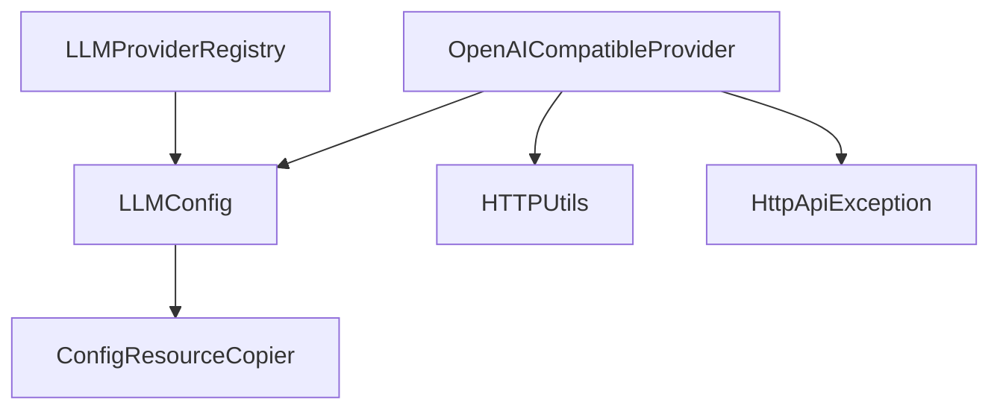

# LLM 配置管理

<cite>
**本文引用的文件**
- [playerengine-llm-default.json](file://src/main/resources/playerengine-llm-default.json)
- [LLMConfig.java](file://src/main/java/adris/altoclef/player2api/llm/LLMConfig.java)
- [LLMProvider.java](file://src/main/java/adris/altoclef/player2api/llm/LLMProvider.java)
- [LLMProviderRegistry.java](file://src/main/java/adris/altoclef/player2api/llm/LLMProviderRegistry.java)
- [OpenAICompatibleProvider.java](file://src/main/java/adris/altoclef/player2api/llm/impl/OpenAICompatibleProvider.java)
- [QwenProvider.java](file://src/main/java/adris/altoclef/player2api/llm/impl/QwenProvider.java)
- [QwenLocalProvider.java](file://src/main/java/adris/altoclef/player2api/llm/impl/QwenLocalProvider.java)
- [ConfigResourceCopier.java](file://src/main/java/adris/altoclef/player2api/utils/ConfigResourceCopier.java)
- [HTTPUtils.java](file://src/main/java/adris/altoclef/player2api/utils/HTTPUtils.java)
- [HttpApiException.java](file://src/main/java/adris/altoclef/player2api/utils/HttpApiException.java)
</cite>

## 目录
1. [简介](#简介)
2. [项目结构](#项目结构)
3. [核心组件](#核心组件)
4. [架构总览](#架构总览)
5. [详细组件分析](#详细组件分析)
6. [依赖关系分析](#依赖关系分析)
7. [性能考虑](#性能考虑)
8. [故障排查指南](#故障排查指南)
9. [结论](#结论)
10. [附录](#附录)

## 简介
本文件面向 LLM 配置管理，围绕 playerengine-llm-default.json 中的 LLM 提供商配置进行深入解析，涵盖 qwen_local、qwen、openai、player2-remote 等不同提供商的配置参数与使用场景；解释 providers 对象结构及关键参数（apiUrl、apiKey、model、maxTokens、temperature 等）的作用与取值范围；说明配置文件的加载机制、默认值处理与配置验证逻辑；并提供针对本地 Ollama、阿里云 DashScope、OpenAI API 等场景的具体配置示例与调优建议、性能优化策略、常见问题排查。

## 项目结构
与 LLM 配置管理直接相关的文件组织如下：
- 默认配置模板：src/main/resources/playerengine-llm-default.json
- 配置加载与解析：src/main/java/adris/altoclef/player2api/llm/LLMConfig.java
- 提供商接口与注册表：src/main/java/adris/altoclef/player2api/llm/LLMProvider.java、src/main/java/adris/altoclef/player2api/llm/LLMProviderRegistry.java
- 具体提供商实现：src/main/java/adris/altoclef/player2api/llm/impl/OpenAICompatibleProvider.java、QwenProvider.java、QwenLocalProvider.java
- 配置资源复制工具：src/main/java/adris/altoclef/player2api/utils/ConfigResourceCopier.java
- 通用 HTTP 工具与异常：src/main/java/adris/altoclef/player2api/utils/HTTPUtils.java、src/main/java/adris/altoclef/player2api/utils/HttpApiException.java

图表来源
- [playerengine-llm-default.json:1-89](file://src/main/resources/playerengine-llm-default.json#L1-L89)
- [ConfigResourceCopier.java:29-37](file://src/main/java/adris/altoclef/player2api/utils/ConfigResourceCopier.java#L29-L37)
- [LLMConfig.java:54-89](file://src/main/java/adris/altoclef/player2api/llm/LLMConfig.java#L54-L89)
- [LLMProvider.java:11-66](file://src/main/java/adris/altoclef/player2api/llm/LLMProvider.java#L11-L66)
- [LLMProviderRegistry.java:49-70](file://src/main/java/adris/altoclef/player2api/llm/LLMProviderRegistry.java#L49-L70)
- [OpenAICompatibleProvider.java:51-110](file://src/main/java/adris/altoclef/player2api/llm/impl/OpenAICompatibleProvider.java#L51-L110)
- [QwenProvider.java:11-22](file://src/main/java/adris/altoclef/player2api/llm/impl/QwenProvider.java#L11-L22)
- [QwenLocalProvider.java:12-23](file://src/main/java/adris/altoclef/player2api/llm/impl/QwenLocalProvider.java#L12-L23)

章节来源
- [playerengine-llm-default.json:1-89](file://src/main/resources/playerengine-llm-default.json#L1-L89)
- [LLMConfig.java:19-89](file://src/main/java/adris/altoclef/player2api/llm/LLMConfig.java#L19-L89)
- [LLMProviderRegistry.java:16-79](file://src/main/java/adris/altoclef/player2api/llm/LLMProviderRegistry.java#L16-L79)

## 核心组件
- LLMConfig：负责定位并加载运行时配置文件，解析 activeProvider、providers、proxy、tts、stt 等字段，并对部分参数进行基础校验与日志提示。
- LLMProvider：统一的 LLM 提供商接口，定义 chatCompletion、chatCompletionToString、chatCompletionStream、isAvailable、getDefaultModel 等能力。
- LLMProviderRegistry：提供商注册表，内置注册 Qwen、OpenAI 兼容、本地 Ollama 等提供商，并根据配置选择活动提供商，支持可用性回退。
- OpenAICompatibleProvider：通用 OpenAI 兼容实现，封装请求构建、连接建立、流式与非流式响应处理、代理支持、可用性判断与默认参数。
- QwenProvider、QwenLocalProvider：基于 OpenAI 兼容实现的特定提供商，分别对接阿里云 DashScope 与本地 Ollama。

章节来源
- [LLMConfig.java:19-115](file://src/main/java/adris/altoclef/player2api/llm/LLMConfig.java#L19-L115)
- [LLMProvider.java:11-66](file://src/main/java/adris/altoclef/player2api/llm/LLMProvider.java#L11-L66)
- [LLMProviderRegistry.java:16-79](file://src/main/java/adris/altoclef/player2api/llm/LLMProviderRegistry.java#L16-L79)
- [OpenAICompatibleProvider.java:24-225](file://src/main/java/adris/altoclef/player2api/llm/impl/OpenAICompatibleProvider.java#L24-L225)
- [QwenProvider.java:11-22](file://src/main/java/adris/altoclef/player2api/llm/impl/QwenProvider.java#L11-L22)
- [QwenLocalProvider.java:12-23](file://src/main/java/adris/altoclef/player2api/llm/impl/QwenLocalProvider.java#L12-L23)

## 架构总览
下图展示了 LLM 配置管理的整体架构与数据流：

图表来源
- [LLMConfig.java:54-89](file://src/main/java/adris/altoclef/player2api/llm/LLMConfig.java#L54-L89)
- [LLMProviderRegistry.java:49-70](file://src/main/java/adris/altoclef/player2api/llm/LLMProviderRegistry.java#L49-L70)
- [OpenAICompatibleProvider.java:112-141](file://src/main/java/adris/altoclef/player2api/llm/impl/OpenAICompatibleProvider.java#L112-L141)

## 详细组件分析

### 配置文件结构与参数说明
- 文件位置与加载
  - 默认模板位于 src/main/resources/playerengine-llm-default.json。
  - 运行时配置通过 ConfigResourceCopier 确保复制到运行时配置目录，随后由 LLMConfig 加载。
- 关键字段
  - activeProvider：当前使用的提供商标识（如 qwen_local、qwen、openai、player2-remote）。
  - providers：提供商集合，包含各提供商的 enabled、apiUrl、apiKey、model、maxTokens、temperature 等。
  - proxy：HTTP 代理设置（enabled/host/port），用于访问海外服务时的网络需求。
  - tts/stt/progressVoice：语音合成、语音识别与任务进度语音反馈配置（与 LLM 配置同级）。

章节来源
- [playerengine-llm-default.json:6-87](file://src/main/resources/playerengine-llm-default.json#L6-L87)
- [ConfigResourceCopier.java:29-37](file://src/main/java/adris/altoclef/player2api/utils/ConfigResourceCopier.java#L29-L37)
- [LLMConfig.java:54-89](file://src/main/java/adris/altoclef/player2api/llm/LLMConfig.java#L54-L89)

### providers 对象结构与关键参数
- 结构
  - providers 是一个对象，键为提供商标识（如 qwen_local、qwen、openai、player2-remote），值为该提供商的配置对象。
- 关键参数作用与取值范围
  - enabled：布尔值，控制提供商是否启用。
  - apiUrl：字符串，LLM API 的基础地址。OpenAI 兼容实现会附加 /chat/completions。
  - apiKey：字符串，访问令牌。若为空或占位符则视为不可用。
  - model：字符串，默认模型名称。OpenAI 兼容实现会将其作为请求体的 model 字段。
  - maxTokens：整数，最大生成长度，OpenAI 兼容实现会限制在 [1, 65536]。
  - temperature：浮点数，采样温度，OpenAI 兼容实现会将其作为请求体的 temperature 字段。
- 参数校验与默认值
  - LLMConfig 在加载时会对 maxTokens 进行最小值告警（小于 256 时记录警告）。
  - OpenAI 兼容实现对 maxTokens 进行边界裁剪，并提供默认值与默认模型。

章节来源
- [playerengine-llm-default.json:9-43](file://src/main/resources/playerengine-llm-default.json#L9-L43)
- [LLMConfig.java:77-83](file://src/main/java/adris/altoclef/player2api/llm/LLMConfig.java#L77-L83)
- [OpenAICompatibleProvider.java:51-71](file://src/main/java/adris/altoclef/player2api/llm/impl/OpenAICompatibleProvider.java#L51-L71)
- [OpenAICompatibleProvider.java:222-224](file://src/main/java/adris/altoclef/player2api/llm/impl/OpenAICompatibleProvider.java#L222-L224)

### 配置加载机制与默认值处理
- 加载流程
  - LLMConfig.getInstance() 单例初始化时调用 load()。
  - load() 通过 ConfigResourceCopier 确保配置文件存在并读取 JSON 根节点。
  - 解析 activeProvider、providers、proxy、tts、stt 等子对象。
  - 对 providers 中的每个提供商配置进行 maxTokens 最小值校验并记录日志。
- 默认值处理
  - OpenAI 兼容实现在缺少配置时提供默认值（如 apiUrl、apiKey、model、maxTokens、temperature）。
  - LLMConfig 对 proxy 的 host/port 提供默认值（host 默认 127.0.0.1，port 默认 8001）。

章节来源
- [LLMConfig.java:54-89](file://src/main/java/adris/altoclef/player2api/llm/LLMConfig.java#L54-L89)
- [OpenAICompatibleProvider.java:52-57](file://src/main/java/adris/altoclef/player2api/llm/impl/OpenAICompatibleProvider.java#L52-L57)
- [LLMConfig.java:104-110](file://src/main/java/adris/altoclef/player2api/llm/LLMConfig.java#L104-L110)

### 配置验证逻辑
- 可用性判断
  - OpenAI 兼容实现的 isAvailable() 要求 enabled 为真且 apiKey 非空且不为占位符。
  - LLMProviderRegistry 在获取活动提供商时优先尝试配置的提供商，若不可用则回退到第一个可用提供商。
- 错误处理
  - OpenAI 兼容实现对非 2xx 状态码抛出异常，并记录错误响应。
  - HTTPUtils 对 HTTP 4xx/5xx 抛出带状态码的异常，便于上层捕获与处理。

章节来源
- [OpenAICompatibleProvider.java:211-219](file://src/main/java/adris/altoclef/player2api/llm/impl/OpenAICompatibleProvider.java#L211-L219)
- [LLMProviderRegistry.java:49-70](file://src/main/java/adris/altoclef/player2api/llm/LLMProviderRegistry.java#L49-L70)
- [HTTPUtils.java:57-87](file://src/main/java/adris/altoclef/player2api/utils/HTTPUtils.java#L57-L87)
- [HttpApiException.java:22-33](file://src/main/java/adris/altoclef/player2api/utils/HttpApiException.java#L22-L33)

### 提供商实现与调用流程
- OpenAI 兼容实现
  - 构建请求体：model/messages/max_tokens/temperature/stream。
  - 支持代理：根据 LLMConfig 的 proxy 设置决定是否使用 HTTP 代理。
  - 非流式：读取完整响应并解析为 JSON。
  - 流式：解析 SSE 数据块，逐个回调 token，首 token 记录 TTFT。
- 特定提供商
  - QwenProvider：继承 OpenAI 兼容实现，提供默认模型“qwen-plus”。
  - QwenLocalProvider：继承 OpenAI 兼容实现，提供默认模型“qwen2.5:7b”，适用于本地 Ollama。

图表来源
- [LLMProvider.java:11-66](file://src/main/java/adris/altoclef/player2api/llm/LLMProvider.java#L11-L66)
- [OpenAICompatibleProvider.java:24-225](file://src/main/java/adris/altoclef/player2api/llm/impl/OpenAICompatibleProvider.java#L24-L225)
- [QwenProvider.java:11-22](file://src/main/java/adris/altoclef/player2api/llm/impl/QwenProvider.java#L11-L22)
- [QwenLocalProvider.java:12-23](file://src/main/java/adris/altoclef/player2api/llm/impl/QwenLocalProvider.java#L12-L23)

章节来源
- [OpenAICompatibleProvider.java:51-110](file://src/main/java/adris/altoclef/player2api/llm/impl/OpenAICompatibleProvider.java#L51-L110)
- [OpenAICompatibleProvider.java:112-141](file://src/main/java/adris/altoclef/player2api/llm/impl/OpenAICompatibleProvider.java#L112-L141)
- [OpenAICompatibleProvider.java:143-209](file://src/main/java/adris/altoclef/player2api/llm/impl/OpenAICompatibleProvider.java#L143-L209)
- [QwenProvider.java:17-20](file://src/main/java/adris/altoclef/player2api/llm/impl/QwenProvider.java#L17-L20)
- [QwenLocalProvider.java:18-21](file://src/main/java/adris/altoclef/player2api/llm/impl/QwenLocalProvider.java#L18-L21)

### 具体配置示例与场景说明
以下示例基于 playerengine-llm-default.json 的注释与默认值，帮助快速完成不同场景的配置。请将示例中的占位符替换为实际值，并确保修改后重启游戏以生效。

- 本地 Ollama（qwen_local）
  - 启用：将 providers.qwen_local.enabled 设为 true。
  - apiUrl：保持默认 http://localhost:11434/v1。
  - apiKey：保持默认 “ollama”。
  - model：保持默认 “qwen2.5:7b” 或替换为已拉取的本地模型。
  - maxTokens/temperature：按需调整，注意 OpenAI 兼容实现会裁剪至 [1, 65536]。
  - 使用场景：离线推理、隐私保护、低延迟交互。
  
  章节来源
  - [playerengine-llm-default.json:10-18](file://src/main/resources/playerengine-llm-default.json#L10-L18)
  - [QwenLocalProvider.java:12-23](file://src/main/java/adris/altoclef/player2api/llm/impl/QwenLocalProvider.java#L12-L23)

- 阿里云 DashScope（qwen）
  - 启用：将 providers.qwen.enabled 设为 true。
  - apiUrl：保持默认 https://dashscope.aliyuncs.com/compatible-mode/v1。
  - apiKey：填写有效的 DashScope API Key。
  - model：可使用默认 “qwen-plus” 或其他可用模型。
  - 使用场景：国内网络环境、稳定服务、多模态能力。
  
  章节来源
  - [playerengine-llm-default.json:19-27](file://src/main/resources/playerengine-llm-default.json#L19-L27)
  - [QwenProvider.java:11-22](file://src/main/java/adris/altoclef/player2api/llm/impl/QwenProvider.java#L11-L22)

- OpenAI API（openai）
  - 启用：将 providers.openai.enabled 设为 true。
  - apiUrl：保持默认 https://api.openai.com/v1。
  - apiKey：填写有效的 OpenAI API Key。
  - model：可使用默认 “gpt-4-turbo-preview” 或其他可用模型。
  - 使用场景：国际网络环境、高质量推理与创作。
  
  章节来源
  - [playerengine-llm-default.json:28-36](file://src/main/resources/playerengine-llm-default.json#L28-L36)

- Player2 官方远程服务（player2-remote）
  - 启用：将 providers.player2-remote.enabled 设为 true。
  - apiUrl：保持默认 https://api.player2.game。
  - note：需要 player2.game 账号认证。
  - 使用场景：官方托管服务、账号体系集成。
  
  章节来源
  - [playerengine-llm-default.json:37-42](file://src/main/resources/playerengine-llm-default.json#L37-L42)

- 代理设置（proxy）
  - 当需要通过代理访问海外服务时启用 proxy.enabled，并设置 host 与 port。
  - 使用场景：国内网络访问 OpenAI 等服务。
  
  章节来源
  - [playerengine-llm-default.json:45-50](file://src/main/resources/playerengine-llm-default.json#L45-L50)
  - [OpenAICompatibleProvider.java:86-93](file://src/main/java/adris/altoclef/player2api/llm/impl/OpenAICompatibleProvider.java#L86-L93)

### 参数调优建议与性能优化策略
- maxTokens
  - 建议根据任务复杂度与上下文长度合理设置；OpenAI 兼容实现会裁剪至 [1, 65536]。
  - 若响应被截断，适当提高该值；同时关注成本与延迟。
- temperature
  - 较低值（如 0.3）适合确定性任务；较高值（如 0.7~1.0）适合创意任务。
  - 注意与具体模型的兼容性与稳定性。
- 模型选择
  - 优先选择与任务匹配的模型；本地模型可降低延迟但算力受限。
  - 云端模型通常具备更强的上下文理解与多模态能力。
- 代理与网络
  - 国内访问海外服务时启用代理；确保代理端口可达。
- 流式输出
  - 使用 chatCompletionStream 可获得更流畅的交互体验；注意首 token（TTFT）时间。
- 日志与监控
  - 关注 LLMConfig 与 OpenAI 兼容实现的日志输出，便于定位问题。

章节来源
- [OpenAICompatibleProvider.java:59-61](file://src/main/java/adris/altoclef/player2api/llm/impl/OpenAICompatibleProvider.java#L59-L61)
- [OpenAICompatibleProvider.java:143-209](file://src/main/java/adris/altoclef/player2api/llm/impl/OpenAICompatibleProvider.java#L143-L209)
- [LLMConfig.java:77-83](file://src/main/java/adris/altoclef/player2api/llm/LLMConfig.java#L77-L83)

## 依赖关系分析
- 组件耦合
  - LLMConfig 依赖 ConfigResourceCopier 保证配置文件存在。
  - LLMProviderRegistry 依赖 LLMConfig 获取 activeProvider，并依赖具体提供商实现。
  - OpenAICompatibleProvider 依赖 LLMConfig 获取提供商配置，依赖 HTTP 工具发送请求。
- 外部依赖
  - HTTP 连接与代理：java.net.HttpURLConnection。
  - JSON 解析：Gson。
  - 日志：Apache Log4j。

图表来源
- [LLMConfig.java:37-38](file://src/main/java/adris/altoclef/player2api/llm/LLMConfig.java#L37-L38)
- [LLMProviderRegistry.java:49-50](file://src/main/java/adris/altoclef/player2api/llm/LLMProviderRegistry.java#L49-L50)
- [OpenAICompatibleProvider.java:86-93](file://src/main/java/adris/altoclef/player2api/llm/impl/OpenAICompatibleProvider.java#L86-L93)
- [HTTPUtils.java:23-55](file://src/main/java/adris/altoclef/player2api/utils/HTTPUtils.java#L23-L55)
- [HttpApiException.java:22-33](file://src/main/java/adris/altoclef/player2api/utils/HttpApiException.java#L22-L33)

章节来源
- [LLMConfig.java:19-89](file://src/main/java/adris/altoclef/player2api/llm/LLMConfig.java#L19-L89)
- [LLMProviderRegistry.java:16-79](file://src/main/java/adris/altoclef/player2api/llm/LLMProviderRegistry.java#L16-L79)
- [OpenAICompatibleProvider.java:24-225](file://src/main/java/adris/altoclef/player2api/llm/impl/OpenAICompatibleProvider.java#L24-L225)

## 性能考虑
- 延迟与吞吐
  - 本地模型（Ollama）通常具有更低的网络延迟，适合高频交互。
  - 云端模型可能受网络与并发影响，建议结合代理与合理的超时设置。
- 资源占用
  - 本地模型需评估 CPU/GPU 资源与内存占用，避免过度并发导致卡顿。
- 超时与重试
  - OpenAI 兼容实现设置了连接与读取超时；可根据网络状况调整。
- 流式输出
  - 使用流式接口可显著改善用户体验，减少等待时间。

[本节为通用性能讨论，不直接分析具体文件]

## 故障排查指南
- 无法加载配置
  - 确认运行时配置目录是否存在 playerengine-llm.json；首次启动应由 ConfigResourceCopier 自动复制默认模板。
  - 检查 JSON 格式是否正确，字段拼写是否一致。
- 提供商不可用
  - 检查 providers.<id>.enabled 是否为 true。
  - 确认 apiKey 非空且非占位符；OpenAI 兼容实现会拒绝无效密钥。
- 网络错误
  - 对于海外服务，确认代理设置正确；检查代理端口与连通性。
  - 观察 HTTP 状态码与错误响应内容，必要时开启更详细的日志。
- 响应异常或格式不符
  - 确认返回的 JSON 是否包含 choices/message/content 字段；OpenAI 兼容实现对格式有严格要求。
- 性能问题
  - 调整 maxTokens 与 temperature；评估本地模型与云端模型的权衡。
  - 使用流式输出提升交互体验。

章节来源
- [ConfigResourceCopier.java:29-37](file://src/main/java/adris/altoclef/player2api/utils/ConfigResourceCopier.java#L29-L37)
- [LLMConfig.java:86-88](file://src/main/java/adris/altoclef/player2api/llm/LLMConfig.java#L86-L88)
- [OpenAICompatibleProvider.java:129-132](file://src/main/java/adris/altoclef/player2api/llm/impl/OpenAICompatibleProvider.java#L129-L132)
- [OpenAICompatibleProvider.java:211-219](file://src/main/java/adris/altoclef/player2api/llm/impl/OpenAICompatibleProvider.java#L211-L219)
- [HTTPUtils.java:57-87](file://src/main/java/adris/altoclef/player2api/utils/HTTPUtils.java#L57-L87)

## 结论
本文件系统化梳理了 LLM 配置管理的架构与实现细节，明确了配置文件结构、参数含义与取值范围，解释了加载机制、默认值处理与验证逻辑，并提供了针对本地 Ollama、阿里云 DashScope、OpenAI API 等场景的配置示例与调优建议。通过 LLMConfig、LLMProvider、LLMProviderRegistry 与 OpenAI 兼容实现的协同工作，系统实现了灵活、可扩展且易于维护的 LLM 配置管理能力。

[本节为总结性内容，不直接分析具体文件]

## 附录
- 配置文件路径
  - 默认模板：src/main/resources/playerengine-llm-default.json
  - 运行时配置：由 ConfigResourceCopier 决定最终路径（通常位于运行时配置目录）
- 相关接口与实现
  - LLMProvider：统一接口，定义聊天补全与可用性判断。
  - OpenAICompatibleProvider：通用实现，支持代理、流式与非流式响应。
  - QwenProvider/QwenLocalProvider：特定提供商，覆盖默认模型与配置键。

[本节为补充信息，不直接分析具体文件]