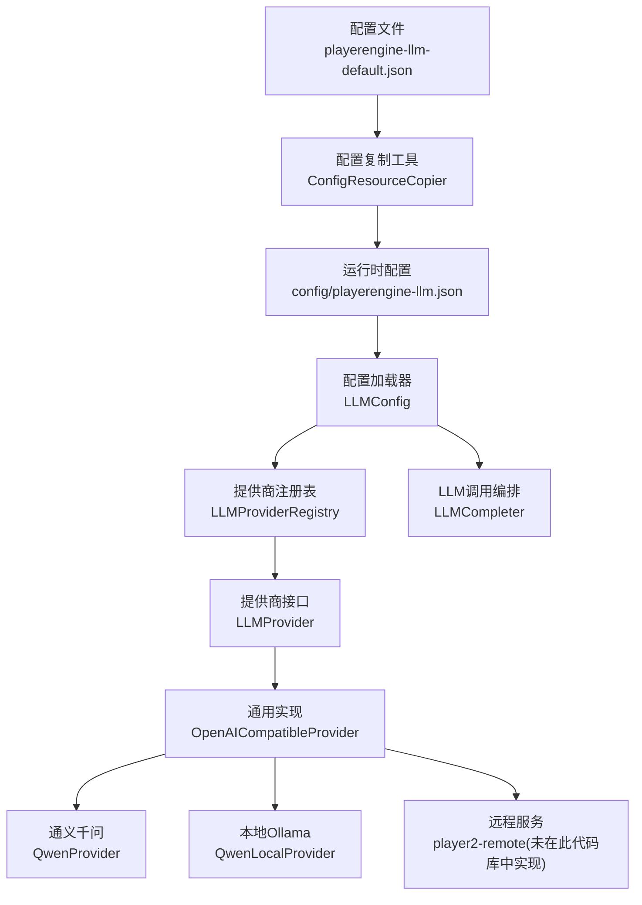
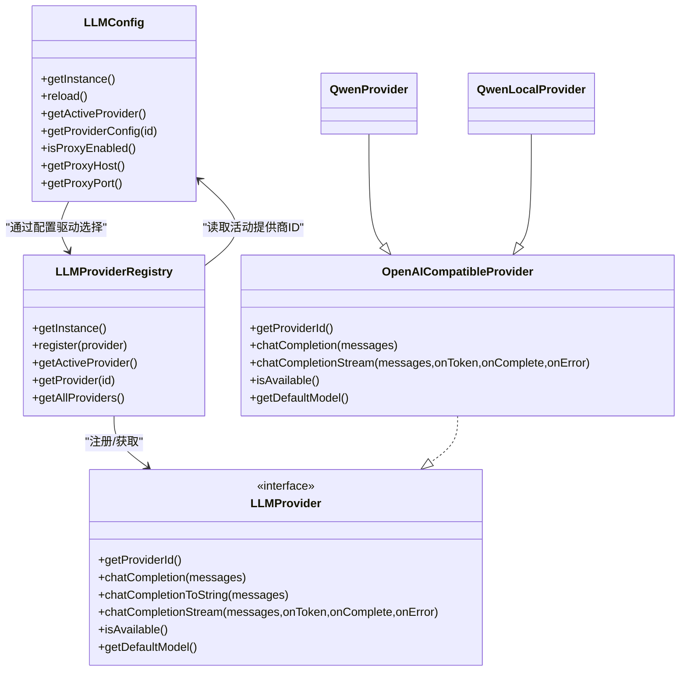
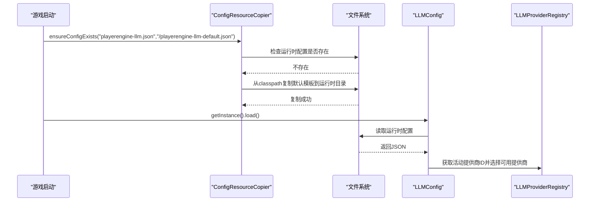
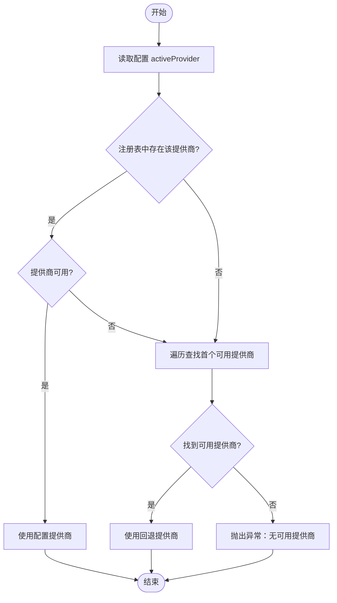
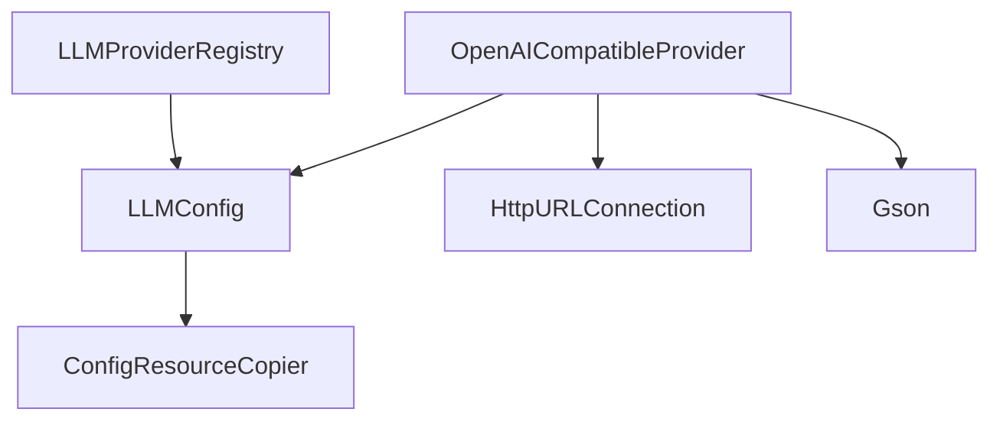

# LLM配置管理

<cite>
**本文引用的文件**
- [playerengine-llm-default.json](file://src/main/resources/playerengine-llm-default.json)
- [LLMConfig.java](file://src/main/java/adris/altoclef/player2api/llm/LLMConfig.java)
- [LLMProvider.java](file://src/main/java/adris/altoclef/player2api/llm/LLMProvider.java)
- [LLMProviderRegistry.java](file://src/main/java/adris/altoclef/player2api/llm/LLMProviderRegistry.java)
- [OpenAICompatibleProvider.java](file://src/main/java/adris/altoclef/player2api/llm/impl/OpenAICompatibleProvider.java)
- [QwenProvider.java](file://src/main/java/adris/altoclef/player2api/llm/impl/QwenProvider.java)
- [QwenLocalProvider.java](file://src/main/java/adris/altoclef/player2api/llm/impl/QwenLocalProvider.java)
- [ConfigResourceCopier.java](file://src/main/java/adris/altoclef/player2api/utils/ConfigResourceCopier.java)
- [LLMCompleter.java](file://src/main/java/adris/altoclef/player2api/LLMCompleter.java)
- [ReloadSettingsCommand.java](file://src/main/java/adris/altoclef/commands/ReloadSettingsCommand.java)
</cite>

## 目录
1. [简介](#简介)
2. [项目结构](#项目结构)
3. [核心组件](#核心组件)
4. [架构总览](#架构总览)
5. [详细组件分析](#详细组件分析)
6. [依赖关系分析](#依赖关系分析)
7. [性能考量](#性能考量)
8. [故障排除指南](#故障排除指南)
9. [结论](#结论)
10. [附录](#附录)

## 简介
本文件面向“LLM配置管理系统”，围绕playerengine-llm-default.json配置文件展开，系统性解析其完整结构与参数含义，涵盖activeProvider活动提供商、providers提供商配置数组、代理设置以及各提供商的详细参数。文档同时阐述qwen_local本地Ollama配置、qwen阿里云DashScope配置、openai OpenAI配置与player2-remote官方远程服务配置，并给出参数验证规则、最佳实践、配置加载机制、提供商切换逻辑、动态配置更新方式、优化建议与故障排除方法。

## 项目结构
与LLM配置管理直接相关的模块与文件如下：
- 配置文件：src/main/resources/playerengine-llm-default.json（默认模板）
- 配置加载：LLMConfig.java（单例，负责从运行时配置目录加载并解析）
- 提供商接口：LLMProvider.java（统一接口，定义聊天补全、流式输出、可用性判断等）
- 提供商注册表：LLMProviderRegistry.java（内置提供商注册与活动提供商选择）
- 具体提供商实现：
  - OpenAICompatibleProvider.java（通用OpenAI兼容协议实现）
  - QwenProvider.java（阿里云DashScope通义千问）
  - QwenLocalProvider.java（本地Ollama）
- 配置复制工具：ConfigResourceCopier.java（首次运行时将默认模板复制到运行时配置目录）
- LLM调用编排：LLMCompleter.java（线程池封装、流式回调处理）
- 动态重载命令：ReloadSettingsCommand.java（触发配置重载）

图表来源
- [playerengine-llm-default.json:1-89](file://src/main/resources/playerengine-llm-default.json#L1-L89)
- [ConfigResourceCopier.java:29-57](file://src/main/java/adris/altoclef/player2api/utils/ConfigResourceCopier.java#L29-L57)
- [LLMConfig.java:54-77](file://src/main/java/adris/altoclef/player2api/llm/LLMConfig.java#L54-L77)
- [LLMProviderRegistry.java:32-70](file://src/main/java/adris/altoclef/player2api/llm/LLMProviderRegistry.java#L32-L70)
- [OpenAICompatibleProvider.java:24-40](file://src/main/java/adris/altoclef/player2api/llm/impl/OpenAICompatibleProvider.java#L24-L40)
- [QwenProvider.java:11-21](file://src/main/java/adris/altoclef/player2api/llm/impl/QwenProvider.java#L11-L21)
- [QwenLocalProvider.java:12-22](file://src/main/java/adris/altoclef/player2api/llm/impl/QwenLocalProvider.java#L12-L22)
- [LLMCompleter.java:16-89](file://src/main/java/adris/altoclef/player2api/LLMCompleter.java#L16-L89)

章节来源
- [playerengine-llm-default.json:1-89](file://src/main/resources/playerengine-llm-default.json#L1-L89)
- [LLMConfig.java:19-77](file://src/main/java/adris/altoclef/player2api/llm/LLMConfig.java#L19-L77)
- [LLMProviderRegistry.java:16-79](file://src/main/java/adris/altoclef/player2api/llm/LLMProviderRegistry.java#L16-L79)
- [OpenAICompatibleProvider.java:24-224](file://src/main/java/adris/altoclef/player2api/llm/impl/OpenAICompatibleProvider.java#L24-L224)
- [QwenProvider.java:11-21](file://src/main/java/adris/altoclef/player2api/llm/impl/QwenProvider.java#L11-L21)
- [QwenLocalProvider.java:12-22](file://src/main/java/adris/altoclef/player2api/llm/impl/QwenLocalProvider.java#L12-L22)
- [ConfigResourceCopier.java:18-57](file://src/main/java/adris/altoclef/player2api/utils/ConfigResourceCopier.java#L18-L57)
- [LLMCompleter.java:16-208](file://src/main/java/adris/altoclef/player2api/LLMCompleter.java#L16-L208)

## 核心组件
- 配置加载器（LLMConfig）
  - 单例模式，负责定位运行时配置文件路径，首次缺失时从classpath复制默认模板，然后解析activeProvider、providers、proxy、tts、stt等字段。
  - 支持reload()以热更新配置。
- 提供商接口（LLMProvider）
  - 统一定义：getProviderId、chatCompletion、chatCompletionToString、chatCompletionStream、isAvailable、getDefaultModel。
  - 流式接口默认回退为非流式，具体提供商可覆盖实现。
- 提供商注册表（LLMProviderRegistry）
  - 内置注册：QwenProvider、OpenAICompatibleProvider、QwenLocalProvider。
  - 活动提供商选择：优先使用配置中的activeProvider，若不可用则回退到首个可用提供商。
- 通用OpenAI兼容实现（OpenAICompatibleProvider）
  - 依据配置构造请求体（model、messages、max_tokens、temperature、stream），支持HTTP代理，解析标准OpenAI格式响应。
  - isAvailable校验enabled与apiKey有效性。
- 具体提供商
  - QwenProvider：继承OpenAICompatibleProvider，提供DashScope默认URL与默认模型。
  - QwenLocalProvider：继承OpenAICompatibleProvider，提供本地Ollama默认URL与默认模型。
- 配置复制工具（ConfigResourceCopier）
  - 将classpath中的默认模板复制到运行时配置目录（run/config/），确保首次运行可用。
- LLM调用编排（LLMCompleter）
  - 使用单线程池串行化LLM调用；支持流式回调（首token提示、完整文本完成、错误回调）。

章节来源
- [LLMConfig.java:19-77](file://src/main/java/adris/altoclef/player2api/llm/LLMConfig.java#L19-L77)
- [LLMProvider.java:11-66](file://src/main/java/adris/altoclef/player2api/llm/LLMProvider.java#L11-L66)
- [LLMProviderRegistry.java:16-79](file://src/main/java/adris/altoclef/player2api/llm/LLMProviderRegistry.java#L16-L79)
- [OpenAICompatibleProvider.java:24-224](file://src/main/java/adris/altoclef/player2api/llm/impl/OpenAICompatibleProvider.java#L24-L224)
- [QwenProvider.java:11-21](file://src/main/java/adris/altoclef/player2api/llm/impl/QwenProvider.java#L11-L21)
- [QwenLocalProvider.java:12-22](file://src/main/java/adris/altoclef/player2api/llm/impl/QwenLocalProvider.java#L12-L22)
- [ConfigResourceCopier.java:18-57](file://src/main/java/adris/altoclef/player2api/utils/ConfigResourceCopier.java#L18-L57)
- [LLMCompleter.java:16-208](file://src/main/java/adris/altoclef/player2api/LLMCompleter.java#L16-L208)

## 架构总览
下图展示配置文件、加载器、注册表与提供商实现之间的关系及数据流向。

图表来源
- [LLMConfig.java:19-77](file://src/main/java/adris/altoclef/player2api/llm/LLMConfig.java#L19-L77)
- [LLMProvider.java:11-66](file://src/main/java/adris/altoclef/player2api/llm/LLMProvider.java#L11-L66)
- [LLMProviderRegistry.java:16-79](file://src/main/java/adris/altoclef/player2api/llm/LLMProviderRegistry.java#L16-L79)
- [OpenAICompatibleProvider.java:24-224](file://src/main/java/adris/altoclef/player2api/llm/impl/OpenAICompatibleProvider.java#L24-L224)
- [QwenProvider.java:11-21](file://src/main/java/adris/altoclef/player2api/llm/impl/QwenProvider.java#L11-L21)
- [QwenLocalProvider.java:12-22](file://src/main/java/adris/altoclef/player2api/llm/impl/QwenLocalProvider.java#L12-L22)

## 详细组件分析

### 配置文件结构与参数详解
- 文件位置与作用
  - 默认模板：src/main/resources/playerengine-llm-default.json
  - 运行时配置：由ConfigResourceCopier复制至运行时配置目录（首次运行时），随后由LLMConfig加载。
- 根级字段
  - activeProvider：当前活动提供商标识，可选值见“提供商配置数组”下的键名。
  - providers：提供商配置数组，包含qwen_local、qwen、openai、player2-remote等键。
  - proxy：HTTP代理设置，用于访问海外服务时的网络穿透。
  - tts：语音合成配置（阿里云CosyVoice），可复用qwen的apiKey。
  - stt：语音识别配置（阿里云DashScope实时转写）。
  - progressVoice：NPC任务进度语音反馈配置。
- providers数组内的提供商配置
  - qwen_local（本地Ollama）
    - enabled：布尔，是否启用
    - apiUrl：本地Ollama服务地址（默认http://localhost:11434/v1）
    - apiKey：固定值"ollama"
    - model：本地模型名（默认qwen2.5:7b）
    - maxTokens：最大token数（默认512）
    - temperature：采样温度（默认0.7）
  - qwen（阿里云DashScope）
    - enabled：布尔
    - apiUrl：DashScope兼容模式端点（默认https://dashscope.aliyuncs.com/compatible-mode/v1）
    - apiKey：DashScope API Key（必填）
    - model：默认qwen-plus
    - maxTokens：默认512
    - temperature：默认0.7
  - openai（OpenAI）
    - enabled：布尔
    - apiUrl：OpenAI v1端点（默认https://api.openai.com/v1）
    - apiKey：OpenAI API Key（必填）
    - model：默认gpt-4-turbo-preview
    - maxTokens：默认8000
    - temperature：默认0.7
  - player2-remote（官方远程服务）
    - enabled：布尔
    - apiUrl：官方远程服务端点（默认https://api.player2.game）
    - note：说明该模式需要账号认证
- proxy代理设置
  - enabled：布尔
  - host：代理主机（默认127.0.0.1）
  - port：代理端口（默认8001）
- tts语音合成
  - enabled：布尔
  - apiKey：TTS专用Key，留空则复用qwen的apiKey
  - model：CosyVoice模型版本（默认cosyvoice-v3-flash）
  - voice：音色ID（默认longanhuan）
  - volume：音量（0~100，默认50）
  - speechRate：语速倍率（默认1.0）
  - pitchRate：音调倍率（默认1.0）
- stt语音识别
  - enabled：布尔
  - model：模型名称（默认gummy-chat-v1）
  - language：识别语言（默认zh）
- progressVoice任务进度语音
  - enabled：布尔
  - intervalMin：最小播报间隔（默认3000ms）
  - intervalMax：最大播报间隔（默认5000ms）

章节来源
- [playerengine-llm-default.json:6-88](file://src/main/resources/playerengine-llm-default.json#L6-L88)
- [ConfigResourceCopier.java:29-57](file://src/main/java/adris/altoclef/player2api/utils/ConfigResourceCopier.java#L29-L57)
- [LLMConfig.java:54-77](file://src/main/java/adris/altoclef/player2api/llm/LLMConfig.java#L54-L77)

### 配置加载机制与动态更新
- 加载流程
  - ConfigResourceCopier.ensureConfigExists：若运行时配置不存在，则从classpath复制默认模板。
  - LLMConfig.getInstance().load：读取运行时配置文件，解析根对象，提取activeProvider、providers、proxy、tts、stt。
- 动态更新
  - LLMConfig.reload：重新加载配置文件。
  - ReloadSettingsCommand：通过命令触发全局配置重载（包括LLM配置）。

图表来源
- [ConfigResourceCopier.java:29-57](file://src/main/java/adris/altoclef/player2api/utils/ConfigResourceCopier.java#L29-L57)
- [LLMConfig.java:54-77](file://src/main/java/adris/altoclef/player2api/llm/LLMConfig.java#L54-L77)
- [LLMProviderRegistry.java:49-70](file://src/main/java/adris/altoclef/player2api/llm/LLMProviderRegistry.java#L49-L70)

章节来源
- [ConfigResourceCopier.java:29-57](file://src/main/java/adris/altoclef/player2api/utils/ConfigResourceCopier.java#L29-L57)
- [LLMConfig.java:41-52](file://src/main/java/adris/altoclef/player2api/llm/LLMConfig.java#L41-L52)
- [ReloadSettingsCommand.java:8-18](file://src/main/java/adris/altoclef/commands/ReloadSettingsCommand.java#L8-L18)

### 提供商切换逻辑
- 选择策略
  - 优先：使用配置中的activeProvider对应的提供商。
  - 若该提供商不可用（enabled=false或apiKey无效），则遍历所有已注册提供商，返回第一个可用者。
  - 若无可用提供商，抛出异常提示检查配置。
- 可用性判定
  - OpenAICompatibleProvider.isAvailable：要求enabled为true且apiKey非空且不为占位符。

图表来源
- [LLMProviderRegistry.java:49-70](file://src/main/java/adris/altoclef/player2api/llm/LLMProviderRegistry.java#L49-L70)
- [OpenAICompatibleProvider.java:210-218](file://src/main/java/adris/altoclef/player2api/llm/impl/OpenAICompatibleProvider.java#L210-L218)

章节来源
- [LLMProviderRegistry.java:49-70](file://src/main/java/adris/altoclef/player2api/llm/LLMProviderRegistry.java#L49-L70)
- [OpenAICompatibleProvider.java:210-218](file://src/main/java/adris/altoclef/player2api/llm/impl/OpenAICompatibleProvider.java#L210-L218)

### 各提供商配置要点与最佳实践

#### qwen_local（本地Ollama）
- 配置要点
  - enabled：true
  - apiUrl：http://localhost:11434/v1
  - apiKey：固定"ollama"
  - model：本地已拉取的模型名（如qwen2.5:7b）
  - maxTokens：根据本地显存与模型大小合理设置（默认512）
  - temperature：0.7（平衡创造性与稳定性）
- 最佳实践
  - 本地模型需预先通过Ollama拉取并运行，确保端口可达。
  - 适当降低maxTokens以避免内存压力。
  - 保持apiKey为"ollama"，无需变更。

章节来源
- [playerengine-llm-default.json:10-18](file://src/main/resources/playerengine-llm-default.json#L10-L18)
- [QwenLocalProvider.java:12-22](file://src/main/java/adris/altoclef/player2api/llm/impl/QwenLocalProvider.java#L12-L22)

#### qwen（阿里云DashScope）
- 配置要点
  - enabled：true
  - apiUrl：https://dashscope.aliyuncs.com/compatible-mode/v1
  - apiKey：DashScope API Key（必填）
  - model：推荐qwen-plus或qwen-turbo（更快更便宜）
  - maxTokens：默认512
  - temperature：默认0.7
- 最佳实践
  - 在DashScope控制台申请API Key并妥善保管，避免泄露。
  - 国内网络环境下优先选择此提供商，延迟与成本相对较低。
  - 如需更高性能，可调整model与maxTokens。

章节来源
- [playerengine-llm-default.json:19-27](file://src/main/resources/playerengine-llm-default.json#L19-L27)
- [QwenProvider.java:11-21](file://src/main/java/adris/altoclef/player2api/llm/impl/QwenProvider.java#L11-L21)

#### openai（OpenAI）
- 配置要点
  - enabled：true
  - apiUrl：https://api.openai.com/v1
  - apiKey：OpenAI API Key（必填）
  - model：默认gpt-4-turbo-preview
  - maxTokens：默认8000
  - temperature：默认0.7
- 最佳实践
  - 需要稳定海外网络环境，必要时启用proxy。
  - API Key务必保密，不要提交到公共仓库。
  - 根据任务复杂度适当提高maxTokens。

章节来源
- [playerengine-llm-default.json:28-36](file://src/main/resources/playerengine-llm-default.json#L28-L36)
- [OpenAICompatibleProvider.java:210-218](file://src/main/java/adris/altoclef/player2api/llm/impl/OpenAICompatibleProvider.java#L210-L218)

#### player2-remote（官方远程服务）
- 配置要点
  - enabled：false（默认关闭）
  - apiUrl：https://api.player2.game
  - note：需要player2.game账号认证
- 最佳实践
  - 未在本代码库中实现具体提供商类，如需使用需自行扩展。
  - 开启前确保具备相应账号权限与网络条件。

章节来源
- [playerengine-llm-default.json:37-42](file://src/main/resources/playerengine-llm-default.json#L37-L42)
- [LLMProviderRegistry.java:32-37](file://src/main/java/adris/altoclef/player2api/llm/LLMProviderRegistry.java#L32-L37)

### 参数验证规则
- 必填项
  - qwen与openai：apiKey必须填写且非占位符。
  - qwen_local：apiKey固定为"ollama"。
- 取值范围
  - maxTokens：限制在[1, 65536]区间（通用实现中进行边界校验）。
  - temperature：通常建议[0, 2]之间，通用实现未强制上限，但过高可能导致输出不稳定。
- 可用性
  - enabled必须为true，且apiKey有效（非空且非占位符）。

章节来源
- [OpenAICompatibleProvider.java:59-61](file://src/main/java/adris/altoclef/player2api/llm/impl/OpenAICompatibleProvider.java#L59-L61)
- [OpenAICompatibleProvider.java:210-218](file://src/main/java/adris/altoclef/player2api/llm/impl/OpenAICompatibleProvider.java#L210-L218)

### 配置示例与路径指引
- 示例路径（仅路径，不含具体代码内容）
  - qwen_local配置示例路径：[playerengine-llm-default.json:10-18](file://src/main/resources/playerengine-llm-default.json#L10-L18)
  - qwen配置示例路径：[playerengine-llm-default.json:19-27](file://src/main/resources/playerengine-llm-default.json#L19-L27)
  - openai配置示例路径：[playerengine-llm-default.json:28-36](file://src/main/resources/playerengine-llm-default.json#L28-L36)
  - proxy配置示例路径：[playerengine-llm-default.json:45-50](file://src/main/resources/playerengine-llm-default.json#L45-L50)
  - tts配置示例路径：[playerengine-llm-default.json:52-67](file://src/main/resources/playerengine-llm-default.json#L52-L67)
  - stt配置示例路径：[playerengine-llm-default.json:69-77](file://src/main/resources/playerengine-llm-default.json#L69-L77)
  - progressVoice配置示例路径：[playerengine-llm-default.json:79-87](file://src/main/resources/playerengine-llm-default.json#L79-L87)

## 依赖关系分析
- 组件耦合
  - LLMConfig与ConfigResourceCopier：配置复制与加载的协作。
  - LLMProviderRegistry与LLMConfig：通过配置驱动提供商选择。
  - OpenAICompatibleProvider与LLMConfig：读取提供商配置并发起HTTP请求。
- 外部依赖
  - HTTP客户端：java.net.HttpURLConnection，支持HTTP代理。
  - JSON解析：Gson。
- 潜在循环依赖
  - 未发现直接循环依赖；注册表在首次访问时初始化，避免了静态初始化环。

图表来源
- [LLMConfig.java:37-38](file://src/main/java/adris/altoclef/player2api/llm/LLMConfig.java#L37-L38)
- [ConfigResourceCopier.java:29-36](file://src/main/java/adris/altoclef/player2api/utils/ConfigResourceCopier.java#L29-L36)
- [LLMProviderRegistry.java:49-50](file://src/main/java/adris/altoclef/player2api/llm/LLMProviderRegistry.java#L49-L50)
- [OpenAICompatibleProvider.java:80-90](file://src/main/java/adris/altoclef/player2api/llm/impl/OpenAICompatibleProvider.java#L80-L90)

章节来源
- [LLMConfig.java:37-38](file://src/main/java/adris/altoclef/player2api/llm/LLMConfig.java#L37-L38)
- [ConfigResourceCopier.java:29-36](file://src/main/java/adris/altoclef/player2api/utils/ConfigResourceCopier.java#L29-L36)
- [LLMProviderRegistry.java:49-50](file://src/main/java/adris/altoclef/player2api/llm/LLMProviderRegistry.java#L49-L50)
- [OpenAICompatibleProvider.java:80-90](file://src/main/java/adris/altoclef/player2api/llm/impl/OpenAICompatibleProvider.java#L80-L90)

## 性能考量
- 请求超时
  - 连接超时：30000ms；读取超时：120000ms（通用实现中设定）。
- 流式输出
  - OpenAICompatibleProvider支持SSE流式输出，首token到达即回调，有助于改善用户体验。
- 参数调优建议
  - maxTokens：根据任务复杂度与模型能力调整，避免过大导致超时或内存压力。
  - temperature：0.7为默认平衡值；追求确定性可下调，追求多样性可上调。
  - 并发控制：LLMCompleter使用单线程池串行化调用，避免并发竞争；如需并发可在上层业务侧控制。
- 网络优化
  - 国内访问OpenAI等海外服务时启用proxy，减少网络抖动对响应时间的影响。

章节来源
- [OpenAICompatibleProvider.java:98-99](file://src/main/java/adris/altoclef/player2api/llm/impl/OpenAICompatibleProvider.java#L98-L99)
- [OpenAICompatibleProvider.java:140-208](file://src/main/java/adris/altoclef/player2api/llm/impl/OpenAICompatibleProvider.java#L140-L208)
- [LLMCompleter.java:19](file://src/main/java/adris/altoclef/player2api/LLMCompleter.java#L19)

## 故障排除指南
- 常见问题与排查步骤
  - API Key未设置或错误
    - 现象：提供商不可用，抛出异常或无法切换。
    - 排查：确认providers中对应提供商的apiKey已正确填写且非占位符。
  - 本地Ollama不可达
    - 现象：qwen_local不可用。
    - 排查：确认Ollama服务已启动，端口与apiUrl一致，模型已拉取。
  - 海外网络受限
    - 现象：openai请求失败或超时。
    - 排查：启用proxy，检查host与port；确认账号与配额正常。
  - 配置未生效
    - 现象：修改配置后仍使用旧设置。
    - 排查：确认运行时配置已复制到运行时目录；通过命令触发重载。
- 关键日志与定位
  - LLMConfig与OpenAICompatibleProvider在加载与请求时记录详细日志，便于定位问题。
  - LLMCompleter在流式回调中记录首token与完成状态，便于调试。

章节来源
- [OpenAICompatibleProvider.java:210-218](file://src/main/java/adris/altoclef/player2api/llm/impl/OpenAICompatibleProvider.java#L210-L218)
- [LLMCompleter.java:174-202](file://src/main/java/adris/altoclef/player2api/LLMCompleter.java#L174-L202)

## 结论
本配置管理系统以playerengine-llm-default.json为核心，结合LLMConfig、LLMProviderRegistry与OpenAICompatibleProvider等组件，实现了灵活的提供商选择、统一的请求协议与可扩展的实现框架。通过合理的参数配置与最佳实践，可在本地、国内云服务与海外API之间自由切换，并在保证性能的同时提升稳定性与可维护性。

## 附录
- 相关命令
  - reload_settings：触发配置重载（含LLM配置）。
- 参考路径
  - 配置文件默认模板：[playerengine-llm-default.json](file://src/main/resources/playerengine-llm-default.json)
  - 配置加载器：[LLMConfig.java](file://src/main/java/adris/altoclef/player2api/llm/LLMConfig.java)
  - 提供商接口：[LLMProvider.java](file://src/main/java/adris/altoclef/player2api/llm/LLMProvider.java)
  - 注册表：[LLMProviderRegistry.java](file://src/main/java/adris/altoclef/player2api/llm/LLMProviderRegistry.java)
  - 通用实现：[OpenAICompatibleProvider.java](file://src/main/java/adris/altoclef/player2api/llm/impl/OpenAICompatibleProvider.java)
  - 通义千问实现：[QwenProvider.java](file://src/main/java/adris/altoclef/player2api/llm/impl/QwenProvider.java)
  - 本地Ollama实现：[QwenLocalProvider.java](file://src/main/java/adris/altoclef/player2api/llm/impl/QwenLocalProvider.java)
  - 配置复制工具：[ConfigResourceCopier.java](file://src/main/java/adris/altoclef/player2api/utils/ConfigResourceCopier.java)
  - LLM调用编排：[LLMCompleter.java](file://src/main/java/adris/altoclef/player2api/LLMCompleter.java)
  - 重载命令：[ReloadSettingsCommand.java](file://src/main/java/adris/altoclef/commands/ReloadSettingsCommand.java)