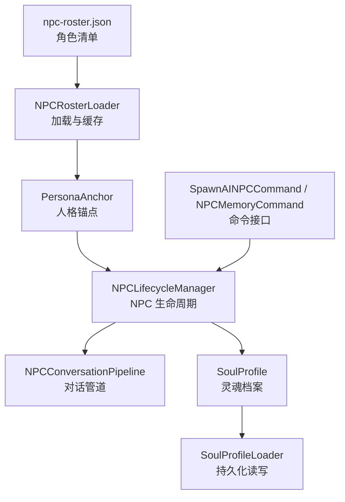
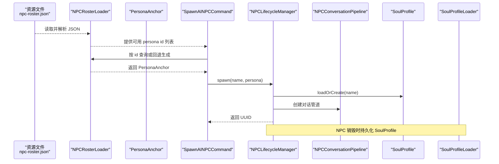
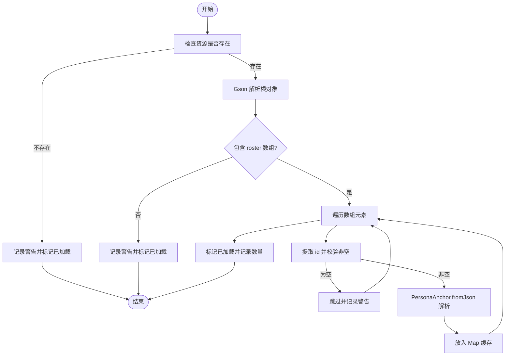
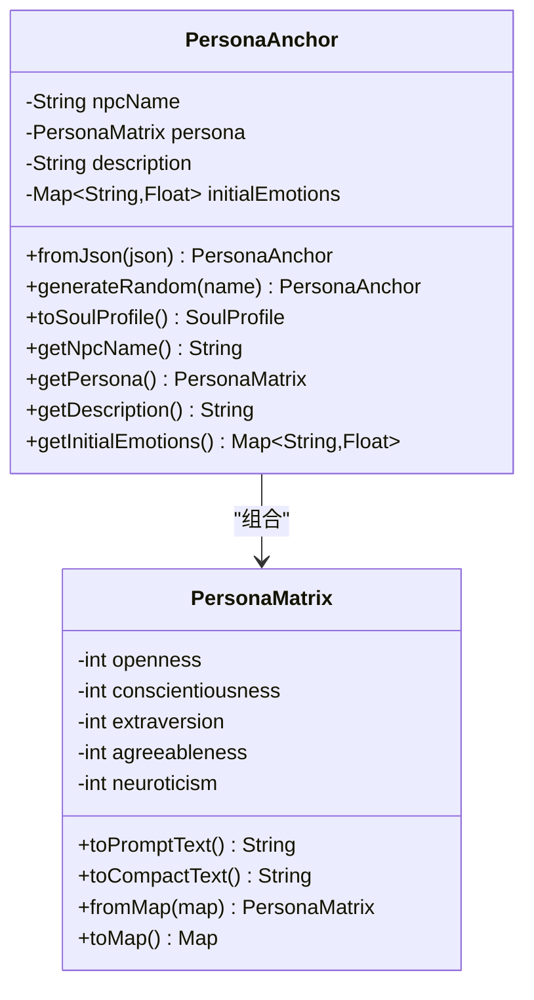
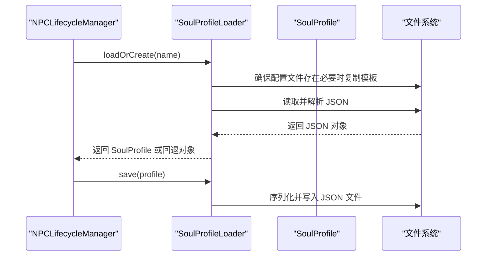
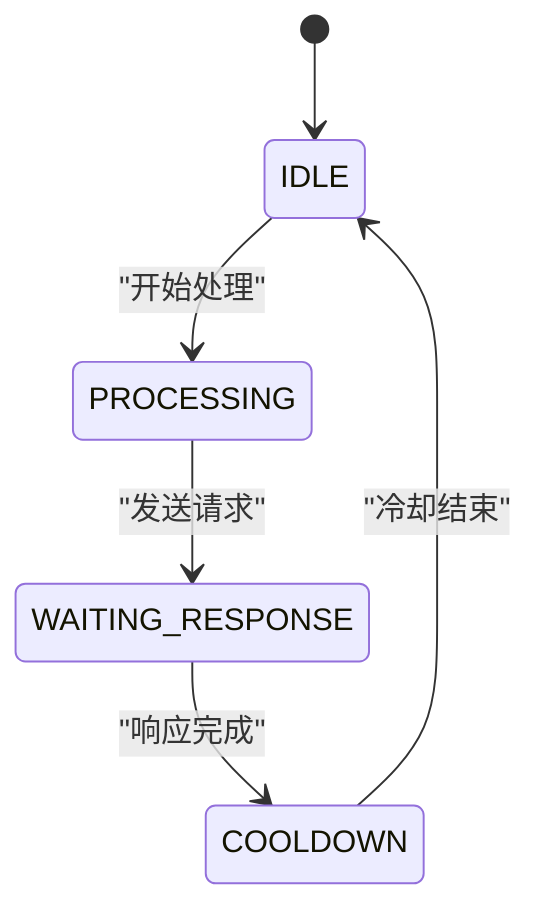
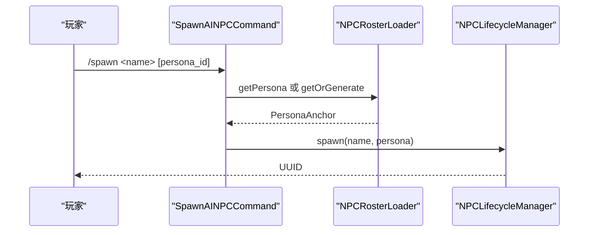
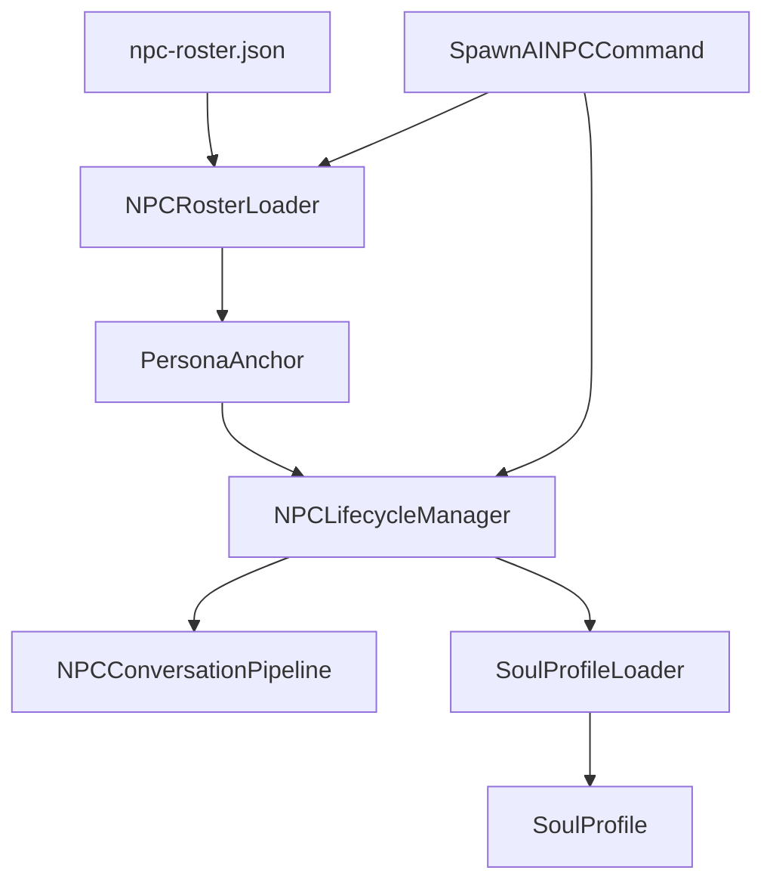

# NPC 角色配置

<cite>
**本文引用的文件**   
- [npc-roster.json](file://src/main/resources/npc-roster.json)
- [NPCRosterLoader.java](file://src/main/java/adris/altoclef/player2api/NPCRosterLoader.java)
- [PersonaAnchor.java](file://src/main/java/adris/altoclef/player2api/PersonaAnchor.java)
- [PersonaMatrix.java](file://src/main/java/adris/altoclef/player2api/soul/PersonaMatrix.java)
- [SoulProfile.java](file://src/main/java/adris/altoclef/player2api/soul/SoulProfile.java)
- [SoulProfileLoader.java](file://src/main/java/adris/altoclef/player2api/soul/SoulProfileLoader.java)
- [NPCLifecycleManager.java](file://src/main/java/adris/altoclef/player2api/NPCLifecycleManager.java)
- [NPCConversationPipeline.java](file://src/main/java/adris/altoclef/player2api/NPCConversationPipeline.java)
- [SpawnAINPCCommand.java](file://src/main/java/adris/altoclef/commands/SpawnAINPCCommand.java)
- [NPCMemoryCommand.java](file://src/main/java/adris/altoclef/commands/NPCMemoryCommand.java)
- [AI_NPC项目整体架构概览.md](file://docs/AI_NPC项目整体架构概览.md)
- [AI_NPC灵魂特质交互优化方案.md](file://docs/AI_NPC灵魂特质交互优化方案.md)
- [soul_Luna.json](file://src/main/resources/soul/soul_Luna.json)
</cite>

## 目录
1. [简介](#简介)
2. [项目结构](#项目结构)
3. [核心组件](#核心组件)
4. [架构总览](#架构总览)
5. [详细组件分析](#详细组件分析)
6. [依赖分析](#依赖分析)
7. [性能考量](#性能考量)
8. [故障排查指南](#故障排查指南)
9. [结论](#结论)
10. [附录](#附录)

## 简介
本技术文档围绕 NPC 角色配置展开，重点解释 npc-roster.json 的结构与配置方法，涵盖角色列表管理、角色属性定义、角色生成规则、配置加载与验证、动态更新与持久化等。文档同时提供可操作的配置示例与最佳实践，帮助开发者与模组使用者高效创建与维护自定义 NPC。

## 项目结构
与 NPC 角色配置直接相关的资源与代码主要分布在以下位置：
- 配置资源：src/main/resources/npc-roster.json（角色清单）
- 配置资源：src/main/resources/soul/*.json（角色灵魂档案模板）
- 核心加载与管理：adris/altoclef/player2api 下的 NPCRosterLoader、PersonaAnchor、SoulProfile、SoulProfileLoader、NPCLifecycleManager、NPCConversationPipeline
- 命令接口：adris/altoclef/commands 下的 SpawnAINPCCommand、NPCMemoryCommand
- 文档：docs 下的 AI_NPC项目整体架构概览.md、AI_NPC灵魂特质交互优化方案.md

**图表来源**
- [npc-roster.json:1-54](file://src/main/resources/npc-roster.json#L1-L54)
- [NPCRosterLoader.java:18-85](file://src/main/java/adris/altoclef/player2api/NPCRosterLoader.java#L18-L85)
- [PersonaAnchor.java:14-113](file://src/main/java/adris/altoclef/player2api/PersonaAnchor.java#L14-L113)
- [NPCLifecycleManager.java:20-121](file://src/main/java/adris/altoclef/player2api/NPCLifecycleManager.java#L20-L121)
- [NPCConversationPipeline.java:38-193](file://src/main/java/adris/altoclef/player2api/NPCConversationPipeline.java#L38-L193)
- [SoulProfile.java:15-226](file://src/main/java/adris/altoclef/player2api/soul/SoulProfile.java#L15-L226)
- [SoulProfileLoader.java:25-226](file://src/main/java/adris/altoclef/player2api/soul/SoulProfileLoader.java#L25-L226)
- [SpawnAINPCCommand.java:18-106](file://src/main/java/adris/altoclef/commands/SpawnAINPCCommand.java#L18-L106)
- [NPCMemoryCommand.java:16-65](file://src/main/java/adris/altoclef/commands/NPCMemoryCommand.java#L16-L65)

**章节来源**
- [npc-roster.json:1-54](file://src/main/resources/npc-roster.json#L1-L54)
- [AI_NPC项目整体架构概览.md:809-988](file://docs/AI_NPC项目整体架构概览.md#L809-L988)

## 核心组件
- 角色清单加载器：负责从资源文件加载角色清单，解析为 PersonaAnchor 并缓存，支持按 id 查询与按名称回退生成。
- 人格锚点：封装角色名称、大五人格矩阵、初始情绪、描述等，支持从 JSON 解析与随机生成。
- 灵魂档案：承载 NPC 的人格、情绪、行为签名、记忆锚点、关系图谱等，提供持久化与提示注入能力。
- 生命周期管理：负责 NPC 的生成、销毁与重载，与灵魂档案持久化联动。
- 对话管道：管理 NPC 的对话状态机与并发控制。
- 命令接口：提供 spawn/despawn/list 与内存锚点管理命令，便于测试与运维。

**章节来源**
- [NPCRosterLoader.java:18-85](file://src/main/java/adris/altoclef/player2api/NPCRosterLoader.java#L18-L85)
- [PersonaAnchor.java:14-113](file://src/main/java/adris/altoclef/player2api/PersonaAnchor.java#L14-L113)
- [SoulProfile.java:15-226](file://src/main/java/adris/altoclef/player2api/soul/SoulProfile.java#L15-L226)
- [NPCLifecycleManager.java:20-121](file://src/main/java/adris/altoclef/player2api/NPCLifecycleManager.java#L20-L121)
- [NPCConversationPipeline.java:38-193](file://src/main/java/adris/altoclef/player2api/NPCConversationPipeline.java#L38-L193)
- [SpawnAINPCCommand.java:18-106](file://src/main/java/adris/altoclef/commands/SpawnAINPCCommand.java#L18-L106)
- [NPCMemoryCommand.java:16-65](file://src/main/java/adris/altoclef/commands/NPCMemoryCommand.java#L16-L65)

## 架构总览
下图展示了 NPC 角色配置从资源到运行时对象的映射路径，以及与生命周期管理、对话管道和持久化的交互。

**图表来源**
- [npc-roster.json:1-54](file://src/main/resources/npc-roster.json#L1-L54)
- [NPCRosterLoader.java:27-84](file://src/main/java/adris/altoclef/player2api/NPCRosterLoader.java#L27-L84)
- [SpawnAINPCCommand.java:27-47](file://src/main/java/adris/altoclef/commands/SpawnAINPCCommand.java#L27-L47)
- [NPCLifecycleManager.java:72-84](file://src/main/java/adris/altoclef/player2api/NPCLifecycleManager.java#L72-L84)
- [SoulProfileLoader.java:35-57](file://src/main/java/adris/altoclef/player2api/soul/SoulProfileLoader.java#L35-L57)

## 详细组件分析

### 角色清单与加载机制（npc-roster.json 与 NPCRosterLoader）
- 清单结构：顶层包含 roster 数组，数组元素为单个 NPC 的配置对象。
- 关键字段：
  - id：角色唯一标识，用于命令选择与缓存索引。
  - name：角色显示名称。
  - persona：大五人格矩阵，包含五个维度的整数值。
  - initialEmotions：初始情绪集合，键为情绪名称，值为强度。
  - description：角色描述。
- 加载流程：
  - 通过资源路径定位文件，使用 Gson 解析根对象与数组。
  - 遍历数组，提取 id 并校验非空；为空则跳过并记录警告。
  - 将每个条目交由 PersonaAnchor.fromJson 解析为对象并放入缓存。
  - 首次加载后标记 loaded，后续调用 ensureLoaded 将直接返回缓存结果。
- 错误处理：资源缺失、解析异常均记录日志并保证幂等加载。

**图表来源**
- [NPCRosterLoader.java:27-58](file://src/main/java/adris/altoclef/player2api/NPCRosterLoader.java#L27-L58)
- [npc-roster.json:1-54](file://src/main/resources/npc-roster.json#L1-L54)

**章节来源**
- [NPCRosterLoader.java:18-85](file://src/main/java/adris/altoclef/player2api/NPCRosterLoader.java#L18-L85)
- [npc-roster.json:1-54](file://src/main/resources/npc-roster.json#L1-L54)

### 人格锚点（PersonaAnchor）
- 数据结构：包含角色名称、PersonaMatrix、初始情绪映射与描述。
- 解析规则：
  - name 与 description 为空时采用默认值。
  - persona 中各维度若缺省则按 0 处理，最终构造 PersonaMatrix。
  - initialEmotions 支持任意数量的基础情绪键值对。
- 随机生成：在 [-100, 100] 范围内随机采样五维值，并随机选择 2-4 种基础情绪作为初始情绪，强度保留一位小数。
- 转换：提供 toSoulProfile 将锚点转换为完整灵魂档案骨架。

**图表来源**
- [PersonaAnchor.java:14-113](file://src/main/java/adris/altoclef/player2api/PersonaAnchor.java#L14-L113)
- [PersonaMatrix.java:10-120](file://src/main/java/adris/altoclef/player2api/soul/PersonaMatrix.java#L10-L120)

**章节来源**
- [PersonaAnchor.java:14-113](file://src/main/java/adris/altoclef/player2api/PersonaAnchor.java#L14-L113)
- [PersonaMatrix.java:10-120](file://src/main/java/adris/altoclef/player2api/soul/PersonaMatrix.java#L10-L120)

### 灵魂档案与持久化（SoulProfile 与 SoulProfileLoader）
- 灵魂档案：
  - 包含角色名、PersonaMatrix、EmotionState、BehaviorSignature、记忆锚点列表、关系图谱。
  - 提供记忆锚点增删、关系管理、情绪自然衰减、提示注入（完整与紧凑版）等能力。
- 持久化：
  - loadOrCreate：优先从运行时配置目录加载；若不存在则从资源模板复制后再加载；失败回退为中性人格。
  - save：将 personaMatrix、emotions、behaviorSignature、memoryAnchors、relationships 序列化为 JSON 并写入文件。
- 模板参考：soul_Luna.json 展示了行为签名注释与运行时字段说明，便于理解 JSON 字段含义。

**图表来源**
- [NPCLifecycleManager.java:72-101](file://src/main/java/adris/altoclef/player2api/NPCLifecycleManager.java#L72-L101)
- [SoulProfileLoader.java:35-132](file://src/main/java/adris/altoclef/player2api/soul/SoulProfileLoader.java#L35-L132)
- [soul_Luna.json:41-60](file://src/main/resources/soul/soul_Luna.json#L41-L60)

**章节来源**
- [SoulProfile.java:15-226](file://src/main/java/adris/altoclef/player2api/soul/SoulProfile.java#L15-L226)
- [SoulProfileLoader.java:25-226](file://src/main/java/adris/altoclef/player2api/soul/SoulProfileLoader.java#L25-L226)
- [soul_Luna.json:41-60](file://src/main/resources/soul/soul_Luna.json#L41-L60)

### NPC 生命周期与对话管道（NPCLifecycleManager 与 NPCConversationPipeline）
- 生命周期：
  - spawn：生成 UUID，创建对话管道，加载或创建灵魂档案，登记到活跃 NPC 映射。
  - despawn：移除活跃实例，加载对应灵魂档案并保存，记录日志。
  - reload：重新加载指定 NPC 的灵魂档案。
- 对话管道：
  - 状态机：IDLE、PROCESSING、WAITING_RESPONSE、COOLDOWN。
  - 并发控制：Per-NPC 锁与等待队列，避免并发冲突。
  - 冷却机制：markCompleted 后进入 COOLDOWN，markIdle 回到 IDLE。

**图表来源**
- [NPCConversationPipeline.java:38-193](file://src/main/java/adris/altoclef/player2api/NPCConversationPipeline.java#L38-L193)
- [NPCLifecycleManager.java:72-121](file://src/main/java/adris/altoclef/player2api/NPCLifecycleManager.java#L72-L121)

**章节来源**
- [NPCLifecycleManager.java:20-121](file://src/main/java/adris/altoclef/player2api/NPCLifecycleManager.java#L20-L121)
- [NPCConversationPipeline.java:38-193](file://src/main/java/adris/altoclef/player2api/NPCConversationPipeline.java#L38-L193)

### 命令接口（SpawnAINPCCommand 与 NPCMemoryCommand）
- spawn：支持按 persona_id 选择预设角色或回退随机生成；成功返回 UUID。
- despawn：按名称查找并销毁，持久化灵魂档案。
- npcls：列出当前活跃 NPC 及存活时长。
- npc_memory：添加、列出、删除、清空记忆锚点，支持手动干预 NPC 记忆。

**图表来源**
- [SpawnAINPCCommand.java:27-47](file://src/main/java/adris/altoclef/commands/SpawnAINPCCommand.java#L27-L47)
- [NPCRosterLoader.java:66-84](file://src/main/java/adris/altoclef/player2api/NPCRosterLoader.java#L66-L84)
- [NPCLifecycleManager.java:72-84](file://src/main/java/adris/altoclef/player2api/NPCLifecycleManager.java#L72-L84)

**章节来源**
- [SpawnAINPCCommand.java:18-106](file://src/main/java/adris/altoclef/commands/SpawnAINPCCommand.java#L18-L106)
- [NPCMemoryCommand.java:16-65](file://src/main/java/adris/altoclef/commands/NPCMemoryCommand.java#L16-L65)

## 依赖分析
- 资源依赖：npc-roster.json 与 soul 模板文件位于资源目录，通过加载器与持久化器访问。
- 运行时依赖：NPCRosterLoader 依赖 Gson 解析；NPCLifecycleManager 依赖 SoulProfileLoader 进行持久化；命令模块依赖上述两类组件进行交互。
- 外部集成：文档中提到的网络包与实体同步机制属于更高层集成，与本节“配置与加载”主题保持一致但不直接参与配置解析。

**图表来源**
- [NPCRosterLoader.java:18-85](file://src/main/java/adris/altoclef/player2api/NPCRosterLoader.java#L18-L85)
- [NPCLifecycleManager.java:20-121](file://src/main/java/adris/altoclef/player2api/NPCLifecycleManager.java#L20-L121)
- [SoulProfileLoader.java:25-226](file://src/main/java/adris/altoclef/player2api/soul/SoulProfileLoader.java#L25-L226)
- [SpawnAINPCCommand.java:18-106](file://src/main/java/adris/altoclef/commands/SpawnAINPCCommand.java#L18-L106)

**章节来源**
- [AI_NPC项目整体架构概览.md:809-988](file://docs/AI_NPC项目整体架构概览.md#L809-L988)

## 性能考量
- 缓存与懒加载：NPCRosterLoader 使用 loaded 标志与 Map 缓存，避免重复解析与 IO。
- 并发安全：NPCLifecycleManager 使用并发 Map 管理活跃 NPC；对话管道使用 per-NPC 锁与状态机避免竞争。
- 持久化成本：SoulProfileLoader 采用按需复制模板与序列化写入，建议在批处理场景合并保存以减少磁盘写入。
- JSON 解析：Gson 解析路径简单明确，注意避免在高频路径重复解析同一文件（可通过缓存复用）。

[本节为通用性能建议，不直接分析具体文件]

## 故障排查指南
- 角色清单未生效：
  - 检查资源路径是否正确，确认 npc-roster.json 存在且包含 roster 数组。
  - 查看日志中关于“资源未找到”或“跳过无 id 条目”的警告。
- 无法按 id 生成 NPC：
  - 确认 id 非空且与清单一致；查看 getPersona 返回是否为空。
- 生成 NPC 成功但对话无响应：
  - 检查对话管道状态是否卡在 PROCESSING/WAITING_RESPONSE；确认冷却定时器正常推进。
- 销毁 NPC 后数据丢失：
  - 确认 despawn 路径已调用 SoulProfileLoader.save；检查保存日志与文件权限。
- 记忆锚点管理无效：
  - 使用 npc_memory 命令时确保 NPC 已存在且 soul 已加载；核对锚点 id 与内容。

**章节来源**
- [NPCRosterLoader.java:32-58](file://src/main/java/adris/altoclef/player2api/NPCRosterLoader.java#L32-L58)
- [NPCLifecycleManager.java:92-121](file://src/main/java/adris/altoclef/player2api/NPCLifecycleManager.java#L92-L121)
- [NPCConversationPipeline.java:75-186](file://src/main/java/adris/altoclef/player2api/NPCConversationPipeline.java#L75-L186)
- [NPCMemoryCommand.java:16-65](file://src/main/java/adris/altoclef/commands/NPCMemoryCommand.java#L16-L65)

## 结论
NPC 角色配置体系以 npc-roster.json 为核心输入，通过 NPCRosterLoader 解析为 PersonaAnchor，并在生命周期管理中与 SoulProfileLoader 协作实现持久化。配合命令接口与对话管道，形成从配置到运行的完整闭环。遵循本文提供的最佳实践与排错建议，可高效构建与维护高质量的 NPC 角色生态。

[本节为总结性内容，不直接分析具体文件]

## 附录

### 配置示例与最佳实践
- 创建自定义 NPC 角色
  - 在 npc-roster.json 中新增一条记录，填写 id、name、persona 五维值、initialEmotions 与 description。
  - 使用 /spawn <name> <persona_id> 生成 NPC；或不带 persona_id 让系统回退随机生成。
- 配置角色外观与行为
  - 外观与语音等扩展字段可参考 soul 模板（如 soul_Luna.json）中的注释说明，按需扩展。
  - 行为签名（initiative/riskTolerance/independence/efficiency/loyalty）可手动覆盖以微调 NPC 行为。
- 批量管理角色配置
  - 使用 npcls 查看当前活跃 NPC；使用 despawn 批量销毁并持久化。
  - 使用 npc_memory 管理记忆锚点，提升 NPC 的个性化与连贯性。
- 配置迁移策略
  - 从资源模板复制到运行时配置目录后进行修改；升级时保留自定义文件，避免被覆盖。
  - 若遇到解析错误，回退到中性人格（默认回退）以保证系统可用性。

**章节来源**
- [npc-roster.json:1-54](file://src/main/resources/npc-roster.json#L1-L54)
- [soul_Luna.json:41-60](file://src/main/resources/soul/soul_Luna.json#L41-L60)
- [AI_NPC灵魂特质交互优化方案.md:33-726](file://docs/AI_NPC灵魂特质交互优化方案.md#L33-L726)
- [SpawnAINPCCommand.java:18-106](file://src/main/java/adris/altoclef/commands/SpawnAINPCCommand.java#L18-L106)
- [NPCMemoryCommand.java:16-65](file://src/main/java/adris/altoclef/commands/NPCMemoryCommand.java#L16-L65)