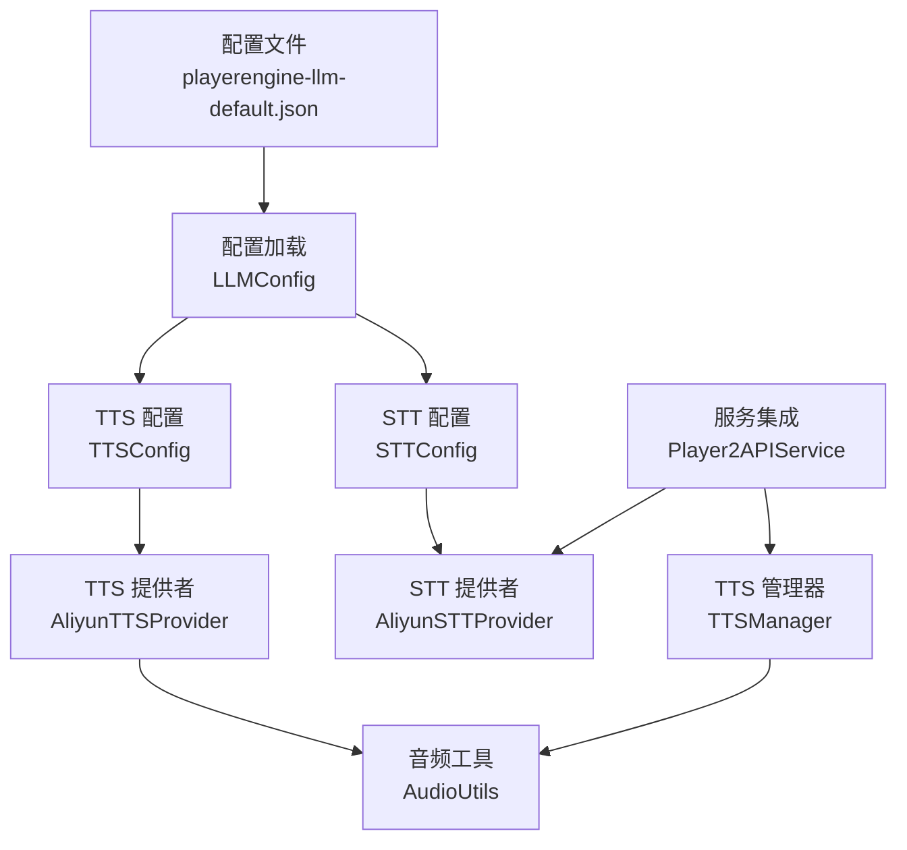
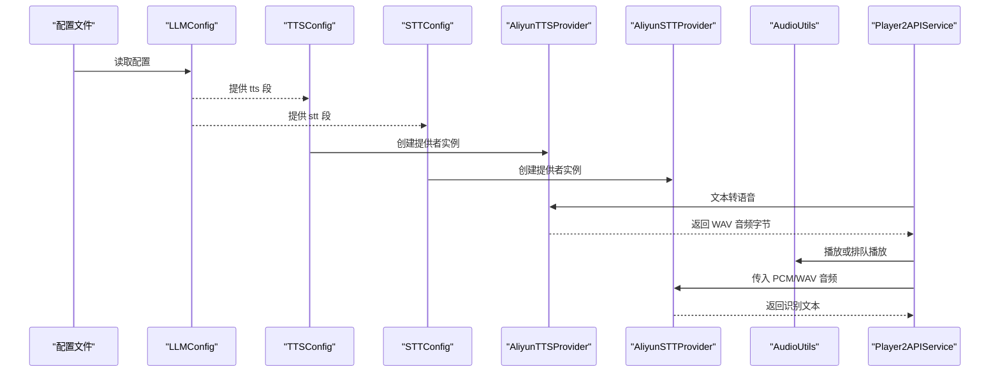
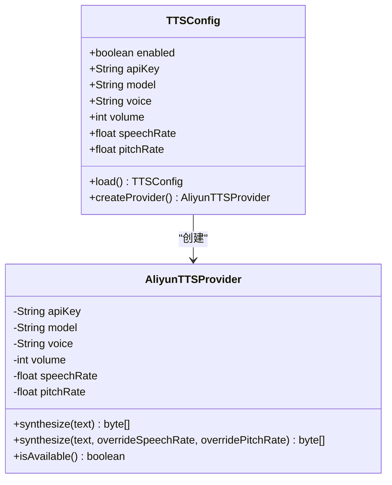
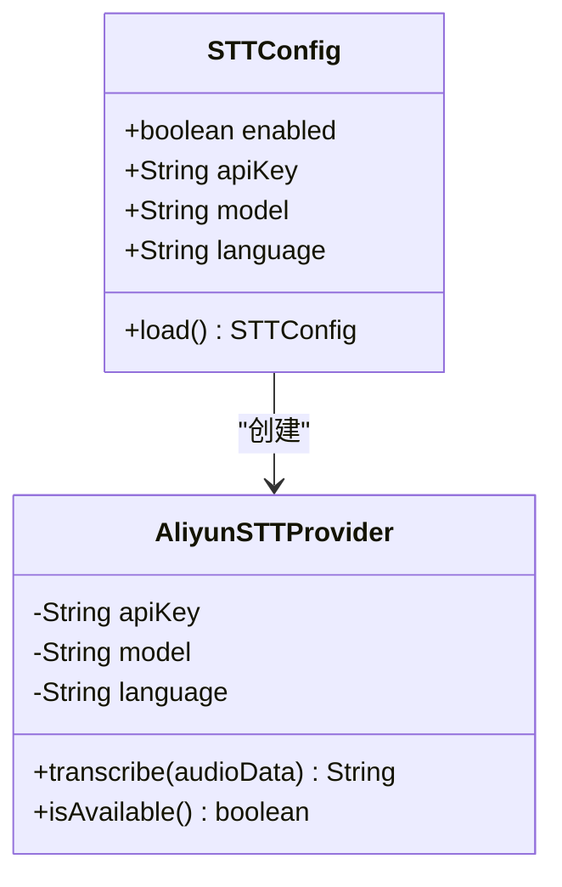
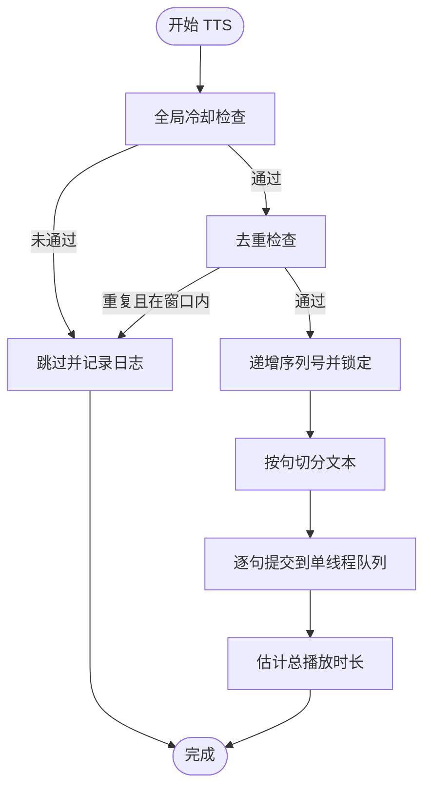
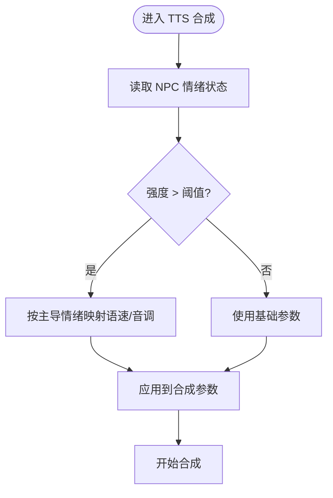
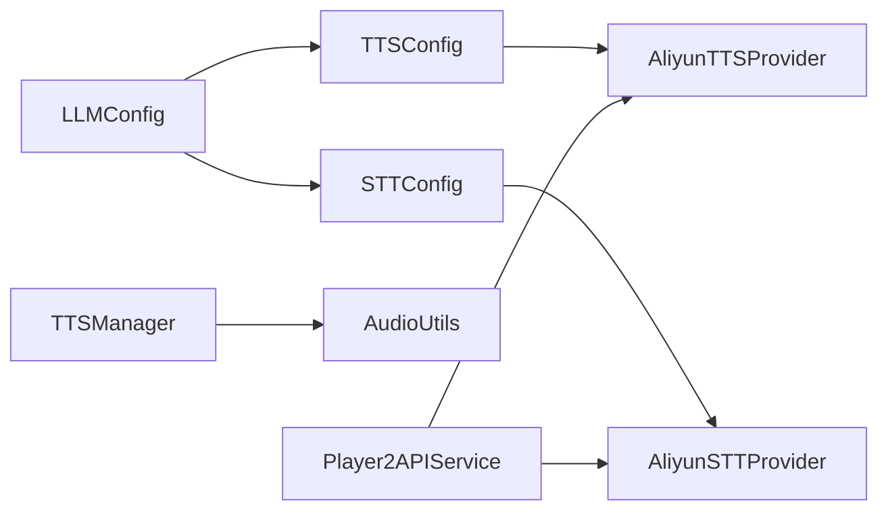

# TTS/STT 配置管理

<cite>
**本文引用的文件**
- [playerengine-llm-default.json](file://src/main/resources/playerengine-llm-default.json)
- [LLMConfig.java](file://src/main/java/adris/altoclef/player2api/llm/LLMConfig.java)
- [TTSConfig.java](file://src/main/java/adris/altoclef/player2api/tts/TTSConfig.java)
- [STTConfig.java](file://src/main/java/adris/altoclef/player2api/stt/STTConfig.java)
- [AliyunTTSProvider.java](file://src/main/java/adris/altoclef/player2api/tts/AliyunTTSProvider.java)
- [AliyunSTTProvider.java](file://src/main/java/adris/altoclef/player2api/stt/AliyunSTTProvider.java)
- [TTSManager.java](file://src/main/java/adris/altoclef/player2api/manager/TTSManager.java)
- [AudioUtils.java](file://src/main/java/adris/altoclef/player2api/utils/AudioUtils.java)
- [Player2APIService.java](file://src/main/java/adris/altoclef/player2api/Player2APIService.java)
- [HttpApiException.java](file://src/main/java/adris/altoclef/player2api/utils/HttpApiException.java)
</cite>

## 目录
1. [简介](#简介)
2. [项目结构](#项目结构)
3. [核心组件](#核心组件)
4. [架构总览](#架构总览)
5. [详细组件分析](#详细组件分析)
6. [依赖关系分析](#依赖关系分析)
7. [性能考量](#性能考量)
8. [故障排查指南](#故障排查指南)
9. [结论](#结论)
10. [附录](#附录)

## 简介
本技术文档聚焦于项目中的 TTS（语音合成）与 STT（语音识别）配置管理，围绕 playerengine-llm-default.json 中的 TTS/STT 配置进行深入解析，并结合相关 Java 实现，说明以下关键点：
- TTS 配置项：enabled、apiKey、model、voice、volume、speechRate、pitchRate 的作用与配置方法
- STT 配置项：enabled、model、language 的作用与配置方法
- 不同语音模型与语言设置对性能与准确率的影响
- 阿里云 CosyVoice 与 DashScope 语音服务的配置差异与 API Key 获取方式
- 具体配置示例：音色、语速、音调、多语言支持、语音质量优化
- 音频配置最佳实践、性能调优建议与故障排查

## 项目结构
与 TTS/STT 配置管理直接相关的文件与模块如下：
- 配置文件：playerengine-llm-default.json
- 配置加载：LLMConfig.java
- TTS 配置与提供者：TTSConfig.java、AliyunTTSProvider.java
- STT 配置与提供者：STTConfig.java、AliyunSTTProvider.java
- 音频播放与队列：AudioUtils.java
- TTS 管理与节流：TTSManager.java
- 服务集成入口：Player2APIService.java
- 错误类型：HttpApiException.java

**图示来源**
- [playerengine-llm-default.json:1-89](file://src/main/resources/playerengine-llm-default.json#L1-L89)
- [LLMConfig.java:19-115](file://src/main/java/adris/altoclef/player2api/llm/LLMConfig.java#L19-L115)
- [TTSConfig.java:13-101](file://src/main/java/adris/altoclef/player2api/tts/TTSConfig.java#L13-L101)
- [STTConfig.java:13-77](file://src/main/java/adris/altoclef/player2api/stt/STTConfig.java#L13-L77)
- [AliyunTTSProvider.java:19-112](file://src/main/java/adris/altoclef/player2api/tts/AliyunTTSProvider.java#L19-L112)
- [AliyunSTTProvider.java:23-171](file://src/main/java/adris/altoclef/player2api/stt/AliyunSTTProvider.java#L23-L171)
- [AudioUtils.java:37-104](file://src/main/java/adris/altoclef/player2api/utils/AudioUtils.java#L37-L104)
- [TTSManager.java:35-168](file://src/main/java/adris/altoclef/player2api/manager/TTSManager.java#L35-L168)
- [Player2APIService.java:132-200](file://src/main/java/adris/altoclef/player2api/Player2APIService.java#L132-L200)

**章节来源**
- [playerengine-llm-default.json:1-89](file://src/main/resources/playerengine-llm-default.json#L1-L89)
- [LLMConfig.java:19-115](file://src/main/java/adris/altoclef/player2api/llm/LLMConfig.java#L19-L115)

## 核心组件
本节从配置项定义、默认值、加载流程与可用性检查等方面，系统梳理 TTS/STT 的配置与实现。

- 配置文件位置与加载
  - 配置文件路径通过 LLMConfig 从资源目录加载，若不存在则复制默认模板。
  - 配置项包含 activeProvider、providers、proxy、tts、stt、progressVoice 等。
- TTS 配置
  - 默认模型：cosyvoice-v3-flash
  - 默认音色：longanhuan
  - 默认音量：50
  - 默认语速：1.0
  - 默认音调：1.0
  - 支持独立 apiKey；未配置时回退至 qwen 提供者的 apiKey
- STT 配置
  - 默认模型：gummy-chat-v1
  - 默认语言：zh
  - 支持独立 apiKey；未配置时回退至 qwen 提供者的 apiKey
- 提供者可用性
  - TTS/STT 提供者均提供 isAvailable 判断，要求 apiKey 存在且不为占位符

**章节来源**
- [playerengine-llm-default.json:52-77](file://src/main/resources/playerengine-llm-default.json#L52-L77)
- [LLMConfig.java:54-89](file://src/main/java/adris/altoclef/player2api/llm/LLMConfig.java#L54-L89)
- [TTSConfig.java:16-85](file://src/main/java/adris/altoclef/player2api/tts/TTSConfig.java#L16-L85)
- [STTConfig.java:16-71](file://src/main/java/adris/altoclef/player2api/stt/STTConfig.java#L16-L71)
- [AliyunTTSProvider.java:109-112](file://src/main/java/adris/altoclef/player2api/tts/AliyunTTSProvider.java#L109-L112)
- [AliyunSTTProvider.java:168-170](file://src/main/java/adris/altoclef/player2api/stt/AliyunSTTProvider.java#L168-L170)

## 架构总览
下图展示了从配置到语音服务调用、再到音频播放的整体流程。

**图示来源**
- [playerengine-llm-default.json:52-77](file://src/main/resources/playerengine-llm-default.json#L52-L77)
- [LLMConfig.java:54-89](file://src/main/java/adris/altoclef/player2api/llm/LLMConfig.java#L54-L89)
- [TTSConfig.java:88-92](file://src/main/java/adris/altoclef/player2api/tts/TTSConfig.java#L88-L92)
- [STTConfig.java:73-77](file://src/main/java/adris/altoclef/player2api/stt/STTConfig.java#L73-L77)
- [AliyunTTSProvider.java:50-104](file://src/main/java/adris/altoclef/player2api/tts/AliyunTTSProvider.java#L50-L104)
- [AliyunSTTProvider.java:47-154](file://src/main/java/adris/altoclef/player2api/stt/AliyunSTTProvider.java#L47-L154)
- [AudioUtils.java:49-104](file://src/main/java/adris/altoclef/player2api/utils/AudioUtils.java#L49-L104)
- [Player2APIService.java:132-200](file://src/main/java/adris/altoclef/player2api/Player2APIService.java#L132-L200)

## 详细组件分析

### TTS 配置与实现
- 配置项与默认值
  - enabled：默认开启
  - apiKey：可独立配置；未配置时回退至 qwen 提供者 apiKey
  - model：默认 cosyvoice-v3-flash
  - voice：默认 longanhuan
  - volume：默认 50（范围 0~100）
  - speechRate：默认 1.0（>1.0 加快，<1.0 减慢）
  - pitchRate：默认 1.0（>1.0 升高，<1.0 降低）
- 加载逻辑
  - 从 LLMConfig 的 tts 段读取；若缺失则使用默认值并回退 apiKey
- 合成流程
  - 文本长度限制与截断
  - 使用 DashScope CosyVoice 同步合成，返回 WAV 字节
  - 可覆盖语速与音调参数
- 可用性检查
  - apiKey 非空且非占位符才视为可用

**图示来源**
- [TTSConfig.java:13-101](file://src/main/java/adris/altoclef/player2api/tts/TTSConfig.java#L13-L101)
- [AliyunTTSProvider.java:19-112](file://src/main/java/adris/altoclef/player2api/tts/AliyunTTSProvider.java#L19-L112)

**章节来源**
- [playerengine-llm-default.json:52-67](file://src/main/resources/playerengine-llm-default.json#L52-L67)
- [TTSConfig.java:38-85](file://src/main/java/adris/altoclef/player2api/tts/TTSConfig.java#L38-L85)
- [AliyunTTSProvider.java:50-104](file://src/main/java/adris/altoclef/player2api/tts/AliyunTTSProvider.java#L50-L104)

### STT 配置与实现
- 配置项与默认值
  - enabled：默认开启
  - apiKey：可独立配置；未配置时回退至 qwen 提供者 apiKey
  - model：默认 gummy-chat-v1（中文对话优化）
  - language：默认 zh（中文）
- 加载逻辑
  - 从 LLMConfig 的 stt 段读取；若缺失则使用默认值并回退 apiKey
- 识别流程
  - 接收 PCM 或 WAV 音频（内部自动剥离 WAV 头）
  - 分块发送音频（约 100ms/块），实时识别
  - 支持中文、英文、日文、韩文、auto 自动检测
- 可用性检查
  - apiKey 非空且非占位符才视为可用

**图示来源**
- [STTConfig.java:13-77](file://src/main/java/adris/altoclef/player2api/stt/STTConfig.java#L13-L77)
- [AliyunSTTProvider.java:23-171](file://src/main/java/adris/altoclef/player2api/stt/AliyunSTTProvider.java#L23-L171)

**章节来源**
- [playerengine-llm-default.json:69-77](file://src/main/resources/playerengine-llm-default.json#L69-L77)
- [STTConfig.java:31-71](file://src/main/java/adris/altoclef/player2api/stt/STTConfig.java#L31-L71)
- [AliyunSTTProvider.java:47-154](file://src/main/java/adris/altoclef/player2api/stt/AliyunSTTProvider.java#L47-L154)

### TTS 管理与音频播放
- 管理策略
  - 序列号去重：防止新消息到来时旧队列继续播放
  - 去重窗口：相同消息在短时间内跳过重复合成
  - 全局冷却：限制任意 TTS 调用频率，避免语音刷屏
  - 预估结束时间：基于字符数估算播放时长，释放锁
- 音频播放
  - 采用队列串行播放，确保句子级无缝衔接
  - WAV 源播放线程写入音频数据

**图示来源**
- [TTSManager.java:41-168](file://src/main/java/adris/altoclef/player2api/manager/TTSManager.java#L41-L168)
- [AudioUtils.java:49-104](file://src/main/java/adris/altoclef/player2api/utils/AudioUtils.java#L49-L104)

**章节来源**
- [TTSManager.java:41-168](file://src/main/java/adris/altoclef/player2api/manager/TTSManager.java#L41-L168)
- [AudioUtils.java:49-104](file://src/main/java/adris/altoclef/player2api/utils/AudioUtils.java#L49-L104)

### 情绪驱动的 TTS 参数动态调整
- 当 NPC 情绪强度超过阈值时，根据主导情绪对语速与音调进行温和调整，避免音色突变影响体验
- 典型场景：喜悦、悲伤、愤怒、恐惧、惊讶、厌恶、信任、期待等

**图示来源**
- [Player2APIService.java:132-155](file://src/main/java/adris/altoclef/player2api/Player2APIService.java#L132-L155)

**章节来源**
- [Player2APIService.java:132-155](file://src/main/java/adris/altoclef/player2api/Player2APIService.java#L132-L155)

## 依赖关系分析
- 配置依赖
  - LLMConfig 负责从磁盘加载配置并暴露 tts/stt 段
  - TTSConfig/STTConfig 从 LLMConfig 读取对应段，决定默认值与回退策略
- 提供者依赖
  - AliyunTTSProvider/AliyunSTTProvider 依赖 DashScope SDK，使用统一 WebSocket 地址
  - 提供者可用性由 apiKey 决定
- 运行时依赖
  - TTSManager 控制合成节奏与播放顺序
  - AudioUtils 负责 WAV 播放与队列串行化
  - Player2APIService 协调服务端与客户端的音频传输与回退策略

**图示来源**
- [LLMConfig.java:54-89](file://src/main/java/adris/altoclef/player2api/llm/LLMConfig.java#L54-L89)
- [TTSConfig.java:38-92](file://src/main/java/adris/altoclef/player2api/tts/TTSConfig.java#L38-L92)
- [STTConfig.java:31-77](file://src/main/java/adris/altoclef/player2api/stt/STTConfig.java#L31-L77)
- [AliyunTTSProvider.java:19-112](file://src/main/java/adris/altoclef/player2api/tts/AliyunTTSProvider.java#L19-L112)
- [AliyunSTTProvider.java:23-171](file://src/main/java/adris/altoclef/player2api/stt/AliyunSTTProvider.java#L23-L171)
- [TTSManager.java:35-168](file://src/main/java/adris/altoclef/player2api/manager/TTSManager.java#L35-L168)
- [AudioUtils.java:37-104](file://src/main/java/adris/altoclef/player2api/utils/AudioUtils.java#L37-L104)
- [Player2APIService.java:132-200](file://src/main/java/adris/altoclef/player2api/Player2APIService.java#L132-L200)

**章节来源**
- [LLMConfig.java:54-89](file://src/main/java/adris/altoclef/player2api/llm/LLMConfig.java#L54-L89)
- [TTSConfig.java:38-92](file://src/main/java/adris/altoclef/player2api/tts/TTSConfig.java#L38-L92)
- [STTConfig.java:31-77](file://src/main/java/adris/altoclef/player2api/stt/STTConfig.java#L31-L77)

## 性能考量
- TTS 合成
  - 文本长度限制：超过上限将被截断，避免超长文本导致的延迟与失败
  - 语速/音调覆盖：可在调用时临时覆盖，适合情绪驱动的动态表现
  - 音频格式：WAV 22050Hz 单声道 16bit，兼容 javax.sound 播放
- STT 识别
  - PCM 分块发送：每约 100ms 一块，兼顾实时性与网络开销
  - WAV 自动剥离头：减少冗余数据传输
  - 语言选择：多语言支持需匹配模型能力，auto 模式自动检测
- 播放与节流
  - TTSManager 的去重与全局冷却有效防止语音刷屏
  - 队列串行播放保证句子级无缝衔接，降低重叠播放带来的卡顿

**章节来源**
- [AliyunTTSProvider.java:60-104](file://src/main/java/adris/altoclef/player2api/tts/AliyunTTSProvider.java#L60-L104)
- [AliyunSTTProvider.java:99-154](file://src/main/java/adris/altoclef/player2api/stt/AliyunSTTProvider.java#L99-L154)
- [TTSManager.java:41-168](file://src/main/java/adris/altoclef/player2api/manager/TTSManager.java#L41-L168)
- [AudioUtils.java:49-104](file://src/main/java/adris/altoclef/player2api/utils/AudioUtils.java#L49-L104)

## 故障排查指南
- API Key 未配置或占位符
  - 现象：TTS/STT 提供者不可用，静默模式
  - 处理：在配置文件中填写有效的 apiKey；或在 tts/stt 段单独配置
- 合成失败回退
  - 现象：合成失败时服务端向玩家显示提示文本
  - 处理：检查网络连通性、模型与音色有效性、文本长度
- 识别失败或超时
  - 现象：识别无结果或超时
  - 处理：确认音频格式（PCM/WAV）、采样率与通道数；检查语言设置与模型匹配
- HTTP 异常
  - 类型：HttpApiException
  - 用途：封装 HTTP 状态码以便上层处理
- 日志定位
  - TTS/STT 提供者与 TTSManager 均输出详细日志，便于定位问题

**章节来源**
- [AliyunTTSProvider.java:109-112](file://src/main/java/adris/altoclef/player2api/tts/AliyunTTSProvider.java#L109-L112)
- [AliyunSTTProvider.java:168-170](file://src/main/java/adris/altoclef/player2api/stt/AliyunSTTProvider.java#L168-L170)
- [Player2APIService.java:174-200](file://src/main/java/adris/altoclef/player2api/Player2APIService.java#L174-L200)
- [HttpApiException.java:22-33](file://src/main/java/adris/altoclef/player2api/utils/HttpApiException.java#L22-L33)

## 结论
本项目通过 playerengine-llm-default.json 将 LLM、TTS、STT 集成在同一配置体系下，配合 TTSConfig/STTConfig 与 AliyunTTSProvider/AliyunSTTProvider 实现了稳定可靠的语音能力。TTSManager 与 AudioUtils 提供了高效的播放与节流机制，Player2APIService 则在服务端完成合成与传输的协调。通过合理配置模型、音色、语速、音调与语言，以及遵循性能与故障排查建议，可获得高质量、低延迟的语音体验。

## 附录

### 配置项参考与示例路径
- TTS 配置项与默认值
  - enabled：见 [playerengine-llm-default.json:55](file://src/main/resources/playerengine-llm-default.json#L55)
  - apiKey：见 [playerengine-llm-default.json:56](file://src/main/resources/playerengine-llm-default.json#L56)
  - model：见 [playerengine-llm-default.json:58](file://src/main/resources/playerengine-llm-default.json#L58)
  - voice：见 [playerengine-llm-default.json:60](file://src/main/resources/playerengine-llm-default.json#L60)
  - volume：见 [playerengine-llm-default.json:62](file://src/main/resources/playerengine-llm-default.json#L62)
  - speechRate：见 [playerengine-llm-default.json:64](file://src/main/resources/playerengine-llm-default.json#L64)
  - pitchRate：见 [playerengine-llm-default.json:66](file://src/main/resources/playerengine-llm-default.json#L66)
- STT 配置项与默认值
  - enabled：见 [playerengine-llm-default.json:72](file://src/main/resources/playerengine-llm-default.json#L72)
  - model：见 [playerengine-llm-default.json:74](file://src/main/resources/playerengine-llm-default.json#L74)
  - language：见 [playerengine-llm-default.json:76](file://src/main/resources/playerengine-llm-default.json#L76)

### 阿里云服务配置差异与 API Key 获取
- CosyVoice（TTS）
  - 模型：cosyvoice-v3-flash（默认）、cosyvoice-v3、cosyvoice-v2
  - 音色：longanhuan（默认中文女声）、longdanv2（中文女声）、longshu（中文男声）、longyue（中文童声）、longjingwen（英文女声）
  - 音频格式：WAV 22050Hz 单声道 16bit
- Gummy（STT）
  - 模型：gummy-chat-v1（默认中文对话优化）、paraformer-realtime-v2
  - 语言：zh（中文）、en（英文）、ja（日文）、ko（韩文）、auto（自动检测）
- API Key 获取与配置
  - 在配置文件中填写 apiKey；若未单独配置 tts/stt 的 apiKey，则回退至 qwen 提供者的 apiKey
  - 提供者可用性检查：apiKey 非空且非占位符

**章节来源**
- [playerengine-llm-default.json:52-77](file://src/main/resources/playerengine-llm-default.json#L52-L77)
- [TTSConfig.java:51-66](file://src/main/java/adris/altoclef/player2api/tts/TTSConfig.java#L51-L66)
- [STTConfig.java:41-53](file://src/main/java/adris/altoclef/player2api/stt/STTConfig.java#L41-L53)
- [AliyunTTSProvider.java:109-112](file://src/main/java/adris/altoclef/player2api/tts/AliyunTTSProvider.java#L109-L112)
- [AliyunSTTProvider.java:168-170](file://src/main/java/adris/altoclef/player2api/stt/AliyunSTTProvider.java#L168-L170)

### 最佳实践与性能调优建议
- TTS
  - 合理设置 volume/speechRate/pitchRate，结合情绪系统动态调整
  - 控制单次合成文本长度，避免超长文本导致的延迟
  - 使用队列串行播放，确保句子级无缝衔接
- STT
  - 优先使用与目标语言匹配的模型
  - 保持音频采样率与通道数一致（16kHz 单声道 16bit）
  - 对于较长语音，适当提高分块大小以平衡实时性与稳定性
- 配置
  - 修改配置后需重启生效
  - 避免将 API Key 提交至公共仓库

**章节来源**
- [TTSManager.java:41-168](file://src/main/java/adris/altoclef/player2api/manager/TTSManager.java#L41-L168)
- [AliyunTTSProvider.java:60-104](file://src/main/java/adris/altoclef/player2api/tts/AliyunTTSProvider.java#L60-L104)
- [AliyunSTTProvider.java:99-154](file://src/main/java/adris/altoclef/player2api/stt/AliyunSTTProvider.java#L99-L154)
- [playerengine-llm-default.json:2-5](file://src/main/resources/playerengine-llm-default.json#L2-L5)