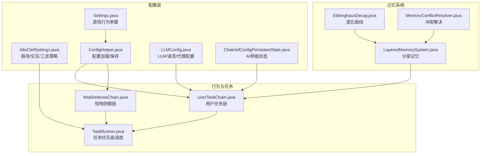
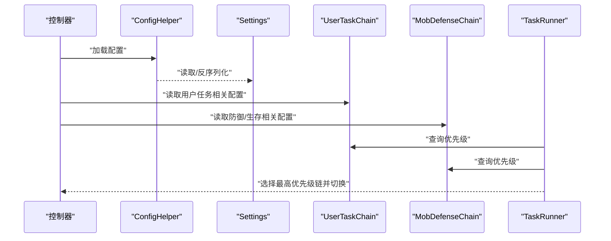
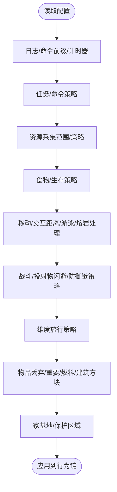
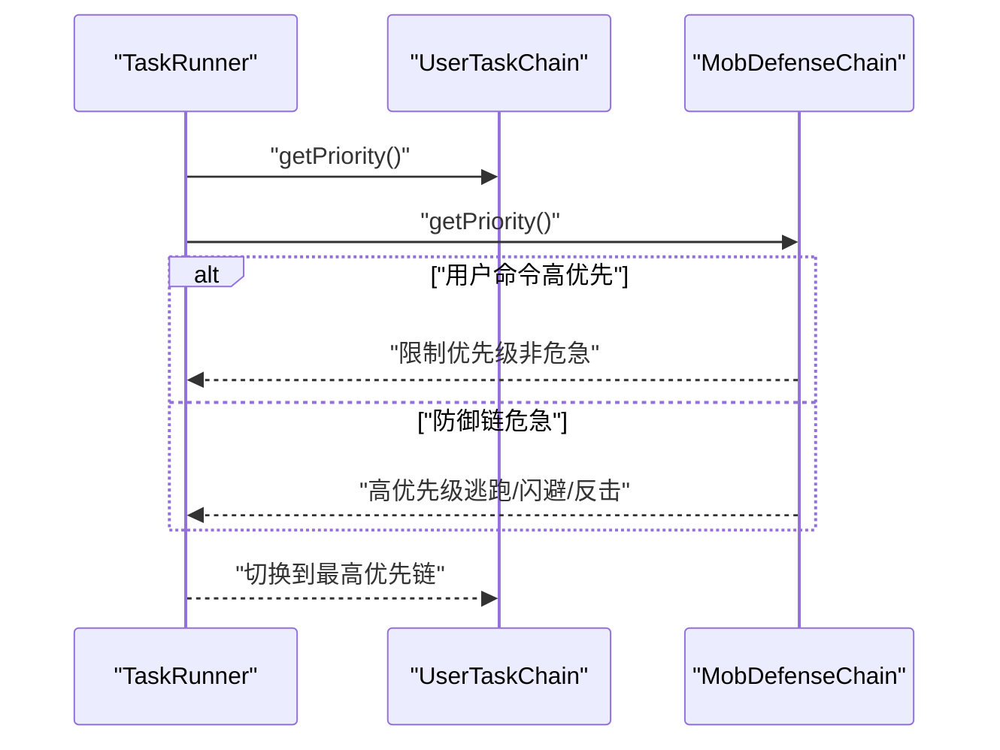
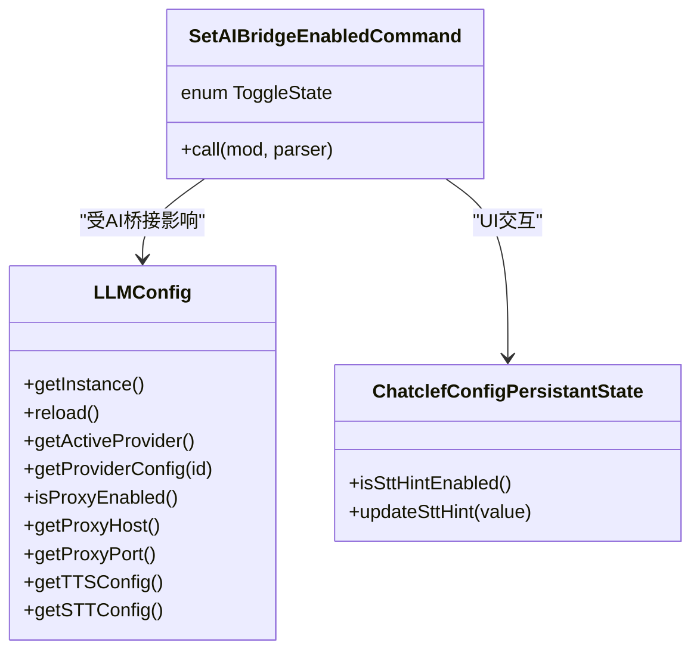
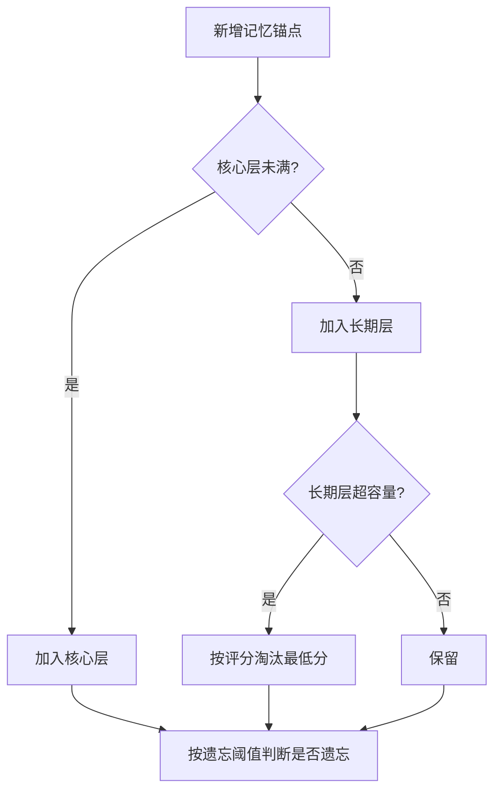
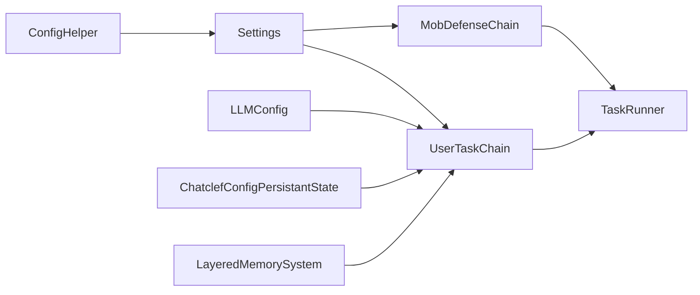

# 行为配置管理

<cite>
**本文引用的文件**   
- [Settings.java](file://src/main/java/adris/altoclef/Settings.java)
- [AltoClefSettings.java](file://src/main/java/baritone/autoclef/AltoClefSettings.java)
- [ConfigHelper.java](file://src/main/java/adris/altoclef/util/helpers/ConfigHelper.java)
- [SetAIBridgeEnabledCommand.java](file://src/main/java/adris/altoclef/commands/SetAIBridgeEnabledCommand.java)
- [UserTaskChain.java](file://src/main/java/adris/altoclef/chains/UserTaskChain.java)
- [MobDefenseChain.java](file://src/main/java/adris/altoclef/chains/MobDefenseChain.java)
- [TaskRunner.java](file://src/main/java/adris/altoclef/tasksystem/TaskRunner.java)
- [LLMConfig.java](file://src/main/java/adris/altoclef/player2api/llm/LLMConfig.java)
- [ChatclefConfigPersistantState.java](file://src/main/java/adris/altoclef/player2api/ChatclefConfigPersistantState.java)
- [EbbinghausDecay.java](file://src/main/java/adris/altoclef/player2api/memory/EbbinghausDecay.java)
- [LayeredMemorySystem.java](file://src/main/java/adris/altoclef/player2api/memory/LayeredMemorySystem.java)
- [MemoryConflictResolver.java](file://src/main/java/adris/altoclef/player2api/memory/MemoryConflictResolver.java)
- [AI_NPC游戏指令系统重构.md](file://docs/AI_NPC游戏指令系统重构.md)
</cite>

## 目录
1. [简介](#简介)
2. [项目结构](#项目结构)
3. [核心组件](#核心组件)
4. [架构总览](#架构总览)
5. [详细组件分析](#详细组件分析)
6. [依赖分析](#依赖分析)
7. [性能考量](#性能考量)
8. [故障排查指南](#故障排查指南)
9. [结论](#结论)
10. [附录](#附录)

## 简介
本文件面向“行为配置管理”，围绕 Settings.java 展开，系统梳理 AI 行为控制、任务执行策略、性能优化参数等配置项，解释其对 AI 行为的影响（决策速度、资源消耗、稳定性等），并提供可操作的调优建议、最佳实践与故障诊断方法。同时结合行为链优先级、AI 桥接开关、LLM/语音配置、记忆系统等模块，给出跨模块协同的配置策略。

## 项目结构
行为配置主要集中在以下位置：
- 主要配置类：adris/altoclef/Settings.java（游戏内行为开关与范围参数）
- Baritone 扩展配置：baritone/autoclef/AltoClefSettings.java（路径/交互/工具策略等）
- 配置加载与持久化：adris/altoclef/util/helpers/ConfigHelper.java
- 行为链与任务调度：chains/*、tasksystem/TaskRunner.java
- AI 桥接与语音/LLM：commands/SetAIBridgeEnabledCommand.java、player2api/*
- 记忆系统：player2api/memory/*

**图示来源**
- [Settings.java:1-357](file://src/main/java/adris/altoclef/Settings.java#L1-L357)
- [AltoClefSettings.java:1-237](file://src/main/java/baritone/autoclef/AltoClefSettings.java#L1-L237)
- [ConfigHelper.java:1-243](file://src/main/java/adris/altoclef/util/helpers/ConfigHelper.java#L1-L243)
- [UserTaskChain.java:1-236](file://src/main/java/adris/altoclef/chains/UserTaskChain.java#L1-L236)
- [MobDefenseChain.java:1-706](file://src/main/java/adris/altoclef/chains/MobDefenseChain.java#L1-L706)
- [TaskRunner.java:1-39](file://src/main/java/adris/altoclef/tasksystem/TaskRunner.java#L1-L39)
- [LLMConfig.java:1-116](file://src/main/java/adris/altoclef/player2api/llm/LLMConfig.java#L1-L116)
- [ChatclefConfigPersistantState.java:1-57](file://src/main/java/adris/altoclef/player2api/ChatclefConfigPersistantState.java#L1-L57)
- [EbbinghausDecay.java:1-65](file://src/main/java/adris/altoclef/player2api/memory/EbbinghausDecay.java#L1-L65)
- [LayeredMemorySystem.java:40-70](file://src/main/java/adris/altoclef/player2api/memory/LayeredMemorySystem.java#L40-L70)
- [MemoryConflictResolver.java:1-44](file://src/main/java/adris/altoclef/player2api/memory/MemoryConflictResolver.java#L1-L44)

**章节来源**
- [Settings.java:1-357](file://src/main/java/adris/altoclef/Settings.java#L1-L357)
- [AltoClefSettings.java:1-237](file://src/main/java/baritone/autoclef/AltoClefSettings.java#L1-L237)
- [ConfigHelper.java:1-243](file://src/main/java/adris/altoclef/util/helpers/ConfigHelper.java#L1-L243)

## 核心组件
- Settings.java：定义游戏内 AI 行为参数，涵盖日志、命令前缀、任务链显示、资源采集范围、食物策略、移动/战斗/生存开关、丢弃/重要物品清单、维度旅行策略、家基地位置、保护区域等。
- AltoClefSettings.java：扩展 Baritone 的行为策略，如避免破坏/放置、强制步行/穿行、工具使用策略、全局启发式、交互暂停、水/熔岩/灵魂沙等特殊地形处理。
- ConfigHelper.java：统一的配置加载/保存机制，支持失败回退、序列化/反序列化、Pretty Print 输出。
- UserTaskChain/MobDefenseChain/TaskRunner：行为链与任务优先级调度，体现配置对行为链抢占与执行顺序的影响。
- LLMConfig/ChatclefConfigPersistantState：AI 桥接与大模型/语音配置，影响对话与语音交互行为。
- 记忆系统：遗忘曲线、分层存储、冲突解决，影响 AI 的长期行为一致性与稳定性。

**章节来源**
- [Settings.java:32-357](file://src/main/java/adris/altoclef/Settings.java#L32-L357)
- [AltoClefSettings.java:14-237](file://src/main/java/baritone/autoclef/AltoClefSettings.java#L14-L237)
- [ConfigHelper.java:33-243](file://src/main/java/adris/altoclef/util/helpers/ConfigHelper.java#L33-L243)
- [UserTaskChain.java:14-236](file://src/main/java/adris/altoclef/chains/UserTaskChain.java#L14-L236)
- [MobDefenseChain.java:74-706](file://src/main/java/adris/altoclef/chains/MobDefenseChain.java#L74-L706)
- [TaskRunner.java:9-39](file://src/main/java/adris/altoclef/tasksystem/TaskRunner.java#L9-L39)
- [LLMConfig.java:19-116](file://src/main/java/adris/altoclef/player2api/llm/LLMConfig.java#L19-L116)
- [ChatclefConfigPersistantState.java:10-57](file://src/main/java/adris/altoclef/player2api/ChatclefConfigPersistantState.java#L10-L57)
- [EbbinghausDecay.java:9-65](file://src/main/java/adris/altoclef/player2api/memory/EbbinghausDecay.java#L9-L65)
- [LayeredMemorySystem.java:40-70](file://src/main/java/adris/altoclef/player2api/memory/LayeredMemorySystem.java#L40-L70)
- [MemoryConflictResolver.java:10-44](file://src/main/java/adris/altoclef/player2api/memory/MemoryConflictResolver.java#L10-L44)

## 架构总览
行为配置通过 Settings 与 AltoClefSettings 提供参数，由 ConfigHelper 加载并注入控制器；行为链（UserTaskChain、MobDefenseChain）依据配置计算优先级并执行；TaskRunner 按优先级驱动行为链切换；LLM/语音配置与记忆系统作为外部能力参与行为决策与稳定性保障。

**图示来源**
- [ConfigHelper.java:95-117](file://src/main/java/adris/altoclef/util/helpers/ConfigHelper.java#L95-L117)
- [Settings.java:149-151](file://src/main/java/adris/altoclef/Settings.java#L149-L151)
- [UserTaskChain.java:126-129](file://src/main/java/adris/altoclef/chains/UserTaskChain.java#L126-L129)
- [MobDefenseChain.java:154-185](file://src/main/java/adris/altoclef/chains/MobDefenseChain.java#L154-L185)
- [TaskRunner.java:22-39](file://src/main/java/adris/altoclef/tasksystem/TaskRunner.java#L22-L39)

## 详细组件分析

### Settings.java 行为配置参数详解
- 日志与调试
  - 显示调试耗时、显示任务链、隐藏告警日志、命令前缀、日志级别、聊天前缀、显示计时器
  - 影响：提升可观测性或降低噪音，便于定位问题
- 任务与命令
  - 空闲命令、死亡命令、是否在空闲时执行空闲命令
  - 影响：决定任务结束后的行为（继续执行/停止/进入空闲）
- 资源与采集
  - 容器移动延迟、使用配方书合成、资源拾取/容器查找/挖矿范围、优先容器资源、避免地牢箱子搜索、避免海洋方块
  - 影响：吞吐量与路径规划效率的平衡
- 食物与生存
  - 最低食物阈值、采集食物单位数、自动进食、自动 MLG 水桶、避免溺水、灭火、自动重连/复活
  - 影响：生存稳定性与资源消耗
- 移动与战斗
  - 实体交互距离、优先收集镐、重新种植作物、怪物防御、投射物闪避、处理烦人敌对生物、近战/远程策略（KillAura 策略）
  - 影响：战斗效率与路径安全
- 维度与旅行
  - 主世界到下界行为策略、下界快速旅行步行范围
  - 影响：传送/建造/导航策略
- 物品策略
  - 丢弃清单、重要物品清单、保留建筑方块数量、是否丢弃带名/附魔物品、限制燃料类型、支持燃料清单
  - 影响：资源复用与浪费控制
- 家基地与保护
  - 家基地点、保护区域列表
  - 影响：巡逻/驻守策略

**图示来源**
- [Settings.java:36-345](file://src/main/java/adris/altoclef/Settings.java#L36-L345)

**章节来源**
- [Settings.java:36-345](file://src/main/java/adris/altoclef/Settings.java#L36-L345)

### 行为链优先级与配置联动
- 用户任务链（UserTaskChain）：在用户命令活跃时优先级提升，防止被防御链抢占；任务完成后按配置决定是否进入空闲命令。
- 怪物防御链（MobDefenseChain）：动态计算优先级，考虑玩家攻击override、用户命令高优先模式、生命危险阈值等；在用户高优先命令期间限制自身抢占。
- 任务调度（TaskRunner）：按优先级选择最高链并切换，确保关键生存行为不会被低优先级任务打断。

**图示来源**
- [UserTaskChain.java:126-129](file://src/main/java/adris/altoclef/chains/UserTaskChain.java#L126-L129)
- [MobDefenseChain.java:154-185](file://src/main/java/adris/altoclef/chains/MobDefenseChain.java#L154-L185)
- [TaskRunner.java:22-39](file://src/main/java/adris/altoclef/tasksystem/TaskRunner.java#L22-L39)
- [AI_NPC游戏指令系统重构.md:1475-1512](file://docs/AI_NPC游戏指令系统重构.md#L1475-L1512)

**章节来源**
- [UserTaskChain.java:126-129](file://src/main/java/adris/altoclef/chains/UserTaskChain.java#L126-L129)
- [MobDefenseChain.java:154-185](file://src/main/java/adris/altoclef/chains/MobDefenseChain.java#L154-L185)
- [TaskRunner.java:22-39](file://src/main/java/adris/altoclef/tasksystem/TaskRunner.java#L22-L39)
- [AI_NPC游戏指令系统重构.md:1475-1512](file://docs/AI_NPC游戏指令系统重构.md#L1475-L1512)

### AI 桥接与语音/LLM 配置
- AI 桥接开关：通过命令启用/禁用 AI 桥接，影响消息拦截与语音提示。
- LLM 配置：加载 LLM 提供商、代理、TTS/STT 参数，支持热更新。
- Chatclef 持久化状态：记录 STT 提示开关等 UI/交互偏好。

**图示来源**
- [SetAIBridgeEnabledCommand.java:10-41](file://src/main/java/adris/altoclef/commands/SetAIBridgeEnabledCommand.java#L10-L41)
- [LLMConfig.java:41-116](file://src/main/java/adris/altoclef/player2api/llm/LLMConfig.java#L41-L116)
- [ChatclefConfigPersistantState.java:10-57](file://src/main/java/adris/altoclef/player2api/ChatclefConfigPersistantState.java#L10-L57)

**章节来源**
- [SetAIBridgeEnabledCommand.java:10-41](file://src/main/java/adris/altoclef/commands/SetAIBridgeEnabledCommand.java#L10-L41)
- [LLMConfig.java:41-116](file://src/main/java/adris/altoclef/player2api/llm/LLMConfig.java#L41-L116)
- [ChatclefConfigPersistantState.java:10-57](file://src/main/java/adris/altoclef/player2api/ChatclefConfigPersistantState.java#L10-L57)

### 记忆系统与行为稳定性
- 遗忘曲线：基于时间与情感权重的指数衰减，替代线性衰减，提升真实感。
- 分层记忆：短期/长期/核心三层容量控制，满载时降级或淘汰最低分记忆。
- 冲突解决：基于内容相似度与情感权重的冲突策略（新胜/高情感/合并/版本化）。

**图示来源**
- [LayeredMemorySystem.java:40-70](file://src/main/java/adris/altoclef/player2api/memory/LayeredMemorySystem.java#L40-L70)
- [EbbinghausDecay.java:17-42](file://src/main/java/adris/altoclef/player2api/memory/EbbinghausDecay.java#L17-L42)
- [MemoryConflictResolver.java:27-44](file://src/main/java/adris/altoclef/player2api/memory/MemoryConflictResolver.java#L27-L44)

**章节来源**
- [LayeredMemorySystem.java:40-70](file://src/main/java/adris/altoclef/player2api/memory/LayeredMemorySystem.java#L40-L70)
- [EbbinghausDecay.java:17-42](file://src/main/java/adris/altoclef/player2api/memory/EbbinghausDecay.java#L17-L42)
- [MemoryConflictResolver.java:27-44](file://src/main/java/adris/altoclef/player2api/memory/MemoryConflictResolver.java#L27-L44)

## 依赖分析
- 配置加载依赖：ConfigHelper 为 Settings 提供统一的加载/保存接口，支持失败回调与 Pretty Print。
- 行为链依赖：UserTaskChain/MobDefenseChain 依赖 Settings 的多项布尔/数值参数；TaskRunner 依赖各链的优先级计算结果。
- 外部能力依赖：LLMConfig/ChatclefConfigPersistantState 为 AI 桥接与语音提供参数；记忆系统为行为稳定性提供支撑。

**图示来源**
- [ConfigHelper.java:95-117](file://src/main/java/adris/altoclef/util/helpers/ConfigHelper.java#L95-L117)
- [Settings.java:149-151](file://src/main/java/adris/altoclef/Settings.java#L149-L151)
- [UserTaskChain.java:126-129](file://src/main/java/adris/altoclef/chains/UserTaskChain.java#L126-L129)
- [MobDefenseChain.java:154-185](file://src/main/java/adris/altoclef/chains/MobDefenseChain.java#L154-L185)
- [TaskRunner.java:22-39](file://src/main/java/adris/altoclef/tasksystem/TaskRunner.java#L22-L39)
- [LLMConfig.java:41-116](file://src/main/java/adris/altoclef/player2api/llm/LLMConfig.java#L41-L116)
- [ChatclefConfigPersistantState.java:10-57](file://src/main/java/adris/altoclef/player2api/ChatclefConfigPersistantState.java#L10-L57)
- [LayeredMemorySystem.java:40-70](file://src/main/java/adris/altoclef/player2api/memory/LayeredMemorySystem.java#L40-L70)

**章节来源**
- [ConfigHelper.java:95-117](file://src/main/java/adris/altoclef/util/helpers/ConfigHelper.java#L95-L117)
- [Settings.java:149-151](file://src/main/java/adris/altoclef/Settings.java#L149-L151)
- [TaskRunner.java:22-39](file://src/main/java/adris/altoclef/tasksystem/TaskRunner.java#L22-L39)

## 性能考量
- 路径规划与超时
  - Baritone 设置中的 movementTimeoutTicks、primaryTimeoutMS、failureTimeoutMS、planAhead*TimeoutMS 等，直接影响寻路响应速度与稳定性。
  - 建议：在高负载/复杂地形适当增大超时，避免频繁失败回退；在稳定环境下适度收紧以提升响应速度。
- 资源采集范围与容器策略
  - 资源拾取/容器查找/挖矿范围与是否优先容器资源，影响寻路长度与交互频率。
  - 建议：在资源密集区扩大范围以减少往返；在资源稀疏区缩小范围以降低扫描成本。
- 自动进食/MLG/灭火
  - 自动进食与 MLG 水桶在极端情况下可能打断当前任务，需结合任务链优先级与健康阈值进行权衡。
  - 建议：在高风险区域开启 MLG 与灭火，在安全区域关闭以节省交互。
- 记忆系统容量与评分
  - 记忆容量上限与评分淘汰策略影响长期行为一致性与内存占用。
  - 建议：根据服务器/模组复杂度调整容量，定期清理低分记忆以维持性能。

[本节为通用性能建议，无需特定文件引用]

## 故障排查指南
- 配置加载失败
  - 现象：日志出现解析错误或配置未生效。
  - 排查：检查配置文件格式、字段拼写；确认 ConfigHelper 的失败回调是否触发；必要时删除配置文件让默认值重建。
  - 参考：Settings 实现 IFailableConfigFile 并提供 failedToLoad 回调。
- 行为链抢占异常
  - 现象：用户命令被防御链抢占或反之。
  - 排查：核对 UserTaskChain 的高优先级阈值与 MobDefenseChain 的生命危险阈值；查看 AI 指令系统重构文档中的优先级设计。
- AI 桥接/语音异常
  - 现象：无法拦截消息或语音提示失效。
  - 排查：检查 AI 桥接命令开关、Chatclef 持久化状态、LLM 代理配置与端口；确认网络代理设置。
- 记忆丢失/冲突
  - 现象：记忆频繁消失或冲突处理不当。
  - 排查：检查遗忘阈值与评分权重；确认冲突解决策略；评估内容相似度阈值。

**章节来源**
- [Settings.java:347-355](file://src/main/java/adris/altoclef/Settings.java#L347-L355)
- [ConfigHelper.java:62-92](file://src/main/java/adris/altoclef/util/helpers/ConfigHelper.java#L62-L92)
- [AI_NPC游戏指令系统重构.md:1475-1512](file://docs/AI_NPC游戏指令系统重构.md#L1475-L1512)
- [SetAIBridgeEnabledCommand.java:19-35](file://src/main/java/adris/altoclef/commands/SetAIBridgeEnabledCommand.java#L19-L35)
- [ChatclefConfigPersistantState.java:26-51](file://src/main/java/adris/altoclef/player2api/ChatclefConfigPersistantState.java#L26-L51)
- [LLMConfig.java:54-89](file://src/main/java/adris/altoclef/player2api/llm/LLMConfig.java#L54-L89)
- [EbbinghausDecay.java:54-64](file://src/main/java/adris/altoclef/player2api/memory/EbbinghausDecay.java#L54-L64)
- [MemoryConflictResolver.java:27-44](file://src/main/java/adris/altoclef/player2api/memory/MemoryConflictResolver.java#L27-L44)

## 结论
行为配置管理通过 Settings 与 AltoClefSettings 将高层策略转化为底层行为链的优先级与执行细节，配合 TaskRunner 的调度、LLM/语音配置与记忆系统的稳定性保障，形成一套可调、可观察、可恢复的行为体系。合理配置能在不同场景下取得性能与功能的最佳平衡，并通过持久化与冲突解决机制提升长期可用性。

[本节为总结性内容，无需特定文件引用]

## 附录

### 配置调优示例与最佳实践
- 高风险探索（PvE/PvP）
  - 开启怪物防御、投射物闪避、MLG 水桶、灭火；适度扩大资源采集范围；启用自动进食。
  - 降低容器优先策略，减少不必要的交互。
- 资源收集（高效刷怪/挖矿）
  - 关闭 MLG 与灭火；适度缩小采集范围；开启容器优先策略；保留一定建筑方块用于临时基建。
- 长期挂机/空闲
  - 开启空闲命令；关闭高代价交互；适度放宽防御链阈值；启用记忆系统容量上限与评分淘汰。
- 多人/复杂地图
  - 适当增大路径超时；启用记忆冲突合并策略；谨慎开启 AI 桥接与语音提示，避免干扰。

[本节为通用实践建议，无需特定文件引用]