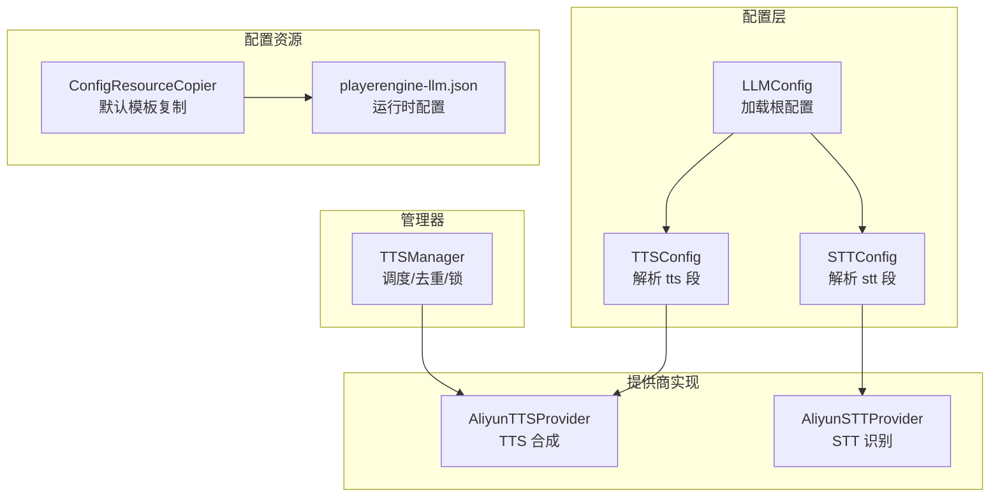
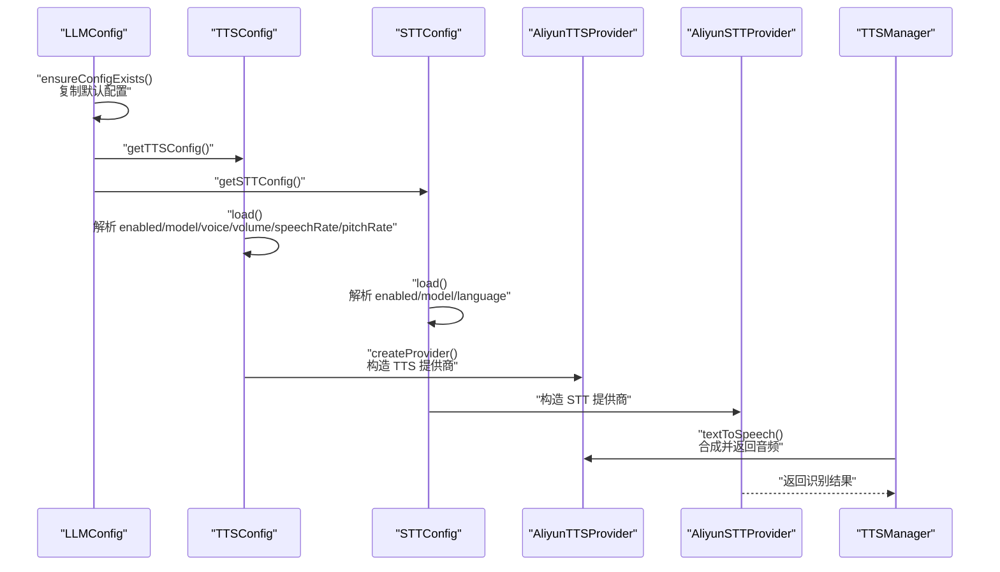
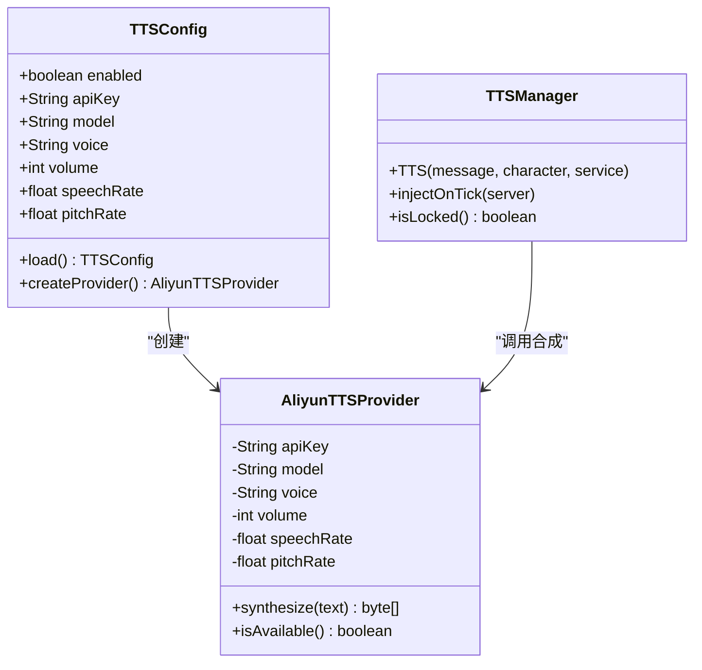
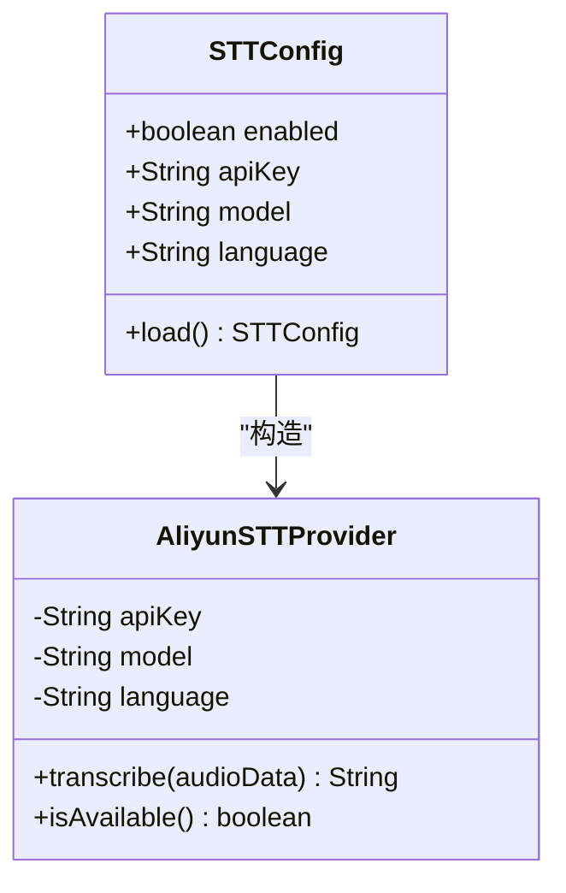
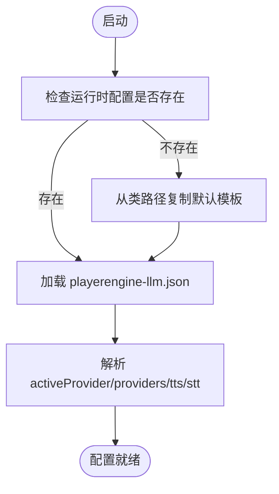
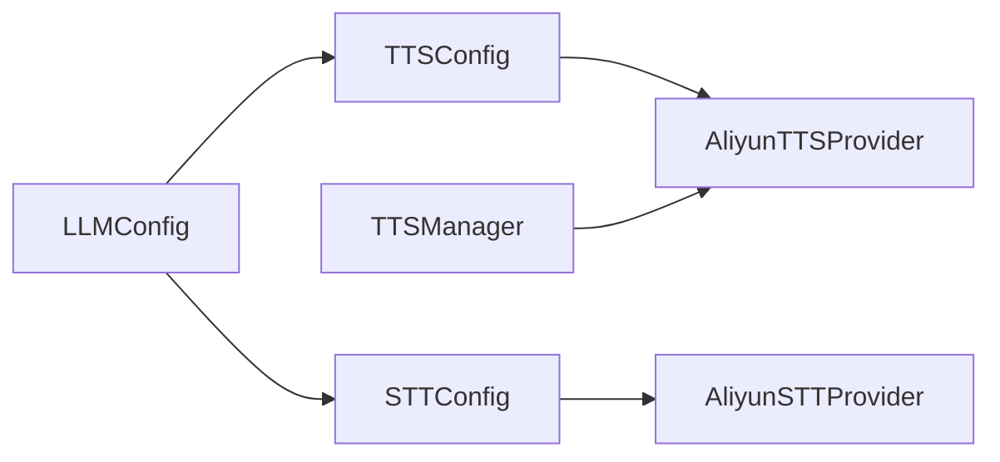

# 语音服务配置

<cite>
**本文引用的文件**
- [TTSConfig.java](file://src/main/java/adris/altoclef/player2api/tts/TTSConfig.java)
- [STTConfig.java](file://src/main/java/adris/altoclef/player2api/stt/STTConfig.java)
- [TTSManager.java](file://src/main/java/adris/altoclef/player2api/manager/TTSManager.java)
- [AliyunTTSProvider.java](file://src/main/java/adris/altoclef/player2api/tts/AliyunTTSProvider.java)
- [AliyunSTTProvider.java](file://src/main/java/adris/altoclef/player2api/stt/AliyunSTTProvider.java)
- [LLMConfig.java](file://src/main/java/adris/altoclef/player2api/llm/LLMConfig.java)
- [ConfigResourceCopier.java](file://src/main/java/adris/altoclef/player2api/utils/ConfigResourceCopier.java)
- [playerengine-llm.json](file://run/config/playerengine-llm.json)
</cite>

## 目录
1. [简介](#简介)
2. [项目结构](#项目结构)
3. [核心组件](#核心组件)
4. [架构总览](#架构总览)
5. [详细组件分析](#详细组件分析)
6. [依赖关系分析](#依赖关系分析)
7. [性能考量](#性能考量)
8. [故障排除指南](#故障排除指南)
9. [结论](#结论)
10. [附录](#附录)

## 简介
本技术文档围绕语音服务配置系统，系统性阐述 TTS 语音合成与 STT 语音识别的完整配置与实现细节。内容涵盖：
- TTS 配置段落：enabled 开关、apiKey 密钥、model 模型、voice 音色、volume 音量、speechRate 语速、pitchRate 音调。
- STT 配置段落：enabled 开关、model 模型、language 语言设置。
- 进度语音反馈（progressVoice）相关参数：enabled 开关、intervalMin 最小间隔、intervalMax 最大间隔（在现有代码中以全局冷却与去重策略体现）。
- 配置加载机制、提供商切换逻辑与动态配置更新方式。
- 语音配置优化建议、音质调优与常见问题排查。

## 项目结构
语音服务配置相关代码主要分布在以下模块：
- 配置层：LLMConfig 负责从 JSON 文件加载配置；TTSConfig/STTConfig 从 LLMConfig 的“tts”“stt”子段解析具体参数。
- 提供商实现：AliyunTTSProvider、AliyunSTTProvider 封装阿里云 DashScope 的 TTS/STT 能力。
- 管理器：TTSManager 负责 TTS 合成调度、并发控制、消息去重与锁释放。
- 配置资源：ConfigResourceCopier 负责默认配置模板复制到运行时目录。

图表来源
- [LLMConfig.java:19-103](file://src/main/java/adris/altoclef/player2api/llm/LLMConfig.java#L19-L103)
- [TTSConfig.java:38-85](file://src/main/java/adris/altoclef/player2api/tts/TTSConfig.java#L38-L85)
- [STTConfig.java:31-71](file://src/main/java/adris/altoclef/player2api/stt/STTConfig.java#L31-L71)
- [AliyunTTSProvider.java:34-112](file://src/main/java/adris/altoclef/player2api/tts/AliyunTTSProvider.java#L34-L112)
- [AliyunSTTProvider.java:35-171](file://src/main/java/adris/altoclef/player2api/stt/AliyunSTTProvider.java#L35-L171)
- [TTSManager.java:35-168](file://src/main/java/adris/altoclef/player2api/manager/TTSManager.java#L35-L168)
- [ConfigResourceCopier.java:29-57](file://src/main/java/adris/altoclef/player2api/utils/ConfigResourceCopier.java#L29-L57)
- [playerengine-llm.json:1-79](file://run/config/playerengine-llm.json#L1-L79)

章节来源
- [LLMConfig.java:19-103](file://src/main/java/adris/altoclef/player2api/llm/LLMConfig.java#L19-L103)
- [playerengine-llm.json:1-79](file://run/config/playerengine-llm.json#L1-L79)

## 核心组件
- LLMConfig：负责定位并加载运行时配置文件，解析 activeProvider、providers、proxy、tts、stt 等字段，支持热重载。
- TTSConfig：从 LLMConfig 的 tts 段读取参数，若未单独配置 tts apiKey 则回退到 qwen 提供商的 apiKey。
- STTConfig：从 LLMConfig 的 stt 段读取参数，若未单独配置 stt apiKey 删退到 qwen 提供商的 apiKey。
- AliyunTTSProvider：封装阿里云 CosyVoice TTS 合成，支持 WAV 输出与参数覆盖。
- AliyunSTTProvider：封装阿里云 Gummy 实时语音转写，支持 PCM/WAV 输入与分片发送。
- TTSManager：负责 TTS 调度、消息去重、全局冷却、序列号去旧、锁释放等。

章节来源
- [LLMConfig.java:49-103](file://src/main/java/adris/altoclef/player2api/llm/LLMConfig.java#L49-L103)
- [TTSConfig.java:38-101](file://src/main/java/adris/altoclef/player2api/tts/TTSConfig.java#L38-L101)
- [STTConfig.java:31-77](file://src/main/java/adris/altoclef/player2api/stt/STTConfig.java#L31-L77)
- [AliyunTTSProvider.java:50-112](file://src/main/java/adris/altoclef/player2api/tts/AliyunTTSProvider.java#L50-L112)
- [AliyunSTTProvider.java:47-171](file://src/main/java/adris/altoclef/player2api/stt/AliyunSTTProvider.java#L47-L171)
- [TTSManager.java:94-168](file://src/main/java/adris/altoclef/player2api/manager/TTSManager.java#L94-L168)

## 架构总览
语音服务配置系统采用“配置解析 + 提供商实现 + 管理器调度”的分层设计。配置文件位于运行时目录，首次启动时由资源复制器从类路径模板复制；TTS/STT 配置分别由各自配置类解析，并在需要时回退到 LLM 提供商的 apiKey。提供商实现通过阿里云 DashScope SDK 完成实际的语音能力调用。TTSManager 在客户端侧对合成请求进行去重、限流与顺序播放控制。

图表来源
- [LLMConfig.java:37-77](file://src/main/java/adris/altoclef/player2api/llm/LLMConfig.java#L37-L77)
- [TTSConfig.java:38-92](file://src/main/java/adris/altoclef/player2api/tts/TTSConfig.java#L38-L92)
- [STTConfig.java:31-71](file://src/main/java/adris/altoclef/player2api/stt/STTConfig.java#L31-L71)
- [AliyunTTSProvider.java:90-112](file://src/main/java/adris/altoclef/player2api/tts/AliyunTTSProvider.java#L90-L112)
- [AliyunSTTProvider.java:35-171](file://src/main/java/adris/altoclef/player2api/stt/AliyunSTTProvider.java#L35-L171)
- [TTSManager.java:94-153](file://src/main/java/adris/altoclef/player2api/manager/TTSManager.java#L94-L153)

## 详细组件分析

### TTS 配置与实现
- 配置项与默认值
  - enabled：默认启用。
  - apiKey：优先使用 tts 段独立 apiKey，否则回退到 qwen 提供商的 apiKey。
  - model：默认“cosyvoice-v3-flash”。
  - voice：默认“longanhuan”。
  - volume：默认 50。
  - speechRate：默认 1.0。
  - pitchRate：默认 1.0。
- 加载与回退逻辑
  - 若 tts 段存在且非空，按字段解析；否则使用默认值并回退 qwen apiKey。
  - 回退策略：先取“qwen”提供商配置，再取当前激活的提供商配置。
- 提供商实现
  - 使用阿里云 DashScope CosyVoice 合成，输出 WAV（22050Hz 单声道 16bit）。
  - 支持文本截断（上限约 10000 字符），异常处理与请求清理。
- 管理器调度
  - 文本按中文句号/英文句点/换行等切分为句子，逐句提交单线程队列，实现顺序播放与低延迟。
  - 全局冷却（约 2 秒）、消息去重（5 秒内重复跳过）、序列号去旧（新消息到来时丢弃旧队列）。
  - 基于字符长度估算播放时长并释放锁，避免阻塞。

图表来源
- [TTSConfig.java:23-101](file://src/main/java/adris/altoclef/player2api/tts/TTSConfig.java#L23-L101)
- [AliyunTTSProvider.java:22-112](file://src/main/java/adris/altoclef/player2api/tts/AliyunTTSProvider.java#L22-L112)
- [TTSManager.java:35-168](file://src/main/java/adris/altoclef/player2api/manager/TTSManager.java#L35-L168)

章节来源
- [TTSConfig.java:38-101](file://src/main/java/adris/altoclef/player2api/tts/TTSConfig.java#L38-L101)
- [AliyunTTSProvider.java:50-112](file://src/main/java/adris/altoclef/player2api/tts/AliyunTTSProvider.java#L50-L112)
- [TTSManager.java:94-168](file://src/main/java/adris/altoclef/player2api/manager/TTSManager.java#L94-L168)

### STT 配置与实现
- 配置项与默认值
  - enabled：默认启用。
  - apiKey：优先使用 stt 段独立 apiKey，否则回退到 qwen 提供商的 apiKey。
  - model：默认“gummy-chat-v1”。
  - language：默认“zh”。
- 加载与回退逻辑
  - 若 stt 段存在且非空，按字段解析；否则使用默认值并回退 qwen apiKey。
- 提供商实现
  - 使用阿里云 DashScope Gummy 实时转写，接收 PCM 或 WAV（内部自动剥离 WAV 头）。
  - 分片发送（约 100ms 块），支持部分/最终结果回调，超时控制与错误处理。
- 语言与采样率
  - 内部固定采样率 16kHz、16bit、Mono；支持多语言识别（zh/en/ja/ko/auto）。

图表来源
- [STTConfig.java:19-77](file://src/main/java/adris/altoclef/player2api/stt/STTConfig.java#L19-L77)
- [AliyunSTTProvider.java:26-171](file://src/main/java/adris/altoclef/player2api/stt/AliyunSTTProvider.java#L26-L171)

章节来源
- [STTConfig.java:31-77](file://src/main/java/adris/altoclef/player2api/stt/STTConfig.java#L31-L77)
- [AliyunSTTProvider.java:47-171](file://src/main/java/adris/altoclef/player2api/stt/AliyunSTTProvider.java#L47-L171)

### 进度语音反馈（progressVoice）参数说明
- enabled：用于控制是否启用进度语音反馈（在现有代码中通过 TTSManager 的全局冷却与去重策略实现类似效果）。
- intervalMin/intervalMax：在现有实现中未直接暴露该参数。但 TTSManager 提供了以下等效机制：
  - 全局冷却：任意 TTS 调用频率限制（约 2 秒）。
  - 消息去重：相同消息在 5 秒内不重复播报。
  - 序列号去旧：新消息到来时丢弃旧队列，避免旧进度被播报。
- 若需引入 intervalMin/intervalMax，可在 TTSManager 中增加基于时间戳的最小/最大间隔控制。

章节来源
- [TTSManager.java:54-119](file://src/main/java/adris/altoclef/player2api/manager/TTSManager.java#L54-L119)

### 配置加载机制、提供商切换与动态更新
- 配置加载
  - LLMConfig 使用 ConfigResourceCopier 确保运行时配置存在，不存在则从类路径模板复制。
  - 解析根配置中的 activeProvider、providers、proxy、tts、stt 等段。
- 提供商切换
  - TTS/STT 配置在解析阶段不直接依赖 activeProvider，而是优先使用各自段的配置；若未单独配置，则回退到 qwen 提供商的 apiKey。
  - 若需根据 activeProvider 动态选择模型或参数，可在业务层扩展逻辑。
- 动态更新
  - LLMConfig 提供 reload 方法，可重新从磁盘加载配置；TTSConfig/STTConfig 需在业务侧触发重新加载并重建提供商实例。

图表来源
- [ConfigResourceCopier.java:29-57](file://src/main/java/adris/altoclef/player2api/utils/ConfigResourceCopier.java#L29-L57)
- [LLMConfig.java:54-77](file://src/main/java/adris/altoclef/player2api/llm/LLMConfig.java#L54-L77)

章节来源
- [ConfigResourceCopier.java:29-57](file://src/main/java/adris/altoclef/player2api/utils/ConfigResourceCopier.java#L29-L57)
- [LLMConfig.java:49-77](file://src/main/java/adris/altoclef/player2api/llm/LLMConfig.java#L49-L77)

## 依赖关系分析
- 组件耦合
  - TTSConfig/STTConfig 依赖 LLMConfig 获取根配置段。
  - AliyunTTSProvider/AliyunSTTProvider 依赖阿里云 SDK，内部封装参数与错误处理。
  - TTSManager 依赖 Player2APIService（外部接口）完成音频合成与播放。
- 外部依赖
  - 阿里云 DashScope SDK（TTS/STT）。
  - Gson（JSON 解析）。
  - Log4j（日志）。

图表来源
- [LLMConfig.java:79-103](file://src/main/java/adris/altoclef/player2api/llm/LLMConfig.java#L79-L103)
- [TTSConfig.java:38-92](file://src/main/java/adris/altoclef/player2api/tts/TTSConfig.java#L38-L92)
- [STTConfig.java:31-71](file://src/main/java/adris/altoclef/player2api/stt/STTConfig.java#L31-L71)
- [AliyunTTSProvider.java:90-112](file://src/main/java/adris/altoclef/player2api/tts/AliyunTTSProvider.java#L90-L112)
- [AliyunSTTProvider.java:35-171](file://src/main/java/adris/altoclef/player2api/stt/AliyunSTTProvider.java#L35-L171)
- [TTSManager.java:94-153](file://src/main/java/adris/altoclef/player2api/manager/TTSManager.java#L94-L153)

章节来源
- [LLMConfig.java:79-103](file://src/main/java/adris/altoclef/player2api/llm/LLMConfig.java#L79-L103)
- [TTSConfig.java:38-92](file://src/main/java/adris/altoclef/player2api/tts/TTSConfig.java#L38-L92)
- [STTConfig.java:31-71](file://src/main/java/adris/altoclef/player2api/stt/STTConfig.java#L31-L71)
- [AliyunTTSProvider.java:90-112](file://src/main/java/adris/altoclef/player2api/tts/AliyunTTSProvider.java#L90-L112)
- [AliyunSTTProvider.java:35-171](file://src/main/java/adris/altoclef/player2api/stt/AliyunSTTProvider.java#L35-L171)
- [TTSManager.java:94-153](file://src/main/java/adris/altoclef/player2api/manager/TTSManager.java#L94-L153)

## 性能考量
- 合成端到端延迟
  - TTSManager 将长文本按句子切分并串行合成，减少首包延迟，适合实时播报。
  - 估算播放时长并释放锁，避免长时间占用。
- 去重与限流
  - 全局冷却与消息去重有效防止重复播报与刷屏。
- 音频格式与采样
  - TTS 输出 WAV（22050Hz 单声道 16bit），兼容 javax.sound；STT 输入 PCM（16kHz 16bit 单声道）。
- 文本长度限制
  - TTS 对输入文本长度进行截断，避免超限导致失败或超时。

章节来源
- [TTSManager.java:58-153](file://src/main/java/adris/altoclef/player2api/manager/TTSManager.java#L58-L153)
- [AliyunTTSProvider.java:60-64](file://src/main/java/adris/altoclef/player2api/tts/AliyunTTSProvider.java#L60-L64)

## 故障排除指南
- 常见问题与定位
  - API Key 无效或未配置：提供商可用性检查会拒绝“sk-your-”前缀的占位符；确认配置文件中 tts/stt 段的 apiKey 是否正确。
  - 配置未生效：确认运行时配置已复制到 run/config/，并检查 activeProvider 与 providers 段是否正确。
  - 合成失败或空音频：查看日志中“Synthesis failed/returned empty audio”，检查网络与模型参数。
  - 识别失败或超时：查看日志中“Recognition error/timeout”，确认音频格式与采样率，以及网络连通性。
- 建议操作
  - 重启游戏以应用配置更改。
  - 在测试环境中逐步调整 speechRate/pitchRate/volume 与 language，观察效果。
  - 若出现频繁跳过播报，适当提高全局冷却或延长去重间隔。

章节来源
- [AliyunTTSProvider.java:109-112](file://src/main/java/adris/altoclef/player2api/tts/AliyunTTSProvider.java#L109-L112)
- [AliyunSTTProvider.java:168-170](file://src/main/java/adris/altoclef/player2api/stt/AliyunSTTProvider.java#L168-L170)
- [LLMConfig.java:74-76](file://src/main/java/adris/altoclef/player2api/llm/LLMConfig.java#L74-L76)

## 结论
本语音服务配置系统通过清晰的分层设计实现了 TTS/STT 的灵活配置与稳定运行。TTSConfig/STTConfig 提供了完善的默认值与回退策略，AliyunTTSProvider/AliyunSTTProvider 封装了云端能力，TTSManager 则保障了播报的实时性与稳定性。结合配置文件的动态加载与默认模板复制机制，系统具备良好的可维护性与可扩展性。后续可根据需求引入更细粒度的进度语音反馈参数（如 intervalMin/intervalMax）与按 activeProvider 动态选择模型的能力。

## 附录
- 配置文件位置与示例
  - 运行时配置：run/config/playerengine-llm.json
  - 默认模板：src/main/resources/playerengine-llm-default.json（由 ConfigResourceCopier 复制）
- 关键参数参考
  - TTS：enabled、apiKey、model、voice、volume、speechRate、pitchRate
  - STT：enabled、apiKey、model、language
  - 进度语音反馈：enabled（通过全局冷却与去重策略实现）

章节来源
- [playerengine-llm.json:1-79](file://run/config/playerengine-llm.json#L1-L79)
- [ConfigResourceCopier.java:29-57](file://src/main/java/adris/altoclef/player2api/utils/ConfigResourceCopier.java#L29-L57)