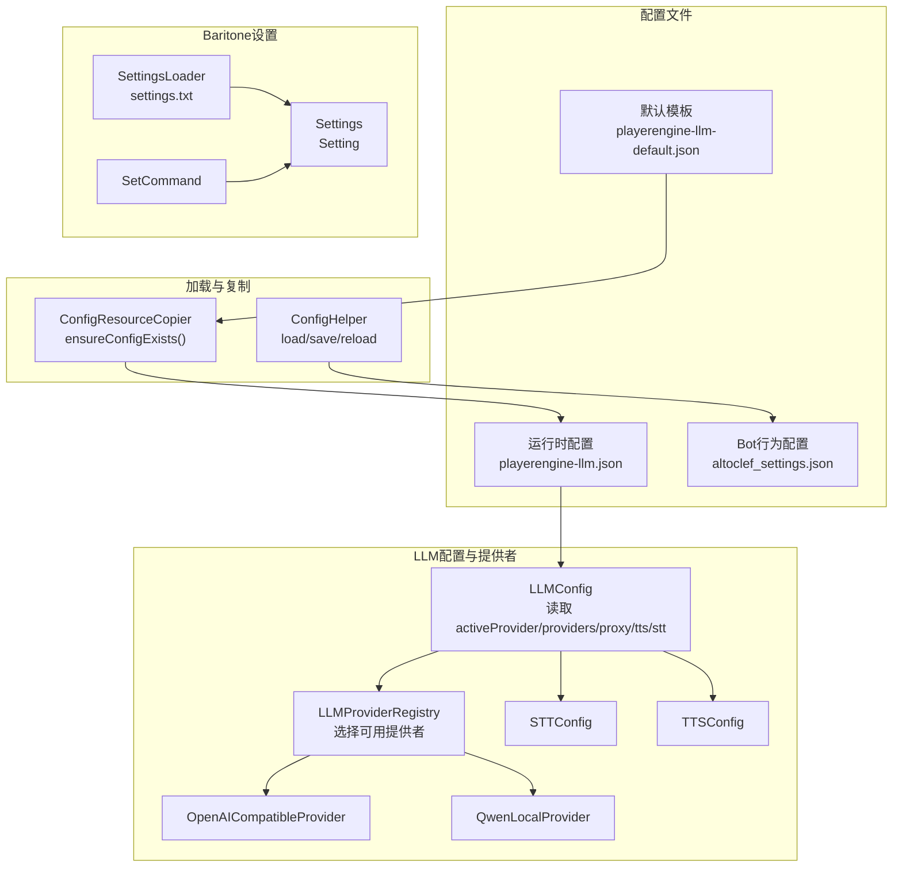
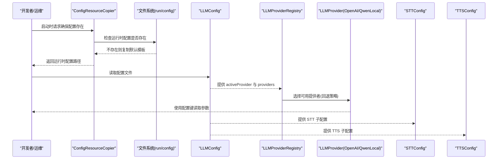
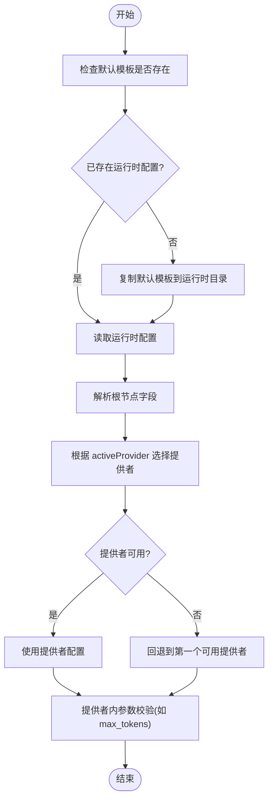
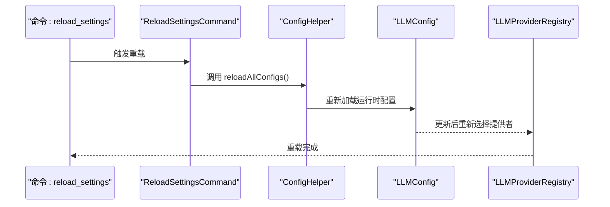
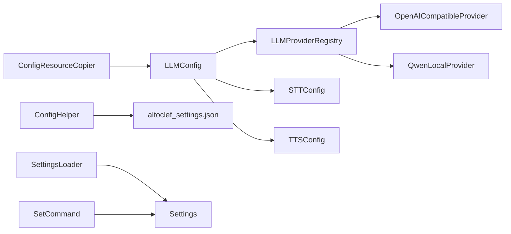

# 配置管理

<cite>
**本文引用的文件**
- [playerengine-llm-default.json](file://src/main/resources/playerengine-llm-default.json)
- [playerengine-llm.json](file://run/config/playerengine-llm.json)
- [altoclef_settings.json](file://run/altoclef/altoclef_settings.json)
- [LLMConfig.java](file://src/main/java/adris/altoclef/player2api/llm/LLMConfig.java)
- [ConfigResourceCopier.java](file://src/main/java/adris/altoclef/player2api/utils/ConfigResourceCopier.java)
- [LLMProviderRegistry.java](file://src/main/java/adris/altoclef/player2api/llm/LLMProviderRegistry.java)
- [OpenAICompatibleProvider.java](file://src/main/java/adris/altoclef/player2api/llm/impl/OpenAICompatibleProvider.java)
- [QwenLocalProvider.java](file://src/main/java/adris/altoclef/player2api/llm/impl/QwenLocalProvider.java)
- [STTConfig.java](file://src/main/java/adris/altoclef/player2api/stt/STTConfig.java)
- [TTSConfig.java](file://src/main/java/adris/altoclef/player2api/tts/TTSConfig.java)
- [ConfigHelper.java](file://src/main/java/adris/altoclef/util/helpers/ConfigHelper.java)
- [ReloadSettingsCommand.java](file://src/main/java/adris/altoclef/commands/ReloadSettingsCommand.java)
- [SettingsLoader.java](file://src/main/java/baritone/utils/SettingsLoader.java)
- [Settings.java](file://src/main/java/baritone/api/Settings.java)
- [SetCommand.java](file://src/main/java/baritone/command/defaults/SetCommand.java)
- [README.md](file://README.md)
</cite>

## 目录
1. [简介](#简介)
2. [项目结构](#项目结构)
3. [核心组件](#核心组件)
4. [架构总览](#架构总览)
5. [详细组件分析](#详细组件分析)
6. [依赖关系分析](#依赖关系分析)
7. [性能考量](#性能考量)
8. [故障排除指南](#故障排除指南)
9. [结论](#结论)
10. [附录](#附录)

## 简介
本文件面向配置管理系统，围绕以下目标展开：
- 深入解析 LLM 配置文件 playerengine-llm.json 的结构与参数含义，并给出调优建议与最佳实践
- 解释 Bot 行为配置 altoclef_settings.json 的关键调优项与适用场景
- 说明配置文件的加载机制、参数验证与动态更新方式
- 提供配置扩展方法、自定义配置项与配置优先级管理策略
- 给出配置优化建议、性能调优与常见问题排查指引（包括 API Key 设置、网络代理、行为参数等）

## 项目结构
配置相关的核心文件与模块分布如下：
- LLM 配置文件：默认模板与运行时配置
  - 默认模板：src/main/resources/playerengine-llm-default.json
  - 运行时配置：run/config/playerengine-llm.json
- Bot 行为配置：run/altoclef/altoclef_settings.json
- 配置加载与复制工具：ConfigResourceCopier、ConfigHelper
- LLM 配置读取与提供者注册：LLMConfig、LLMProviderRegistry、OpenAICompatibleProvider、QwenLocalProvider
- STT/TTS 配置：STTConfig、TTSConfig
- Baritone 设置持久化与命令：SettingsLoader、Settings、SetCommand
- 动态重载命令：ReloadSettingsCommand

**图表来源**
- [playerengine-llm-default.json:1-89](file://src/main/resources/playerengine-llm-default.json#L1-L89)
- [playerengine-llm.json:1-89](file://run/config/playerengine-llm.json#L1-L89)
- [altoclef_settings.json:1-48](file://run/altoclef/altoclef_settings.json#L1-L48)
- [ConfigResourceCopier.java:29-57](file://src/main/java/adris/altoclef/player2api/utils/ConfigResourceCopier.java#L29-L57)
- [LLMConfig.java:54-103](file://src/main/java/adris/altoclef/player2api/llm/LLMConfig.java#L54-L103)
- [LLMProviderRegistry.java:49-79](file://src/main/java/adris/altoclef/player2api/llm/LLMProviderRegistry.java#L49-L79)
- [OpenAICompatibleProvider.java:42-71](file://src/main/java/adris/altoclef/player2api/llm/impl/OpenAICompatibleProvider.java#L42-L71)
- [QwenLocalProvider.java:12-22](file://src/main/java/adris/altoclef/player2api/llm/impl/QwenLocalProvider.java#L12-L22)
- [STTConfig.java:61-77](file://src/main/java/adris/altoclef/player2api/stt/STTConfig.java#L61-L77)
- [TTSConfig.java:43-49](file://src/main/java/adris/altoclef/player2api/tts/TTSConfig.java#L43-L49)
- [SettingsLoader.java:18-60](file://src/main/java/baritone/utils/SettingsLoader.java#L18-L60)
- [Settings.java:273-307](file://src/main/java/baritone/api/Settings.java#L273-L307)
- [SetCommand.java:34-253](file://src/main/java/baritone/command/defaults/SetCommand.java#L34-L253)
- [ConfigHelper.java:42-99](file://src/main/java/adris/altoclef/util/helpers/ConfigHelper.java#L42-L99)

**章节来源**
- [playerengine-llm-default.json:1-89](file://src/main/resources/playerengine-llm-default.json#L1-L89)
- [playerengine-llm.json:1-89](file://run/config/playerengine-llm.json#L1-L89)
- [altoclef_settings.json:1-48](file://run/altoclef/altoclef_settings.json#L1-L48)
- [ConfigResourceCopier.java:29-57](file://src/main/java/adris/altoclef/player2api/utils/ConfigResourceCopier.java#L29-L57)
- [LLMConfig.java:54-103](file://src/main/java/adris/altoclef/player2api/llm/LLMConfig.java#L54-L103)
- [LLMProviderRegistry.java:49-79](file://src/main/java/adris/altoclef/player2api/llm/LLMProviderRegistry.java#L49-L79)
- [OpenAICompatibleProvider.java:42-71](file://src/main/java/adris/altoclef/player2api/llm/impl/OpenAICompatibleProvider.java#L42-L71)
- [QwenLocalProvider.java:12-22](file://src/main/java/adris/altoclef/player2api/llm/impl/QwenLocalProvider.java#L12-L22)
- [STTConfig.java:61-77](file://src/main/java/adris/altoclef/player2api/stt/STTConfig.java#L61-L77)
- [TTSConfig.java:43-49](file://src/main/java/adris/altoclef/player2api/tts/TTSConfig.java#L43-L49)
- [SettingsLoader.java:18-60](file://src/main/java/baritone/utils/SettingsLoader.java#L18-L60)
- [Settings.java:273-307](file://src/main/java/baritone/api/Settings.java#L273-L307)
- [SetCommand.java:34-253](file://src/main/java/baritone/command/defaults/SetCommand.java#L34-L253)
- [ConfigHelper.java:42-99](file://src/main/java/adris/altoclef/util/helpers/ConfigHelper.java#L42-L99)

## 核心组件
- LLM 配置读取器：负责从运行时配置文件加载 activeProvider、providers、proxy、tts、stt 等字段，并提供查询接口
- 提供者注册表：根据配置选择当前活跃提供者，若配置不可用则回退到第一个可用提供者
- 提供者实现：OpenAI 兼容提供者与本地 Qwen 提供者，均从 LLMConfig 读取对应配置键
- STT/TTS 配置：从 LLMConfig 获取 TTS/STT 子配置，并支持从 qwen 提供者或当前活跃提供者继承 API Key
- 配置复制与加载：确保默认模板复制到运行时目录；提供通用 JSON 配置加载/保存/重载能力
- Baritone 设置持久化：settings.txt 文件记录修改过的设置，支持命令查看/修改/保存

**章节来源**
- [LLMConfig.java:54-103](file://src/main/java/adris/altoclef/player2api/llm/LLMConfig.java#L54-L103)
- [LLMProviderRegistry.java:49-79](file://src/main/java/adris/altoclef/player2api/llm/LLMProviderRegistry.java#L49-L79)
- [OpenAICompatibleProvider.java:42-71](file://src/main/java/adris/altoclef/player2api/llm/impl/OpenAICompatibleProvider.java#L42-L71)
- [QwenLocalProvider.java:12-22](file://src/main/java/adris/altoclef/player2api/llm/impl/QwenLocalProvider.java#L12-L22)
- [STTConfig.java:61-77](file://src/main/java/adris/altoclef/player2api/stt/STTConfig.java#L61-L77)
- [TTSConfig.java:43-49](file://src/main/java/adris/altoclef/player2api/tts/TTSConfig.java#L43-L49)
- [ConfigResourceCopier.java:29-57](file://src/main/java/adris/altoclef/player2api/utils/ConfigResourceCopier.java#L29-L57)
- [ConfigHelper.java:42-99](file://src/main/java/adris/altoclef/util/helpers/ConfigHelper.java#L42-L99)
- [SettingsLoader.java:18-60](file://src/main/java/baritone/utils/SettingsLoader.java#L18-L60)

## 架构总览
配置系统由“模板复制—运行时加载—动态选择—持久化/命令行管理”构成闭环。

**图表来源**
- [ConfigResourceCopier.java:29-57](file://src/main/java/adris/altoclef/player2api/utils/ConfigResourceCopier.java#L29-L57)
- [LLMConfig.java:54-103](file://src/main/java/adris/altoclef/player2api/llm/LLMConfig.java#L54-L103)
- [LLMProviderRegistry.java:49-79](file://src/main/java/adris/altoclef/player2api/llm/LLMProviderRegistry.java#L49-L79)
- [OpenAICompatibleProvider.java:42-71](file://src/main/java/adris/altoclef/player2api/llm/impl/OpenAICompatibleProvider.java#L42-L71)
- [QwenLocalProvider.java:12-22](file://src/main/java/adris/altoclef/player2api/llm/impl/QwenLocalProvider.java#L12-L22)
- [STTConfig.java:61-77](file://src/main/java/adris/altoclef/player2api/stt/STTConfig.java#L61-L77)
- [TTSConfig.java:43-49](file://src/main/java/adris/altoclef/player2api/tts/TTSConfig.java#L43-L49)

## 详细组件分析

### LLM 配置文件 playerengine-llm.json 结构与参数说明
- 文件定位与加载
  - 默认模板位于 src/main/resources/playerengine-llm-default.json
  - 运行时配置位于 run/config/playerengine-llm.json
  - 首次运行时通过 ConfigResourceCopier 将默认模板复制到运行时目录
- 关键字段
  - activeProvider：当前激活的 LLM 提供者标识
  - providers：提供者集合，包含 qwen_local、qwen、openai、player2-remote 等
  - proxy：HTTP 代理设置（仅在需要访问海外服务时使用）
  - tts：TTS 语音合成配置（可复用 qwen 的 API Key）
  - stt：STT 语音识别配置
  - progressVoice：任务进度语音播报间隔范围
- 参数校验与默认值
  - LLMConfig 读取后直接存入 JsonObject，不做严格类型校验
  - 具体提供者实现会在必要时对数值范围进行约束（如 max_tokens 的边界）
- 动态更新
  - LLMConfig 提供 reload 方法重新加载磁盘配置
  - 通过命令触发全局配置重载（见“动态更新”）

**章节来源**
- [playerengine-llm-default.json:1-89](file://src/main/resources/playerengine-llm-default.json#L1-L89)
- [playerengine-llm.json:1-89](file://run/config/playerengine-llm.json#L1-L89)
- [ConfigResourceCopier.java:29-57](file://src/main/java/adris/altoclef/player2api/utils/ConfigResourceCopier.java#L29-L57)
- [LLMConfig.java:54-103](file://src/main/java/adris/altoclef/player2api/llm/LLMConfig.java#L54-L103)
- [OpenAICompatibleProvider.java:42-71](file://src/main/java/adris/altoclef/player2api/llm/impl/OpenAICompatibleProvider.java#L42-L71)

### Bot 行为配置 altoclef_settings.json 的调优选项
- 文件位置与生成
  - 开发模式下位于 run/altoclef/altoclef_settings.json
  - 首次启动自动生成
- 关键调优项（节选）
  - 命令与日志：commandPrefix、logLevel、chatLogPrefix
  - 自动行为：autoEat、autoMLGBucket、autoReconnect、autoRespawn
  - 资源与物品：resourcePickupDropRange、resourcePickupRange、throwAwayUnusedItems、importantItems、throwawayItems
  - 地图与区域：homeBasePosition、areasToProtect
  - 移动与探索：resourceMineRange、resourceChestLocateRange、netherFastTravelWalkingRange
  - 战斗与生存：mobDefense、dodgeProjectiles、avoidDrowning、extinguishSelfWithWater
  - 其他：entityReachRange、replantCrops、useCraftingBookToCraft、limitFuelsToSupportedFuels 等
- 最佳实践
  - 在多人或复杂地图环境下，建议开启 mobDefense、dodgeProjectiles、avoidDrowning
  - 物品策略应结合服务器规则与资源稀缺性调整 importantItems 与 throwawayItems
  - homeBasePosition 与 areasToProtect 应配合实际玩法区域设定

**章节来源**
- [altoclef_settings.json:1-48](file://run/altoclef/altoclef_settings.json#L1-L48)
- [README.md:224-244](file://README.md#L224-L244)

### 配置加载机制与参数验证
- 默认模板复制
  - ConfigResourceCopier.ensureConfigExists 在运行时目录不存在时复制默认模板
- LLM 配置读取
  - LLMConfig 从运行时配置文件读取根节点字段，分别存储到内部 JsonObject
  - 不做深层类型校验，具体参数有效性由提供者实现处理
- 参数验证与回退
  - LLMProviderRegistry 在找不到可用提供者时，回退到第一个可用提供者
  - OpenAICompatibleProvider 对 max_tokens 进行边界约束
- 参数继承
  - STTConfig 在未显式提供 API Key 时，尝试从 qwen 提供者或当前活跃提供者继承

**图表来源**
- [ConfigResourceCopier.java:29-57](file://src/main/java/adris/altoclef/player2api/utils/ConfigResourceCopier.java#L29-L57)
- [LLMConfig.java:54-103](file://src/main/java/adris/altoclef/player2api/llm/LLMConfig.java#L54-L103)
- [LLMProviderRegistry.java:49-79](file://src/main/java/adris/altoclef/player2api/llm/LLMProviderRegistry.java#L49-L79)
- [OpenAICompatibleProvider.java:42-71](file://src/main/java/adris/altoclef/player2api/llm/impl/OpenAICompatibleProvider.java#L42-L71)
- [STTConfig.java:61-77](file://src/main/java/adris/altoclef/player2api/stt/STTConfig.java#L61-L77)

**章节来源**
- [ConfigResourceCopier.java:29-57](file://src/main/java/adris/altoclef/player2api/utils/ConfigResourceCopier.java#L29-L57)
- [LLMConfig.java:54-103](file://src/main/java/adris/altoclef/player2api/llm/LLMConfig.java#L54-L103)
- [LLMProviderRegistry.java:49-79](file://src/main/java/adris/altoclef/player2api/llm/LLMProviderRegistry.java#L49-L79)
- [OpenAICompatibleProvider.java:42-71](file://src/main/java/adris/altoclef/player2api/llm/impl/OpenAICompatibleProvider.java#L42-L71)
- [STTConfig.java:61-77](file://src/main/java/adris/altoclef/player2api/stt/STTConfig.java#L61-L77)

### 动态更新与重载
- LLM 配置重载
  - LLMConfig 提供 reload 方法，重新从磁盘读取配置
- 全局配置重载命令
  - ReloadSettingsCommand 调用 ConfigHelper.reloadAllConfigs，触发所有已注册配置的重载回调
- Baritone 设置持久化与命令
  - SettingsLoader 读取 settings.txt 并应用修改过的设置
  - SetCommand 支持查看/修改/重置/保存设置
- Bot 行为配置
  - altoclef_settings.json 由 ConfigHelper 管理加载/保存/重载

**图表来源**
- [ReloadSettingsCommand.java:14-18](file://src/main/java/adris/altoclef/commands/ReloadSettingsCommand.java#L14-L18)
- [ConfigHelper.java:42-99](file://src/main/java/adris/altoclef/util/helpers/ConfigHelper.java#L42-L99)
- [LLMConfig.java:49-52](file://src/main/java/adris/altoclef/player2api/llm/LLMConfig.java#L49-L52)
- [LLMProviderRegistry.java:49-79](file://src/main/java/adris/altoclef/player2api/llm/LLMProviderRegistry.java#L49-L79)

**章节来源**
- [ReloadSettingsCommand.java:14-18](file://src/main/java/adris/altoclef/commands/ReloadSettingsCommand.java#L14-L18)
- [ConfigHelper.java:42-99](file://src/main/java/adris/altoclef/util/helpers/ConfigHelper.java#L42-L99)
- [LLMConfig.java:49-52](file://src/main/java/adris/altoclef/player2api/llm/LLMConfig.java#L49-L52)
- [LLMProviderRegistry.java:49-79](file://src/main/java/adris/altoclef/player2api/llm/LLMProviderRegistry.java#L49-L79)

### 扩展方式、自定义配置项与优先级管理
- 扩展新的 LLM 提供者
  - 新建实现类，继承 OpenAICompatibleProvider 或实现 LLMProvider 接口
  - 在 LLMProviderRegistry 中注册，确保 getActiveProvider 能正确选择
- 自定义配置项
  - 在 LLMConfig 中新增字段读取逻辑，并在具体提供者中消费
  - 对于非 LLM 配置（如 Bot 行为），可在 ConfigHelper 中增加 load/save/reload 流程
- 配置优先级
  - 运行时配置优先于默认模板
  - LLM 提供者选择优先使用 activeProvider，不可用时回退到第一个可用提供者
  - STT/TTS 若未显式提供 API Key，则从 qwen 或当前活跃提供者继承

**章节来源**
- [LLMProviderRegistry.java:49-79](file://src/main/java/adris/altoclef/player2api/llm/LLMProviderRegistry.java#L49-L79)
- [OpenAICompatibleProvider.java:42-71](file://src/main/java/adris/altoclef/player2api/llm/impl/OpenAICompatibleProvider.java#L42-L71)
- [QwenLocalProvider.java:12-22](file://src/main/java/adris/altoclef/player2api/llm/impl/QwenLocalProvider.java#L12-L22)
- [STTConfig.java:61-77](file://src/main/java/adris/altoclef/player2api/stt/STTConfig.java#L61-L77)
- [ConfigHelper.java:42-99](file://src/main/java/adris/altoclef/util/helpers/ConfigHelper.java#L42-L99)

## 依赖关系分析
- LLM 配置依赖链
  - ConfigResourceCopier → LLMConfig → LLMProviderRegistry → OpenAICompatibleProvider/QwenLocalProvider
  - LLMConfig → STTConfig/TTSConfig（间接依赖）
- Bot 行为配置依赖链
  - ConfigHelper → altoclef_settings.json（文件）
- Baritone 设置依赖链
  - SettingsLoader → Settings → SetCommand

**图表来源**
- [ConfigResourceCopier.java:29-57](file://src/main/java/adris/altoclef/player2api/utils/ConfigResourceCopier.java#L29-L57)
- [LLMConfig.java:54-103](file://src/main/java/adris/altoclef/player2api/llm/LLMConfig.java#L54-L103)
- [LLMProviderRegistry.java:49-79](file://src/main/java/adris/altoclef/player2api/llm/LLMProviderRegistry.java#L49-L79)
- [OpenAICompatibleProvider.java:42-71](file://src/main/java/adris/altoclef/player2api/llm/impl/OpenAICompatibleProvider.java#L42-L71)
- [QwenLocalProvider.java:12-22](file://src/main/java/adris/altoclef/player2api/llm/impl/QwenLocalProvider.java#L12-L22)
- [STTConfig.java:61-77](file://src/main/java/adris/altoclef/player2api/stt/STTConfig.java#L61-L77)
- [TTSConfig.java:43-49](file://src/main/java/adris/altoclef/player2api/tts/TTSConfig.java#L43-L49)
- [ConfigHelper.java:42-99](file://src/main/java/adris/altoclef/util/helpers/ConfigHelper.java#L42-L99)
- [SettingsLoader.java:18-60](file://src/main/java/baritone/utils/SettingsLoader.java#L18-L60)
- [Settings.java:273-307](file://src/main/java/baritone/api/Settings.java#L273-L307)
- [SetCommand.java:34-253](file://src/main/java/baritone/command/defaults/SetCommand.java#L34-L253)

**章节来源**
- [LLMConfig.java:54-103](file://src/main/java/adris/altoclef/player2api/llm/LLMConfig.java#L54-L103)
- [LLMProviderRegistry.java:49-79](file://src/main/java/adris/altoclef/player2api/llm/LLMProviderRegistry.java#L49-L79)
- [OpenAICompatibleProvider.java:42-71](file://src/main/java/adris/altoclef/player2api/llm/impl/OpenAICompatibleProvider.java#L42-L71)
- [QwenLocalProvider.java:12-22](file://src/main/java/adris/altoclef/player2api/llm/impl/QwenLocalProvider.java#L12-L22)
- [STTConfig.java:61-77](file://src/main/java/adris/altoclef/player2api/stt/STTConfig.java#L61-L77)
- [TTSConfig.java:43-49](file://src/main/java/adris/altoclef/player2api/tts/TTSConfig.java#L43-L49)
- [ConfigHelper.java:42-99](file://src/main/java/adris/altoclef/util/helpers/ConfigHelper.java#L42-L99)
- [SettingsLoader.java:18-60](file://src/main/java/baritone/utils/SettingsLoader.java#L18-L60)
- [Settings.java:273-307](file://src/main/java/baritone/api/Settings.java#L273-L307)
- [SetCommand.java:34-253](file://src/main/java/baritone/command/defaults/SetCommand.java#L34-L253)

## 性能考量
- LLM 请求参数
  - maxTokens：过大将增加响应时间与成本，过小可能导致内容截断；建议结合任务复杂度与上下文长度权衡
  - temperature：越高越随机，越低越稳定；一般在 0.3~0.7 之间取得较好平衡
- 代理与网络
  - 仅在访问海外服务时启用代理，避免不必要的网络开销
- STT/TTS
  - 语音模型与采样率影响延迟与质量；在低性能设备上可适当降低采样率或关闭高级模型
- Bot 行为
  - 资源扫描范围与拾取距离过大将增加 CPU/GC 压力；按地图规模与资源密度调整

[本节为通用指导，不直接分析具体文件]

## 故障排除指南
- API Key 设置
  - 确认 activeProvider 对应的 providers.<id>.apiKey 已填写
  - 若使用 STT/TTS，确认其 API Key 来源（qwen 或当前活跃提供者）
- 网络代理
  - 仅在访问海外服务时启用 proxy.enabled，并正确设置 host/port
- 提供者不可用
  - 检查 activeProvider 是否被禁用或网络异常
  - 查看日志中“回退到提供者”的提示，确认是否成功切换
- 配置未生效
  - 修改运行时配置后，执行 reload_settings 命令触发重载
  - 确认 run/config/playerengine-llm.json 已更新
- Baritone 设置
  - 使用 set list/modified/reset/save 等命令管理设置
  - settings.txt 仅记录修改过的设置，首次运行可能为空

**章节来源**
- [STTConfig.java:61-77](file://src/main/java/adris/altoclef/player2api/stt/STTConfig.java#L61-L77)
- [LLMProviderRegistry.java:49-79](file://src/main/java/adris/altoclef/player2api/llm/LLMProviderRegistry.java#L49-L79)
- [ReloadSettingsCommand.java:14-18](file://src/main/java/adris/altoclef/commands/ReloadSettingsCommand.java#L14-L18)
- [SettingsLoader.java:18-60](file://src/main/java/baritone/utils/SettingsLoader.java#L18-L60)
- [SetCommand.java:34-253](file://src/main/java/baritone/command/defaults/SetCommand.java#L34-L253)

## 结论
本配置系统以“默认模板复制 + 运行时配置读取 + 提供者选择回退 + 动态重载”为核心设计，兼顾易用性与可扩展性。通过合理设置 LLM 参数、代理与 Bot 行为，可在不同网络与场景下获得稳定且高性能的体验。建议在生产环境中：
- 明确 API Key 来源与权限范围
- 控制 maxTokens 与 temperature 的取值区间
- 合理配置代理与网络访问策略
- 使用命令行与重载机制及时生效变更

[本节为总结性内容，不直接分析具体文件]

## 附录
- 配置文件示例路径
  - LLM 默认模板：[playerengine-llm-default.json:1-89](file://src/main/resources/playerengine-llm-default.json#L1-L89)
  - LLM 运行时配置：[playerengine-llm.json:1-89](file://run/config/playerengine-llm.json#L1-L89)
  - Bot 行为配置：[altoclef_settings.json:1-48](file://run/altoclef/altoclef_settings.json#L1-L48)
- 关键类与方法参考
  - LLM 配置读取：[LLMConfig.java:54-103](file://src/main/java/adris/altoclef/player2api/llm/LLMConfig.java#L54-L103)
  - 提供者注册与回退：[LLMProviderRegistry.java:49-79](file://src/main/java/adris/altoclef/player2api/llm/LLMProviderRegistry.java#L49-L79)
  - OpenAI 兼容提供者：[OpenAICompatibleProvider.java:42-71](file://src/main/java/adris/altoclef/player2api/llm/impl/OpenAICompatibleProvider.java#L42-L71)
  - 本地 Qwen 提供者：[QwenLocalProvider.java:12-22](file://src/main/java/adris/altoclef/player2api/llm/impl/QwenLocalProvider.java#L12-L22)
  - STT 配置（API Key 继承）：[STTConfig.java:61-77](file://src/main/java/adris/altoclef/player2api/stt/STTConfig.java#L61-L77)
  - TTS 配置：[TTSConfig.java:43-49](file://src/main/java/adris/altoclef/player2api/tts/TTSConfig.java#L43-L49)
  - 配置复制工具：[ConfigResourceCopier.java:29-57](file://src/main/java/adris/altoclef/player2api/utils/ConfigResourceCopier.java#L29-L57)
  - 通用配置加载/保存/重载：[ConfigHelper.java:42-99](file://src/main/java/adris/altoclef/util/helpers/ConfigHelper.java#L42-L99)
  - Baritone 设置持久化与命令：[SettingsLoader.java:18-60](file://src/main/java/baritone/utils/SettingsLoader.java#L18-L60)、[Settings.java:273-307](file://src/main/java/baritone/api/Settings.java#L273-L307)、[SetCommand.java:34-253](file://src/main/java/baritone/command/defaults/SetCommand.java#L34-L253)
  - 动态重载命令：[ReloadSettingsCommand.java:14-18](file://src/main/java/adris/altoclef/commands/ReloadSettingsCommand.java#L14-L18)