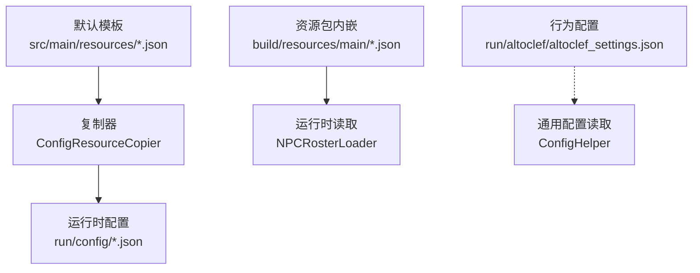
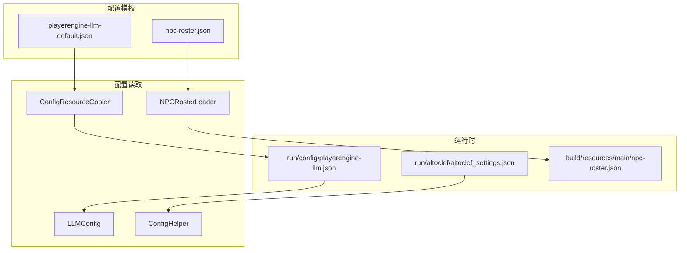
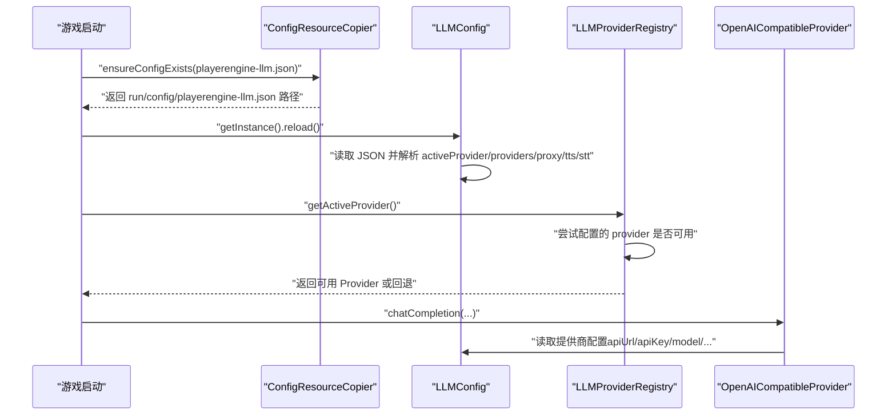

# 配置管理

<cite>
**本文引用的文件**
- [playerengine-llm-default.json](file://src/main/resources/playerengine-llm-default.json)
- [playerengine-llm.json](file://run/config/playerengine-llm.json)
- [altoclef_settings.json](file://run/altoclef/altoclef_settings.json)
- [npc-roster.json](file://src/main/resources/npc-roster.json)
- [npc-roster.json](file://build/resources/main/npc-roster.json)
- [LLMConfig.java](file://src/main/java/adris/altoclef/player2api/llm/LLMConfig.java)
- [LLMProviderRegistry.java](file://src/main/java/adris/altoclef/player2api/llm/LLMProviderRegistry.java)
- [OpenAICompatibleProvider.java](file://src/main/java/adris/altoclef/player2api/llm/impl/OpenAICompatibleProvider.java)
- [STTConfig.java](file://src/main/java/adris/altoclef/player2api/stt/STTConfig.java)
- [ConfigResourceCopier.java](file://src/main/java/adris/altoclef/player2api/utils/ConfigResourceCopier.java)
- [ConfigHelper.java](file://src/main/java/adris/altoclef/util/helpers/ConfigHelper.java)
- [NPCRosterLoader.java](file://src/main/java/adris/altoclef/player2api/NPCRosterLoader.java)
</cite>

## 目录
1. [简介](#简介)
2. [项目结构](#项目结构)
3. [核心组件](#核心组件)
4. [架构总览](#架构总览)
5. [详细组件分析](#详细组件分析)
6. [依赖关系分析](#依赖关系分析)
7. [性能考量](#性能考量)
8. [故障排查指南](#故障排查指南)
9. [结论](#结论)
10. [附录](#附录)

## 简介
本文件面向配置管理系统，系统性阐述以下关键配置文件的层次结构与作用范围，并深入解析配置加载、校验与热更新机制，涵盖：
- playerengine-llm.json：大模型（LLM）、语音合成（TTS）、语音识别（STT）一体化配置
- altoclef_settings.json：行为与资源管理等通用 AI 行为配置
- npc-roster.json：NPC 角色与人格模板配置

同时给出参数说明、取值范围、调优建议、示例场景、备份迁移策略与常见问题排查方法。

## 项目结构
配置相关文件分布于资源目录与运行时配置目录：
- 默认模板：src/main/resources 下的 playerengine-llm-default.json、npc-roster.json
- 运行时配置：run/config/playerengine-llm.json、run/altoclef/altoclef_settings.json
- 资源包内嵌：build/resources/main/npc-roster.json（打包后）



图表来源
- [ConfigResourceCopier.java:29-37](file://src/main/java/adris/altoclef/player2api/utils/ConfigResourceCopier.java#L29-L37)
- [playerengine-llm-default.json:1-89](file://src/main/resources/playerengine-llm-default.json#L1-L89)
- [npc-roster.json:1-54](file://src/main/resources/npc-roster.json#L1-L54)
- [npc-roster.json:1-54](file://build/resources/main/npc-roster.json#L1-L54)
- [altoclef_settings.json:1-48](file://run/altoclef/altoclef_settings.json#L1-L48)
- [ConfigHelper.java:37-46](file://src/main/java/adris/altoclef/util/helpers/ConfigHelper.java#L37-L46)

章节来源
- [playerengine-llm-default.json:1-89](file://src/main/resources/playerengine-llm-default.json#L1-L89)
- [altoclef_settings.json:1-48](file://run/altoclef/altoclef_settings.json#L1-L48)
- [npc-roster.json:1-54](file://src/main/resources/npc-roster.json#L1-L54)
- [ConfigResourceCopier.java:29-37](file://src/main/java/adris/altoclef/player2api/utils/ConfigResourceCopier.java#L29-L37)
- [ConfigHelper.java:37-46](file://src/main/java/adris/altoclef/util/helpers/ConfigHelper.java#L37-L46)

## 核心组件
- LLMConfig：负责加载并暴露 playerengine-llm.json 的配置项，支持热重载与默认模板复制
- LLMProviderRegistry：注册并选择可用的 LLM 提供商，支持回退策略
- OpenAICompatibleProvider：通用 OpenAI 兼容接口实现，适配多种后端（含本地 Ollama）
- STTConfig：封装 STT 配置与 API Key 解析逻辑（优先使用 LLM 配置）
- NPCRosterLoader：从资源包读取 npc-roster.json，构建 NPC 人格映射
- ConfigResourceCopier：确保运行时配置目录存在并复制默认模板
- ConfigHelper：通用配置读取/保存/热重载框架（支持序列化自定义类型）

章节来源
- [LLMConfig.java:19-89](file://src/main/java/adris/altoclef/player2api/llm/LLMConfig.java#L19-L89)
- [LLMProviderRegistry.java:16-79](file://src/main/java/adris/altoclef/player2api/llm/LLMProviderRegistry.java#L16-L79)
- [OpenAICompatibleProvider.java:24-141](file://src/main/java/adris/altoclef/player2api/llm/impl/OpenAICompatibleProvider.java#L24-L141)
- [STTConfig.java:61-77](file://src/main/java/adris/altoclef/player2api/stt/STTConfig.java#L61-L77)
- [NPCRosterLoader.java:18-85](file://src/main/java/adris/altoclef/player2api/NPCRosterLoader.java#L18-L85)
- [ConfigResourceCopier.java:29-57](file://src/main/java/adris/altoclef/player2api/utils/ConfigResourceCopier.java#L29-L57)
- [ConfigHelper.java:48-99](file://src/main/java/adris/altoclef/util/helpers/ConfigHelper.java#L48-L99)

## 架构总览
配置系统采用“默认模板 + 运行时配置”的双层结构，通过复制器保证首次运行时生成用户可编辑的配置；LLM 子系统通过配置中心统一读取提供商参数，并在运行时动态选择可用提供程序。



图表来源
- [ConfigResourceCopier.java:29-37](file://src/main/java/adris/altoclef/player2api/utils/ConfigResourceCopier.java#L29-L37)
- [LLMConfig.java:37-39](file://src/main/java/adris/altoclef/player2api/llm/LLMConfig.java#L37-L39)
- [NPCRosterLoader.java:21-33](file://src/main/java/adris/altoclef/player2api/NPCRosterLoader.java#L21-L33)
- [ConfigHelper.java:37-46](file://src/main/java/adris/altoclef/util/helpers/ConfigHelper.java#L37-L46)

## 详细组件分析

### playerengine-llm.json 配置层次与作用范围
- 层次结构
  - activeProvider：当前激活的 LLM 提供商标识
  - providers：多提供商配置集合，包含 qwen_local、qwen、openai、player2-remote 等
  - proxy：HTTP 代理设置（国内访问海外服务时使用）
  - tts：TTS 语音合成配置（音色、速率、音高等）
  - stt：STT 语音识别配置（模型、语言等）
  - progressVoice：任务进度语音播报间隔
- 参数要点
  - providers.*.enabled：控制提供商是否启用
  - providers.*.apiUrl/apiKey/model/maxTokens/temperature：各提供商的接入参数
  - proxy.enabled/host/port：代理开关与地址
  - tts.*：音色、音量、语速、音调等
  - stt.*：识别模型与语言
  - progressVoice.*：播报间隔范围
- 取值范围与约束
  - maxTokens：建议不低于 256，避免截断 JSON 响应
  - speechRate/pitchRate：数值可大于 1 或小于 1，受情绪系统覆盖
  - intervalMin/Max：毫秒级，建议 3000~5000 作为默认区间
- 示例场景
  - 本地优先：启用 qwen_local 并设置 apiUrl 为本地 Ollama 地址
  - 国内稳定：启用 qwen 并填入有效 API Key
  - 海外网络：启用 openai 并配置代理 host/port
- 热更新机制
  - LLMConfig 支持 reload 重新读取磁盘配置
  - LLMProviderRegistry 在下一次请求时根据 activeProvider 选择可用提供者
  - OpenAICompatibleProvider 从 LLMConfig 获取实时配置

章节来源
- [playerengine-llm-default.json:6-43](file://src/main/resources/playerengine-llm-default.json#L6-L43)
- [playerengine-llm-default.json:45-87](file://src/main/resources/playerengine-llm-default.json#L45-L87)
- [LLMConfig.java:54-89](file://src/main/java/adris/altoclef/player2api/llm/LLMConfig.java#L54-L89)
- [LLMProviderRegistry.java:49-70](file://src/main/java/adris/altoclef/player2api/llm/LLMProviderRegistry.java#L49-L70)
- [OpenAICompatibleProvider.java:51-70](file://src/main/java/adris/altoclef/player2api/llm/impl/OpenAICompatibleProvider.java#L51-L70)

### altoclef_settings.json 行为配置
- 作用范围
  - 控制 AI 行为日志级别、命令前缀、聊天前缀、计时器显示等
  - 资源采集范围、容器搜索范围、食物阈值、自动行为开关等
  - 物品保留策略、燃料支持列表、家基地坐标、保护区域等
- 关键参数
  - showDebugTickMs/showTaskChains/logLevel：调试与可视化
  - commandPrefix/chatLogPrefix：命令与日志前缀
  - resourcePickupDropRange/resourceChestLocateRange/resourceMineRange：资源范围
  - autoEat/autoMLGBucket/autoRespawn：自动化行为
  - throwawayItems/reservedBuildingBlockCount/importantItems：丢弃与保留策略
  - homeBasePosition/areasToProtect：基地与保护区域
- 调优建议
  - 在大型地图或高负载服务器中适当缩小 resourceMineRange 以减少寻路压力
  - 合理设置 minimumFoodAllowed 与 foodUnitsToCollect，避免饥饿导致行为中断
  - 根据服务器特性调整 supportedFuels 与 limitFuelsToSupportedFuels

章节来源
- [altoclef_settings.json:1-48](file://run/altoclef/altoclef_settings.json#L1-L48)

### npc-roster.json NPC 角色配置
- 结构与字段
  - roster：角色数组
  - 每个角色包含 id/name/persona/initialEmotions/description
  - persona：五大人格维度（开放性、尽责性、外向性、宜人性、神经质）
  - initialEmotions：初始情感状态（如信任、预期、喜悦等）
- 用途
  - 作为 NPC 的人格锚点，驱动对话与行为倾向
  - 未在运行时配置中直接修改，通常通过资源包内嵌
- 加载流程
  - NPCRosterLoader 从资源流读取 JSON，构建 id 到 PersonaAnchor 的映射
  - 若缺失 id 将被跳过并记录警告

章节来源
- [npc-roster.json:1-54](file://src/main/resources/npc-roster.json#L1-L54)
- [npc-roster.json:1-54](file://build/resources/main/npc-roster.json#L1-L54)
- [NPCRosterLoader.java:27-58](file://src/main/java/adris/altoclef/player2api/NPCRosterLoader.java#L27-L58)

### 配置加载与验证机制
- 默认模板复制
  - ConfigResourceCopier 确保 run/config/ 下存在运行时配置；若无则从 classpath 复制默认模板
- LLM 配置加载
  - LLMConfig 读取 run/config/playerengine-llm.json，解析 activeProvider、providers、proxy、tts、stt
  - 对 providers.maxTokens 进行边界提示（过小可能导致响应截断）
- 通用配置框架
  - ConfigHelper 提供统一的 load/save/reload 能力，支持复杂类型序列化/反序列化
  - 支持列表型配置文件（带注释行）的读取与写入
- 热更新
  - ConfigHelper.reloadAllConfigs 遍历已注册的配置回调，触发 onReload
  - LLMConfig.reload 重新加载磁盘配置，LLMProviderRegistry 在下一次调用时生效



图表来源
- [ConfigResourceCopier.java:29-37](file://src/main/java/adris/altoclef/player2api/utils/ConfigResourceCopier.java#L29-L37)
- [LLMConfig.java:54-89](file://src/main/java/adris/altoclef/player2api/llm/LLMConfig.java#L54-L89)
- [LLMProviderRegistry.java:49-70](file://src/main/java/adris/altoclef/player2api/llm/LLMProviderRegistry.java#L49-L70)
- [OpenAICompatibleProvider.java:51-70](file://src/main/java/adris/altoclef/player2api/llm/impl/OpenAICompatibleProvider.java#L51-L70)

章节来源
- [ConfigResourceCopier.java:29-57](file://src/main/java/adris/altoclef/player2api/utils/ConfigResourceCopier.java#L29-L57)
- [LLMConfig.java:54-89](file://src/main/java/adris/altoclef/player2api/llm/LLMConfig.java#L54-L89)
- [ConfigHelper.java:48-99](file://src/main/java/adris/altoclef/util/helpers/ConfigHelper.java#L48-L99)
- [LLMProviderRegistry.java:49-70](file://src/main/java/adris/altoclef/player2api/llm/LLMProviderRegistry.java#L49-L70)
- [OpenAICompatibleProvider.java:51-70](file://src/main/java/adris/altoclef/player2api/llm/impl/OpenAICompatibleProvider.java#L51-L70)

### 配置参数详解与调优策略
- LLM 提供商参数
  - apiUrl：后端服务地址（本地 Ollama、云端 API 等）
  - apiKey：访问密钥（务必保密，不要提交到公开仓库）
  - model：模型名称（如 qwen-turbo、gpt-4-turbo-preview）
  - maxTokens：输出长度上限，建议不低于 256
  - temperature：采样温度，影响创造性与稳定性
- 代理设置
  - enabled：是否启用
  - host/port：代理地址与端口（国内访问海外服务时使用）
- TTS 配置
  - enabled：是否启用语音播报
  - model：CosyVoice 模型版本（如 cosyvoice-v3-flash）
  - voice：音色 ID（中文/英文等）
  - volume：音量 0~100
  - speechRate/pitchRate：语速/音调倍率（受情绪系统覆盖）
- STT 配置
  - enabled：是否启用语音输入
  - model：识别模型（如 gummy-chat-v1）
  - language：识别语言（zh/en/ja/ko/auto）
- 进度语音
  - enabled：是否启用
  - intervalMin/Max：最小/最大播报间隔（毫秒）
- 行为配置（altoclef_settings.json）
  - resourceMineRange/resourceChestLocateRange：资源搜索范围
  - autoEat/autoRespawn/autoMLGBucket：自动化行为
  - throwawayItems/importantItems：丢弃与保留策略
  - homeBasePosition/areasToProtect：基地与保护区域

章节来源
- [playerengine-llm-default.json:6-43](file://src/main/resources/playerengine-llm-default.json#L6-L43)
- [playerengine-llm-default.json:45-87](file://src/main/resources/playerengine-llm-default.json#L45-L87)
- [altoclef_settings.json:1-48](file://run/altoclef/altoclef_settings.json#L1-L48)

### 配置示例与最佳实践
- 示例一：本地优先（Ollama）
  - 启用 qwen_local，设置 apiUrl 为本地 Ollama 地址，model 为本地已拉取模型
  - 将 temperature 设为 0.7，maxTokens 设为 2000
- 示例二：国内稳定（阿里云通义）
  - 启用 qwen，填写有效的 apiKey
  - model 使用 qwen-turbo，maxTokens 2000，temperature 0.7
- 示例三：海外网络（OpenAI）
  - 启用 openai，配置代理 host/port
  - model 使用 gpt-4-turbo-preview，maxTokens 8000，temperature 0.7
- 最佳实践
  - API Key 仅存储在本地配置，不在版本库中提交
  - 调整 maxTokens 以满足复杂 JSON 输出需求
  - 合理设置 progressVoice 间隔，避免频繁打断
  - 行为配置按服务器特性微调资源范围与自动化行为

章节来源
- [playerengine-llm-default.json:6-43](file://src/main/resources/playerengine-llm-default.json#L6-L43)
- [playerengine-llm-default.json:45-87](file://src/main/resources/playerengine-llm-default.json#L45-L87)
- [altoclef_settings.json:1-48](file://run/altoclef/altoclef_settings.json#L1-L48)

### 配置备份与迁移
- 备份
  - 复制 run/config/playerengine-llm.json 与 run/altoclef/altoclef_settings.json 至安全位置
  - 记录 npc-roster.json 的自定义修改（如需）
- 迁移
  - 新版本发布后，运行时配置将由 ConfigResourceCopier 自动复制默认模板
  - 如需保留旧配置，建议在升级前手动备份 run/config/ 下的文件
- 注意事项
  - 不要将包含 API Key 的配置文件上传至公共仓库
  - 更新后可通过 LLMConfig.reload 与 ConfigHelper.reloadAllConfigs 生效

章节来源
- [ConfigResourceCopier.java:29-37](file://src/main/java/adris/altoclef/player2api/utils/ConfigResourceCopier.java#L29-L37)
- [ConfigHelper.java:42-46](file://src/main/java/adris/altoclef/util/helpers/ConfigHelper.java#L42-L46)

## 依赖关系分析
- LLMConfig 依赖 ConfigResourceCopier 获取运行时配置路径
- LLMProviderRegistry 依赖 LLMConfig 获取 activeProvider 并选择可用提供者
- OpenAICompatibleProvider 依赖 LLMConfig 获取提供商配置（apiUrl/apiKey/model/...）
- STTConfig 依赖 LLMConfig 获取 API Key（优先 qwen，否则当前 activeProvider）
- NPCRosterLoader 依赖资源包内的 npc-roster.json
- ConfigHelper 为通用配置框架，支持热重载与复杂类型序列化

```mermaid
classDiagram
class LLMConfig {
+reload()
+getActiveProvider()
+getProviderConfig(id)
+isProxyEnabled()
+getProxyHost()
+getProxyPort()
+getTTSConfig()
+getSTTConfig()
}
class LLMProviderRegistry {
+register(provider)
+getActiveProvider()
+getProvider(id)
+getAllProviders()
}
class OpenAICompatibleProvider {
+getProviderId()
+chatCompletion(messages)
}
class STTConfig {
+isEnabled()
+getApiKey()
+getModel()
+getLanguage()
}
class NPCRosterLoader {
+loadRoster()
+getPersona(id)
+getOrGenerate(name)
+getAvailableNpcIds()
}
class ConfigResourceCopier {
+ensureConfigExists(file, resource)
}
class ConfigHelper {
+loadConfig(path, getDefault, class, onReload)
+saveConfig(path, config)
+reloadAllConfigs()
}
LLMProviderRegistry --> LLMConfig : "读取 activeProvider"
OpenAICompatibleProvider --> LLMConfig : "读取提供商配置"
STTConfig --> LLMConfig : "读取 API Key"
NPCRosterLoader --> "资源包" : "读取 npc-roster.json"
LLMConfig --> ConfigResourceCopier : "获取配置路径"
ConfigHelper --> "热重载" : "遍历回调"
```

图表来源
- [LLMConfig.java:54-89](file://src/main/java/adris/altoclef/player2api/llm/LLMConfig.java#L54-L89)
- [LLMProviderRegistry.java:49-70](file://src/main/java/adris/altoclef/player2api/llm/LLMProviderRegistry.java#L49-L70)
- [OpenAICompatibleProvider.java:51-70](file://src/main/java/adris/altoclef/player2api/llm/impl/OpenAICompatibleProvider.java#L51-L70)
- [STTConfig.java:61-77](file://src/main/java/adris/altoclef/player2api/stt/STTConfig.java#L61-L77)
- [NPCRosterLoader.java:21-33](file://src/main/java/adris/altoclef/player2api/NPCRosterLoader.java#L21-L33)
- [ConfigResourceCopier.java:29-37](file://src/main/java/adris/altoclef/player2api/utils/ConfigResourceCopier.java#L29-L37)
- [ConfigHelper.java:48-99](file://src/main/java/adris/altoclef/util/helpers/ConfigHelper.java#L48-L99)

章节来源
- [LLMConfig.java:54-89](file://src/main/java/adris/altoclef/player2api/llm/LLMConfig.java#L54-L89)
- [LLMProviderRegistry.java:49-70](file://src/main/java/adris/altoclef/player2api/llm/LLMProviderRegistry.java#L49-L70)
- [OpenAICompatibleProvider.java:51-70](file://src/main/java/adris/altoclef/player2api/llm/impl/OpenAICompatibleProvider.java#L51-L70)
- [STTConfig.java:61-77](file://src/main/java/adris/altoclef/player2api/stt/STTConfig.java#L61-L77)
- [NPCRosterLoader.java:21-33](file://src/main/java/adris/altoclef/player2api/NPCRosterLoader.java#L21-L33)
- [ConfigResourceCopier.java:29-37](file://src/main/java/adris/altoclef/player2api/utils/ConfigResourceCopier.java#L29-L37)
- [ConfigHelper.java:48-99](file://src/main/java/adris/altoclef/util/helpers/ConfigHelper.java#L48-L99)

## 性能考量
- LLM
  - 合理设置 maxTokens，避免过大导致内存与超时风险
  - temperature 影响生成稳定性，过高可能增加失败重试
  - 本地 Ollama 可显著降低网络延迟，适合高频对话
- TTS/STT
  - 适当降低 volume 与 speechRate/pitchRate，减少音频处理开销
  - STT 语言与模型选择应匹配实际语音内容，提高识别准确率
- 行为配置
  - 缩小 resourceMineRange 与 resourceChestLocateRange，降低寻路与扫描压力
  - 合理配置 autoEat/autoRespawn，避免频繁状态切换

## 故障排查指南
- 配置文件无法读取
  - 检查 run/config/playerengine-llm.json 是否存在且格式正确
  - 查看 LLMConfig 日志，确认加载路径与异常信息
- API Key 无效或网络受限
  - 确认 apiKey 已正确填写，代理 host/port 设置正确
  - 尝试更换提供商（如从 openai 切换到 qwen）
- 配置热更新不生效
  - 确认调用 LLMConfig.reload 或 ConfigHelper.reloadAllConfigs
  - 检查 LLMProviderRegistry 的回退逻辑是否触发
- STT 无法识别语音
  - 检查 stt.enabled/model/language 设置
  - 确认 API Key 来源（优先 qwen，否则当前 activeProvider）
- NPC 人格未生效
  - 确认 npc-roster.json 中存在对应 id
  - 检查 NPCRosterLoader 日志，确认资源读取成功

章节来源
- [LLMConfig.java:86-89](file://src/main/java/adris/altoclef/player2api/llm/LLMConfig.java#L86-L89)
- [ConfigHelper.java:62-88](file://src/main/java/adris/altoclef/util/helpers/ConfigHelper.java#L62-L88)
- [STTConfig.java:61-77](file://src/main/java/adris/altoclef/player2api/stt/STTConfig.java#L61-L77)
- [NPCRosterLoader.java:34-38](file://src/main/java/adris/altoclef/player2api/NPCRosterLoader.java#L34-L38)

## 结论
本配置管理体系通过“默认模板 + 运行时配置 + 资源包内嵌”的方式，实现了灵活、可扩展且易于维护的配置方案。LLM、TTS、STT 三大模块通过统一的配置中心与提供商注册机制协同工作，行为配置与 NPC 人格配置分别服务于不同层面的系统行为。遵循本文的参数说明、调优建议与最佳实践，可在不同网络与服务器环境下获得稳定高效的体验。

## 附录
- 配置文件路径
  - playerengine-llm.json：run/config/playerengine-llm.json
  - altoclef_settings.json：run/altoclef/altoclef_settings.json
  - npc-roster.json：src/main/resources/npc-roster.json（开发）/ build/resources/main/npc-roster.json（打包）
- 关键类与职责
  - LLMConfig：LLM 配置加载与导出
  - LLMProviderRegistry：提供商注册与选择
  - OpenAICompatibleProvider：通用 OpenAI 兼容实现
  - STTConfig：STT 配置与 API Key 解析
  - NPCRosterLoader：NPC 人格资源加载
  - ConfigResourceCopier：默认模板复制
  - ConfigHelper：通用配置读取/保存/热重载