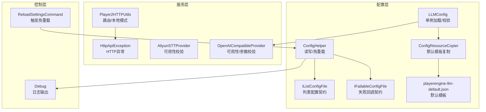
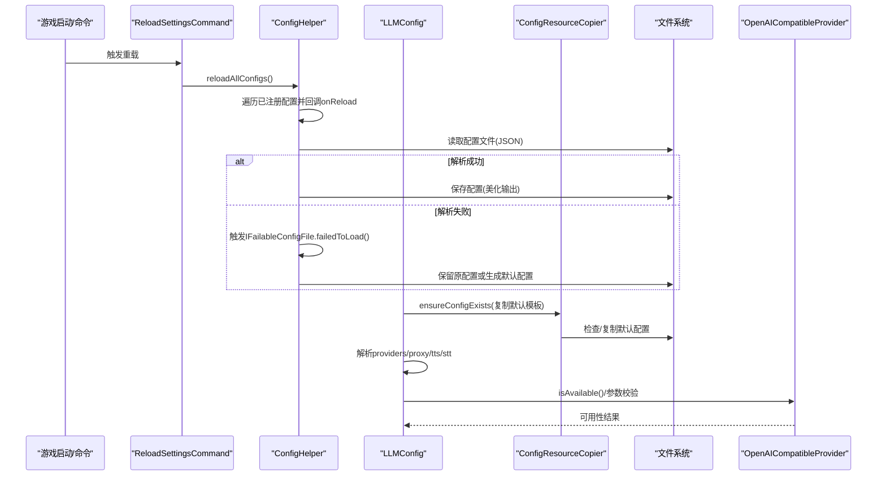
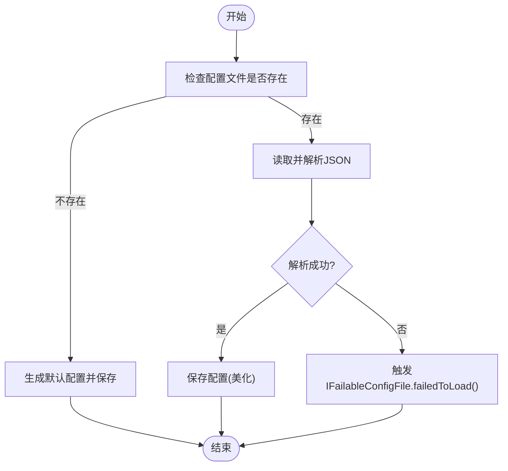
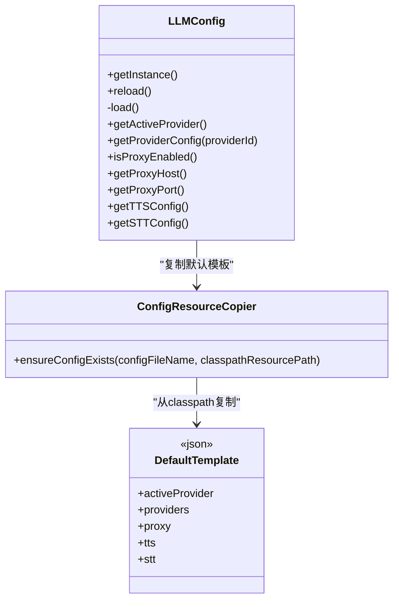
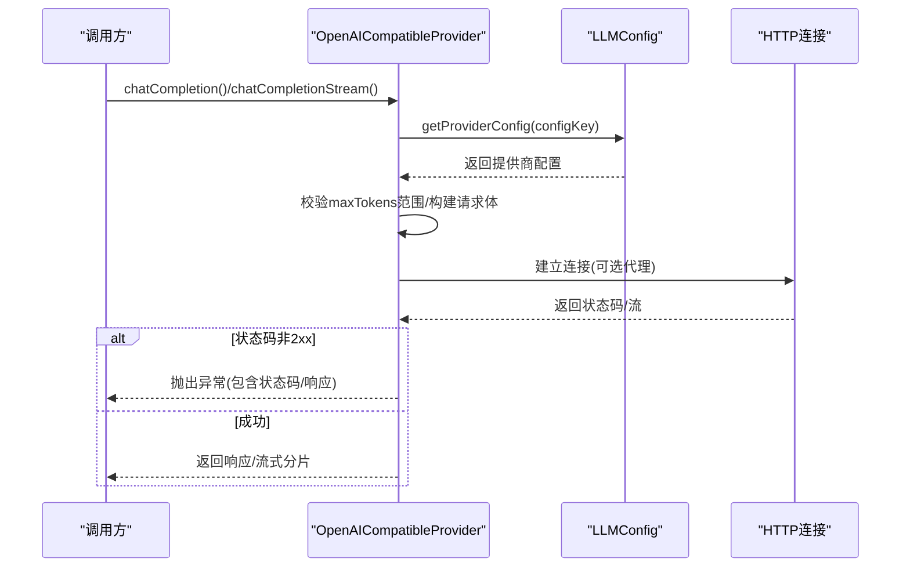
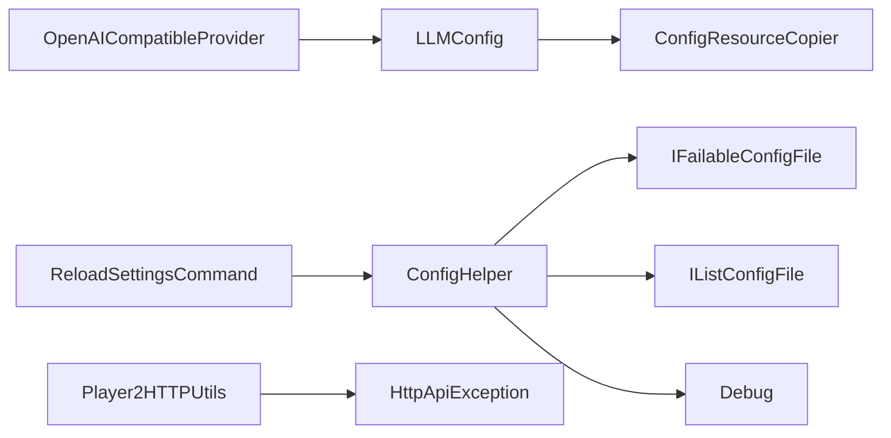

# 配置验证与错误处理

<cite>
**本文引用的文件**
- [ConfigHelper.java](file://src/main/java/adris/altoclef/util/helpers/ConfigHelper.java)
- [IFailableConfigFile.java](file://src/main/java/adris/altoclef/util/serialization/IFailableConfigFile.java)
- [IListConfigFile.java](file://src/main/java/adris/altoclef/util/serialization/IListConfigFile.java)
- [LLMConfig.java](file://src/main/java/adris/altoclef/player2api/llm/LLMConfig.java)
- [OpenAICompatibleProvider.java](file://src/main/java/adris/altoclef/player2api/llm/impl/OpenAICompatibleProvider.java)
- [ConfigResourceCopier.java](file://src/main/java/adris/altoclef/player2api/utils/ConfigResourceCopier.java)
- [HttpApiException.java](file://src/main/java/adris/altoclef/player2api/utils/HttpApiException.java)
- [Player2HTTPUtils.java](file://src/main/java/adris/altoclef/player2api/utils/Player2HTTPUtils.java)
- [AliyunSTTProvider.java](file://src/main/java/adris/altoclef/player2api/stt/AliyunSTTProvider.java)
- [Debug.java](file://src/main/java/adris/altoclef/Debug.java)
- [ReloadSettingsCommand.java](file://src/main/java/adris/altoclef/commands/ReloadSettingsCommand.java)
- [playerengine-llm-default.json](file://build/resources/main/playerengine-llm-default.json)
</cite>

## 目录
1. [简介](#简介)
2. [项目结构](#项目结构)
3. [核心组件](#核心组件)
4. [架构总览](#架构总览)
5. [详细组件分析](#详细组件分析)
6. [依赖分析](#依赖分析)
7. [性能考量](#性能考量)
8. [故障排查指南](#故障排查指南)
9. [结论](#结论)
10. [附录](#附录)

## 简介
本文件聚焦于配置验证与错误处理机制，涵盖以下方面：
- 配置文件的验证机制：格式检查、参数有效性校验、依赖关系检查
- 配置加载过程中的异常处理：文件缺失、格式错误、API Key 无效等
- 配置回滚机制、默认值应用、配置热更新
- 错误处理示例与最佳实践、故障排查流程

## 项目结构
围绕配置与错误处理的关键模块如下：
- 配置读写与热重载：ConfigHelper
- 配置接口契约：IFailableConfigFile、IListConfigFile
- LLM 配置与默认模板：LLMConfig、ConfigResourceCopier、默认配置模板
- LLM 提供商与可用性校验：OpenAICompatibleProvider
- HTTP 请求与异常：Player2HTTPUtils、HttpApiException
- STT 可用性校验：AliyunSTTProvider
- 日志与调试：Debug
- 热重载命令入口：ReloadSettingsCommand

**图表来源**
- [ConfigHelper.java:33-99](file://src/main/java/adris/altoclef/util/helpers/ConfigHelper.java#L33-L99)
- [IFailableConfigFile.java:3-7](file://src/main/java/adris/altoclef/util/serialization/IFailableConfigFile.java#L3-L7)
- [IListConfigFile.java:3-7](file://src/main/java/adris/altoclef/util/serialization/IListConfigFile.java#L3-L7)
- [LLMConfig.java:19-89](file://src/main/java/adris/altoclef/player2api/llm/LLMConfig.java#L19-L89)
- [ConfigResourceCopier.java:29-57](file://src/main/java/adris/altoclef/player2api/utils/ConfigResourceCopier.java#L29-L57)
- [playerengine-llm-default.json:1-89](file://build/resources/main/playerengine-llm-default.json#L1-L89)
- [OpenAICompatibleProvider.java:51-225](file://src/main/java/adris/altoclef/player2api/llm/impl/OpenAICompatibleProvider.java#L51-L225)
- [AliyunSTTProvider.java:156-171](file://src/main/java/adris/altoclef/player2api/stt/AliyunSTTProvider.java#L156-L171)
- [Player2HTTPUtils.java:64-92](file://src/main/java/adris/altoclef/player2api/utils/Player2HTTPUtils.java#L64-L92)
- [HttpApiException.java:22-33](file://src/main/java/adris/altoclef/player2api/utils/HttpApiException.java#L22-L33)
- [ReloadSettingsCommand.java:8-19](file://src/main/java/adris/altoclef/commands/ReloadSettingsCommand.java#L8-L19)
- [Debug.java:45-102](file://src/main/java/adris/altoclef/Debug.java#L45-L102)

**章节来源**
- [ConfigHelper.java:33-99](file://src/main/java/adris/altoclef/util/helpers/ConfigHelper.java#L33-L99)
- [LLMConfig.java:19-89](file://src/main/java/adris/altoclef/player2api/llm/LLMConfig.java#L19-L89)
- [ConfigResourceCopier.java:29-57](file://src/main/java/adris/altoclef/player2api/utils/ConfigResourceCopier.java#L29-L57)
- [playerengine-llm-default.json:1-89](file://build/resources/main/playerengine-llm-default.json#L1-L89)

## 核心组件
- 配置读写与热重载
  - 统一读取与保存 JSON 配置，支持序列化器/反序列化器注册，美化输出
  - 文件缺失时生成默认配置并保存；解析失败时记录错误并触发失败回调
  - 支持列表型配置文件（带注释行过滤），确保注释文件存在
  - 提供全局热重载入口，遍历已注册配置并触发回调
- 配置契约
  - IFailableConfigFile：当配置加载失败时的回调接口
  - IListConfigFile：列表型配置的加载生命周期与逐行添加接口
- LLM 配置与默认模板
  - LLMConfig 单例加载，从运行时配置目录读取，必要时复制默认模板
  - 默认模板包含提供商、代理、TTS、STT 等完整字段与注释说明
  - 对提供商 maxTokens 参数进行合理性告警
- LLM 提供商可用性校验
  - OpenAI 兼容提供商根据配置校验可用性，包含 API Key 规范性检查
- HTTP 异常与路由
  - Player2HTTPUtils 在本地模式下对特定端点进行短路处理
  - HttpApiException 封装 HTTP 状态码，便于上层捕获与处理

**章节来源**
- [ConfigHelper.java:48-99](file://src/main/java/adris/altoclef/util/helpers/ConfigHelper.java#L48-L99)
- [IFailableConfigFile.java:3-7](file://src/main/java/adris/altoclef/util/serialization/IFailableConfigFile.java#L3-L7)
- [IListConfigFile.java:3-7](file://src/main/java/adris/altoclef/util/serialization/IListConfigFile.java#L3-L7)
- [LLMConfig.java:54-89](file://src/main/java/adris/altoclef/player2api/llm/LLMConfig.java#L54-L89)
- [OpenAICompatibleProvider.java:212-225](file://src/main/java/adris/altoclef/player2api/llm/impl/OpenAICompatibleProvider.java#L212-L225)
- [Player2HTTPUtils.java:64-92](file://src/main/java/adris/altoclef/player2api/utils/Player2HTTPUtils.java#L64-L92)
- [HttpApiException.java:22-33](file://src/main/java/adris/altoclef/player2api/utils/HttpApiException.java#L22-L33)

## 架构总览
配置加载与验证的整体流程如下：

**图表来源**
- [ReloadSettingsCommand.java:14-18](file://src/main/java/adris/altoclef/commands/ReloadSettingsCommand.java#L14-L18)
- [ConfigHelper.java:42-99](file://src/main/java/adris/altoclef/util/helpers/ConfigHelper.java#L42-L99)
- [LLMConfig.java:37-89](file://src/main/java/adris/altoclef/player2api/llm/LLMConfig.java#L37-L89)
- [ConfigResourceCopier.java:29-57](file://src/main/java/adris/altoclef/player2api/utils/ConfigResourceCopier.java#L29-L57)
- [OpenAICompatibleProvider.java:212-225](file://src/main/java/adris/altoclef/player2api/llm/impl/OpenAICompatibleProvider.java#L212-L225)

## 详细组件分析

### 配置读写与热重载（ConfigHelper）
- 功能要点
  - 读取：若文件不存在则生成默认配置并保存；解析失败时记录错误并触发失败回调
  - 写入：注册序列化器/反序列化器，启用美化输出，确保父目录存在
  - 列表配置：按行读取并去除注释，支持注释文件初始化
  - 热重载：维护已注册配置集合，统一触发回调
- 关键行为
  - JSON 解析异常捕获与失败回调触发
  - IO 异常处理与日志输出
  - 列表配置逐行解析与注释剥离

**图表来源**
- [ConfigHelper.java:48-99](file://src/main/java/adris/altoclef/util/helpers/ConfigHelper.java#L48-L99)
- [IFailableConfigFile.java:3-7](file://src/main/java/adris/altoclef/util/serialization/IFailableConfigFile.java#L3-L7)

**章节来源**
- [ConfigHelper.java:48-99](file://src/main/java/adris/altoclef/util/helpers/ConfigHelper.java#L48-L99)
- [ConfigHelper.java:159-213](file://src/main/java/adris/altoclef/util/helpers/ConfigHelper.java#L159-L213)
- [ConfigHelper.java:220-237](file://src/main/java/adris/altoclef/util/helpers/ConfigHelper.java#L220-L237)

### LLM 配置与默认模板（LLMConfig + ConfigResourceCopier）
- 功能要点
  - LLMConfig 单例加载，定位运行时配置路径，必要时复制默认模板
  - 默认模板包含提供商、代理、TTS、STT 等字段与注释，便于用户理解
  - 加载时对 providers 中的 maxTokens 进行合理性告警
- 默认模板字段与校验
  - activeProvider：当前活跃提供商标识
  - providers：各提供商配置（启用开关、API 地址、API Key、模型、maxTokens、temperature 等）
  - proxy：HTTP 代理（启用、主机、端口）
  - tts：TTS 配置（启用、模型、音色、音量、语速、音调等）
  - stt：STT 配置（启用、模型、语言等）

**图表来源**
- [LLMConfig.java:19-89](file://src/main/java/adris/altoclef/player2api/llm/LLMConfig.java#L19-L89)
- [ConfigResourceCopier.java:29-57](file://src/main/java/adris/altoclef/player2api/utils/ConfigResourceCopier.java#L29-L57)
- [playerengine-llm-default.json:1-89](file://build/resources/main/playerengine-llm-default.json#L1-L89)

**章节来源**
- [LLMConfig.java:37-89](file://src/main/java/adris/altoclef/player2api/llm/LLMConfig.java#L37-L89)
- [ConfigResourceCopier.java:29-57](file://src/main/java/adris/altoclef/player2api/utils/ConfigResourceCopier.java#L29-L57)
- [playerengine-llm-default.json:1-89](file://build/resources/main/playerengine-llm-default.json#L1-L89)

### LLM 提供商可用性与参数校验（OpenAICompatibleProvider）
- 功能要点
  - 从 LLMConfig 获取提供商配置，构建请求体与连接
  - 对 maxTokens 进行范围约束（1~65536）
  - 根据配置决定是否启用代理
  - 可用性检查：enabled 开关、API Key 非空且非占位符
- 错误处理
  - HTTP 状态码非 2xx 时抛出异常，携带响应内容
  - 流式响应解析失败时记录警告并继续

**图表来源**
- [OpenAICompatibleProvider.java:51-141](file://src/main/java/adris/altoclef/player2api/llm/impl/OpenAICompatibleProvider.java#L51-L141)
- [OpenAICompatibleProvider.java:144-209](file://src/main/java/adris/altoclef/player2api/llm/impl/OpenAICompatibleProvider.java#L144-L209)
- [OpenAICompatibleProvider.java:212-225](file://src/main/java/adris/altoclef/player2api/llm/impl/OpenAICompatibleProvider.java#L212-L225)

**章节来源**
- [OpenAICompatibleProvider.java:51-141](file://src/main/java/adris/altoclef/player2api/llm/impl/OpenAICompatibleProvider.java#L51-L141)
- [OpenAICompatibleProvider.java:144-209](file://src/main/java/adris/altoclef/player2api/llm/impl/OpenAICompatibleProvider.java#L144-L209)
- [OpenAICompatibleProvider.java:212-225](file://src/main/java/adris/altoclef/player2api/llm/impl/OpenAICompatibleProvider.java#L212-L225)

### STT 可用性校验（AliyunSTTProvider）
- 功能要点
  - 检查音频数据是否为 WAV 头部格式
  - 检查 API Key 是否有效且非占位符，判定可用性

**章节来源**
- [AliyunSTTProvider.java:156-171](file://src/main/java/adris/altoclef/player2api/stt/AliyunSTTProvider.java#L156-L171)

### HTTP 请求与异常（Player2HTTPUtils + HttpApiException）
- 功能要点
  - 在本地模式下对特定端点进行短路处理（如 TTS/STT、健康检查）
  - 非本地模式时转发至远端 API，并携带鉴权头
  - HttpApiException 携带 HTTP 状态码，便于上层统一处理

**章节来源**
- [Player2HTTPUtils.java:64-92](file://src/main/java/adris/altoclef/player2api/utils/Player2HTTPUtils.java#L64-L92)
- [HttpApiException.java:22-33](file://src/main/java/adris/altoclef/player2api/utils/HttpApiException.java#L22-L33)

### 热重载与调试（ReloadSettingsCommand + Debug）
- 功能要点
  - ReloadSettingsCommand 调用 ConfigHelper.reloadAllConfigs() 触发所有配置重载
  - Debug 提供统一的日志输出与堆栈打印能力

**章节来源**
- [ReloadSettingsCommand.java:14-18](file://src/main/java/adris/altoclef/commands/ReloadSettingsCommand.java#L14-L18)
- [Debug.java:45-102](file://src/main/java/adris/altoclef/Debug.java#L45-L102)

## 依赖分析
- 组件耦合
  - ConfigHelper 依赖 IFailableConfigFile 与 IListConfigFile，用于失败回调与列表配置加载
  - LLMConfig 依赖 ConfigResourceCopier 以确保默认模板存在
  - OpenAICompatibleProvider 依赖 LLMConfig 获取提供商配置
  - Player2HTTPUtils 依赖 HttpApiException 进行异常封装
- 外部依赖
  - 文件系统：读写配置文件
  - 网络：HTTP 连接与流式响应处理
  - 日志：统一输出错误与警告信息

**图表来源**
- [ConfigHelper.java:33-99](file://src/main/java/adris/altoclef/util/helpers/ConfigHelper.java#L33-L99)
- [IFailableConfigFile.java:3-7](file://src/main/java/adris/altoclef/util/serialization/IFailableConfigFile.java#L3-L7)
- [IListConfigFile.java:3-7](file://src/main/java/adris/altoclef/util/serialization/IListConfigFile.java#L3-L7)
- [LLMConfig.java:19-89](file://src/main/java/adris/altoclef/player2api/llm/LLMConfig.java#L19-L89)
- [ConfigResourceCopier.java:29-57](file://src/main/java/adris/altoclef/player2api/utils/ConfigResourceCopier.java#L29-L57)
- [OpenAICompatibleProvider.java:51-225](file://src/main/java/adris/altoclef/player2api/llm/impl/OpenAICompatibleProvider.java#L51-L225)
- [Player2HTTPUtils.java:64-92](file://src/main/java/adris/altoclef/player2api/utils/Player2HTTPUtils.java#L64-L92)
- [HttpApiException.java:22-33](file://src/main/java/adris/altoclef/player2api/utils/HttpApiException.java#L22-L33)
- [ReloadSettingsCommand.java:14-18](file://src/main/java/adris/altoclef/commands/ReloadSettingsCommand.java#L14-L18)
- [Debug.java:45-102](file://src/main/java/adris/altoclef/Debug.java#L45-L102)

## 性能考量
- JSON 解析与序列化
  - 使用 Jackson 注册自定义序列化器/反序列化器，减少不必要的转换开销
  - 启用美化输出仅在保存时进行，避免频繁 IO
- 热重载
  - 通过已注册配置集合统一触发回调，避免重复扫描与解析
- 网络请求
  - 设置连接与读取超时，防止阻塞
  - 流式响应按行解析，避免一次性加载大块数据

[本节为通用建议，不直接分析具体文件]

## 故障排查指南
- 配置文件缺失
  - 现象：首次运行未生成配置文件
  - 处理：确保运行时配置目录存在；默认模板由 ConfigResourceCopier 自动复制
  - 参考
    - [ConfigResourceCopier.java:33-36](file://src/main/java/adris/altoclef/player2api/utils/ConfigResourceCopier.java#L33-L36)
    - [playerengine-llm-default.json:1-89](file://build/resources/main/playerengine-llm-default.json#L1-L89)
- JSON 格式错误
  - 现象：解析失败并触发失败回调
  - 处理：检查 JSON 语法与字段类型；查看日志堆栈定位问题
  - 参考
    - [ConfigHelper.java:62-88](file://src/main/java/adris/altoclef/util/helpers/ConfigHelper.java#L62-L88)
    - [Debug.java:59-68](file://src/main/java/adris/altoclef/Debug.java#L59-L68)
- API Key 无效
  - 现象：HTTP 状态码非 2xx 或提供商不可用
  - 处理：确认 API Key 正确且未使用占位符；检查网络与代理设置
  - 参考
    - [OpenAICompatibleProvider.java:129-132](file://src/main/java/adris/altoclef/player2api/llm/impl/OpenAICompatibleProvider.java#L129-L132)
    - [OpenAICompatibleProvider.java:212-219](file://src/main/java/adris/altoclef/player2api/llm/impl/OpenAICompatibleProvider.java#L212-L219)
- STT 不可用
  - 现象：音频格式不符合要求或 API Key 未配置
  - 处理：确认音频为 WAV 格式；检查 API Key 非空且非占位符
  - 参考
    - [AliyunSTTProvider.java:156-171](file://src/main/java/adris/altoclef/player2api/stt/AliyunSTTProvider.java#L156-L171)
- 代理配置问题
  - 现象：访问海外服务失败
  - 处理：启用代理并正确填写主机与端口
  - 参考
    - [LLMConfig.java:100-110](file://src/main/java/adris/altoclef/player2api/llm/LLMConfig.java#L100-L110)
    - [OpenAICompatibleProvider.java:87-93](file://src/main/java/adris/altoclef/player2api/llm/impl/OpenAICompatibleProvider.java#L87-L93)
- 配置热更新
  - 现象：修改配置后未生效
  - 处理：执行重载命令触发热更新
  - 参考
    - [ReloadSettingsCommand.java:14-18](file://src/main/java/adris/altoclef/commands/ReloadSettingsCommand.java#L14-L18)
    - [ConfigHelper.java:42-46](file://src/main/java/adris/altoclef/util/helpers/ConfigHelper.java#L42-L46)

**章节来源**
- [ConfigResourceCopier.java:33-36](file://src/main/java/adris/altoclef/player2api/utils/ConfigResourceCopier.java#L33-L36)
- [playerengine-llm-default.json:1-89](file://build/resources/main/playerengine-llm-default.json#L1-L89)
- [ConfigHelper.java:62-88](file://src/main/java/adris/altoclef/util/helpers/ConfigHelper.java#L62-L88)
- [Debug.java:59-68](file://src/main/java/adris/altoclef/Debug.java#L59-L68)
- [OpenAICompatibleProvider.java:129-132](file://src/main/java/adris/altoclef/player2api/llm/impl/OpenAICompatibleProvider.java#L129-L132)
- [OpenAICompatibleProvider.java:212-219](file://src/main/java/adris/altoclef/player2api/llm/impl/OpenAICompatibleProvider.java#L212-L219)
- [AliyunSTTProvider.java:156-171](file://src/main/java/adris/altoclef/player2api/stt/AliyunSTTProvider.java#L156-L171)
- [LLMConfig.java:100-110](file://src/main/java/adris/altoclef/player2api/llm/LLMConfig.java#L100-L110)
- [ReloadSettingsCommand.java:14-18](file://src/main/java/adris/altoclef/commands/ReloadSettingsCommand.java#L14-L18)

## 结论
本项目通过统一的配置读写与热重载机制、明确的配置契约、完善的默认模板与可用性校验，实现了健壮的配置验证与错误处理体系。结合日志与异常封装，能够快速定位并修复配置问题，保障 AI NPC 的稳定运行。

[本节为总结性内容，不直接分析具体文件]

## 附录
- 最佳实践
  - 使用默认模板作为参考，避免手动编写复杂配置
  - 修改配置后通过重载命令立即生效，避免重启
  - 对敏感信息（API Key）进行妥善保护，不在公开仓库中提交
- 错误预防策略
  - 在加载前进行字段存在性与类型检查
  - 对关键数值（如 maxTokens）设定合理范围并给出告警
  - 对网络请求设置超时与重试策略
- 故障排查流程
  - 确认配置文件存在与可读
  - 检查 JSON 语法与字段完整性
  - 校验 API Key 与网络连通性
  - 启用代理时核对主机与端口
  - 使用重载命令验证修改是否生效

[本节为通用建议，不直接分析具体文件]