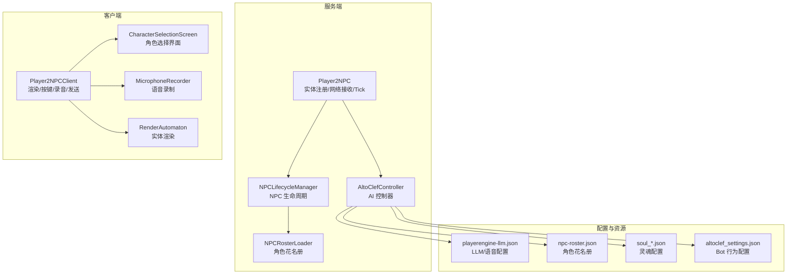
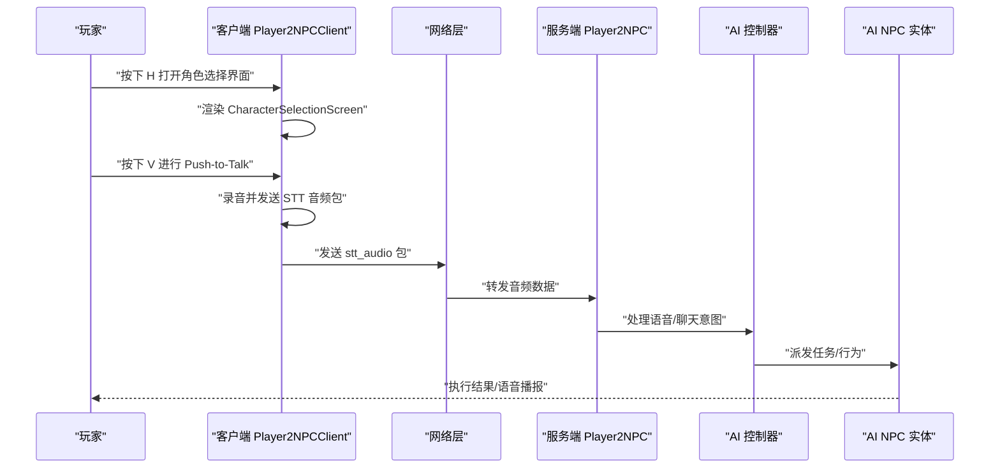
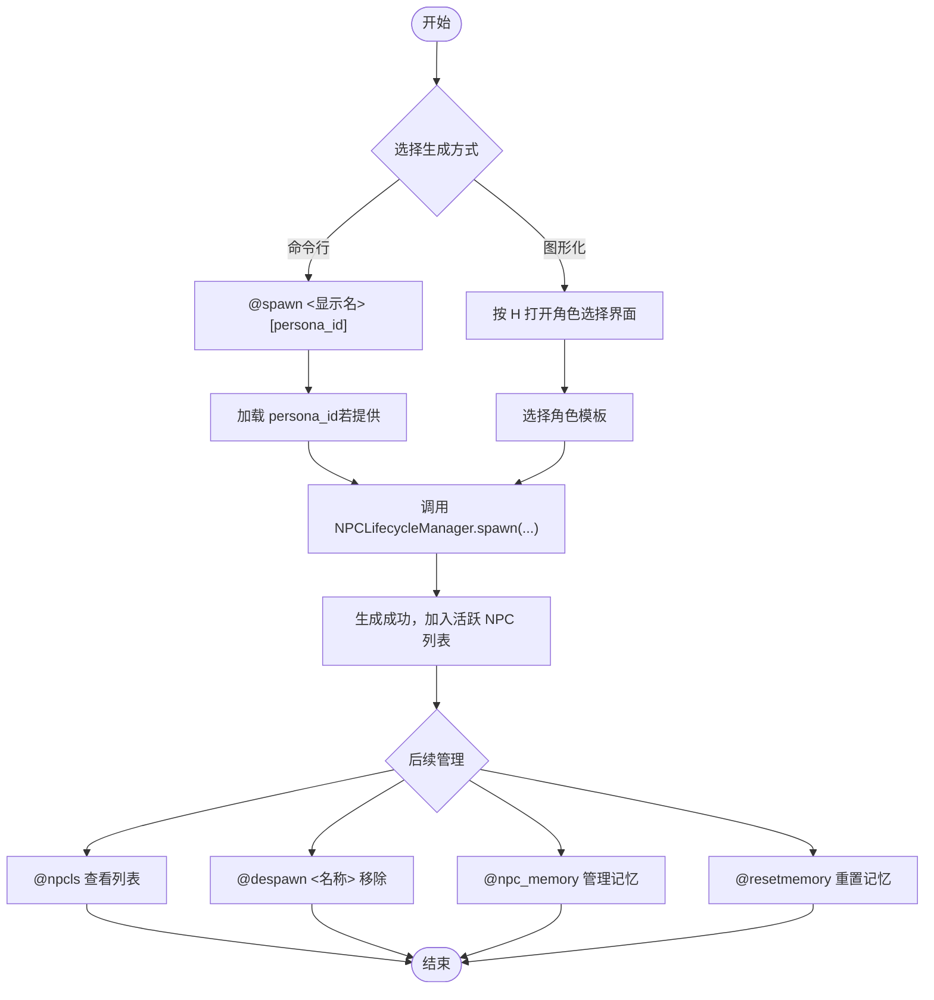
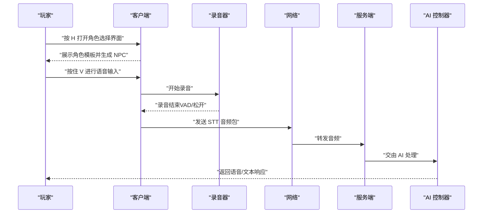
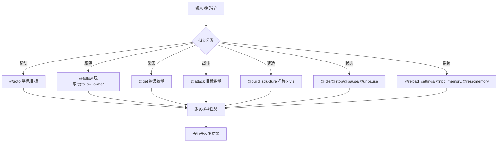
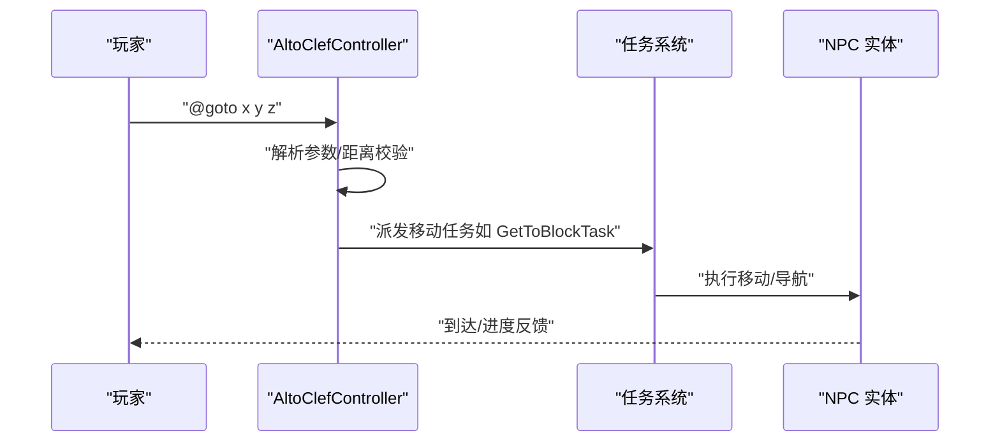
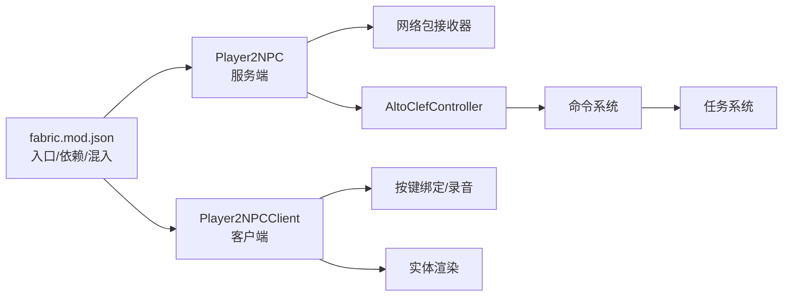

# 使用操作指南

<cite>
**本文引用的文件**
- [README.md](file://README.md)
- [Player2NPC.java](file://src/main/java/com/goodbird/player2npc/Player2NPC.java)
- [Player2NPCClient.java](file://src/main/java/com/goodbird/player2npc/Player2NPCClient.java)
- [fabric.mod.json](file://src/main/resources/fabric.mod.json)
- [SpawnAINPCCommand.java](file://src/main/java/adris/altoclef/commands/SpawnAINPCCommand.java)
- [GotoCommand.java](file://src/main/java/adris/altoclef/commands/GotoCommand.java)
- [IdleCommand.java](file://src/main/java/adris/altoclef/commands/IdleCommand.java)
- [StopCommand.java](file://src/main/java/adris/altoclef/commands/StopCommand.java)
- [StatusCommand.java](file://src/main/java/adris/altoclef/commands/StatusCommand.java)
- [ListCommand.java](file://src/main/java/adris/altoclef/commands/ListCommand.java)
- [NPCMemoryCommand.java](file://src/main/java/adris/altoclef/commands/NPCMemoryCommand.java)
- [ResetMemoryCommand.java](file://src/main/java/adris/altoclef/commands/ResetMemoryCommand.java)
</cite>

## 目录
1. [简介](#简介)
2. [项目结构](#项目结构)
3. [核心组件](#核心组件)
4. [架构总览](#架构总览)
5. [详细组件分析](#详细组件分析)
6. [依赖关系分析](#依赖关系分析)
7. [性能考量](#性能考量)
8. [故障排除指南](#故障排除指南)
9. [结论](#结论)
10. [附录](#附录)

## 简介
本指南面向希望在 Minecraft 1.20.1（Fabric）环境中使用 PlayerEngine（AI Player2NPC）模组的玩家。内容涵盖 NPC 的生成与管理、角色选择界面、NPC 生命周期、文字与语音交互、按键绑定、以及 30+ 种可用的 NPC 游戏指令及其执行机制。同时提供常见问题解决方案与最佳实践，帮助你高效地创建、管理和指挥 AI NPC，构建智能协作的多人世界。

## 项目结构
该模组采用 Fabric 生态与自研 AI 引擎结合的方式实现。服务端负责 NPC 实体注册、网络包接收与全局 Tick 控制；客户端负责渲染、按键绑定、语音录制与发送、以及 GUI 展示。模组通过命令系统暴露丰富的 NPC 控制指令，并通过配置文件驱动 LLM/语音服务。

图表来源
- [Player2NPC.java:48-65](file://src/main/java/com/goodbird/player2npc/Player2NPC.java#L48-L65)
- [Player2NPCClient.java:37-124](file://src/main/java/com/goodbird/player2npc/Player2NPCClient.java#L37-L124)
- [fabric.mod.json:17-28](file://src/main/resources/fabric.mod.json#L17-L28)

章节来源
- [fabric.mod.json:17-28](file://src/main/resources/fabric.mod.json#L17-L28)
- [README.md:66-409](file://README.md#L66-L409)

## 核心组件
- 服务端入口与网络
  - 注册 AI NPC 实体类型、全局网络包接收器（生成/移除请求、STT 音频）与服务器 Tick。
- 客户端入口与交互
  - 注册实体渲染器、打开角色选择界面的按键绑定（H）、语音按键绑定（V，Push-to-Talk）与录音发送逻辑。
- 命令系统与 NPC 生命周期
  - 提供 spawn/despawn/npcls 等生命周期命令；通过 NPCLifecycleManager 管理 NPC 的生成、移除与列表展示。
- 配置与资源
  - LLM/语音配置、角色花名册、灵魂配置、Bot 行为配置，共同决定 NPC 的能力与行为表现。

章节来源
- [Player2NPC.java:25-65](file://src/main/java/com/goodbird/player2npc/Player2NPC.java#L25-L65)
- [Player2NPCClient.java:23-124](file://src/main/java/com/goodbird/player2npc/Player2NPCClient.java#L23-L124)
- [SpawnAINPCCommand.java:18-106](file://src/main/java/adris/altoclef/commands/SpawnAINPCCommand.java#L18-L106)

## 架构总览
下图展示了从按键到网络、再到服务端控制器与 NPC 实体的完整交互链路，以及命令系统与配置文件的协作关系。

图表来源
- [Player2NPCClient.java:41-54](file://src/main/java/com/goodbird/player2npc/Player2NPCClient.java#L41-L54)
- [Player2NPC.java:52-54](file://src/main/java/com/goodbird/player2npc/Player2NPC.java#L52-L54)
- [Player2NPC.java:48-65](file://src/main/java/com/goodbird/player2npc/Player2NPC.java#L48-L65)

## 详细组件分析

### NPC 生成与管理流程
- 生成方式
  - 命令行：使用 spawn 指令，可指定显示名与 persona_id（来自角色花名册）。
  - 图形化：按 H 打开角色选择界面，浏览并生成 NPC。
- 生命周期管理
  - 列表：npcls 查看当前世界活跃 NPC。
  - 移除：despawn 按名称移除指定 NPC。
  - 重置：resetmemory 清空 NPC 记忆；npc_memory 支持增删查清记忆锚点。
- 关键实现要点
  - spawn/despawn/npcls 命令封装于命令系统，调用 NPCLifecycleManager 完成实际操作。
  - 服务端注册全局网络包接收器，用于处理生成/移除请求与 STT 音频。

图表来源
- [SpawnAINPCCommand.java:20-98](file://src/main/java/adris/altoclef/commands/SpawnAINPCCommand.java#L20-L98)
- [Player2NPC.java:52-54](file://src/main/java/com/goodbird/player2npc/Player2NPC.java#L52-L54)

章节来源
- [SpawnAINPCCommand.java:18-106](file://src/main/java/adris/altoclef/commands/SpawnAINPCCommand.java#L18-L106)
- [NPCMemoryCommand.java:16-107](file://src/main/java/adris/altoclef/commands/NPCMemoryCommand.java#L16-L107)
- [ResetMemoryCommand.java:8-19](file://src/main/java/adris/altoclef/commands/ResetMemoryCommand.java#L8-L19)

### 角色选择界面与按键绑定
- 角色选择界面
  - 按 H 打开，用于图形化选择角色模板并生成 NPC。
- 语音交互
  - 按住 V 进行 Push-to-Talk 录音，松开或自动语音活动检测（VAD）触发发送；服务端接收后进行 STT 处理。
- 客户端渲染
  - 注册 AI NPC 实体渲染器，确保在世界中可见。

图表来源
- [Player2NPCClient.java:41-54](file://src/main/java/com/goodbird/player2npc/Player2NPCClient.java#L41-L54)
- [Player2NPCClient.java:64-123](file://src/main/java/com/goodbird/player2npc/Player2NPCClient.java#L64-L123)
- [Player2NPC.java:52-54](file://src/main/java/com/goodbird/player2npc/Player2NPC.java#L52-L54)

章节来源
- [Player2NPCClient.java:23-164](file://src/main/java/com/goodbird/player2npc/Player2NPCClient.java#L23-L164)
- [Player2NPC.java:25-65](file://src/main/java/com/goodbird/player2npc/Player2NPC.java#L25-L65)

### NPC 交互与指令系统
- 文字聊天
  - 按 T 打开聊天框，直接输入与 NPC 交流；NPC 会基于上下文与情绪进行自然回复。
- 语音交互
  - 按住 V 录音，服务端接收后进行 STT 转写并交由 AI 处理。
- 指令控制
  - 所有指令以 @ 前缀开头，输入至聊天框即可触发。常见指令类别如下（示例来自文档）：
    - 资源采集类：get、food、meat、farm、fish
    - 装备与物品类：equip、deposit、give、stash
    - 移动与导航类：goto、follow、follow_owner、locate_structure
    - 战斗与防御类：attack、hero
    - 建造与交互类：build_structure、bodylang、scan、sleep
    - 状态与模式类：idle、stop、gamer、pause、unpause
    - 系统与配置类：reload_settings、resetmemory、npc_memory、chatclef
    - NPC 生命周期类：spawn、despawn、npcls

图表来源
- [README.md:334-409](file://README.md#L334-L409)

章节来源
- [README.md:334-409](file://README.md#L334-L409)

### 命令执行机制与典型流程
- 命令解析与执行
  - 命令系统对 @ 前缀指令进行解析，构造参数对象并调用对应任务或控制器方法。
- 示例：前往目标
  - goto 指令支持多种目标形式（XYZ/XZ/Y/维度），内部转换为具体移动任务；并包含“距离保护”逻辑：若目标距离超过阈值，将改为跟随玩家。
- 示例：待机/停止
  - idle 将 NPC 设为静止待机；stop 停止当前任务队列；status 查看当前执行任务。

图表来源
- [GotoCommand.java:24-65](file://src/main/java/adris/altoclef/commands/GotoCommand.java#L24-L65)
- [IdleCommand.java:8-18](file://src/main/java/adris/altoclef/commands/IdleCommand.java#L8-L18)
- [StopCommand.java:7-18](file://src/main/java/adris/altoclef/commands/StopCommand.java#L7-L18)
- [StatusCommand.java:9-26](file://src/main/java/adris/altoclef/commands/StatusCommand.java#L9-L26)

章节来源
- [GotoCommand.java:24-65](file://src/main/java/adris/altoclef/commands/GotoCommand.java#L24-L65)
- [IdleCommand.java:8-18](file://src/main/java/adris/altoclef/commands/IdleCommand.java#L8-L18)
- [StopCommand.java:7-18](file://src/main/java/adris/altoclef/commands/StopCommand.java#L7-L18)
- [StatusCommand.java:9-26](file://src/main/java/adris/altoclef/commands/StatusCommand.java#L9-L26)

### NPC 记忆与情感系统
- 记忆管理
  - npc_memory 支持添加、列出、删除（支持前缀匹配）、清空非永久锚点；resetmemory 可重置记忆。
- 情感影响
  - NPC 的情绪（喜悦、悲伤、愤怒、恐惧、惊讶、厌恶、信任、期待）会影响语音语速与音调，进而影响表达效果。
- 性能与维护
  - 建议定期清理非重要记忆，保持对话质量与性能平衡。

章节来源
- [NPCMemoryCommand.java:16-107](file://src/main/java/adris/altoclef/commands/NPCMemoryCommand.java#L16-L107)
- [ResetMemoryCommand.java:8-19](file://src/main/java/adris/altoclef/commands/ResetMemoryCommand.java#L8-L19)
- [README.md:593-624](file://README.md#L593-L624)

## 依赖关系分析
- 模组入口与环境
  - fabric.mod.json 声明了服务端与客户端入口、混入配置与依赖项。
- 服务端与客户端模块
  - 服务端负责实体注册、网络包接收与全局 Tick；客户端负责渲染、按键与录音。
- 命令系统与控制器
  - 命令类通过控制器接口派发任务，控制器再与任务系统协作执行。

图表来源
- [fabric.mod.json:17-28](file://src/main/resources/fabric.mod.json#L17-L28)
- [Player2NPC.java:48-65](file://src/main/java/com/goodbird/player2npc/Player2NPC.java#L48-L65)
- [Player2NPCClient.java:37-124](file://src/main/java/com/goodbird/player2npc/Player2NPCClient.java#L37-L124)

章节来源
- [fabric.mod.json:17-28](file://src/main/resources/fabric.mod.json#L17-L28)

## 性能考量
- 同时活跃 NPC 数量建议不超过 3~5 个，避免过多并发任务导致性能下降。
- NPC 间互动有冷却时间，避免频繁对话造成刷屏与性能压力。
- 记忆与关系数据会在游戏关闭后持久化，建议定期清理非重要记忆以维持运行效率。

章节来源
- [README.md:625-635](file://README.md#L625-L635)

## 故障排除指南
- 无法生成 NPC
  - 检查 persona_id 是否存在于角色花名册；若未提供 persona_id，系统会自动生成默认性格。
- 语音无法识别
  - 确认 playerengine-llm.json 中 stt.enabled 已启用；检查麦克风可用性；确保录音时长不少于 0.5 秒。
- 指令无效或无响应
  - 确认指令以 @ 开头且参数正确；使用 @status 查看当前执行任务；使用 @stop 停止异常任务。
- 性能问题
  - 减少同时活跃 NPC 数量；定期清理非重要记忆；避免过度频繁的 NPC 间互动。

章节来源
- [SpawnAINPCCommand.java:32-47](file://src/main/java/adris/altoclef/commands/SpawnAINPCCommand.java#L32-L47)
- [Player2NPCClient.java:73-118](file://src/main/java/com/goodbird/player2npc/Player2NPCClient.java#L73-L118)
- [StatusCommand.java:9-26](file://src/main/java/adris/altoclef/commands/StatusCommand.java#L9-L26)
- [StopCommand.java:7-18](file://src/main/java/adris/altoclef/commands/StopCommand.java#L7-L18)

## 结论
PlayerEngine（AI Player2NPC）为 Minecraft 世界提供了高度可定制的 AI NPC 能力，涵盖角色生成、图形化选择、生命周期管理、文字与语音交互、以及丰富的指令体系。通过合理配置与按键绑定，你可以轻松创建并指挥一支智能协作的 NPC 小队，实现从采集、战斗到建造与探索的多样化玩法。建议结合记忆与情感系统，持续优化 NPC 的行为表现，并遵循性能与维护建议，获得更流畅的体验。

## 附录
- 常用指令速查（示例来自文档）
  - 生成/移除/列表：@spawn、@despawn、@npcls
  - 移动/跟随：@goto、@follow、@follow_owner
  - 采集/战斗/建造：@get、@farm、@fish、@attack、@hero、@build_structure
  - 状态/模式：@idle、@stop、@pause、@unpause、@gamer
  - 记忆/系统：@npc_memory、@resetmemory、@reload_settings
- 配置文件位置与作用
  - playerengine-llm.json：LLM/语音提供商、TTS/STT 参数、代理与进度语音播报
  - npc-roster.json：角色模板（大五人格、初始情绪、描述）
  - soul_*.json：NPC 灵魂档案（人格矩阵、情绪、行为签名、记忆锚点、关系）
  - altoclef_settings.json：Bot 行为配置（命令前缀、自动防御、自动进食等）

章节来源
- [README.md:334-409](file://README.md#L334-L409)
- [README.md:66-409](file://README.md#L66-L409)