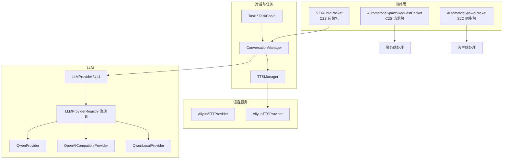
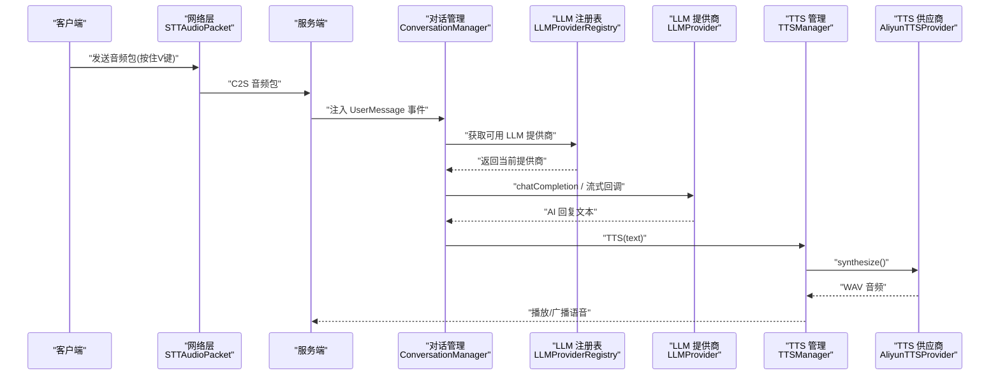
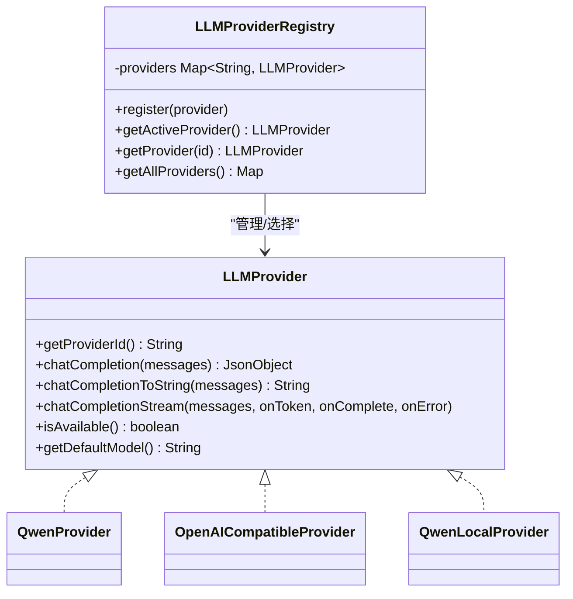
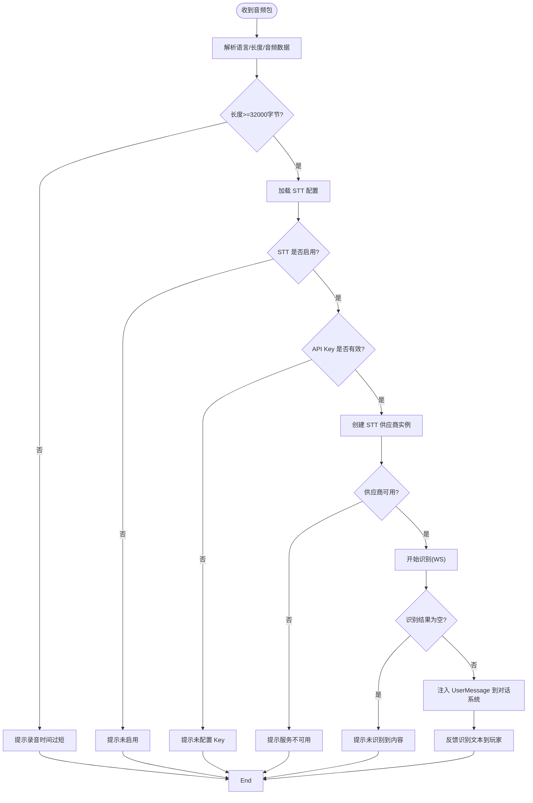
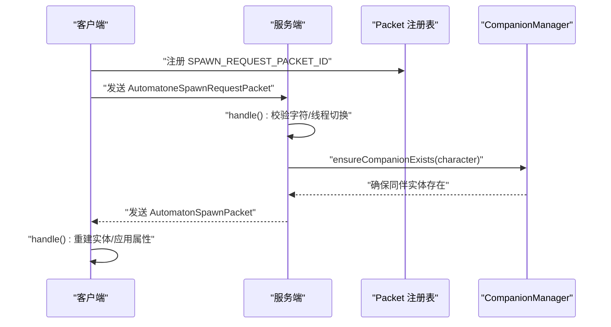
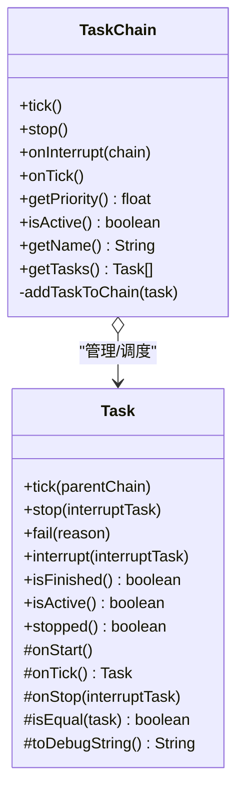
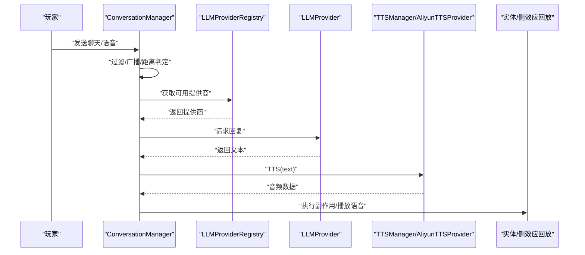
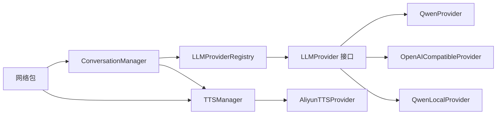

# 开发扩展指南

<cite>
**本文引用的文件**
- [README.md](file://README.md)
- [LLMProvider.java](file://src/main/java/adris/altoclef/player2api/llm/LLMProvider.java)
- [LLMProviderRegistry.java](file://src/main/java/adris/altoclef/player2api/llm/LLMProviderRegistry.java)
- [OpenAICompatibleProvider.java](file://src/main/java/adris/altoclef/player2api/llm/impl/OpenAICompatibleProvider.java)
- [QwenLocalProvider.java](file://src/main/java/adris/altoclef/player2api/llm/impl/QwenLocalProvider.java)
- [QwenProvider.java](file://src/main/java/adris/altoclef/player2api/llm/impl/QwenProvider.java)
- [AliyunSTTProvider.java](file://src/main/java/adris/altoclef/player2api/stt/AliyunSTTProvider.java)
- [STTAudioPacket.java](file://src/main/java/com/goodbird/player2npc/network/STTAudioPacket.java)
- [AutomatoneSpawnRequestPacket.java](file://src/main/java/com/goodbird/player2npc/network/AutomatoneSpawnRequestPacket.java)
- [AutomatonSpawnPacket.java](file://src/main/java/com/goodbird/player2npc/network/AutomatonSpawnPacket.java)
- [Task.java](file://src/main/java/adris/altoclef/tasksystem/Task.java)
- [TaskChain.java](file://src/main/java/adris/altoclef/tasksystem/TaskChain.java)
- [ConversationManager.java](file://src/main/java/adris/altoclef/player2api/manager/ConversationManager.java)
- [TTSManager.java](file://src/main/java/adris/altoclef/player2api/manager/TTSManager.java)
- [AliyunTTSProvider.java](file://src/main/java/adris/altoclef/player2api/tts/AliyunTTSProvider.java)
</cite>

## 目录
1. [简介](#简介)
2. [项目结构](#项目结构)
3. [核心组件](#核心组件)
4. [架构总览](#架构总览)
5. [详细组件分析](#详细组件分析)
6. [依赖分析](#依赖分析)
7. [性能考量](#性能考量)
8. [故障排查指南](#故障排查指南)
9. [结论](#结论)
10. [附录](#附录)

## 简介
本指南面向希望对 Minecraft AI Player2NPC 项目进行二次开发与功能定制的工程师，重点讲解以下扩展主题：
- LLM Provider 的插件化架构与接入新模型的步骤
- TTS/STT 服务的替换机制与扩展点
- 自定义网络包的创建与处理流程
- 任务系统、对话管理、实体组件等核心模块的扩展方法

目标是帮助你在不破坏现有架构的前提下，快速集成新的 AI 模型、替换语音服务、扩展网络通信，并定制任务与对话行为。

## 项目结构
项目采用分层与模块化组织，核心扩展点主要集中在如下模块：
- LLM 与对话：adris/altoclef/player2api/llm 与 manager
- 语音服务：adris/altoclef/player2api/stt、tts
- 网络通信：com/goodbird/player2npc/network
- 任务系统：adris/altoclef/tasksystem
- 对话管理：adris/altoclef/player2api/manager 下的 ConversationManager、TTSManager 等

图表来源
- [STTAudioPacket.java:1-134](file://src/main/java/com/goodbird/player2npc/network/STTAudioPacket.java#L1-134)
- [AutomatoneSpawnRequestPacket.java:1-67](file://src/main/java/com/goodbird/player2npc/network/AutomatoneSpawnRequestPacket.java#L1-67)
- [AutomatonSpawnPacket.java:1-120](file://src/main/java/com/goodbird/player2npc/network/AutomatonSpawnPacket.java#L1-120)
- [AliyunSTTProvider.java:1-172](file://src/main/java/adris/altoclef/player2api/stt/AliyunSTTProvider.java#L1-172)
- [AliyunTTSProvider.java:1-113](file://src/main/java/adris/altoclef/player2api/tts/AliyunTTSProvider.java#L1-113)
- [ConversationManager.java:1-201](file://src/main/java/adris/altoclef/player2api/manager/ConversationManager.java#L1-201)
- [TTSManager.java:1-168](file://src/main/java/adris/altoclef/player2api/manager/TTSManager.java#L1-168)
- [LLMProvider.java:1-67](file://src/main/java/adris/altoclef/player2api/llm/LLMProvider.java#L1-67)
- [LLMProviderRegistry.java:1-80](file://src/main/java/adris/altoclef/player2api/llm/LLMProviderRegistry.java#L1-80)
- [QwenProvider.java](file://src/main/java/adris/altoclef/player2api/llm/impl/QwenProvider.java)
- [OpenAICompatibleProvider.java](file://src/main/java/adris/altoclef/player2api/llm/impl/OpenAICompatibleProvider.java)
- [QwenLocalProvider.java](file://src/main/java/adris/altoclef/player2api/llm/impl/QwenLocalProvider.java)
- [Task.java:1-181](file://src/main/java/adris/altoclef/tasksystem/Task.java#L1-181)
- [TaskChain.java:1-51](file://src/main/java/adris/altoclef/tasksystem/TaskChain.java#L1-51)

章节来源
- [README.md:1-661](file://README.md#L1-L661)

## 核心组件
- LLM Provider 插件化接口与注册表：通过统一接口抽象不同供应商的调用方式，注册表负责发现、选择与回退。
- STT/ TTS 服务：提供语音识别与合成能力，支持替换为其他供应商。
- 网络包：定义客户端与服务端之间的消息格式与处理流程。
- 任务系统：以 Task/TaskChain 为核心，驱动 NPC 的行为树与优先级调度。
- 对话管理：统一接收用户输入、AI 输出、跨实体传播与侧效应回放。

章节来源
- [LLMProvider.java:1-67](file://src/main/java/adris/altoclef/player2api/llm/LLMProvider.java#L1-67)
- [LLMProviderRegistry.java:1-80](file://src/main/java/adris/altoclef/player2api/llm/LLMProviderRegistry.java#L1-80)
- [AliyunSTTProvider.java:1-172](file://src/main/java/adris/altoclef/player2api/stt/AliyunSTTProvider.java#L1-172)
- [AliyunTTSProvider.java:1-113](file://src/main/java/adris/altoclef/player2api/tts/AliyunTTSProvider.java#L1-113)
- [STTAudioPacket.java:1-134](file://src/main/java/com/goodbird/player2npc/network/STTAudioPacket.java#L1-134)
- [AutomatonSpawnPacket.java:1-120](file://src/main/java/com/goodbird/player2npc/network/AutomatonSpawnPacket.java#L1-120)
- [Task.java:1-181](file://src/main/java/adris/altoclef/tasksystem/Task.java#L1-181)
- [TaskChain.java:1-51](file://src/main/java/adris/altoclef/tasksystem/TaskChain.java#L1-51)
- [ConversationManager.java:1-201](file://src/main/java/adris/altoclef/player2api/manager/ConversationManager.java#L1-201)
- [TTSManager.java:1-168](file://src/main/java/adris/altoclef/player2api/manager/TTSManager.java#L1-168)

## 架构总览
下图展示了从“语音输入”到“任务执行”的端到端扩展路径，以及 LLM 与语音服务的可替换性。

图表来源
- [STTAudioPacket.java:1-134](file://src/main/java/com/goodbird/player2npc/network/STTAudioPacket.java#L1-134)
- [ConversationManager.java:1-201](file://src/main/java/adris/altoclef/player2api/manager/ConversationManager.java#L1-201)
- [LLMProviderRegistry.java:1-80](file://src/main/java/adris/altoclef/player2api/llm/LLMProviderRegistry.java#L1-80)
- [LLMProvider.java:1-67](file://src/main/java/adris/altoclef/player2api/llm/LLMProvider.java#L1-67)
- [TTSManager.java:1-168](file://src/main/java/adris/altoclef/player2api/manager/TTSManager.java#L1-168)
- [AliyunTTSProvider.java:1-113](file://src/main/java/adris/altoclef/player2api/tts/AliyunTTSProvider.java#L1-113)

## 详细组件分析

### LLM Provider 插件化架构与接入新模型
- 设计原则
  - 统一接口：所有 LLM 实现必须实现统一接口，保证调用一致性。
  - 注册表：集中管理提供商，支持按配置选择与回退策略。
  - 可插拔：新增提供商只需实现接口并注册，无需改动上层调用逻辑。
- 接口要点
  - 提供器 ID、可用性检查、默认模型名。
  - 非流式与流式两种调用方式，流式默认回退到非流式。
- 已有实现
  - 阿里云 Qwen、OpenAI 兼容、本地 Ollama。
- 扩展步骤
  1) 实现接口：提供 getProviderId、chatCompletion/chatCompletionToString、chatCompletionStream、isAvailable、getDefaultModel。
  2) 注册：在注册表中注册你的提供商实例。
  3) 配置：在配置文件中启用并设置相关参数。
  4) 验证：通过对话管理器发起一次请求，观察日志与回放缓冲。

图表来源
- [LLMProvider.java:1-67](file://src/main/java/adris/altoclef/player2api/llm/LLMProvider.java#L1-67)
- [LLMProviderRegistry.java:1-80](file://src/main/java/adris/altoclef/player2api/llm/LLMProviderRegistry.java#L1-80)
- [QwenProvider.java](file://src/main/java/adris/altoclef/player2api/llm/impl/QwenProvider.java)
- [OpenAICompatibleProvider.java](file://src/main/java/adris/altoclef/player2api/llm/impl/OpenAICompatibleProvider.java)
- [QwenLocalProvider.java](file://src/main/java/adris/altoclef/player2api/llm/impl/QwenLocalProvider.java)

章节来源
- [LLMProvider.java:1-67](file://src/main/java/adris/altoclef/player2api/llm/LLMProvider.java#L1-67)
- [LLMProviderRegistry.java:1-80](file://src/main/java/adris/altoclef/player2api/llm/LLMProviderRegistry.java#L1-80)

### TTS/STT 服务替换机制
- STT
  - 输入：PCM/WAV 音频帧（16kHz、16bit、单声道）。
  - 处理：按块发送、WebSocket 识别、返回最终文本。
  - 网络包：C2S 音频包，服务端异步识别并注入对话系统。
- TTS
  - 输出：WAV（22050Hz、单声道、16bit）。
  - 管理：句子级拆分、序列号去重、全局冷却、锁释放。
  - 替换：实现新的 TTS 供应商并接入 TTSManager。

图表来源
- [STTAudioPacket.java:1-134](file://src/main/java/com/goodbird/player2npc/network/STTAudioPacket.java#L1-134)
- [AliyunSTTProvider.java:1-172](file://src/main/java/adris/altoclef/player2api/stt/AliyunSTTProvider.java#L1-172)

章节来源
- [STTAudioPacket.java:1-134](file://src/main/java/com/goodbird/player2npc/network/STTAudioPacket.java#L1-134)
- [AliyunSTTProvider.java:1-172](file://src/main/java/adris/altoclef/player2api/stt/AliyunSTTProvider.java#L1-172)
- [TTSManager.java:1-168](file://src/main/java/adris/altoclef/player2api/manager/TTSManager.java#L1-168)
- [AliyunTTSProvider.java:1-113](file://src/main/java/adris/altoclef/player2api/tts/AliyunTTSProvider.java#L1-113)

### 自定义网络包的创建与处理
- 创建步骤
  1) 定义 Packet 类型与 ID。
  2) 实现 read/write 序列化，确保字段完整且有序。
  3) 在服务端注册 PacketType 并实现 handle。
  4) 在客户端注册 PacketType 并实现 handle。
- 示例：NPC 生成请求与同步
  - C2S：客户端发送 Character 数据，服务端校验并确保同伴存在。
  - S2C：服务端发送实体同步包，客户端重建实体并应用位置、朝向、装备等。

图表来源
- [AutomatoneSpawnRequestPacket.java:1-67](file://src/main/java/com/goodbird/player2npc/network/AutomatoneSpawnRequestPacket.java#L1-67)
- [AutomatonSpawnPacket.java:1-120](file://src/main/java/com/goodbird/player2npc/network/AutomatonSpawnPacket.java#L1-120)

章节来源
- [AutomatoneSpawnRequestPacket.java:1-67](file://src/main/java/com/goodbird/player2npc/network/AutomatoneSpawnRequestPacket.java#L1-67)
- [AutomatonSpawnPacket.java:1-120](file://src/main/java/com/goodbird/player2npc/network/AutomatonSpawnPacket.java#L1-120)

### 任务系统扩展指南
- Task 抽象
  - 生命周期：start/tick/onStop，支持子任务链式执行与中断。
  - 中断策略：通过 canBeInterrupted 与 ITaskCanForce 控制强制打断。
  - 调试：setDebugState 与 toDebugString 辅助定位。
- TaskChain
  - 优先级与激活条件：getPriority/isActive 决定调度顺序。
  - 任务收集：tick 期间收集当前链路的任务树用于调试与统计。
- 扩展建议
  - 新增任务：继承 Task，实现生命周期方法与调试字符串。
  - 任务组合：在 onTick 中返回子任务，形成复合任务链。
  - 与对话联动：在任务中触发对话事件或调用 ConversationManager。

图表来源
- [Task.java:1-181](file://src/main/java/adris/altoclef/tasksystem/Task.java#L1-181)
- [TaskChain.java:1-51](file://src/main/java/adris/altoclef/tasksystem/TaskChain.java#L1-51)

章节来源
- [Task.java:1-181](file://src/main/java/adris/altoclef/tasksystem/Task.java#L1-181)
- [TaskChain.java:1-51](file://src/main/java/adris/altoclef/tasksystem/TaskChain.java#L1-51)

### 对话管理与实体组件扩展
- 对话管理
  - 事件注入：onUserChatMessage/onAICharacterMessage，支持广播与拥有者过滤。
  - 并发调度：ParallelLLMScheduler 与锁机制，避免并发冲突。
  - 侧效应回放：AgentSideEffects 在实体层面执行副作用。
- 实体组件
  - Character/Entity：通过网络包同步 Character 与库存信息。
  - CompanionManager：负责同伴实体的存在性与生命周期管理。

图表来源
- [ConversationManager.java:1-201](file://src/main/java/adris/altoclef/player2api/manager/ConversationManager.java#L1-201)
- [TTSManager.java:1-168](file://src/main/java/adris/altoclef/player2api/manager/TTSManager.java#L1-168)
- [AliyunTTSProvider.java:1-113](file://src/main/java/adris/altoclef/player2api/tts/AliyunTTSProvider.java#L1-113)
- [AutomatonSpawnPacket.java:1-120](file://src/main/java/com/goodbird/player2npc/network/AutomatonSpawnPacket.java#L1-120)

章节来源
- [ConversationManager.java:1-201](file://src/main/java/adris/altoclef/player2api/manager/ConversationManager.java#L1-201)
- [TTSManager.java:1-168](file://src/main/java/adris/altoclef/player2api/manager/TTSManager.java#L1-168)
- [AutomatonSpawnPacket.java:1-120](file://src/main/java/com/goodbird/player2npc/network/AutomatonSpawnPacket.java#L1-120)

## 依赖分析
- 组件耦合
  - LLMProviderRegistry 与 LLMProvider：低耦合，通过接口与注册表解耦。
  - ConversationManager 与 LLMProvider：通过注册表间接依赖，便于替换。
  - TTSManager 与 TTSProvider：通过接口隔离，便于替换。
  - 网络包与实体：通过 Character/Inventory 序列化，边界清晰。
- 外部依赖
  - 阿里云 DashScope SDK（STT/TTS）。
  - Fabric 网络 API（PacketType/FabricPacket）。
  - Gson（消息结构）。

图表来源
- [LLMProviderRegistry.java:1-80](file://src/main/java/adris/altoclef/player2api/llm/LLMProviderRegistry.java#L1-80)
- [LLMProvider.java:1-67](file://src/main/java/adris/altoclef/player2api/llm/LLMProvider.java#L1-67)
- [QwenProvider.java](file://src/main/java/adris/altoclef/player2api/llm/impl/QwenProvider.java)
- [OpenAICompatibleProvider.java](file://src/main/java/adris/altoclef/player2api/llm/impl/OpenAICompatibleProvider.java)
- [QwenLocalProvider.java](file://src/main/java/adris/altoclef/player2api/llm/impl/QwenLocalProvider.java)
- [ConversationManager.java:1-201](file://src/main/java/adris/altoclef/player2api/manager/ConversationManager.java#L1-201)
- [TTSManager.java:1-168](file://src/main/java/adris/altoclef/player2api/manager/TTSManager.java#L1-168)
- [AliyunTTSProvider.java:1-113](file://src/main/java/adris/altoclef/player2api/tts/AliyunTTSProvider.java#L1-113)
- [STTAudioPacket.java:1-134](file://src/main/java/com/goodbird/player2npc/network/STTAudioPacket.java#L1-134)

章节来源
- [LLMProviderRegistry.java:1-80](file://src/main/java/adris/altoclef/player2api/llm/LLMProviderRegistry.java#L1-80)
- [ConversationManager.java:1-201](file://src/main/java/adris/altoclef/player2api/manager/ConversationManager.java#L1-201)
- [TTSManager.java:1-168](file://src/main/java/adris/altoclef/player2api/manager/TTSManager.java#L1-168)

## 性能考量
- STT/TTS 异步化：识别与合成在后台线程执行，避免阻塞网络线程。
- TTS 去重与冷却：防止重复播报与语音刷屏，提升用户体验。
- 任务链优先级：通过 TaskChain.getPriority 控制调度顺序，避免低优先级任务占用资源。
- 日志与可观测性：大量日志辅助定位问题，建议在生产环境调整日志级别。

## 故障排查指南
- LLM 不可用
  - 检查配置文件中的 activeProvider 与各提供商 enabled 状态。
  - 查看注册表回退逻辑与日志输出。
- STT 无法识别
  - 确认音频长度、API Key、模型与语言配置。
  - 检查最小音频长度阈值与服务可用性。
- TTS 语音异常
  - 检查文本长度限制、音量/语速/音调参数。
  - 确认 TTSManager 锁释放与估计结束时间。
- 网络包问题
  - 确认 PacketType ID 一致、序列化字段顺序正确。
  - 检查服务端/客户端 handle 方法是否执行。

章节来源
- [LLMProviderRegistry.java:1-80](file://src/main/java/adris/altoclef/player2api/llm/LLMProviderRegistry.java#L1-80)
- [STTAudioPacket.java:1-134](file://src/main/java/com/goodbird/player2npc/network/STTAudioPacket.java#L1-134)
- [TTSManager.java:1-168](file://src/main/java/adris/altoclef/player2api/manager/TTSManager.java#L1-168)
- [AutomatoneSpawnRequestPacket.java:1-67](file://src/main/java/com/goodbird/player2npc/network/AutomatoneSpawnRequestPacket.java#L1-67)
- [AutomatonSpawnPacket.java:1-120](file://src/main/java/com/goodbird/player2npc/network/AutomatonSpawnPacket.java#L1-120)

## 结论
本项目通过“接口抽象 + 注册表 + 网络包 + 任务系统 + 对话管理”的分层设计，提供了高度可扩展的 AI NPC 能力。开发者可在不破坏现有架构的前提下，快速接入新的 LLM 模型、替换语音服务、扩展网络通信与任务行为，实现从对话到行动的完整闭环。

## 附录
- 配置文件与角色模板
  - LLM/语音主配置文件与 NPC 角色花名册、灵魂配置文件位于资源目录，可按需扩展与替换。
- 常用命令与指令
  - 项目 README 提供了完整的命令与指令说明，便于测试与验证扩展效果。

章节来源
- [README.md:66-661](file://README.md#L66-L661)