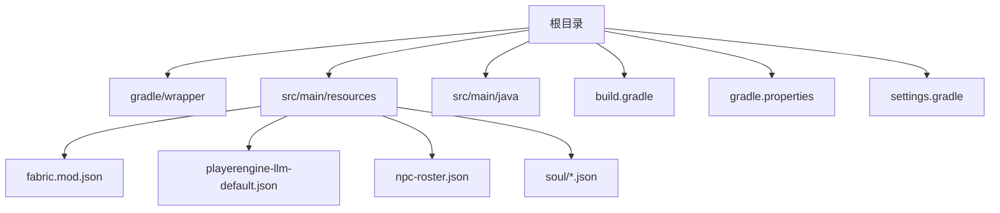
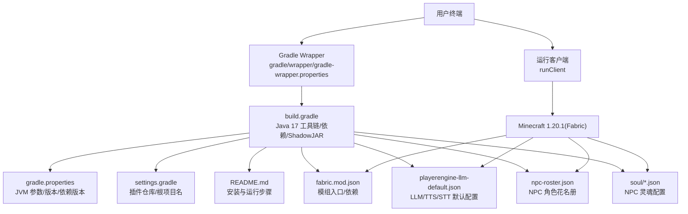
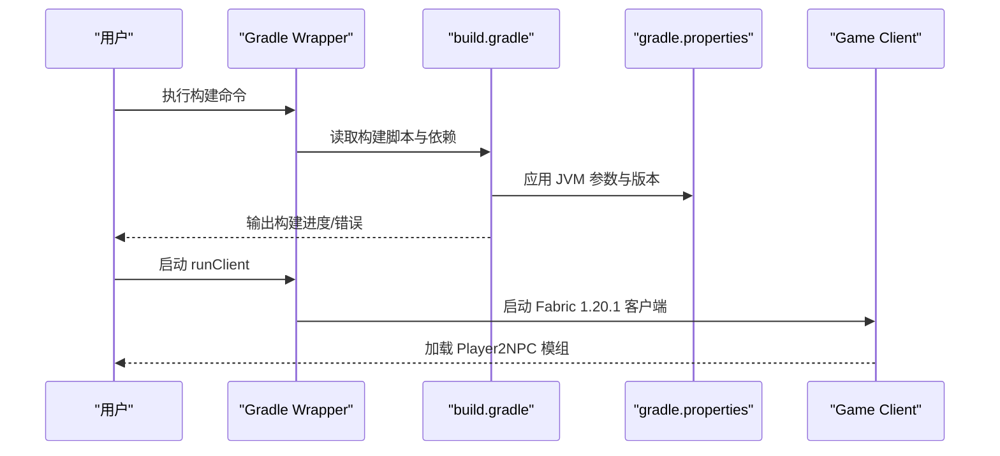
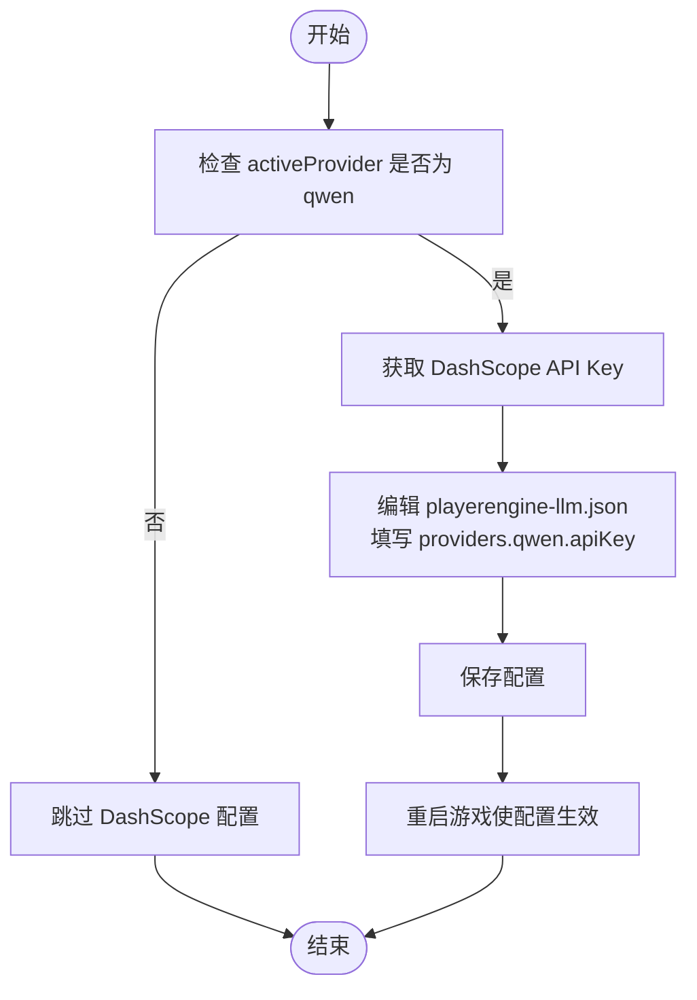
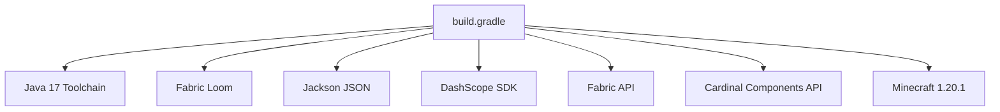

# 快速安装指南

<cite>
**本文引用的文件**
- [README.md](file://README.md)
- [build.gradle](file://build.gradle)
- [gradle.properties](file://gradle.properties)
- [settings.gradle](file://settings.gradle)
- [gradlew.bat](file://gradlew.bat)
- [gradle-wrapper.properties](file://gradle/wrapper/gradle-wrapper.properties)
- [fabric.mod.json](file://src/main/resources/fabric.mod.json)
- [playerengine-llm-default.json](file://src/main/resources/playerengine-llm-default.json)
- [npc-roster.json](file://src/main/resources/npc-roster.json)
- [soul_QiQi.json](file://src/main/resources/soul/soul_QiQi.json)
- [soul_Luna.json](file://src/main/resources/soul/soul_Luna.json)
- [Player2NPC.java](file://src/main/java/com/goodbird/player2npc/Player2NPC.java)
</cite>

## 目录
1. [简介](#简介)
2. [项目结构](#项目结构)
3. [核心组件](#核心组件)
4. [架构总览](#架构总览)
5. [详细组件分析](#详细组件分析)
6. [依赖分析](#依赖分析)
7. [性能考量](#性能考量)
8. [故障排查指南](#故障排查指南)
9. [结论](#结论)
10. [附录](#附录)

## 简介
本指南面向希望在本地快速搭建并运行 Minecraft AI Player2NPC（Fabric 1.20.1）的用户，目标是提供从环境准备、仓库克隆、构建到首次运行的完整流程，并针对 Windows、macOS、Linux 三大平台给出差异化操作建议与注意事项。同时，我们将重点说明如何获取与配置 DashScope API Key（用于阿里云通义千问与语音服务），以及如何正确编辑与应用核心配置文件，确保首次安装顺利、配置正确。

## 项目结构
该仓库采用标准的 Fabric 模组工程布局，核心目录与文件如下：
- gradle/wrapper：Gradle Wrapper，确保跨平台一致的构建环境
- src/main/resources：模组元数据、默认配置与资源
- src/main/java：Java 源码，包含模组入口、NPC 管理、网络通信与 AI 服务集成
- build.gradle、gradle.properties、settings.gradle：构建脚本与项目属性
- README.md：项目使用手册与安装说明

**图表来源**
- [fabric.mod.json](file://src/main/resources/fabric.mod.json)
- [playerengine-llm-default.json](file://src/main/resources/playerengine-llm-default.json)
- [npc-roster.json](file://src/main/resources/npc-roster.json)
- [soul_QiQi.json](file://src/main/resources/soul/soul_QiQi.json)

**章节来源**
- [README.md: 9-42:9-42](file://README.md#L9-L42)
- [build.gradle: 1-135:1-135](file://build.gradle#L1-L135)
- [gradle.properties: 18-35:18-35](file://gradle.properties#L18-L35)
- [settings.gradle: 17-28:17-28](file://settings.gradle#L17-L28)

## 核心组件
- 构建工具链
  - Gradle Wrapper：内置 Gradle 8.10，无需系统全局安装
  - Java Toolchain：强制使用 Java 17
  - Fabric Loom：提供 Fabric 模组构建与 remap 支持
- 模组入口与网络
  - Player2NPC 模组入口负责实体注册、网络事件监听与服务器 Tick 集成
- AI 与语音服务
  - LLM 提供商：qwen_local（本地 Ollama）、qwen（阿里云 DashScope）、openai、player2-remote
  - 语音服务：TTS（阿里云 CosyVoice）、STT（阿里云 DashScope Gummy）

**章节来源**
- [build.gradle: 9-69:9-69](file://build.gradle#L9-L69)
- [gradle.properties: 20-34:20-34](file://gradle.properties#L20-L34)
- [fabric.mod.json: 17-32:17-32](file://src/main/resources/fabric.mod.json#L17-L32)
- [playerengine-llm-default.json: 6-88:6-88](file://src/main/resources/playerengine-llm-default.json#L6-L88)
- [Player2NPC.java: 25-67:25-67](file://src/main/java/com/goodbird/player2npc/Player2NPC.java#L25-L67)

## 架构总览
下图展示了从用户执行构建命令到游戏客户端启动的总体流程，以及关键配置文件与依赖项的关联。

**图表来源**
- [gradle-wrapper.properties:1-6](file://gradle/wrapper/gradle-wrapper.properties#L1-L6)
- [build.gradle:1-135](file://build.gradle#L1-L135)
- [gradle.properties:18-35](file://gradle.properties#L18-L35)
- [settings.gradle:17-28](file://settings.gradle#L17-L28)
- [README.md:25-42](file://README.md#L25-L42)
- [fabric.mod.json:17-32](file://src/main/resources/fabric.mod.json#L17-L32)
- [playerengine-llm-default.json:1-89](file://src/main/resources/playerengine-llm-default.json#L1-L89)
- [npc-roster.json:1-54](file://src/main/resources/npc-roster.json#L1-L54)
- [soul_QiQi.json:1-61](file://src/main/resources/soul/soul_QiQi.json#L1-L61)

## 详细组件分析

### 环境准备与系统要求
- Java 17：项目强制使用 Java 17，确保 JAVA_HOME 指向正确版本
- Minecraft 1.20.1 + Fabric：模组基于 Fabric 1.20.1
- Gradle：使用内置 Wrapper（无需系统全局安装）
- 可选：Ollama（本地 AI 模型推理）

**章节来源**
- [README.md: 11-23:11-23](file://README.md#L11-L23)
- [build.gradle: 9](file://build.gradle#L9)
- [gradle.properties: 20](file://gradle.properties#L20)

### 仓库克隆与首次构建
- 步骤
  - 进入项目目录
  - 清理并构建：使用 Gradle Wrapper 执行构建
  - 启动开发客户端：验证构建结果
- 首次构建耗时较长，需下载大量 Minecraft 资源
- Windows 用户若遇到命令不可用，使用 gradlew.bat 替代

**图表来源**
- [README.md: 25-42:25-42](file://README.md#L25-L42)
- [gradlew.bat:1-90](file://gradlew.bat#L1-L90)
- [build.gradle: 11-135:11-135](file://build.gradle#L11-L135)
- [gradle.properties: 18-35:18-35](file://gradle.properties#L18-L35)

**章节来源**
- [README.md: 25-42:25-42](file://README.md#L25-L42)
- [gradlew.bat: 35-74:35-74](file://gradlew.bat#L35-L74)

### DashScope API Key 获取与配置
- 适用场景：使用阿里云通义千问（qwen）与语音服务（TTS/STT）
- 获取方式：登录阿里云 DashScope 控制台，创建 API Key
- 配置位置：在 LLM 配置文件中设置 providers.qwen.apiKey
- 注意事项：不要将 API Key 提交至公共仓库；STT 可复用 qwen 的 API Key

**图表来源**
- [playerengine-llm-default.json: 19-42:19-42](file://src/main/resources/playerengine-llm-default.json#L19-L42)
- [README.md: 70-137:70-137](file://README.md#L70-L137)

**章节来源**
- [playerengine-llm-default.json: 19-42:19-42](file://src/main/resources/playerengine-llm-default.json#L19-L42)
- [README.md: 70-137:70-137](file://README.md#L70-L137)

### 配置文件详解与最佳实践
- LLM/语音主配置（playerengine-llm.json）
  - activeProvider：当前生效的提供商（qwen_local/qwen/openai/player2-remote）
  - providers：各提供商的启用、URL、模型、token 上限与温度
  - proxy：HTTP 代理（国内访问海外服务时可能需要）
  - tts/stt：语音合成与识别的启用、模型、语言、音量与语速等
  - progressVoice：任务进度语音播报间隔
  - 最佳实践：首次运行前先启用 qwen_local 或 qwen，填写 apiKey 后重启游戏
- NPC 角色花名册（npc-roster.json）
  - 定义角色模板：id、name、大五人格、初始情绪与描述
  - 最佳实践：新增角色后重启游戏生效；保持 id 唯一
- NPC 灵魂配置（soul_*.json）
  - 定义人格矩阵、初始情绪、行为签名与运行时数据
  - 最佳实践：复制现有文件并修改数值，避免手动维护运行时字段
- Bot 行为配置（run/altoclef/altoclef_settings.json）
  - 控制 NPC 自动防御、自动进食、投掷物闪避、丢弃/保留物品列表等
  - 最佳实践：根据玩法调整丢弃/保留列表，避免误丢关键资源

**章节来源**
- [playerengine-llm-default.json: 6-88:6-88](file://src/main/resources/playerengine-llm-default.json#L6-L88)
- [README.md: 66-331:66-331](file://README.md#L66-L331)
- [npc-roster.json: 1-54:1-54](file://src/main/resources/npc-roster.json#L1-L54)
- [soul_QiQi.json: 1-61:1-61](file://src/main/resources/soul/soul_QiQi.json#L1-L61)
- [soul_Luna.json: 1-61:1-61](file://src/main/resources/soul/soul_Luna.json#L1-L61)

### 不同操作系统安装差异与注意事项
- Windows
  - 使用 gradlew.bat 替代 ./gradlew
  - 若出现“命令未找到”，检查 PATH 与批处理权限
- macOS/Linux
  - 首次运行需赋予 gradlew 执行权限（chmod +x gradlew）
  - 确保 JAVA_HOME 指向 Java 17
- 通用
  - 首次构建可能较慢，建议保持网络稳定
  - 如遇内存不足，可适当提高 org.gradle.jvmargs

**章节来源**
- [README.md: 42-63:42-63](file://README.md#L42-L63)
- [gradlew.bat: 35-74:35-74](file://gradlew.bat#L35-L74)
- [gradle.properties: 20](file://gradle.properties#L20)

## 依赖分析
- 构建阶段
  - Java Toolchain：固定 Java 17
  - Fabric Loom：提供 Fabric 模组构建与 remap
  - Jackson：JSON 处理
  - DashScope SDK：阿里云语音与 LLM 服务
- 运行阶段
  - Fabric API：模组生态
  - Cardinal Components API：模组组件系统
  - Minecraft 1.20.1：运行时环境

**图表来源**
- [build.gradle: 9, 43-69](file://build.gradle#L9,L43-L69)
- [gradle.properties: 26-31:26-31](file://gradle.properties#L26-L31)

**章节来源**
- [build.gradle: 9, 43-69](file://build.gradle#L9,L43-L69)
- [gradle.properties: 26-31:26-31](file://gradle.properties#L26-L31)

## 性能考量
- 首次构建耗时较长，主要由于下载 Minecraft 映射与依赖
- Gradle 已设置 -Xmx3G，若机器内存较小仍显不足，可在本地调整 org.gradle.jvmargs
- 启动客户端后，建议先启用轻量级 NPC（1-2 个），观察帧数后再逐步增加

## 故障排查指南
- “Unsupported class file major version”
  - 原因：Java 版本不是 17
  - 解决：确保 JAVA_HOME 指向 Java 17
- 构建卡住或 OutOfMemory
  - 原因：内存不足
  - 解决：提高 org.gradle.jvmargs 或减少并发
- 下载资源缓慢或超时
  - 原因：网络不稳定
  - 解决：保持网络畅通或使用镜像/加速器
- ./gradlew 命令找不到（Linux/Mac）
  - 原因：缺少执行权限
  - 解决：chmod +x gradlew
- Windows 报错找不到 java
  - 原因：JAVA_HOME 未设置或指向无效目录
  - 解决：设置正确的 JAVA_HOME 并确保 java.exe 可用

**章节来源**
- [README.md: 55-63:55-63](file://README.md#L55-L63)
- [gradlew.bat: 38-65:38-65](file://gradlew.bat#L38-L65)
- [gradle.properties: 20](file://gradle.properties#L20)

## 结论
按照本指南完成环境准备、仓库克隆与构建后，您即可在 Minecraft 1.20.1(Fabric) 中运行 Player2NPC 模组。建议优先启用 qwen_local 或 qwen，并在首次运行前完善 LLM/语音配置与 NPC 角色配置，随后通过游戏内指令生成并管理 NPC，逐步体验多 NPC 协作与情感交互的乐趣。

## 附录
- 快速命令清单（首次构建）
  - Windows：使用 gradlew.bat 执行构建与运行
  - macOS/Linux：赋予执行权限后使用 ./gradlew 执行构建与运行
- 配置文件位置
  - LLM 默认模板：src/main/resources/playerengine-llm-default.json
  - NPC 花名册：src/main/resources/npc-roster.json
  - NPC 灵魂配置：src/main/resources/soul/soul_*.json
  - 运行时配置：run/config/playerengine-llm.json（首次运行后生成）

**章节来源**
- [README.md: 25-42:25-42](file://README.md#L25-L42)
- [playerengine-llm-default.json:1-89](file://src/main/resources/playerengine-llm-default.json#L1-L89)
- [npc-roster.json:1-54](file://src/main/resources/npc-roster.json#L1-L54)
- [soul_QiQi.json:1-61](file://src/main/resources/soul/soul_QiQi.json#L1-L61)