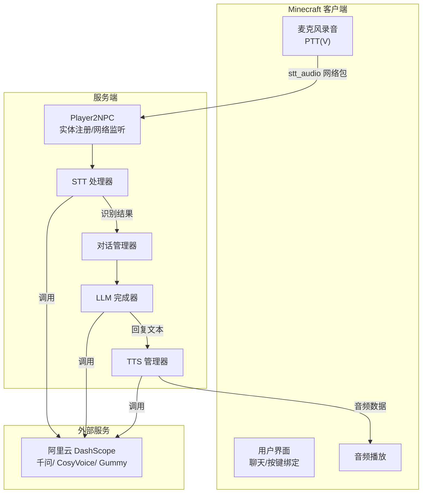
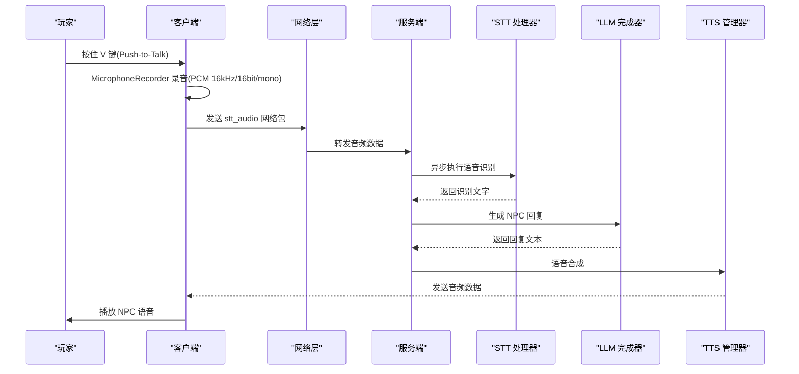
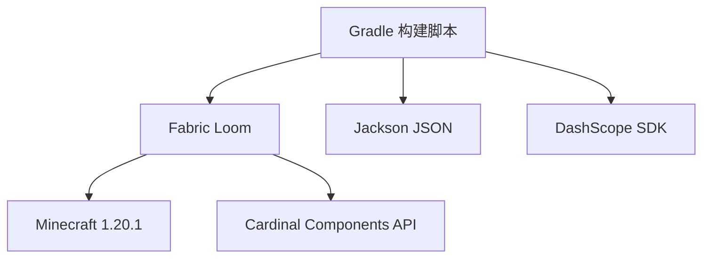

# 快速开始指南

<cite>
**本文引用的文件**
- [README.md](file://README.md)
- [build.gradle](file://build.gradle)
- [settings.gradle](file://settings.gradle)
- [gradle.properties](file://gradle.properties)
- [fabric.mod.json](file://src/main/resources/fabric.mod.json)
- [playerengine-llm-default.json](file://src/main/resources/playerengine-llm-default.json)
- [Player2APIService.java](file://src/main/java/adris/altoclef/player2api/Player2APIService.java)
- [Player2NPC.java](file://src/main/java/com/goodbird/player2npc/Player2NPC.java)
- [MicrophoneRecorder.java](file://src/main/java/com/goodbird/player2npc/client/audio/MicrophoneRecorder.java)
- [STTAudioPacket.java](file://src/main/java/com/goodbird/player2npc/network/STTAudioPacket.java)
- [TTSConfig.java](file://src/main/java/adris/altoclef/player2api/tts/TTSConfig.java)
- [STTConfig.java](file://src/main/java/adris/altoclef/player2api/stt/STTConfig.java)
- [ConfigResourceCopier.java](file://src/main/java/adris/altoclef/player2api/utils/ConfigResourceCopier.java)
</cite>

## 目录
1. [简介](#简介)
2. [项目结构](#项目结构)
3. [核心组件](#核心组件)
4. [架构总览](#架构总览)
5. [详细组件分析](#详细组件分析)
6. [依赖关系分析](#依赖关系分析)
7. [性能考虑](#性能考虑)
8. [故障排除指南](#故障排除指南)
9. [结论](#结论)
10. [附录](#附录)

## 简介
本指南面向新手用户，帮助你在30分钟内完成 Minecraft AI玩家转NPC项目的完整安装与首次运行。你将获得从环境准备（Java 17、DashScope API Key）、项目克隆、首次构建到游戏启动的全流程步骤，并掌握首次运行后的基础配置（LLM、TTS、STT），以及验证安装成功的方法和常见问题的排查思路。

## 项目结构
该项目是一个基于 Fabric 的 Minecraft Mod，核心模块包括：
- AI NPC 与对话系统：负责 NPC 的生成、行为控制、对话管理与 LLM 集成
- 语音子系统：支持 STT（语音转文字）与 TTS（文字转语音），默认对接阿里云 DashScope
- 客户端与网络：负责麦克风录音、网络包收发与音频播放
- 配置系统：运行时自动生成配置文件，支持 LLM、TTS、STT 的参数调整

图表来源
- [Player2NPC.java:48-65](file://src/main/java/com/goodbird/player2npc/Player2NPC.java#L48-L65)
- [STTAudioPacket.java:39-121](file://src/main/java/com/goodbird/player2npc/network/STTAudioPacket.java#L39-L121)
- [Player2APIService.java:120-231](file://src/main/java/adris/altoclef/player2api/Player2APIService.java#L120-L231)

章节来源
- [README.md:44-686](file://README.md#L44-L686)
- [build.gradle:1-135](file://build.gradle#L1-L135)
- [fabric.mod.json:17-28](file://src/main/resources/fabric.mod.json#L17-L28)

## 核心组件
- 环境与构建
  - Java 17 强制要求，Gradle 8.x（项目自带 Wrapper）
  - Minecraft 1.20.1，Fabric Loom 自动下载资源
- 配置系统
  - 首次运行自动生成配置文件，包含 LLM、TTS、STT 三大子系统
  - 默认模板位于资源目录，运行时复制到 run/config/
- 语音子系统
  - STT：阿里云 Gummy 实时语音转写，支持中文/英文等语言
  - TTS：阿里云 CosyVoice 语音合成，支持多种音色与情绪参数
- 网络与实体
  - 服务端注册 NPC 实体与网络包处理器
  - 客户端负责麦克风录音与音频播放

章节来源
- [README.md:101-135](file://README.md#L101-L135)
- [playerengine-llm-default.json:1-89](file://src/main/resources/playerengine-llm-default.json#L1-L89)
- [ConfigResourceCopier.java:29-57](file://src/main/java/adris/altoclef/player2api/utils/ConfigResourceCopier.java#L29-L57)

## 架构总览
下面的序列图展示了从玩家按住 V 键录音到 NPC 回复的完整流程：

图表来源
- [MicrophoneRecorder.java:62-153](file://src/main/java/com/goodbird/player2npc/client/audio/MicrophoneRecorder.java#L62-L153)
- [STTAudioPacket.java:39-121](file://src/main/java/com/goodbird/player2npc/network/STTAudioPacket.java#L39-L121)
- [Player2APIService.java:120-231](file://src/main/java/adris/altoclef/player2api/Player2APIService.java#L120-L231)

## 详细组件分析

### 环境准备与安装
- Java 17
  - macOS/Linux/Windows 均可安装，确保 JAVA_HOME 指向 Java 17
  - 建议在 gradle.properties 中固定 org.gradle.java.home，避免每次重新设置
- Gradle 8.x
  - 使用项目自带的 Gradle Wrapper，无需手动安装
- Minecraft 1.20.1
  - Fabric Loom 自动下载，首次构建会较慢
- DashScope API Key
  - 用于 LLM 与 TTS/CosyVoice，首次运行后在配置文件中填写

章节来源
- [README.md:57-111](file://README.md#L57-L111)
- [gradle.properties:34](file://gradle.properties#L34)

### 项目克隆与首次构建
- 克隆仓库并进入目录
- 确保使用 Java 17，验证版本
- 执行构建并启动客户端：./gradlew clean runClient
- 首次构建会下载依赖与资源，耗时约 5-15 分钟

章节来源
- [README.md:112-135](file://README.md#L112-L135)

### 首次运行后的基础配置
- 自动生成的配置文件
  - playerengine-llm.json：LLM、TTS、STT 总开关与参数
  - altoclef_settings.json：Bot 行为参数
  - altoclef/configs/*：子系统配置
- LLM 配置
  - activeProvider：当前使用的 LLM 提供商
  - providers.qwen.apiKey：DashScope API Key
  - providers.qwen.model：推荐 qwen-plus 或 qwen-turbo
- TTS 配置
  - tts.enabled：是否启用语音合成
  - tts.model：cosyvoice-v3-flash（默认）
  - tts.voice：longanhuan（默认欢脱元气女）
- STT 配置
  - stt.enabled：是否启用语音识别
  - stt.model：gummy-chat-v1（默认）
  - stt.language：zh（中文）

章节来源
- [README.md:162-222](file://README.md#L162-L222)
- [playerengine-llm-default.json:9-88](file://src/main/resources/playerengine-llm-default.json#L9-L88)

### 验证安装成功
- 启动游戏后，进入单人世界
- 按 H 键打开 NPC 角色选择界面，生成 NPC
- 按 T 键进行文字对话，或按住 V 键进行语音输入
- 查看日志文件 run/logs/latest.log，关注 LLM/STT/TTS 相关输出
- 常见日志关键词：LLM config loaded、Routing chat completion to provider、Synthesis successful、Recognition result

章节来源
- [README.md:397-491](file://README.md#L397-L491)

## 依赖关系分析
- 构建脚本依赖
  - Fabric Loom、Shadow Jar、Jackson JSON、DashScope SDK
  - 清理任务会删除运行时配置，确保每次 clean runClient 都使用最新默认模板
- 运行时依赖
  - Fabric API、Minecraft 1.20.1、Cardinal Components API
  - Mixin 配置用于与游戏引擎交互

图表来源
- [build.gradle:43-69](file://build.gradle#L43-L69)

章节来源
- [build.gradle:1-135](file://build.gradle#L1-L135)
- [settings.gradle:17-26](file://settings.gradle#L17-L26)
- [fabric.mod.json:33-46](file://src/main/resources/fabric.mod.json#L33-L46)

## 性能考虑
- 首次构建耗时较长，建议使用稳定的网络或配置镜像加速
- LLM 调用为异步流式处理，避免阻塞游戏主线程
- TTS/STT 建议使用合适的模型与参数，平衡质量与延迟
- 若网络受限，可在配置中启用代理

## 故障排除指南
- Java 版本问题
  - 症状：Unsupported class file major version
  - 处理：确保 JAVA_HOME 指向 Java 17，或在 gradle.properties 中设置 org.gradle.java.home
- 构建依赖失败
  - 症状：Could not resolve dependencies
  - 处理：检查网络，配置阿里云 Maven 镜像，或使用代理
- API Key 无效
  - 症状：401/403 错误
  - 处理：前往 DashScope 控制台重新获取 API Key，并更新配置文件
- 语音相关问题
  - 症状：录音时间太短、麦克风不可用、识别为空
  - 处理：确保录音至少 0.5 秒；检查系统麦克风权限；确认 STT 已启用且 API Key 正确
- NPC 不回复
  - 处理：确认 NPC 在 64 格以内；查看日志中 Routing 与 Completion 相关输出

章节来源
- [README.md:136-157](file://README.md#L136-L157)
- [README.md:480-491](file://README.md#L480-L491)

## 结论
按照本指南，你可以在30分钟内完成从环境准备到首次运行的全部流程，并掌握 LLM、TTS、STT 的基础配置方法。遇到问题时，可依据日志与常见问题排查指引快速定位原因。随着对配置文件的进一步熟悉，你可以根据需要调整模型、音色与行为参数，获得更佳的体验。

## 附录

### 快速命令清单
- 克隆与进入目录
  - git clone ... && cd ...
- 确认 Java 17
  - export JAVA_HOME=$(...)/java-17 && java -version
- 首次构建与启动
  - ./gradlew clean runClient
- 后续运行
  - ./gradlew runClient

章节来源
- [README.md:112-135](file://README.md#L112-L135)