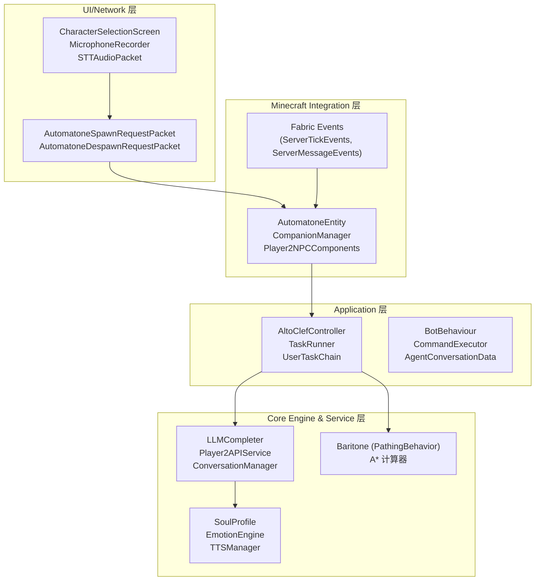
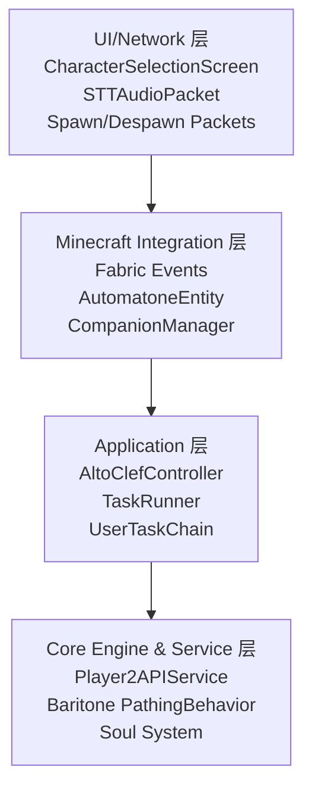
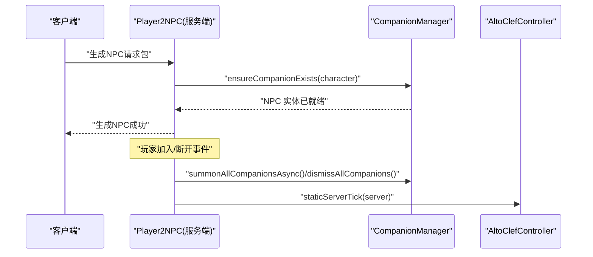
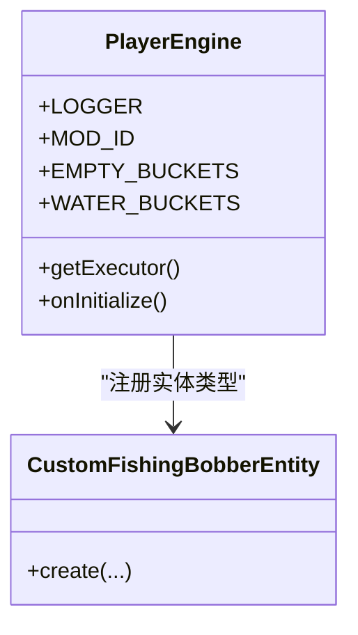
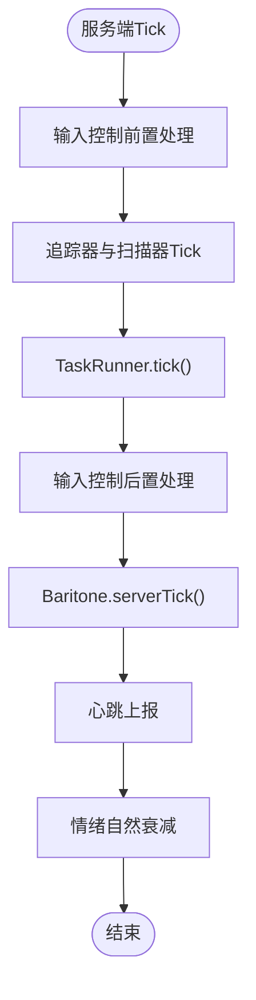
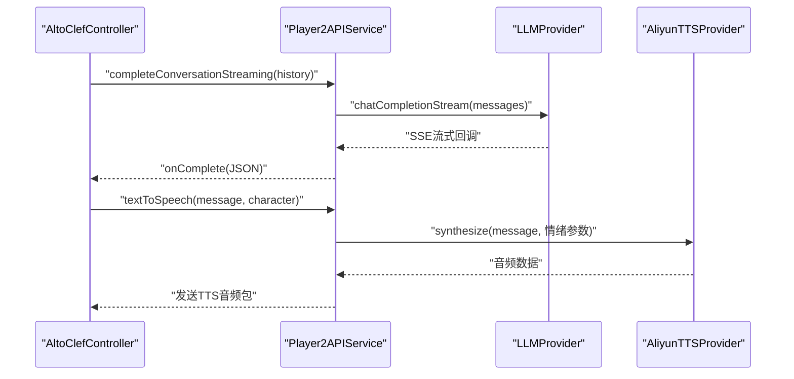
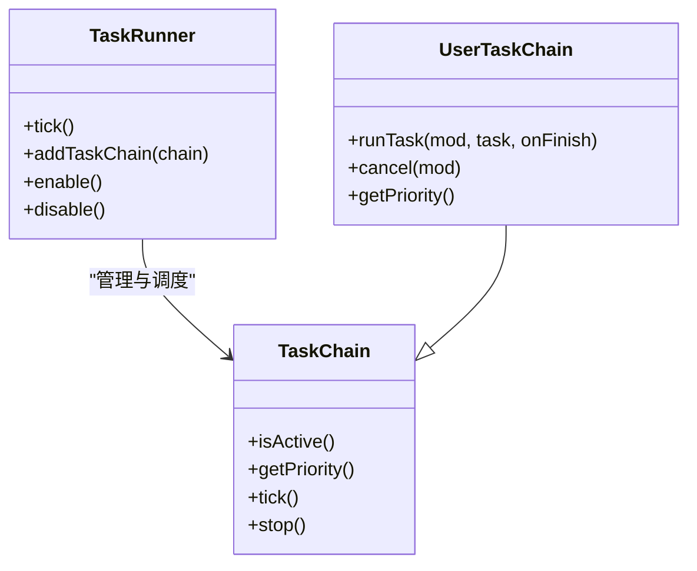
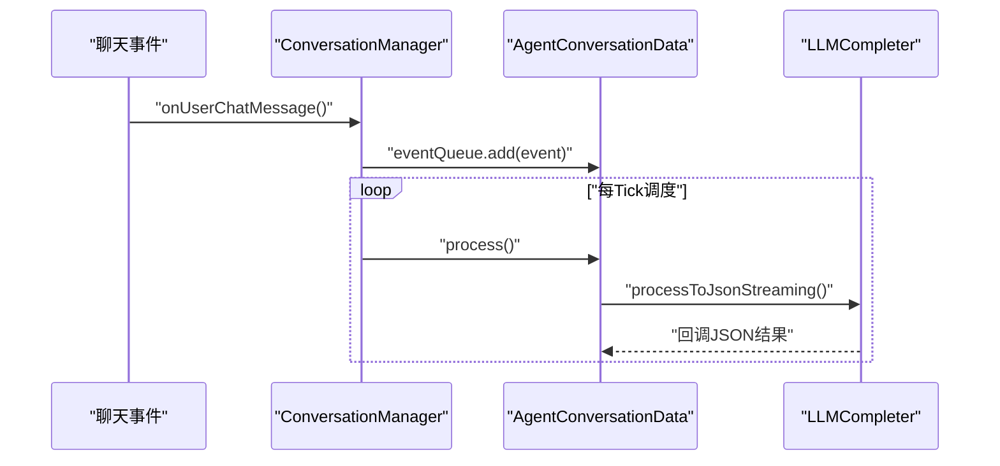
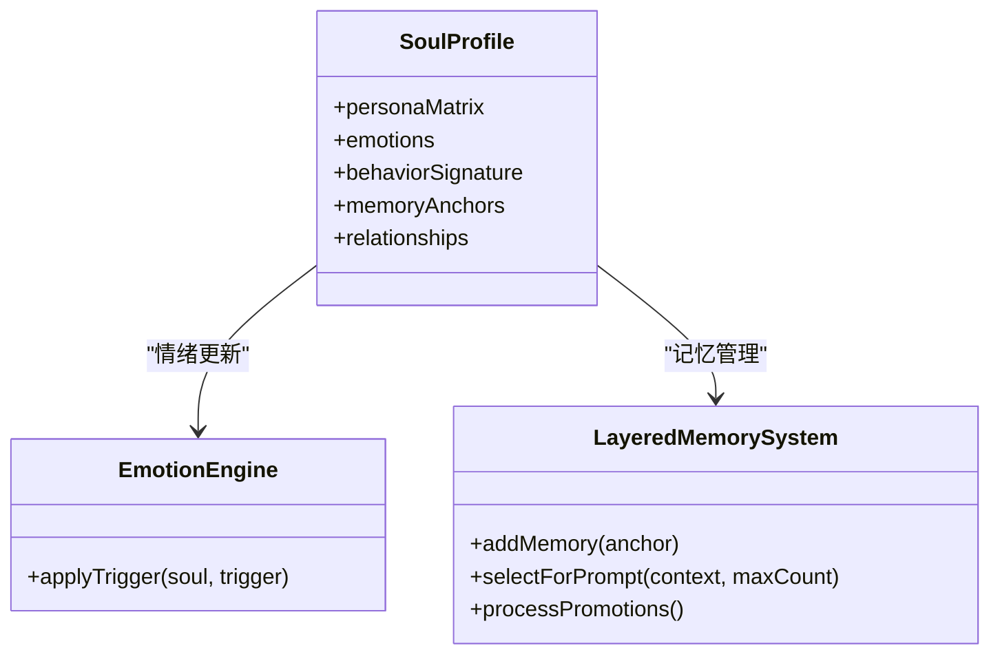
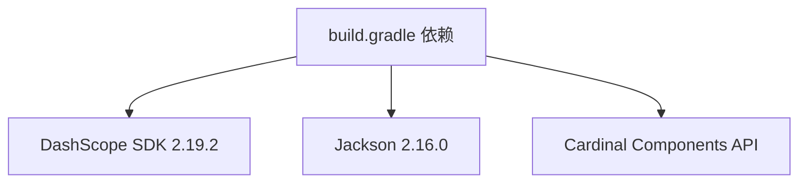

# 技术架构背景

<cite>
**本文档引用的文件**
- [README.md](file://README.md)
- [build.gradle](file://build.gradle)
- [fabric.mod.json](file://src/main/resources/fabric.mod.json)
- [Player2NPC.java](file://src/main/java/com/goodbird/player2npc/Player2NPC.java)
- [PlayerEngine.java](file://src/main/java/baritone/PlayerEngine.java)
- [AltoClefController.java](file://src/main/java/adris/altoclef/AltoClefController.java)
- [Player2APIService.java](file://src/main/java/adris/altoclef/player2api/Player2APIService.java)
- [AutomatoneSpawnRequestPacket.java](file://src/main/java/com/goodbird/player2npc/network/AutomatoneSpawnRequestPacket.java)
- [TaskRunner.java](file://src/main/java/adris/altoclef/tasksystem/TaskRunner.java)
- [UserTaskChain.java](file://src/main/java/adris/altoclef/chains/UserTaskChain.java)
- [EventBus.java](file://src/main/java/adris/altoclef/eventbus/EventBus.java)
- [LayeredMemorySystem.java](file://src/main/java/adris/altoclef/player2api/memory/LayeredMemorySystem.java)
- [EmotionEngine.java](file://src/main/java/adris/altoclef/player2api/soul/EmotionEngine.java)
- [AI_NPC项目整体架构概览.md](file://docs/AI_NPC项目整体架构概览.md)
</cite>

## 目录
1. [引言](#引言)
2. [项目结构](#项目结构)
3. [核心组件](#核心组件)
4. [架构总览](#架构总览)
5. [详细组件分析](#详细组件分析)
6. [依赖分析](#依赖分析)
7. [性能考量](#性能考量)
8. [故障排除指南](#故障排除指南)
9. [结论](#结论)

## 引言
本项目为基于 Minecraft 1.20.1 Fabric 的 AI NPC 模组，融合了 LLM 驱动的智能对话、Baritone 路径规划引擎与多层 NPC 人格系统，实现可自然交流、执行复杂指令、自主导航与战斗的智能伙伴。项目采用四层分层架构，自上而下分别为 UI/Network 层、Minecraft Integration 层、Application 层与 Core Engine & Service 层，并通过策略模式、观察者模式、责任链模式等设计模式支撑功能实现。

## 项目结构
项目源码主要分为三个包：
- adris/altoclef/：AI 任务执行系统与 LLM 对话集成层
- baritone/：路径规划引擎（Baritone）分支与桥接
- com/goodbird/player2npc/：Player2NPC 集成层，负责实体管理、网络协议与客户端交互

图表来源
- [AI_NPC项目整体架构概览.md:61-91](file://docs/AI_NPC项目整体架构概览.md#L61-L91)
- [fabric.mod.json:17-46](file://src/main/resources/fabric.mod.json#L17-L46)

章节来源
- [AI_NPC项目整体架构概览.md:94-281](file://docs/AI_NPC项目整体架构概览.md#L94-L281)

## 核心组件
- Player2NPC：服务端入口，注册 NPC 实体、网络包处理器与 Fabric 生命周期事件监听，负责 NPC 的生成、销毁与心跳上报。
- PlayerEngine：Baritone 分支入口，注册默认命令与自定义实体类型，提供线程池用于异步处理。
- AltoClefController：AI 核心控制器，统一管理任务执行、行为链、Baritone 设置、对话服务与持久化数据。
- Player2APIService：LLM/TTS/STT 统一服务入口，支持多提供商策略与流式/非流式调用。
- TaskRunner 与 UserTaskChain：任务调度与用户任务链，采用责任链模式按优先级执行。
- ConversationManager：全局对话调度中心，基于观察者模式驱动事件队列与 LLM 调用。
- Soul 系统：基于四层结构的人格与情感系统，通过情绪引擎与记忆系统实现 NPC 个性化表现。

章节来源
- [Player2NPC.java:48-65](file://src/main/java/com/goodbird/player2npc/Player2NPC.java#L48-L65)
- [PlayerEngine.java:47-58](file://src/main/java/baritone/PlayerEngine.java#L47-L58)
- [AltoClefController.java:101-152](file://src/main/java/adris/altoclef/AltoClefController.java#L101-L152)
- [Player2APIService.java:43-118](file://src/main/java/adris/altoclef/player2api/Player2APIService.java#L43-L118)
- [TaskRunner.java:22-58](file://src/main/java/adris/altoclef/tasksystem/TaskRunner.java#L22-L58)
- [UserTaskChain.java:144-180](file://src/main/java/adris/altoclef/chains/UserTaskChain.java#L144-L180)

## 架构总览
四层架构设计与职责划分如下：
- UI/Network 层：负责用户界面与网络协议，通过 Fabric 网络包与服务端通信，实现 NPC 生成/销毁与语音数据传输。
- Minecraft Integration 层：监听 Fabric 生命周期事件，注入 NPC 实体与 Cardinal Components，协调服务端状态。
- Application 层：调度 AI 行为链与任务执行，处理指令解析与对话事件，维持 NPC 的行为一致性。
- Core Engine & Service 层：提供 LLM 推理、路径规划、语音合成/识别与 NPC 灵魂系统等核心能力。

图表来源
- [AI_NPC项目整体架构概览.md:61-91](file://docs/AI_NPC项目整体架构概览.md#L61-L91)

章节来源
- [AI_NPC项目整体架构概览.md:61-91](file://docs/AI_NPC项目整体架构概览.md#L61-L91)

## 详细组件分析

### Player2NPC 服务端集成
- 注册 NPC 实体类型与网络包处理器，监听玩家连接/断开事件，实现 NPC 的自动召唤与解散。
- 通过 Fabric 生命周期事件在服务端每 tick 调用 AltoClefController 的静态 tick 方法，维持 AI 状态更新。

图表来源
- [Player2NPC.java:52-64](file://src/main/java/com/goodbird/player2npc/Player2NPC.java#L52-L64)
- [AutomatoneSpawnRequestPacket.java:57-65](file://src/main/java/com/goodbird/player2npc/network/AutomatoneSpawnRequestPacket.java#L57-L65)

章节来源
- [Player2NPC.java:48-65](file://src/main/java/com/goodbird/player2npc/Player2NPC.java#L48-L65)
- [AutomatoneSpawnRequestPacket.java:57-65](file://src/main/java/com/goodbird/player2npc/network/AutomatoneSpawnRequestPacket.java#L57-L65)

### PlayerEngine（Baritone 分支）桥接
- 注册默认命令与自定义实体类型（钓鱼浮漂），提供线程池用于异步任务处理，作为 AI 行为与路径引擎的桥梁。

图表来源
- [PlayerEngine.java:24-58](file://src/main/java/baritone/PlayerEngine.java#L24-L58)

章节来源
- [PlayerEngine.java:47-58](file://src/main/java/baritone/PlayerEngine.java#L47-L58)

### AltoClefController（AI 核心控制器）
- 统一管理任务执行、行为链、Baritone 设置、命令系统与对话服务，维护 NPC 生存监控与情绪衰减逻辑。
- 在每 tick 调用 TaskRunner.tick 与 Baritone.serverTick，确保 AI 行为与路径规划的连续性。

图表来源
- [AltoClefController.java:154-170](file://src/main/java/adris/altoclef/AltoClefController.java#L154-L170)

章节来源
- [AltoClefController.java:101-152](file://src/main/java/adris/altoclef/AltoClefController.java#L101-L152)
- [AltoClefController.java:154-170](file://src/main/java/adris/altoclef/AltoClefController.java#L154-L170)

### Player2APIService（LLM/TTS/STT 统一服务）
- 提供同步/流式 LLM 调用、TTS 合成与 STT 控制，支持多提供商策略（阿里云 DashScope、本地 Ollama、OpenAI 兼容）。
- TTS 根据 NPC 情绪动态调整语速与音调，通过 Fabric 网络包将音频数据发送至客户端播放。

图表来源
- [Player2APIService.java:109-118](file://src/main/java/adris/altoclef/player2api/Player2APIService.java#L109-L118)
- [Player2APIService.java:120-231](file://src/main/java/adris/altoclef/player2api/Player2APIService.java#L120-L231)

章节来源
- [Player2APIService.java:48-118](file://src/main/java/adris/altoclef/player2api/Player2APIService.java#L48-L118)
- [Player2APIService.java:120-231](file://src/main/java/adris/altoclef/player2api/Player2APIService.java#L120-L231)

### 任务系统（责任链模式）
- TaskRunner 每 tick 选择最高优先级的活跃 TaskChain 执行，UserTaskChain 承载用户指令任务，优先级高于生存与防御链。
- 通过链式结构实现行为的抢占与协作，确保高优先级任务（如防御）能够打断低优先级任务。

图表来源
- [TaskRunner.java:22-58](file://src/main/java/adris/altoclef/tasksystem/TaskRunner.java#L22-L58)
- [UserTaskChain.java:144-180](file://src/main/java/adris/altoclef/chains/UserTaskChain.java#L144-L180)

章节来源
- [TaskRunner.java:22-98](file://src/main/java/adris/altoclef/tasksystem/TaskRunner.java#L22-L98)
- [UserTaskChain.java:144-236](file://src/main/java/adris/altoclef/chains/UserTaskChain.java#L144-L236)

### 对话系统（观察者模式）
- 基于 Fabric 事件与内部 EventBus，将聊天消息转化为事件队列，按 tick 调度处理，支持关键词拦截与流式 LLM 输出。
- 通过 ConversationManager 与 AgentConversationData 实现事件驱动的对话生命周期管理。

图表来源
- [AI_NPC项目整体架构概览.md:527-569](file://docs/AI_NPC项目整体架构概览.md#L527-L569)
- [EventBus.java:14-42](file://src/main/java/adris/altoclef/eventbus/EventBus.java#L14-L42)

章节来源
- [AI_NPC项目整体架构概览.md:319-369](file://docs/AI_NPC项目整体架构概览.md#L319-L369)
- [EventBus.java:14-69](file://src/main/java/adris/altoclef/eventbus/EventBus.java#L14-L69)

### NPC 灵魂系统（策略/分层/事件）
- 四层结构：人格矩阵（OCEAN）、情绪状态（8 种）、行为签名、记忆与关系。
- 情绪引擎根据游戏事件触发器更新 NPC 情绪，记忆系统采用分层结构与晋升/淘汰策略，支持 Prompt 注入与检索。

图表来源
- [EmotionEngine.java:17-171](file://src/main/java/adris/altoclef/player2api/soul/EmotionEngine.java#L17-L171)
- [LayeredMemorySystem.java:30-129](file://src/main/java/adris/altoclef/player2api/memory/LayeredMemorySystem.java#L30-L129)

章节来源
- [EmotionEngine.java:17-184](file://src/main/java/adris/altoclef/player2api/soul/EmotionEngine.java#L17-L184)
- [LayeredMemorySystem.java:10-172](file://src/main/java/adris/altoclef/player2api/memory/LayeredMemorySystem.java#L10-L172)

## 依赖分析
- 构建与运行环境：JDK 17、Minecraft 1.20.1、Fabric Loader 与 Fabric API。
- 外部依赖：Jackson JSON 库、阿里云 DashScope SDK（TTS/CosyVoice）、Cardinal Components API（CCA）。
- 模块入口：fabric.mod.json 中声明的 main/client/entrypoints 与 mixin 配置。

图表来源
- [build.gradle:43-69](file://build.gradle#L43-L69)

章节来源
- [build.gradle:43-69](file://build.gradle#L43-L69)
- [fabric.mod.json:17-46](file://src/main/resources/fabric.mod.json#L17-L46)

## 性能考量
- 异步处理：LLM 与 TTS 通过独立线程池异步执行，避免阻塞服务端 Tick。
- 路径规划：Baritone 的 A* 计算异步执行，配合区块缓存与路径预计算减少重复计算。
- 冷却与节流：对话响应冷却、TTS 去重与序列号淘汰机制，防止过度请求与音频堆积。
- 资源管理：线程池配置与内存态分层（核心/长期/短期记忆）平衡性能与表现。

## 故障排除指南
- 构建问题：确认 JAVA_HOME 指向 JDK 17，必要时增大 Gradle 内存参数。
- 网络问题：国内用户使用阿里云 DashScope 时，确保 API Key 配置正确；OpenAI 用户可启用代理。
- 配置文件：修改 playerengine-llm.json 后需重启游戏生效；TTS/STT 需在配置中启用并正确填写密钥。
- NPC 行为异常：检查 UserTaskChain 的用户命令激活状态与 TaskRunner 的链优先级；确认 Baritone 设置未被错误覆盖。

章节来源
- [README.md:55-63](file://README.md#L55-L63)
- [README.md:70-137](file://README.md#L70-L137)

## 结论
本项目通过四层架构与多种设计模式，实现了 Minecraft 1.20.1 Fabric 环境下的智能 NPC 系统。Player2NPC 与 PlayerEngine 的集成确保了 NPC 的实体注入与网络通信，AltoClefController 与 TaskRunner 提供稳定的 AI 行为调度，Player2APIService 与 Baritone 则分别承担 LLM/TTS/STT 与路径规划两大核心能力。Soul 系统与记忆/关系管理进一步增强了 NPC 的个性化与沉浸感。整体架构在可扩展性、可维护性与性能之间取得良好平衡，为后续功能扩展与生态建设奠定了坚实基础。