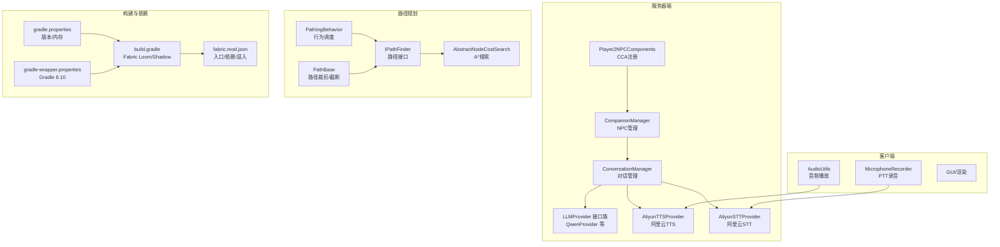
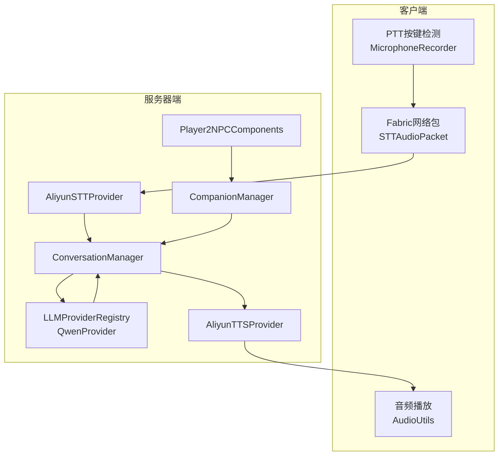
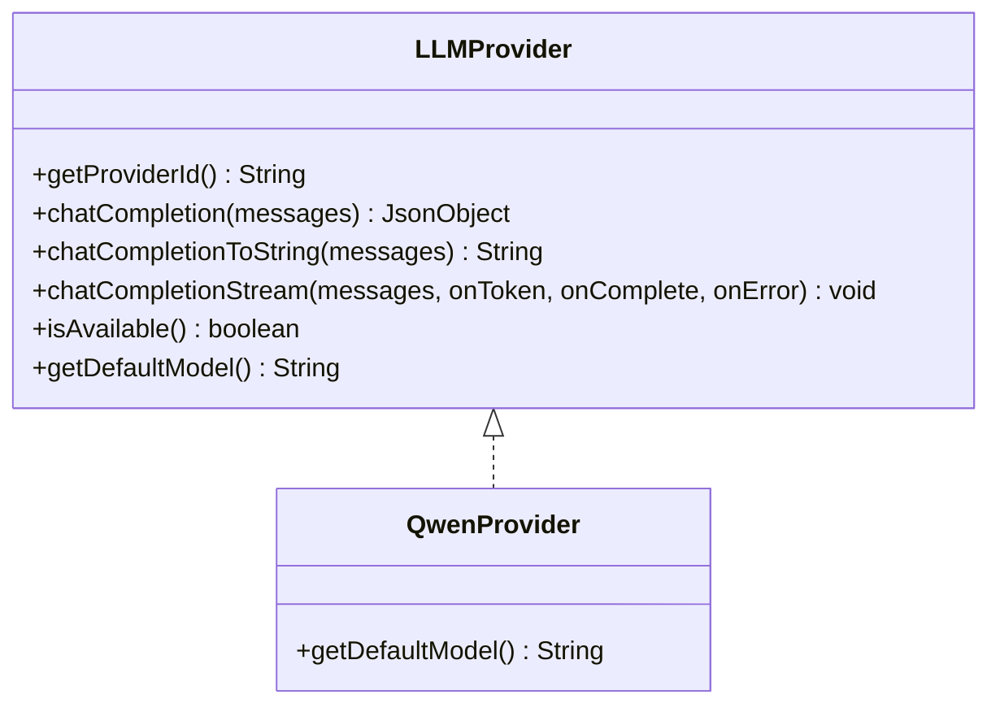
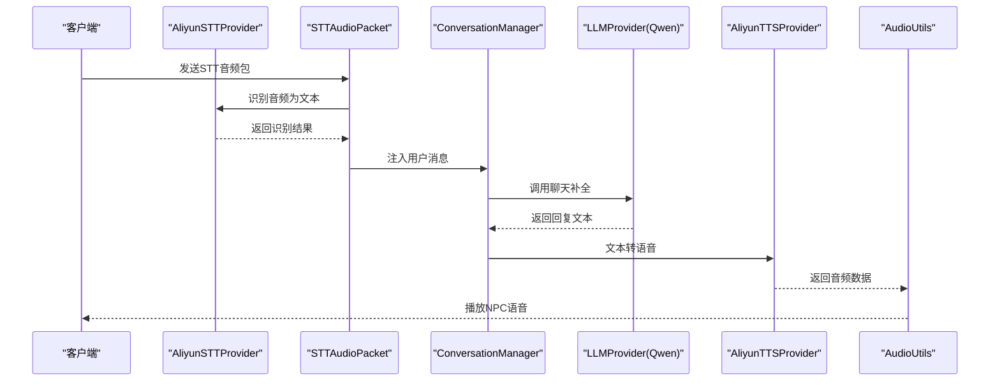
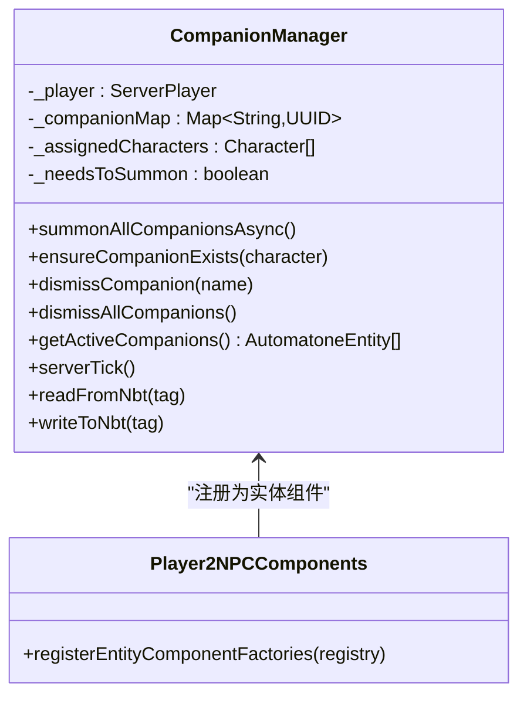
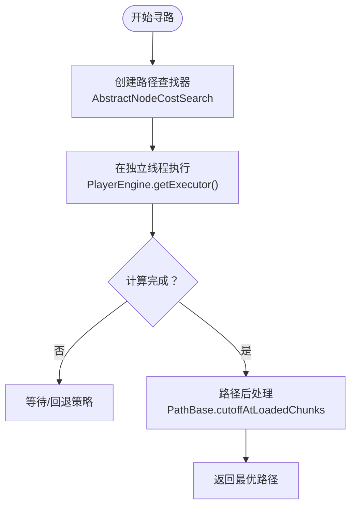
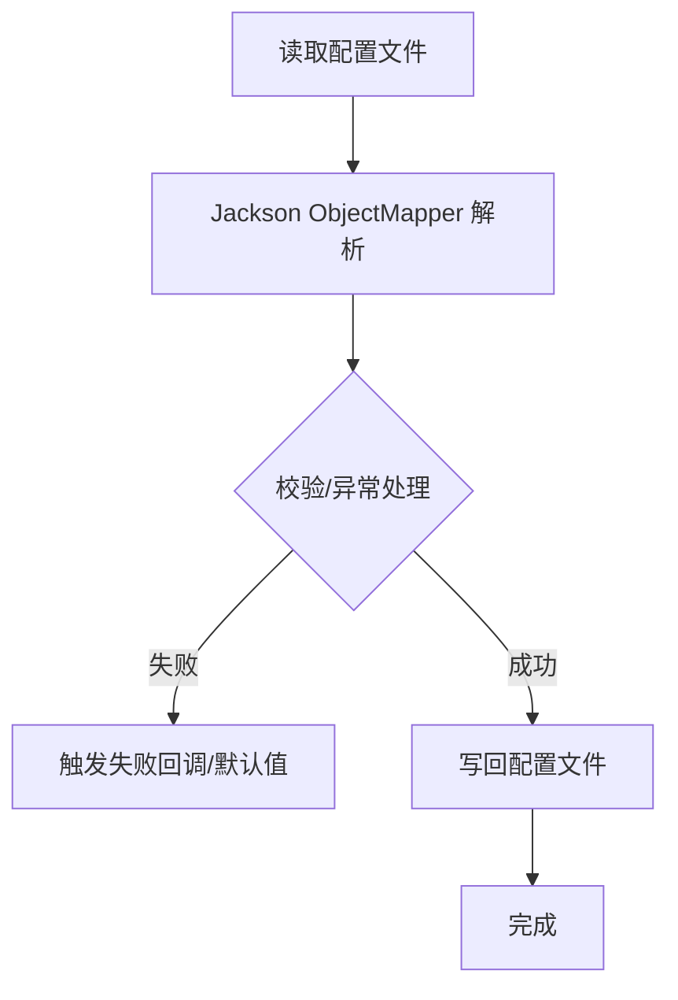
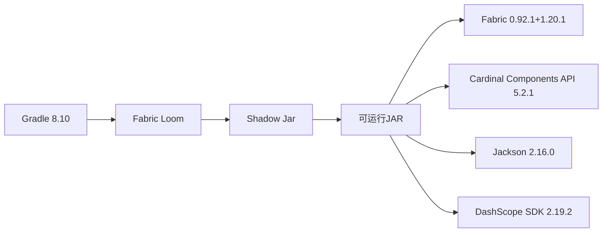

# 技术栈说明

<cite>
**本文引用的文件**
- [build.gradle](file://build.gradle)
- [gradle.properties](file://gradle.properties)
- [settings.gradle](file://settings.gradle)
- [gradle-wrapper.properties](file://gradle/wrapper/gradle-wrapper.properties)
- [fabric.mod.json](file://src/main/resources/fabric.mod.json)
- [README.md](file://README.md)
- [LLMProvider.java](file://src/main/java/adris/altoclef/player2api/llm/LLMProvider.java)
- [AliyunTTSProvider.java](file://src/main/java/adris/altoclef/player2api/tts/AliyunTTSProvider.java)
- [AliyunSTTProvider.java](file://src/main/java/adris/altoclef/player2api/stt/AliyunSTTProvider.java)
- [QwenProvider.java](file://src/main/java/adris/altoclef/player2api/llm/impl/QwenProvider.java)
- [ConversationManager.java](file://src/main/java/adris/altoclef/player2api/manager/ConversationManager.java)
- [CompanionManager.java](file://src/main/java/com/goodbird/player2npc/companion/CompanionManager.java)
- [Player2NPCComponents.java](file://src/main/java/com/goodbird/player2npc/Player2NPCComponents.java)
- [AbstractNodeCostSearch.java](file://src/main/java/baritone/pathing/calc/AbstractNodeCostSearch.java)
- [PathingBehavior.java](file://src/main/java/baritone/behavior/PathingBehavior.java)
- [PathBase.java](file://src/main/java/baritone/utils/pathing/PathBase.java)
- [IPathFinder.java](file://src/main/java/baritone/api/pathing/calc/IPathFinder.java)
- [AbstractVectorDeserializer.java](file://src/main/java/adris/altoclef/util/serialization/AbstractVectorDeserializer.java)
- [ConfigHelper.java](file://src/main/java/adris/altoclef/util/helpers/ConfigHelper.java)
- [Utils.java](file://src/main/java/adris/altoclef/player2api/utils/Utils.java)
</cite>

## 目录
1. [引言](#引言)
2. [项目结构](#项目结构)
3. [核心组件](#核心组件)
4. [架构总览](#架构总览)
5. [详细组件分析](#详细组件分析)
6. [依赖关系分析](#依赖关系分析)
7. [性能考量](#性能考量)
8. [故障排查指南](#故障排查指南)
9. [结论](#结论)
10. [附录](#附录)

## 引言
本项目是一个基于 Minecraft 1.20.1 Fabric 的 AI 玩家转 NPC Mod，核心目标是通过大语言模型（LLM）驱动 NPC，使其具备自然语言对话、语音交互、路径规划与任务执行能力。技术栈围绕 Fabric API、Baritone 路径引擎、DashScope 阿里云服务、Jackson JSON 处理以及 Cardinal Components API（CCA）展开，形成“服务器端 AI 对话 + 客户端语音播放”的完整闭环。

## 项目结构
项目采用“模块化 + 层次化”的组织方式：
- 服务器端核心：AI 对话、LLM Provider、TTS/STT、NPC 管理与事件调度
- 客户端核心：语音录制（PTT）、音频播放、渲染与 GUI
- 路径规划：基于 Baritone 的寻路计算与移动执行
- 组件系统：基于 CCA 的实体/世界组件扩展
- 构建与依赖：Gradle 8.x + Fabric Loom + Shadow Jar

图表来源
- [build.gradle:1-135](file://build.gradle#L1-L135)
- [gradle.properties:18-35](file://gradle.properties#L18-L35)
- [gradle-wrapper.properties:1-6](file://gradle/wrapper/gradle-wrapper.properties#L1-L6)
- [fabric.mod.json:17-46](file://src/main/resources/fabric.mod.json#L17-L46)
- [ConversationManager.java:1-206](file://src/main/java/adris/altoclef/player2api/manager/ConversationManager.java#L1-L206)
- [CompanionManager.java:1-191](file://src/main/java/com/goodbird/player2npc/companion/CompanionManager.java#L1-L191)
- [Player2NPCComponents.java:1-16](file://src/main/java/com/goodbird/player2npc/Player2NPCComponents.java#L1-L16)
- [PathingBehavior.java:401-437](file://src/main/java/baritone/behavior/PathingBehavior.java#L401-L437)
- [IPathFinder.java:1-17](file://src/main/java/baritone/api/pathing/calc/IPathFinder.java#L1-L17)
- [AbstractNodeCostSearch.java:16-62](file://src/main/java/baritone/pathing/calc/AbstractNodeCostSearch.java#L16-L62)
- [PathBase.java:1-38](file://src/main/java/baritone/utils/pathing/PathBase.java#L1-L38)

章节来源
- [build.gradle:1-135](file://build.gradle#L1-L135)
- [gradle.properties:18-35](file://gradle.properties#L18-L35)
- [settings.gradle:17-28](file://settings.gradle#L17-L28)
- [gradle-wrapper.properties:1-6](file://gradle/wrapper/gradle-wrapper.properties#L1-L6)
- [fabric.mod.json:17-46](file://src/main/resources/fabric.mod.json#L17-L46)

## 核心组件
- Fabric 1.20.1 + Fabric Loom：提供模组加载、混入（Mixin）、事件总线与网络包支持
- Baritone 路径引擎：提供寻路计算、移动执行与行为编排
- DashScope 阿里云服务：提供 LLM（Qwen）、TTS（CosyVoice）、STT（Gummy）能力
- Jackson JSON：用于配置文件序列化/反序列化与 JSON 数据处理
- Cardinal Components API（CCA）：为实体/世界扩展自定义组件，支撑 NPC 生命周期与状态管理
- Gradle 8.x + Shadow Jar：统一构建、依赖打包与可运行 JAR 生成

章节来源
- [build.gradle:43-69](file://build.gradle#L43-L69)
- [fabric.mod.json:17-46](file://src/main/resources/fabric.mod.json#L17-L46)
- [README.md:48-56](file://README.md#L48-L56)

## 架构总览
系统分为“服务器端 AI 与 NPC 管理”和“客户端语音与渲染”两大域，通过 Fabric 网络包进行通信。AI 对话链路以 ConversationManager 为核心，结合 LLMCompleter 与 Provider 注册表完成消息路由与回复生成；TTS/STT 通过阿里云服务实现文本到语音与语音到文本的双向转换；路径规划由 Baritone 提供；NPC 生命周期与状态由 CCA 组件管理。

图表来源
- [ConversationManager.java:114-130](file://src/main/java/adris/altoclef/player2api/manager/ConversationManager.java#L114-L130)
- [QwenProvider.java:1-21](file://src/main/java/adris/altoclef/player2api/llm/impl/QwenProvider.java#L1-L21)
- [AliyunTTSProvider.java:1-32](file://src/main/java/adris/altoclef/player2api/tts/AliyunTTSProvider.java#L1-L32)
- [AliyunSTTProvider.java:1-33](file://src/main/java/adris/altoclef/player2api/stt/AliyunSTTProvider.java#L1-L33)
- [CompanionManager.java:45-74](file://src/main/java/com/goodbird/player2npc/companion/CompanionManager.java#L45-L74)
- [Player2NPCComponents.java:10-16](file://src/main/java/com/goodbird/player2npc/Player2NPCComponents.java#L10-L16)

## 详细组件分析

### LLM Provider 体系与 Qwen 集成
- 统一接口：LLMProvider 定义了 Provider 标识、聊天补全、流式回调与可用性判断
- 注册机制：通过 LLMProviderRegistry 将具体实现（如 QwenProvider）注册为内置 Provider
- Qwen 实现：继承 OpenAI 兼容 Provider，使用 DashScope OpenAI 兼容 API，提供默认模型与配置键

图表来源
- [LLMProvider.java:11-66](file://src/main/java/adris/altoclef/player2api/llm/LLMProvider.java#L11-L66)
- [QwenProvider.java:11-21](file://src/main/java/adris/altoclef/player2api/llm/impl/QwenProvider.java#L11-L21)

章节来源
- [LLMProvider.java:11-66](file://src/main/java/adris/altoclef/player2api/llm/LLMProvider.java#L11-L66)
- [QwenProvider.java:11-21](file://src/main/java/adris/altoclef/player2api/llm/impl/QwenProvider.java#L11-L21)

### 对话管理与事件调度
- ConversationManager 负责捕获聊天事件、维护 NPC 会话队列、根据距离与拥有者筛选消息、触发 LLM 处理与副作用（文字显示与 TTS）
- 采用锁机制避免并发冲突，并对超时进行保护
- 与 Fabric 事件总线集成，确保服务器端消息捕获

图表来源
- [ConversationManager.java:114-130](file://src/main/java/adris/altoclef/player2api/manager/ConversationManager.java#L114-L130)
- [AliyunSTTProvider.java:23-33](file://src/main/java/adris/altoclef/player2api/stt/AliyunSTTProvider.java#L23-L33)
- [AliyunTTSProvider.java:19-32](file://src/main/java/adris/altoclef/player2api/tts/AliyunTTSProvider.java#L19-L32)

章节来源
- [ConversationManager.java:1-206](file://src/main/java/adris/altoclef/player2api/manager/ConversationManager.java#L1-L206)

### NPC 管理与 CCA 组件
- CompanionManager 作为 CCA 组件，挂载于 ServerPlayer，负责 NPC 的召唤、消失、传送与存活状态维护
- 通过 CharacterUtils 请求角色列表，按分配动态生成 NPC 实体
- 与服务器 tick 集成，保证异步请求后的状态一致性

图表来源
- [CompanionManager.java:28-191](file://src/main/java/com/goodbird/player2npc/companion/CompanionManager.java#L28-L191)
- [Player2NPCComponents.java:10-16](file://src/main/java/com/goodbird/player2npc/Player2NPCComponents.java#L10-L16)

章节来源
- [CompanionManager.java:1-191](file://src/main/java/com/goodbird/player2npc/companion/CompanionManager.java#L1-L191)
- [Player2NPCComponents.java:1-16](file://src/main/java/com/goodbird/player2npc/Player2NPCComponents.java#L1-L16)

### 路径规划与移动执行
- PathingBehavior 负责在新线程中创建并执行路径查找器，基于目标与当前路径进行计划与回退
- IPathFinder 定义路径计算接口；AbstractNodeCostSearch 提供 A* 搜索骨架；PathBase 提供路径裁剪与边界截断
- 通过 PlayerEngine 的线程池执行路径计算，避免阻塞主线程

图表来源
- [PathingBehavior.java:404-437](file://src/main/java/baritone/behavior/PathingBehavior.java#L404-L437)
- [IPathFinder.java:7-17](file://src/main/java/baritone/api/pathing/calc/IPathFinder.java#L7-L17)
- [AbstractNodeCostSearch.java:32-62](file://src/main/java/baritone/pathing/calc/AbstractNodeCostSearch.java#L32-L62)
- [PathBase.java:11-37](file://src/main/java/baritone/utils/pathing/PathBase.java#L11-L37)

章节来源
- [PathingBehavior.java:401-437](file://src/main/java/baritone/behavior/PathingBehavior.java#L401-L437)
- [AbstractNodeCostSearch.java:16-62](file://src/main/java/baritone/pathing/calc/AbstractNodeCostSearch.java#L16-L62)
- [PathBase.java:1-38](file://src/main/java/baritone/utils/pathing/PathBase.java#L1-L38)

### JSON 配置与序列化
- Jackson 用于配置文件的读取与写入，配合自定义反序列化器解析复杂类型字符串
- ConfigHelper 提供统一的配置加载、保存与异常处理逻辑
- Utils 提供安全的 JSON 字段解析与清理

图表来源
- [AbstractVectorDeserializer.java:42-73](file://src/main/java/adris/altoclef/util/serialization/AbstractVectorDeserializer.java#L42-L73)
- [ConfigHelper.java:62-178](file://src/main/java/adris/altoclef/util/helpers/ConfigHelper.java#L62-L178)
- [Utils.java:41-63](file://src/main/java/adris/altoclef/player2api/utils/Utils.java#L41-L63)

章节来源
- [AbstractVectorDeserializer.java:42-73](file://src/main/java/adris/altoclef/util/serialization/AbstractVectorDeserializer.java#L42-L73)
- [ConfigHelper.java:62-178](file://src/main/java/adris/altoclef/util/helpers/ConfigHelper.java#L62-L178)
- [Utils.java:41-63](file://src/main/java/adris/altoclef/player2api/utils/Utils.java#L41-L63)

## 依赖关系分析
- 构建工具链
  - Gradle 8.10（Wrapper）：统一构建版本，避免本地环境差异
  - Fabric Loom：提供 Fabric 模组开发与运行时支持
  - Shadow Jar：将 Jackson 与 DashScope SDK 打包进最终 JAR，避免运行时缺失依赖
- 运行时依赖
  - Fabric API 0.92.1+1.20.1：事件总线、消息系统、网络包
  - Parchment 映射：提供 1.20.1 的中间层映射，便于开发
  - CCA 5.2.1：实体/世界组件扩展
  - Jackson 2.16.0：JSON 序列化/反序列化
  - DashScope SDK 2.19.2：阿里云服务集成

图表来源
- [build.gradle:1-135](file://build.gradle#L1-L135)
- [gradle-wrapper.properties:3](file://gradle/wrapper/gradle-wrapper.properties#L3-L3)
- [gradle.properties:26-31](file://gradle.properties#L26-L31)

章节来源
- [build.gradle:1-135](file://build.gradle#L1-L135)
- [gradle-wrapper.properties:1-6](file://gradle/wrapper/gradle-wrapper.properties#L1-L6)
- [gradle.properties:18-35](file://gradle.properties#L18-L35)

## 性能考量
- 异步执行：路径计算与 LLM 调用均在独立线程池执行，避免阻塞主线程
- 路径裁剪：PathBase 在加载区块边界处截断路径，减少无效计算
- 配置缓存：建议在 LLM 响应层增加输入指纹缓存，降低重复调用成本
- 网络优化：DashScope API 使用 WebSocket，建议在 STT/TTS 中复用连接，减少握手开销
- 内存与 GC：Gradle 默认堆大小为 3G，建议在 CI/本地调试时根据机器配置调整 JVM 参数

## 故障排查指南
- 构建阶段
  - “不支持的类文件版本”：确认 JAVA_HOME 指向 Java 17
  - 依赖解析失败：检查网络与 Maven 镜像配置
- 运行阶段
  - 401/403：检查 DashScope API Key 是否有效
  - STT 识别为空：确认录音时长≥0.5 秒，麦克风可用
  - TTS 无声：检查 tts.enabled 与网络连通性
  - NPC 不回复：确认距离<64 格，查看日志中的路由关键字

章节来源
- [README.md:136-144](file://README.md#L136-L144)
- [README.md:480-491](file://README.md#L480-L491)

## 结论
本项目以 Fabric 为基础，结合 Baritone 路径引擎与 DashScope 服务，构建了可扩展的 AI NPC 生态。通过 CCA 组件实现 NPC 生命周期管理，借助 Jackson 完成配置持久化，利用 Gradle 8.x 与 Shadow Jar 确保运行时稳定性。整体技术栈成熟、分工明确，适合进一步扩展多模态交互与多 NPC 协作场景。

## 附录
- 开发环境搭建要点
  - Java 17（Minecraft 1.20.1 强制要求）
  - 使用 Gradle Wrapper（无需手动安装）
  - 首次构建会自动下载 Minecraft 与 Fabric 依赖
- 版本与兼容性
  - Minecraft 1.20.1 + Fabric API 0.92.1+1.20.1
  - Java 17（不兼容 Java 18+）
  - Gradle 8.10（Wrapper）

章节来源
- [README.md:46-56](file://README.md#L46-L56)
- [README.md:119-135](file://README.md#L119-L135)
- [gradle.properties:26-31](file://gradle.properties#L26-L31)