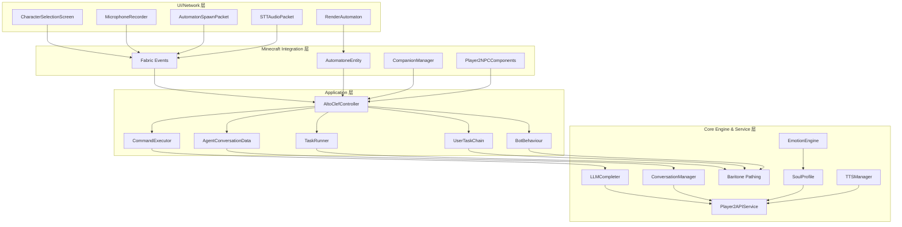
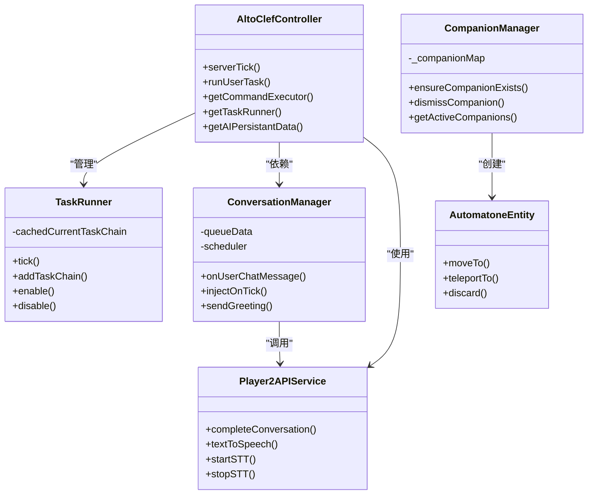
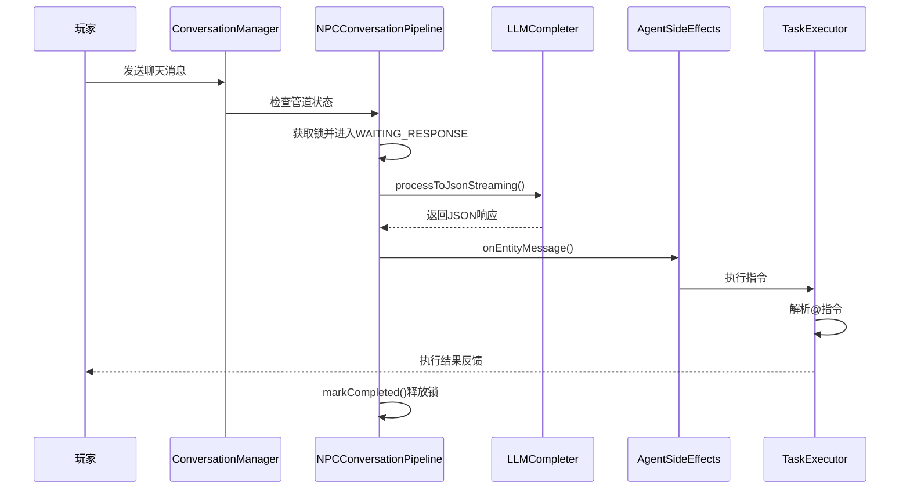
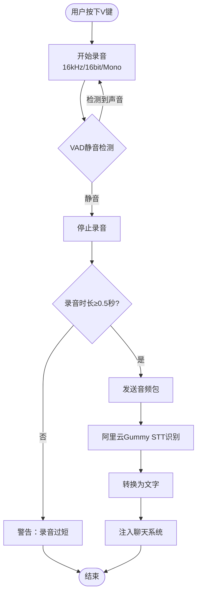
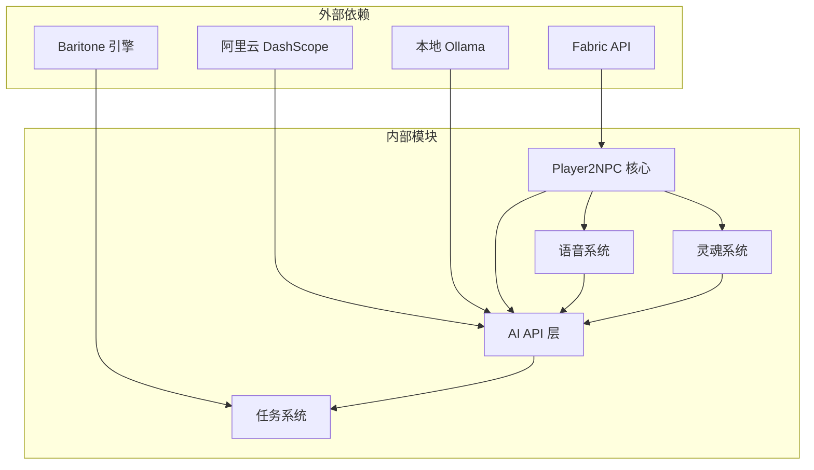

# 核心特性介绍

<cite>
**本文档引用的文件**
- [README.md](file://README.md)
- [Player2NPC.java](file://src/main/java/com/goodbird/player2npc/Player2NPC.java)
- [Player2NPCClient.java](file://src/main/java/com/goodbird/player2npc/Player2NPCClient.java)
- [AltoClefController.java](file://src/main/java/adris/altoclef/AltoClefController.java)
- [ConversationManager.java](file://src/main/java/adris/altoclef/player2api/manager/ConversationManager.java)
- [STTConfig.java](file://src/main/java/adris/altoclef/player2api/stt/STTConfig.java)
- [TTSConfig.java](file://src/main/java/adris/altoclef/player2api/tts/TTSConfig.java)
- [CompanionManager.java](file://src/main/java/com/goodbird/player2npc/companion/CompanionManager.java)
- [TaskRunner.java](file://src/main/java/adris/altoclef/tasksystem/TaskRunner.java)
- [Character.java](file://src/main/java/adris/altoclef/player2api/Character.java)
- [AIPersistantData.java](file://src/main/java/adris/altoclef/player2api/AIPersistantData.java)
- [NPCConversationPipeline.java](file://src/main/java/adris/altoclef/player2api/NPCConversationPipeline.java)
- [AI_NPC项目整体架构概览.md](file://docs/AI_NPC项目整体架构概览.md)
- [fabric.mod.json](file://src/main/resources/fabric.mod.json)
</cite>

## 目录
1. [引言](#引言)
2. [项目结构](#项目结构)
3. [核心组件](#核心组件)
4. [架构总览](#架构总览)
5. [详细组件分析](#详细组件分析)
6. [依赖关系分析](#依赖关系分析)
7. [性能考量](#性能考量)
8. [故障排除指南](#故障排除指南)
9. [结论](#结论)

## 引言
PlayerEngine + AI NPC 是一个基于 Minecraft 1.20.1 Fabric 的模组，将 LLM 驱动的 AI 伙伴系统与 Baritone 路径规划引擎结合，实现高度智能化的 NPC 伙伴。NPC 可以自然对话、执行复杂游戏指令、自主导航和战斗，并支持双向语音交互（STT/TTS）。本项目提供超过 30 种可执行的游戏指令，涵盖资源采集、战斗防御、建造交互、移动导航等多个维度。

## 项目结构
项目采用四层分层架构设计，自上而下依次为 UI/Network 层、Minecraft Integration 层、Application 层和 Core Engine & Service 层。各层之间通过明确的接口和事件机制解耦。



**图表来源**
- [AI_NPC项目整体架构概览.md:61-91](file://docs/AI_NPC项目整体架构概览.md#L61-L91)
- [fabric.mod.json:17-29](file://src/main/resources/fabric.mod.json#L17-L29)

**章节来源**
- [AI_NPC项目整体架构概览.md:61-91](file://docs/AI_NPC项目整体架构概览.md#L61-L91)
- [fabric.mod.json:17-29](file://src/main/resources/fabric.mod.json#L17-L29)

## 核心组件
项目包含七大核心组件，每个组件都有明确的职责和相互协作关系：

### 1. AI 任务执行系统 (AltoClefController)
作为核心控制器，AltoClefController 统一管理 AI 行为，持有所有子系统引用，负责任务调度、行为链管理和 NPC 生存监控。

### 2. NPC 实体管理系统 (AutomatoneEntity)
基于 LivingEntity 扩展的 NPC 实体类，支持实体渲染、状态管理和生命周期控制。

### 3. 对话管理器 (ConversationManager)
全局单例的对话调度中心，管理所有 NPC 的对话生命周期，支持距离过滤和关键词检测。

### 4. 语音交互系统
包括 STT（语音转文字）和 TTS（文字转语音）两大模块，支持实时语音交互和自然语音合成。

### 5. 任务执行引擎 (TaskRunner)
采用责任链模式的任务调度器，每 tick 选择最高优先级的活跃链执行，支持任务中断和优先级竞争。

### 6. 灵魂系统 (SoulProfile)
四层架构的人格化系统，包含人格矩阵、情绪状态、行为签名和记忆关系，赋予 NPC 独特的性格特征。

### 7. NPC 管理器 (CompanionManager)
基于 Cardinal Components API 的 NPC 管理组件，负责 NPC 的生成、销毁和状态同步。

**章节来源**
- [AltoClefController.java:53-152](file://src/main/java/adris/altoclef/AltoClefController.java#L53-L152)
- [CompanionManager.java:28-191](file://src/main/java/com/goodbird/player2npc/companion/CompanionManager.java#L28-L191)
- [ConversationManager.java:27-82](file://src/main/java/adris/altoclef/player2api/manager/ConversationManager.java#L27-L82)

## 架构总览
项目采用分层架构设计，通过明确的职责分离和事件驱动机制实现高度模块化的系统架构。



**图表来源**
- [AltoClefController.java:101-152](file://src/main/java/adris/altoclef/AltoClefController.java#L101-L152)
- [TaskRunner.java:9-98](file://src/main/java/adris/altoclef/tasksystem/TaskRunner.java#L9-L98)
- [ConversationManager.java:27-82](file://src/main/java/adris/altoclef/player2api/manager/ConversationManager.java#L27-L82)
- [CompanionManager.java:100-129](file://src/main/java/com/goodbird/player2npc/companion/CompanionManager.java#L100-L129)

## 详细组件分析

### 基于 LLM 的 AI NPC 伙伴系统
AI NPC 伙伴系统是整个项目的核心，通过 LLM 驱动实现自然语言理解和指令执行。

#### 技术实现原理
1. **对话管道设计**：每个 NPC 拥有独立的对话管道，避免并发等待阻塞
2. **事件驱动架构**：基于 Fabric 事件系统的异步处理机制
3. **记忆管理**：采用分层对话历史和增量摘要压缩技术
4. **情感系统**：四层架构的人格化表现，包含情绪状态和行为签名



**图表来源**
- [NPCConversationPipeline.java:14-194](file://src/main/java/adris/altoclef/player2api/NPCConversationPipeline.java#L14-L194)
- [ConversationManager.java:174-189](file://src/main/java/adris/altoclef/player2api/manager/ConversationManager.java#L174-L189)

#### 使用价值
- **自然交互**：支持中文自然语言对话，无需学习复杂指令语法
- **个性化定制**：通过 NPC 花名册和灵魂配置实现角色差异化
- **智能协作**：多个 NPC 可以进行自发社交和任务分工
- **情感体验**：NPC 情绪变化影响行为表现，增强沉浸感

**章节来源**
- [AIPersistantData.java:24-149](file://src/main/java/adris/altoclef/player2api/AIPersistantData.java#L24-L149)
- [Character.java:5-21](file://src/main/java/adris/altoclef/player2api/Character.java#L5-L21)

### 自然语言对话能力
项目实现了完整的自然语言处理能力，支持多轮对话、上下文记忆和情感感知。

#### 对话管理机制
1. **距离过滤**：仅 64 格范围内的 NPC 接收消息
2. **关键词检测**：支持召唤关键词的全局广播
3. **队列管理**：每个 NPC 拥有独立的事件队列
4. **优先级调度**：基于优先级的竞争执行机制

#### 情感驱动对话
NPC 的情感状态直接影响对话内容和语气：
- **喜悦**：语速加快，语气欢快
- **悲伤**：语速减慢，表达担忧
- **愤怒**：语气强硬，可能拒绝配合
- **恐惧**：语速不稳，表达紧张

**章节来源**
- [ConversationManager.java:55-139](file://src/main/java/adris/altoclef/player2api/manager/ConversationManager.java#L55-L139)
- [AI_NPC项目整体架构概览.md:598-624](file://docs/AI_NPC项目整体架构概览.md#L598-L624)

### 双向语音交互 (STT/TTS)
项目提供了完整的语音交互解决方案，支持实时语音识别和语音合成。

#### STT 语音识别架构


**图表来源**
- [Player2NPCClient.java:27-123](file://src/main/java/com/goodbird/player2npc/Player2NPCClient.java#L27-L123)

#### TTS 语音合成机制
1. **情绪感知**：根据 NPC 情绪状态调整语速和音调
2. **去重防抖**：5 秒内相同消息不重复合成
3. **序列号管理**：新消息到来时自动淘汰旧合成任务
4. **全局冷却**：任意 TTS 调用间隔最少 2 秒

#### 配置管理
语音系统通过配置文件进行统一管理：
- **STT 配置**：模型选择、语言设置、API Key 管理
- **TTS 配置**：音色选择、语速调节、音调控制
- **代理设置**：支持网络代理配置

**章节来源**
- [STTConfig.java:13-77](file://src/main/java/adris/altoclef/player2api/stt/STTConfig.java#L13-L77)
- [TTSConfig.java:13-101](file://src/main/java/adris/altoclef/player2api/tts/TTSConfig.java#L13-L101)

### 可执行 30+ 种游戏指令
项目提供了丰富的游戏指令系统，涵盖资源采集、战斗防御、建造交互、移动导航等多个维度。

#### 指令分类体系
1. **资源采集类**：`@get`、`@food`、`@meat`、`@farm`、`@fish`
2. **装备与物品类**：`@equip`、`@deposit`、`@give`、`@stash`
3. **移动与导航类**：`@goto`、`@follow`、`@locate_structure`
4. **战斗与防御类**：`@attack`、`@hero`
5. **建造与交互类**：`@build_structure`、`@bodylang`、`@scan`、`@sleep`
6. **状态与模式类**：`@idle`、`@stop`、`@gamer`、`@pause`、`@unpause`
7. **系统与配置类**：`@reload_settings`、`@resetmemory`、`@npc_memory`、`@chatclef`
8. **NPC 生命周期类**：`@spawn`、`@despawn`、`@npcls`

#### 指令执行引擎
```mermaid
flowchart TD
CommandInput[@指令输入] --> Parse["解析指令参数"]
Parse --> Validate{"验证指令有效性"}
Validate --> |无效| Error["返回错误信息"]
Validate --> |有效| FindTask["查找对应Task"]
FindTask --> TaskExecute["执行Task"]
TaskExecute --> PathPlan["路径规划"]
PathPlan --> Action["执行具体动作"]
Action --> Feedback["返回执行反馈"]
Error --> End([结束])
Feedback --> End
```

**图表来源**
- [AltoClefController.java:247-253](file://src/main/java/adris/altoclef/AltoClefController.java#L247-L253)

#### 使用场景示例
1. **基地建设**：`@spawn 瑞瑞 merchant_ruirii` → `@build_structure "小木屋" 100 64 200`
2. **资源采集**：`@get diamond 5` → 自动挖矿、合成
3. **战斗支援**：`@attack zombie 5` → 自动攻击怪物
4. **日常维护**：`@farm 10` → 自动种田、收割、补种

**章节来源**
- [README.md:334-409](file://README.md#L334-L409)
- [AltoClefController.java:247-253](file://src/main/java/adris/altoclef/AltoClefController.java#L247-L253)

### 任务执行引擎工作原理
任务执行引擎采用责任链模式，通过优先级竞争实现任务调度和执行。

#### 责任链架构


**图表来源**
- [AI_NPC项目整体架构概览.md:348-370](file://docs/AI_NPC项目整体架构概览.md#L348-L370)

#### 任务调度机制
1. **优先级竞争**：每 tick 选择最高优先级的活跃链执行
2. **中断机制**：高优先级链激活时中断当前用户任务
3. **状态管理**：支持任务暂停、恢复和取消
4. **路径规划集成**：与 Baritone 引擎无缝集成

**章节来源**
- [TaskRunner.java:22-58](file://src/main/java/adris/altoclef/tasksystem/TaskRunner.java#L22-L58)
- [AltoClefController.java:104-113](file://src/main/java/adris/altoclef/AltoClefController.java#L104-L113)

## 依赖关系分析



**图表来源**
- [fabric.mod.json:33-46](file://src/main/resources/fabric.mod.json#L33-L46)
- [AI_NPC项目整体架构概览.md:47-58](file://docs/AI_NPC项目整体架构概览.md#L47-L58)

### 核心依赖关系
1. **Fabric API**：提供事件系统、网络通信和生命周期管理
2. **Baritone 引擎**：提供 A* 路径规划和移动控制
3. **阿里云服务**：提供 STT/TTS 和 LLM API 服务
4. **Cardinal Components API**：提供组件化状态管理

**章节来源**
- [fabric.mod.json:33-46](file://src/main/resources/fabric.mod.json#L33-L46)
- [AI_NPC项目整体架构概览.md:47-58](file://docs/AI_NPC项目整体架构概览.md#L47-L58)

## 性能考量
项目在设计时充分考虑了性能优化，采用多种策略确保流畅的游戏体验。

### 异步处理策略
1. **线程池隔离**：LLM 和 TTS 调用使用独立线程池，避免阻塞主线程
2. **流式响应**：支持 SSE 流式输出，减少等待时间
3. **缓存机制**：对话历史和配置信息进行内存缓存

### 内存管理优化
1. **增量摘要**：对话历史采用增量摘要压缩，控制内存占用
2. **分层存储**：不同类型的数据采用不同的存储策略
3. **自动清理**：长时间未使用的数据自动清理释放

### 网络通信优化
1. **批量处理**：多个 NPC 的请求进行批量处理
2. **连接复用**：LLM API 连接进行复用
3. **错误重试**：网络异常时自动重试机制

## 故障排除指南

### 常见问题及解决方案
1. **AI 服务连接失败**
   - 检查 API Key 配置是否正确
   - 验证网络连接和代理设置
   - 确认服务提供商状态

2. **语音识别异常**
   - 检查麦克风权限和设备可用性
   - 验证 STT 配置参数
   - 确认音频格式符合要求

3. **NPC 不响应指令**
   - 检查 NPC 是否在 64 格范围内
   - 验证指令格式是否正确
   - 确认 NPC 是否处于空闲状态

4. **性能问题**
   - 减少同时活跃的 NPC 数量
   - 优化任务复杂度
   - 检查系统资源使用情况

### 调试工具
1. **日志系统**：详细的日志记录便于问题定位
2. **状态监控**：实时监控 NPC 状态和任务执行情况
3. **性能分析**：提供性能指标和瓶颈分析

**章节来源**
- [README.md:55-63](file://README.md#L55-L63)

## 结论
PlayerEngine + AI NPC 项目通过先进的 LLM 技术和精心设计的架构，为 Minecraft 带来了前所未有的智能体验。项目不仅实现了自然语言对话和复杂指令执行，更重要的是创造了一个具有个性和情感的虚拟伙伴生态系统。

### 核心优势
1. **技术先进性**：采用最新的 LLM 技术和架构设计
2. **功能完整性**：涵盖对话、执行、语音、情感等全方位功能
3. **用户体验**：提供直观易用的操作界面和丰富的交互方式
4. **扩展性强**：模块化设计便于功能扩展和定制

### 应用前景
该项目为 Minecraft 社区带来了全新的创作和娱乐方式，不仅提升了游戏体验，也为 AI 技术在游戏领域的应用提供了宝贵的实践经验。随着技术的不断发展，相信会有更多创新的功能和应用场景出现。