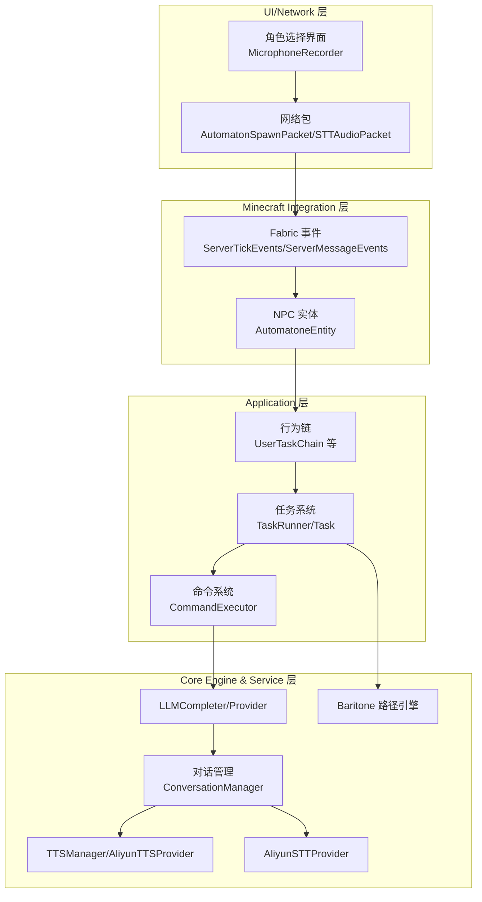
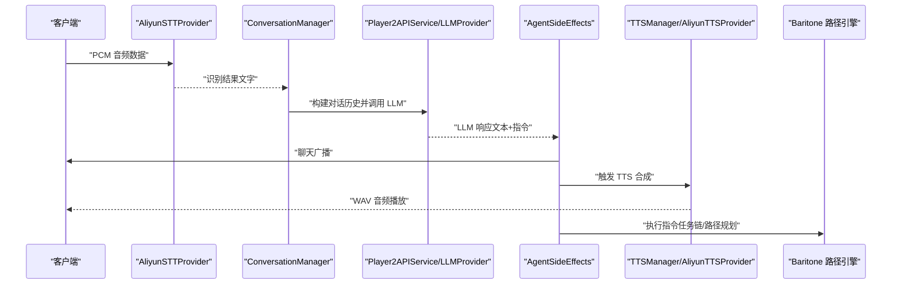
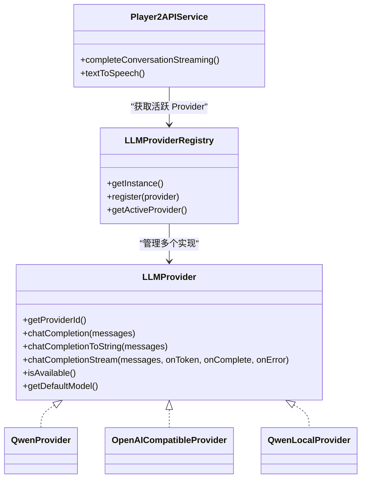
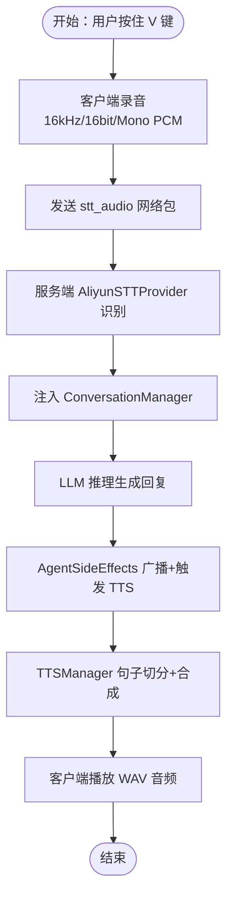
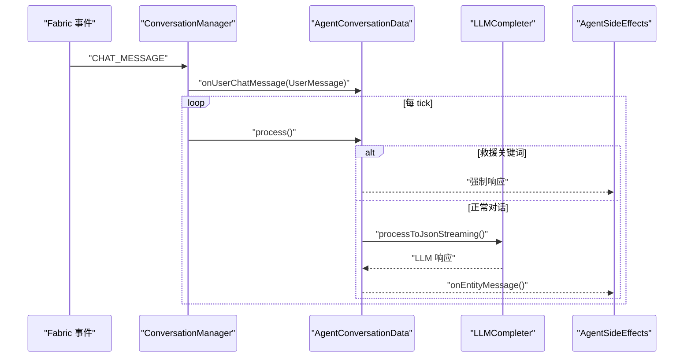
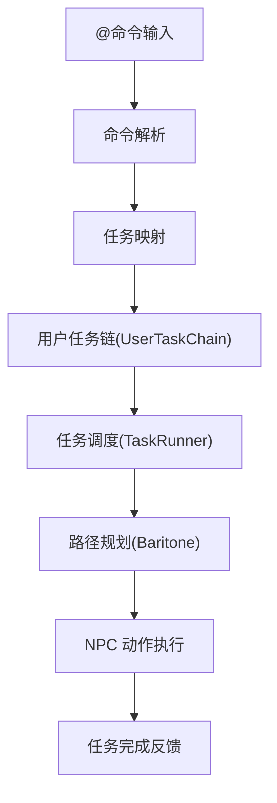
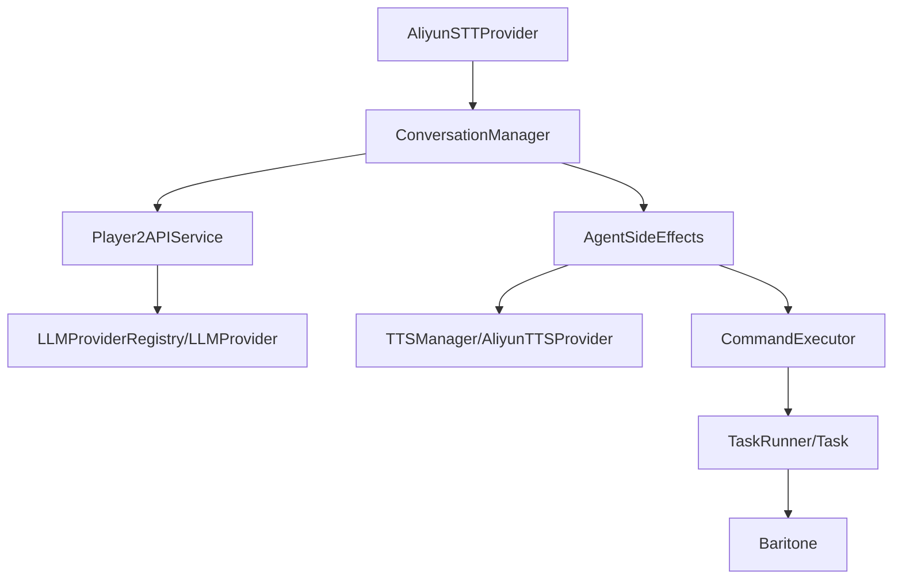

# 核心特性概览

<cite>
**本文引用的文件**
- [README.md](file://README.md)
- [AI_NPC项目整体架构概览.md](file://docs/AI_NPC项目整体架构概览.md)
- [AI_NPC游戏指令执行优化方案.md](file://docs/AI_NPC游戏指令执行优化方案.md)
- [Player2NPC.java](file://src/main/java/com/goodbird/player2npc/Player2NPC.java)
- [AliyunSTTProvider.java](file://src/main/java/adris/altoclef/player2api/stt/AliyunSTTProvider.java)
- [AliyunTTSProvider.java](file://src/main/java/adris/altoclef/player2api/tts/AliyunTTSProvider.java)
- [LLMProvider.java](file://src/main/java/adris/altoclef/player2api/llm/LLMProvider.java)
- [ConversationManager.java](file://src/main/java/adris/altoclef/player2api/manager/ConversationManager.java)
- [TTSManager.java](file://src/main/java/adris/altoclef/player2api/manager/TTSManager.java)
- [Player2APIService.java](file://src/main/java/adris/altoclef/player2api/Player2APIService.java)
- [BuildStructureCommand.java](file://src/main/java/adris/altoclef/commands/BuildStructureCommand.java)
- [FarmCommand.java](file://src/main/java/adris/altoclef/commands/FarmCommand.java)
</cite>

## 目录
1. [简介](#简介)
2. [项目结构](#项目结构)
3. [核心组件](#核心组件)
4. [架构总览](#架构总览)
5. [详细组件分析](#详细组件分析)
6. [依赖关系分析](#依赖关系分析)
7. [性能考量](#性能考量)
8. [故障排查指南](#故障排查指南)
9. [结论](#结论)
10. [附录](#附录)

## 简介
本项目基于 Minecraft 1.20.1 Fabric，将 LLM 驱动的 AI NPC 伙伴系统与 Baritone 路径规划引擎结合，实现自然语言对话、30+ 种游戏内指令执行、双向语音交互（STT/TTS）与 NPC 人格化（灵魂系统）。项目提供可插拔的 LLM Provider 架构，默认接入阿里云 DashScope（通义千问/Qwen），支持本地 Ollama 与 OpenAI 兼容模型；同时提供 Gummy 语音识别与 CosyVoice 语音合成，实现“按住 V 键”语音输入与 NPC 语音播报。

与传统模组相比，本项目的技术突破在于：
- 将 LLM 与任务执行链深度融合，实现“自然语言→任务”的端到端闭环；
- 采用事件驱动与异步处理，避免主线程阻塞；
- 通过可插拔 Provider 架构，支持多模型自由切换；
- 通过灵魂系统与情绪引擎，赋予 NPC 更强的人格化表现与情感反馈。

## 项目结构
项目采用四层分层架构：
- UI/Network 层：角色选择界面、麦克风录音、网络包（生成/销毁 NPC、传输音频数据）
- Minecraft Integration 层：监听 Fabric 生命周期事件，注入 NPC 实体
- Application 层：AI 行为链、任务调度、命令执行
- Core Engine & Service 层：LLM 推理、路径规划、语音处理、对话管理

**图表来源**
- [AI_NPC项目整体架构概览.md:61-91](file://docs/AI_NPC项目整体架构概览.md#L61-L91)
- [Player2NPC.java:48-65](file://src/main/java/com/goodbird/player2npc/Player2NPC.java#L48-L65)

**章节来源**
- [AI_NPC项目整体架构概览.md:61-91](file://docs/AI_NPC项目整体架构概览.md#L61-L91)
- [README.md:44-562](file://README.md#L44-L562)

## 核心组件
- LLM 驱动的 AI NPC：通过统一的 LLMProvider 接口接入多家模型，支持流式与非流式响应，结合对话历史与 NPC 灵魂状态生成自然回复。
- Gummy STT 语音识别：客户端录音（16kHz/16bit/Mono PCM），通过网络包发送至服务端，使用阿里云 Gummy WebSocket 识别为文字，注入对话管理器。
- 阿里云 CosyVoice TTS 语音合成：根据 NPC 情绪动态调整语速/音高，合成 WAV 音频并通过 Fabric 网络包发送至客户端播放。
- 可插拔 LLM Provider 架构：通过 LLMProvider 接口与 LLMProviderRegistry 实现多模型热切换，支持 Qwen、OpenAI 兼容、本地 Ollama 等。
- 30+ 种游戏内指令执行：涵盖采集、建造、战斗、移动、容器操作、速通等任务，由命令系统解析并映射到具体任务链与路径规划。

**章节来源**
- [README.md:5-11](file://README.md#L5-L11)
- [LLMProvider.java:11-66](file://src/main/java/adris/altoclef/player2api/llm/LLMProvider.java#L11-L66)
- [AliyunSTTProvider.java:23-39](file://src/main/java/adris/altoclef/player2api/stt/AliyunSTTProvider.java#L23-L39)
- [AliyunTTSProvider.java:19-42](file://src/main/java/adris/altoclef/player2api/tts/AliyunTTSProvider.java#L19-L42)
- [Player2APIService.java:120-231](file://src/main/java/adris/altoclef/player2api/Player2APIService.java#L120-L231)

## 架构总览
系统采用事件驱动与异步处理，避免 LLM 与 TTS 的网络延迟阻塞主线程。对话管理器统一调度 NPC 的事件队列，LLMCompleter 负责异步推理，AgentSideEffects 将副作用（聊天广播、TTS、指令执行）应用到世界。

**图表来源**
- [AI_NPC项目整体架构概览.md:527-559](file://docs/AI_NPC项目整体架构概览.md#L527-L559)
- [Player2APIService.java:109-118](file://src/main/java/adris/altoclef/player2api/Player2APIService.java#L109-L118)
- [ConversationManager.java:98-114](file://src/main/java/adris/altoclef/player2api/manager/ConversationManager.java#L98-L114)

**章节来源**
- [AI_NPC项目整体架构概览.md:527-559](file://docs/AI_NPC项目整体架构概览.md#L527-L559)
- [README.md:429-441](file://README.md#L429-L441)

## 详细组件分析

### LLM Provider 架构（可插拔）
- 统一接口：LLMProvider 定义 chatCompletion、chatCompletionStream、isAvailable、getDefaultModel 等方法，确保不同提供商的兼容性。
- 注册表：LLMProviderRegistry 管理内置 Provider（Qwen、OpenAI 兼容、QwenLocal），支持运行时热切换。
- 调用入口：Player2APIService.completeConversationStreaming 通过注册表获取当前活跃 Provider，实现流式与非流式调用。

**图表来源**
- [LLMProvider.java:11-66](file://src/main/java/adris/altoclef/player2api/llm/LLMProvider.java#L11-L66)
- [Player2APIService.java:109-118](file://src/main/java/adris/altoclef/player2api/Player2APIService.java#L109-L118)
- [AI_NPC项目整体架构概览.md:286-317](file://docs/AI_NPC项目整体架构概览.md#L286-L317)

**章节来源**
- [LLMProvider.java:11-66](file://src/main/java/adris/altoclef/player2api/llm/LLMProvider.java#L11-L66)
- [AI_NPC项目整体架构概览.md:286-317](file://docs/AI_NPC项目整体架构概览.md#L286-L317)

### 语音识别（STT）与语音合成（TTS）
- STT：客户端 MicrophoneRecorder 采集 PCM 音频，服务端 STTAudioPacket 接收并调用 AliyunSTTProvider.transcribe，通过 DashScope Gummy WebSocket 识别为文字，注入 ConversationManager。
- TTS：AgentSideEffects 触发 TTSManager.TTS，按句子切分并逐句合成，动态调整语速/音高以匹配 NPC 情绪，通过 Fabric 网络包发送至客户端播放。

**图表来源**
- [README.md:429-441](file://README.md#L429-L441)
- [AliyunSTTProvider.java:47-154](file://src/main/java/adris/altoclef/player2api/stt/AliyunSTTProvider.java#L47-L154)
- [Player2APIService.java:120-231](file://src/main/java/adris/altoclef/player2api/Player2APIService.java#L120-L231)

**章节来源**
- [README.md:354-394](file://README.md#L354-L394)
- [AliyunSTTProvider.java:23-39](file://src/main/java/adris/altoclef/player2api/stt/AliyunSTTProvider.java#L23-L39)
- [AliyunTTSProvider.java:19-42](file://src/main/java/adris/altoclef/player2api/tts/AliyunTTSProvider.java#L19-L42)

### 对话管理与事件驱动
- ConversationManager 作为全局单例，监听 Fabric 聊天事件，按距离与关键词过滤，将事件加入对应 NPC 的 AgentConversationData 队列。
- 每 tick 调度最高优先级 NPC 的队列，支持强制救援关键词拦截、打招呼拦截与 LLM 调用，最终通过 AgentSideEffects 应用副作用。

**图表来源**
- [AI_NPC项目整体架构概览.md:527-559](file://docs/AI_NPC项目整体架构概览.md#L527-L559)
- [ConversationManager.java:98-165](file://src/main/java/adris/altoclef/player2api/manager/ConversationManager.java#L98-L165)

**章节来源**
- [ConversationManager.java:27-180](file://src/main/java/adris/altoclef/player2api/manager/ConversationManager.java#L27-L180)
- [AI_NPC项目整体架构概览.md:527-559](file://docs/AI_NPC项目整体架构概览.md#L527-L559)

### 游戏内指令执行能力（30+ 种）
- 指令覆盖：采集（挖矿、砍树、农场）、建造（放置方块、结构建造）、战斗（攻击最近/指定目标）、移动（跟随、前往、体语）、容器操作（合成、熔炼、存储）、速通（击杀末影龙）等。
- 执行链路：命令解析 → 任务映射 → 任务链调度 → 路径规划 → NPC 动作 → 任务完成反馈。

**图表来源**
- [AI_NPC项目整体架构概览.md:406-437](file://docs/AI_NPC项目整体架构概览.md#L406-L437)
- [BuildStructureCommand.java:22-27](file://src/main/java/adris/altoclef/commands/BuildStructureCommand.java#L22-L27)
- [FarmCommand.java:22-27](file://src/main/java/adris/altoclef/commands/FarmCommand.java#L22-L27)

**章节来源**
- [README.md:443-455](file://README.md#L443-L455)
- [BuildStructureCommand.java:10-29](file://src/main/java/adris/altoclef/commands/BuildStructureCommand.java#L10-L29)
- [FarmCommand.java:12-29](file://src/main/java/adris/altoclef/commands/FarmCommand.java#L12-L29)

## 依赖关系分析
- 组件耦合与内聚：LLMProvider 与 Player2APIService 通过注册表解耦；ConversationManager 与 AgentSideEffects 通过事件模型解耦；TTSManager 与 Player2APIService 通过网络包解耦。
- 直接与间接依赖：STT/ TTS 依赖 DashScope API；LLM 依赖 Provider 实现；任务执行依赖 Baritone 路径引擎。
- 扩展点：新增 Provider/ STT/TTS 服务只需实现对应接口并注册，无需修改核心调度逻辑。

**图表来源**
- [Player2APIService.java:109-118](file://src/main/java/adris/altoclef/player2api/Player2APIService.java#L109-L118)
- [ConversationManager.java:147-165](file://src/main/java/adris/altoclef/player2api/manager/ConversationManager.java#L147-L165)
- [TTSManager.java:94-153](file://src/main/java/adris/altoclef/player2api/manager/TTSManager.java#L94-L153)

**章节来源**
- [Player2APIService.java:120-231](file://src/main/java/adris/altoclef/player2api/Player2APIService.java#L120-L231)
- [AI_NPC项目整体架构概览.md:475-526](file://docs/AI_NPC项目整体架构概览.md#L475-L526)

## 性能考量
- 异步处理：LLMCompleter 使用单线程执行器，TTSManager 使用单线程执行器，避免阻塞主线程。
- 节流与去重：TTSManager 通过序列号、去重间隔与全局冷却防止语音风暴与过期消息。
- 路径规划优化：Baritone 异步计算、区块缓存、路径预计算与移动类型权重，降低寻路开销。
- 网络优化：STT 分块发送（约 100ms/块），TTS 合成后通过网络包发送，减少首字延迟。

**章节来源**
- [AI_NPC项目整体架构概览.md:371-401](file://docs/AI_NPC项目整体架构概览.md#L371-L401)
- [TTSManager.java:35-168](file://src/main/java/adris/altoclef/player2api/manager/TTSManager.java#L35-L168)

## 故障排查指南
- 常见问题与排查方向：
  - NPC 不回复：检查距离（<64 格）、日志中是否有 LLM 路由输出、Provider 可用性。
  - 401/403 错误：API Key 无效或权限不足，需重新获取。
  - TTS 无声：检查 tts.enabled、网络连通性、API Key 权限。
  - STT 识别为空：录音时间过短（<0.5 秒）、麦克风权限或设备问题。
  - V 键无响应：按键绑定冲突或系统麦克风权限未授予。
- 关键日志关键词：LLM 配置加载、路由到 Provider、TTS 合成成功、STT 识别结果、PTT 录音开始/结束等。

**章节来源**
- [README.md:456-491](file://README.md#L456-L491)

## 结论
本项目通过将 LLM、任务执行链、路径规划与语音系统深度融合，实现了从自然语言到游戏动作的高效闭环。其可插拔的 Provider 架构、事件驱动与异步处理机制，以及丰富的游戏内指令集，显著提升了 AI NPC 的智能性与交互体验。相较传统模组，本项目在推理能力、语音交互、任务执行与扩展性方面具备明显技术突破。

## 附录
- 使用场景与效果：
  - 语音交互：按住 V 键即可语音指挥 NPC，实现“边说边做”的自然交互。
  - 指令执行：30+ 种指令覆盖采集、建造、战斗、移动等，满足多样化玩法需求。
  - 人格化反馈：结合灵魂系统与情绪引擎，NPC 的语音与行为更具个性化与情感色彩。
- 扩展建议：
  - 新增 Provider：实现 LLMProvider 接口并在注册表中注册，即可无缝接入。
  - 替换语音服务：实现 AliyunSTTProvider/AliyunTTSProvider 接口，适配其他 STT/TTS 服务。
  - 优化指令链：针对特定场景（如苦力怕战斗）优化行为链优先级与交互条件，提升执行稳定性。

**章节来源**
- [README.md:397-491](file://README.md#L397-L491)
- [AI_NPC项目整体架构概览.md:625-692](file://docs/AI_NPC项目整体架构概览.md#L625-L692)