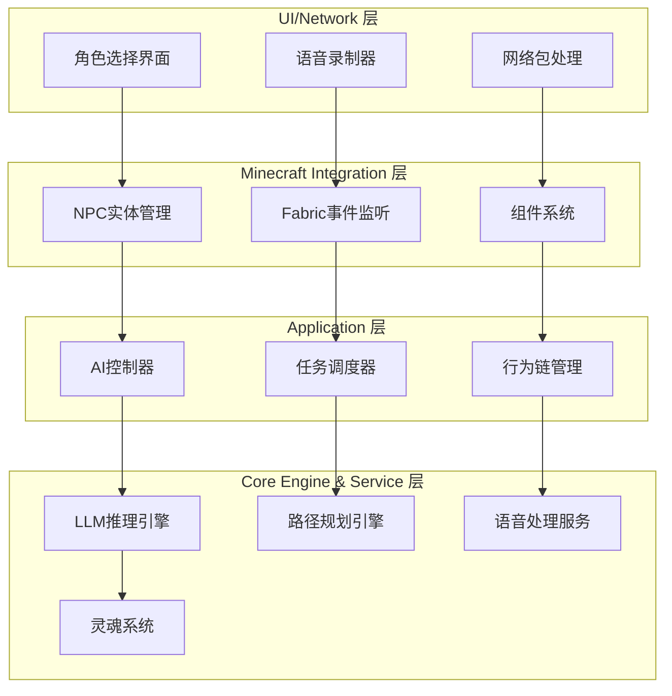
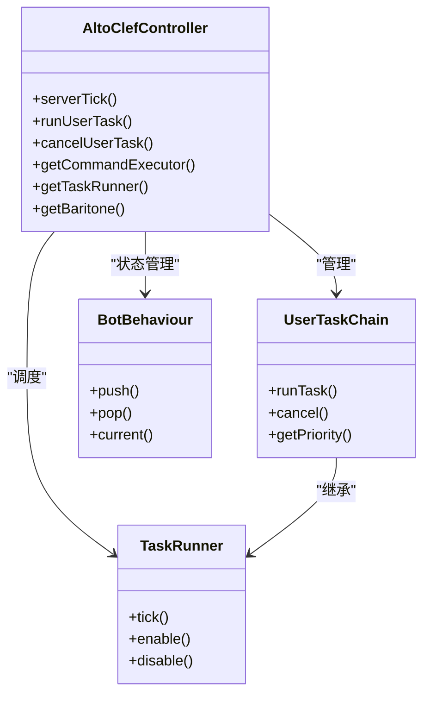
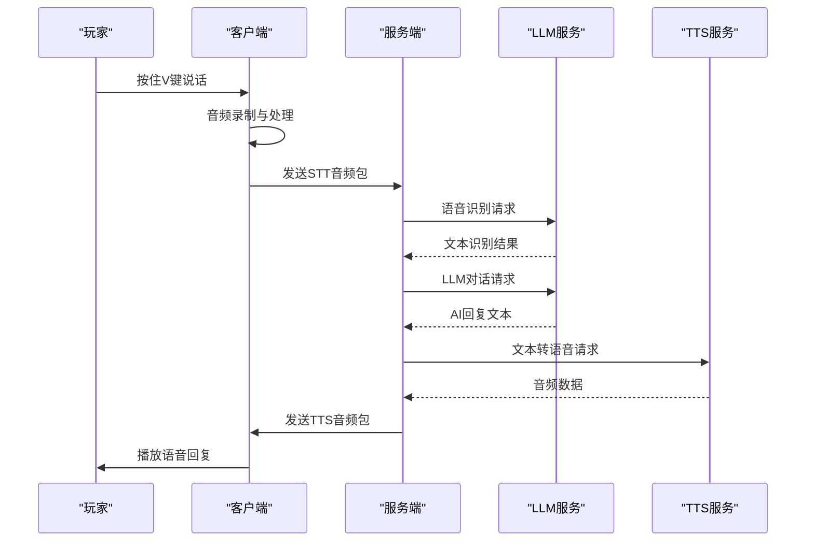
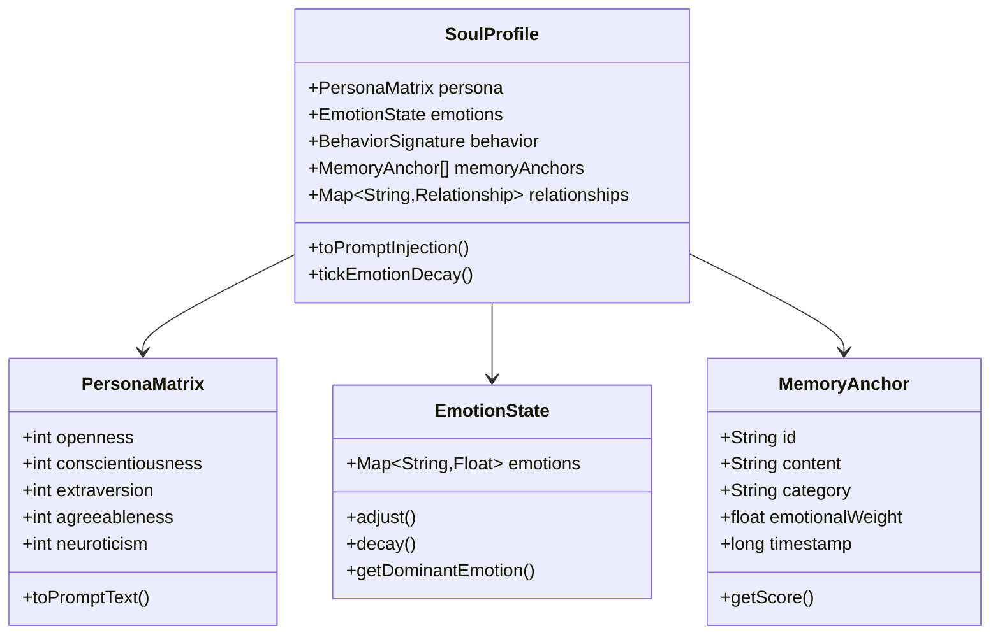
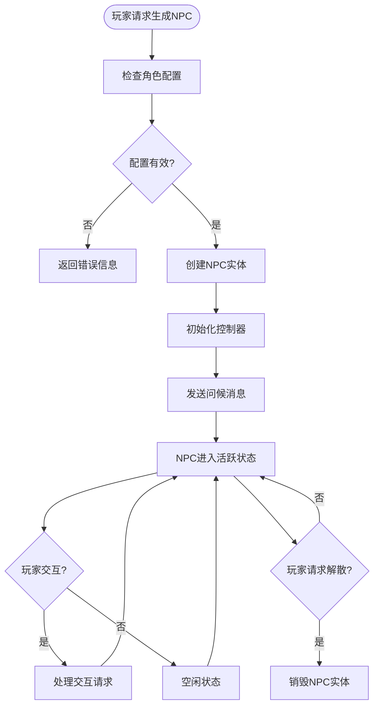

# 项目介绍与定位

<cite>
**本文档引用的文件**
- [README.md](file://README.md)
- [Player2NPC.java](file://src/main/java/com/goodbird/player2npc/Player2NPC.java)
- [Player2NPCClient.java](file://src/main/java/com/goodbird/player2npc/Player2NPCClient.java)
- [fabric.mod.json](file://src/main/resources/fabric.mod.json)
- [AltoClefController.java](file://src/main/java/adris/altoclef/AltoClefController.java)
- [Player2APIService.java](file://src/main/java/adris/altoclef/player2api/Player2APIService.java)
- [ConversationManager.java](file://src/main/java/adris/altoclef/player2api/manager/ConversationManager.java)
- [SoulProfile.java](file://src/main/java/adris/altoclef/player2api/soul/SoulProfile.java)
- [AutomatoneEntity.java](file://src/main/java/com/goodbird/player2npc/companion/AutomatoneEntity.java)
- [CompanionManager.java](file://src/main/java/com/goodbird/player2npc/companion/CompanionManager.java)
- [AI_NPC项目整体架构概览.md](file://docs/AI_NPC项目整体架构概览.md)
- [AI_NPC游戏指令执行优化方案.md](file://docs/AI_NPC游戏指令执行优化方案.md)
- [AI_NPC游戏指令系统重构.md](file://docs/AI_NPC游戏指令系统重构.md)
- [AI_NPC灵魂特质交互优化方案.md](file://docs/AI_NPC灵魂特质交互优化方案.md)
- [AI_NPC语音实时交互优化方案.md](file://docs/AI_NPC语音实时交互优化方案.md)
</cite>

## 目录
1. [项目概述](#项目概述)
2. [核心价值与定位](#核心价值与定位)
3. [系统架构总览](#系统架构总览)
4. [核心技术组件](#核心技术组件)
5. [应用场景与使用价值](#应用场景与使用价值)
6. [技术创新与突破](#技术创新与突破)
7. [发展历程与未来规划](#发展历程与未来规划)
8. [结论](#结论)

## 项目概述

PlayerEngine + AI NPC 是一个基于 Minecraft 1.20.1 Fabric 的革命性模组，将 LLM 驱动的 AI 伙伴系统与 Baritone 路径规划引擎深度整合，为 Minecraft 带来前所未有的智能体验。该项目的核心价值在于：

- **智能NPC伙伴**：NPC 不再是简单的工具人，而是具有独立人格、情感和记忆的虚拟生命体
- **自然语言交互**：支持中文和英文的自然对话，无需学习复杂的指令语法
- **双向语音交互**：通过阿里云 DashScope 提供的 STT/ TTS 服务，实现真正的语音交流
- **自动化任务执行**：从采集资源到建造房屋，从战斗保护到日常照料，全面解放玩家双手

该项目基于 Ladysnake 的 PlayerEngine（Baritone 分支）引擎，采用模块化设计，支持插件化的 LLM Provider 架构，目前已接入阿里云通义千问、OpenAI 等多家服务提供商。

## 核心价值与定位

### 项目定位

PlayerEngine + AI NPC 定位为 Minecraft 生态系统中的"智能伙伴引擎"，致力于将 Minecraft 从传统的"像素游戏"升级为"智能生活模拟器"。项目的核心价值体现在：

**技术价值**：
- 革命性的 AI NPC 交互模式，重新定义了游戏中的"非玩家角色"概念
- 完整的语音交互生态，打通了从语音输入到动作执行的全链路
- 可扩展的架构设计，支持多种 LLM 服务和第三方集成

**用户体验价值**：
- 降低学习成本：无需记忆复杂指令，直接用自然语言沟通
- 提升沉浸感：NPC 具有人格魅力，能够产生真实的情感连接
- 增强可玩性：从被动游戏变为主动的生活体验

**行业影响力**：
- 为 Minecraft 模组生态系统带来 AI 时代的新范式
- 探索游戏与人工智能融合的前沿应用
- 为其他游戏的 AI NPC 实现提供技术参考

## 系统架构总览

项目采用四层分层架构设计，自上而下依次为 UI/Network 层、Minecraft Integration 层、Application 层和 Core Engine & Service 层。

**架构特点**：
- **模块化设计**：各层职责清晰，便于维护和扩展
- **事件驱动**：基于 Fabric 的事件系统实现松耦合通信
- **可插拔架构**：支持多种 LLM 服务和语音服务提供商
- **状态管理**：完善的 NPC 状态持久化和恢复机制

## 核心技术组件

### 1. AI NPC 核心引擎

AI NPC 的核心由 PlayerEngine + AltoClef 控制器组成，提供完整的 AI 行为管理和任务执行能力。

**核心功能**：
- **任务执行系统**：支持 30+ 种游戏指令的自动执行
- **行为链管理**：通过优先级机制协调多个 AI 行为
- **状态持久化**：保存 NPC 的人格、记忆和关系状态

### 2. 语音交互系统

项目实现了完整的语音交互生态，包括语音识别、文本生成和语音合成三个核心环节。

**技术亮点**：
- **实时语音识别**：支持阿里云 Gummy STT 服务，提供高质量的语音转文字能力
- **流式对话处理**：LLM 支持流式响应，显著降低对话延迟
- **情感化语音合成**：根据 NPC 的情绪状态调整语音参数

### 3. 灵魂系统架构

项目独创的"灵魂系统"为 NPC 赋予了独立的人格、情感和记忆，使其具备真实的个性特征。

**系统特性**：
- **大五人格模型**：基于心理学理论构建 NPC 的基础性格
- **动态情绪系统**：8 种基础情绪的实时变化和衰减
- **深度记忆管理**：重要的情感事件被永久保存为记忆锚点
- **关系演化机制**：NPC 与玩家的关系随互动时间发展

### 4. NPC 实体管理系统

项目实现了完整的 NPC 实体生命周期管理，包括生成、控制、销毁等功能。

**管理功能**：
- **角色选择界面**：H 键打开的角色选择界面
- **实体生命周期**：完整的生成、运行、销毁流程
- **状态同步**：服务器与客户端的状态保持一致
- **持久化存储**：NPC 的配置和状态自动保存

## 应用场景与使用价值

### 1. 智能NPC伙伴

**应用场景**：
- **多人游戏协作**：在大型服务器中寻找可靠的队友
- **单人游戏陪伴**：独自冒险时的智能伙伴
- **教育娱乐**：通过游戏学习编程、历史等知识
- **辅助工具**：帮助玩家完成重复性任务

**使用价值**：
- **降低社交门槛**：无需寻找其他玩家，AI NPC 提供即时陪伴
- **个性化体验**：每个 NPC 都有独特的性格和技能
- **学习成长**：通过与 NPC 的互动获得知识和经验

### 2. 自然语言对话

**对话能力**：
- **多语言支持**：同时支持中文和英文的自然对话
- **上下文理解**：能够理解复杂的对话背景和语境
- **情感表达**：根据对话内容调整语调和情感色彩
- **知识问答**：回答各种问题，提供实用信息

**交互体验**：
- **无缝沟通**：无需学习复杂指令，直接用语言交流
- **即时响应**：通过流式处理实现接近实时的对话
- **个性化服务**：根据玩家偏好调整对话风格

### 3. 语音交互

**语音功能**：
- **语音指令**：通过 V 键按住说话的方式下达指令
- **语音回复**：NPC 通过 TTS 服务进行语音回复
- **语音识别**：支持中文普通话和英语等多种语言
- **语音合成**：多种音色和语调可供选择

**使用场景**：
- **驾驶船只**：双手操作时的语音控制
- **战斗场景**：紧急情况下快速下达指令
- **多人协作**：团队沟通和协调
- **无障碍体验**：为行动不便的玩家提供便利

### 4. 自动化任务执行

**任务类型**：
- **资源采集**：自动寻找和收集各种资源
- **建筑建造**：按照指令建造各种结构
- **战斗保护**：自动保护玩家免受怪物攻击
- **日常照料**：喂食、清洁、维护等日常任务

**执行能力**：
- **智能规划**：自动规划最优路径和策略
- **适应性强**：能够适应不同的游戏环境和条件
- **持续学习**：通过经验积累不断提升执行效率

## 技术创新与突破

### 1. 架构创新

**模块化设计**：
项目采用高度模块化的架构设计，将不同的功能组件分离为独立的模块，便于维护和扩展。每个模块都有明确的职责边界，通过标准化的接口进行通信。

**可插拔架构**：
支持多种 LLM 服务提供商的无缝切换，包括阿里云通义千问、OpenAI、本地 Ollama 等。这种设计使得项目能够适应不同的使用场景和技术需求。

### 2. 交互创新

**自然语言处理**：
项目实现了先进的自然语言处理能力，能够理解复杂的中文指令和上下文。通过精心设计的 Prompt 模板和命令映射表，大大提高了中文指令的理解准确率。

**情感化交互**：
通过灵魂系统的设计，NPC 不仅能够执行任务，还能够表达情感、建立关系，为玩家提供更加真实和丰富的交互体验。

### 3. 性能优化

**流式处理**：
采用流式处理技术，LLM 和 TTS 都支持流式响应，显著降低了交互延迟。用户可以在听到部分内容的同时就开始处理后续内容。

**智能缓存**：
实现了多层次的缓存机制，包括对话历史缓存、任务状态缓存等，有效减少了重复计算和网络请求。

### 4. 可靠性保障

**错误处理**：
建立了完善的错误处理和恢复机制，即使在网络不稳定或服务异常的情况下，也能保证基本功能的正常使用。

**状态管理**：
通过完善的状态管理和持久化机制，确保 NPC 的状态在重启后能够正确恢复。

## 发展历程与未来规划

### 发展历程

**第一阶段：基础架构搭建（2024年）**
- 基于 PlayerEngine 构建 AI NPC 基础框架
- 集成 Baritone 路径规划引擎
- 实现基本的语音识别和合成功能

**第二阶段：功能完善（2024-2025年）**
- 开发完整的对话管理系统
- 实现灵魂系统的人格、情感和记忆功能
- 优化任务执行能力和交互体验

**第三阶段：生态建设（2025年至今）**
- 建立完整的模组生态系统
- 支持多种 LLM 服务提供商
- 持续优化性能和稳定性

### 技术愿景

**短期目标（6个月内）**：
- 实现流式 LLM 和 TTS 处理，将端到端延迟降至 5 秒以内
- 完善多 NPC 场景下的定向路由功能
- 增强中文指令的理解准确率至 95% 以上

**中期目标（1年内）**：
- 支持本地推理部署，提供更好的隐私保护
- 实现更丰富的 NPC 人格特征和行为模式
- 建立完整的开发者生态和插件体系

**长期目标（3年内）**：
- 探索 AI NPC 在教育、培训等领域的应用
- 实现跨游戏平台的 NPC 互通
- 为游戏 AI 领域贡献开源技术和最佳实践

### 技术规划

**架构演进**：
- 采用微服务架构，将不同的功能模块拆分为独立的服务
- 实现容器化部署，提高系统的可扩展性和可维护性
- 建立完善的监控和日志系统

**功能扩展**：
- 支持更多的游戏场景和玩法模式
- 实现更复杂的社交互动功能
- 探索与其他游戏元素的深度融合

**性能优化**：
- 持续优化 LLM 推理速度和准确性
- 改进语音处理的实时性和质量
- 降低系统的资源消耗和运行成本

## 结论

PlayerEngine + AI NPC 项目代表了 Minecraft 模组技术发展的新高度，它不仅是一个功能强大的游戏模组，更是游戏与人工智能融合的典范之作。通过智能 NPC 伙伴、自然语言对话、双向语音交互等创新功能，该项目为玩家带来了前所未有的游戏体验。

项目的核心价值在于：
- **技术突破**：在 Minecraft 生态中实现了 AI NPC 的革命性应用
- **用户体验**：显著降低了游戏的学习成本，提升了沉浸感和可玩性
- **生态影响**：为 Minecraft 模组生态系统注入了新的活力，推动了整个行业的发展

随着技术的不断进步和社区的积极参与，PlayerEngine + AI NPC 项目有望成为游戏 AI 领域的标杆产品，为更多游戏和应用场景提供技术支持和参考模式。该项目不仅改变了 Minecraft 的游戏体验，更为整个游戏行业的智能化转型提供了宝贵的经验和启示。