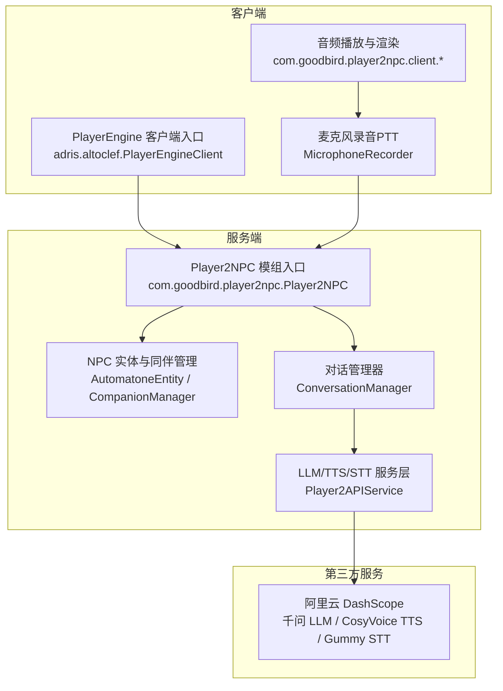
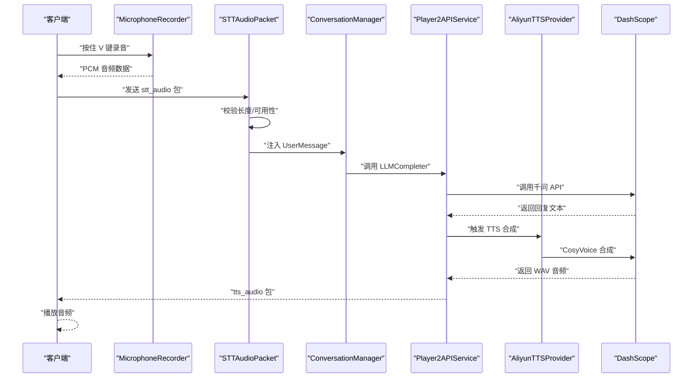
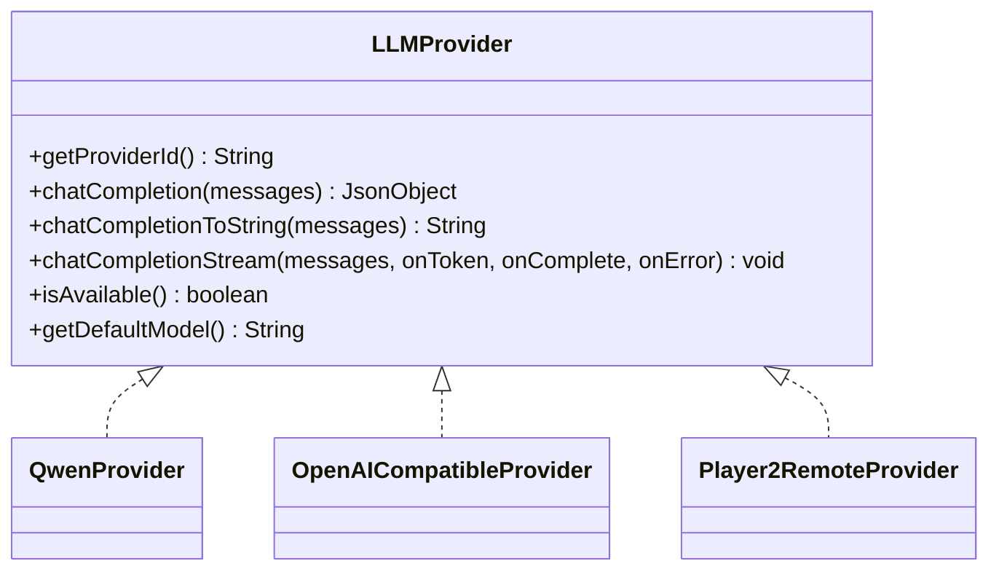
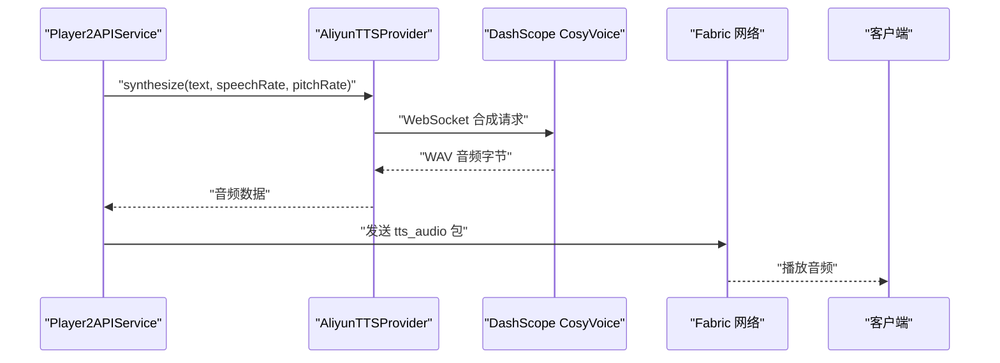
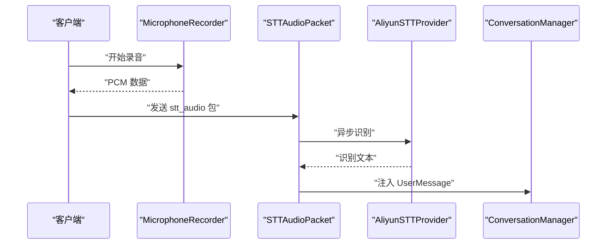
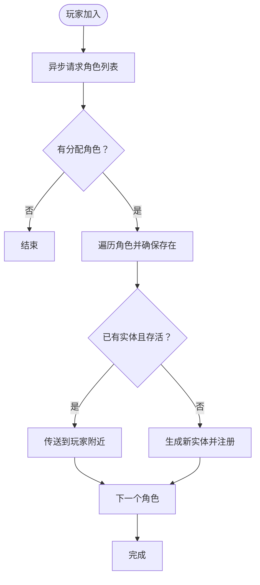
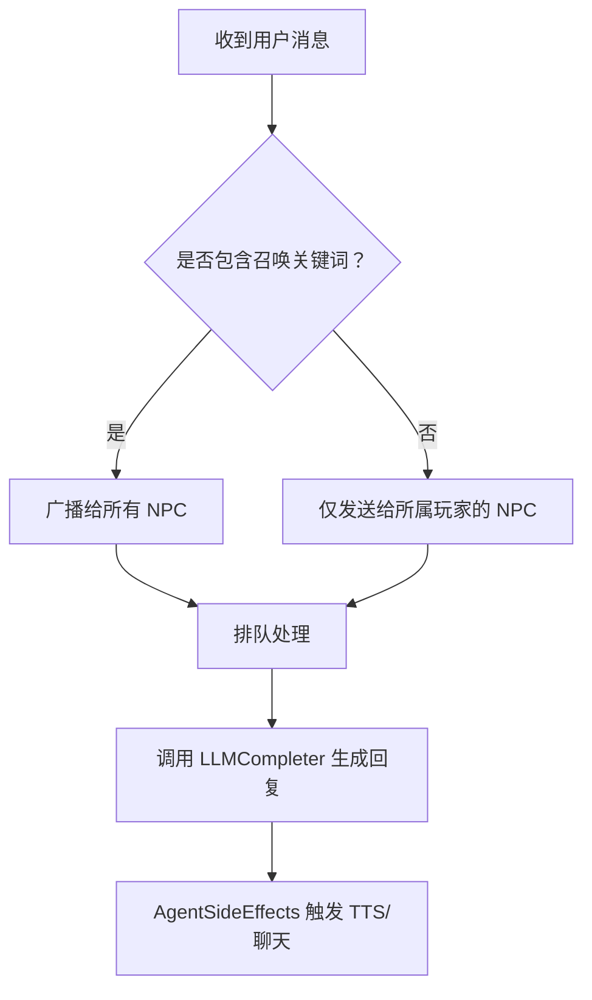
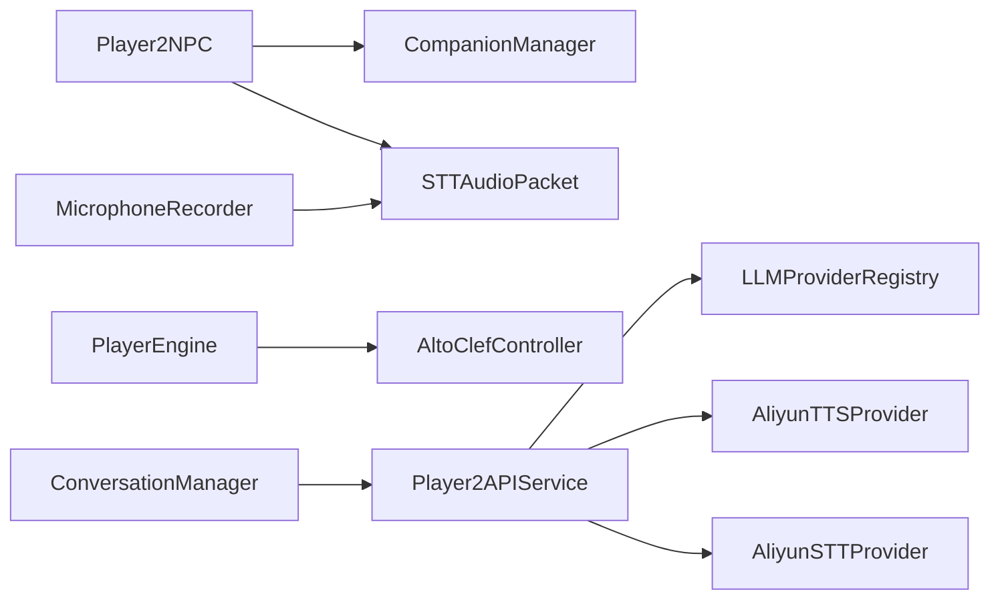

# 项目概述

<cite>
**本文引用的文件**
- [README.md](file://README.md)
- [build.gradle](file://build.gradle)
- [fabric.mod.json](file://src/main/resources/fabric.mod.json)
- [Player2NPC.java](file://src/main/java/com/goodbird/player2npc/Player2NPC.java)
- [PlayerEngine.java](file://src/main/java/baritone/PlayerEngine.java)
- [Player2APIService.java](file://src/main/java/adris/altoclef/player2api/Player2APIService.java)
- [LLMProvider.java](file://src/main/java/adris/altoclef/player2api/llm/LLMProvider.java)
- [AliyunTTSProvider.java](file://src/main/java/adris/altoclef/player2api/tts/AliyunTTSProvider.java)
- [AliyunSTTProvider.java](file://src/main/java/adris/altoclef/player2api/stt/AliyunSTTProvider.java)
- [CompanionManager.java](file://src/main/java/com/goodbird/player2npc/companion/CompanionManager.java)
- [ConversationManager.java](file://src/main/java/adris/altoclef/player2api/manager/ConversationManager.java)
- [MicrophoneRecorder.java](file://src/main/java/com/goodbird/player2npc/client/audio/MicrophoneRecorder.java)
- [STTAudioPacket.java](file://src/main/java/com/goodbird/player2npc/network/STTAudioPacket.java)
</cite>

## 目录
1. [简介](#简介)
2. [项目结构](#项目结构)
3. [核心组件](#核心组件)
4. [架构总览](#架构总览)
5. [详细组件分析](#详细组件分析)
6. [依赖关系分析](#依赖关系分析)
7. [性能考量](#性能考量)
8. [故障排查指南](#故障排查指南)
9. [结论](#结论)
10. [附录](#附录)

## 简介
本项目是基于 PlayerEngine（Baritone 分支）的 Minecraft Fabric Mod，为 Minecraft 1.20.1 提供 AI NPC 伙伴系统。NPC 由大语言模型（LLM）驱动，支持自然语言对话、执行游戏内指令、自主导航与战斗；同时集成阿里云 CosyVoice 语音合成（TTS）与 Gummy 语音识别（STT），实现双向语音交互。项目采用可插拔的 LLM Provider 架构，默认接入阿里云千问（DashScope API），并提供完整的 Fabric 生态集成与 Baritone 路径规划能力。

- 核心特性
  - LLM 驱动的 AI NPC，支持自然语言对话
  - Gummy STT 语音识别，按住 V 键即可语音下达指令
  - 阿里云 CosyVoice TTS 语音合成，NPC 可“说话”
  - 可插拔的 LLM Provider 架构，默认接入阿里云千问（DashScope API）
  - NPC 可执行 30+ 种游戏指令（采集、建造、战斗、寻路等）
  - 基于 Fabric Mod Loader，Minecraft 1.20.1

**章节来源**
- [README.md:1-12](file://README.md#L1-L12)

## 项目结构
项目采用分层与模块化组织方式：
- com/goodbird/player2npc：NPC 实体、网络通信、客户端音频录制与渲染
- adris/altoclef：AI NPC 核心逻辑、任务系统、LLM/TTS/STT 管理器、对话管理器
- baritone：寻路引擎（PlayerEngine）与路径规划
- 资源与配置：fabric.mod.json、mixins、默认配置模板、语言资源

**图表来源**
- [Player2NPC.java:25-67](file://src/main/java/com/goodbird/player2npc/Player2NPC.java#L25-L67)
- [PlayerEngine.java:24-59](file://src/main/java/baritone/PlayerEngine.java#L24-L59)
- [CompanionManager.java:28-191](file://src/main/java/com/goodbird/player2npc/companion/CompanionManager.java#L28-L191)
- [ConversationManager.java:27-180](file://src/main/java/adris/altoclef/player2api/manager/ConversationManager.java#L27-L180)
- [Player2APIService.java:35-274](file://src/main/java/adris/altoclef/player2api/Player2APIService.java#L35-L274)

**章节来源**
- [fabric.mod.json:17-29](file://src/main/resources/fabric.mod.json#L17-L29)
- [README.md:496-562](file://README.md#L496-L562)

## 核心组件
- PlayerEngine（服务端）：提供线程池、实体类型注册、默认命令注册与静态 tick 回调，支撑 AI NPC 的后台执行。
- Player2NPC（服务端）：注册 NPC 实体类型、网络包处理器（生成/消失请求、STT 音频包）、玩家连接/断开事件处理。
- Player2APIService（服务端）：统一 LLM/TTS/心跳/健康检查的 API 调用入口，负责文本转语音、流式对话完成、STT 启动/停止。
- LLMProvider 接口与实现：Strategy + Registry 模式，抽象 LLM Provider，支持千问、OpenAI 兼容与远程模式。
- AliyunTTSProvider/AliyunSTTProvider：基于 DashScope 的 CosyVoice 与 Gummy 实现，提供同步 TTS 与 WebSocket STT。
- CompanionManager：基于 Cardinal Components API 的同伴管理组件，负责 NPC 的生成、传送、移除与持久化。
- ConversationManager：对话事件管理器，处理玩家聊天消息与 NPC 间消息传递，调度 LLMCompleter 与 AgentSideEffects。
- MicrophoneRecorder（客户端）：PTT 录音器，PCM 16kHz/16bit/Mono，支持 VAD 自动断句。
- STTAudioPacket（服务端）：接收客户端音频包，异步执行 STT，注入对话系统。

**章节来源**
- [PlayerEngine.java:24-59](file://src/main/java/baritone/PlayerEngine.java#L24-L59)
- [Player2NPC.java:25-67](file://src/main/java/com/goodbird/player2npc/Player2NPC.java#L25-L67)
- [Player2APIService.java:35-274](file://src/main/java/adris/altoclef/player2api/Player2APIService.java#L35-L274)
- [LLMProvider.java:7-67](file://src/main/java/adris/altoclef/player2api/llm/LLMProvider.java#L7-L67)
- [AliyunTTSProvider.java:12-113](file://src/main/java/adris/altoclef/player2api/tts/AliyunTTSProvider.java#L12-L113)
- [AliyunSTTProvider.java:17-172](file://src/main/java/adris/altoclef/player2api/stt/AliyunSTTProvider.java#L17-L172)
- [CompanionManager.java:28-191](file://src/main/java/com/goodbird/player2npc/companion/CompanionManager.java#L28-L191)
- [ConversationManager.java:27-180](file://src/main/java/adris/altoclef/player2api/manager/ConversationManager.java#L27-L180)
- [MicrophoneRecorder.java:12-200](file://src/main/java/com/goodbird/player2npc/client/audio/MicrophoneRecorder.java#L12-L200)
- [STTAudioPacket.java:16-134](file://src/main/java/com/goodbird/player2npc/network/STTAudioPacket.java#L16-L134)

## 架构总览
系统分为三层：客户端交互层、服务端逻辑层、第三方服务层。客户端通过 PTT 录音并通过网络包发送至服务端，服务端进行 STT 识别并将结果注入对话管理器；随后由 LLMCompleter 调用 LLM Provider 生成回复，AgentSideEffects 触发 TTS 并将音频回传客户端播放。

**图表来源**
- [MicrophoneRecorder.java:62-153](file://src/main/java/com/goodbird/player2npc/client/audio/MicrophoneRecorder.java#L62-L153)
- [STTAudioPacket.java:39-121](file://src/main/java/com/goodbird/player2npc/network/STTAudioPacket.java#L39-L121)
- [ConversationManager.java:99-114](file://src/main/java/adris/altoclef/player2api/manager/ConversationManager.java#L99-L114)
- [Player2APIService.java:109-118](file://src/main/java/adris/altoclef/player2api/Player2APIService.java#L109-L118)
- [AliyunTTSProvider.java:50-104](file://src/main/java/adris/altoclef/player2api/tts/AliyunTTSProvider.java#L50-L104)

**章节来源**
- [README.md:496-529](file://README.md#L496-L529)

## 详细组件分析

### 组件 A：LLM Provider 架构与可插拔扩展
- 设计要点
  - Provider 接口统一 LLM 能力，支持同步与流式对话完成。
  - ProviderRegistry 管理内置 Provider（如 Qwen、OpenAI 兼容、player2-remote）。
  - Player2APIService 根据配置选择当前活跃 Provider，调用 chatCompletion 或 chatCompletionStream。
- 扩展步骤
  - 实现 LLMProvider 接口，注册到 LLMProviderRegistry。
  - 在配置文件中新增 providers 节点并设置 activeProvider。

**图表来源**
- [LLMProvider.java:11-67](file://src/main/java/adris/altoclef/player2api/llm/LLMProvider.java#L11-L67)

**章节来源**
- [LLMProvider.java:7-67](file://src/main/java/adris/altoclef/player2api/llm/LLMProvider.java#L7-L67)
- [README.md:564-612](file://README.md#L564-L612)

### 组件 B：TTS 语音合成（阿里云 CosyVoice）
- 功能特性
  - 基于 DashScope WebSocket，同步合成 WAV 音频（22050Hz Mono 16bit）。
  - 支持情绪感知的语速/音高动态调整，增强表达力。
  - 通过 Fabric 网络包将音频回传客户端播放。
- 错误处理
  - API Key 未配置或不可用时静默降级，必要时回退为聊天消息提示。

**图表来源**
- [Player2APIService.java:120-231](file://src/main/java/adris/altoclef/player2api/Player2APIService.java#L120-L231)
- [AliyunTTSProvider.java:50-104](file://src/main/java/adris/altoclef/player2api/tts/AliyunTTSProvider.java#L50-L104)

**章节来源**
- [AliyunTTSProvider.java:12-113](file://src/main/java/adris/altoclef/player2api/tts/AliyunTTSProvider.java#L12-L113)
- [README.md:613-633](file://README.md#L613-L633)

### 组件 C：STT 语音识别（阿里云 Gummy）
- 功能特性
  - 客户端以 PCM 16kHz/16bit/Mono 录音，支持 VAD 自动断句。
  - 服务端接收音频包，异步执行 STT，注入 ConversationManager。
  - 支持 WAV/PCM 自动识别，按块发送避免阻塞。
- 错误处理
  - 录音时长不足、API Key 未配置、识别为空等场景均有明确日志与反馈。

**图表来源**
- [MicrophoneRecorder.java:62-153](file://src/main/java/com/goodbird/player2npc/client/audio/MicrophoneRecorder.java#L62-L153)
- [STTAudioPacket.java:39-121](file://src/main/java/com/goodbird/player2npc/network/STTAudioPacket.java#L39-L121)
- [AliyunSTTProvider.java:47-154](file://src/main/java/adris/altoclef/player2api/stt/AliyunSTTProvider.java#L47-L154)

**章节来源**
- [MicrophoneRecorder.java:12-200](file://src/main/java/com/goodbird/player2npc/client/audio/MicrophoneRecorder.java#L12-L200)
- [STTAudioPacket.java:16-134](file://src/main/java/com/goodbird/player2npc/network/STTAudioPacket.java#L16-L134)
- [README.md:634-668](file://README.md#L634-L668)

### 组件 D：NPC 实体与同伴管理
- 功能特性
  - 基于 Cardinal Components API 的同伴管理组件，支持多 NPC 生命周期管理。
  - 登录时自动拉取分配的 NPC，断开时清理；支持 Teleport/Dismiss/持久化。
- 交互流程
  - 通过网络包请求生成/消失，服务端注册全局接收器并处理。

**图表来源**
- [CompanionManager.java:45-98](file://src/main/java/com/goodbird/player2npc/companion/CompanionManager.java#L45-L98)
- [Player2NPC.java:52-61](file://src/main/java/com/goodbird/player2npc/Player2NPC.java#L52-L61)

**章节来源**
- [CompanionManager.java:28-191](file://src/main/java/com/goodbird/player2npc/companion/CompanionManager.java#L28-L191)
- [Player2NPC.java:25-67](file://src/main/java/com/goodbird/player2npc/Player2NPC.java#L25-L67)

### 组件 E：对话管理与 NPC 间消息传递
- 功能特性
  - 监听聊天消息事件，区分普通指令与召唤/求救关键词，决定广播范围。
  - 支持 NPC 间消息传递，限定最大距离（64 格）。
  - 注入侧效应（AgentSideEffects）触发 TTS 与聊天提示。
- 流程图

**图表来源**
- [ConversationManager.java:99-165](file://src/main/java/adris/altoclef/player2api/manager/ConversationManager.java#L99-L165)

**章节来源**
- [ConversationManager.java:27-180](file://src/main/java/adris/altoclef/player2api/manager/ConversationManager.java#L27-L180)

## 依赖关系分析
- 技术栈
  - Minecraft 1.20.1 + Fabric API + Fabric Loom
  - Jackson JSON 库
  - DashScope SDK（阿里云）
  - Cardinal Components API（CCA）
- 模块耦合
  - Player2NPC 与 PlayerEngine 通过 Fabric entrypoints 启动，分别负责服务端 NPC 与客户端渲染。
  - Player2APIService 作为统一服务层，向上游（ConversationManager/AgentSideEffects）与下游（LLM/TTS/STT）解耦。
  - STT/STT 音频包与客户端录音器形成端到端闭环。

**图表来源**
- [Player2NPC.java:25-67](file://src/main/java/com/goodbird/player2npc/Player2NPC.java#L25-L67)
- [PlayerEngine.java:24-59](file://src/main/java/baritone/PlayerEngine.java#L24-L59)
- [Player2APIService.java:35-274](file://src/main/java/adris/altoclef/player2api/Player2APIService.java#L35-L274)
- [ConversationManager.java:27-180](file://src/main/java/adris/altoclef/player2api/manager/ConversationManager.java#L27-L180)
- [MicrophoneRecorder.java:12-200](file://src/main/java/com/goodbird/player2npc/client/audio/MicrophoneRecorder.java#L12-L200)
- [STTAudioPacket.java:16-134](file://src/main/java/com/goodbird/player2npc/network/STTAudioPacket.java#L16-L134)

**章节来源**
- [build.gradle:43-69](file://build.gradle#L43-L69)
- [fabric.mod.json:33-46](file://src/main/resources/fabric.mod.json#L33-L46)

## 性能考量
- 线程与并发
  - PlayerEngine 内置线程池，避免长时间 LLM/STT 调用阻塞主线程。
  - STTAudioPacket 在独立线程中执行识别，完成后通过 server.execute 回注事件。
- 网络与 I/O
  - STT 音频按块发送（约 100ms），降低内存峰值与网络拥塞风险。
  - TTS 合成后通过 Fabric 网络包传输，客户端直接播放，延迟可控。
- 配置与弹性
  - Provider 热切换、心跳与健康检查、错误回退与日志分级，提升稳定性。

[本节为通用指导，无需特定文件引用]

## 故障排查指南
- 常见问题与定位
  - 401/403：检查 DashScope API Key 是否正确配置与有效。
  - TTS 无声：确认 tts.enabled 为 true，查看日志中 AliyunTTS 相关条目。
  - STT 识别为空：确认录音时长≥0.5s，麦克风可用，语言参数正确。
  - V 键无效：检查按键绑定与 STT.enabled。
- 关键日志关键词
  - LLM 配置加载、路由到 Provider、完成对话、TTS 合成、STT 识别、PTT 录音状态。
- 建议操作
  - 清理运行时配置文件后重启，以恢复默认模板并重新生成配置。
  - 使用 VERBOSE 日志级别辅助定位 Provider/网络层问题。

**章节来源**
- [README.md:456-491](file://README.md#L456-L491)

## 结论
本项目通过 PlayerEngine 与 AI NPC 系统的深度融合，结合 LLM、STT、TTS 三大能力，为 Minecraft 带来了具备自然语言交互与智能执行能力的 NPC 伙伴。其模块化设计与可插拔 Provider 架构，使得扩展与定制变得简单高效；同时完善的网络与音频处理机制保障了良好的用户体验。对于初学者，建议从配置 DashScope API Key 与角色生成开始；对于开发者，可从扩展 LLM Provider、替换 TTS/STT 服务或增强对话管理器入手。

[本节为总结性内容，无需特定文件引用]

## 附录
- 快速上手
  - 安装 Java 17，获取 DashScope API Key，构建并启动客户端。
  - H 键生成 NPC，T 键/PTT 与 NPC 交互，查看日志定位问题。
- 扩展方向
  - 异步化 LLM 调用、响应缓存、Provider 热切换、容错与重试、多角色人设、自定义 NPC 皮肤、多 NPC 协作。

**章节来源**
- [README.md:17-491](file://README.md#L17-L491)