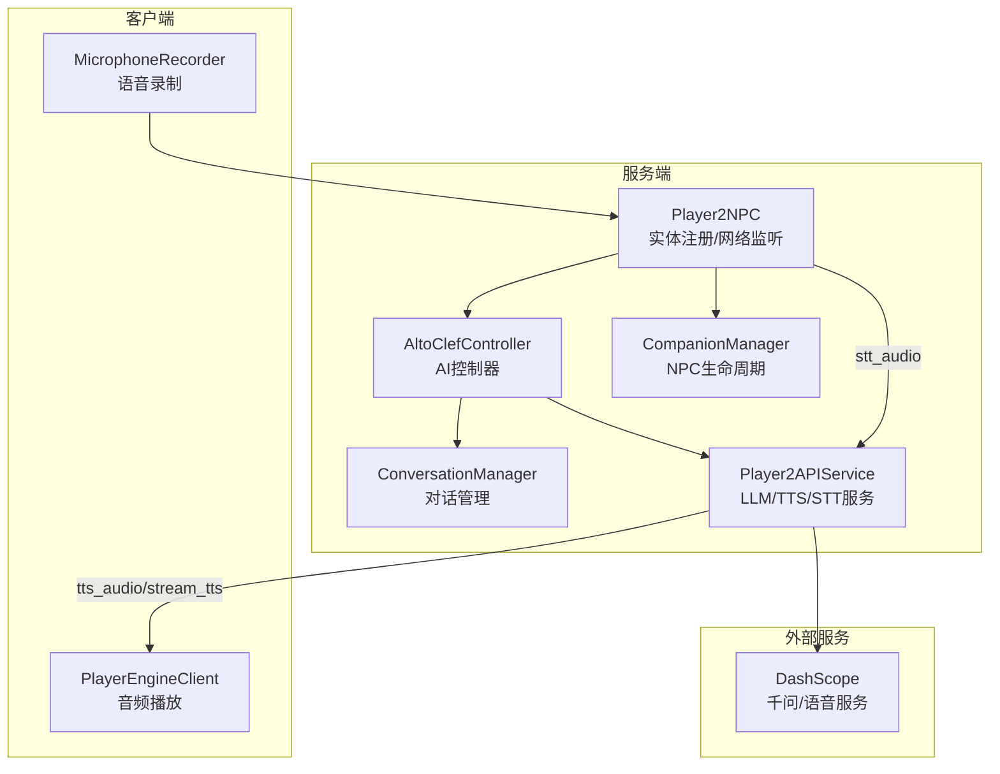
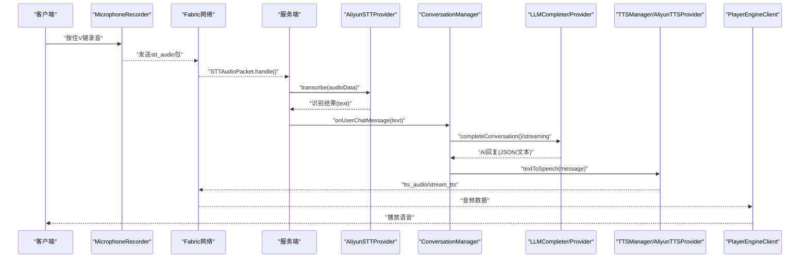
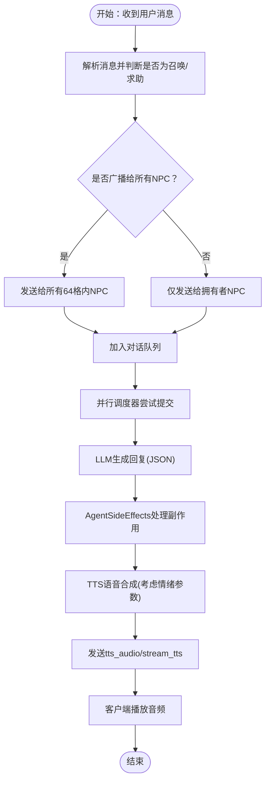
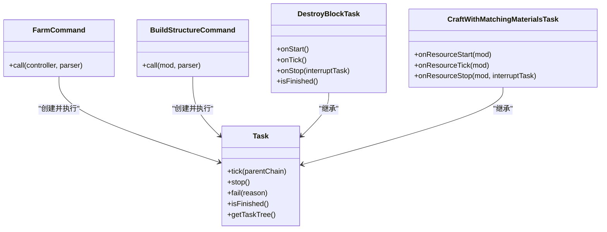
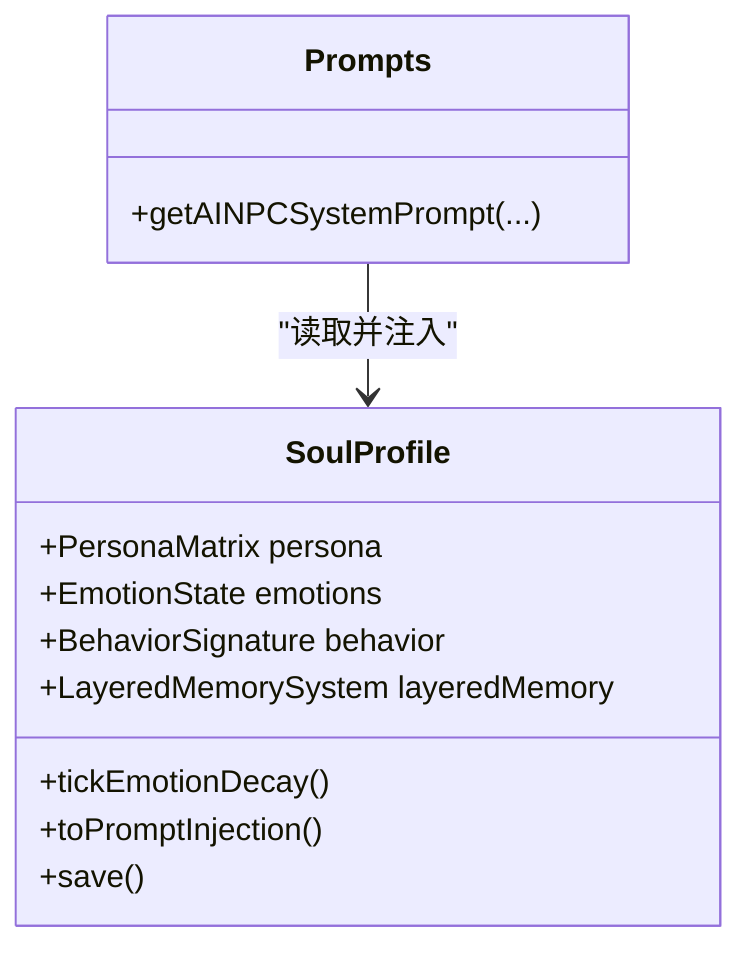
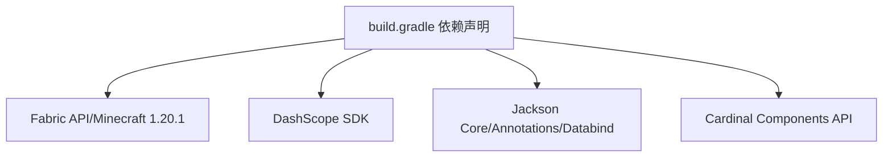

# 项目概述

<cite>
**本文引用的文件**
- [README.md](file://README.md)
- [Player2NPC.java](file://src/main/java/com/goodbird/player2npc/Player2NPC.java)
- [fabric.mod.json](file://src/main/resources/fabric.mod.json)
- [build.gradle](file://build.gradle)
- [AltoClefController.java](file://src/main/java/adris/altoclef/AltoClefController.java)
- [Task.java](file://src/main/java/adris/altoclef/tasksystem/Task.java)
- [CompanionManager.java](file://src/main/java/com/goodbird/player2npc/companion/CompanionManager.java)
- [ConversationManager.java](file://src/main/java/adris/altoclef/player2api/manager/ConversationManager.java)
- [Player2APIService.java](file://src/main/java/adris/altoclef/player2api/Player2APIService.java)
- [playerengine-llm-default.json](file://src/main/resources/playerengine-llm-default.json)
- [npc-roster.json](file://src/main/resources/npc-roster.json)
- [Prompts.java](file://src/main/java/adris/altoclef/player2api/Prompts.java)
- [SoulProfile.java](file://src/main/java/adris/altoclef/player2api/soul/SoulProfile.java)
- [FarmCommand.java](file://src/main/java/adris/altoclef/commands/FarmCommand.java)
- [BuildStructureCommand.java](file://src/main/java/adris/altoclef/commands/BuildStructureCommand.java)
- [DestroyBlockTask.java](file://src/main/java/adris/altoclef/tasks/construction/DestroyBlockTask.java)
- [CraftWithMatchingMaterialsTask.java](file://src/main/java/adris/altoclef/tasks/resources/CraftWithMatchingMaterialsTask.java)
</cite>

## 目录
1. [简介](#简介)
2. [项目结构](#项目结构)
3. [核心组件](#核心组件)
4. [架构总览](#架构总览)
5. [详细组件分析](#详细组件分析)
6. [依赖分析](#依赖分析)
7. [性能考量](#性能考量)
8. [故障排查指南](#故障排查指南)
9. [结论](#结论)
10. [附录](#附录)

## 简介
PlayerEngine + AI NPC 是一款基于 Fabric API 的 Minecraft 1.20.1 服务器端模组，集成了 AI NPC 伙伴系统、自然语言对话、双向语音交互（语音转文字与语音合成）以及强大的任务执行能力。项目以 PlayerEngine（Baritone 分支）为核心，结合 Altoclef 寻路与任务系统，使 NPC 能够理解并执行多种游戏指令，同时具备个性化“灵魂系统”，支持情绪、记忆与关系等多维人格塑造。

- 核心价值与目标
  - 以 LLM 驱动的 NPC 伙伴：自然语言对话、指令解析与执行、任务编排与执行。
  - 双向语音交互：支持阿里云 Gummy 语音识别（STT）与 CosyVoice 语音合成（TTS），实现“你说我听、我说你听”的沉浸式互动。
  - 30+ 种游戏指令与任务：涵盖采集、建造、战斗、移动、资源管理、速通等，满足多样化玩法需求。
  - 个性化灵魂系统：基于五大人格维度与情绪引擎，NPC 具备稳定的人格特征与动态情感表达，提升代入感与真实感。
  - 可插拔 LLM Provider：默认接入阿里云 DashScope（千问），亦可接入 OpenAI、本地 Ollama 或远程服务，便于扩展与迁移。

- 技术架构背景
  - 基于 Fabric API 与 Minecraft 1.20.1，使用 Cardinal Components API（CCA）进行玩家组件扩展。
  - 集成 Baritone 寻路引擎，提供高效路径规划与复杂动作序列执行。
  - 服务端负责对话管理、LLM 调用与任务调度，客户端负责语音播放与 UI 交互。
  - 通过 Fabric 网络包实现服务端与客户端之间的消息与音频传输。

- 应用场景与价值
  - 单人/多人生存：NPC 作为随从协助采集、建造、战斗与探索。
  - 教育与演示：展示 LLM 与游戏 AI 的融合，提供可扩展的智能体框架。
  - 创作与剧本：通过指令与灵魂系统，打造具有个性与记忆的 NPC 角色，支撑剧情与互动。

- 差异化优势
  - 一体化语音链路：STT/TTS 与 LLM 深度集成，支持实时语音输入与情感化语音输出。
  - 任务系统成熟：基于 Altoclef 的任务体系，覆盖广泛玩法，易于扩展与维护。
  - 灵魂系统：将人格、情绪、记忆与关系纳入 NPC 决策，显著提升行为一致性与表现力。
  - 可插拔 Provider：灵活适配不同 LLM 服务，兼顾成本与性能。

**章节来源**
- [README.md:1-12](file://README.md#L1-L12)
- [README.md:397-491](file://README.md#L397-L491)

## 项目结构
项目采用模块化与分层设计，核心分为三部分：
- com/goodbird/player2npc：NPC 实体、网络通信与客户端音频处理。
- adris/altoclef：AI 控制器、任务系统、对话管理、LLM/TTS/STT 服务层。
- baritone：寻路与路径规划核心。

**图表来源**
- [Player2NPC.java:48-66](file://src/main/java/com/goodbird/player2npc/Player2NPC.java#L48-L66)
- [AltoClefController.java:101-152](file://src/main/java/adris/altoclef/AltoClefController.java#L101-L152)
- [ConversationManager.java:27-90](file://src/main/java/adris/altoclef/player2api/manager/ConversationManager.java#L27-L90)
- [Player2APIService.java:35-46](file://src/main/java/adris/altoclef/player2api/Player2APIService.java#L35-L46)
- [CompanionManager.java:28-175](file://src/main/java/com/goodbird/player2npc/companion/CompanionManager.java#L28-L175)

**章节来源**
- [fabric.mod.json:17-29](file://src/main/resources/fabric.mod.json#L17-L29)
- [build.gradle:43-69](file://build.gradle#L43-L69)

## 核心组件
- Player2NPC（服务端入口）
  - 注册 NPC 实体类型与网络包 ID，监听全局网络事件（生成/销毁请求、STT 音频包），并在玩家连接/断开时管理 NPC 生命周期。
- AltoClefController（AI 控制器）
  - 组织任务系统、命令执行器、追踪器与行为链，负责 NPC 的日常生存监控、自动进食与求助机制，并初始化 AI 持久化数据与 LLM 服务。
- ConversationManager（对话管理）
  - 捕获聊天消息，过滤并分发给对应 NPC，支持“召唤关键词”广播与距离限制，调度 LLM 处理与 TTS 播放。
- Player2APIService（服务层）
  - 负责 LLM 对话完成、流式响应、TTS 语音合成与 STT 启动/停止，同时维持心跳与容错。
- CompanionManager（NPC 生命周期）
  - 基于 CCA 组件管理玩家与 NPC 的关联，支持异步拉取角色列表、生成/传送/解散 NPC。
- 任务系统（Task/TaskChain）
  - 以 Task 为基本单元，支持嵌套与中断，配合 TaskRunner 驱动执行，与 Baritone 寻路紧密集成。

**章节来源**
- [Player2NPC.java:25-66](file://src/main/java/com/goodbird/player2npc/Player2NPC.java#L25-L66)
- [AltoClefController.java:53-152](file://src/main/java/adris/altoclef/AltoClefController.java#L53-L152)
- [ConversationManager.java:27-190](file://src/main/java/adris/altoclef/player2api/manager/ConversationManager.java#L27-L190)
- [Player2APIService.java:35-274](file://src/main/java/adris/altoclef/player2api/Player2APIService.java#L35-L274)
- [CompanionManager.java:28-191](file://src/main/java/com/goodbird/player2npc/companion/CompanionManager.java#L28-L191)
- [Task.java:8-181](file://src/main/java/adris/altoclef/tasksystem/Task.java#L8-L181)

## 架构总览
系统采用“服务端 AI + 客户端渲染/音频”的分层架构，通过 Fabric 网络包实现跨端通信。语音链路由客户端麦克风采集，经网络包发送至服务端 STT，再由 LLM 生成回复，最后通过 TTS 将音频回传客户端播放。

**图表来源**
- [Player2NPC.java:52-54](file://src/main/java/com/goodbird/player2npc/Player2NPC.java#L52-L54)
- [Player2APIService.java:120-231](file://src/main/java/adris/altoclef/player2api/Player2APIService.java#L120-L231)
- [ConversationManager.java:114-189](file://src/main/java/adris/altoclef/player2api/manager/ConversationManager.java#L114-L189)

**章节来源**
- [README.md:496-529](file://README.md#L496-L529)

## 详细组件分析

### 语音交互链路（STT/TTS）
- STT 流程
  - 客户端检测按键状态，录音并打包为 stt_audio 网络包发送至服务端。
  - 服务端接收后调用 AliyunSTTProvider 进行识别，返回文本并注入对话队列。
- TTS 流程
  - LLM 生成回复后，通过 Player2APIService 调用 TTS，根据 NPC 情绪动态调整语速与音调，回传音频数据并通过网络包发送至客户端播放。

**图表来源**
- [ConversationManager.java:114-189](file://src/main/java/adris/altoclef/player2api/manager/ConversationManager.java#L114-L189)
- [Player2APIService.java:120-231](file://src/main/java/adris/altoclef/player2api/Player2APIService.java#L120-L231)

**章节来源**
- [README.md:354-394](file://README.md#L354-L394)
- [README.md:430-441](file://README.md#L430-L441)

### NPC 生命与对话管理
- NPC 生命周期
  - 基于 CCA 组件记录玩家与 NPC 的映射，支持异步拉取角色列表、生成/传送/解散 NPC。
- 对话队列与优先级
  - 按 NPC 与玩家距离与优先级排序，避免并发冲突；支持“召唤关键词”广播，便于紧急求助。

**章节来源**
- [CompanionManager.java:45-175](file://src/main/java/com/goodbird/player2npc/companion/CompanionManager.java#L45-L175)
- [ConversationManager.java:55-139](file://src/main/java/adris/altoclef/player2api/manager/ConversationManager.java#L55-L139)

### 任务系统与寻路
- 任务抽象
  - Task 提供 onStart/onTick/onStop 生命周期与中断机制，支持嵌套子任务与超时控制。
- 典型任务示例
  - 农场任务（FarmTask）：围绕玩家范围自动耕种。
  - 建造任务（BuildStructureTask）：根据描述与坐标执行结构建造。
  - 破坏方块（DestroyBlockTask）：调用 Baritone BuilderProcess 清理区域。
  - 资源合成（CraftWithMatchingMaterialsTask）：匹配材料并合成目标物品。

**图表来源**
- [Task.java:8-181](file://src/main/java/adris/altoclef/tasksystem/Task.java#L8-L181)
- [FarmCommand.java:12-28](file://src/main/java/adris/altoclef/commands/FarmCommand.java#L12-L28)
- [BuildStructureCommand.java:10-28](file://src/main/java/adris/altoclef/commands/BuildStructureCommand.java#L10-L28)
- [DestroyBlockTask.java:9-59](file://src/main/java/adris/altoclef/tasks/construction/DestroyBlockTask.java#L9-L59)
- [CraftWithMatchingMaterialsTask.java:15-127](file://src/main/java/adris/altoclef/tasks/resources/CraftWithMatchingMaterialsTask.java#L15-L127)

**章节来源**
- [FarmCommand.java:12-28](file://src/main/java/adris/altoclef/commands/FarmCommand.java#L12-L28)
- [BuildStructureCommand.java:10-28](file://src/main/java/adris/altoclef/commands/BuildStructureCommand.java#L10-L28)
- [DestroyBlockTask.java:9-59](file://src/main/java/adris/altoclef/tasks/construction/DestroyBlockTask.java#L9-L59)
- [CraftWithMatchingMaterialsTask.java:15-127](file://src/main/java/adris/altoclef/tasks/resources/CraftWithMatchingMaterialsTask.java#L15-L127)

### 灵魂系统与 Prompt 注入
- 灵魂档案（SoulProfile）
  - 包含五大人格维度、初始情绪、行为签名、记忆锚点与关系档案，支持持久化保存与情绪自然衰减。
- Prompt 注入层次
  - System Prompt 层：完整灵魂状态注入。
  - User Message 层：基于主导情绪的简短提醒。
  - Emotion Guidance 层：基于情绪生成语气指导，增强回复的情感一致性。

**图表来源**
- [SoulProfile.java:34-163](file://src/main/java/adris/altoclef/player2api/soul/SoulProfile.java#L34-L163)
- [Prompts.java:10-88](file://src/main/java/adris/altoclef/player2api/Prompts.java#L10-L88)

**章节来源**
- [SoulProfile.java:34-163](file://src/main/java/adris/altoclef/player2api/soul/SoulProfile.java#L34-L163)
- [Prompts.java:10-88](file://src/main/java/adris/altoclef/player2api/Prompts.java#L10-L88)

## 依赖分析
- Fabric 与 Minecraft
  - 依赖 Fabric Loader 与 Fabric API，目标版本为 Minecraft 1.20.1，使用 Parchment 映射。
- 第三方 SDK
  - DashScope SDK（阿里云）：提供 LLM、STT、TTS 能力。
  - Jackson：JSON 序列化与反序列化。
- 组件扩展
  - Cardinal Components API（CCA）：为玩家与世界提供组件化扩展，支持 NPC 生命周期管理。

**图表来源**
- [build.gradle:43-69](file://build.gradle#L43-L69)

**章节来源**
- [build.gradle:43-69](file://build.gradle#L43-L69)
- [fabric.mod.json:33-46](file://src/main/resources/fabric.mod.json#L33-L46)

## 性能考量
- 异步与并行
  - 对话调度采用并行 LLM 调度器，避免阻塞主线程；TTS 合成与网络传输分离，降低延迟。
- 资源与内存
  - 任务系统支持中断与清理，防止长时间任务占用资源；Baritone 寻路过程可被高优先级行为打断。
- 网络与带宽
  - STT/TTS 采用流式传输与压缩策略，尽量减少带宽占用；服务端对音频长度与质量进行校验，避免无效请求。
- 配置优化
  - 通过配置文件调节 LLM 温度、最大 token、TTS 语速/音调与 STT 语言，平衡效果与性能。

[本节为通用建议，无需特定文件引用]

## 故障排查指南
- 常见问题定位
  - API Key 无效：检查配置文件中的 API Key 是否正确，查看日志中 LLM/语音服务相关输出。
  - 语音识别为空：确认录音时长与麦克风权限，检查 STT 语言设置与服务可用性。
  - NPC 无声：检查 TTS 配置与 DashScope CosyVoice 权限，确认网络连通性。
  - 距离过远：确保 NPC 与玩家距离在 64 格以内，避免消息无法到达。
- 关键日志关键词
  - LLM 配置加载、路由到提供商、完成对话、TTS 合成、TTS 成功、PTT 录音开始/结束、STT 识别结果等。

**章节来源**
- [README.md:456-491](file://README.md#L456-L491)

## 结论
PlayerEngine + AI NPC 将 LLM、Baritone 寻路与 Fabric 生态有机结合，提供了高度可定制的 AI NPC 伙伴解决方案。其语音链路、任务系统与灵魂系统共同构成了完整的智能体框架，既适合个人娱乐，也可作为教学与创作的基础设施。通过可插拔的 Provider 与模块化的组件设计，项目具备良好的扩展性与可持续演进空间。

[本节为总结性内容，无需特定文件引用]

## 附录
- 配置文件总览
  - LLM/TTS/STT 主配置：playerengine-llm-default.json
  - NPC 角色列表：npc-roster.json
- 角色示例
  - 琪琪（忠诚守卫）、瑞瑞（热情商人）、西西（博学学者），具备不同的人格与初始情绪，可作为 NPC 的模板与扩展起点。

**章节来源**
- [playerengine-llm-default.json:1-89](file://src/main/resources/playerengine-llm-default.json#L1-L89)
- [npc-roster.json:1-54](file://src/main/resources/npc-roster.json#L1-L54)